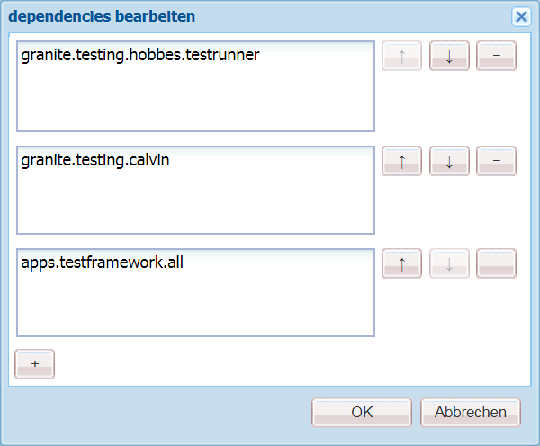
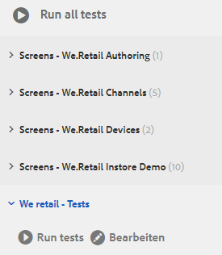
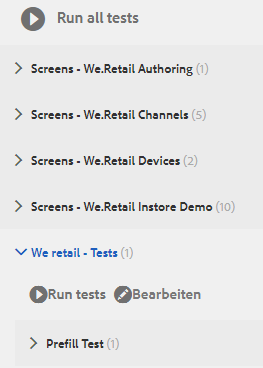
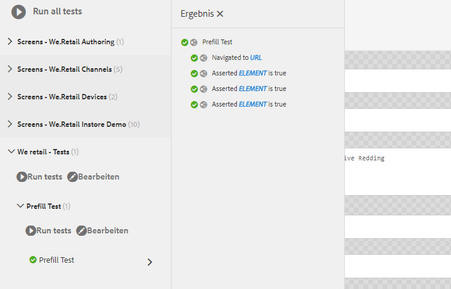

# Tutorial: Testen des adaptiven Formulars {#tutorial-testing-your-adaptive-form}


Diese Schulung ist ein Schritt in der Serie [Erstellen Sie Ihr erstes adaptives Formular](https://helpx.adobe.com/de/experience-manager/6-3/forms/using/create-your-first-adaptive-form.html). Es wird empfohlen, der Serie in chronologischer Reihenfolge zu folgen, um den vollständigen Anwendungsfall zu verstehen, auszuführen und zu demonstrieren.

Nachdem das adaptive Formular fertig ist, müssen Sie Ihr adaptives Formular testen, bevor Sie es an die Endbenutzer übertragen. Sie können jedes Feld manuell testen (funktionale Tests) oder automatisieren das Testen Ihres adaptiven Formulars. Wenn Sie mehrere adaptive Formulare haben, wird das manuelle Testen jedes Felds aller adaptiven Formulare zu einer gewaltigen Aufgabe.

AEM [!DNL Forms] stellen Sie ein Test-Framework, Calvin, um das Testen Ihrer adaptiven Formulare zu automatisieren. Mit diesem Framework können Sie Tests der Benutzeroberfläche direkt in einem Webbrowser schreiben und ausführen. Das Framework stellt JavaScript-APIs zum Erstellen von Tests bereit. Mithilfe automatisierter Tests können Sie das Erlebnis beim Vorausfüllen eines adaptiven Formulars, das Sendeerlebnis eines adaptiven Formulars, Ausdrucksregeln, von Überprüfungen, verzögertem Laden und Benutzeroberflächeninteraktionen testen. Dieses Tutorial führt Sie durch die Schritte zum Erstellen und Ausführen automatisierter Tests für ein adaptives Formular. Am Ende dieser Schulung können Sie Folgendes:

* [Erstellen einer Testsuite für Ihr adaptives Formular](../../forms/using/testing-your-adaptive-form.md#step-create-a-test-suite)
* [Erstellen von Tests für Ihr adaptives Formular](../../forms/using/testing-your-adaptive-form.md#step-create-a-test-case-to-prefill-values-in-an-adaptive-form)
* [Testsuite und Tests ausführen, die für Ihr adaptives Formular erstellt wurden](#step-run-all-the-tests-in-a-suite-or-individual-tests-cases)

## Schritt 1: Erstellen einer Testsuite {#step-create-a-test-suite}

Test-Suites verfügen über eine Sammlung von Testfällen. Sie können über mehrere Test-Suites verfügen. Es wird empfohlen, für jedes Formular eine separate Testsuite zu verwenden. So erstellen Sie eine Testsuite:

1. Melden Sie sich bei AEM [!DNL Forms] Autoreninstanz in als Administrator an. Öffnen Sie [!UICONTROL CRXDE Lite]. Sie können auf AEM Logo > **[!UICONTROL Tools]** > **[!UICONTROL Allgemein]** > **[!UICONTROL CRXDE Lite]** tippen oder die URL [https://localhost:4502/crx/de/index.jsp](https://localhost:4502/crx/de/index.jsp) in einem Browser öffnen, um die CRXDE Lite zu öffnen.

1. Navigieren Sie unter [!UICONTROL CRXDE Lite] zu /etc/clientlibs . Klicken Sie mit der rechten Maustaste auf den Unterordner /etc/clientlibs und dann auf **[!UICONTROL Erstellen]** > **[!UICONTROL Knoten erstellen]**. Geben Sie im Feld **[!UICONTROL Name]** **WeRetailFormTestCases** ein. Wählen Sie den Typ **cq:ClientLibraryFolder** aus und klicken Sie auf **[!UICONTROL OK]**. Es wird ein Knoten erstellt. Sie können einen beliebigen Namen anstelle von `WeRetailFormTestCases` verwenden.
1. Fügen Sie die folgenden Eigenschaften zum Knoten `WeRetailFormTestCases` hinzu und tippen Sie auf **[!UICONTROL ALL]** speichern.

   <table>
    <tbody>
     <tr>
      <td><strong>Eigenschaft</strong></td>
      <td><strong>Typ</strong></td>
      <td><strong>Multi</strong></td>
      <td><strong>Wert</strong></td>
     </tr>
     <tr>
      <td>categories</td>
      <td>Zeichenfolge</td>
      <td>Aktiviert</td>
      <td>
       <ul>
        <li>granite.testing.hobbes.tests<br /> </li>
        <li>granite.testing.calvin.tests</li>
       </ul> </td>
     </tr>
     <tr>
      <td>dependencies</td>
      <td>Zeichenfolge</td>
      <td>Aktiviert</td>
      <td>
       <ul>
        <li>granite.testing.hobbes.testrunner <br /> </li>
        <li>granite.testing.calvin <br /> </li>
        <li>apps.testframework.all</li>
       </ul> </td>
     </tr>
    </tbody>
   </table>

   Stellen Sie sicher, dass jede Eigenschaft einem separaten Feld hinzugefügt wird, wie unten dargestellt:

   

1. Klicken Sie mit der rechten Maustaste auf den Knoten **[!UICONTROL WeRetailFormTestCases]** und klicken Sie auf **[!UICONTROL Erstellen]** > **[!UICONTROL Datei erstellen]**. Geben Sie im Feld **[!UICONTROL Name]** `js.txt` ein und klicken Sie auf **[!UICONTROL OK]**.
1. Öffnen Sie die Datei js.txt zur Bearbeitung, fügen Sie den folgenden Code hinzu und speichern Sie die Datei:

   ```text
   #base=.
    init.js
   ```

1. Erstellen Sie eine Datei init.js im Knoten `WeRetailFormTestCases`. Fügen Sie den folgenden Code zur Datei hinzu und tippen Sie auf **[!UICONTROL Alle speichern]**.

   ```javascript
   (function(window, hobs) {
       'use strict';
       window.testsuites = window.testsuites || {};
     // Registering the test form suite to the sytem
     // If there are other forms, all registration should be done here
       window.testsuites.testForm3 = new hobs.TestSuite("We retail - Tests", {
           path: '/etc/clientlibs/WeRetailFormTestCases/init.js',
           register: true
       });
    // window.testsuites.testForm2 = new hobs.TestSuite("testForm2");
   }(window, window.hobs));
   ```

   Der obige Code erstellt eine Test-Suite mit dem Namen **We retail - Tests**.

1. Öffnen Sie AEM Testbenutzeroberfläche (AEM > **[!UICONTROL Tools]** > **[!UICONTROL Vorgänge]** > **[!UICONTROL Testen]**). Die Test-Suite - **We retail - Tests** - ist in der Benutzeroberfläche aufgelistet.

   

## Schritt 2: Erstellen Sie einen Testfall, um Werte in einem adaptiven Formular vorab auszufüllen {#step-create-a-test-case-to-prefill-values-in-an-adaptive-form}

Ein Testfall ist eine Reihe von Aktionen zum Testen einer bestimmten Funktion. Beispielsweise das Vorausfüllen aller Felder eines Formulars und die Validierung einiger Felder, um sicherzustellen, dass die richtigen Werte eingegeben werden.

Eine Aktion ist eine bestimmte Aktivität in einem adaptiven Formular, z. B. das Klicken auf eine Schaltfläche. So erstellen Sie einen Testfall und Aktionen, um die Benutzereingabe für jedes adaptive Formularfeld zu überprüfen:

1. Navigieren Sie in [!UICONTROL CRXDE Lite] zum Ordner `/content/forms/af/create-first-adaptive-form` . Klicken Sie mit der rechten Maustaste auf den Ordnerknoten **[!UICONTROL create-first-adaptive-form]** und klicken Sie auf **[!UICONTROL Erstellen]**> **[!UICONTROL Datei erstellen]**. Geben Sie im Feld **[!UICONTROL Name]** `prefill.xml` ein und klicken Sie auf **[!UICONTROL OK]**. Fügen Sie der Datei den folgenden Code hinzu:

   ```xml
   <?xml version="1.0" encoding="UTF-8"?><afData>
     <afUnboundData>
       <data>
         <customer_ID>371767</customer_ID>
         <customer_Name>John Jacobs</customer_Name>
         <customer_Shipping_Address>1657 1657 Riverside Drive Redding</customer_Shipping_Address>
         <customer_State>California</customer_State>
         <customer_ZIPCode>096001</customer_ZIPCode>
        </data>
     </afUnboundData>
     <afBoundData>
       <data xmlns:xfa="https://www.xfa.org/schema/xfa-data/1.0/"/>
     </afBoundData>
   </afData>
   ```

1. Navigieren Sie zu `/etc/clientlibs`. Klicken Sie mit der rechten Maustaste auf den Unterordner `/etc/clientlibs` und klicken Sie auf **[!UICONTROL Erstellen]** **[!UICONTROL Knoten erstellen]**.

   Geben Sie im Feld **[!UICONTROL Name]** `WeRetailFormTests` ein. Wählen Sie den Typ als `cq:ClientLibraryFolder` aus und klicken Sie auf **[!UICONTROL OK]**.

1. Fügen Sie die folgenden Eigenschaften zum Knoten **[!UICONTROL WeRetailFormTests]** hinzu.

   <table>
    <tbody>
     <tr>
      <td><strong>Eigenschaft</strong></td>
      <td><strong>Typ</strong></td>
      <td><strong>Multi</strong></td>
      <td><strong>Wert</strong></td>
     </tr>
     <tr>
      <td>categories</td>
      <td>Zeichenfolge</td>
      <td>Aktiviert</td>
      <td>
       <ul>
        <li>granite.testing.hobbes.tests<br /> </li>
        <li>granite.testing.hobbes.tests.testForm</li>
       </ul> </td>
     </tr>
     <tr>
      <td>dependencies</td>
      <td>Zeichenfolge</td>
      <td>Aktiviert</td>
      <td>
       <ul>
        <li>granite.testing.calvin.tests</li>
       </ul> </td>
     </tr>
     </tbody>
   </table>

1. Erstellen Sie eine Datei, js.txt, im Knoten **[!UICONTROL WeRetailFormTests]** . Fügen Sie der Datei den folgenden hinzu:

   ```shell
   #base=.
   prefillTest.js
   ```

   Klicken Sie auf **[!UICONTROL Alle speichern]**.

1. Erstellen Sie eine Datei `prefillTest.js` im Knoten **[!UICONTROL WeRetailFormTests]** . Fügen Sie der Datei den folgenden Code hinzu. Der Code erstellt einen Testfall. Der Testfall füllt alle Felder eines Formulars im Voraus aus und validiert einige Felder, um sicherzustellen, dass korrekte Werte eingegeben werden.

   ```javascript
   (function (window, hobs) {
       'use strict';
   
       var ts = new hobs.TestSuite("Prefill Test", {
           path: '/etc/clientlibs/WeRetailFormTests/prefillTest.js',
           register: false
       })
   
       .addTestCase(new hobs.TestCase("Prefill Test")
           // navigate to the testForm which is to be test
           .navigateTo("/content/forms/af/create-first-adaptive-form/shipping-address-add-update-form.html?wcmmode=disabled&dataRef=crx:///content/forms/af/create-first-adaptive-form/prefill.xml")
           // check if adaptive form is loaded
           .asserts.isTrue(function () {
               return calvin.isFormLoaded()
           })
           .asserts.isTrue(function () {
               return calvin.model("customer_ID").value == 371767;
           })
           .asserts.isTrue(function () {
               return calvin.model("customer_ZIPCode").value == 96001;
           })
       );
   
       // register the test suite with testForm
       window.testsuites.testForm3.add(ts);
   
   }(window, window.hobs));
   ```

   Der Testfall wird erstellt und kann ausgeführt werden. Sie können Testfälle erstellen, um verschiedene Aspekte eines adaptiven Formulars zu validieren, z. B. die Ausführung des Berechnungsskripts, die Validierung von Mustern und die Validierung der Sendeerfahrung eines adaptiven Formulars. Informationen zu verschiedenen Aspekten des Testens adaptiver Formulare finden Sie unter Automatisieren des Testens adaptiver Formulare.

## Schritt 3: Führen Sie alle Tests in einer Suite oder einzelnen Testfällen aus {#step-run-all-the-tests-in-a-suite-or-individual-tests-cases}

Eine Test-Suite kann mehrere Testfälle aufweisen. Sie können alle Testfälle in einer Test-Suite gleichzeitig oder einzeln ausführen. Wenn Sie einen Test ausführen, zeigen die Symbole die Ergebnisse an:

* Ein Häkchen-Symbol zeigt einen bestanden Test an: 
* Ein X-Symbol weist auf einen fehlgeschlagenen Test hin: 

1. Navigieren Sie zu AEM Symbol > **[!UICONTROL Tools]** **[!UICONTROL Vorgänge]** **[!UICONTROL Tests]**
1. So führen Sie alle Tests der Test Suite aus:

   1. Tippen Sie im Bedienfeld [!UICONTROL Tests] auf **[!UICONTROL We retail - Tests (1)]**. Die Suite wird erweitert, um eine Liste mit Tests anzuzeigen.
   1. Tippen Sie auf die Schaltfläche **[!UICONTROL Ausführen von Tests]** . Der leere Bereich auf der rechten Bildschirmseite wird durch ein adaptives Formular ersetzt, während der Test ausgeführt wird.

      

1. So führen Sie einen einzelnen Test über die Test Suite aus:

   1. Tippen Sie im Testfenster auf **[!UICONTROL We retail - Tests (1)]**. Die Suite wird erweitert, um eine Liste mit Tests anzuzeigen.
   1. Tippen Sie auf **[!UICONTROL Vorbefüllungstest]** und dann auf die Schaltfläche **[!UICONTROL Ausführen von Tests]** . Der leere Bereich auf der rechten Bildschirmseite wird durch ein adaptives Formular ersetzt, während der Test ausgeführt wird.

1. Tippen Sie auf den Testnamen Vorbefüllungstest , um die Ergebnisse des Testfalls zu überprüfen. Dadurch wird der Bereich [!UICONTROL Ergebnis] geöffnet. Tippen Sie im Bedienfeld [!UICONTROL Ergebnis] auf den Namen Ihres Testfalls, um alle Details des Tests anzuzeigen.

   

Jetzt kann das adaptive Formular veröffentlicht werden.
