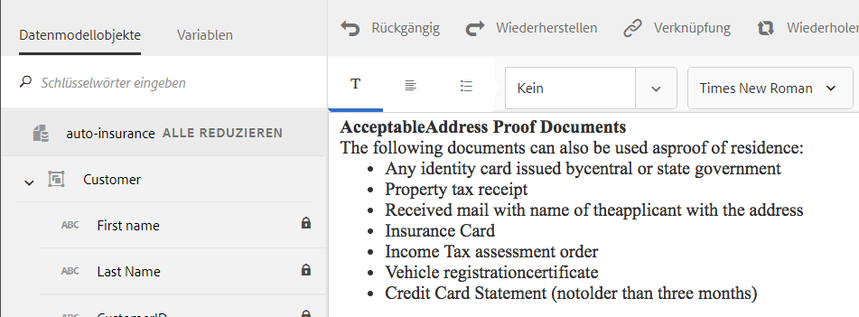

# Texte in interaktiver Kommunikation{#texts-in-interactive-communications}

## Überblick {#overview}

Ein Textdokument besteht aus einem oder mehreren Textabsätzen. Ein Absatz kann statisch oder dynamisch sein. Ein dynamischer Absatz kann Formulardatenmodelleigenschaften und -variablen enthalten. Sie können auch Regeln anwenden und innerhalb eines Textfragments wiederholen. Beispielsweise könnte der Kundenname in einer Begrüßung eine FDM-Eigenschaft (Form Data Model) sein, deren Wert zur Laufzeit verfügbar gemacht wird. Durch Änderung dieser Werte kann dieselbe interaktive Kommunikation verwendet werden, um die interaktive Kommunikation für verschiedene Kunden mithilfe der Agent-Benutzeroberfläche vorzubereiten.

Das Textfragment in Interaktiver Kommunikation unterstützt den folgenden Typ dynamischer Dokumente:

* **Datenmodellobjekte**: Die Dateneigenschaften verwenden eine Back-End-Datenquelle.
* **Regelbasierter Inhalt**: Teile des Inhalts in einem Text, die basierend auf einer Regel angezeigt oder ausgeblendet werden. Eine Regel kann auch auf den Eigenschaften und Variablen des Formulardatenmodells basieren.
* **Variablen**: Im Textdokumentfragment sind Variablen nicht an eine Backend-Datenquelle gebunden. Der Agent füllt/wählt Werte in Variablen aus oder bindet die Variablen an Datenquellen, während er die interaktive Kommunikation für das Senden an einen Nachbearbeitungsprozess vorbereitet.
* **Wiederholen**: Sie verfügen möglicherweise über dynamische Informationen in Ihrer interaktiven Kommunikation, z. B. Transaktionen in einem Kreditkartenauszug, deren Häufigkeit sich mit jeder generierten interaktiven Kommunikation ändern kann. Wenn Sie die Wiederholen-Funktion verwenden, können Sie solche dynamischen Daten formatieren und strukturieren. Weitere Informationen finden Sie unter [Inline-Bedingung und wiederholen](https://helpx.adobe.com/de/experience-manager/6-3/forms/using/cm-inline-condition.html).

## Text erstellen {#createtext}

1. Wählen Sie **[!UICONTROL Formulare]** > **[!UICONTROL Dokumentfragmente]**.
1. Wählen Sie **[!UICONTROL Erstellen]** > **[!UICONTROL Text]**.
1. Geben Sie die folgenden Daten an:

   * **[!UICONTROL Titel]**: (Optional) Geben Sie den Dokument für das Textfragment ein. Titel müssen nicht eindeutig sein und dürfen Sonderzeichen und nichtenglische Zeichen enthalten. Texte werden durch ihren Titel (falls verfügbar) wie etwa in Miniaturen und Eigenschaften referenziert.
   * **[!UICONTROL Name]**: Der eindeutige Name des Textes in einem Ordner. Es ist nicht möglich, dass zwei Dokumentfragmente (Text, Bedingung oder Liste) mit demselben Namen vorhanden sind, ungeachtet ihres jeweiligen Status. Im Feld „Name“ können Sie nur englische Sprachzeichen, Zahlen und Bindestriche eingeben. Das Feld „Name“ wird automatisch basierend auf dem Feld „Titel“ ausgefüllt. Die im Feld &quot;Titel&quot;eingegebenen Sonderzeichen, Leerzeichen, Zahlen und nichtenglischen Zeichen werden durch Bindestriche im Feld &quot;Name&quot;ersetzt. Obwohl der Wert im Feld „Titel“ automatisch in das Feld „Name“ kopiert wird, können Sie den Wert bearbeiten.

   * **[!UICONTROL Beschreibung]**: Geben Sie eine Beschreibung des Texts ein.
   * **[!UICONTROL Formulardatenmodell]**: Wählen Sie optional das Optionsfeld „Formulardatenmodell“ aus, um den Text basierend auf einem Formulardatenmodell zu erstellen. Wenn Sie auf die Optionsschaltfläche &quot;Formulardatenmodell&quot;klicken, wird das Feld **[!UICONTROL Formulardatenmodell]** angezeigt. Formulardatenmodell suchen und auswählen. Stellen Sie beim Erstellen des Texts für eine interaktive Kommunikation sicher, dass Sie dasselbe Datenmodell verwenden, das Sie in der interaktiven Kommunikation verwenden möchten. Weitere Informationen zum Formulardatenmodell finden Sie unter [Datenintegration](/help/forms/using/data-integration.md).

   * **[!UICONTROL Tags]**: Um optional einen benutzerdefinierten Tag zu erstellen, geben Sie einen Wert in das Textfeld ein und drücken Sie die Eingabetaste. Wenn Sie diesen Text speichern, werden die neu hinzugefügten Tags auch erstellt.

1. Tippen Sie auf **[!UICONTROL Weiter]**.

   Die Seite „Text erstellen“ wird angezeigt. Wenn Sie sich entschieden haben, einen formulardatenmodellbasierten Text zu erstellen, werden die Eigenschaften des Formulardatenmodells im linken Bereich angezeigt.

1. Geben Sie den Text ein und verwenden Sie die folgenden Optionen zum Formatieren, Konditionalisieren und Einfügen von Formulardatenmodelleigenschaften und -variablen in Ihren Text:

   * [Formulardatenmodell](#formdatamodel)
   * [Variablen](#variables)
   * [Regeleditor](#rules)
   * [Formatierungsoptionen](#formatting)

      * [Formatierten Text aus anderen Anwendungen kopieren/einfügen](#paste)

      * [Teile des Textes markieren](#highlight)
   * [Wiederholen](/help/forms/using/cm-inline-condition.md)
   * [Sonderzeichen](#special)
   * [Text suchen und ersetzen](#searching)
   * [Tastaturbefehle](/help/forms/using/keyboard-shortcuts.md)

   >[!NOTE]
   >
   >Sie können Formulardatenmodellelemente, Datenwörterbuchelemente und Variablen mit dem @-Symbol im Texteditor hinzufügen. Wenn Sie im Texteditor eine Zeichenfolge mit vorangestelltem @ eingeben, werden alle Datenmodellelemente, Datenwörterbuchelemente und Variablen durchsucht und Elemente oder Variablen mit der gesuchten Zeichenfolge angezeigt. Sie können durch die Suchergebnisse navigieren und ein Element oder eine Variable auswählen. Wenn kein übereinstimmendes Ergebnis vorliegt, wird die Meldung *Keine übereinstimmenden Ergebnisse gefunden* angezeigt.

1. Tippen Sie auf **[!UICONTROL Speichern]**.

   Der Text wird erstellt. Jetzt können Sie die Text als Baustein beim Erstellen einer interaktiven Kommunikation verwenden.

## Text bearbeiten {#edittext}

Sie können ein vorhandenes Textdokumentfragment mithilfe der folgenden Schritte bearbeiten. Sie können auch ein Textfragment aus einem Dokument in einem Interaktiven Kommunikationseditor bearbeiten.

1. Wählen Sie **[!UICONTROL Formulare]** > **[!UICONTROL Dokumentfragmente]**.
1. Navigieren Sie zu einem Textdokumentfragment und wählen Sie es aus.
1. Tippen Sie auf **[!UICONTROL Bearbeiten]**.
1. Nehmen Sie die erforderlichen Änderungen vor. Weitere Informationen zu Optionen im Text finden Sie unter [Text erstellen](#createtext).
1. Tippen Sie auf **[!UICONTROL Speichern]** und dann auf **[!UICONTROL Schließen]**.

## Personalisieren eines Textdokumentfragments mithilfe von Formulardatenmodelleigenschaften {#formdatamodel}

Sie können Textdokumentfragmente personalisieren, indem Sie die Formulardatenmodelleigenschaften einfügen. Durch Einfügen der Eigenschaften des Formulardatenmodells in den Text können Sie Empfänger-spezifische Daten aus der zugehörigen Datenquelle abrufen und ausfüllen, während Sie eine Vorschau der interaktiven Kommunikation anzeigen. Weitere Informationen zum Formulardatenmodell finden Sie unter [AEM Forms Data Integration](/help/forms/using/data-integration.md).

Wenn Sie beim Erstellen eines Textes ein Formulardatenmodell angegeben haben, werden die Eigenschaften im Formulardatenmodell im linken Bereich des Texteditors angezeigt. Das angegebene Formulardatenmodell sollte sowohl für das Textfeldfragment als auch für die interaktive Kommunikation, die das Dokument enthält, identisch sein.

* Um eine Formulardatenmodelleigenschaft in Text einzufügen, platzieren Sie den Cursor an der Stelle, an der Sie die Eigenschaft einfügen möchten. Wählen Sie dann die Eigenschaft **[A]** im linken Bereich aus, indem Sie darauf tippen, und tippen Sie auf **[!UICONTROL [B] Hinzufügen Ausgewählte]**. Sie können auch einfach mit der Dublette auf die Eigenschaft tippen, um sie an der Cursorposition **[C]** einzufügen. Die Eigenschaften des Formulardatenmodells werden in einer braunen Hintergrundfarbe hervorgehoben.

Alternativ dazu können Sie die Formulardatenmodelleigenschaft mit dem @-Symbol im Texteditor suchen und hinzufügen. Platzieren Sie den Cursor an der Stelle, an der Sie die Eigenschaft einfügen möchten. Geben Sie @ gefolgt von der Suchzeichenfolge ein. Der Suchvorgang wird mit allen Formulardatenmodelleigenschaften und -variablen durchgeführt, die im Dokument-Fragment verfügbar sind. Die Eigenschaften oder Variablen, die die Suchzeichenfolge enthalten, werden abgerufen und als Dropdown-Liste angezeigt. Navigieren Sie durch die Suchergebnisse und klicken Sie auf die Eigenschaft, die Sie an der Cursorposition einfügen möchten. Drücken Sie Esc, um die Suchergebnisse auszublenden.

* Um den Agenten zu ermöglichen, den Wert der Eigenschaft des Formulardatenmodells in der Benutzeroberfläche des Agenten zu bearbeiten, während [Interaktive Kommunikation](/help/forms/using/prepare-send-interactive-communication.md) mithilfe der Agent-Benutzeroberfläche vorbereiten und senden, tippen Sie auf das Sperrsymbol **[D]** für diese Eigenschaft und stellen Sie sicher, dass sie sich in einem nicht gesperrten Zustand befindet. Der Standardstatus der Eigenschaft ist gesperrt und ein Agent kann die Eigenschaft in der Benutzeroberfläche für Agenten nicht bearbeiten.

Sie können die Eigenschaften des Formulardatenmodells auch verwenden, um Regeln zum Anzeigen oder Ausblenden von Inhaltsbereichen zu erstellen. Weitere Informationen finden Sie unter [Regeln im Text erstellen](#rules).

## Erstellen und Verwenden von Variablen in einem Textdokumentfragment {#variables}

Variablen sind Platzhalter, die beim Erstellen einer interaktiven Kommunikation gebunden werden können. Variablen können an eine Formulardatenmodelleigenschaft oder ein Textfragment gebunden werden. Variablen können auch für den Agenten zum Befüllen übrig bleiben.

Sie können Variablen anstelle von Formulardatenmodelleigenschaften verwenden, wenn:

* Ein Textdokumentfragment wird in mehreren interaktive Kommunikationen verwendet, in denen die Bindung für verschiedene interaktive Kommunikationen unterschiedlich sein muss.
* Das Textdokumentfragment hat zum Zeitpunkt seiner Erstellung kein Formulardatenmodell. Sie können Variablen einfügen und später zum Zeitpunkt der Erstellung der interaktiven Kommunikation an die Eigenschaften des Formulardatenmodells binden.
* Sie müssen Text aus einem Textdokumentfragment binden und abrufen. Nur die Textdokumentfragmente können an Variablen gebunden werden, die keine Variablen enthalten.

Beim Erstellen oder Bearbeiten eines Textdokumentfragments können Sie Variablen erstellen und einfügen. Die von Ihnen erstellten Variablen werden auf der Registerkarte „Daten“ der Benutzeroberfläche des Agenten angezeigt. Der Agent gibt die Werte für die Variablen an, während [Interaktive Kommunikation mithilfe der Agent-Benutzeroberfläche](/help/forms/using/prepare-send-interactive-communication.md) vorbereiten und senden.

### Variablen erstellen {#createvariables}

1. Tippen Sie im linken Bereich auf **[!UICONTROL Variablen]**.

   Der Variablenbereich wird angezeigt.

   

1. Tippen Sie auf **[!UICONTROL Erstellen]**.

   Bereich „Variablen erstellen“ wird angezeigt.

1. Geben Sie die folgenden Informationen ein und tippen Sie auf **[!UICONTROL Erstellen]**:

   * **[!UICONTROL Name]** : Name der Variablen.
   * **[!UICONTROL Beschreibung]**: Geben Sie optional eine Beschreibung der Variablen ein.
   * **[!UICONTROL Typ]** : Wählen Sie einen Variablentyp aus: Zeichenfolge, Zahl, Boolescher Wert oder Datum.
   * **[!UICONTROL Nur bestimmte Werte zulassen]**: Bei Zeichenfolge- und Zahl-Variablen können Sie sicherstellen, dass der Agent aus einem bestimmten Satz von Werten für einen Platzhalter in der Agent-UI auswählt. Um den Satz von Werten anzugeben, wählen Sie diese Option und geben Sie dann kommagetrennte Werte an, die im Feld **[!UICONTROL Werte]** zulässig sind.

1. Tippen Sie auf **[!UICONTROL Erstellen]**.

   Die Variable wird erstellt und im Bereich „Variablen“ aufgelistet.

1. Um eine Variable in den Text einzufügen, platzieren Sie den Cursor an der entsprechenden Stelle, wählen Sie die Variable aus und tippen Sie auf **[!UICONTROL Ausgewählte hinzufügen]**.

   

   Variablen werden in hellblauer Hintergrundfarbe hervorgehoben, während Formulardatenmodelleigenschaften in einer bräunlichen Farbe hervorgehoben werden.

   Alternativ dazu können Sie Variablen mit dem @-Symbol im Texteditor suchen und hinzufügen. Platzieren Sie den Cursor an der Stelle, an der Sie die Variable einfügen möchten. Geben Sie @ gefolgt von der Suchzeichenfolge ein. Der Suchvorgang wird mit allen Formulardatenmodelleigenschaften und -variablen durchgeführt, die im Dokument-Fragment verfügbar sind. Die Eigenschaften und Variablen, die die Suchzeichenfolge enthalten, werden abgerufen und als Dropdown-Liste angezeigt. Navigieren Sie durch die Suchergebnisse und klicken Sie auf die Variable, die Sie an der Cursorposition einfügen möchten. Drücken Sie Esc, um die Suchergebnisse auszublenden.

1. Tippen Sie auf **[!UICONTROL Speichern]**.

## Erstellen von Regeln im Text {#rules}

Mit Regeleditor in einem Text können Sie Regeln erstellen, um Textzeichenfolgen oder Teile des Inhalts, die auf **Vorgabebedingungen** basieren, ein- oder ausblenden. Diese Bedingungen können basierend auf Folgendem erstellt werden:

* Zeichenfolgen
* Zahlen
* Mathematischer Ausdruck
* Datumswerte
* Eigenschaft des zugeordneten Formulardatenmodells
* Beliebige Variablen, die Sie im Text erstellt haben.

### Erstellen von Regeln im Text {#create-rules-in-text}

1. Wählen Sie beim Erstellen oder Bearbeiten eines Texts die Textzeichenfolge, den Absatz oder den Inhalt aus, die bzw. der mit der Regel konditioniert werden soll.

   

1. Tippen Sie auf **[!UICONTROL Regel erstellen]**.

   Das Dialogfeld zum Erstellen der Regel wird angezeigt. Zusätzlich zu Zeichenfolge, Zahl, mathematischem Ausdruck und Datum stehen im Regeleditor folgende Regeln zum Erstellen von Anweisungen der Regeln zur Verfügung:

   * Eigenschaft des zugeordneten Formulardatenmodells
   * Beliebige Variablen, die Sie erstellt haben.

   Wählen Sie die geeignete Option aus, die ausgewertet werden soll.

    

   >[!NOTE]
   >
   >Die Sammlungseigenschaft wird nicht zum Erstellen von Regeln unterstützt, mit denen Text angezeigt wird und Bedingungen festgelegt werden.

1. Wählen Sie den entsprechenden Operator aus, um die Regel auszuwerten, z. B. Gleich ist, Enthält und Beginnt mit.

   

1. Fügen Sie den auswertenden Ausdruck, den Wert, die Datenmodelleigenschaft oder die Variable ein.

   

   Regel, um den ausgewählten Text anzuzeigen, wenn der Standort des Empfängers gemäß den Quelldaten von FDM US ist

   * Beim Erstellen oder Bearbeiten einer Regel können Sie auch auf  (Größe ändern) tippen, um das Dialogfeld Regel erstellen/Regel bearbeiten zu erweitern. Der erweiterte Vollbildansichtsdialog ermöglicht Ihnen, Eigenschaften des Formulardatenmodells und Variablen mithilfe der Drag &amp; Drop-Funktion zu ziehen und einzufügen, um Regeln zu erstellen. Tippen Sie erneut auf „Größe ändern“, um zum Dialogfeld „Regel erstellen“ zurückzukehren.
   * Sie können auch mehrere Bedingungen in einer Regel erstellen.
   * Sie können auch überlappende Regeln erstellen, in denen eine Regel auf einen Teil eines Inhalts angewendet wird, auf den bereits eine Regel angewendet wurde.

1. Tippen Sie auf **[!UICONTROL Fertig]**.

   Die Regel wird angewendet. Der Text oder Inhalt, auf den die Regel angewendet wurde, wird grün hervorgehoben. Wenn Sie den Mauszeiger über den linken Ziehpunkt der Hervorhebung bewegen, wird die angewendete Regel angezeigt.

   

   Wenn Sie auf den linken Handler der angewendeten Regel klicken, erhalten Sie die Optionen zum Bearbeiten oder Entfernen der Regel.

## Text formatieren {#formatting}

Beim Erstellen oder Bearbeiten von Text ändert sich die Symbolleiste je nach dem Typ der Bearbeitung, die Sie wählen, um Folgendes zu machen: Absatz, Ausrichtung oder Auflistung:

Symbolleistentyp auswählen: Absatz, Ausrichtung oder Liste

Symbolleiste zum Bearbeiten der Schriftart

Ausrichtungs-Symbolleiste

Auflistungs-Symbolleiste

### Teile des Textes hervorheben  {#highlight}

Um Teile eines Textes in einem bearbeitbaren Dokumentfragment hervorzuheben, wählen Sie den Text aus und tippen Sie auf „Hervorhebungsfarbe“.

Sie können entweder direkt auf eine Grundfarbe `**[A]**` in der Palette &quot;Grundfarben&quot;tippen oder auf **Wählen Sie**, nachdem Sie den Schieberegler `**[B]**` verwendet haben, um die entsprechende Farbschattierung auszuwählen.

Optional können Sie auch auf der Registerkarte &quot;Erweitert&quot;die gewünschte Farbe für Farbton, Helligkeit und Sättigung `**[C]**` auswählen, um die exakte Farbe zu erstellen, und dann auf `**[D]**` tippen, um die Farbe anzuwenden und den Text zu markieren.

### Formatierten Text einfügen {#paste}

Um einen anderen Textabsatz wiederzuverwenden, der in einer anderen Anwendung, z. B. auf Microsoft® Word oder HTML-Seiten vorhanden ist, kopieren Sie den Text in den Texteditor. Die Formatierung des kopierten Textes wird im Texteditor beibehalten.

Sie können einen Textabsatz oder mehrere in ein bearbeitbares Textdokumentfragment kopieren. Beispielsweise haben Sie ein Microsoft® Word-Dokument mit einer Liste mit Aufzählungszeichen mit Aufenthaltsnachweisen:

Sie können den Text direkt aus dem Microsoft® Word-Dokument in ein bearbeitbares Textdokumentfragment kopieren. Die Formatierung wie die Liste mit Aufzählungszeichen, die Schriftart und Textfarbe wird im Textdokumentfragment beibehalten.

>[!NOTE]
>
>Die Formatierung des eingefügten Textes hat jedoch einige[ Einschränkungen](https://helpx.adobe.com/aem-forms/kb/cm-copy-paste-text-limitations.html).

## Sonderzeichen in Text einfügen {#special}

Fügen Sie ggf. Sonderzeichen in das Dokumentfragment ein. Beispielsweise können Sie über die Sonderzeichenpalette die folgenden Zeichen einfügen:

* Währungssymbole wie €,¥ und £
* Mathematische Symbole wie z. B. □, , ^ und ^
* Interpunktionssymbole wie ‟ und&quot;

Texteditor enthält integrierte Unterstützung für 210 Sonderzeichen. Der Administrator kann [Unterstützung für mehr/benutzerdefinierte Sonderzeichen durch Anpassung](/help/forms/using/custom-special-characters.md) hinzufügen.

## Text suchen und ersetzen {#searching}

Wenn Sie mit Textfragmenten arbeiten, die eine große Textmenge enthalten, müssen Sie nach einer bestimmten Textzeichenfolge suchen. Möglicherweise müssen Sie auch eine bestimmte Textzeichenfolge durch eine alternative Zeichenfolge ersetzen.

Mithilfe der Funktion „Suchen und Ersetzen“ können Sie nach jeder beliebigen Zeichenfolge in einem Textdokumentfragment suchen und diese ersetzen. Die Funktion umfasst außerdem eine leistungsstarke Suche nach regulären Ausdrücken.

1. Öffnen Sie ein Textdokumentenfragment zur [Bearbeitung](#edittext).
1. Tippen Sie auf **[!UICONTROL Suchen und Ersetzen]**.

1. Geben Sie den zu suchenden Text in das Textfeld **[!UICONTROL Suchen]** und den neuen Text (Ersatztext) in das Textfeld **[!UICONTROL Ersetzen]** ein und tippen Sie auf **[!UICONTROL Ersetzen]**.

1. Wenn der zu suchende Text gefunden wird, wird der Text durch den Ersetzungstext ersetzt.

   * Wenn eine andere Instanz des gesuchten Texts gefunden wird, wird diese Instanz im Textdokumentfragment hervorgehoben. Wenn Sie erneut auf **[!UICONTROL Ersetzen]** klicken, wird die hervorgehobene Instanz ersetzt und der Cursor bewegt sich weiter, falls eine dritte Instanz gefunden wird.
   * Wenn keine andere Instanz gefunden wird, wird im Dialogfeld „Suchen und Ersetzen“ folgende Meldung angezeigt: „Modulende erreicht“.

   Sie können auch auf „Alle ersetzen“ tippen, um alle Übereinstimmungen auf einmal zu ersetzen.

   Die Funktion umfasst außerdem eine leistungsstarke Suche nach regulären Ausdrücken. Um regex in Ihrer Suche zu verwenden, wählen Sie **[!UICONTROL Reg ex]** und tippen Sie dann auf **[!UICONTROL Suchen]** oder **[!UICONTROL Ersetzen]**.

