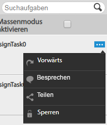
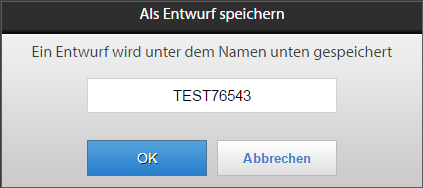
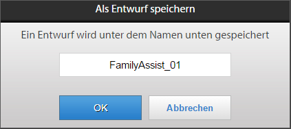
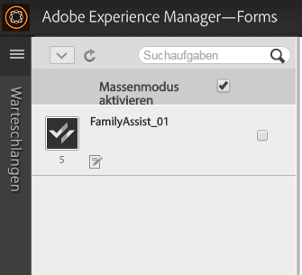
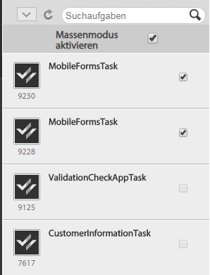
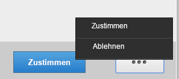

# Arbeiten mit Aufgabenlisten{#working-with-to-do-lists}

Wenn Sie Ihre Aufgabenlisten anzeigen, sehen Sie möglicherweise Aufgaben aus einem Geschäftsprozess, die Ihnen oder Gruppen, denen Sie angehören, zugewiesen sind oder die freigegebene Aufgaben anderer Benutzer sind. Indem Sie beispielsweise eine Anforderung genehmigen bzw. ablehnen oder neue Informationen hinzufügen, können Sie die Aufgaben je nach Bedarf öffnen, bearbeiten oder abschließen. Wenn Sie eine Aufgabe abgeschlossen haben, wird sie an die nächste Person im Geschäftsprozess gesendet.

## Info zu Aufgabenlisten {#about-todo-lists}

AEM Forms Workspace verfügt über die folgenden drei Typen von Aufgabenlisten:

* Persönliche Listen mit Aufgaben, die Ihnen direkt zugewiesen sind.
* Gruppenlisten mit Aufgaben, die einer Gruppe zugewiesen sind. Ein beliebiges Gruppenmitglied kann die Aufgaben öffnen und erledigen. Um eine Aufgabe zu öffnen, muss ein Mitglied einer Gruppe die Aufgabe zuerst anfordern.
* Freigegebene Listen, die Aufgaben enthalten, die einem Benutzer zugewiesen sind, der seine Aufgabenliste für Sie und möglicherweise für weitere Benutzer freigegeben hat. Jeder der Benutzer, für die eine Liste freigegeben ist, kann die Aufgaben anfordern, öffnen und erledigen.

Sie können bestimmte Aktionen durchführen, ohne die Aufgabe zu öffnen, indem Sie auf die Symbole klicken, die angezeigt werden, wenn Sie den Mauszeiger über eine Aufgabe bewegen.

>[!NOTE]
>
>Ein Ausrufezeichen zeigt an, dass die Aufgabe von hoher Priorität ist.

## Typische Aufgaben  {#typical-tasks}

Welche Werkzeuge Ihnen beim Öffnen und Bearbeiten von Aufgaben zur Verfügung stehen, hängt von der jeweiligen Aufgabe ab. Für unterschiedliche Aufgaben müssen Sie unterschiedliche Aktionen durchführen. Aus diesem Grund steht Ihnen eine entsprechende Auswahl von Werkzeuge zur Verfügung. Im Folgenden sind die typischen Aufgaben, die Sie möglicherweise erhalten können, beschrieben.

**Informationen bereitstellen:** Sie erhalten eine Aufgabe, bei der Sie ein Formular ausfüllen und senden müssen.

**Informationen überprüfen:** Sie erhalten eine Aufgabe, bei der Sie die Informationen überprüfen und den Inhalt abzeichnen müssen.

**Überprüfung durch mehrere Benutzer:** Sie erhalten eine Aufgabe gleichzeitig mit anderen Benutzern. Sie und die anderen Benutzer müssen Informationen eingeben, den Inhalt überprüfen oder beides. Für diesen Aufgabentyp stehen die folgenden Werkzeuge zur Verfügung:

* Anzeigen der Aufgabenanweisungen
* Anzeigen des Fertigstellungsstatus aller Benutzer, denen die Aufgabe zugewiesen wurde
* Anzeigen der Kommentare aller Benutzer, denen die Aufgabe zugewiesen wurde
* Hinzufügen eigener Kommentare zu der Aufgabe

Weitere Werkzeuge, die bei den oben angegebenen Aufgaben verfügbar sind:

* Weiterleitung
* Link freigeben
* Besprechen
* Return-Taste
* Hinweise
* Anlagen

## Aufgaben öffnen  {#opening-tasks}

Sie können Aufgaben aus Ihrer Aufgabenliste öffnen und sperren oder Aufgaben von einer Gruppenaufgabenliste bzw. einer freigegebenen Aufgabenliste anfordern und öffnen. Wenn Sie eine Aufgabe öffnen, wird diese im Hauptbereich angezeigt. Die anderen Aufgaben werden neben der Aufgabenliste angezeigt.

Wenn eine Aufgabenzusammenfassungs-URL vorhanden ist, wird standardmäßig die Ansicht &quot;Aufgabenzusammenfassung&quot;anstelle des mit einer Aufgabe verknüpften Formulars geöffnet. Auch wenn ein Benutzer in Assign Task die Option „Open the form in maximized mode“ aktiviert, wird das Formular nicht im maximierten Modus geöffnet.

>[!NOTE]
>
>Wenn Sie eine Aufgabe öffnen, wird das zugehörige Formular je nach Standardeinstellungen der Aufgabe in der Vollbildansicht angezeigt.

### Aufgabe in der Liste öffnen und sperren  {#open-and-lock-a-task-from-your-list}

Wenn Sie eine Aufgabe aus Ihrer Aufgabenliste öffnen und Ihre Liste freigegeben ist, können Sie die Aufgabe sperren, um zu verhindern, dass sie von anderen Benutzern bearbeitet wird, die Zugriff auf Ihre Liste haben.

1. Wählen Sie auf der Aufgabenseite im linken Fensterbereich Ihre persönliche Aufgabenliste aus. Alle Ihre Aufgaben werden im mittleren Bereich angezeigt.

   >[!NOTE]
   >
   >Sie können die Aufgaben filtern, indem Sie den Prozesstyp innerhalb der Aufgabenliste auswählen. Sie können Ihre Aufgabenliste auswählen, um alle Aufgaben in der Liste erneut anzuzeigen.

1. Sperren Sie Ihre Aufgabe bei Bedarf. Um eine Aufgabe zu sperren, klicken Sie auf das Symbol „Alle Optionen“ für die Aufgabe und wählen Sie „Sperren“ aus. Bewegen Sie den Zeiger über die Aufgabe, damit die Option verfügbar ist.

   >[!NOTE]
   >
   >Geöffnete Aufgaben können auch auf jeder Registerkarte gesperrt oder entsperrt werden.

   

   Menü „Alle Optionen“ einer Aufgabe

1. Öffnen Sie die Aufgabe, indem Sie darauf klicken.

### Aufgabe aus einer freigegebenen oder Gruppenliste öffnen und anfordern  {#open-and-claim-a-task-from-a-shared-or-group-list}

Wenn Sie eine Aufgabe von einer Gruppenliste oder freigegebenen Liste anfordern, wird die Aufgabe aus der Gruppenliste bzw. freigegebenen Liste in Ihre persönliche Aufgabenliste verschoben. Die Aufgabe wird für andere Benutzer mit Zugriff auf die Liste für die Bearbeitung gesperrt.

1. Wählen Sie auf der Seite &quot;Aufgaben&quot;im linken Bereich eine Gruppenaufgabenliste oder eine freigegebene Aufgabenliste aus. Alle Aufgaben werden im mittleren Bereich angezeigt.
1. Führen Sie einen der folgenden Schritte durch:

   * Um eine Aufgabe aus einer Gruppenaufgabenliste bzw. einer freigegebenen Aufgabenliste anzufordern, ohne sie zu öffnen, klicken Sie auf **Anfordern**, indem Sie den Zeiger über der Aufgabe bewegen. Wenn die Aufgabe geöffnet ist, ist die Schaltfläche Anfordern in der Aktionsleiste unter dem Aufgabenbereich verfügbar. Beim Anfordern wird eine Aufgabe aus der Gruppenaufgabenliste bzw. freigegebenen Aufgabenliste in Ihre Liste verschoben.
   * Um eine Aufgabe aus einer Gruppenaufgabenliste bzw. einer freigegebenen Aufgabenliste anzufordern und zu öffnen, klicken Sie auf **Anfordern und öffnen**.

## Mit Aufgaben arbeiten  {#working-with-tasks}

Nach dem Öffnen einer Aufgabe hängt es von der Aufgabe ab, welche Registerkarten im Hauptbereich angezeigt werden und welche Werkzeuge Ihnen zur Verfügung stehen. Die entsprechenden Registerkarten werden unten beschrieben:

**Aufgabenzusammenfassung**: Wenn eine Aufgabe geöffnet wird, können Sie im Bereich „Aufgabenzusammenfassung“ Informationen zur Aufgabe, falls vorhanden, über eine URL anzeigen, die im Prozess im Vorgang zum Zuweisen einer Aufgabe angegeben wurde. Mithilfe dieser Aufgabenzusammenfassung können zusätzliche und wichtige Informationen zu einer Aufgabe angezeigt werden, die für den Endbenutzer von AEM Forms Workspace nützlich sind. Diese Registerkarte ist nicht verfügbar, wenn die Aufgabenzusammenfassungs-URL nicht vorhanden ist.

**Details**: Bietet einige Informationen zur aktuellen Aufgabe und dem Prozess, zu dem sie gehört.

**Formular**: Zeigt das der Aufgabe zugeordnete Formular an. Formulare können in vielen verschiedenen Dateiformaten wie PDF, HTML, Guide und SWF vorliegen. Das Formular kann wie ein normales druckbares oder webbasiertes Formular aussehen oder Sie durch eine Folge von Bildschirmen im Assistentenformat begleiten, um Informationen zu erfassen.

**Verlauf**: Listet die Aufgaben, die Teil der Prozessinstanz sind, sowie das zugeordnete Formular und die Zuweisungen und Anlagen für jede Aufgabe auf.

**Anlagen**: Zeigt vorhandene Anlagen, die der Aufgabe zugeordnet sind, an und fügt ggf. Anlagen hinzu.

**Notizen**: Zeigt die vorhandenen Notizen, die der Aufgabe zugeordnet sind, an und fügt ggf. Notizen hinzu.

Die Werkzeuge, die Ihnen angezeigt werden, und die Aktionen, die sie ausführen können, wenn Sie an einer Aufgabe arbeiten, werden unten beschrieben.

### Weiterleiten, Freigeben und Besprechen von Aufgaben  {#forward-share-or-consult-on-a-task}

Sie können eine Aufgabe zusammen mit Notizen oder Anlagen an einen anderen Benutzer weiterleiten, die Aufgabe freigeben oder sie mit einem anderen Benutzer besprechen. Wenn Sie Änderungen an den Formulardaten vornehmen, die einer Aufgabe zugeordnet sind, müssen Sie das Formular als Entwurf speichern, bevor Sie die Aufgabe weiterleiten, freigeben oder besprechen. Anderenfalls wird die Aufgabe ohne das aktualisierte Formular gesendet. Nachdem Sie eine Aufgabe weitergeleitet und freigegeben haben, kann der Benutzer, der die Aufgabe empfangen hat, diese entweder anfordern und abschließen oder sie wieder an Sie übergeben. Wenn Sie sich bezüglich einer Aufgabe beraten haben, kann der Benutzer diese nur an Sie zurücksenden.

1. Wenn Sie ein Formular ändern, das einer Aufgabe zugeordnet ist und das Sie behalten möchten, klicken Sie auf **Speichern**. Die Option „Speichern“ ist in der Aktionsleiste am unteren Rand jeder Registerkarte verfügbar. Anderenfalls wird die Aufgabe ohne das aktualisierte Formular gesendet.

   >[!NOTE]
   >
   >Abhängig vom derzeit bearbeiteten Prozess ist in einigen Formularen die Schaltfläche „Speichern“ nicht verfügbar.

1. Klicken Sie auf einer Registerkarte auf eine der folgenden Schaltflächen:

   * **Weiterleitung**
   * **Link freigeben**
   * **Besprechen**

   >[!NOTE]
   >
   >Abhängig von der Aufgabe können Sie diese Aktionen ggf. auch über die Aufgabenliste durchführen, ohne die Aufgabe zu öffnen.

1. Suchen Sie im Popup-Dialogfenster den Namen des Benutzers, an den Sie die Aufgabe weiterleiten, freigeben oder mit dem Sie sie besprechen möchten, und wählen Sie ihn aus.

### Aufgaben zurückgeben  {#return-a-task}

1. Klicken Sie auf einer beliebigen Registerkarte auf **Zurückgeben**. Die Aufgabe wird wieder in der Aufgabenliste des Benutzers platziert, der die Aufgabe zuvor an Sie weitergeleitet, für Sie freigegeben oder mit Ihnen besprochen hat.

### Aufgaben offline schalten  {#take-a-task-offline}

Sie haben die Möglichkeit, eine Aufgabe offline zu bearbeiten und das entsprechende Formular später über Adobe® Reader® oder Adobe® Acrobat® Professional oder Adobe® Acrobat® Standard zu senden. Beim Senden des Formulars wird Ihr E-Mail-Client mit der entsprechenden Server-E-Mail-Adresse gestartet. Sie können das ausgefüllte Formular dann per E-Mail an den Server senden.

1. Klicken Sie auf einer beliebigen Registerkarte auf **Offline**.
1. Geben Sie einen Dateinamen an, unter dem Sie das Formular speichern möchten, und klicken Sie auf **Speichern**. Das der Aufgabe zugeordnete Formular wird lokal gespeichert und die Aufgabe bleibt in Ihrer Aufgabenliste, bis das Formular gesendet wird.

### Mit Anlagen arbeiten  {#work-with-attachments}

Sie haben die Möglichkeit, alle Notizen oder Anlagen lokal hinzuzufügen, zu aktualisieren, zu löschen oder zu speichern.

**Anlagen hinzufügen**

1. Klicken Sie auf der Registerkarte **Anlagen** auf **Durchsuchen**, um die Datei für die Anlage auszuwählen.
1. Wählen Sie für andere am Prozess teilnehmende Benutzer die Ebene **Berechtigungen** für die Anlage aus. Wenn Sie die **Leseberechtigung** aktivieren, können andere Benutzer die Datei lokal speichern. Wenn Sie eine der Bearbeitungsberechtigungen auswählen, können andere Benutzer auch eine neue Datei hochladen, um Ihre Anlage durch sie zu ersetzen.

   >[!NOTE]
   >
   >Sie können auch Kommentare mit Ihren Anlagen hinzufügen.

1. Klicken Sie auf **Hochladen**. Die Datei wird an das Formular angehängt.

**Anlagen anzeigen**

1. Klicken Sie auf der Registerkarte **Anlagen** auf den Dateinamen der Anlage, die angezeigt werden soll.

**Anlage lokal speichern**

1. Klicken Sie auf eine Anlage, um sie zu öffnen. Speichern Sie die geöffnete Anlage lokal.

**Anlagen hochladen**

1. Klicken Sie für die Anlage auf **Bearbeiten**. Wählen Sie die Datei aus, die die vorhandene Anlage ersetzen soll, indem Sie auf **Durchsuchen** klicken.

**Anlage löschen**

1. Klicken Sie für eine Anlage auf **Löschen**.

### Arbeit speichern, ohne die Aufgabe abzuschließen  {#save-your-work-without-completing-the-task}

1. Tippen Sie auf einer beliebigen Registerkarte auf **Speichern**.

   Das Dialogfeld „Als Entwurf speichern“ wird angezeigt. Der Standardname des Entwurfs ist derjenige der Aufgabe aus der Aufgabenvorlage.

   

   >[!NOTE]
   >
   >Sie können Workspace so konfigurieren, dass Informationen, die von einem Benutzer als Entwurf eingegeben wurden, von Zeit zu Zeit automatisch gespeichert werden. Wenn die automatische Speicherung aktiviert ist und ein Benutzer an einem Entwurf arbeitet, wird der Entwurf regelmäßig gespeichert. Bei der automatischen Speicherung wird der Standardname der Aufgabe automatisch übernommen.
   >
   >
   >Weitere Informationen finden Sie unter Entwurf regelmäßig speichern unter [Verwalten von Voreinstellungen](/help/forms/using/getting-started-livecycle-html-workspace.md).

1. Geben Sie im Dialogfeld „Als Entwurf speichern“ einen eindeutigen Namen für die Aufgabe ein und tippen Sie **OK**.

   

   Der Entwurf wird mit dem eingegebenen Namen gespeichert. Die Aufgabe bleibt in Ihrer Aufgabenliste und alle Änderungen, die Sie im Formular vorgenommen haben, werden im Ordner „Entwürfe“ gespeichert. In der Aufgabenliste können Sie mit dem Namen nach dem Entwurf suchen, um diesen weiterzubearbeiten.

   

## Aufgaben abschließen {#completing-tasks}

Die Erledigung einer Aufgabe hängt von der Aufgabe und Ihrer Rolle im Prozess ab. Sie werden ggf. aufgefordert, eine Anforderung zu genehmigen oder abzulehnen, Inhalte bereitzustellen, Informationen zu prüfen und zu bestätigen oder anzugeben, dass Sie gehandelt haben.

Sie können eine Aufgabe auf verschiedene Weise abschließen:

* mit den Aktionen auf einer der Registerkarten
* mit den im Formular integrierten Schaltflächen
* über Ihre Aufgabenliste, ohne die Aufgabe zu öffnen

>[!NOTE]
>
>Diese Option ist verfügbar, wenn beim Entwerfen eines Prozesses das Feld `isMustOpenToComplete` im Schritt `Assign Task` in Workbench nicht ausgewählt ist.

* per E-Mail, wenn Sie E-Mail-Benachrichtigungen erhalten

Wenn Sie eine Aufgabe abschließen, wird je nach Aufgabe möglicherweise ein Dialogfeld zum Bestätigen der Aktion angezeigt. Beispielsweise kann ein Dialogfeld angezeigt werden, in dem Sie aufgefordert werden, die Gültigkeit der eingegebenen Informationen zu bestätigen.

>[!NOTE]
>
>Wenn Sie eine Aufgabe geändert haben, jedoch noch nicht bereit sind, die Aufgabe abzuschließen, können Sie Ihre Arbeit als Entwurf speichern, indem Sie auf „Speichern“ klicken uns später daran weiterarbeiten.

### Aufgaben abschließen  {#complete-a-task}

1. Führen Sie einen der folgenden Schritte durch:

   * Wählen Sie die Aufgabe aus und klicken Sie im unteren Teil der Liste auf die entsprechende Schaltfläche, um den nächsten im Prozess erforderlichen Schritt einzuleiten.
   * Wenn das Formular keine Schaltflächen aufweist und die Schaltfläche &quot;Complete&quot;in AEM Forms Workspace verfügbar ist, klicken Sie auf **Complete**.
   * Wenn das Formular Schaltflächen enthält und die Schaltfläche zum Vervollständigen in AEM Forms Workspace nicht verfügbar ist, klicken Sie auf die entsprechende Schaltfläche im Formular, um den nächsten im Prozess erforderlichen Schritt auszuführen.

   Wenn das Formular keine Schaltflächen aufweist und die Schaltfläche zum Vervollständigen in AEM Forms Workspace nicht verfügbar ist, wird eine Meldung angezeigt, die angibt, dass das Formular nicht gesendet werden kann.

1. Wenn ein Dialogfeld zur Bestätigung angezeigt wird, führen Sie eine der folgenden Aktionen aus:

   * Klicken Sie auf **OK**, wenn Sie die Aufgabe abgeschlossen haben und nun bereit sind, sie abzuzeichnen.
   * Klicken Sie auf **Abbrechen**, wenn Sie zu der Aufgabe zurückkehren müssen und nicht bereit sind, sie abzuzeichnen.

>[!NOTE]
>
>Es wird möglicherweise eine Schaltfläche „Senden“ in den HTML-Formularen angezeigt, wenn Prozesseigenschaften in einem Formular verwendet werden. Diese Schaltfläche wird nicht angezeigt, wenn dasselbe Formular als PDF-Datei wiedergegeben wird. Um eine Aufgabe abzuschließen, klicken Sie auf die Schaltfläche „Senden“ unten in AEM Forms Workspace, außerhalb des Formulars und nicht auf die Schaltfläche „Senden“ im Formular.

### Genehmigung mehrerer Aufgaben  {#bulk-approve-tasks}

Sie können mehrere Aufgaben aus Ihrer Aufgabenliste auf einmal senden. Es können nur Aufgaben desselben Prozesses mit denselben Aufgabennamen und denselben Routenoptionen gleichzeitig gesendet werden.

>[!NOTE]
>
>Diese Option ist verfügbar, wenn beim Entwerfen eines Prozesses das Feld isMustOpenToComplete im Schritt &quot;Aufgabe zuweisen&quot;in Workbench nicht ausgewählt ist.

1. Wählen Sie auf der Aufgabenseite im linken Fensterbereich Ihre persönliche Aufgabenliste aus. Alle Ihre Aufgaben werden im mittleren Bereich angezeigt.
1. Wählen Sie die Option **Massenmodus aktivieren**. Kontrollkästchen erscheinen vor den Aufgaben in der Liste.

   >[!NOTE]
   >
   >Diese Option ist nicht für Aufgaben verfügbar, für die beim Entwerfen eines Prozesses im Schritt &quot;Aufgabe zuweisen&quot;in Workbench das Feld isMustOpenToComplete ausgewählt ist. Kontrollkästchen solcher Aufgaben in der Aufgabenliste sind immer deaktiviert.

1. Wählen Sie die Aufgaben aus, die Sie gleichzeitig genehmigen möchten. Es können mehrere Aufgaben desselben Prozesses mit denselben Aufgabennamen und denselben Routenoptionen ausgewählt werden. Nachdem Sie eine Aufgabe zur Genehmigung ausgewählt haben, bleiben nur die Aufgaben mit demselben Prozess, mit denselben Aufgabennamen und denselben Routenoptionen aktiviert. Die anderen Aufgaben werden deaktiviert.

   

1. Klicken Sie auf die verfügbare Sendeoption. Die ausgewählten Aufgaben werden gesendet.

   

## An Aufgaben per E-Mail teilnehmen {#participating-in-tasks-through-email}

Sie können Aufgaben per E-Mail empfangen und abschließen. Durch das Teilnehmen an Aufgaben per E-Mail erübrigt sich das routinemäßige Prüfen Ihrer Aufgabenliste auf neue Aufgaben bzw. das Prüfen des Status einer Aufgabe auf der Seite „Verfolgung“.

Legen Sie zunächst Ihre AEM Forms Workspace-Voreinstellungen fest, um E-Mail-Benachrichtigungen zu erhalten. AEM Forms Workspace kann E-Mail-Benachrichtigungen für Aufgaben in Ihrer Aufgabenliste oder in Gruppenaufgabenlisten versenden, zu denen Sie gehören. Der Administrator legt fest, wann und an wen E-Mail-Benachrichtigungen gesendet werden.

Die E-Mail-Nachrichten können einen Link enthalten, über den die Aufgabe in AEM Forms Workspace geöffnet wird, eine Anlage mit dem Formular, das für die Aufgabe verwendet wird, oder Aktionen zum Abschließen der Aufgabe per E-Mail. Wenn die E-Mail-Nachricht ein Formular mit integrierten Schaltflächen zum Abschließen der Aufgabe enthält, können Sie das Formular öffnen und die Aufgabe abschließen. Wenn die E-Mail-Nachricht Aktionen zum Abschließen der Aufgabe enthält, können Sie die Aufgabe abschließen, indem Sie auf die Aktionen in der E-Mail klicken oder die E-Mail beantworten und die entsprechende Aktion als erste Zeile des E-Mail-Textes eingeben.

>[!NOTE]
>
>Informationen zum Konfigurieren des Arbeitsbereichs für die Verwendung der entsprechenden E-Mail-Vorlagen finden Sie im [AEM Forms JEE-Administratorhandbuch](https://help.adobe.com/en_US/AEMForms/6.1/AdminHelp/).

Wenn Sie eine Aufgabe per E-Mail abschließen, wird die Aufgabe aus Ihrer Aufgabenliste in AEM Forms Workspace entfernt.

>[!NOTE]
>
>Wenn der Benutzer im Browser nicht in AEM Forms Workspace angemeldet ist und einen Link zu einer Aufgabe öffnet, kann der direkte Link zum Ausführen nicht geöffnet werden und es wird eine Ausnahme angezeigt. Melden Sie sich im AEM Forms-Arbeitsbereich an, bevor Sie auf Links in den E-Mails klicken.

>[!NOTE]
>
>Sie können eine E-Mail-Benachrichtigung nicht weiterleiten, um die Aufgabe einem anderen Benutzer zuzuweisen. Sie können Aufgaben an andere Benutzer nur innerhalb von AEM Forms Workspace weiterleiten.

### E-Mail-Benachrichtigungen empfangen  {#receive-email-notification-messages}

1. Klicken Sie auf **Voreinstellungen**.
1. Wählen Sie in der Liste **Über Aufgabenereignisse per E-Mail benachrichtigen** den Eintrag **Ja**.
1. Um das Formular samt Daten in die E-Mail-Nachricht aufzunehmen, wählen Sie in der Liste **Formulare in E-Mail anfügen** den Eintrag **Ja**.

## An Aufgaben über mobile Geräte teilnehmen  {#participating-in-tasks-through-mobile-devices}

Mit der AEM Forms Workspace-APP können Sie sich an Aufgaben von Ihrem mobilen Gerät aus beteiligen. Wenden Sie sich vor dem Installieren der Anwendung an Ihren Systemadministrator, um zu klären, ob Ihr Unternehmen den Einsatz der App von AEM Forms Workspace unterstützt.

## Info zu Terminen und Erinnerungen  {#about-deadlines-and-reminders}

Ein *Termin* gibt das Datum und die Uhrzeit des Zeitpunktes an, zu dem eine Aufgabe erledigt sein muss. Wenn ein Termin verstreicht, leitet der Server die Aufgabe zum nächsten Schritt im Prozess weiter (dies kann die Aufgabenliste eines anderen Benutzers sein) und das Terminsymbol wird für die Aufgabe angezeigt. Das Terminsymbol wird unabhängig von den für den Prozess geltenden Regeln angezeigt.

Eine *Erinnerung* informiert Sie, dass eine Aufgabe Ihre Aufmerksamkeit erfordert. Erinnerungen werden zu einem vordefinierten Zeitpunkt und anschließend in regelmäßigen Abständen angezeigt, bis die dazugehörige Aufgabe erledigt ist. Wenn Sie eine Erinnerung erhalten, wird das Erinnerungssymbol für die Aufgabe angezeigt.

Der Geschäftsprozess bestimmt das Verhalten und die Zeitvorgabe von Terminen und Erinnerungen. Nicht alle Prozesse weisen Termine und Erinnerungen auf. Der Administrator gibt an, ob E-Mail-Benachrichtigungen für Termine und Erinnerungen gesendet werden. Sie können in Ihren Voreinstellung festlegen, ob Sie E-Mail-Benachrichtigungen empfangen möchten.

## Mit Aufgaben aus Gruppen- und freigegebenen Warteschlangen arbeiten  {#working-with-tasks-from-group-and-shared-queues}

Alle Ihnen zugewiesenen Aufgaben werden in Ihrer Aufgabenliste (Warteschlange) angezeigt.

Alle freigegebenen und Gruppenaufgabenlisten, auf die Sie zugreifen können, werden auf der Seite „Aufgaben“ im linken Bereich angezeigt. Sie können Aufgaben in allen Aufgabenlisten erledigen, auf die Sie Zugriff haben.

Einer Aufgabenliste können mehrere Mitglieder zugewiesen sein. Aufgabenlisten werden von einem Administrator basierend auf den spezifischen Anforderungen des Unternehmens eingerichtet. Gruppenaufgabenlisten sind eine Möglichkeit, Aufgaben auf mehrere Personen mit ähnlichen Zuständigkeiten zu verteilen.

Angenommen, alle Mitglieder Ihres Teams bearbeiten Kreditantragsformulare. Alle diese Aufgaben werden an eine Aufgabenliste gesendet, auf die alle Mitglieder Ihrer Gruppe zugreifen können. Jedes Mitglied Ihrer Gruppe kann auf die Aufgaben in dieser Aufgabenliste zugreifen.

Eine freigegebene Aufgabenliste wird angezeigt, wenn ein anderer Benutzer seine Aufgabenliste für Sie freigegeben oder eine Aufgabe explizit für Sie freigegeben hat. Sie können die Aufgaben in der Aufgabenliste dieses Benutzers anzeigen und sie in seinem Auftrag erledigen. Wenn Sie beispielsweise Urlaub nehmen, können Sie Ihre Aufgabenliste für einen Kollegen freigeben, der Ihre Aufgaben erledigt, solange Sie abwesend sind.

>[!NOTE]
>
>Sie können auch Abwesenheitseinstellungen festlegen, um Aufgaben während Ihrer Abwesenheit an andere Benutzer weiterzuleiten.

Um eine Aufgabe aus einer Gruppenaufgabenliste oder freigegebenen Aufgabenliste zu bearbeiten, fordern Sie die Aufgabe zuerst an. Sie sind dann Eigentümer der Aufgabe, bis Sie sie abschließen oder an einen anderen Benutzer weiterleiten.

### Warteschlangen freigeben {#sharing-queues}

Sie können Ihre Aufgabenliste für andere Benutzer freigeben, die dann alle neuen Aufgaben in Ihrer Aufgabenliste anzeigen und für Sie ausführen können. Aufgaben, die sich schon vor der Freigabe in Ihrer Aufgabenliste befunden haben, können von diesen Benutzern nicht angezeigt werden. Die Benutzer können nur die Aufgaben anzeigen und anfordern, die in Ihrer Aufgabenliste eintreffen, nachdem Sie ihnen den Zugriff darauf gewährt haben.

Beachten Sie, dass ein Benutzer eine Aufgabe in einer freigegebenen Warteschlange nur anzeigen kann, wenn der Prozessentwickler die Option „ACLs für freigegebene Warteschlangen hinzufügen“ auf der Registerkarte für die Aufgabenzugriffssteuerungslisten (Task Access Control List (ACL)) des User Service aktiviert hat.

>[!NOTE]
>
>Für geplante Abwesenheitszeiten können Sie auch Abwesenheitseinstellungen festlegen (anstatt die gesamte Aufgabenliste freizugeben), um Aufgaben während Ihrer Abwesenheit an andere Benutzer weiterzuleiten.

**Warteschlange freigeben**

1. Klicken Sie auf der Registerkarte **Warteschlangen** auf der Registerkarte **Voreinstellungen** auf das „+“-Symbol für „Benutzer, für die &#39;Meine Warteschlange&#39; zurzeit freigegeben ist“.
1. Suchen und wählen Sie den Namen des Benutzers aus.
1. Klicken Sie auf die Schaltfläche **Freigeben**, um Ihre Warteschlange für den ausgewählten Benutzer freizugeben.
1. Wählen Sie den Namen des Benutzers aus und klicken Sie auf **Freigeben**.

   >[!NOTE]
   >
   >Sie können einen Benutzer aus der Freigabe Ihrer Aufgabenliste entfernen, indem Sie auf das **X**-Symbol am Ende der Zeile, in der der Benutzer aufgeführt ist, klicken.

### Auf andere Warteschlangen zugreifen  {#accessing-other-queues}

Sie können den Zugriff auf die Aufgabenliste eines anderen Benutzers anfordern, um alle neuen Aufgaben in der Aufgabenliste des Benutzers anzeigen und anfordern zu können.

Wenn Sie den Zugriff auf die Aufgabenliste eines anderen Benutzers anfordern, empfängt dieser in seiner Aufgabenliste eine Aufgabe zum Genehmigen oder Ablehnen Ihrer Anforderung. Nachdem der Benutzer diese Aufgabe abgeschlossen hat, erhalten Sie eine Benachrichtigung in Ihrer Aufgabenliste.

Wenn Ihnen der Zugriff auf die Aufgabenliste eines anderen Benutzers gewährt wurde, können Sie keine Aufgaben anzeigen, die sich schon vor der Gewährung des Zugriffs in der Aufgabenliste des Benutzers befunden haben. Sie können nur die Aufgaben anzeigen, die in der Aufgabenliste des Benutzers eintreffen, nachdem Ihnen der Zugriff auf die Liste gewährt wurde.

**Auf andere Warteschlangen zugreifen**

1. Öffnen Sie auf der Registerkarte **Voreinstellungen** die Registerkarte **Warteschlangen**.
1. Klicken Sie auf das „+“-Zeichen für „Benutzerwarteschlangen, auf die ich Zugriff habe“. Suchen Sie den Namen des Benutzers im Popup-Dialogfeld.
1. Wählen Sie den Namen des Benutzers aus und klicken Sie auf **Anfordern**.

   >[!NOTE]
   >
   >Sie können die eigene Zugriffsberechtigung für eine andere Aufgabenliste entfernen, indem Sie den Benutzernamen in der Liste „Benutzerwarteschlangen, auf die ich Zugriff habe“ auswählen und auf das **X** am Ende der Zeile klicken, die den Benutzernamen enthält. Solange eine Anforderung für den Zugriff auf die Aufgabenliste eines anderen Benutzers noch aussteht, können Sie Ihren Zugriff auf diese andere Aufgabenliste nicht selbst entfernen.

## Abwesenheitseinstellungen festlegen  {#setting-out-of-office-preferences}

Für geplante Abwesenheitszeiten können Sie festlegen, was während dieser Zeit mit den Ihnen zugeordneten Aufgaben passieren soll.

Sie haben die Möglichkeit, ein Anfangs- und Enddatum sowie eine Anfangs- und Enduhrzeit für die Gültigkeit der Abwesenheitseinstellungen anzugeben. Wenn Sie sich in einer anderen Zeitzone als der Server aufhalten, wird die Zeitzone des Servers verwendet.

Sie können eine Person festlegen, an die Ihre Aufgaben standardmäßig gesendet werden. Zudem können Sie Ausnahmen für Aufgaben aus speziellen Prozessen festlegen, die an einen anderen Benutzer gesendet oder bis zu Ihrer Rückkehr in Ihrer Aufgabenliste bleiben sollen. Wenn die angegebene Person ebenfalls abwesend ist, werden die Aufgaben an den von dieser Person angegebenen Vertreter weitergeleitet. Sind alle Benutzer, denen die Aufgabe zugewiesen werden könnte, abwesend, bleibt sie in der Aufgabenliste.

>[!NOTE]
>
>Während Ihrer Abwesenheit bleiben alle Aufgaben, die sich bereits zuvor in Ihrer Warteschlange befanden, in Ihrer Aufgabenliste und werden nicht an andere Benutzer weitergeleitet.

### Abwesenheitseinstellungen festlegen  {#set-out-of-office-preferences}

1. Klicken Sie auf **Voreinstellungen** und dann auf **Abwesenheit**.
1. Um den Zeitraum Ihrer Abwesenheit festzulegen, führen Sie einen dieser Schritte durch:

   * Um anzugeben, dass Sie für unbestimmte Zeit abwesend sein werden, wählen Sie in der Liste **Ich bin zurzeit** den Eintrag **Nicht im Hause** aus und geben keinen Datumsbereich an.
   * Zur Angabe eines Anfangsdatums und einer Anfangsuhrzeit für Ihre Abwesenheit klicken Sie auf das „+“ für **Abwesenheitszeitplan**. Verwenden Sie die Kalender- und Uhrzeitliste, um das Anfangsdatum und die Anfangsuhrzeit anzugeben. Wenn Sie kein Enddatum und keine Enduhrzeit angeben, gilt Ihre Abwesenheit ab dem Anfangsdatum und der Anfangsuhrzeit bis zu dem Zeitpunkt, zu dem Sie die Voreinstellungen ändern.

1. Um festzulegen, was standardmäßig mit Ihren Aufgaben passieren soll, wählen Sie in der Liste **Bei Abwesenheit: Standardbenutzer für Abwesenheitsaufgaben** eine der folgenden Optionen aus:

   * Wählen Sie **Nicht zuweisen** aus, um Aufgaben bis zu Ihrer Rückkehr in der Aufgabenliste zu belassen.
   * Wählen Sie **Benutzer suchen** aus, um einen Benutzer zu suchen, damit Ihre Aufgabe zugewiesen werden sollen. Wenn Sie einen Benutzer auswählen, können Sie auch seinen Abwesenheitszeitplan anzeigen.

1. Um Ausnahmen festzulegen, klicken Sie auf das „+“-Zeichen für **Prozessausnahmen**, wählen den Prozess aus, für den eine Ausnahme erstellt werden soll, und wählen dann einen anderen Benutzer aus oder klicken in der Liste **ist zugewiesen zu** auf **Nicht zuweisen**.

   >[!NOTE]
   >
   >Der Prozessentwickler kann festlegen, dass Aufgaben aus bestimmten Prozessen immer privat sind und nicht an andere Benutzer weitergeleitet werden. Diese Einstellung setzt Ihre Einstellungen außer Kraft.

1. Wenn Sie die gewünschten Voreinstellungen festgelegt haben, klicken Sie auf **Speichern**. Wenn die Einstellungen angeben, dass Sie zurzeit abwesend sind, treten die Änderungen sofort in Kraft. Anderenfalls treten sie am angegebenen Anfangsdatum zur festgelegten Uhrzeit in Kraft. Selbst wenn Sie sich während Ihrer Abwesenheit am System anmelden, gelten Sie erst wieder als anwesend, wenn Sie die Einstellungen ändern.
