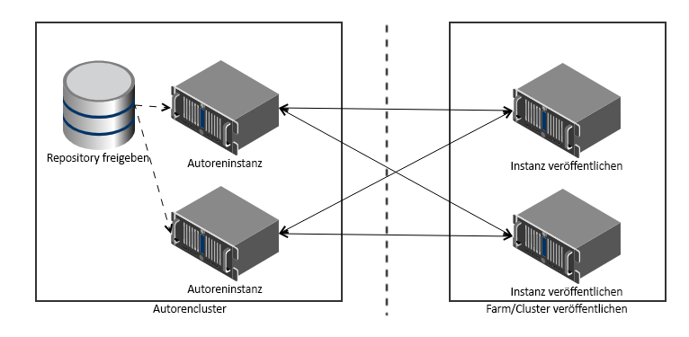

# Übersicht über Transaktionsberichte{#transaction-reports-overview}

## Einführung {#introduction}

Mit Transaktionsberichten in AEM Forms können Sie alle Transaktionen zählen, die seit einem bestimmten Datum in Ihrer AEM Forms-Bereitstellung stattgefunden haben. Ziel ist es, Informationen über die Produktnutzung bereitzustellen und den Interessengruppen in Unternehmen dabei zu helfen, ihre digitalen Verarbeitungsvolumen zu verstehen. Beispiele für eine Transaktion sind:

* Übermittlung eines adaptiven Formulars, eines HTML5-Formulars oder eines Formularsatzes
* Ausgabe eines Drucks oder einer Webversion einer interaktiven Kommunikation
* Konvertieren eines Dokuments aus einem Dateiformat in ein anderes

Weitere Informationen zu einer Transaktion finden Sie unter [Abrechnungsfähige APIs](../../forms/using/transaction-reports-billable-apis.md).

Die Transaktionsaufzeichnung ist standardmäßig deaktiviert. Sie können [die Transaktionsaufzeichnung](../../forms/using/viewing-and-understanding-transaction-reports.md#setting-up-transaction-reports) über AEM Web-Konsole aktivieren. Sie können Transaktionsberichte zu Autoren-, Verarbeitungs- oder Veröffentlichungsinstanzen anzeigen. Zeigen Sie Transaktionsberichte zu Autoren- oder Verarbeitungsinstanzen für eine aggregierte Summe aller Transaktionen an. Zeigen Sie Transaktionsberichte zu den Veröffentlichungsinstanzen für eine Zählung aller Transaktionen an, die nur auf der Veröffentlichungsinstanz stattfinden, von der aus der Bericht ausgeführt wird.

Verfassen Sie nicht Inhalte (Erstellen Sie adaptive Formulare, interaktive Kommunikation, Designs und andere Authoring-Aktivitäten) und Prozessdokumente (Verwenden Sie Workflows, Dokumentdienste und andere Verarbeitungsaktivitäten) in derselben AEM Instanz. Halten Sie die Transaktionsaufzeichnung für AEM Forms-Server, die zum Erstellen von Inhalten verwendet werden, deaktiviert. Lassen Sie die Transaktionsaufzeichnung für AEM Forms-Server aktiviert, die zur Verarbeitung von Dokumenten verwendet werden.

Eine Transaktion verbleibt für einen bestimmten Zeitraum im Puffer (Leerlauf-Pufferzeit + Rückwärtsreplikationszeit). Standardmäßig dauert es ungefähr 90 Sekunden, bis die Transaktionsanzahl im Transaktionsbericht angezeigt wird.

Aktionen wie das Senden eines PDF-Formulars, die Verwendung der Benutzeroberfläche für Agenten zur Vorschau einer interaktiven Kommunikation oder die Verwendung nicht standardmäßiger Methoden zur Formularübermittlung werden nicht als Transaktionen berücksichtigt. AEM Forms bietet eine API zum Aufzeichnen solcher Transaktionen. Rufen Sie die API aus Ihren benutzerdefinierten Implementierungen auf, um eine Transaktion aufzuzeichnen.

## Unterstützte Topologie {#supported-topology}

Transaktionsberichte sind nur in AEM Forms in der OSGi-Umgebung verfügbar. Es unterstützt nur die Topologien author-publish, author-processing-publish und processing. Beispiele für Topologien finden Sie unter [Architektur und Bereitstellungstopologien für AEM Forms](../../forms/using/transaction-reports-overview.md).

Die Transaktionsanzahl wird umgekehrt von Veröffentlichungsinstanzen zu Autoren- oder Verarbeitungsinstanzen repliziert. Unten finden Sie eine ungefähre Topologie zum Autor und Veröffentlichen:

>[!NOTE]
>
>AEM Forms-Transaktionsberichte unterstützen keine Topologien, die nur Veröffentlichungsinstanzen enthalten.

### Richtlinien für die Verwendung von Transaktionsberichten {#guidelines-for-using-transaction-reports}

* Deaktivieren Sie Transaktionsberichte für alle Autoreninstanzen, da Berichte zu Autoreninstanzen während der Bearbeitung registrierte Transaktionen enthalten.
* Aktivieren Sie die Option **Nur Veröffentlichungstransaktionen anzeigen** in der Autoreninstanz, um kumulative Transaktionen aus allen Veröffentlichungsinstanzen anzuzeigen. Sie können Transaktionsberichte für jede Veröffentlichungsinstanz auch nur für tatsächliche Transaktionen in dieser Veröffentlichungsinstanz anzeigen.
* Verwenden Sie keine Autoreninstanzen, um Workflows auszuführen und Dokumente zu verarbeiten.
* Stellen Sie vor der Verwendung von Transaktionsberichten sicher, dass die Rückwärtsreplikation für alle Veröffentlichungsinstanzen aktiviert ist, wenn Sie eine Topologie mit Veröffentlichungsservern haben.
* Transaktionsdaten werden von einer Veröffentlichungsinstanz umgekehrt in nur die entsprechende Autoren- oder Verarbeitungsinstanz repliziert. Die Autoren- oder Verarbeitungsinstanz kann keine Daten in einer anderen Instanz weiter replizieren. Wenn Sie beispielsweise über die Topologie &quot;author-processing-publish&quot;verfügen, werden aggregierte Transaktionsdaten nur auf die Verarbeitungsinstanz repliziert.

## Verwandte Artikel {#related-articles}

* [Anzeigen und Verstehen von Transaktionsberichten](../../forms/using/viewing-and-understanding-transaction-reports.md)
* [Abrechenbare APIs für Transaktionsberichte](../../forms/using/transaction-reports-billable-apis.md)
* [Eine Transaktion für benutzerdefinierte Implementierungen aufzeichnen](/help/forms/using/record-transaction-custom-implementation.md)
