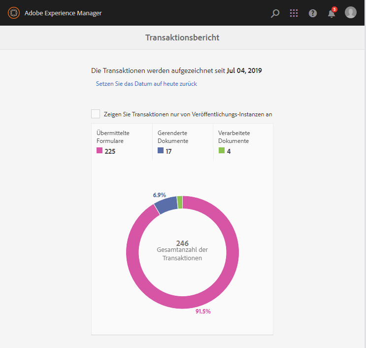

# Übersicht über Transaktionsberichte{#transaction-reports-overview}

## Einführung {#introduction}

Mit Transaktionsberichten in AEM Forms können Sie alle Transaktionen zählen, die seit einem bestimmten Datum bei Ihrer AEM Forms-Bereitstellung stattgefunden haben. Ziel ist es, Informationen über die Nutzung von Produkten bereitzustellen und Interessengruppen dabei zu unterstützen, ihr digitales Verarbeitungsvolumen zu verstehen. Beispiele für eine Transaktion:

* Übermitteln eines adaptiven Formulars, eines HTML5-Formulars oder eines Formularsatzes
* Darstellung eines Drucks oder einer Webversion einer interaktiven Kommunikation
* Konvertierung eines Dokuments von einem Dateiformat in ein anderes

Weitere Informationen zu einer Transaktion finden Sie unter [Billable APIs](../../forms/using/transaction-reports-billable-apis.md).

Die Transaktionsaufzeichnung ist standardmäßig deaktiviert. Sie können [die Transaktionsaufzeichnung](../../forms/using/viewing-and-understanding-transaction-reports.md#setting-up-transaction-reports) in AEM Web-Konsole aktivieren. Sie können Transaktionsberichte zu Autoren-, Verarbeitungs- oder Veröffentlichungsinstanzen Ansicht geben. Ansicht-Transaktionsberichte zu Autoren- oder Verarbeitungsinstanzen für eine aggregierte Summe aller Transaktionen. Ansicht-Transaktionsberichte zu den Instanzen im Veröffentlichungsmodus für eine Zählung aller Transaktionen, die nur in der Veröffentlichungsinstanz stattfinden, von der aus der Bericht ausgeführt wird.

Erstellen Sie keine Inhalte (Erstellen Sie adaptive Formulare, interaktive Kommunikation, Themen und andere Authoring-Aktivitäten) und verarbeiten Sie Dokumente (Verwenden Sie Workflows, Dokument-Dienste und andere Aktivitäten zur Verarbeitung) auf derselben AEM Instanz. Halten Sie die Transaktionsaufzeichnung für AEM Forms-Server, die zum Erstellen von Inhalten verwendet werden, deaktiviert. Lassen Sie die Transaktionsaufzeichnung für AEM Forms-Server aktiviert, die zur Verarbeitung von Dokumenten verwendet werden.

Eine Transaktion bleibt für einen bestimmten Zeitraum im Puffer (Flush-Pufferzeit + Reverse-Replizierungszeit). Standardmäßig dauert es etwa 90 Sekunden, bis die Transaktionsanzahl im Transaktionsbericht angezeigt wird.

Aktionen wie das Senden eines PDF-Formulars, die Verwendung der Agent-Benutzeroberfläche zur Vorschau einer interaktiven Kommunikation oder die Verwendung nicht standardmäßiger Formularübermittlungsmethoden werden nicht als Transaktionen erfasst. AEM Forms stellt eine API zur Aufzeichnung solcher Transaktionen bereit. Rufen Sie die API Ihrer benutzerdefinierten Implementierungen auf, um eine Transaktion aufzuzeichnen.

## Unterstützte Topologie {#supported-topology}

Transaktionsberichte sind nur unter AEM Forms auf OSGi-Umgebung verfügbar. Es unterstützt Autoren-, Veröffentlichungs-, Authoring- und Veröffentlichungstopologien sowie ausschließlich Verarbeitungstopologien. Beispielsweise finden Sie unter [Architektur- und Bereitstellungstopologien für AEM Forms](../../forms/using/transaction-reports-overview.md).

Die Transaktionsanzahl wird umgekehrt von Veröffentlichungsinstanzen zu Autoren- oder Verarbeitungsinstanzen repliziert. Eine indikative Autor-Veröffentlichungstopologie wird unten angezeigt:

>[!NOTE]
>
>AEM Forms-Transaktionsberichte unterstützen keine Topologien, die nur Instanzen im Veröffentlichungsmodus enthalten.

### Richtlinien für die Verwendung von Transaktionsberichten {#guidelines-for-using-transaction-reports}

* Deaktivieren Sie Transaktionsberichte für alle Autoreninstanzen, da Berichte zu Autoreninstanzen Transaktionen enthalten, die während der Authoring-Aktivitäten registriert wurden.
* Aktivieren Sie die Option **Nur Transaktionen von Veröffentlichungsinstanz anzeigen**, um kumulative Transaktionen von allen Veröffentlichungsinstanzen Ansicht. Sie können auch Transaktionsberichte für jede Instanz im Veröffentlichungsmodus nur für Transaktionen in dieser bestimmten Instanz im Veröffentlichungsmodus Ansicht geben.
* Verwenden Sie keine Autoreninstanzen, um Workflows auszuführen und Dokumente zu verarbeiten.
* Wenn Sie über eine Toplogie mit Veröffentlichungsservern verfügen, stellen Sie vor der Verwendung von transaction Berichte sicher, dass die umgekehrte Replizierung für alle Veröffentlichungsinstanzen aktiviert ist.
* Transaktionsdaten werden von einer Veröffentlichungsinstanz in nur die entsprechende Autoren- oder Verarbeitungsinstanz umgekehrt repliziert. Der Autor oder die Verarbeitungsinstanz können Daten nicht weiter in eine andere Instanz replizieren. Wenn Sie z. B. über eine Topologie zum Verarbeiten des Autors und Veröffentlichen verfügen, werden aggregierte Transaktionsdaten nur in die Verarbeitungsinstanz repliziert.

## Verwandte Artikel {#related-articles}

* [Anzeigen und Verstehen von Transaktionsberichten](../../forms/using/viewing-and-understanding-transaction-reports.md)
* [Transaktionsberichte Abrechnungsfähige APIs](../../forms/using/transaction-reports-billable-apis.md)
* [Eine Transaktion für benutzerdefinierte Implementierungen aufzeichnen](/help/forms/using/record-transaction-custom-implementation.md)

