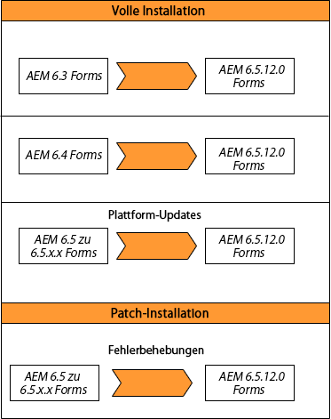

# Aktualisierung auf AEM 6.5 Forms on JEE {#upgrade-to-aem-forms-jee}

AEM 6.5.12.0 Forms on JEE bietet zwei Arten von Installationsprogrammen: Vollständiges Installationsprogramm und Patch-Installationsprogramm.

**Vollständiges Installationsprogramm**: Sie können das vollständige Installationsprogramm verwenden, um von AEM 6.3 Forms on JEE oder AEM 6.4 on JEE auf AEM 6.5.12.0 Forms on JEE zu aktualisieren. Dies ist auch für Kunden vorgesehen, die neue AEM Forms-Instanzen einrichten und nicht ersetzende Aktualisierungen durchführen.

**Patch-Installationsprogramm**: Patch-Installationsprogramm ist für Kunden vorgesehen, die bereits AEM 6.5.x.x verwenden. Sie können das Patch-Installationsprogramm verwenden, um auf die neueste Version von AEM Forms zu aktualisieren.

Die folgende Tabelle zeigt Szenarien für die Verwendung des Installers für vollständige Installationen und Patches.

Führen Sie das folgende Verfahren aus, um das vollständige Installationsprogramm für die Aktualisierung der bestehenden AEM 6.3 Forms on JEE oder AEM 6.4 Forms on JEE auf AEM 6.5.12.0 Forms on JEE zu verwenden:

1. Laden Sie das AEM 6.5 Forms on JEE-Installationsprogramm aus dem [Softwareverteilung](https://experience.adobe.com/#/downloads/content/software-distribution/en/aem.html). Für die Verwendung des Installationsprogramms benötigen Sie einen gültigen Wartungs- und Supportvertrag.
1. Siehe [Checkliste für die Aktualisierung und Planung](https://www.adobe.com/go/learn_aemforms_upgrade_checklist_65) , um mehr über die Prüfungen zu erfahren, die durchgeführt werden müssen, um eine erfolgreiche Aktualisierung sicherzustellen.
1. Siehe [Vorbereiten der Aktualisierung auf AEM Forms](https://www.adobe.com/go/learn_aemforms_prepareupgrade_65) , um zu erfahren, wie Sie die Aufgaben durchführen, die sicherstellen, dass das Upgrade ordnungsgemäß und mit minimalem Serverausfall ausgeführt wird.
1. Wählen Sie je nach vorhandener Umgebung und Anwendungsserver eines der folgenden Dokumente und befolgen Sie die Anweisungen.

   * [Upgrade von AEM 6.3 oder AEM 6.4 Forms auf AEM 6.5 Forms for JBoss ](http://www.adobe.com/go/learn_aemforms_upgradeJBoss_65)
   * [Upgrade von AEM 6.3 oder AEM 6.4 Forms auf AEM 6.5 Forms for WebSphere](http://www.adobe.com/go/learn_aemforms_upgradeWebSphere_65)
   * [Upgrade von AEM 6.3 oder AEM 6.4 Forms auf AEM 6.5 Forms for JBoss Turnkey](http://www.adobe.com/go/learn_aemforms_upgradeTurnkey_65)

Die direkte Aktualisierung von LiveCycle ES2, LiveCycle ES3, AEM 6.0 Forms, AEM 6.1 Forms, AEM 6.2 Forms auf AEM 6.5 ist nicht verfügbar. Sie können eine Zwischenaktualisierung auf eine oder mehrere Versionen von LiveCycle oder AEM Forms durchführen und dann auf AEM 6.5 Forms aktualisieren. Eine Liste der Zwischenversionen und entsprechenden Aktualisierungsanweisungen finden Sie unter [Aktualisierungspfad wählen](upgrade.md).
