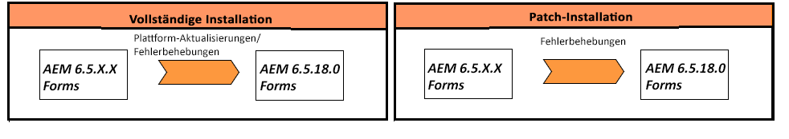

# Aktualisierung auf AEM 6.5 Forms auf JEE {#upgrade-to-aem-forms-jee}

AEM 6.5.18.0 Forms on JEE bietet zwei Arten von Installationsprogrammen: Vollständiges Installationsprogramm und Patch-Installationsprogramm.

**Vollinstallationsprogramm**: Sie können das [Vollinstallationsprogramm für AEM 6.5.18.0 on JEE](https://experienceleague.adobe.com/docs/experience-manager-release-information/aem-release-updates/forms-updates/aem-forms-releases.html?lang=de) verwenden, um neue AEM Forms-Instanzen einzurichten oder Upgrades von AEM 6.5.x.x Forms on JEE auf AEM 6.5.18.0 Forms on JEE durchzuführen.

**Patch-Installationsprogramm**: Das [Patch-Installationsprogramm für AEM 6.5.18.0 on JEE](https://experienceleague.adobe.com/docs/experience-manager-release-information/aem-release-updates/forms-updates/aem-forms-releases.html?lang=de) ist für Kundinnen und Kunden bestimmt, die bereits eine Version AEM 6.5.x.x verwenden. Mit dem Patch-Installationsprogramm können Sie eine Aktualisierung auf die neueste Version von AEM Forms durchführen.

Die folgende Tabelle zeigt Szenarien für die Verwendung des Installationsprogramms für vollständige Installationen und Patches.

Gehen Sie wie folgt vor, um mit dem Vollinstallationsprogramm ein Upgrade von AEM Forms 6.5.x.x on JEE auf AEM 6.5.18.0 Forms on JEE durchzuführen:

1. Laden Sie das Installationsprogramm für AEM 6.5 Forms on JEE von der [Software Distribution](https://experience.adobe.com/#/downloads/content/software-distribution/en/aem.html) herunter. Sie benötigen einen gültigen Wartungs- und Supportvertrag, um das Installationsprogramm zu verwenden.
1. Lesen Sie das Dokument [Checkliste für die Aktualisierung und Planung](https://www.adobe.com/go/learn_aemforms_upgrade_checklist_65_de), um sich über die Überprüfungen zu informieren, die für eine erfolgreiche Aktualisierung ausgeführt werden müssen.
1. Lesen Sie das Dokument [Vorbereiten auf die Aktualisierung auf AEM Forms](https://www.adobe.com/go/learn_aemforms_prepareupgrade_65_de), um zu erfahren, wie Sie die Aufgaben durchführen, die sicherstellen, dass die Aktualisierung richtig und nur mit minimalem Serverausfall verläuft.
1. Wählen Sie je nach vorhandener Umgebung und Anwendungsserver eines der folgenden Dokumente und befolgen Sie die Anweisungen.

   * [Upgrade von AEM 6.3 oder AEM 6.4 Forms auf AEM 6.5 Forms for JBoss ](https://www.adobe.com/go/learn_aemforms_upgradeJBoss_65_de)
   * [Upgrade von AEM 6.3 oder AEM 6.4 Forms auf AEM 6.5 Forms for WebSphere](https://www.adobe.com/go/learn_aemforms_upgradeWebSphere_65_de)
   * [Upgrade von AEM 6.3 oder AEM 6.4 Forms auf AEM 6.5 Forms for JBoss Turnkey](https://www.adobe.com/go/learn_aemforms_upgradeTurnkey_65_de)

Die direkte Aktualisierung von LiveCycle ES2, Live Cycle ES3, AEM 6.0 Forms, AEM 6.1 Forms oder AEM 6.2 Forms auf AEM 6.5 Forms ist nicht verfügbar. Sie können eine Zwischenaktualisierung auf eine oder mehrere Versionen von LiveCycle oder AEM Forms durchführen und dann auf AEM 6.5 Forms aktualisieren. Eine Liste der Zwischenversionen und entsprechenden Aktualisierungsanweisungen finden Sie unter [Auswählen eines Aktualisierungspfads](upgrade.md).
