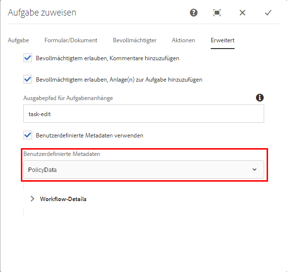

# Verwenden von Metadaten in einer E-Mail-Benachrichtigung {#use-metadata-in-an-email-notification}

Mithilfe des Schritts „Aufgabe zuweisen“ können Sie einem Benutzer oder einer Gruppe Aufgaben zuweisen. Wenn eine Aufgabe einem Benutzer oder einer Gruppe zugewiesen wird, erhält der definierte Benutzer oder jedes Mitglied der definierten Gruppe eine E-Mail-Benachrichtigung. Eine typische [E-Mail-Benachrichtigung](../../forms/using/use-custom-email-template-assign-task-step.md) enthält einen Link zur zugewiesenen Aufgabe und dazugehörige Informationen.

Sie können Metadaten in einer E-Mail-Vorlage verwenden, um Informationen in einer E-Mail-Benachrichtigung dynamisch auszufüllen. Beispielsweise werden die Werte für Titel, Beschreibung, Fälligkeitsdatum, Priorität, Workflow und letztes Datum in der folgenden E-Mail-Benachrichtigung dynamisch zur Laufzeit ausgewählt (wenn eine E-Mail-Benachrichtigung erstellt wird).


Metadaten werden in Schlüssel-Wert-Paaren gespeichert. Sie können den Schlüssel in der E-Mail-Vorlage angeben und er wird zur Laufzeit durch einen Wert ersetzt (wenn eine E-Mail-Benachrichtigung erstellt wird). Im folgenden Codebeispiel ist beispielsweise &quot;$ {workitem_title}&quot; ein Schlüssel. Er wird zur Laufzeit durch den Wert „Loan-Request“ ersetzt.

```html
subject=Task Assigned - ${workitem_title}

message=<html><body>\n\
 <table style="width: 480px; font-family: Helvetica, Arial, sans-serif; border: 0; padding: 0; vertical-align: top; text-align: left; word-wrap: break-word; margin: 16px auto; color:#323232; background-color:#FFFCF9; border-collapse: collapse;">\n\
  <tbody>\n\
   <tr>\n\
    <td style="height: 100px; width: 480px; background-color: #FFE0CB; border-top: 5pt solid black; font-family: Helvetica, Arial, sans-serif; font-weight: bold; font-size: 15px; line-height: 20px; padding: 12px; color: #707070;">\n\
      Sample Company\n\
    </td>\n\
   </tr>\n\
   <tr>\n\
    <td style="font-family: Helvetica, Arial, sans-serif; height: auto; background-color: #FFFCF9; padding: 32px 16px 20px 16px; ">\n\
     <pre style="font-size: 13px; font-family: Helvetica, Arial, sans-serif;  font-weight: normal; color: #323232;"> Hello ${workitem_assignee},\n\
 The following task has been assigned to you:</pre>\n\
    </td>\n\
   </tr>\n\
   <tr>\n\
    <td style="width: 480px;">\n\
     <table style="height: auto; width: 480px; background-color:#FFFBF9; font-family: Helvetica, Arial, sans-serif; border-collapse: collapse;">\n\
      <tbody>\n\
       <tr style="border-bottom: solid 2px #FFFCF9;">\n\
        <td style="font-family: Helvetica, Arial, sans-serif; width: auto; height: auto; background-color:#FFF5EF; font-weight: bold; font-size: 11px; line-height: 20px; padding: 12px; color: #707070;"> TITLE</td>\n\
        <td style="font-family: Helvetica, Arial, sans-serif; background-color:#FFF5EF; text-align: left; vertical-align: middle; height: auto; font-weight: normal; font-size: 13px; line-height: 20px; padding: 10px 16px 10px 32px; color: #323232;">\n\
         <p>${workitem_title}</p>\n\
        </td>\n\
       </tr>\n\
                            <tr style="border-bottom: solid 2px #FFFCF9;">\n\
        <td style="font-family: Helvetica, Arial, sans-serif; width: auto; height: auto; background-color:#FFF5EF; font-weight: bold; font-size: 11px; line-height: 20px; padding: 12px; color: #707070;"> DESCRIPTION</td>\n\
        <td style="font-family: Helvetica, Arial, sans-serif; background-color:#FFF5EF; text-align: left; vertical-align: middle; height: auto; font-weight: normal; font-size: 13px; line-height: 20px; padding: 10px 16px 10px 32px; color: #323232;">\n\
         <p>${workitem_description}</p>\n\
        </td>\n\
       </tr>\n\
       <tr style="border-bottom: solid 2px #FFFCF9;">\n\
        <td style="font-family: Helvetica, Arial, sans-serif; width: auto; height: auto; background-color:#FFF5EF; font-weight: bold; font-size: 11px; line-height: 20px; padding: 12px; color: #707070;"> DUE DATE</td>\n\
        <td style="font-family: Helvetica, Arial, sans-serif; background-color:#FFF5EF; text-align: left; vertical-align: middle; height: auto; font-weight: normal; font-size: 13px; line-height: 20px; padding: 10px 16px 10px 32px; color: #323232;">\n\
         <p>${workitem_due_date}</p>\n\
        </td>\n\
       </tr>\n\
       <tr style="border-bottom: solid 2px #FFFCF9;">\n\
        <td style="font-family: Helvetica, Arial, sans-serif; width: auto; height: auto; background-color:#FFF5EF; font-weight: bold; font-size: 11px; line-height: 20px; padding: 12px; color: #707070;"> PRIORITY</td>\n\
        <td style="font-family: Helvetica, Arial, sans-serif; background-color:#FFF5EF; text-align: left; vertical-align: middle; height: auto; font-weight: normal; font-size: 13px; line-height: 20px; padding: 10px 16px 10px 32px; color: #323232;">\n\
         <p>${workitem_priority}</p>\n\
        </td>\n\
       </tr>\n\
       <tr>\n\
        <td style="font-family: Helvetica, Arial, sans-serif; width: auto; height: auto; background-color:#FFF5EF; font-weight: bold; font-size: 11px; line-height: 20px; padding: 12px; color: #707070;"> WORKFLOW</td>\n\
        <td style="font-family: Helvetica, Arial, sans-serif; background-color:#FFF5EF; text-align: left; vertical-align: middle; height: auto; font-weight: normal; font-size: 13px; line-height: 20px; padding: 10px 16px 10px 32px; color: #323232;">\n\
         <p>${workitem_workflow}</p>\n\
        </td>\n\
       </tr>\n\
      </tbody>\n\
     </table>\n\
    </td>\n\
   </tr>\n\
   <tr style = "text-align: center; vertical-align: middle;">\n\
    <td style="padding:48px 0 72px 0;"> \n\
     <a href="${workitem_url}" target="_blank" style="background-color: #1EBBBB; font-size: 18px; line-height: 25px; font-weight: bold; color: #FFFFFF; text-decoration: none; padding: 15px 15px 15px 15px;">Open Task</a>\n\
    </td>\n\
   </tr>\n\
   <tr>\n\
    <td style="border-top: solid 1px #EDEAE7; padding: 16px;">\n\
     <p><span style="font-size: 12px; font-weight: normal; font-style: italic; color: #919191;">This is an automatically generated email. Please do not reply to this email.</code></p>\n\
    </td>\n\
   </tr>\n\
  </tbody>\n\
 </table>\n\
</body>\n\
</html>\n\
```

## Verwenden von systemgenerierten Metadaten in einer E-Mail-Benachrichtigung {#using-system-generated-metadata-in-an-email-notification}

Eine AEM Forms-Anwendung bietet verschiedene standardmäßige Metadatenvariable (Schlüssel-Wert-Paare). Sie können diese Variablen in einer E-Mail-Vorlage verwenden. Der Wert der Variable basiert auf der verknüpften Formularanwendung. Die folgende Tabelle enthält alle Metadatenvariablen, die standardmäßig zur Verfügung stehen:

<table>
 <tbody> 
  <tr> 
   <td>Schlüssel</td> 
   <td>Beschreibung</td> 
  </tr> 
  <tr> 
   <td>workitem_title</td> 
   <td>Titel der verknüpften Formularanwendung.</td> 
  </tr> 
  <tr> 
   <td>workitem_url</td> 
   <td>URL für den Zugriff auf die verknüpfte Formularanwendung.</td> 
  </tr> 
  <tr> 
   <td>workitem_description</td> 
   <td>Beschreibung der verknüpften Formularanwendung.</td> 
  </tr> 
  <tr> 
   <td>workitem_priority</td> 
   <td>Festgelegte Priorität der verknüpften Formularanwendung.</td> 
  </tr> 
  <tr> 
   <td>workitem_due_date</td> 
   <td>Letztes Datum für die Ausführung der verknüpften Formularanwendung.</td> 
  </tr> 
  <tr> 
   <td>workitem_workflow</td> 
   <td>Name des Workflows, der mit der Formularanwendung verknüpft ist.</td> 
  </tr> 
  <tr> 
   <td>workitem_assign_timestamp</td> 
   <td>Datum und Uhrzeit der Zuweisung des Workflow-Elements zum derzeitig Verantwortlichen.</td> 
  </tr> 
  <tr> 
   <td>workitem_assignee</td> 
   <td>Name des derzeitig Verantwortlichen.</td> 
  </tr> 
  <tr> 
   <td>host_prefix</td> 
   <td>URL des Autorenservers. Beispiel: https://10.41.42.66:4502<br /> </td> 
  </tr> 
  <tr> 
   <td>publish_prefix</td> 
   <td>URL des Veröffentlichungsservers. Beispiel: https://10.41.42.66:4503</td> 
  </tr> 
 </tbody> 
</table>

## Verwenden von benutzerdefinierten Metadaten in einer E-Mail-Benachrichtigung {#using-custom-metadata-in-an-email-notification}

Sie können auch benutzerdefinierte Metadaten in einer E-Mail-Benachrichtigung verwenden. Benutzerdefinierte Metadaten enthalten Informationen zusätzlich zu systemseitig generierten Metadaten. Dies können beispielsweise Richtliniendetails aus einer Datenbank sein. Sie können ein ECMAScript- oder OSGi-Bundle verwenden, um benutzerdefinierte Metadaten in crx-repository hinzuzufügen:

### Verwenden von ECMAScript zum Hinzufügen benutzerdefinierter Metadaten  {#use-ecmascript-to-add-custom-metadata}

[ECMAScript](https://de.wikipedia.org/wiki/ECMAScript) ist eine Skriptsprache. Sie wird für die Client-seitige Skripterstellung und Server-Anwendungen verwendet. Führen Sie die folgenden Schritte aus, um ECMAScript zum Hinzufügen benutzerdefinierter Metadaten für eine E-Mail-Vorlage zu verwenden:

1. Melden Sie sich bei CRX DE mit einem Administratorkonto an. Die URL lautet https://&#39;[server]:[port]&#39;/crx/de/index.jsp

1. Navigieren Sie zu /apps/fd/dashboard/scripts/metadataScripts. Erstellen Sie eine Datei mit der Erweiterung „.ecma“. Beispiel: usermetadata.ecma

   Wenn der oben angegebene Pfad nicht vorhanden ist, erstellen Sie ihn.

1. Fügen Sie der .ecma-Datei Code mit einer Logik zum Generieren benutzerdefinierter Metadaten in Schlüssel-Wert-Paaren hinzu. Beispielsweise generiert der folgende ECMAScript-Code benutzerdefinierte Metadaten für eine Versicherungsrichtlinie:

   ```javascript
   function getUserMetaData()  {
       //Commented lines below provide an overview on how to set user metadata in map and return it.
       var HashMap = Packages.java.util.HashMap;
       var valuesMap = new HashMap();
       valuesMap.put("policyNumber", "2017568972695");
       valuesMap.put("policyHolder", "Adobe Systems");
   
       return valuesMap;
   }
   ```

1. Klicken Sie auf Alle speichern. Jetzt ist das Skript zur Auswahl im AEM-Workflow-Modell verfügbar.

   

1. (Optional) Geben Sie den Titel des Skripts an:

   Wenn Sie keinen Titel angeben, zeigt das Feld „Benutzerdefinierte Metadaten den vollständigen Pfad der ECMAScript-Datei an. Führen Sie die folgenden Schritte aus, um einen aussagekräftigen Titel für das Skript festzulegen:

   1. Erweitern Sie den Skriptknoten, klicken Sie mit der rechten Maustaste auf den Knoten **[!UICONTROL jcr:content]** und dann auf **[!UICONTROL Mixins]**.
   1. Geben Sie in das Dialogfeld „mix:title“ ein und klicken Sie auf **+**.
   1. Fügen Sie eine Eigenschaft mit den folgenden Werten hinzu.

      | Name | jcr:title |
      |---|---|
      | Typ | Zeichenfolge |
      | Wert | Geben Sie den Titel des Skripts an. Beispiel: Benutzerdefinierte Metadaten für den Richtlinieneigentümer. Der angegebene Wert wird im Schritt „Aufgabe zuweisen“ angezeigt. |

### Verwenden eines OSGi-Bundles und einer Java-Schnittstelle zum Hinzufügen benutzerdefinierter Metadaten {#use-an-osgi-bundle-and-java-interface-to-add-custom-metadata}

Sie können die Java-Schnittstelle „WorkitemUserMetadataService“ zum Hinzufügen benutzerdefinierter Metadaten für E-Mail-Vorlagen verwenden. Erstellen Sie ein OSGi-Bundle, das die Java-Schnittstelle „WorkitemUserMetadataService“ verwendet, und stellen Sie es auf dem AEM Forms-Server bereit. Dadurch werden die Metadaten zur Auswahl im Schritt „Aufgabe zuweisen“ verfügbar.

Um ein OSGi-Bundle mit Java-Schnittstelle zu erstellen, fügen Sie dem OSGi-Bundle-Projekt die Dateien [AEM Forms Client SDK](https://helpx.adobe.com/de/aem-forms/kb/aem-forms-releases.html) und [granite jar](https://repo1.maven.org/maven2/com/adobe/granite/com.adobe.granite.workflow.api/1.0.2/) als externe Abhängigkeiten hinzu. Sie können eine beliebigen Java-IDE verwenden, um ein OSGi-Bundle zu erstellen. Das folgende Beispiel zeigt die Erstellung eines OSGi-Bundles mithilfe von Eclipse:

1. Öffnen Sie die Eclipse-IDE. Navigieren Sie zu Datei > Neues Projekt.

1. Wählen Sie im Assistenten-Dialogfeld Maven-Projekt und klicken Sie auf Weiter.

1. Behalten Sie im Feld „New Maven Project“ die Standardeinstellungen bei und klicken Sie auf „Next“. Wählen Sie einen Archetyp aus und klicken Sie auf „Next“. Beispiel: maven-archetype-quickstart. Geben Sie Group Id, Artifact ID, Version und Paket für das Projekt an und klicken Sie auf Beenden. Das Projekt wird erstellt.

1. Öffnen Sie die Datei „pom.xml“ zur Bearbeitung und ersetzen Sie den gesamten Inhalt dieser Datei durch den folgenden Text:

1. Fügen Sie Quellcode hinzu, der die Java-Schnittstelle „WorkitemUserMetadataService“ zum Hinzufügen benutzerdefinierter Metadaten für E-Mail-Vorlagen verwendet. Ein Beispielcode wird unten angezeigt:

   ```java
   package com.aem.impl;
   
   import com.adobe.fd.workspace.service.external.WorkitemUserMetadataService;
   import org.apache.felix.scr.annotations.Component;
   import org.apache.felix.scr.annotations.Properties;
   import org.apache.felix.scr.annotations.Property;
   import org.apache.felix.scr.annotations.Service;
   import org.osgi.framework.Constants;
   
   import java.util.HashMap;
   import java.util.Map;
   
   @Component
   @Service
   @Properties({
           @Property(name = Constants.SERVICE_DESCRIPTION, value = "A sample implementation of a user metadata service."),
           @Property(name = WorkitemUserMetadataService.SERVICE_PROPERTY_LABEL, value = "Default User Metadata Service")})
   
   public class WorkitemUserMetadataServiceImpl
     implements WorkitemUserMetadataService
   {
     public WorkitemUserMetadataServiceImpl() {}
   
     public Map<String, String> getUserMetadataMap()
     {
       HashMap<String, String> metadataMap = null;
       metadataMap = new HashMap();
       metadataMap.put("test_metadata", "tested-interface implementation");
       return metadataMap;
     }
   }
   ```

1. Öffnen Sie eine Eingabeaufforderung und navigieren Sie zum Verzeichnis, das das OSGi-Bundle-Projekt enthält. Verwenden Sie den folgenden Befehl, um das OSGi-Paket zu erstellen:

   `mvn clean install`

1. Laden Sie das Bundle auf einen AEM Forms-Server hoch. Sie können AEM Package Manager verwenden, um das Paket in einen AEM Forms-Server zu importieren.

Nachdem das Bundle importiert wurde, können Sie die Metadaten im Schritt „Aufgabe zuweisen“ auswählen und als E-Mail-Vorlage verwenden.
