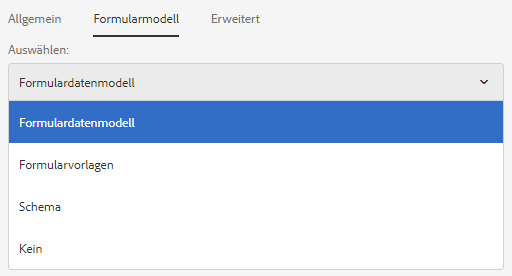
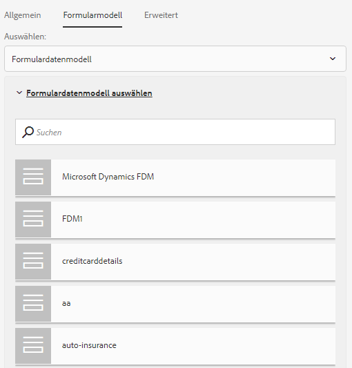

# Verwenden eines Formulardatenmodells{#use-form-data-model}

| Version | Artikel-Link |
| -------- | ---------------------------- |
| AEM as a Cloud Service | [Hier klicken](https://experienceleague.adobe.com/docs/experience-manager-cloud-service/content/forms/integrate/use-form-data-model/using-form-data-model.html?lang=de) |
| AEM 6.5 | Dieser Artikel |

Mit der AEM Forms-Datenintegration können Sie unterschiedliche Backend-Datenquellen verwenden, um ein Formulardatenmodell zu erstellen, das Sie als Schema in verschiedenen adaptiven Formularen und interaktiven Kommunikations-Workflows verwenden können. Dafür ist das Konfigurieren von Datenquellen und das Erstellen von Formulardatenmodellen erforderlich, basierend auf Datenmodellobjekten sowie Diensten, die in den Datenquellen verfügbar sind. Weitere Informationen finden Sie in den folgenden Themen:

* [Datenintegration für AEM Forms](../../forms/using/data-integration.md)
* [Konfigurieren von Datenquellen](../../forms/using/configure-data-sources.md)
* [Erstellen des Formulardatenmodells](../../forms/using/create-form-data-models.md)
* [Arbeiten mit einem Formulardatenmodell](../../forms/using/work-with-form-data-model.md)

Ein Formulardatenmodell ist eine Erweiterung des JSON-Schemas, die Sie wie folgt verwenden können:

* [Adaptive Formulare und Fragmente erstellen](#create-af)
* [Interaktive Kommunikation und Bausteine wie Text, Liste und Bedingungsfragmente erstellen](#create-ic)
* [Vorschau für interaktive Kommunikation mit Beispieldaten](#preview-ic)
* [Adaptive Formulare und interaktive Kommunikation ausfüllen](#prefill)
* [Gesendete adaptive Formulardaten zurück in Datenquellen schreiben](#write-af)
* [Dienste über Regeln für adaptive Formulare aufrufen](#invoke-services)

## Erstellen adaptiver Formulare und Fragmente {#create-af}

Sie können [adaptive Formulare](../../forms/using/creating-adaptive-form.md) und [adaptive Formularfragmente](../../forms/using/adaptive-form-fragments.md) auf Grundlage eines Formulardatenmodells erstellen. Gehen Sie wie folgt vor, um ein Formulardatenmodell beim Erstellen eines adaptiven Formulars oder eines adaptiven Formularfragments zu verwenden:

1. Wählen Sie auf der Registerkarte „Formularmodell“ im Bildschirm „Eigenschaften hinzufügen“ **[!UICONTROL Formulardatenmodell]** aus der Dropdownliste **[!UICONTROL Auswählen aus]**.

   

1. Wählen Sie zum Erweitern **[!UICONTROL Formulardatenmodell auswählen]** aus. Alle verfügbaren Formulardatenmodelle werden aufgelistet.

   Wählen Sie ein Formulardatenmodell aus.

   

1. (**Nur adaptive Formularfragmente**) Sie können ein adaptives Formularfragment auf Grundlage eines einzelnen Datenmodellobjekts in einem Formulardatenmodell erstellen. Erweitern Sie die Dropdown-Liste **[!UICONTROL Definitionen für Formulardatenmodell]**. Hier sind sämtliche Datenmodellobjekte im angegebenen Formulardatenmodell aufgelistet. Wählen Sie ein Datenmodellobjekt aus der Liste aus.

   

Sobald das auf einem Formulardatenmodell basierende adaptive Formular oder Formularfragment erstellt ist, werden Formulardatenobjekte auf der Registerkarte **[!UICONTROL Datenmodellobjekte]** des Inhaltsbrowsers im Editor für adaptive Formulare angezeigt.

>[!NOTE]
>
>Für adaptive Formularfragmente werden nur das beim Verfassen gewählte Datenmodellobjekt und die mit diesem verknüpften Datenmodellobjekte auf der Registerkarte „Datenmodellobjekte“ angezeigt.

Indem Sie Datenmodellobjekte in das adaptive Formular oder Fragment ziehen und dort ablegen, können Sie Formularfelder hinzufügen. Für die hinzugefügten Formularfelder bleiben die Metadateneigenschaften und die Bindung der Datenmodellobjekteigenschaften erhalten. Die Bindung stellt sicher, dass die Feldwerte in den entsprechenden Datenquellen bei der Formularübermittlung aktualisiert und beim Rendern des Formulars vorausgefüllt werden.

## Erstellen von interaktiven Kommunikationen {#create-ic}

Sie können eine interaktive Kommunikation basierend auf einem Formulardatenmodell erstellen, mit dem Sie die interaktive Kommunikation mit Daten aus konfigurierten Datenquellen vorab füllen können. Darüber hinaus können die Bausteine einer interaktiven Kommunikation, wie etwa Text-, Listen- und Bedingungsdokumentfragmente, auf einem Formulardatenmodell basieren.

Sie können beim Erstellen einer interaktiven Kommunikation oder eines Dokumentfragments ein Formulardatenmodell auswählen. Die folgende Abbildung zeigt die Registerkarte „Allgemein“ des Dialogfelds „Interaktive Kommunikation erstellen“.

Registerkarte „Allgemein“ des Dialogfelds „Interaktive Kommunikation erstellen“

Weitere Informationen finden Sie unter:

[Interaktive Kommunikation erstellen](../../forms/using/create-interactive-communication.md)

[Text in interaktiven Kommunikationen](/help/forms/using/texts-interactive-communications.md)

[Bedingungen in interaktiven Kommunikationen](/help/forms/using/conditions-interactive-communications.md)

[Fragmente aufführen](/help/forms/using/lists.md)

## Vorschau mit Beispieldaten {#preview-ic}

Mit dem Formulardatenmodelleditor können Sie Beispieldaten für Datenmodellobjekte im Formulardatenmodell generieren und bearbeiten. Sie können diese Daten verwenden, um interaktive Kommunikationen und adaptive Formulare in der Vorschau anzuzeigen und zu testen. Generieren Sie die Beispieldaten vor der Vorschau wie unter [Arbeiten mit einem Formulardatenmodell](../../forms/using/work-with-form-data-model.md#sample) beschrieben.

So zeigen Sie eine Vorschau einer interaktiven Kommunikation mit Musterformular-Datenmodelldaten an:

1. Navigieren Sie auf dem AEM-Server zu **[!UICONTROL Formulare > Formulare und Dokumente]**.
1. Wählen Sie eine interaktive Kommunikation und **[!UICONTROL Vorschau]** in der Symbolleiste aus, um **[!UICONTROL Web-Kanal]**, **[!UICONTROL Druckkanal]** oder **[!UICONTROL Beide Kanäle]** auszuwählen und eine Vorschau der interaktiven Kommunikation anzuzeigen.
1. Stellen Sie im Vorschau-Dialogfeld [*Kanal*] sicher, dass **[!UICONTROL Testdaten des Formulardatenmodells]** ausgewählt ist, und wählen Sie **[!UICONTROL Vorschau]** aus.

Die interaktive Kommunikation öffnet sich mit vorbefüllten Beispieldaten.

Um ein adaptives Formular mit Beispieldaten in der Vorschau anzuzeigen, öffnen Sie das adaptive Formular im Autorenmodus und wählen Sie **[!UICONTROL Vorschau]** aus.

## Vorbefüllen mit dem Formulardatenmodelldienst {#prefill}

AEM Forms bietet einen standardmäßigen Vorbefüllungsdienst für Formulardatenmodelle, den Sie für adaptive Formulare und interaktive Kommunikationen auf Basis eines Formulardatenmodells aktivieren können. Der Vorbefüllungsdienst fragt Datenquellen nach Datenmodellobjekten im adaptiven Formular ab und befüllt dementsprechend Daten, während das Formular oder die Kommunikation gerendert wird.

Um den Vorbefüllungsdienst für Formulardatenmodelle für ein adaptives Formular zu aktivieren, öffnen Sie die Eigenschaften des Containers für ein adaptives Formular und wählen Sie **[!UICONTROL Vorbefüllungsdienst für Formulardatenmodell]** aus der Dropdown-Liste **[!UICONTROL Vorbefüllungsdienst]** im Akkordeon „Standard“ aus. Speichern Sie anschließend die Eigenschaften.

Um den Vorbefüllungs-Dienst für Formulardatenmodelle in einer interaktiven Kommunikation zu konfigurieren, können Sie im Dropdown-Liste für den Vorbefüllungs-Dienst den Vorbefüllungs-Dienst für Formulardatenmodelle während der Erstellung auswählen, oder später, indem Sie die Eigenschaften ändern.

Dialogfeld „Eigenschaften bearbeiten“ für eine interaktive Kommunikation

## Schreiben von übermittelten adaptiven Formulardaten in Datenquellen {#write-af}

Sie können ein auf einem Formulardatenmodell basierendes Formular so konfigurieren, dass die vom Benutzer im Formular übermittelten Daten für ein Datenmodellobjekt bei der Übermittlung in dessen Datenquellen geschrieben werden. Zu diesem Zweck steht in AEM Forms die [Übermittlungsaktion für Formulardatenmodelle](../../forms/using/configuring-submit-actions.md) zur Verfügung. Standardmäßig ist sie nur für adaptive Formulare verfügbar, die auf einem Formulardatenmodell basieren. Durch diese Aktion werden übermittelte Daten für ein Datenmodellobjekt in dessen Datenquelle geschrieben.

Um die Übermittlungsaktion für Formulardatenmodelle zu konfigurieren, öffnen Sie die Adaptive Form-Container-Eigenschaften und wählen Sie **[!UICONTROL Übermitteln mit dem Formulardatenmodell]** aus dem Dropdown-Menü „Übermittlungsaktion“ unter dem Akkordeon „Übermittlung“. Suchen Sie dann das gewünschte Datenmodellobjekt in der Dropdownliste **[!UICONTROL Name des zu übermittelnden Modellobjekts]** und wählen Sie es aus. Speichern Sie die Eigenschaften.

Beim Übermitteln des Formulars werden die Daten für das konfigurierte Datenmodellobjekt in die entsprechende Datenquelle geschrieben.

Mithilfe der Objekteigenschaft „Binärdatenmodell“ können Sie auch Formularanhänge an eine Datenquelle senden. Führen Sie folgende Schritte aus, um Anlagen an eine JDBC-Datenquelle zu senden:

1. Fügen Sie dem Formulardatenmodell ein Datenmodellobjekt hinzu, das eine binäre Eigenschaft enthält.
1. Ziehen Sie im adaptiven Formular die Komponente **[!UICONTROL Dateianhang]** aus dem Komponentenbrowser in das adaptive Formular und legen Sie sie dort ab.
1. Wählen Sie die hinzugefügte Komponente und  aus, um den Eigenschaften-Browser für die Komponente zu öffnen.
1. Wählen Sie im Feld „Bindungsverweis“  aus und navigieren Sie zur binären Eigenschaft, die Sie im Formulardatenmodell hinzugefügt haben, um sie auszuwählen. Konfigurieren Sie weitere Eigenschaften entsprechend.

   Wählen Sie  aus, um die Eigenschaften zu speichern. Das Anlagenfeld ist jetzt an die binäre Eigenschaft des Formulardatenmodells gebunden.

1. Aktivieren Sie im Übermittlungsabschnitt der Eigenschaften des Containers für adaptive Formulare die Option **[!UICONTROL Formularanhänge einreichen]**. Dadurch wird der Anhang im Feld der binären Eigenschaften bei der Übermittlung des Formulars an die Datenquelle gesendet.

## Aufrufen von Diensten in adaptiven Formularen mithilfe von Regeln {#invoke-services}

In einem auf einem Formulardatenmodell basierenden adaptiven Formular können Sie [Regeln erstellen](../../forms/using/rule-editor.md), um die im Formulardatenmodell konfigurierten Dienste aufzurufen. Für die Operation **[!UICONTROL Dienste aufrufen]** werden alle verfügbaren Dienste im Formulardatenmodell aufgelistet und Sie können die Eingabe- und Ausgabefelder für den Dienst auswählen. Sie können mit dem Regeltyp **Wert festlegen** außerdem einen Formulardatenmodell-Service aufrufen und die vom Service zurückgegebene Ausgabe als Wert eines Feldes einstellen.

Beispielsweise ruft folgende Regel einen Get-Service auf, für den die Mitarbeiter-ID als Eingabe angegeben werden muss und der die entsprechenden Werte in den Feldern für die Angehörigen-ID, den Nachnamen, den Vornamen und das Geschlecht zurückgibt.

Darüber hinaus können Sie mithilfe der `guidelib.dataIntegrationUtils.executeOperation`-API ein JavaScript im Codeeditor für den Regeleditor schreiben. Informationen zur API finden Sie unter [API zum Aufrufen des Formulardatenmodelldienstes](/help/forms/using/invoke-form-data-model-services.md).
