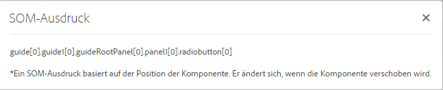

# Verwenden von SOM-Ausdrücken in adaptiven Formularen{#using-som-expressions-in-adaptive-forms}

Adaptive Formulare werden als AEM-Seite modelliert, die im AEM-Repository als JCR-Inhaltstruktur dargestellt wird. Das Schlüsselelement der Inhaltsstruktur ist der Knoten „guideContainer“. Unter „guideContainer“ befindet sich der Knoten „rootPanel“, der verschachtelte Bedienfelder und Felder enthalten kann.

Sie können ein Skripting-Objektmodell (SOM) verwenden, um Werte, Eigenschaften und Methoden innerhalb eines bestimmten Dokumentobjektmodells (DOM) zu referenzieren. Ein DOM organisiert die Speicherobjekte und Eigenschaften in einer hierarchischen Baumstruktur. Ein SOM-Ausdruck verweist auf Felder/Zeichenelemente und Bedienfelder.

Die folgende Abbildung zeigt eine Knotenstruktur, in die ein adaptives Formular umgesetzt wird, wenn Sie einem Formular Komponenten hinzufügen. Sie können beispielsweise dem Stammbereich einen Bereich und diesem dann ein Optionsfeld hinzufügen. Der Bereich wird dann zur Laufzeit in ein DOM transformiert. Der SOM-Ausdruck für das Optionsfeld im adaptiven Formular wird als `guide[0].guide1[0].guideRootPanel[0].panel1[0].radiobutton[0]` angegeben.

DOM-Baumstruktur

Einem SOM-Ausdruck für ein beliebiges Element in einem adaptiven Formular wird das Präfix `guide[0].guide1[0]` vorangestellt. Die Position einer Komponente in der hierarchischen Knotenstruktur wird zum Ableiten des entsprechenden SOM-Ausdrucks verwendet.

DOM-Baumstruktur mit zwei Optionsfeldern

Der SOM-Ausdruck ändert sich, wenn Sie die Position der Optionsfelder im adaptiven Formular ändern. Im Authoring-Modus können Sie den SOM-Ausdruck eines Felds oder Elements in AEM Forms mithilfe der Option „SOM-Ausdruck anzeigen“ anzeigen. Die Option wird auf dem Bereich angezeigt und wenn Sie mit der rechten Maustaste auf das Feld oder Element klicken.

Extrahieren von SOM-Ausdrücken in einem adaptiven Formular

Innerhalb von Bereichen können Sie von der Bereichssymbolleiste aus auf die Funktion zugreifen. Die Funktion vereinfacht die Skripterstellung durch Autoren adaptiver Formulare.

Extrahieren von SOM-Ausdrücken mithilfe der Bereichssymbolleiste

Einige in [GuideBridge](https://helpx.adobe.com/de/aem-forms/6/javascript-api/GuideBridge.html) aufgeführte APIs verwenden den SOM-Ausdruck eines Elements. Um beispielsweise ein bestimmtes Feld in einem adaptiven Formular hervorzuheben, muss der entsprechende SOM-Ausdruck an die `getFocus`-API in `guideBridge` übergeben werden.
