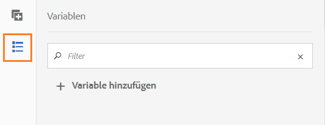

# Variablen in AEM Forms Workflows{#variables-in-aem-forms-workflows}

Eine Variable in einem Workflow-Modell ist eine Methode, einen Wert basierend auf seinem Datentyp zu speichern. Anschließend können Sie den Namen der Variablen in jedem Workflow-Schritt verwenden, um den in der Variablen gespeicherten Wert abzurufen. Sie können auch Variablennamen verwenden, um Ausdruck für Routing-Entscheidungen zu definieren.

In AEM Workflow-Modellen haben Sie folgende Möglichkeiten:

* [Erstellen Sie eine ](../../forms/using/variable-in-aem-workflows.md#create-a-variable) Variable eines Datentyps basierend auf dem Informationstyp, den Sie darin speichern möchten.
* [Legen Sie einen Wert für die ](../../forms/using/variable-in-aem-workflows.md#set-a-variable) Variable fest, indem Sie den Arbeitsablaufschritt &quot;Variable festlegen&quot;verwenden.
* [Verwenden Sie die ](../../forms/using/variable-in-aem-workflows.md#use-a-variable) Variable in allen Arbeitsablaufschritten von AEM Forms, um den gespeicherten Wert abzurufen, und in den Schritten &quot;ODER teilen&quot;und &quot;Weiter&quot;, um einen Routing-Ausdruck zu definieren.

Das folgende Video zeigt, wie Sie Variablen in AEM Workflow-Modellen erstellen, festlegen und verwenden können:

>[!VIDEO](https://helpx.adobe.com/content/dam/help/en/experience-manager/6-5/forms/using/variables_introduction_1_1.mp4)

Variablen sind eine Erweiterung der vorhandenen [MetaDataMap](https://helpx.adobe.com/experience-manager/6-5/sites/developing/using/reference-materials/javadoc/com/adobe/granite/workflow/metadata/MetaDataMap.html)-Schnittstelle. Sie können [MetaDataMap](https://helpx.adobe.com/experience-manager/6-5/sites/developing/using/reference-materials/javadoc/com/adobe/granite/workflow/metadata/MetaDataMap.html) in ECMAScript verwenden, um mit Variablen gespeicherte Metadaten aufzurufen.

## Variable {#create-a-variable} erstellen

Sie erstellen Variablen mithilfe des Abschnitts &quot;Variablen&quot;im Sidekick des Workflow-Modells. AEM Workflow-Variablen unterstützen die folgenden Datentypen:

* **Primitive-Datentypen**: Lang, Dublette, Boolescher Wert, Datum und Zeichenfolge
* **Komplexe Datentypen**:  [Dokument](https://helpx.adobe.com/experience-manager/6-5/forms/javadocs/com/adobe/aemfd/docmanager/Document.html)-,  [XML](https://docs.oracle.com/javase/8/docs/api/org/w3c/dom/Document.html)-,  [JSON](https://static.javadoc.io/com.google.code.gson/gson/2.3/com/google/gson/JsonObject.html)- und Formulardatenmodellinstanz.

>[!NOTE]
>
>Workflows unterstützt nur das ISO8601-Format für Datumsvariablen.

Für Dokument- und Formulardatenmodelldatentypen ist das AEM Forms-Add-On-Paket](https://helpx.adobe.com/aem-forms/kb/aem-forms-releases.html) erforderlich.  [  Verwenden Sie den ArrayList-Datentyp, um variable Sammlungen zu erstellen. Sie können die ArrayList-Variable für alle primitiven und komplexen Datentypen erstellen. Erstellen Sie beispielsweise eine ArrayList-Variable und wählen Sie String als Untertyp aus, um mehrere Zeichenfolgenwerte mit der Variablen zu speichern.

Führen Sie die folgenden Schritte aus, um eine Variable zu erstellen:

1. Navigieren Sie in einer AEM zu Tools  > Workflow > Modelle.
1. Tippen Sie auf **[!UICONTROL Erstellen]** und geben Sie den Titel und einen optionalen Namen für das Workflow-Modell an. Wählen Sie das Modell aus und tippen Sie auf **[!UICONTROL Bearbeiten]**.
1. Tippen Sie auf das Variablensymbol im Sidekick des Workflow-Modells und dann auf **[!UICONTROL Hinzufügen Variable]**.

   

1. Geben Sie im Dialogfeld Hinzufügen Variable den Namen an und wählen Sie den Variablentyp aus.
1. Wählen Sie den Datentyp aus der Dropdown-Liste **[!UICONTROL Typ]** und geben Sie die folgenden Werte an:

   * Primitive-Datentyp: Geben Sie einen optionalen Standardwert für die Variable an.
   * JSON oder XML - Geben Sie einen optionalen JSON- oder XML-Schema-Pfad an. Das Schema überprüft den Pfad, während die in diesem Schema verfügbaren Eigenschaften einer anderen Variablen zugeordnet und gespeichert werden.
   * Formulardatenmodell: Geben Sie einen Pfad für ein Formulardatenmodell an.
   * ArrayList - Geben Sie einen Untertyp für die Sammlung an.

1. Geben Sie eine optionale Beschreibung für die Variable ein und tippen Sie auf , um die Änderungen zu speichern. Die Variable wird in der im linken Bereich verfügbaren Liste angezeigt.

Berücksichtigen Sie beim Erstellen von Variablen die folgenden Vorgehensweisen:

* Erstellen Sie so viele Variablen, wie ein Workflow erfordert. Um jedoch Datenbankressourcen zu schonen, sollten Sie die Anzahl der Variablen auf das erforderliche Minimum beschränken und Variablen nach Möglichkeit wiederverwenden.
* Bei Variablen wird zwischen Groß- und Kleinbuchstaben unterschieden. Vergewissern Sie sich, dass Sie Variablen mit derselben Groß-/Kleinschreibung in Ihrem Workflow referenzieren.
* Verwenden Sie keine Sonderzeichen im Namen der Variablen

## Variable {#set-a-variable} festlegen

Mit dem Schritt &quot;Variable festlegen&quot;können Sie den Wert einer Variablen festlegen und die Reihenfolge festlegen, in der die Werte festgelegt werden. Die Variable wird in der Reihenfolge festgelegt, in der die Variablenzuordnungen im Schritt der set-Variablen aufgeführt werden.

Änderungen an Variablenwerten betreffen nur die Instanz des Prozesses, in der die Änderung erfolgt. Wenn beispielsweise ein Workflow initiiert wird und sich die Variablendaten ändern, wirken sich die Änderungen nur auf diese Instanz des Workflows aus. Die Änderungen wirken sich nicht auf andere Instanzen des Workflows aus, die zuvor initiiert wurden oder später initiiert werden.

Je nach Datentyp der Variablen können Sie die folgenden Optionen verwenden, um den Wert einer Variablen festzulegen:

* **Literal:** Verwenden Sie die Option, wenn Sie den genauen, zu spezifizierenden Wert kennen.

* **Ausdruck:** Verwenden Sie die Option, wenn der zu verwendende Wert auf einem Ausdruck berechnet wird. Der Ausdruck wird im bereitgestellten Ausdruck-Editor erstellt.

* **JSON-Punktnotiz:** Verwenden Sie die Option, um einen Wert aus einer JSON- oder FDM-Typvariablen abzurufen.
* **XPATH:** Verwenden Sie die Option, um einen Wert aus einer XML-Typvariablen abzurufen.

* **Relativ zur Nutzlast:** Verwenden Sie die Option, wenn der in einer Variablen zu speichernde Wert unter einem Pfad relativ zur Nutzlast verfügbar ist.

* **Absoluter Pfad:** Verwenden Sie die Option, wenn der in einer Variablen zu speichernde Wert unter einem absoluten Pfad verfügbar ist.

Sie können auch bestimmte Elemente einer JSON- oder XML-Typvariablen mithilfe der JSON-DOT-Notation oder XPATH-Notation aktualisieren.

### hinzufügen Zuordnung zwischen Variablen {#add-mapping-between-variables}

Führen Sie die folgenden Schritte aus, um die Zuordnung zwischen Variablen hinzuzufügen:

1. Tippen Sie auf der Seite zum Bearbeiten des Workflows auf das Symbol Schritte, das im Sidekick des Workflow-Modells verfügbar ist.
1. Ziehen Sie den Schritt **Variable einstellen** in den Workflow-Editor, tippen Sie auf den Schritt und wählen Sie  (Konfigurieren).
1. Wählen Sie im Dialogfeld &quot;Variable festlegen&quot;die Option **[!UICONTROL Zuordnung]** > **[!UICONTROL Hinzufügen Zuordnung]**.
1. Wählen Sie im Abschnitt **Variable zuordnen** die Variable aus, in der Daten gespeichert werden sollen, wählen Sie den Zuordnungsmodus und geben Sie einen Wert an, der in der Variablen gespeichert werden soll. Die Zuordnungsmodi variieren je nach Variablentyp.
1. Ordnen Sie weitere Variablen zu, um einen aussagekräftigen Ausdruck zu erstellen. Tippen Sie auf , um die Änderungen zu speichern.

### Beispiel 1: Abfrage einer XML-Variable zum Festlegen eines Werts für eine Zeichenfolgenvariable {#example-query-an-xml-variable-to-set-value-for-a-string-variable}

Wählen Sie eine Variable des XML-Typs aus, um eine XML-Datei zu speichern. Abfrage der XML-Variablen, um den Wert für eine Zeichenfolgenvariable für die in der XML-Datei verfügbare Eigenschaft festzulegen. Verwenden Sie **Geben Sie XPATH für das Feld &quot;XML-Variable**&quot;an, um die Eigenschaft zu definieren, die in der Zeichenfolgenvariablen gespeichert werden soll.

Wählen Sie in diesem Beispiel eine XML-Variable **formdata** aus, um die Datei **cc-app.xml** zu speichern. Abfrage der Variablen **formdata**, um den Wert für die Zeichenfolgenvariable **emailaddress** festzulegen, um den Wert für die **emailAddress**-Eigenschaft zu speichern, die in der Datei **cc-app.xml** verfügbar ist.

>[!VIDEO](https://helpx.adobe.com/content/dam/help/en/experience-manager/6-5/forms/using/set_variable_example1.mp4 "Wert einer Variablen festlegen")

### Beispiel 2: Ausdruck zum Speichern von Werten, die auf anderen Variablen basieren{#example2}

Verwenden Sie einen Ausdruck, um die Summe der Variablen zu berechnen und das Ergebnis in einer Variablen zu speichern.

Verwenden Sie in diesem Beispiel den Ausdruck-Editor, um einen Ausdruck zu definieren, um die Summe der Variablen **assetsCost** und **balance** zu berechnen und das Ergebnis in der Variablen **totalvalue** zu speichern.

>[!VIDEO](https://helpx.adobe.com/content/dam/help/en/experience-manager/6-5/forms/using/variables_expression.mp4)

## Ausdruck-Editor {#use-expression-editor} verwenden

Sie können Ausdruck auch verwenden, um den Wert einer Variablen zur Laufzeit zu berechnen. Variablen bieten einen Ausdruck-Editor zum Definieren von Ausdrücken.

Verwenden Sie den Ausdruck-Editor, um:

* Legen Sie den Variablenwert mithilfe anderer Workflow-Variablen, Zahlen oder mathematischer Ausdruck fest.
* Verwenden Sie Workflow-Variablen, Zeichenfolge, Nummer oder einen Ausdruck in einem mathematischen Ausdruck
* hinzufügen Bedingungen zum Festlegen von Variablenwerten.
* hinzufügen Betreiber zwischen Bedingungen.


Er basiert auf dem Regeleditor für adaptive Formulare mit folgenden Änderungen. Regeleditor in Variablen:

* Unterstützt keine Funktionen.
* Stellt keine Benutzeroberfläche für die Ansicht der Regelzusammenfassung bereit
* Hat keinen Code-Editor.
* Aktiviert und deaktiviert den Wert eines Objekts nicht.
* Die Eigenschaft zum Festlegen eines Objekts wird nicht unterstützt.
* Der Aufruf eines Webdiensts wird nicht unterstützt.

Weitere Informationen finden Sie unter [Regeleditor für adaptive Formulare](../../forms/using/rule-editor.md).

## Variable {#use-a-variable} verwenden

Sie können Variablen verwenden, um Eingaben und Ausgaben abzurufen oder das Ergebnis eines Schritts zu speichern. Der Workflow-Editor bietet zwei Arten von Workflow-Schritten:

* Arbeitsablaufschritte mit Unterstützung für Variablen
* Arbeitsablaufschritte ohne Unterstützung für Variablen

### Arbeitsablaufschritte mit Unterstützung für Variablen {#workflow-steps-with-support-for-variables}

Der Schritt &quot;Gehe zu&quot;oder &quot;Aufteilen&quot;und alle AEM Forms-Arbeitsablaufschritte unterstützen Variablen.

#### OR Split step {#or-split-step}

Die ODER-Teilung erstellt eine Verzweigung im Workflow, nach nur einer der beiden Zweige aktiv bleibt. Mit diesem Schritt können Sie bedingte Prozesspfade in einem Workflow einrichten. Sie fügen jeder Verzweigung nach Bedarf Workflow-Schritte hinzu.

Sie können Routing-Ausdruck für eine Verzweigung mit einer Regeldefinition, einem ECMA-Skript oder einem externen Skript definieren.

Sie können Variablen verwenden, um den Routing-Ausdruck mit dem Ausdruck-Editor zu definieren. Weitere Informationen zur Verwendung von Routing-Ausdrücken für den Schritt &quot;OR-Teilung&quot;finden Sie unter [OR Split step](/help/sites-developing/workflows-step-ref.md#or-split).

In diesem Beispiel verwenden Sie vor dem Definieren des Routing-Ausdrucks [example 2](../../forms/using/variable-in-aem-workflows.md#example2), um den Wert für die Variable **totalvalue** festzulegen. Zweig 1 ist aktiv, wenn der Wert der Variablen **totalvalue** größer als 50000 ist. Auf ähnliche Weise können Sie eine Regel definieren, die den Zweig 2 aktivieren soll, wenn der Wert der Variablen **totalvalue** kleiner als 50000 ist.

>[!VIDEO](https://helpx.adobe.com/content/dam/help/en/experience-manager/6-5/forms/using/variables_orsplit_example.mp4)

Wählen Sie auf ähnliche Weise einen externen Skriptpfad oder geben Sie das ECMA-Skript an, damit Routing-Ausdruck die aktive Verzweigung auswerten können. Tippen Sie auf **[!UICONTROL Verzweigung umbenennen]**, um einen alternativen Namen für die Verzweigung anzugeben.

Weitere Beispiele finden Sie unter [Workflow-Modell erstellen](../../forms/using/aem-forms-workflow.md#create-a-workflow-model).

#### Gehe zu Schritt {#go-to-step}

Mit dem Befehl **Gehe zu Schritt** können Sie den nächsten auszuführenden Schritt im Workflow-Modell angeben, abhängig vom Ergebnis eines Routing-Ausdrucks.

Ähnlich wie beim Schritt &quot;OR-Teilung&quot;können Sie Routing-Ausdruck für &quot;Goto&quot;mithilfe einer Regeldefinition, eines ECMA-Skripts oder eines externen Skripts definieren.

Sie können Variablen verwenden, um den Routing-Ausdruck mit dem Ausdruck-Editor zu definieren. Weitere Informationen zur Verwendung von Routing-Ausdrücken für den Goto-Schritt finden Sie unter [Gehe zu Schritt](/help/sites-developing/workflows-step-ref.md#goto-step).


In diesem Beispiel gibt der Schritt &quot;Weiter&quot;den Kreditkartenantrag als nächsten Schritt an, wenn der Wert für die Variable **action** **Need more info** gleich ist.

Weitere Beispiele zur Verwendung der Regeldefinition im Schritt &quot;Weiter&quot;finden Sie unter [Simulieren einer For-Schleife](/help/sites-developing/workflows-step-ref.md#simulateforloop).

#### Forms-Workflow-orientierte Arbeitsablaufschritte {#forms-workflow-centric-workflow-steps}

Alle Arbeitsablaufschritte von AEM Forms unterstützen Variablen. Weitere Informationen finden Sie unter [Forms-zentrierter Arbeitsablauf unter OSGi](../../forms/using/aem-forms-workflow-step-reference.md).

### Arbeitsablaufschritte ohne Unterstützung für Variablen {#workflow-steps-without-support-for-variables}

Sie können die Schnittstelle [MetaDataMap](https://helpx.adobe.com/experience-manager/6-5/sites/developing/using/reference-materials/javadoc/com/adobe/granite/workflow/metadata/MetaDataMap.html) verwenden, um auf Variablen in Arbeitsablaufschritten zuzugreifen, die keine Variablen unterstützen.

#### Variablenwert {#retrieve-the-variable-value} abrufen

Verwenden Sie die folgenden APIs im ECMA-Skript, um Werte für vorhandene Variablen basierend auf dem Datentyp abzurufen:

| Variablendatentyp | API |
|---|---|
| Primitive (lang, Dublette, Boolescher Wert, Datum und Zeichenfolge) | workItem.getWorkflowData().getMetaDataMap().get(variableName, type) |
| Dokument | Packages.com.adobe.aemfd.docmanager.Dokument doc = workItem.getWorkflowData().getMetaDataMap().get(&quot;docVar&quot;, Packages.com.adobe.aemfd.docmanager.Dokument.class); |
| XML | Packages.org.w3c.dom.Dokument xmlObject = workItem.getWorkflowData().getMetaDataMap().get(variableName, Packages.org.w3c.dom.Dokument.class); |
| Formulardatenmodell | Packages.com.adobe.aem.dermis.api.FormDataModelInstance fdmObject = workItem.getWorkflowData().getMetaDataMap().get(variableName, Packages.com.adobe.aem.dermis.api.FormDataModelInstance.class); |
| JSON | Packages.com.google.gson.JsonObject jsonObject = workItem.getWorkflowData().getMetaDataMap().get(variableName, Packages.com.google.gson.JsonObject.class); |

Für die Datentypen &quot;Dokument&quot;und &quot;Formulardatenmodell&quot;ist das AEM Forms-Add-On-Paket](https://helpx.adobe.com/aem-forms/kb/aem-forms-releases.html) erforderlich.[

**Beispiel**

Rufen Sie den Wert des Datentyps string mithilfe der folgenden API ab:

```javascript
workItem.getWorkflowData().getMetaDataMap().get(accname, Packages.java.lang.String)
```

#### Variablenwert {#update-the-variable-value} aktualisieren

Verwenden Sie die folgende API im ECMA-Skript, um den Wert einer Variablen zu aktualisieren:

```javascript
workItem.getWorkflowData().getMetaDataMap().put(variableName, value)
```

**Beispiel**

```javascript
workItem.getWorkflowData().getMetaDataMap().put(salary, 50000)
```

aktualisiert den Wert der Variablen **gehalt** auf 50000.

### Variablen zum Aufrufen Workflows {#apiinvokeworkflow} festlegen

Sie können eine API verwenden, um Variablen festzulegen und sie zum Aufrufen von Workflow-Instanzen zu übergeben.

[workflowSession.](https://helpx.adobe.com/experience-manager/6-5/sites/developing/using/reference-materials/javadoc/com/adobe/granite/workflow/WorkflowSession.html#startWorkflow-com.adobe.granite.workflow.model.WorkflowModel-com.adobe.granite.workflow.exec.WorkflowData-java.util.Map-) startWorkflow verwendet model, wfData und metaData als Argumente. Verwenden Sie MetaDataMap, um einen Wert für die Variable festzulegen.

In dieser API wird die Variable **variableName** mithilfe von metaData.put(variableName, value) auf **value** gesetzt.

```javascript
import com.adobe.granite.workflow.model.WorkflowModel;
import com.adobe.granite.workflow.metadata.MetaDataMap;
import com.adobe.aemfd.docmanager.Document;

/*Assume that you already have a workflowSession and modelId along with the payloadType and payload*/
WorkflowData wfData = workflowSession.newWorkflowData(payloadType, payload);
MetaDataMap metaData = wfData.getMetaDataMap();
metaData.put(variableName, value); //Create a variable "variableName" in your workflow model
WorkflowModel model = workflowSession.getModel(modelId);
workflowSession.startWorkflow(model, wfData, metaData);
```

**Beispiel**

Initialisieren Sie das Dokument **doc** auf einen Pfad (&quot;a/b/c&quot;) und legen Sie den Wert der Variablen **docVar** auf den im Dokument-Objekt gespeicherten Pfad fest.

```javascript
import com.adobe.granite.workflow.WorkflowSession;
import com.adobe.granite.workflow.exec.WorkflowData;
import com.adobe.granite.workflow.model.WorkflowModel;
import com.adobe.granite.workflow.metadata.MetaDataMap;
import com.adobe.aemfd.docmanager.Document;

/*This example assumes that you already have a workflowSession and modelId along with the payloadType and payload */
WorkflowData wfData = workflowSession.newWorkflowData(payloadType, payload);
MetaDataMap metaData = wfData.getMetaDataMap();
Document doc = new Document("/a/b/c");// initialize a document object
metaData.put("docVar",doc); //Assuming that you have created a variable "docVar" of type Document in your workflow model
WorkflowModel model = workflowSession.getModel(modelId);
workflowSession.startWorkflow(model, wfData, metaData);
```

## Bearbeiten einer Variablen {#edit-a-variable}

1. Tippen Sie auf der Seite &quot;Workflow bearbeiten&quot;auf das Symbol &quot;Variablen&quot;im Sidekick des Workflow-Modells. Im Abschnitt &quot;Variablen&quot;im linken Bereich werden alle vorhandenen Variablen angezeigt.
1. Tippen Sie auf das Symbol  (Bearbeiten) neben dem Variablennamen, den Sie bearbeiten möchten.
1. Bearbeiten Sie die Variableninformationen und tippen Sie auf , um die Änderungen zu speichern. Sie können die Felder **[!UICONTROL Name]** und **[!UICONTROL Typ]** für eine Variable nicht bearbeiten.

## Löschen einer Variablen {#delete-a-variable}

Entfernen Sie vor dem Löschen der Variablen alle Verweise der Variablen aus dem Workflow. Stellen Sie sicher, dass die Variable nicht im Workflow verwendet wird.

Führen Sie die folgenden Schritte aus, um eine Variable zu löschen:

1. Tippen Sie auf der Seite &quot;Workflow bearbeiten&quot;auf das Symbol &quot;Variablen&quot;im Sidekick des Workflow-Modells. Im Abschnitt &quot;Variablen&quot;im linken Bereich werden alle vorhandenen Variablen angezeigt.
1. Tippen Sie auf das Symbol Löschen neben dem Variablennamen, den Sie löschen möchten.
1. Tippen Sie auf , um die Variable zu bestätigen und zu löschen.

## Verweise {#references}

Weitere Beispiele zur Verwendung von Variablen in AEM Forms Workflow-Schritten finden Sie unter [Variablen in AEM](https://helpx.adobe.com/experience-manager/kt/forms/using/authoring_variables_in_aem_forms-workflow1.html).
