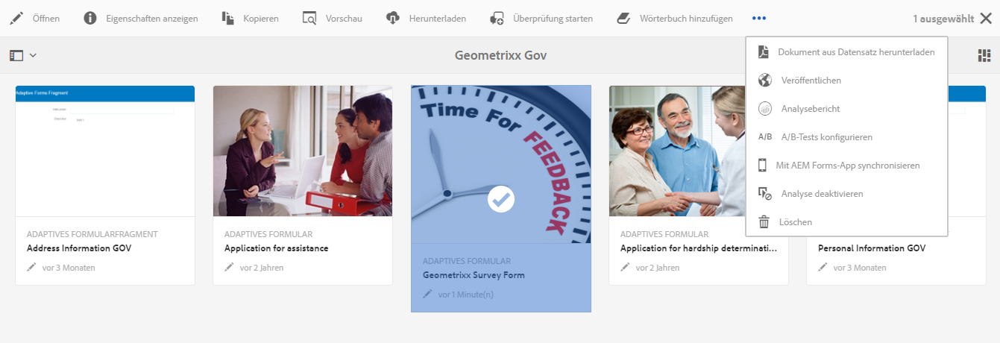
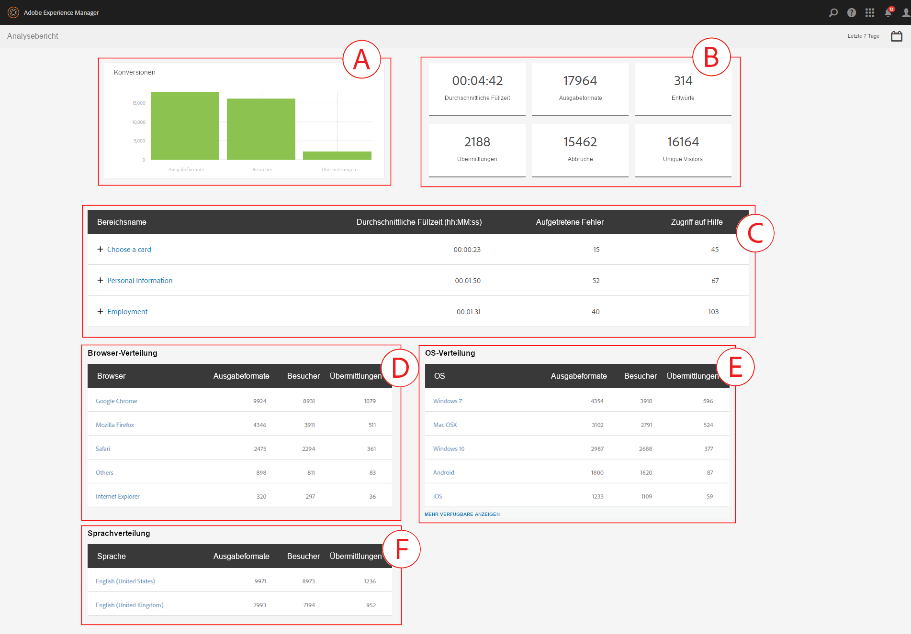
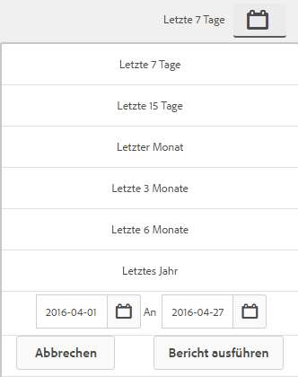
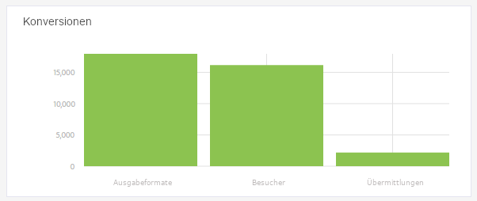
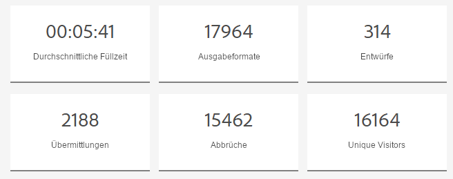
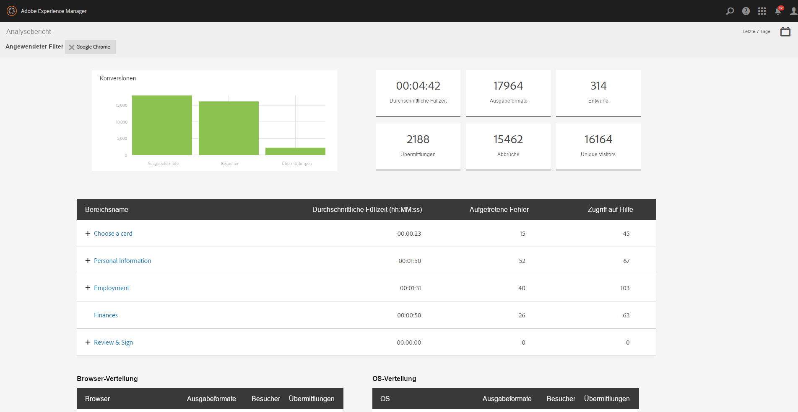
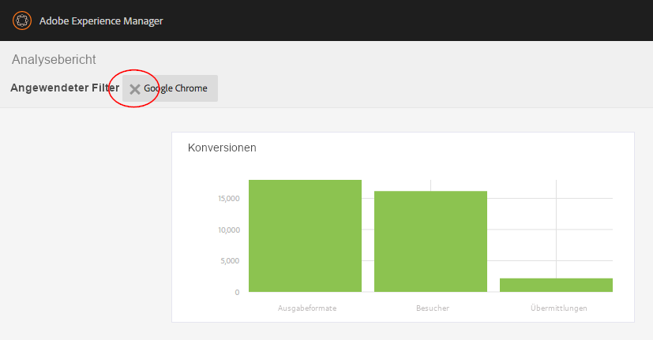

# Anzeigen und Verstehen der Analytics-Berichte in AEM Forms {#view-and-understand-aem-forms-analytics-reports}

Adobe Experience Manager Forms ermöglicht die Integration in Adobe Analytics, sodass Sie Leistungsmetriken für Ihre veröffentlichten Formulare und Dokumente erfassen und verfolgen können. Ziel dieser Analyse ist es, informierte, auf Daten basierende Entscheidungen zu erforderlichen Formularänderungen treffen zu können, durch die Formulare oder Dokumente benutzerfreundlicher werden.

## Einrichten von Analysen  {#setting-up-analytics}

Die Analysefunktion in AEM Forms ist als Teil des AEM Forms-Add-On-Pakets verfügbar. Weitere Informationen zum Installieren des Add-On-Pakets finden Sie unter [Installieren und Konfigurieren von AEM Forms](../../forms/using/installing-configuring-aem-forms-osgi.md).

Zusätzlich zum Add-On-Paket benötigen Sie ein Adobe Analytics-Konto. Informationen zur Lösung finden Sie unter [Adobe Analytics](https://www.adobe.com/solutions/digital-analytics.html).

Nachdem Sie das AEM Forms-Add-On-Paket installiert und ein Adobe Analytics-Konto erstellt haben, integrieren Sie das Adobe Analytics-Konto in AEM Forms und aktivieren Sie in Ihren Formularen oder Dokumenten „Verfolgen“, wie in [Konfigurieren von Analysen und Berichten](../../forms/using/configure-analytics-forms-documents.md) beschrieben.

### Wie Benutzerinteraktionsinformationen aufgezeichnet werden  {#how-user-interaction-information-is-recorded}

Wenn ein Benutzer mit dem Formular interagiert, werden die Interaktionen aufgezeichnet und an den Analytics-Server gesendet. Folgende Liste zeigt Serveraufrufe für verschiedene Benutzeraktivitäten:

* 2 Aufrufe pro Feld pro Besuch
* 1 für Bereichsbesuch
* 1 für speichern
* 2 für senden
* 2 für speichern
* 1 für Hilfe
* 1 für jeden Validierungsfehler
* 1 für die Formularwiedergabe + 1 für Standardbereichsbesuch + 1 für standardmäßigen Besuch für erstes Feld.
* 2 für Formularverzicht

>[!NOTE]
>
>Diese Liste ist nicht vollständig.

### Anzeigen von Analyseberichten {#summary-report}

Führen Sie die folgenden Schritte aus, um Analytics-Berichte anzuzeigen:

1. Melden Sie sich beim AEM Portal unter `https://[hostname]:'port'` an.
1. Klicken Sie auf **Formulare > Formulare und Dokumente**.
1. Wählen Sie das Formular aus, für das Sie die Analytics-Berichte anzeigen möchten.
1. Wählen Sie **Mehr > Analytics-Berichte** aus.

**A.** Analytics-Bericht, Befehl

AEM Forms zeigt Analytics-Berichte für das Formular und für jeden Bereich im Formular an, wie unten dargestellt.

**A.** Konversionen  **B.** Zusammenfassung auf Formularebene  **C.** Zusammenfassung auf Bereichsebene  **D.** Browser der Besucher - Filter  **E.** OS der Besucher - Filter  **F.** Sprache der Besucher - Filter

Standardmäßig wird der Analytics-Bericht für die letzten sieben Tage angezeigt. Sie können Berichte für die letzten 15 Tage, den letzten Monat usw. anzeigen oder einen Datumsbereich angeben.

>[!NOTE]
>
>Die Optionen wie Letzte 7 Tage und Letzte 15 Tage enthalten keine Daten für den Tag, an dem Sie den Analytics-Bericht erstellen. Damit die Daten des aktuellen Tages erfasst werden, müssen Sie den Datumsbereich einschließlich des aktuellen Tages festlegen und dann den Analysebericht ausführen.

### Umrechnungswert für adaptive und HTML5-Formulare {#conversions-graph-for-adaptive-and-html-forms}

Mit dem Umrechnungswert auf Formularebene erhalten Sie einen Einblick in die Leistung des Formulars in Bezug auf folgende wichtige Leistungsindikatoren (KPIs):

* **Ausgaben**: Angabe, wie oft ein Formular geöffnet wurde
* **Besucher**: Die Anzahl der Besucher des Formulars
* **Übermittlungen**: Angabe, wie oft ein Formular übermittelt wird

### Analysebericht für adaptive und HTML5-Formulare {#analytics-report-for-adaptive-and-html-forms}

Mit der Zusammenfassung auf Formularebene erhalten Sie einen Einblick in die Leistung des Formulars in Bezug auf die folgenden wichtigen Leistungsindikatoren (KPIs):

* **Durchschnittliche Füllzeit**: Durchschnittliche Zeit für das Ausfüllen des Formulars. Wenn Benutzer Zeit aufwenden, um das Formular auszufüllen, es aber nicht abschicken, dann wird diese Zeit in dieser Berechnung nicht berücksichtigt.
* **Ausgabeformate**: Gibt an, wie oft das Formular wiedergegeben oder geöffnet wurde
* **Entwürfe**: Gibt an, wie oft das Formular als Entwurf gespeichert wurde 
* **Übermittlungen**: Gibt an, wie oft das Formular gesendet wurde
* **Abbruch**: Gibt an, wie oft Benutzer das Ausfüllen des Formulars begonnen und dann abgebrochen haben
* **Unique Visitors**: Anzahl der Wiedergaben des Formulars durch Unique Visitors. Weitere Informationen über individuelle Besucher finden Sie unter [Individuelle Besicher, Besuche und Kundenverhalten](https://helpx.adobe.com/de/analytics/kb/unique-visitors-visitor-behavior.html). 

### Bereichsbericht {#bottom-summary-report}

Die Zusammenfassung auf Bereichsebene bietet die folgenden Informationen zu jedem Bereich im Formular:

* **Durchschnittliche Füllzeit**: Durchschnittlich aufgewandte Zeit im Bereich, egal ob das Formular übermittelt wurde oder nicht 
* **Aufgetretene Fehler**: Durchschnittliche Anzahl der Fehler, auf die die Benutzer in Feldern eines Bereichs gestoßen sind. Aufgetretene Fehler treten auf, indem die Gesamtzahl der Fehler in einem Feld durch die Anzahl der Ausgabeformate des Formulars dividiert wird.
* **Zugriff auf Hilfe**: Durchschnittliche Anzahl der Aufrufe der kontextbezogenen Hilfe für die Felder im Bereich. Zugriff auf Hilfe wird erreicht, indem die Gesamtanzahl der Hilfeaufrufe für ein Feld durch die Anzahl der Ausgabeformate des Formulars dividiert wird.

#### Detaillierter Bereichsbericht {#detailed-panel-report}

Sie können auch Details für jeden Bereich anzeigen, indem Sie auf den Namen des Bereichs im Bereichsbericht klicken.

Der detaillierte Bericht zeigt Werte für alle Felder im Bereich an.

Der Bereichsbericht enthält drei Registerkarten:

* **Zeitbericht** (Standard): Zeigt die Zeit (in Sekunden) an, die mit dem Ausfüllen der einzelnen Felder im Bereich verbracht wurde
* **Fehlerbericht**: Zeigt die Anzahl der Fehler, die von den Benutzern beim Ausfüllen der Felder gefunden wurden
* **Hilfebericht**: Anzahl der Hilfeaufrufe für ein bestimmtes Feld

Sie können zwischen den Bereichen navigieren, wenn mehrere Bereiche verfügbar sind.

### Filter: Browser, Betriebssystem und Sprache {#filters-browser-os-and-language}

Die Browser-Verteilung, OS-Verteilung und Sprachverteilungstabellen zeigen die Darstellungen, die Besucher und die Einsendungen gemäß Browser, Betriebssystem und Sprache der Benutzer an. Diese Tabelle zeigen standardmäßig maximal fünf Einträge an. Sie können auf „Mehr anzeigen“ klicken, um weitere Einträge anzuzeigen, und mit „Weniger anzeigen“ kehren Sie zurück zu fünf oder weniger Einträgen.

Um die Analysedaten weiter zu filtern, können Sie auf einen Eintrag in einer der Tabellen klicken. Wenn Sie beispielsweise Google Chrome in der Browser-Verteilungstabelle anklicken, wird der Bericht erneut mit den Daten, die den Google Chrome-Browser betreffen, wie folgt zusammengestellt:

Wenn Sie den Bereichsbericht anzeigen, nachdem Sie einen Filter angewendet haben, werden die Bereichsberichtdaten auch in Übereinstimmung mit dem angewendeten Filter angezeigt.

 Sobald ein Filter angewendet wird:

* Die Verteilungstabellen sind schreibgeschützt, da nur ein Filter auf einmal angewendet werden kann.
* Die Tabelle, die gefiltert wurde, wird nicht mehr angezeigt.
* Sie können auf die Schließen-Schaltfläche klicken (wie unten gezeigt), um den angewendeten Filter zu entfernen.

### A/B-Tests {#a-b-testing}

Wenn Sie A/B-Tests aktiviert und für das Formular eingerichtet haben, enthält die Berichtseite eine Dropdown-Liste, die Sie verwenden können, um den A/B-Testbericht anzuzeigen. Der A/B-Testbericht zeigt die vergleichende Leistung zweier Formularversionen an, die Sie eingerichtet haben.

Weitere Informationen zu A/B-Tests finden Sie unter [ Erstellen und Verwalten von A/B-Test für adaptive Formulare](../../forms/using/ab-testing-adaptive-forms.md).
