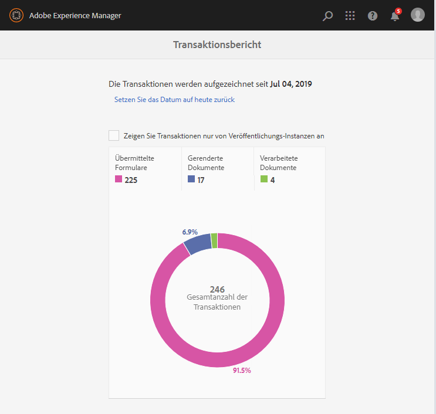

# Anzeigen und Verstehen von Transaktionsberichten{#viewing-and-understanding-transaction-reports}

Mit Transaktionsberichten können Sie die Anzahl der gesendeten Formulare, verarbeiteten Dokumente und gerenderten Dokumente erfassen und verfolgen. Das Ziel der Verfolgung dieser Transaktionen besteht darin, eine fundierte Entscheidung über die Produktnutzung zu treffen und Investitionen in Hardware und Software neu auszurichten. Weitere Informationen finden Sie unter [Übersicht über AEM Forms-Transaktionsberichte](../../forms/using/transaction-reports-overview.md).

## Transaktionsberichte einrichten  {#setting-up-transaction-reports}

Die Funktion &quot;Transaktionsberichte&quot;ist als Teil des Add-On-Pakets für AEM Formulare verfügbar. Informationen zum Installieren des Add-On-Pakets auf allen Autoren- und Veröffentlichungsinstanzen finden Sie unter [Installieren und Konfigurieren von AEM Forms](/help/forms/using/installing-configuring-aem-forms-osgi.md). Nachdem Sie das AEM Forms Add-On-Paket installiert haben, führen Sie die folgenden Schritte aus:

* Aktivieren Sie die Rückwärtsreplikation auf allen Veröffentlichungsinstanzen.
* Transaktionsberichte aktivieren
* Berechtigungen zum Anzeigen eines Transaktionsberichts bereitstellen
* (Optional) Konfigurieren des Flush-Zeitraums und der Postausgänge 

>[!NOTE]
>
>* AEM Forms-Transaktionsberichte unterstützen keine Topologien, die nur Veröffentlichungsinstanzen enthalten.
>* Bevor Sie Transaktionsberichte verwenden, stellen Sie sicher, dass die Rückwärtsreplikation für alle Veröffentlichungsinstanzen aktiviert ist.
>* Transaktionsdaten werden von einer Veröffentlichungsinstanz umgekehrt in nur die entsprechende Autoren- oder Verarbeitungsinstanz repliziert. Die Autoren- oder Verarbeitungsinstanz kann keine Daten in einer anderen Instanz weiter replizieren.

>

### Aktivieren Sie die Rückwärtsreplikation auf allen Veröffentlichungsinstanzen. {#enable-reverse-replication-on-all-the-publish-instances}

Transaktionsberichte verwenden die Rückwärtsreplikation, um die Anzahl der Transaktionen von Veröffentlichungsinstanzen zu Autoreninstanzen zu konsolidieren. Richten Sie die Rückwärtsreplikation auf allen Veröffentlichungsinstanzen ein. Detaillierte Anweisungen zum Einrichten der Rückwärtsreplikation finden Sie unter [Replikation](/help/sites-deploying/replication.md).

### Transaktionsberichte aktivieren {#enable-transaction-reports}

Transaktionsberichte sind standardmäßig deaktiviert. Sie können die Berichte über AEM Web-Konsole aktivieren. Um Transaktionsberichte in einer AEM Forms-Umgebung zu aktivieren, führen Sie die folgenden Schritte für alle Autoren- und Veröffentlichungsinstanzen aus:

1. Melden Sie sich bei einer AEM als Administrator an. Gehen Sie zu **Tools** > **Vorgänge** > **Web-Konsole**.
1. Suchen und öffnen Sie den Dienst **Forms Transaction Reporting**.
1. Aktivieren Sie das Kontrollkästchen Transaktionen aufzeichnen . Klicken Sie auf **Speichern**.

   Wiederholen Sie die Schritte 1-3 für alle Autoren- und Veröffentlichungsinstanzen.

### Berechtigungen zum Anzeigen eines Transaktionsberichts bereitstellen {#provide-rights-to-view-a-transaction-report}

Nur Mitglieder der Gruppe fd-administrator können Transaktionsberichte anzeigen. Damit Benutzer Transaktionsberichte anzeigen können, müssen sie Benutzer der Gruppe &quot;fd-administrator&quot;angehören. Anweisungen dazu, wie Sie einen Benutzer zu einer AEM Gruppe machen, finden Sie unter [Verwaltung von Benutzern, Gruppen und Zugriffsrechten](/help/sites-administering/user-group-ac-admin.md).

### (Optional) Konfigurieren des Flush-Zeitraums und der Postausgänge für Transaktionen {#optional-configure-transaction-flush-period-and-outboxes}

Transaktionen werden im Speicher zwischengespeichert, bevor sie im Repository gespeichert werden. Der Prozess wird ausgeführt, um sicherzustellen, dass es keine häufigen Schreibvorgänge in das Repository gibt. Standardmäßig ist der Caching-Zeitraum (Transaktions-Flush-Zeitraum) auf 60 Sekunden festgelegt. Sie können den Standardzeitraum an Ihre Umgebung anpassen. Führen Sie die folgenden Schritte aus, um den standardmäßigen Zwischenspeicherungszeitraum zu ändern:

1. Melden Sie sich bei Autoreninstanzen als Administrator an. Gehen Sie zu **Tools** > **Vorgänge** > **Web-Konsole**.
1. Suchen und öffnen Sie den Dienst **Forms Transaction Repository Storage Provider** .
1. Geben Sie die Anzahl der Sekunden im Feld **Transaktions-Push-Zeitraum** an. Klicken Sie auf **Speichern**.

Rückwärtsreplikation kopiert Transaktionsdaten in den standardmäßigen Postausgang der Autoreninstanzen. Sie können Transaktionsdaten in einem benutzerdefinierten Postausgang platzieren. Führen Sie die folgenden Schritte aus, um einen benutzerdefinierten Postausgang anzugeben:

1. Melden Sie sich bei Autoreninstanzen als Administrator an. Gehen Sie zu **Tools** > **Vorgänge** > **Web-Konsole**.
1. Suchen und öffnen Sie den Dienst **Forms Transaction Repository Storage Provider** .
1. Geben Sie den Namen des benutzerdefinierten Postausgangs im Feld **Postausgänge** an. Klicken Sie auf **Speichern**. Ein Postausgang mit dem angegebenen Namen wird für alle Autoreninstanzen erstellt.

## Anzeigen des Transaktionsberichts {#viewing-the-transaction-report}

Sie können Transaktionsberichte zu Autoren- oder Veröffentlichungsinstanzen anzeigen. Der Transaktionsbericht auf der Autoreninstanz stellt eine aggregierte Summe aller Transaktionen bereit, die auf den konfigurierten Autoren- und Veröffentlichungsinstanzen stattfinden. Der Transaktionsbericht auf der Veröffentlichungsinstanz liefert eine Zählung der Transaktionen, die nur auf der zugrunde liegenden Veröffentlichungsinstanz stattfinden. Führen Sie die folgenden Schritte aus, um den Bericht anzuzeigen:

1. Melden Sie sich beim AEM Forms-Server unter `https://[hostname]:'port'` an.
1. Navigieren Sie zu **Tools** > **Forms****Anzeigen des Transaktionsberichts**.

## Erläuterungen zum Bericht {#understanding-the-report}

AEM Forms zeigt Transaktionsberichte seit dem konfigurierten Datum an, wie in einem Zusammenfassungsbericht unten dargestellt:

* Verwenden Sie die Optionen **Datum auf heute zurücksetzen** , um Transaktionsdatensätze zurückzusetzen. Wenn Sie das Datum auf heute zurücksetzen, gehen alle vorherigen Transaktionsdatensätze verloren. Wenn Sie das Datum auf eine Autoreninstanz zurücksetzen, wirkt sich die Änderung nicht auf Transaktionsberichte auf die Veröffentlichungsinstanzen aus und umgekehrt.
* Verwenden Sie **Transaktionen nur von Veröffentlichungsinstanzen anzeigen**, um alle Transaktionen anzuzeigen, die nur auf der konfigurierten Veröffentlichungsinstanz oder Veröffentlichungsfarm aufgetreten sind.
* Verwenden Sie die Kategorien: **Dokument verarbeitet**, **gerenderte Dokumente** und **Forms Gesendet**, um die entsprechenden Transaktionen anzuzeigen. Informationen zum Typ der Transaktionen, die in diesen Kategorien bilanziert werden, finden Sie unter [Abrechenbare Transaktionsberichte-APIs](../../forms/using/transaction-reports-billable-apis.md).

## Transaktions-Reporting-Protokolle anzeigen {#view-transaction-reporting-logs}

In der Transaktionsberichterstellung werden alle im Bericht angezeigten Informationen sowie einige zusätzliche Informationen in die Protokolle eingefügt. Die in den Protokollen bereitgestellten Informationen sind für fortgeschrittene Benutzer hilfreich. Beispiel: protokolliert Transaktionen in mehrere detaillierte Kategorien, verglichen mit drei konsolidierten Kategorien, die im Bericht angezeigt werden. Die Protokolle sind in der Datei `error.log` im Verzeichnis `/crx-repository/logs/` verfügbar. Die Protokolle sind auch dann verfügbar, wenn Sie die Transaktionsberichte nicht über AEM Web-Konsole aktivieren.

## Ähnliche Artikel {#related-articles}

* [Übersicht über Transaktionsberichte](../../forms/using/transaction-reports-overview.md)
* [Abrechenbare APIs für Transaktionsberichte](../../forms/using/transaction-reports-billable-apis.md)
* [Eine Transaktion für benutzerdefinierte Implementierungen aufzeichnen](/help/forms/using/record-transaction-custom-implementation.md)
