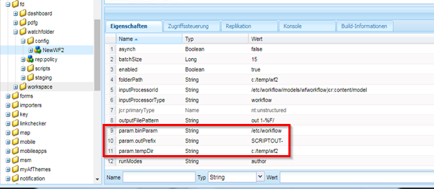
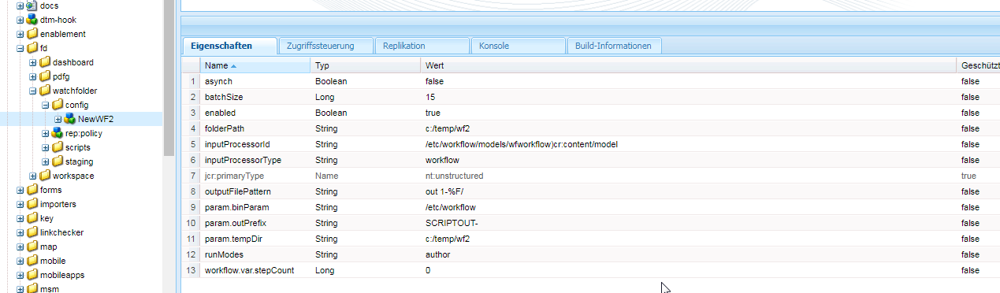
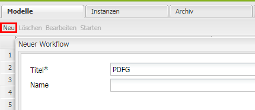
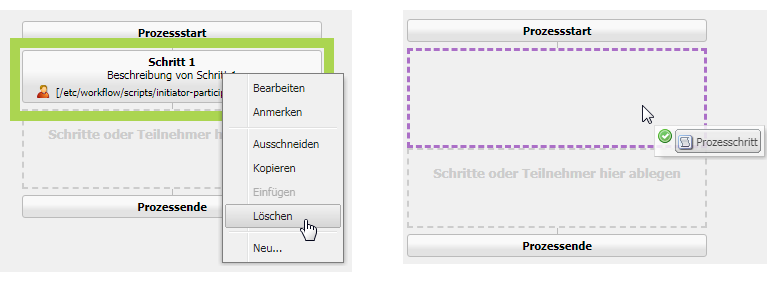
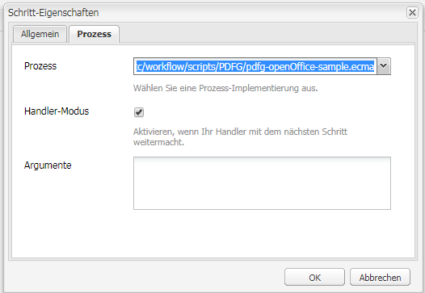
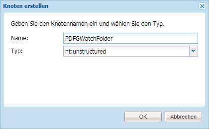

# Überwachter Ordner in AEM Forms{#watched-folder-in-aem-forms}

Ein Administrator kann einen Netzwerkordner konfigurieren, der als überwachter Ordner bezeichnet wird, sodass ein vorkonfigurierter Workflow-, Dienst- oder Skriptvorgang zur Verarbeitung der Datei aufgerufen wird, wenn ein Benutzer eine Datei (z. B. eine PDF-Datei) in diesem überwachten Ordner ablegt. Nachdem der Dienst den vorgesehenen Vorgang ausgeführt hat, wird die Ergebnisdatei in einem angegebenen Ausgabeordner gespeichert. Weitere Informationen zu Workflows, Diensten und Skripts finden Sie unter [Verschiedene Methoden zur Verarbeitung von Dateien](#variousmethodsforprocessingfiles).

## Überwachten Ordner erstellen {#create-a-watched-folder}

Sie können überwachte Ordner im Dateisystem mit einer der folgenden Methoden erstellen:

* Geben Sie beim Konfigurieren der Eigenschaften eines Konfigurationsknotens für den überwachten Ordner den vollständigen Pfad des übergeordneten Ordners in die Eigenschaft &quot;folderPath&quot;ein und hängen Sie den Namen des zu erstellenden überwachten Ordners an, wie im folgenden Beispiel gezeigt: `C:/MyPDFs/MyWatchedFolder`
Die 
`MyWatchedFolder`nicht vorhanden ist, versucht AEM Forms, den Ordner unter dem angegebenen Pfad zu erstellen.

* Erstellen Sie vor dem Konfigurieren eines Endpunkts des Typs „Überwachter Ordner“ einen Ordner im Dateisystem und geben Sie anschließend den vollständigen Pfad in die Eigenschaft „folderPath“ ein. Detaillierte Informationen zur Eigenschaft „folderPath“ finden Sie unter [Eigenschaften für überwachte Ordner](#watchedfolderproperties).

>[!NOTE]
>
>In einer Clusterumgebung muss der Ordner, der als überwachter Ordner verwendet wird, zugriffsbereit sein, Schreibzugriff bieten und im Dateisystem oder Netzwerk freigegeben sein. Jede Anwendungsserverinstanz des Clusters muss Zugriff auf denselben freigegebenen Ordner haben. Unter Windows erstellen Sie auf allen Servern ein verbundenes Netzlaufwerk und tragen Sie dessen Pfad in die Eigenschaft „folderPath“ ein.

## Konfigurationsknoten für überwachten Ordner erstellen {#create-watched-folder-configuration-node}

Um einen überwachten Ordner zu konfigurieren, erstellen Sie einen Konfigurationsknoten des Typs „Überwachter Ordner“. Führen Sie die folgenden Schritte aus, um den Konfigurationsknoten zu erstellen:

1. Melden Sie sich als Administrator bei CRX-DE an und navigieren Sie zum Ordner „/etc/fd/watchfolder/config“. 

1. Erstellen Sie einen Knoten des Typs `nt:unstructured`. Beispiel: watchedfolder

   >[!NOTE]
   >
   >Der Knotenname des überwachten Ordners darf keine Leer- und Sonderzeichen enthalten.

1. Fügen Sie dem Knoten  folgende Eigenschaften hinzu:

   * `folderPath`
   * `inputProcessorType`
   * `inputProcessorId`
   * `outputFilePattern`

   Eine vollständige Liste der unterstützten Eigenschaften finden Sie unter [Eigenschaften für überwachte Ordner](#watchedfolderproperties).

1. Klicken Sie auf **Alle speichern**. Der Knoten wird erstellt und die Eigenschaften werden gespeichert. Die `input`, `result`, `failure`, `preserve`und `stage`Ordner werden unter dem im `folderPath` -Eigenschaft.

   Der Überprüfungsauftrag beginnt mit der regelmäßigen Überprüfung des überwachten Ordners im definierten Zeitintervall.

## Eigenschaften für überwachte Ordner {#watchedfolderproperties}

Sie können die folgenden Eigenschaften für überwachte Ordner konfigurieren.

* **folderPath (Zeichenfolge)**: Der Pfad des Ordners, der regelmäßig mit dem angegebenen Zeitintervall überprüft werden soll. In einer Clusterumgebung muss sich der Ordner an einem freigegebenen Speicherort befinden und alle Server müssen uneingeschränkten Zugriff auf diesen Server haben. Dies ist eine obligatorische Eigenschaft.
* **inputProcessorType (Zeichenfolge)**: Der Typ des zu startenden Prozesses. Zur Auswahl stehen Workflow, Skript oder Dienst. Dies ist eine obligatorische Eigenschaft.
* **inputProcessorId (Zeichenfolge)**: Das Verhalten der Eigenschaft „inputProcessorId“ wird durch den für die Eigenschaft „inputProcessorType“ angegebenen Wert gesteuert. Dies ist eine obligatorische Eigenschaft. Die folgende Liste zeigt die möglichen Werte der Eigenschaft „inputProcessorType“ und die dazugehörigen erforderlichen Werte für die Eigenschaft „inputProcessorType“:

   * Für einen Workflow geben Sie das Workflow-Modell an, das ausgeführt werden soll. Beispiel: /etc/workflow/models/&lt;Workflow-Name>/jcr:content/model
   * Für ein Skript geben Sie den JCR-Pfad des auszuführenden Skripts an. Beispiel: /etc/fd/watchfolder/test/testScript.ecma
   * Für einen Dienst geben Sie den Filter an, der zum Suchen nach einem OSGi-Dienst verwendet werden soll. Der Dienst ist als Implementierung der com.adobe.aemfd.watchfolder.service.api.ContentProcessor-Schnittstelle registriert.

* **runModes (Zeichenfolge)**: Eine kommagetrennte Liste der zulässigen Ausführungsmodi für die Ausführung des Workflows. Beispiele:

   * author

   * veröffentlichen

   * author, Veröffentlichungsinstanz

   * publish, author

>[!NOTE]
>
>Ist auf dem Server, der den überwachten Ordner hostet, keiner der angegebenen Ausführungsmodi verfügbar, wird der überwachte Ordner immer aktiviert, egal, welche Ausführmodi auf dem Server laufen.

* **outputFilePattern (Zeichenfolge)**: Das Muster der Ausgabedatei. Sie können ein Ordner- oder Dateimuster angeben. Wenn Sie ein Ordnermuster angeben, erhalten die Ausgabedateien Namen gemäß den Angaben in den Workflows. Wenn Sie ein Dateimuster angeben, erhalten die Ausgabedateien Namen gemäß den Angaben im Dateimuster. [In Datei- und Ordnermustern können Sie außerdem eine Ordnerstruktur für die Ausgabedateien angeben.](../../forms/using/watched-folder-in-aem-forms.md#p-file-and-folder-patterns-p) Dies ist eine obligatorische Eigenschaft.

* **stageFileExpirationDuration (Long, Standard -1)**: Die Anzahl Sekunden, die gewartet wird, bis für eine Eingabedatei/einen Ordner, der bereits zur Verarbeitung abgerufen wurde, eine Zeitüberschreitung eintritt und ein Fehler gemeldet wird. Diese Zeitüberschreitungsfunktion wird nur aktiviert, wenn der Wert für diese Eigenschaft eine positive Zahl ist.

>[!NOTE]
>
>Selbst wenn eine Eingabe mit diesem Mechanismus als zeitüberschreitend gekennzeichnet ist, kann sie im Hintergrund noch verarbeitet werden, aber nur länger als erwartet dauern. Wenn der eingegebene Inhalt genutzt wurde, bevor die Zeitüberschreitungsfunktion einsetzte, erfolgt möglicherweise sogar später die Verarbeitung bis zur Fertigstellung und die Ausgabe wird im Ergebnisordner abgelegt. Wenn der Inhalt nicht vor der Zeitüberschreitung genutzt wurde, ist es sehr wahrscheinlich, dass die Verarbeitung später beim Versuch, den Inhalt zu nutzen, mit einem Fehler abbricht und der Fehler auch im Fehlerordner für diese Eingabe protokolliert wird. Wenn andererseits die Verarbeitung der Eingabe aufgrund einer zeitweisen Fehlfunktion des Auftrags/Arbeitsablaufs nie aktiviert wurde (dieses Szenario ist das eigentliche Ziel der Zeitüberschreitungsfunktion), tritt keiner dieser beiden Fälle ein. Daher sollten Sie bei Einträgen im Fehlerordner, die als Fehler wegen einer Zeitüberschreitung gemeldet wurden (suchen Sie im Fehlerprotokoll nach Meldungen der Art „Datei nach erheblicher Zeit nicht verarbeitet, wird als Fehler markiert!“), den Ergebnisordner (und auch den Fehlerordner selbst auf einen anderen Eintrag für dieselbe Eingabe) prüfen, ob die zuvor beschriebenen Fälle tatsächlich eingetreten sind.

* **deleteExpiredStageFileOnlyWhenThrottled (Boolean, Standard true):** Ob die Zeitüberschreitungsfunktion nur aktiviert werden soll, wenn der überwachte Ordner gedrosselt wird. Die Funktion ist für gedrosselte überwachte Ordner relevanter, da eine geringe Anzahl von noch unformatiert gebliebenen Dateien (aufgrund der zeitweisen Fehlfunktion des Auftrags/Arbeitsablaufs) das Potenzial hat, die Verarbeitung des gesamten Stapels zu unterbinden, wenn die Drosselung aktiviert ist. Wenn diese Eigenschaft als „true“ beibehalten wird (Standardeinstellung), tritt für überwachte Ordner, die nicht gedrosselt werden, keine Zeitüberschreitung ein. Wenn die Eigenschaft als „false“ beibehalten wird, tritt die Zeitüberschreitung immer ein, wenn die stageFileExpirationDuration-Eigenschaft eine positive Zahl ist.

* **pollInterval (Lang)**: Das Intervall in Sekunden, in dem der überwachte Ordner auf Eingaben überprüft wird. Außer wenn die Einstellung „Einschränken“ aktiviert ist, muss das Abfrageintervall länger sein als die Verarbeitungsdauer für einen durchschnittlichen Auftrag. Andernfalls kann es zu einer Überlastung des Systems kommen. Der Standardwert ist „5“. Weitere Informationen finden Sie in der Beschreibung für die Stapelgröße. Der Wert für „pollInterval“ muss größer als oder gleich eins sein.
* **excludeFilePattern (Zeichenfolge)**: Eine durch Semikolon (;) getrennte Liste von Mustern, mit deren Hilfe in einem überwachten Ordner ermittelt wird, welche Dateien und Ordner überprüft und aufgenommen werden sollen. Alle Dateien oder Ordner, die diesem Muster entsprechen, werden nicht für die Verarbeitung überprüft. Diese Einstellung ist hilfreich, wenn die Eingabe aus einem Ordner mit mehreren Dateien besteht. Der Inhalt des Ordners kann in einen Ordner mit einem Namen kopiert werden, der vom überwachten Ordner aufgenommen wird. Dies verhindert, dass der überwachte Ordner einen Ordner für die Verarbeitung aufnimmt, bevor dieser vollständig in den Eingabeordner kopiert ist. Der Standardwert ist Null.
Sie können Dateimuster verwenden, um Folgendes auszuschließen:[](../../forms/using/watched-folder-in-aem-forms.md#p-file-and-folder-patterns-p)

   * Dateien mit bestimmten Dateinamenerweiterungen; Beispiel: &#42;.dat, &#42;.xml, .pdf, &#42;.&#42;
   * Dateien mit bestimmten Namen; z. B. Daten&#42; würde Dateien und Ordner mit den Namen data1, data2 usw. ausschließen.
   * Dateien mit zusammengesetzten Ausdrücken in Name und Erweiterung, wie in den folgenden Beispielen:

      * Data[0-9][0-9][0-9].[dD][aA]&#39;port&#39;
      * &#42;.[dD][Aa]&#39;port&#39;
      * &#42;.[Xx][MM][Ll]

Informationen zu Dateimustern finden Sie unter [Grundlegendes zu Dateimustern](../../forms/using/watched-folder-in-aem-forms.md#p-file-and-folder-patterns-p).

* **includeFilePattern (Zeichenfolge)**: Eine durch Semikolon (;) getrennte Liste von Mustern, mit deren Hilfe in einem überwachten Ordner ermittelt wird, welche Dateien und Ordner überprüft und aufgenommen werden sollen. Wenn beispielsweise das IncludeFilePattern die Eingabe ist&#42;, alle Dateien und Ordner, die der Eingabe entsprechen&#42; abgeholt werden. Hierzu gehören auch Dateien und Ordner namens „input1“, „input2“ usw. Der Standardwert ist &#42; und zeigt alle Dateien und Ordner an. Sie können Dateimuster verwenden, um Folgendes einzuschließen:

   * Dateien mit bestimmten Dateinamenerweiterungen; Beispiel: &#42;.dat, &#42;.xml, .pdf, &#42;.&#42;
   * Dateien mit bestimmten Namen, z. B. data.&#42; Hierzu gehören auch Dateien und Ordner namens data1, data2 usw.

* Dateien mit zusammengesetzten Ausdrücken in Name und Erweiterung, wie in den folgenden Beispielen:

   * Data[0-9][0-9][0-9].[dD][aA]&#39;port&#39;

      * &#42;.[dD][Aa]&#39;port&#39;
      * &#42;.[Xx][MM][Ll]

Informationen zu Dateimustern finden Sie unter [Grundlegendes zu Dateimustern](../../forms/using/watched-folder-in-aem-forms.md#p-file-and-folder-patterns-p)

* **waitTime (Lang)**: Die Zeit in Millisekunden, die gewartet wird, bevor ein Ordner oder eine Datei nach der Erstellung überprüft wird. Wenn die Wartezeit beispielsweise 3.600.000 Millisekunden (eine Stunde) beträgt und die Datei vor einer Minute erstellt wurde, wird diese Datei nach Ablauf von mindestens 59 Minuten abgerufen. Der Standardwert ist 0. Diese Einstellung ist nützlich, um sicherzustellen, dass eine Datei oder ein Ordner vollständig in den Eingabeordner kopiert wurde. Wenn Sie beispielsweise eine große Datei verarbeiten müssen und das Herunterladen der Datei zehn Minuten dauert, setzen Sie die Wartezeit auf 10&#42;60 &#42;1000 Millisekunden. Dies verhindert, dass der überwachte Ordner die Datei bereits vor Ablauf der zehn Minuten überprüft.
* **purgeDuration (Lang)**: Dateien und Ordner im Ergebnisordner werden bereinigt, wenn sie älter als dieser Wert sind. Dieser Wert wird in Tagen gemessen. Diese Einstellung hilft dafür zu sorgen, dass der Ergebnisordner nicht voll wird. Ein Wert von „-1“ Tage bedeutet, dass der Ergebnisordner nie gelöscht wird. Der Standardwert ist -1.
* **resultFolderName (Zeichenfolge)**: Der Ordner, in dem die Ergebnisse gespeichert werden. Wenn die Ergebnisse nicht in diesem Ordner angezeigt werden, überprüfen Sie den Fehlerordner. Schreibgeschützte Dateien werden nicht verarbeitet und im Fehlerordner gespeichert. Dieser Wert kann ein absoluter oder relativer Pfad mit folgendem Dateimuster sein:

   * %F = Dateinamenpräfix
   * %E = Dateinamenerweiterung
   * %Y = Jahr (vollständig)
   * %y = Jahr (letzte zwei Stellen)
   * %M = Monat
   * %D = Tag des Monats
   * %d = Tag des Jahres
   * %H = Stunde (24-Stunden-Format)
   * %h = Stunde (12-Stunden-Format)
   * %m = Minute
   * %s = Sekunde
   * %l = Millisekunde
   * %R = Zufallszahl (zwischen 0 und 9)
   * %P = Prozess- oder Auftrags-ID

   Wenn es beispielsweise der 17. Juli 2009, 20 Uhr, ist und Sie C:/Test/WF0/failure/%Y/%M/%D/%H/ angeben, ist der Ergebnisordner C:/Test/WF0/failure/2009/07/17/20

   Wenn der Pfad nicht absolut, sondern relativ ist, wird der Ordner im überwachten Ordner erstellt. Der Standardwert ist „result/%Y/%M/%D/“, d. h. der Ergebnisordner im überwachten Ordner. Informationen zu Dateimustern finden Sie unter [Grundlegendes zu Dateimustern](../../forms/using/watched-folder-in-aem-forms.md#p-file-and-folder-patterns-p).

>[!NOTE]
>
>Je kleiner die Größe der Ergebnisordner ist, desto besser ist die Leistung des überwachten Ordners. Wenn beispielsweise die geschätzte Auslastung für den überwachten Ordner bei 1000 Dateien pro Stunde liegt, sollten Sie ein Muster wie „result/%Y%M%D%H“ verwenden, sodass jede Stunde ein neuer Unterordner erstellt wird. Wenn die Auslastung geringer ist (z. B. 1000 Dateien pro Tag), können Sie ein Muster wie das Folgende verwenden: result/%Y%M%D.

* **failureFolderName (Zeichenfolge)**: Der Ordner, in dem Dateien mit Fehlern gespeichert werden. Dieser Speicherort ist stets relativ zum überwachten Ordner. Sie können Dateimuster verwenden, wie für „Ergebnisordner“ beschrieben. Schreibgeschützte Dateien werden nicht verarbeitet und im Fehlerordner gespeichert. Der Standardwert ist „failure/%Y/%M/%D/“.
* **preserveFolderName (Zeichenfolge):** Der Speicherort, an dem Dateien nach erfolgreicher Verarbeitung gespeichert werden. Dies kann ein absoluter, relativer oder leerer Ordnerpfad sein. Sie können Dateimuster verwenden, wie für „Ergebnisordner“ beschrieben. Der Standardwert ist „preserve/%Y/%M/%D/“.
* **batchSize (Lang)**: Die Anzahl der Dateien oder Ordner, die pro Überprüfung aufgenommen werden. Mit dieser Einstellung können Sie eine Überlastung des Systems verhindern, da das gleichzeitige Überprüfen zu vieler Dateien zu einem Absturz führen kann. Der Standardwert ist 2.

     Die Einstellungen für Abrufintervall und Stapelgröße bestimmen, wie viele Dateien bei jeder Überprüfung vom Watched Folder-Dienst ausgewählt werden. Der Watched Folder-Dienst verwendet einen Quartz-Threadpool, um den Eingabeordner zu überprüfen. Der Threadpool wird mit anderen Diensten gemeinsam verwendet. Wenn das Überprüfungsintervall kurz ist, wird der Eingabeordner häufig von den Threads überprüft. Falls häufig Dateien im überwachten Ordner abgelegt werden, sollten Sie ein kurzes Überprüfungsintervall wählen. Wenn Dateien nicht häufig abgelegt werden, verwenden Sie ein größeres Überprüfungsintervall, damit die anderen Dienste die Threads verwenden können.

   Falls eine große Anzahl von Dateien abgelegt wird, wählen Sie eine große Stapelgröße. Wenn beispielsweise der vom Endpunkt des Typs „Überwachter Ordner“ gestartete Dienst 700 Dateien pro Minute verarbeiten kann und die Benutzer Dateien mit derselben Rate im Eingabeordner ablegen, verbessert das Festlegen der Stapelgröße auf 350 und des Abrufintervalls auf 30 Sekunden die Leistung des Überwachter Ordner-Dienstes, ohne dass der überwachte Ordner allzu häufig überprüft werden muss.

    Wenn Dateien im überwachten Ordner abgelegt werden, werden die Dateien in der Eingabe aufgelistet. Dadurch kann die Leistung reduziert werden, wenn jede Sekunde eine Überprüfung stattfindet. Durch Erhöhen des Überprüfungsintervalls kann die Leistung verbessert werden. Wenn das Volumen der abgelegten Dateien gering ist, passen Sie die Stapelgröße und das Abrufintervall entsprechend an. Wenn beispielsweise pro Sekunde 10 Dateien abgelegt werden, probieren Sie ein pollInterval von 1 Sekunde und eine Stapelgröße von 10 aus.

* **throttleOn (Boolescher Wert)**: Wenn diese Option ausgewählt ist, wird die Anzahl der Aufträge für den überwachten Ordner begrenzt, die AEM Forms zu jeder Zeit verarbeiten kann. Die maximale Anzahl von Aufträgen wird durch den Wert von „Stapelgröße“ bestimmt. Der Standardwert ist „true“. (Siehe [Informationen zu Einschränkungen](../../forms/using/watched-folder-in-aem-forms.md#p-about-throttling-p).)

* **overwriteDuplicateFilename (Boolescher Wert)**: Bei Festlegung auf „True“ werden Dateien im Ergebnisordner und im Aufbewahrungsordner überschrieben. Bei Festlegung auf „False“ wird an die Namen von Dateien und Ordnern ein numerisches Indexsuffix angehängt. Der Standardwert ist „False“.
* **preserveOnFailure (Boolescher Wert)**: Bewahrt die Eingabedateien auf, wenn es zu einem Fehler bei der Ausführung des Vorgangs für einen Dienst kommt. Der Standardwert lautet true.
* **inputFilePattern (Zeichenfolge)**: Geben Sie das Muster der Eingabedateien für einen überwachten Ordner an. Erstellt eine Zulassungsliste der Dateien.
* **asynch (Boolescher Wert)**: Bestimmt, ob ein asynchroner oder ein synchroner Aufruftyp verwendet wird. Der Standardwert ist „true“ (asynchron). Da die Verarbeitung von Dateien sehr ressourcenintensiv ist, sollten Sie den Wert „true“ für das Flag „asynch“ beibehalten, um eine Überlastung des Haupt-Threads des Überprüfungsauftrags zu vermeiden. In einer Clusterumgebung muss der Wert „true“ für das Flag unter allen Umständen beibehalten werden, um den Lastenausgleich für die Dateiverarbeitung zwischen den verfügbaren Servern zu ermöglichen. Wird für das Flag der Wert „false“ festgelegt, versucht der Überprüfungsauftrag, die einzelnen Dateien bzw. Ordner der höchsten Ebene nacheinander innerhalb seines eigenen Threads zu verarbeiten. Legen Sie daher nur in Sonderfällen den Wert „false“ für das Flag fest, z. B. für die Workflow-basierte Verarbeitung in einer Einrichtung mit einem einzelnen Server.

>[!NOTE]
>
>Die Workflows sind standardmäßig asynchron. Sie werden selbst dann im asynchronen Modus gestartet, wenn Sie das Flag auf „false“ setzen.

* **enabled (Boolescher Wert)**: Deaktiviert und aktiviert die Überprüfung des überwachten Ordners. Legen Sie für „enabled“ den Wert „true“ fest, um die Überprüfung des überwachten Ordners zu starten. Der Standardwert lautet true.
* **payloadMapperFilter:** Wenn ein Ordner als überwachter Ordner konfiguriert ist, wird im überwachten Ordner eine Ordnerstruktur erstellt. Die Struktur verfügt über Ordner, um Eingaben bereitzustellen, Ausgaben (Ergebnisse) zu empfangen, Daten für Fehler zu speichern, Daten für langlebige Prozesse zu bewahren und Daten für verschiedene Phasen zu speichern. Die Ordnerstruktur eines überwachten Ordners kann als eine Nutzlast für formularzentrierte Workflows dienen. Mit einem Payload-Mapper können Sie die Struktur einer Nutzlast definieren, die einen überwachten Ordner für Eingabe, Ausgabe und Verarbeitung verwendet. Wenn Sie beispielsweise den Standard-Mapper verwenden, ordnet er den Inhalt des überwachten Ordners mit [Nutzlast]\input und [Nutzlast]\Ordner &quot;Output&quot;. Zwei Standard-Mapper-Implementierungen sind verfügbar. Wenn Sie keine[ benutzerdefinierte Implementierung](../../forms/using/watched-folder-in-aem-forms.md#creating-a-custom-payload-mapper-filter) haben, verwenden Sie eine Standard-Implementierung:

   * **Standard-Mapper:** Verwenden Sie den Standard-Payload-Mapper, um den Eingabe- und Ausgabe-Inhalt der überwachten Ordner in separaten Eingabe- und Ausgabeordnern in der Payload zu belassen. Verwenden Sie außerdem im Payload-Pfad eines Workflows [Nutzlast]/input/ und [Nutzlast]/output-Pfade zum Abrufen und Speichern von Inhalten.

   * **Einfacher dateibasierter Payload-Mapper:** Verwenden Sie den einfachen dateibasierten Payload-Mapper, um Eingabe- und Ausgabe-Inhalte direkt im Nutzdatenordner zu beizubehalten. Er erstellt keine zusätzliche Hierarchie, wie Standard-Mapper.

### Benutzerdefinierte Konfigurationsparameter {#custom-configuration-parameters}

Sie können außer den oben aufgeführten Konfigurationseigenschaften für überwachte Ordner ach benutzerdefinierte Konfigurationsparameter angeben. Die benutzerdefinierten Parameter werden an den Dateiverarbeitungscode übergeben. Dies ermöglicht es, das Verhalten des Codes gemäß dem Wert des Parameters zu ändern. So legen Sie einen Parameter fest:

1. Melden Sie sich bei CRXDE-Lite an und navigieren Sie zum Konfigurationsknoten für den überwachten Ordner.
1. Fügen Sie eine Eigenschaft „param.&lt;property_name>“ zum Konfigurationsknoten für den überwachten Ordner hinzu. Es können nur Eigenschaften der Typen Boolescher Wert, Datum, Dezimalzahl, Double, Lang und Zeichenfolge verwendet werden. Sie können Eigenschaften mit einem einzelnen oder mit mehreren Werten angeben.

>[!NOTE]
>
>Wenn der Datentyp der Eigenschaft Double lautet, geben Sie einen Dezimalpunkt im Wert dieser Eigenschaften an. Für alle Eigenschaften, deren Datentyp Double lautet und bei deren Wert kein Dezimalpunkt angegeben ist, wird der Typ in Long umgewandelt.

Diese Eigenschaften werden als unveränderliche Zuordnung des Typs „Map&lt;String, Object>“ an den Verarbeitungscode übergeben. Dieser Code kann ein ECMAScript, ein Workflow oder ein Dienst sein. Die für die Eigenschaften angegebenen Werte stehen als Schlüssel-Wert-Paare in der Zuordnung zur Verfügung. Der Schlüssel ist der Name der Eigenschaft, der Wert ihr Wert. Weitere Informationen zu benutzerdefinierten Konfigurationsparametern finden Sie in der folgenden Abbildung:



Beispiel: Konfigurationsknoten für überwachten Ordner mit obligatorischen Eigenschaften, einige optionalen Eigenschaften und einigen Konfigurationsparametern.

#### Veränderliche Variablen für Workflows {#mutable-variables-for-workflows}

Sie können veränderliche Variablen für Workflow-basierte Dateiverarbeitungsmethoden erstellen. Diese Variablen dienen als Container für die zwischen den Schritten eines Workflows übertragenen Daten. So erstellen Sie solche Variablen:

1. Melden Sie sich bei CRXDE-Lite an und navigieren Sie zum Konfigurationsknoten für den überwachten Ordner.

1. Fügen Sie eine Eigenschaft „workflow.var.&lt;variable_name>“ zum Konfigurationsknoten für den überwachten Ordner hinzu.

   Es können nur Eigenschaften der Typen Boolescher Wert, Datum, Dezimalzahl, Double, Lang und Zeichenfolge verwendet werden. Eigenschaften mit mehreren Werten werden ebenfalls unterstützt. Bei Eigenschaften mit mehreren Werten ist der für den Schritt im Workflow verfügbare Wert ein Array des angegebenen Typs.

   >[!NOTE]
   >
   >Wenn der Datentyp der Eigenschaft Double lautet, geben Sie einen Dezimalpunkt im Wert dieser Eigenschaften an. Für alle Eigenschaften, deren Datentyp Double lautet und bei deren Wert kein Dezimalpunkt angegeben ist, wird der Typ in Long umgewandelt.

>[!NOTE]
>
>In der JCR-Spezifikation ist ein Standardwert für die Eigenschaften erforderlich. Die Standardwerte stehen zur Verarbeitung durch die Schritte des Workflows zur Verfügung. Achten Sie daher darauf, geeignete Werte anzugeben.



## Verschiedenen Methoden zur Verarbeitung von Dateien {#variousmethodsforprocessingfiles}

Sie können einen Workflow, einen Dienst oder ein Skript zur Verarbeitung der in einem überwachten Ordner abgelegten Dokumente starten.

### Verarbeiten von Dateien in einem überwachten Ordner mithilfe eines Dienstes {#using-a-service-to-process-files-of-a-watched-folder-nbsp}

Ein Dienst ist eine benutzerdefinierte Implementierung der `com.adobe.aemfd.watchfolder.service.api.ContentProcessor`-Schnittstelle. Sie wird in OSGi mit einigen benutzerdefinierten Eigenschaften registriert. Die benutzerdefinierten Eigenschaften der Implementierung machen diese eindeutig und erleichtern ihre Identifizierung.

#### Benutzerdefinierte Implementierung der ContentProcessor-Schnittstelle {#custom-implementation-of-the-contentprocessor-interface}

Die benutzerdefinierte Implementierung übernimmt einen Verarbeitungskontext (ein Objekt des Typs „com.adobe.aemfd.watchfolder.service.api.ProcessorContext“), liest die Eingabedokumente und -konfigurationsparameter aus dem Kontext, verarbeitet die Eingaben und fügt die Ausgaben wieder in den Kontext ein. Für „ProcessorContext“ stehen die folgenden APIs zur Verfügung:

* **getWatchFolderId**: Gibt die ID des überwachten Ordners zurück.
* **getInputMap**: Gibt eine Zuordnung des Typs „Map“ zurück. Die Schlüssel der Zuordnung sind der Dateiname der Eingabedatei und ein Dokumentobjekt mit dem Inhalt der Datei. Verwenden Sie zum Lesen der Eingabedateien das getinputMap-API.
* **getConfigParameters**: Gibt eine unveränderliche Zuordnung des Typs „Map“ zurück. Die Zuordnung enthält die Konfigurationsparameter eines überwachten Ordners.

* **setResult**: Die ContentProcessor-Implementierung verwendet diese API zum Schreiben des Ausgabedokuments in den Ergebnisordner. Sie können den Namen für die Ausgabedatei an die setResult-API übergeben. Die API kann die übergebene Datei abhängig vom angegebenen Ausgabeordner/Dateimuster entweder verwenden oder ignorieren. Wenn Sie ein Ordnermuster angeben, erhalten die Ausgabedateien Namen gemäß den Angaben in den Workflows. Wenn Sie ein Dateimuster angeben, erhalten die Ausgabedateien Namen gemäß den Angaben im Dateimuster.

Beispiel: Der folgende Code ist eine benutzerdefinierte Implementierung der ContentProcessor-Schnittstelle mit der benutzerdefinierten Eigenschaft „foo=bar“.

```java
@Component(metatype = true, immediate = true, label = "WF Test Service", description = "WF Test Service")
@Service(value = {OutputWriter.class, ContentProcessor.class})
@Property(name = "foo", value = "bar")
public class OutputWriter implements ContentProcessor {
```

Wenn Sie beim [Konfigurieren eines überwachten Ordners](../../forms/using/watched-folder-in-aem-forms.md#p-create-watched-folder-configuration-node-p) für die inputProcessorId-Eigenschaft „(foo=bar)“ und für die inputProcessorType-Eigenschaft die Option Dienst festlegen, werden die Eingabedateien im überwachten Ordner mithilfe des oben genannten Dienstes (der benutzerdefinierten Implementierung) verarbeitet.

Auch das folgenden Beispiel zeigt eine benutzerdefinierte Implementierung der ContentProcessor-Schnittstelle. In diesem Beispiel übernimmt der Dienst Eingabedateien, kopiert sie an einen temporären Speicherort und gibt ein Dokumentobjekt mit dem Inhalt der Datei zurück. Der Inhalt des Dokumentobjekts wird im Ergebnisordner gespeichert. Der physische Pfad des Ergebnisordners wird im [Konfigurationsknoten für den überwachten Ordner](../../forms/using/watched-folder-in-aem-forms.md#p-create-watched-folder-configuration-node-p) konfiguriert.

```java
@Component(immediate = true)
@Service(value = ContentProcessor.class)
@Property(name = "serviceSelector", value = "testProcessor1")
public class TestContentProcessor1 implements ContentProcessor {
    @Override
    public void processInputs(ProcessorContext context) throws Exception {
        Map.Entry<String, Document> e = context.getInputMap().entrySet().iterator().next();
        File f = new File((String) context.getConfigParameters().get("tempDir"),
                context.getConfigParameters().get("outPrefix") + e.getKey());
        e.getValue().copyToFile(f);
        context.setResult(f.getName(), new Document(f, true));
    }
}
```

### Verarbeiten von Dateien in einem überwachten Ordner mithilfe von Skripts {#using-scripts-to-process-files-of-a-watched-folder}

Skripts sind der ECMAScript-kompatible benutzerdefinierter Code, der in die im überwachten Ordner abgelegten Prozessdokumente geschrieben wird. Jedes Skript wird als ein JCR-Knoten dargestellt. Das Skript weist neben den standardmäßigen ECMAScript-Variablen (log, sling und weitere) eine processorContext-Variable auf. Die Variable gehört zum Typ „processorContext“. Für „ProcessorContext“ stehen die folgenden APIs zur Verfügung:

* **getWatchFolderId**: Gibt die ID des überwachten Ordners zurück.
* **getInputMap**: Gibt eine Zuordnung des Typs „Map“ zurück. Die Schlüssel der Zuordnung sind der Dateiname der Eingabedatei und ein Dokumentobjekt mit dem Inhalt der Datei. Verwenden Sie zum Lesen der Eingabedateien das getinputMap-API.
* **getConfigParameters**: Gibt eine unveränderliche Zuordnung des Typs „Map“ zurück. Die Zuordnung enthält die Konfigurationsparameter eines überwachten Ordners.
* **setResult**: Die ContentProcessor-Implementierung verwendet diese API zum Schreiben des Ausgabedokuments in den Ergebnisordner. Sie können den Namen für die Ausgabedatei an die setResult-API übergeben. Die API kann die übergebene Datei abhängig vom angegebenen Ausgabeordner/Dateimuster entweder verwenden oder ignorieren. Wenn Sie ein Ordnermuster angeben, erhalten die Ausgabedateien Namen gemäß den Angaben in den Workflows. Wenn Sie ein Dateimuster angeben, erhalten die Ausgabedateien Namen gemäß den Angaben im Dateimuster.

Der folgende Code ist ein Beispiel für ECMAScript. Er übernimmt Eingabedateien, kopiert sie an einen temporären Speicherort und gibt ein Dokumentobjekt mit dem Inhalt der Datei zurück. Der Inhalt des Dokumentobjekts wird im Ergebnisordner gespeichert. Der physische Pfad des Ergebnisordners wird im [Konfigurationsknoten für den überwachten Ordner](../../forms/using/watched-folder-in-aem-forms.md#p-create-watched-folder-configuration-node-p) konfiguriert.

>[!NOTE]
>
>Der Ausgabeordner und das Dateinamenpräfix werden anhand der Konfigurationsparameter für den überwachten Ordner bestimmt.

```java
var inputMap = processorContext.getInputMap();
var params = processorContext.getConfigParameters();
var entry = inputMap.entrySet().iterator().next();
var tempFile = new Packages.java.io.File(params.get("tempDir"), params.get("outPrefix") + entry.getKey());
entry.getValue().copyToFile(tempFile);
processorContext.setResult(tempFile.getName(), new Packages.com.adobe.aemfd.docmanager.Document(tempFile, true));
```

#### Speicherort von Skripten und Sicherheitsüberlegungen {#location-of-scripts-and-security-considerations}

Standardmäßig wird ein Containerordner (/etc/fd/watchfolder/scripts) bereitgestellt, in dem Kunden ihre Skripts ablegen können und der vom watch-folder-Framework verwendete standardmäßige service-user verfügt über die zum Lesen von Skripten unter diesem Speicherort erforderlichen Berechtigungen.

Wenn Sie Ihre Skripte an einem benutzerdefinierten Speicherort platzieren möchten, hat der standardmäßige service-user möglicherweise keine Leseberechtigungen für den benutzerdefinierten Speicherort. Führen Sie in einem solchen Fall die folgenden Schritte durch, um die benötigten Berechtigungen für den benutzerdefinierten Speicherort bereitzustellen:

1. Erstellen Sie einen Systembenutzer programmgesteuert oder über die Konsole https://&#39;[server]:[port]&#39;/crx/explorer. Sie können auch einen bestehenden Systembenutzer verwenden. Für diesen Zweck ist es wichtig, nicht mit normalen, sondern mit Systembenutzern zu arbeiten.
1. Weisen Sie dem neu erstellten oder bestehenden Systembenutzer für den benutzerdefinierten Speicherort, unter dem die Skripte gespeichert sind, Leserechte zu. Sie können mehrere benutzerdefinierte Speicherorte verwenden. Gewähren Sie mindestens Leseberechtigungen für alle benutzerdefinierten Speicherorte.
1. Suchen Sie in der Felix-Konfigurationskonsole (/system/console/configMgr) die Dienstbenutzer-Zuordnung für die watch-folders. Diese Zuordnung lautet ähnlich wie &#39;Mapping: adobe-aemds-core-watch-folder=...&#39;.
1. Klicken Sie auf die Zuordnung. Ändern Sie für den Eintrag &#39;adobe-aemds-core-watch-folder:scripts=fd-service&#39; die Angabe „fd-service“ in die ID des benutzerdefinierten Systembenutzers. Klicken Sie auf Speichern.

Jetzt können Sie Skripte im konfigurierten benutzerdefinierten Speicherort speichern.

### Verarbeiten von Dateien in einem überwachten Ordner mithilfe eines Workflows {#using-a-workflow-to-process-files-of-a-watched-folder}

Mithilfe von Workflows können Sie Aktivitäten in Experience Manager automatisieren. Workflows bestehen aus einer Reihe von Schritten, die in einer bestimmten Reihenfolge ausgeführt werden. Bei jedem Schritt wird eine bestimmte Aktivität ausgeführt, etwa eine Seite aktiviert oder eine E-Mail verschickt. Workflows können mit Assets im Repository, mit Benutzerkonten und mit Experience Manager-Diensten interagieren. Mit Workflows können Sie daher komplexe Abläufe koordinieren.

* Berücksichtigen Sie beim Erstellen von Workflows die folgenden Aspekte:
* Die Ausgabe eines Schritts muss für alle nachfolgenden Schritte verfügbar sein.
In jedem Schritt muss es möglich sein, die in vorhergehenden Schritten generierten bestehenden Ausgabedaten zu aktualisieren oder zu löschen.
* Die veränderlichen Variablen werden für die Weiterleitung der benutzerdefinierten dynamischen Daten zwischen den Schritten verwendet.

Führen Sie für die Verarbeitung von Dateien mithilfe von Workflows die folgenden Schritte aus:

1. Erstellen Sie eine Implementierung der `com.adobe.aemfd.watchfolder.workflow.api.WorkflowContextProcessor`-Schnittstelle. Dies ist der für einen Dienst erstellten Implementierung ähnlich.

   >[!NOTE]
   >
   >Sie können die gesamte Implementierung in ECMAScript erstellen.

1. Suchen Sie in einem Workflow-Schritt den OSGi-Dienst des Typs „com.adobe.aemfd.watchfolder.workflow.api.WorkflowContextService“ und rufen Sie die Methode „execute()“ des Dienstes mit den folgenden Argumenten auf.

   * Ihre benutzerdefinierte Implementierung der WorkflowContextProcessor-Schnittstelle
   * workItem
   * workflowSession
   * Metadaten

Wenn Sie den Workflow mithilfe von Java implementieren, stellt die AEM-Workflow-Engine Werte für die Variablen „workItem“, „workflowSession“ und „metadata“ bereit. Diese Variablen werden als Argumente an die execute()-Methode der benutzerdefinierten Implementierung von „WorkflowProcess“ übergeben.

Wenn Sie den Workflow mithilfe von ECMAScript implementieren, stellt die AEM-Workflow-Engine Werte für die Variablen „graniteWorkItem“, „graniteWorkflowSession“ und „metadata“ bereit. Diese Variablen werden als Argumente an die WorkflowContextService.execute()-Methode der benutzerdefinierten Implementierung von „WorkflowProcess“ übergeben.

Das Argument für „processWorkflowContext()“ ist ein Objekt des Typs „com.adobe.aemfd.watchfolder.workflow.api.WorkflowContext“. Die WorkflowContext-Schnittstelle bietet die folgenden APIs, die die Berücksichtigung der oben genannten Aspekte erleichtern:

* getWorkItem: Gibt den Wert der Variablen „WorkItem“ zurück. Die Variable wird an die Methode „WorkflowContextService.execute()“ übergeben.
* getWorkflowSession: Gibt den Wert der Variablen „WorkflowSession“ zurück. Die Variable wird an die Methode „WorkflowContextService.execute()“ übergeben.
* getMetadata: Gibt den Wert der Variablen „metadata“ zurück. Die Variable wird an die Methode „WorkflowContextService.execute()“ übergeben.
* getCommittedVariables: Gibt eine schreibgeschützte Objektzuordnung mit den in vorhergehenden Schritten festgelegten Variablen zurück. Wurde eine Variable nicht in einem der vorhergehenden Schritte geändert, wird der bei der Konfiguration des überwachten Ordners angegebene Standardwert zurückgegeben.
* getCommittedResults: Gibt eine schreibgeschützte Dokumentzuordnung zurück. Die Zuordnung stellt die in den vorhergehenden Schritten generierten Ausgabedateien dar.
* setVariable: Die Implementierung von „WorkflowContextProcessor“ nutzt diese Variable zur Steuerung der Variablen für die benutzerdefinierten dynamischen Daten, die zwischen den Schritten übertragen werden. Name und Typ der Variablen stimmen mit den bei der [Konfiguration des überwachten Ordners](../../forms/using/watched-folder-in-aem-forms.md#p-configure-the-watched-folder-p) angegebenen Namen der Variablen überein. Um den Wert einer Variablen zu ändern, rufen Sie die setVariable-API mit einem Wert ungleich Null auf. Um eine Variable zu entfernen, rufen Sie „setVariable()“ mit dem Wert Null auf.

Darüber hinaus stehen die folgenden ProcessorContext-APIs zur Verfügung:

* getWatchFolderId: Gibt die ID des überwachten Ordners zurück.
* getInputMap: Gibt eine Zuordnung des Typs „Map&lt;String, Dokument>“ zurück. Die Schlüssel der Zuordnung sind der Dateiname der Eingabedatei und ein Dokumentobjekt mit dem Inhalt der Datei. Verwenden Sie zum Lesen der Eingabedateien das getinputMap-API.
* getConfigParameters: Gibt eine unveränderliche Zuordnung des Typs „Map&lt;String, Objekt>“ zurück. Die Zuordnung enthält die Konfigurationsparameter eines überwachten Ordners.
* setResult: Die ContentProcessor-Implementierung verwendet diese API zum Schreiben des Ausgabedokuments in den Ergebnisordner. Sie können den Namen für die Ausgabedatei an die setResult-API übergeben. Die API kann die übergebene Datei abhängig vom angegebenen Ausgabeordner/Dateimuster entweder verwenden oder ignorieren. Wenn Sie ein Ordnermuster angeben, erhalten die Ausgabedateien Namen gemäß den Angaben in den Workflows. Wenn Sie ein Dateimuster angeben, erhalten die Ausgabedateien Namen gemäß den Angaben im Dateimuster.

Überlegungen zur setResult-API bei Verwendung in Workflows:

* Um ein neues Ausgabedokument als weiteren Beitrag zum Gesamtergebnis des Workflows hinzuzufügen, rufen Sie die setResult-API mit einem Dateinamen auf, der von keinem der vorhergehende Schritte als Name der Ausgabedatei verwendet wurde.
* Um die von einem vorhergegangenen Schritt generierte Ausgabe zu aktualisieren, rufen Sie die setResult-API mit einem Dateinamen auf, der bereits von einem vorhergehenden Schritt verwendet wurde.
* Um eine von einem vorhergegangenen Schritt generierte Ausgabe zu löschen, rufen Sie „setResult“ mit einem bereits von einem vorhergehenden Schritt verwendeten Dateinamen und Null als Inhalt auf.

>[!NOTE]
>
>Ein Aufruf der setResult-API mit einem Null-Inhalt würde in jedem anderen Szenario zu einem Fehler führen.

Das folgende Beispiel zeigt eine Implementierung als Workflow-Schritt. In diesem Beispiel verwendet das ECMAScript die Variable stepCount, um zu verfolgen, wie oft ein Schritt in der aktuellen Instanz des Workflows aufgerufen wird.
Der Name des Ausgabeordners ist eine Kombination aus der Nummer des aktuellen Schritts, dem Originaldateinamen und dem im Parameter „outPrefix“ angegebenen Präfix.

Das ECMAScript ruft einen Verweis des Workflow-Kontext-Dienstes ab und erstellt eine Implementierung der WorkflowContextProcessor-Schnittstelle. Die WorkflowContextProcessor-Implementierung übernimmt Eingabedateien, kopiert sie an einen temporären Speicherort und gibt ein Dokument zurück, das die kopierte Datei repräsentiert. Basierend auf dem Wert der Booleschen Variablen „purgePrevious“ wird beim aktuellen Schritt die Ausgabe aus dessen zuletzt vorhergegangener Ausführung innerhalb der aktuellen Instanz des Workflows gelöscht. Zuletzt wird die Methode „wfSvc.execute“ aufgerufen, um die Implementierung von „WorkflowContextProcessor“ auszuführen. Der Inhalt des Ausgabedokuments wird im Ergebnisordner unter dem physischen Pfad gespeichert, der im Konfigurationsknoten für den überwachten Ordner angegeben wurde.

```javascript
log.error("Watch-folder workflow script called for step: " + graniteWorkItem.getNode().getTitle());
var wfSvc = sling.getService(Packages.com.adobe.aemfd.watchfolder.workflow.api.WorkflowContextService);
// Custom WorkflowContextProcessor implementation which defines the processWorkflowContext() method purely in JS
var impl = { processWorkflowContext: function (wfContext) {
    var wfId = wfContext.getWatchFolderId();
    var inputMap = wfContext.getInputMap();
    var paramMap = wfContext.getConfigParameters();
    var preResults = wfContext.getCommittedResults();
    var preVars = wfContext.getCommittedVariables();
    log.info("WF ID: " + wfId); // workflowId of type String
    log.info("Inputs: " + inputMap); // Input map of type Map<String, Document>
    log.info("Params: " + paramMap); // Config params of type Map<String, Object>
    log.info("Old results: " + preResults);
    log.info("Old variables: " + preVars);
    var currStepNumber = new Packages.java.lang.Long(new Packages.java.lang.Long(preVars.get("stepCount")).longValue() + 1);
    log.info("Current step number: " + currStepNumber);
    wfContext.setVariable("stepCount", currStepNumber);
    var entry = inputMap.entrySet().iterator().next();
    var tempFile = new Packages.java.io.File(paramMap.get("tempDir"), paramMap.get("outPrefix") + "STEP-" + currStepNumber + "-" + entry.getKey());
    entry.getValue().copyToFile(tempFile);
    var fName = tempFile.getName();
    var outDoc = new Packages.com.adobe.aemfd.docmanager.Document(tempFile, true);
    wfContext.setResult(tempFile.getName(), outDoc);
    var prevStepOutName = paramMap.get("outPrefix") + "STEP-" + (currStepNumber - 1) + "-" + entry.getKey();
    if (preResults.containsKey(prevStepOutName) && paramMap.get("purgePrevious").booleanValue()) {
        log.info("Purging previous step output " + prevStepOutName);
        wfContext.setResult(prevStepOutName, null);
    }
} }
wfSvc.execute(impl, graniteWorkItem, graniteWorkflowSession, metaData);
log.info("Exiting workflow script!")
```

### Erstellen eines Payload-Mapper-Filters, um die Struktur eines überwachten Ordners der Nutzlast eines Workflows zuzuordnen {#create-payload-mapper-filter-to-map-structure-of-a-watched-folder-to-the-payload-of-a-workflow}

Wenn Sie einen überwachten Ordner anlegen, wird eine Ordnerstruktur innerhalb des überwachten Ordners erstellt. Die Ordnerstruktur enthält die Ordner „Stage“, „Result“, „Preserve“, „Input“ und „Failure“. Die Ordnerstruktur kann als Nutzdateneingabe für den Workflow verwendet werden und die Ausgabe eines Workflow übernehmen. Sie kann gegebenenfalls auch Fehlerpunkte auflisten.

Wenn sich die Struktur einer Nutzlast von der Struktur des überwachten Ordners unterscheidet, können Sie benutzerdefinierte Skripts erstellen, um die Struktur des überwachten Ordners der Nutzlast zuzuordnen. Ein solches Skript wird „Payload-Mapper-Filter“ genannt. Standardmäßig bietet AEM Forms einen Payload-Mapper-Filter, um die Struktur des überwachten Ordners einer Nutzlast zuzuordnen.

#### Erstellen eines benutzerdefinierten Payload-Mapper-Filters {#creating-a-custom-payload-mapper-filter}

1. Laden Sie [Adobe Client SDK](https://repo1.maven.org/maven2/com/adobe/aemfd/aemfd-client-sdk/) herunter.
1. Richten Sie das Client-SDK im Build-Pfad des Maven-basierten Projekts ein. Um zu beginnen, können Sie das folgende Maven-basierte Projekt in der IDE Ihrer Wahl herunterladen und öffnen.
1. Bearbeiten Sie den Payload-Mapper-Filter-Code, der im Beispielbundle entsprechend Ihrer Anforderungen verfügbar sind.
1. Verwenden Sie Maven, um ein Bundle des benutzerdefinierten Payload-Mapper-Filters zu erstellen.
1. Verwenden Sie die [AEM-Bundles-Konsole](https://localhost:4502/system/console/bundles), um das Paket zu installieren.

   Der benutzerdefinierte Payload-Mapper-Filter ist jetzt in der überwachten Ordner-Benutzeroberfläche von AEM aufgeführt. Sie können sie mit Ihrem Workflow verwenden.

   Der folgende Beispielcode implementiert einen einfachen dateibasierten Zuweisungsdienst für die Dateien, die relativ zu einer Nutzlast gespeichert sind. Sie können ihn verwenden, um zu beginnen.

   ```java
   package com.adobe.aemfd.watchfolder.workflow;
   import com.adobe.aemfd.docmanager.Document;
   import com.adobe.aemfd.watchfolder.workflow.api.payload.PayloadMapper;
   import com.adobe.aemfd.watchfolder.workflow.api.payload.WorkflowExecutionContext;
   import com.adobe.aemfd.watchfolder.workflow.api.payload.WorkflowInitializationContext;
   import com.adobe.aemfd.watchfolder.workflow.api.payload.WorkflowVariable;
   import com.adobe.granite.workflow.exec.Workflow;
   import org.apache.felix.scr.annotations.Component;
   import org.apache.felix.scr.annotations.Service;
   import org.apache.sling.api.resource.ResourceResolver;
   import javax.jcr.Binary;
   import javax.jcr.Node;
   import java.util.Collection;
   import java.util.HashMap;
   import java.util.Map;
   @Component(immediate = true)
   @Service(value = PayloadMapper.class)
   public class SimpleFileBasedPayloadMapper implements PayloadMapper {
   @Override
   public Node createPayload(WorkflowInitializationContext wfInitCtxt, Node stagingFolder, String uniquePayloadName,
   Map<String, Binary> inputs, Collection<WorkflowVariable> variableDefs) throws Exception {
   Node dirNode = stagingFolder.addNode(uniquePayloadName, "sling:Folder");
   for (Map.Entry<String, Binary> bins: inputs.entrySet()) {
   Node fileNode = dirNode.addNode(bins.getKey(), "nt:file");
   Node resNode = fileNode.addNode ("jcr:content", "nt:resource");
   resNode.setProperty("jcr:data", bins.getValue());
   }
   return dirNode;
   }
   @Override
   public Map<String, Document> getInputs(WorkflowInitializationContext wfInitCtxt, WorkflowExecutionContext wfExecCtxt,
   Node payload, ResourceResolver resourceResolver) throws Exception {
   return null; //To change body of implemented methods use File | Settings | File Templates.
   }
   @Override
   public void setOutput(WorkflowInitializationContext wfInitCtxt, WorkflowExecutionContext wfExecCtxt, Node payload,
   String fileName, Binary contents, int outputMode) throws Exception {
   //To change body of implemented methods use File | Settings | File Templates.
   }
   @Override
   public Map<String, Document> getIntermediateOutputs(WorkflowInitializationContext wfInitCtxt,
   WorkflowExecutionContext wfExecCtxt, Node payload,
   ResourceResolver resourceResolver) throws Exception {
   return null; //To change body of implemented methods use File | Settings | File Templates.
   }
   @Override
   public Map<String, Document> getFinalOutputs(WorkflowInitializationContext wfInitCtxt, Workflow workflow, Node payload,
   ResourceResolver resourceResolver) throws Exception {
   Map<String, Object> params = wfInitCtxt.getConfigParameters();
   Map<String, Document> result = new HashMap<String, Document>();
   for (Map.Entry<String, Object> me: params.entrySet()) {
   String key = me.getKey();
   if (key.startsWith("pm.outfile.")) {
   String fName = (String) me.getValue();
   Document d = new Document(payload.getPath() + "/" + fName, resourceResolver);
   result.put(fName, d);
   }
   }
   return result;
   }
   @Override
   public void setVariable(WorkflowInitializationContext wfInitCtxt, WorkflowExecutionContext wfExecCtxt, Node payload,
   WorkflowVariable variable) throws Exception {
   //To change body of implemented methods use File | Settings | File Templates.
   }
   @Override
   public Map<String, Object> getVariables(WorkflowInitializationContext wfInitCtxt, WorkflowExecutionContext wfExecCtxt,
   Node payload) throws Exception {
   return null; //To change body of implemented methods use File | Settings | File Templates.
   }
   }
   ```

## Anleitung zum Arbeiten mit überwachten Ordnern {#how-users-interact-with-a-watched-folder}

Bei Endpunkten des Typs „überwachter Ordner“ können Benutzer Vorgänge zur Verarbeitung von Dateien starten, indem sie Dateien oder Ordner vom Desktop in einen überwachten Ordner kopieren oder ziehen. Die Dateien werden in der Reihenfolge ihres Eingangs verarbeitet.

Wenn bei Endpunkten des Typs „Überwachter Ordner“ nur eine Eingabedatei für einen Auftrag erforderlich ist, können die Benutzer diese Datei in den Stammordner des überwachten Ordners kopieren.

Wenn der Auftrag mehrere Eingabedateien umfasst, muss der Benutzer einen Ordner außerhalb der Hierarchie des überwachten Ordners erstellen, der alle erforderlichen Dateien enthält. Dieser neue Ordner muss die Eingabedateien und optional eine DDX-Datei enthalten, falls dies für den Prozess erforderlich ist. Nachdem der Auftragsordner erstellt wurde, kopiert ihn der Benutzer in den Eingabeordner des überwachten Ordners.

>[!NOTE]
>
>Stellen Sie sicher, dass der Anwendungsserver Löschzugriff auf die Dateien im überwachten Ordner hat. Wenn AEM Forms die Dateien nicht aus dem Eingabeordner löschen kann, nachdem sie durchsucht wurden, wird der dazugehörige Prozess unendlich oft aufgerufen.

## Weitere Informationen zu überwachten Ordnern {#additional-information-about-the-watched-folders}

### Informationen zu Einschränkungen {#about-throttling}

Wenn Einschränkungen für einen Endpunkt des Typs „überwachter Ordner“ aktiviert sind, wird die Anzahl der Aufträge für den überwachten Ordner, die zu jeder Zeit verarbeitet werden können, begrenzt. Die maximale Anzahl von Aufträgen wird durch den Wert von „Stapelgröße“ bestimmt, der ebenfalls im Endpunkt des Typs „überwachter Ordner“ konfiguriert werden kann. In den Eingabeordner des überwachten Ordners eingehende Dokumente werden nicht mehr abgefragt, wenn der Grenzwert für „Einschränken“ erreicht ist. Die Dokumente bleiben im Eingabeordner, bis andere Aufträge für den überwachten Ordern abgeschlossen sind und ein erneuter Abfrageversuch unternommen wird. Im Falle der synchronen Verarbeitung werden alle in einer einzigen Abfrage verarbeiteten Aufträge für die Berechnung des Grenzwertes für „Einschränken“ berücksichtigt, auch wenn die Aufträge nacheinander in einem einzigen Thread verarbeitet werden.

>[!NOTE]
>
>Die Funktion „Einschränken“ ist in Clustern nicht skalierbar. Bei aktiviertem „Einschränken“ verarbeitet der Cluster zu keiner Zeit insgesamt mehr Aufträge als vom Wert „Stapelgröße“ angegeben ist. Dieser Grenzwert ist clusterweit gültig und nicht für jeden Knoten im Cluster spezifisch. Bei einer Stapelgröße von 2 kann der Grenzwert für „Einschränken“ beispielsweise von einem einzelnen Knoten bereits mit der Verarbeitung von zwei Aufträgen erreicht werden, sodass keine anderen Knoten mehr den Eingabeordner abrufen, bevor nicht einer der Aufträge abgeschlossen ist.

#### Funktionsweise von „Einschränken“ {#how-throttling-works}

Der Eingabeordner des überwachten Ordners wird jeweils nach Ablauf des pollInterval überprüft, die in „Stapelgröße“ angegebene Anzahl von Dateien wird aufgenommen und der Zieldienst für jede dieser Dateien wird aufgerufen. Wenn die Stapelgröße beispielsweise 4 beträgt, nimmt der Dienst für überwachte Ordner bei jeder Überprüfung vier Dateien auf, erstellt vier Aufrufanforderungen und ruft den Zieldienst auf. Wenn der Dienst für überwachte Ordner vor Abschluss dieser Anforderungen erneut aufgerufen wird, werden unabhängig davon, ob die vorherigen vier Aufträge abgeschlossen sind, erneut vier Aufträge gestartet.

„Einschränken“ hindert den Watched Folder-Dienst am Aufrufen neuer Aufträge, wenn vorherige Aufträge noch nicht abgeschlossen sind. Der Dienst für überwachte Ordner erkennt in der Bearbeitung befindliche Aufträge und verarbeitet neue Aufträge auf Grundlage der Stapelgröße abzüglich der in Bearbeitung befindlichen Aufträge. Wenn zum Zeitpunkt des zweiten Aufrufs beispielsweise erst drei Aufträge abgeschlossen sind und ein Auftrag noch in Bearbeitung ist, ruft der Watched Folder-Dienst nur drei neue Aufträge auf.

* Der Watched Folder-Dienst verwendet zur Bestimmung der Anzahl der in Bearbeitung befindlichen Aufträge die Anzahl der im Bereitstellungsordner vorhandenen Dateien. Verbleiben Dateien unverarbeitet im Bereitstellungsordner, werden keine weiteren Aufträge vom Dienst für überwachte Ordner aufgerufen. Wenn die Stapelgröße beispielsweise 4 beträgt und drei Aufträge angehalten sind, ruft der Dienst für überwachte Ordner bei Folgeaufrufen nur einen weiteren Auftrag auf. Es gibt mehrere Szenarien, in denen Dateien unverarbeitet im Bereitstellungsordner verbleiben können. Wenn Aufträge angehalten sind, können die dazugehörigen Prozesse vom Administrator auf der Seite „Process Management-Verwaltung“ beendet werden, sodass diese Dateien vom Dienst für überwachte Ordner aus dem Bereitstellungsordner verschoben werden.
* Wenn der AEM Forms-Server heruntergefahren wird, bevor der Dienst für überwachte Ordner die Aufträge aufruft, kann der Administrator die Dateien aus dem Bereitstellungsordner verschieben. Weitere Informationen finden Sie unter [Fehlerquellen und Wiederherstellung](../../forms/using/watched-folder-in-aem-forms.md#p-failure-points-and-recoveryfailure-points-and-recovery-p).
* Wenn zwar der AEM Forms-Server, nicht aber der Dienst für überwachte Ordner ausgeführt wird, während der Job Manager-Dienst zurückruft (wozu es kommt, wenn Dienste nicht in der richtigen Reihenfolge starten), dann kann der Administrator die Dateien aus dem Bereitstellungsordner verschieben. Weitere Informationen finden Sie unter [Fehlerquellen und Wiederherstellung](../../forms/using/watched-folder-in-aem-forms.md#p-failure-points-and-recoveryfailure-points-and-recovery-p).

### Fehlerquellen und Wiederherstellung {#failure-points-and-recoveryfailure-points-and-recovery}

Bei jedem Abrufereignis sperrt der Watched Folder-Dienst den Eingabeordner, verschiebt die Dateien, die dem Muster für einzuschließende Dateien entsprechen, in den Bereitstellungsordner und hebt anschließend die Sperrung des Eingabeordners wieder auf. Die Sperrung ist erforderlich, damit nicht dieselben Dateien von zwei Threads aufgenommen und doppelt verarbeitet werden. Die Wahrscheinlichkeit, dass es hierzu kommt, steigen mit einem kurzen pollInterval und einer hohen Stapelgröße. Nachdem Dateien in den Bereitstellungsordner verschoben wurden, wird die Sperrung des Eingabeordners aufgehoben, damit andere Threads den Ordner überprüfen können. Dieser Schritt hilft bei der Bereitstellung eines hohen Durchsatzes, weil andere Threads eine Überprüfung ausführen können, während die Dateien bereits von einem Thread verarbeitet werden.

Nachdem Dateien in den Bereitstellungsordner verschoben wurden, werden für jede Datei Aufrufanforderungen erstellt und der Zieldienst aufgerufen. Es kann vorkommen, dass der Watched Folder-Dienst die Dateien im Bereitstellungsordner nicht wiederherstellen kann:

* Wird der Server heruntergefahren, bevor der Watched Folder-Dienst die Aufrufanforderung erstellen konnte, bleiben die im Bereitstellungsordner befindlichen Dateien darin und werden nicht wiederhergestellt.

* Wurden die Aufrufanforderungen für alle Dateien im Bereitstellungsordner erfolgreich vom Watched Folder-Dienst erstellt und der Server stürzt ab, gibt es zwei Verhaltensweisen in Abhängigkeit vom Aufruftyp:

   * **Synchron:** Wenn der Dienst für überwachte Ordner für den synchronen Aufruf des Dienstes konfiguriert ist, bleiben alle Dateien im Bereitstellungsordner darin unverarbeitet.
   * **Asynchron:** In diesem Fall ist der Dienst für überwachte Ordner vom Job Manager-Dienst abhängig. Wenn der Job Manager-Dienst den Dienst für überwachte Ordner zurückruft, werden die Dateien im Bereitstellungsordner auf Grundlage der Ergebnisse des jeweiligen Aufrufs in den Aufbewahrungs- oder Fehlerordner verschoben. Ruft der Job Manager-Dienst den Watched Folder-Dienst nicht zurück, bleiben die Dateien unverarbeitet im Bereitstellungsordner. Diese Situation tritt ein, wenn der Watched Folder-Dienst bei Rückruf des Job Managers nicht ausgeführt wird.

#### Nicht verarbeitete Quelldateien im Bereitstellungsordner wiederherstellen {#recover-unprocessed-source-files-in-the-stage-folder}

Wenn die Quelldateien im Bereitstellungsordner nicht vom Watched Folder-Dienst verarbeitet werden können, können Sie diese wiederherstellen.

1. Starten Sie den Anwendungsserver oder Knoten neu.

1. Beenden Sie den Dienst für überwachte Ordner, sodass keine neuen Eingabedateien verarbeitet werden. Wenn Sie diesen Schritt auslassen, wird es wesentlich schwerer zu bestimmen sein, welche Dateien im Bereitstellungsordner nicht verarbeitet sind. Führen Sie eine der folgenden Aufgaben aus, um den Watched Folder-Dienst an der Verarbeitung neuer Eingabedateien zu hindern:

   * Ändern Sie die Eigenschaft „includeFilePattern“ für den überwachten Ordner in eine Angabe, die mit keiner der neuen Eingabedateien übereinstimmen kann (z. B. NOMATCH).
   * Setzen Sie den Prozess aus, der neue Eingabedateien erstellt.

   Warten Sie, bis AEM Forms alle Dateien wiederherstellt und verarbeitet. Die Mehrheit der Dateien sollte wiederhergestellt und alle neuen Eingabedateien ordnungsgemäß verarbeitet werden. Der Zeitraum, den Sie darauf warten müssen, dass der Watched Folder-Dienst die Dateien wiederherstellt und verarbeitet, hängt von der Dauer des aufzurufenden Vorgangs sowie von der Anzahl wiederherzustellender Dateien ab.

1. Ermitteln Sie, welche Dateien nicht verarbeitet werden können. Wenn Sie ausreichend lange gewartet und den vorangehenden Schritt ausgeführt haben, sich aber immer noch nicht verarbeitete Dateien im Bereitstellungsordner befinden, fahren Sie mit dem nächsten Schritt fort.

   >[!NOTE]
   >
   >Sie können das Datum und den Zeitstempel der Dateien im Bereitstellungsordner überprüfen. In Abhängigkeit von der Anzahl der Dateien und der normalen Verarbeitungsdauer können Sie ermitteln, welche Dateien so alt sind, dass sie als blockiert betrachtet werden können.

1. Kopieren Sie die nicht verarbeiteten Dateien aus dem Bereitstellungsordner in den Eingabeordner.

1. Wenn der Watched Folder-Dienst in Schritt 2 an der Verarbeitung neuer Eingabedateien gehindert wurde, ändern Sie den Parameter „Muster für einzuschließende Dateien“ in den vorherigen Wert zurück oder aktivieren Sie den zuvor deaktivierten Prozess erneut.

### Überwachte Ordner verketten {#chain-watched-folders-together}

Überwachte Ordner können miteinander verkettet werden, sodass ein Ergebnisdokument eines überwachten Ordners zum Eingabedokument des nächsten überwachten Ordners wird. Jeder überwachte Ordner kann einen anderen Dienst aufrufen. Indem überwachte Ordner auf diese Weise konfiguriert werden, können mehrere Dienste aufgerufen werden. Beispiel: Ein überwachter Ordner kann PDF-Dateien in Adobe PostScript® und ein anderer PostScript-Dateien in PDF/A konvertieren. Legen Sie dazu den Ergebnisordner des durch den ersten Endpunkt definierten überwachten Ordners so fest, dass er auf den Eingabeordner des vom zweiten Endpunkt festgelegten überwachten Ordners verweist.

Die Ausgabe der ersten Konvertierung wird an „\Pfad\result“ übergeben. Als Eingabe der zweiten Konvertierung dient „\Pfad\result“, und die Ausgabe der zweiten Konvertierung wird in „\Pfad\result\result“ oder den Ordner übertragen, den Sie im Feld „Ergebnisordner“ für die zweite Konvertierung angegeben haben.

### Datei- und Ordnermuster {#file-and-folder-patterns}

Administratoren können den Dateityp angeben, von dem ein Dienst aufgerufen werden kann. Für jeden überwachten Ordner können mehrere Dateimuster angegeben werden. Ein Dateimuster kann eine der folgenden Dateieigenschaften sein:

* Dateien mit bestimmten Dateinamenerweiterungen; Beispiel: &#42;.dat, &#42;.xml, .pdf, &#42;.&#42;
* Dateien mit bestimmten Namen, z. B. data.&#42;
* Dateien mit zusammengesetzten Ausdrücken in Name und Erweiterung, wie in den folgenden Beispielen:

   * Data[0-9][0-9][0-9].[dD][aA]&#39;port&#39;
   * &#42;.[dD][Aa]&#39;port&#39;
   * &#42;.[Xx][MM][Ll]

* Der Administrator kann das Dateimuster für den Ausgabeordner definieren, in dem die Ergebnisse gespeichert werden sollen. Für die Ausgabeordner (Ergebnis, Beibehalten und Fehler; „result“, „preserve“ und „failure“) kann der Administrator jedes der folgenden Dateimuster angeben:
* %Y = Jahr (vollständig)
* %y = Jahr (letzte zwei Stellen)
* %M = Monat
* %D = Tag des Monats
* %d = Tag des Jahres
* %h = Stunde
* %m = Minute
* %s = Sekunde
* %R = Zufallszahl zwischen 0 und 9
* %J = Auftragsname

Der Pfad zum Ergebnisordner kann beispielsweise „C:\Adobe\Adobe LiveCycle ES4\BarcodedForms\%y\%m\%d“ lauten.

Über Zuordnungen von Ausgabeparametern können außerdem zusätzliche Muster angegeben werden, wie z. B.:

* %F = Quelldateiname
* %E = Quelldateinamenerweiterung

Wenn das Muster der Zuordnung von Ausgabeparametern mit „File.separator“ (dem Pfadtrennzeichen) endet, wird ein Ordner erstellt und der Inhalt in diesen Ordner kopiert. Endet das Muster nicht mit „File.separator“, wird der Inhalt (Ergebnisdatei oder -ordner) mit diesem Namen erstellt.

## Verwendung von PDF Generator für einen überwachten Ordner {#using-pdf-generator-with-a-watched-folder}

Sie können einen überwachten Ordner so konfigurieren, dass ein Workflow, ein Dienst oder ein Skript zur Verarbeitung der Eingabedokumente gestartet wird. Im folgenden Abschnitt wird ein überwachter Ordner für den Aufruf eines ECMAScripts konfiguriert. Das ECMAScript konvertiert mithilfe von PDF Generator Microsoft Word-Dokumente (.docx) in PDF-Dokumente.

Führen Sie die folgenden Schritte aus, um einen überwachten Ordner mit PDF Generator zu konfigurieren:

1. [ECMAScript erstellen](../../forms/using/watched-folder-in-aem-forms.md#p-create-an-ecmascript-p)
1. [Workflow erstellen](../../forms/using/watched-folder-in-aem-forms.md#p-create-a-workflow-p)
1. [Überwachten Ordner konfigurieren](../../forms/using/watched-folder-in-aem-forms.md#p-configure-the-watched-folder-p)

### ECMAScript erstellen {#create-an-ecmascript}

Das ECMAScript konvertiert mithilfe des createPDF-API von PDF Generator Microsoft Word-Dokumente (.docx) in PDF-Dokumente. Führen Sie die folgenden Schritte aus, um das Skript zu erstellen:

1. Öffnen Sie CRXDE Lite in einem Browserfenster. Die URL lautet https://&#39;[server]:[port]&quot;/crx/de.

1. Navigieren Sie zu „/etc/workflow/scripts“ und erstellen Sie einen Ordner namens „PDFG“. 

1. Erstellen Sie im Ordner „PDFG“ eine Datei mit dem Namen „pdfg-openOffice-sample.ecma“ und fügen Sie ihr den folgenden Code hinzu:

   ```javascript
   var wfSvc = sling.getService(Packages.com.adobe.aemfd.watchfolder.workflow.api.WorkflowContextService);
   // Custom ContentProcessor implementation which defines the processInputs() method purely in JS
   var impl = { processWorkflowContext: function (wrkfContext) {
   
     //  var logger = Packages.org.slf4j.LoggerFactory.getLogger("cmb-mergeandprint-sample.ecma");
                   var inputMap=wrkfContext.getInputMap();
   
                   var distiller = sling.getService(com.adobe.pdfg.service.api.DistillerService);
                   var generatePDF = sling.getService(com.adobe.pdfg.service.api.GeneratePDFService);
                   var pdfgConfig = sling.getService(com.adobe.pdfg.service.api.PDFGConfigService);
       var result = new Packages.java.util.HashMap();
       var entry = inputMap.entrySet().iterator().next();
       var pdfgOut = generatePDF.createPDF(entry.getValue(), ".docx", "Standard OpenOffice", "Standard", "No Security", null, null);
                   var convertedDoc = pdfgOut.get("ConvertedDoc");
   //   logger.info("SuccessFully saved the document to Ouput Node");
       wrkfContext.setResult(entry.getKey().substring(0, entry.getKey().lastIndexOf('.'))+".pdf",convertedDoc); // Ownership flag set to true for auto temp-file deletion.
   
   } }
   
   wfSvc.execute(impl, graniteWorkItem, graniteWorkflowSession, metaData);
   ```

1. Speichern und schließen Sie die Datei.

### Workflow erstellen {#create-a-workflow}

1. Öffnen Sie die AEM Workflow-Benutzeroberfläche in einem Browserfenster.
   <https://[servername>]:&#39;port&#39;/workflow

1. Klicken Sie in der Modellansicht auf **Neu**. Geben Sie im Dialogfeld „Neuer Workflow“ den **Titel** an und klicken Sie auf **OK**.

   

1. Wählen Sie den neu erstellten Workflow aus und klicken Sie auf **Bearbeiten**. Der Workflow wird in einem neuen Fenster geöffnet.

1. Löschen Sie den standardmäßigen Workflow-Schritt. Ziehen Sie den Prozessschritt aus dem Sidekick in den Workflow und legen Sie ihn dort ab.

   

1. Klicken Sie mit der rechten Maustaste auf den Prozessschritt und wählen Sie **Bearbeiten**. Das Fenster „Schritt-Eigenschaften“ wird angezeigt.

1. Wählen Sie auf der Registerkarte „Prozess“ das ECMAScript aus. Beispielsweise das Skript pdfg-openOffice-sample.ecma , das in [ECMAScript erstellen](#p-create-an-ecmascript-p). Aktivieren Sie die Option **Handler-Modus** und klicken Sie auf **OK**.

   

### Überwachten Ordner konfigurieren {#configure-the-watched-folder}

1. Öffnen Sie CRXDE Lite in einem Browserfenster. https://&#39;[server]:[port]&quot;/crx/de/

1. Navigieren Sie zum Ordner /etc/fd/watchfolder/config/ und erstellen Sie einen Knoten des Typs nt:unstructured.

   

1. Fügen Sie dem Knoten  folgende Eigenschaften hinzu:

   * folderPath (Zeichenfolge): Der Pfad des Ordners, der regelmäßig mit dem angegebenen Zeitintervall überprüft werden soll. Der Ordner muss sich an einem freigegebenen Speicherort befinden und alle Server müssen uneingeschränkten Zugriff auf diesen Server haben.
inputProcessorType (Zeichenfolge): Der Typ des zu startenden Prozesses. Geben Sie für dieses Tutorial „Workflow“ an.

   * inputProcessorId (Zeichenfolge): Das Verhalten der Eigenschaft „inputProcessorId“ wird durch den für die Eigenschaft „inputProcessorType“ angegebenen Wert gesteuert. In diesem Beispiel hat die Eigenschaft „inputProcessorType“ den Wert „workflow“. Geben Sie daher für die Eigenschaft „inputProcessorId“ den folgenden Pfad des PDFG-Workflows an: /etc/workflow/models/pdfg/jcr:content/model

   * outputFilePattern (Zeichenfolge): Das Muster der Ausgabedatei. Sie können ein Ordner- oder Dateimuster angeben. Wenn Sie ein Ordnermuster angeben, erhalten die Ausgabedateien Namen gemäß den Angaben in den Workflows. Wenn Sie ein Dateimuster angeben, erhalten die Ausgabedateien Namen gemäß den Angaben im Dateimuster.
   Für überwachte Ordner werden außer den oben genannten obligatorischen Eigenschaften einige optionale Eigenschaften unterstützt. Eine vollständige Liste der optionalen Eigenschaften einschließlich Beschreibungen finden Sie unter [Eigenschaften für überwachte Ordner](#watchedfolderproperties).

## Bekannte Probleme {#watched-folder-known-issues}

Beim Starten von Forms on JEE AEM 6.5 werden Dateien verarbeitet, bevor JBoss vollständig gestartet wird und Dateien nicht verarbeitet werden können. Um dies zu vermeiden, löschen Sie vor dem Starten von JBoss alle überwachten Ordner.
