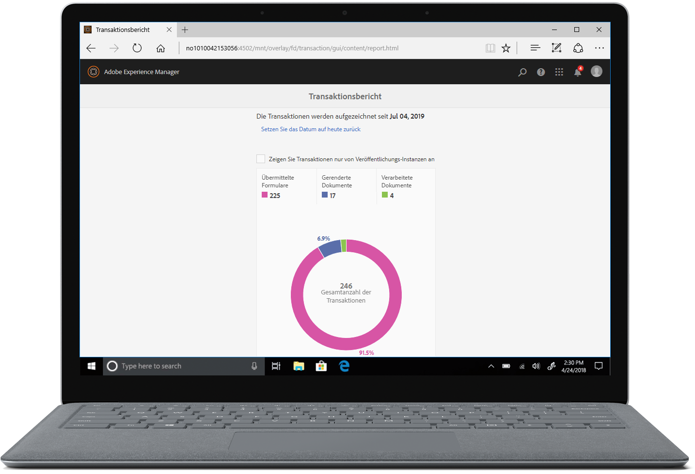

# Übersicht über die neuen Funktionen | AEM 6.5 Forms{#new-features-summary-aem-forms}

## Transaktionsberichte {#transaction-reports}

Mit Transaktionsberichten können Sie die Anzahl der gesendeten Formulare, verarbeiteten Dokumente und gerenderten Dokumente erfassen und verfolgen. Das Ziel der Verfolgung dieser Transaktionen besteht darin, eine fundierte Entscheidung über die Produktnutzung zu treffen und Investitionen in Hardware und Software neu auszurichten. Beispiele für Transaktionen:

* Übermittlung eines adaptiven Formulars, eines HTML5-Formulars oder eines Formularsatzes
* Ausgabe eines Drucks oder einer Webversion einer interaktiven Kommunikation
* Konvertieren eines Dokuments aus einem Dateiformat in ein anderes

Informationen zur Konfiguration und Verwendung von Transaktionsberichten finden Sie unter [Übersicht über Transaktionsberichte](../../forms/using/transaction-reports-overview.md).

## Interaktive Kommunikation {#interactive-communications}

**Anzeigemuster von Daten definieren**

Autoren der interaktiven Kommunikation können jetzt [Datenanzeigemuster](create-interactive-communication.md#datadisplaypatterns) für Felder, Variablen und Formulardatenmodellelemente definieren. Beispielsweise das Format Datum, die Währung oder das Telefonformat.

**Verwenden neuer Diagrammtypen**

Sie können jetzt [Quadrante Diagramme mit mehreren Reihen](../../forms/using/chart-component-interactive-communications.md) zur interaktiven Kommunikation hinzufügen.

**Sortieren von Spalten in einer Tabelle**

Sie können jetzt [Spalten einer Tabelle](../../forms/using/create-interactive-communication.md#sortcolumns) in der interaktiven Kommunikation sortieren. Sie können Tabellenspalten mit statischen Text- oder Datenmodellobjekten binden und sortieren.

**Verwenden neuer Komponenten in einem Webkanal**

Sie können nun dem Webkanal Schaltflächen- und Trennzeichenkomponenten hinzufügen. Weitere Informationen finden Sie unter [Hinzufügen der Schaltflächenkomponente zum Webkanal](../../forms/using/create-interactive-communication.md#add-button-component-to-the-web-channel) und [Trennzeichenkomponente im Webkanal](../../forms/using/create-interactive-communication.md#separatorcomponent).

**Layout-Modus zur Größenanpassung von Komponenten**

Sie können jetzt zum Modus [Layout](../../forms/using/resize-using-layout-mode.md) wechseln, um die Größe von Komponenten im Webkanal mithilfe einer WYSIWYG-Oberfläche zu ändern.

**Verbesserungen der Benutzerfreundlichkeit**

Autoren der interaktiven Kommunikation können jetzt verschiedene benutzerfreundliche Vorgänge beim Erstellen von Korrespondenzen verwenden. Die Liste der Vorgänge umfasst:

* [Ausführen von rückgängig gemachten Aktionen in Druck- und Webkanälen](../../forms/using/create-interactive-communication.md#undoredoactions)
* [Hinzufügen von Variablen in einem Dokumentfragment mithilfe des Symbols @](../../forms/using/texts-interactive-communications.md#searchvariables)
* [Hinzufügen von Datenmodellelementen in einem Dokumentfragment mithilfe des Symbols @](../../forms/using/texts-interactive-communications.md#searchdatamodelproperties)
* [Löschen oder Hinzufügen eines Webkanals zu einer vorhandenen interaktiven Kommunikation](../../forms/using/create-interactive-communication.md#edit-interactive-communication-properties)
* [Binden von Datenquellenelementen mit Feldern und Variablen mithilfe von Drag &amp; Drop-Aktionen](../../forms/using/create-interactive-communication.md#binddatasourceelements)
* [Ungebundene Felder und Variablen beim Erstellen der interaktiven Kommunikation hervorheben](../../forms/using/create-interactive-communication.md#distinguishunboundfields)
* [Durchführen zusätzlicher Aktionen wie Kopieren, Gruppieren oder mehr für geerbte Komponenten in einem Webkanal](../../forms/using/create-interactive-communication.md#componenttoolbar)

**Verbesserungen beim Synchronisierungsprozess**

Das Webkanal-Layout, das mithilfe des Druckkanals automatisch generiert wird, weist mehrere Verbesserungen auf.

## Adaptive Formulare {#adaptive-forms}

### Verwenden von Adobe Signs Cloud-basierten digitalen Signaturen in Adaptive Forms {#use-adobe-sign-s-cloud-based-digital-signatures-in-adaptive-forms}

[Cloud-basierte digitale ](https://helpx.adobe.com/sign/kb/digital-certificate-providers.html) Signaturen oder Remote-Signaturen sind eine neue Generation digitaler Signaturen, die auf dem Desktop, auf Mobilgeräten und im Internet funktionieren und die höchste Kompatibilität und Sicherheit für die Signiererauthentifizierung bieten. Sie können jetzt [ein adaptives Formular](../../forms/using/working-with-adobe-sign.md) mit Cloud-basierten digitalen Signaturen signieren.

#### Einbetten eines adaptiven Formulars oder einer interaktiven Kommunikation in AEM Sites-Einzelseiten-Apps {#embed-an-adaptive-form-or-interactive-communcation-in-aem-sites-single-page-applications}

Mit AEM Forms können Sie [ein adaptives Formular](../../forms/using/embed-adaptive-form-aem-sites-spa.md) oder interaktive Kommunikation nahtlos in eine AEM Sites-Einzelseitenanwendung (SPA) einbetten. Das eingebettete adaptive Formular und die interaktive Kommunikation sind voll funktionsfähig und Benutzer können das Formular ausfüllen und senden, ohne die Seite zu verlassen. Dies hilft Benutzern, im Kontext anderer Elemente auf der Webseite zu bleiben und gleichzeitig mit dem adaptiven Formular oder der interaktiven Kommunikation zu interagieren.

#### Sortieren von Spalten von adaptiven Formulartabellen {#sort-columns-of-adaptive-form-tables}

Sie können jede Spalte einer Tabelle für adaptive Formulare ](../../forms/using/adaptive-forms-tables.md#sortcolumnstable) in auf- oder absteigender Reihenfolge sortieren. [ Sie können die Sortierung auf Tabellenspalten mit statischem Text, Datenmodellobjekteigenschaften oder einer Kombination aus statischen Texteigenschaften und Datenmodellobjekteigenschaften anwenden.

#### Beschränken Sie die Verfügbarkeit von adaptiven Forms-Vorlagen auf bestimmte Pfade {#restrict-the-availability-of-adaptive-forms-templates-to-specific-paths}

Adaptive Formulare unterstützen jetzt die Eigenschaft cq:allowedPaths . Die Eigenschaft [beschränkt die Verfügbarkeit adaptiver Forms-Vorlagen auf bestimmte Pfade](creating-adaptive-form.md#adaptive-form-templates).

#### Kontrollkästchen zum adaptiven Formular dynamisch hinzufügen {#add-check-boxes-to-the-adaptive-form-dynamically}

Sie können jetzt Regeln definieren, um [Kontrollkästchen zum adaptiven Formular hinzuzufügen. Dynamisch](../../forms/using/rule-editor.md#setpropertyrule) basierend auf einer benutzerdefinierten Funktion, einem Formularobjekt oder einer Objekteigenschaft.

## AEM-Workflows {#aem-workflows}

### Variablen in AEM Workflows verwenden {#use-variables-in-aem-workflows}

Variablen ermöglichen es Workflow-Schritten, Metadaten zur Laufzeit über Workflow-Schritte hinweg zu speichern und weiterzugeben. Sie können verschiedene Typen von Variablen zum Speichern verschiedener Datentypen erstellen. Beispiel: Ganzzahlen, Zeichenfolgen, Dokumente oder Formulardatenmodellinstanzen. In der Regel verwenden Sie eine Variable oder eine Sammlung von Variablen, wenn Sie eine Entscheidung basierend auf dem Wert treffen müssen, den sie enthält, oder Informationen speichern möchten, die Sie später in einem Prozess benötigen.

Variablen sind eine Erweiterung der in der vorherigen Version verfügbaren [MetaDataMap](https://helpx.adobe.com/experience-manager/6-5/sites/developing/using/reference-materials/javadoc/com/adobe/granite/workflow/metadata/MetaDataMap.html)-Schnittstelle. Dies spart Zeit bei der Entwicklung von benutzerdefiniertem ECMAScript-Code, der zum Abrufen und Aktualisieren von Metadatenwerten verwendet wird. Sie verwenden weiterhin die MetaDataMap-Schnittstelle und den ECMAScript-Code, um Metadaten zu bearbeiten. Die Verwendung von Variablen über MetaDataMap und ECMAScript bietet einige Vorteile:

* Dynamische Speicherung, Aktualisierung und Verwendung von Werten, die in einer Variablen gespeichert sind, im gesamten Workflow ohne benutzerspezifischen Code
* Abrufen und Aktualisieren von Werten direkt in ein Formulardatenmodell und eine Datendatei (XML/JSON ) eines gesendeten Formulars
* Speichern vollständiger Dokumente in einer Variablen für die Dokumentverarbeitung

Der Schritt Gehe zu oder Aufspaltung und alle AEM Forms-Workflow-Schritte unterstützen Variablen. Sie können die MetaDataMap-Schnittstelle verwenden, um auf Variablen in Workflow-Schritten zuzugreifen, die keine native Unterstützung für Variablen haben. Weitere Informationen finden Sie unter [Variablen in AEM Workflows](../../forms/using/variable-in-aem-workflows.md).

#### Verwenden eines Workflows mit verschiedenen adaptiven Forms {#use-a-workflow-with-different-adaptive-forms}

Sie können [ein adaptives Formular für den Schritt &quot;Aufgabe zuweisen](../../forms/using/aem-forms-workflow-step-reference.md#assign-task-step)&quot;und den Schritt &quot;Datensatzdokument&quot;formularzentrierter Workflows zur Laufzeit angeben. Dadurch kann ein Workflow mit verschiedenen adaptiven Forms verwendet werden. Sie können die Methode zur Auswahl eines adaptiven Formulars beim Entwerfen des Workflows festlegen. Das adaptive Formular kann sich in einem absoluten Pfad befinden, als Nutzlast an den Workflow gesendet werden oder in einem Pfad verfügbar sein, der mithilfe einer Variablen berechnet wird.

#### Verwenden Sie erweiterte Protokollierungsfunktionen für formularzentrierte Workflow-Schritte {#use-enhanced-logging-capabilities-of-forms-centric-workflow-steps}

Die Protokollierungsfunktionen von formularzentrierten Workflow-Schritten sind standardisiert. Jetzt erzeugen alle formularzentrierten Workflow-Schritte ähnlich standardisierte Protokolle. Dies trägt zur Verbesserung der Debugging-Geschwindigkeit bei.

## Datenintegration {#data-integration}

Sie haben nun die folgenden Möglichkeiten:

* [Validieren Sie die ](../../forms/using/work-with-form-data-model.md#automated-validation-of-input-data) Eingabedatenbank anhand einer Liste von Begrenzungen. Dadurch wird sichergestellt, dass nur gültige Daten an die Datenquelle gesendet werden.
* [Außerkraftsetzen des in einer WSDL-Datei (Web Services Description Language) definierten Standard-](../../forms/using/configure-data-sources.md#configure-soap-web-services) Endpunkts.

* [Überschreiben Sie ](../../forms/using/configure-data-sources.md#configure-restful-web-services) [das Standardschema, den Host und den Basispfad, die in der Swagger-Definitionsdatei ](../../forms/using/configure-data-sources.md#configure-restful-web-services) definiert sind.

## Plattform- und Sicherheitsupdates {#platform-and-security-updates}

### Wichtige Plattformaktualisierungen {#major-platform-updates}

AEM Forms kann mit einer beliebigen Kombination von unterstützten Betriebssystemen, Anwendungsservern, Datenbanken, Datenbanktreibern, JDK-, LDAP-Servern und E-Mail-Servern eingerichtet werden. Im Folgenden finden Sie die wichtigsten Änderungen an [unterstützten Plattformen](../../forms/using/aem-forms-jee-supported-platforms.md):

<table>
 <tbody>
  <tr>
   <td>Komponente</td>
   <td>Unterstützung entfernt</td>
  </tr>
  <tr>
   <td>Betriebssysteme</td>
   <td>
    <ul>
     <li>Microsoft Windows Server 2012 R2</li>
     <li>IBM AIX*</li>
     <li>Sun Solaris*</li>
    </ul> </td>
  </tr>
  <tr>
   <td>Anwendungsserver  </td>
   <td>
    <ul>
    <li>WebSphere Liberty-Profil</li>
    <li>Oracle WebLogic </li>
    </ul> </td>
  </tr>
  <tr>
   <td>Datenbanken</td>
   <td>
    <ul>
     <li>IBM DB2   </li>
     <li>Oracle RAC</li>
    </ul> </td>
  </tr>
  <tr>
   <td>LDAP-Server</td>
   <td>
    <ul>
     <li>Microsoft Active Directory 2012</li>
     <li>Novell eDirectory 8.8.7 </li>
     <li>IBM Lotus Domino 8.5.0 </li>
    </ul> </td>
  </tr>
  <tr>
   <td>E-Mail-Server</td>
   <td>
    <ul>
     <li>IBM Lotus Domino 8.5.0 </li>
    </ul> </td>
  </tr>
  <tr>
   <td>Connectoren</td>
   <td>
    <ul>
     <li>Connector für Microsoft Sharepoint 2013</li>
     <li>Connector für EMC Documentum 7.0</li>
    </ul> </td>
  </tr>
  <tr>
   <td>AEM Forms-App  </td>
   <td>
    <ul>
     <li>Unterstützung für Windows 8.1</li>
    </ul> </td>
  </tr>
  <tr>
   <td>Java </td>
   <td>
    <ul>
     <li>Java 11</li>
    </ul> </td>
  </tr>
 </tbody>
</table>

* Kontaktieren Sie den Support der Adobe für Informationen zur Migration auf eine andere Plattform.

#### Neue HTML5-basierte Benutzeroberflächen {#new-html-based-uis}

Im Einklang mit der geplanten Abschaffung des Adobe Flash Player und der allgemeinen Richtung der Migration von Flash-basierten Inhalten zu offenen Standards hat AEM 6.5 Forms die Flash-basierte Benutzeroberfläche von Health Monitor, Process Management, Reader Extension und Category Management UI von AEM Forms on JEE Administration Console durch eine HTML5-basierte Benutzeroberfläche ersetzt.

#### Sicherheitsverbesserungen {#security-improvements}

* AEM 6.5 Forms on JEE Administration Console-Benutzeroberfläche basiert jetzt auf Apache Struts 2.5.
* AEM 6.5 verwendet Forms jetzt jQuery zu 3.2.1 und jQuery UI 1.12.1. Siehe [Upgrade-Dokumentation](/help/forms/home.md) für die Auswirkungen der Änderung.

#### Verbesserungen der Barrierefreiheit {#accessibility-improvements}

AEM 6.5 Forms hat die Barrierefreiheit von AEM Forms Workspace verbessert.
