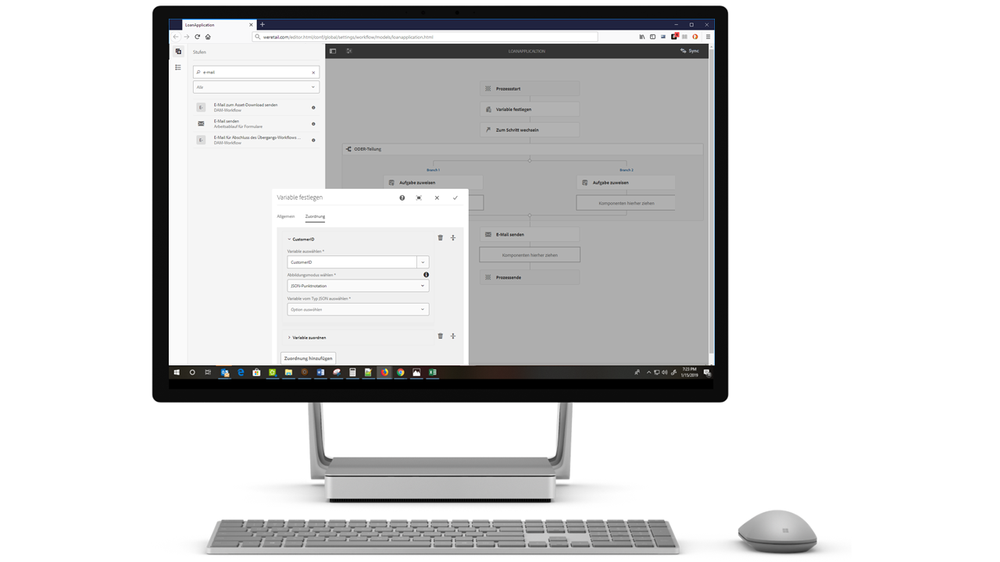

# Übersicht über die neuen Funktionen | AEM 6.5 Forms{#new-features-summary-aem-forms}

## Transaktionsberichte {#transaction-reports}

Mit Transaktionsberichten können Sie die Anzahl der übermittelten Formulare, verarbeiteten Dokumente und gerenderten Dokumente erfassen und verfolgen. Das Ziel bei der Verfolgung dieser Transaktionen ist es, eine fundierte Entscheidung über die Produktnutzung und die Neugewichtung der Investitionen in Hardware und Software treffen zu können. Beispiele für Transaktionen:

* Übermittlung eines adaptiven Formulars, eines HTML5-Formulars oder eines Formularsatzes
* Ausgabe einer Druck- oder Web-Version einer interaktiven Kommunikation
* Konvertieren eines Dokuments aus einem Dateiformat in ein anderes

Informationen zur Konfiguration und Verwendung von Transaktionsberichten finden Sie in der [Übersicht über Transaktionsberichte](../../forms/using/transaction-reports-overview.md).

## Interaktive Kommunikation {#interactive-communications}

**Definieren von Anzeigemustern für Daten**

Autoren von interaktiven Kommunikationen können jetzt [Datenanzeigemuster](create-interactive-communication.md#datadisplaypatterns) für Felder, Variablen und Formulardatenmodellelemente definieren. Zum Beispiel Formate für Datum, Währung oder Telefonnummer.

**Verwenden neuer Diagrammtypen**

Sie können jetzt [Quadrantendiagramme und Diagramme mit mehreren Serien](../../forms/using/chart-component-interactive-communications.md) zu interaktiven Kommunikationen hinzufügen.

**Sortieren von Spalten in einer Tabelle**

Sie können in einer interaktiven Kommunikation jetzt [die Spalten einer Tabelle sortieren](../../forms/using/create-interactive-communication.md#sortcolumns). Sie können Tabellenspalten mit statischen Text- oder Datenmodellobjekten binden und sortieren.

**Verwenden neuer Komponenten in einem Web-Kanal**

Sie können jetzt Schaltflächen- und Trennzeichenkomponenten zum Web-Kanal hinzufügen. Weitere Informationen finden Sie unter [Hinzufügen einer Schaltflächenkomponente zum Web-Kanal](../../forms/using/create-interactive-communication.md#add-button-component-to-the-web-channel) und [Trennzeichenkomponente im Web-Kanal](../../forms/using/create-interactive-communication.md#separatorcomponent).

**Verwenden des Layout-Modus, um die Größe von Komponenten zu ändern**

Sie können jetzt in den [Layout-Modus](../../forms/using/resize-using-layout-mode.md) wechseln, um die Größe von Komponenten im Web-Kanal mithilfe einer WYSIWYG-Oberfläche zu ändern.

**Verbesserungen der Benutzerfreundlichkeit**

Autoren von interaktiven Kommunikationen können jetzt verschiedene benutzerfreundliche Vorgänge beim Erstellen von Korrespondenzen verwenden. Die Liste der Vorgänge umfasst:

* [Rückgängig machen und Wiederholen von Aktionen in Druck- und Web-Kanälen](../../forms/using/create-interactive-communication.md#undoredoactions)
* [Hinzufügen von Variablen in einem Dokumentfragment mithilfe des Symbols @](../../forms/using/texts-interactive-communications.md#searchvariables)
* [Hinzufügen von Datenmodellelementen in einem Dokumentfragment mithilfe des Symbols @](../../forms/using/texts-interactive-communications.md#searchdatamodelproperties)
* [Löschen oder Hinzufügen eines Web-Kanals zu einer vorhandenen interaktiven Kommunikation](../../forms/using/create-interactive-communication.md#edit-interactive-communication-properties)
* [Binden von Datenquellenelementen mit Feldern und Variablen mithilfe von Drag-and-Drop-Aktionen](../../forms/using/create-interactive-communication.md#binddatasourceelements)
* [Hervorheben von ungebundenen Feldern und Variablen beim Verfassen einer interaktiven Kommunikation](../../forms/using/create-interactive-communication.md#distinguishunboundfields)
* [Durchführen zusätzlicher Aktionen wie Kopieren, Gruppieren und mehr für vererbte Komponenten in einem Web-Kanal](../../forms/using/create-interactive-communication.md#componenttoolbar)

**Verbesserungen beim Synchronisierungsprozess**

Das Layout des Web-Kanals, das mithilfe des Druckkanals automatisch generiert wird, weist mehrere Verbesserungen auf.

## Adaptive Formulare {#adaptive-forms}

### Verwendung der Cloud-basierten digitalen Signaturen von Adobe Sign in adaptiven Formularen {#use-adobe-sign-s-cloud-based-digital-signatures-in-adaptive-forms}

[Cloud-basierte digitale Signaturen oder Remote-Signaturen sind eine neue Generation digitaler Signaturen, die über Desktop, Mobilgeräte und das Web funktionieren – sowie höchste Compliance und Sicherheit für die Authentifizierung der Unterzeichner erfüllen. ](https://helpx.adobe.com/de/sign/kb/digital-certificate-providers.html) Sie können jetzt [ein adaptives Formular mit Cloud-basierten digitalen Signaturen signieren](../../forms/using/working-with-adobe-sign.md).

#### Einbetten eines adaptiven Formulars oder einer interaktiven Kommunikation in Einzelseiten-Programme von AEM Sites {#embed-an-adaptive-form-or-interactive-communcation-in-aem-sites-single-page-applications}

Mit AEM Forms können Sie ein adaptives Formular oder eine interaktive Kommunikation [nahtlos in ein Einzelseiten-Programm (SPA) von AEM Sites einbetten](../../forms/using/embed-adaptive-form-aem-sites-spa.md). Das eingebettete adaptive Formular ist voll funktionsfähig, und Benutzer können es ausfüllen und absenden, ohne die Seite zu verlassen. Es hilft Benutzern, im Kontext anderer Elemente auf der Web-Seite zu bleiben und gleichzeitig mit dem Formular oder der interaktiven Kommunkation zu interagieren.

#### Sortieren von Tabellenspalten in adaptiven Formularen {#sort-columns-of-adaptive-form-tables}

Sie können [jede Spalte einer Tabelle eines adaptiven Formulars](../../forms/using/adaptive-forms-tables.md#sortcolumnstable) in aufsteigender oder absteigender Reihenfolge sortieren. Sie können die Sortierung auf Tabellenspalten mit statischem Text anwenden, aber auch auf welche mit Datenmodellobjekteigenschaften oder einer Kombination aus beiden.

#### Einschränkung der Verfügbarkeit von adaptiven Formular-Vorlagen auf bestimmte Pfade {#restrict-the-availability-of-adaptive-forms-templates-to-specific-paths}

Adaptive Formulare unterstützen jetzt die Eigenschaft „cq:allowedPaths“. Die Eigenschaft [beschränkt die Verfügbarkeit von adaptiven Formular-Vorlagen auf bestimmte Pfade](creating-adaptive-form.md#adaptive-form-templates).

#### Dynamisches Hinzufügen von Kontrollkästchen zum adaptiven Formular {#add-check-boxes-to-the-adaptive-form-dynamically}

Sie können jetzt Regeln definieren, um [dem adaptiven Formular dynamisch Kontrollkästchen hinzuzufügen](../../forms/using/rule-editor.md#setpropertyrule), die auf einer benutzerdefinierten Funktion, einem Formularobjekt oder einer Objekteigenschaft basieren.

## AEM-Workflows {#aem-workflows}

### Verwenden von Variablen in AEM-Workflows {#use-variables-in-aem-workflows}

Variablen ermöglichen es Workflow-Schritten, zur Laufzeit Metadaten zu speichern und an andere Workflow-Schritte zu übergeben. Sie können verschiedene Typen von Variablen zum Speichern unterschiedlicher Datentypen erstellen. Zum Beispiel: Ganzzahlen, Zeichenketten, Dokumente oder Formulardatenmodellinstanzen. In der Regel verwenden Sie eine Variable oder eine Sammlung von Variablen, wenn eine Entscheidung basierend auf dem Wert der Variablen getroffen werden soll oder wenn Informationen gespeichert werden sollen, die Sie später in einem Prozess benötigen.

Variablen sind eine Erweiterung der [MetaDataMap](https://helpx.adobe.com/de/experience-manager/6-5/sites/developing/using/reference-materials/javadoc/com/adobe/granite/workflow/metadata/MetaDataMap.html)-Schnittstelle, die bereits in der vorherigen Version verfügbar war. Dies spart Zeit bei der Entwicklung von benutzerdefiniertem ECMAScript-Code, der zum Abrufen und Aktualisieren von Metadatenwerten verwendet wird. Sie verwenden weiterhin die MetaDataMap-Schnittstelle und den ECMAScript-Code, um Metadaten zu verändern. Einige Vorteile der Verwendung von Variablen gegenüber MetaDataMap und ECMAScript sind:

* Dynamische Speicherung, Aktualisierung und Verwendung von Werten, die in einer Variablen gespeichert sind, im gesamten Workflow, ohne auf benutzerdefinierten Code angewiesen zu sein
* Abruf und Aktualisierung von Werten direkt in ein Formulardatenmodell und eine Datendatei (XML/JSON) eines übermittelten Formulars
* Speichern vollständiger Dokumente in einer Variable, um die Dokumentenverarbeitung durchzuführen

Die Schritte „Wechseln zu“ und „ODER Aufteilen“ sowie alle AEM Forms-Workflow-Schritte unterstützen Variablen. Sie können die MetaDataMap-Schnittstelle verwenden, um auf Variablen in Workflow-Schritten zuzugreifen, die über keine native Unterstützung für Variablen verfügen. Weitere Informationen finden Sie unter [Variablen in AEM-Workflows](../../forms/using/variable-in-aem-workflows.md).

#### Verwenden eines Workflows mit verschiedenen adaptiven Formularen  {#use-a-workflow-with-different-adaptive-forms}

Sie können [ein adaptives Formular für den Schritt „Aufgabe zuweisen“](../../forms/using/aem-forms-workflow-step-reference.md#assign-task-step) und „Dokument des Datensatzes“ des formularbasierten Workflows zur Laufzeit angeben. Dies ermöglicht es einem Workflow, mit verschiedenen adaptiven Formularen zu arbeiten. Sie können die Methode zur Auswahl eines adaptiven Formulars beim Entwerfen des Workflows festlegen. Das adaptive Formular kann sich in einem absoluten Pfad befinden, als Payload an den Workflow übermittelt werden oder unter einem über eine Variable berechneten Pfad verfügbar sein.

#### Nutzung der erweiterten Protokollierungsfunktionen von formularzentrierten Workflow-Schritten {#use-enhanced-logging-capabilities-of-forms-centric-workflow-steps}

Die Protokollierungsfunktionen von formularzentrierten Workflow-Schritten sind standardisiert. Jetzt erzeugen alle formularzentrierten Workflow-Schritte ähnlich standardisierte Protokolle. Dies trägt zu einer verbesserten Debugging-Geschwindigkeit bei.

## -Datenintegration {#data-integration}

Sie haben nun die folgenden Möglichkeiten:

* [Eingabedaten überprüfen](../../forms/using/work-with-form-data-model.md#automated-validation-of-input-data) auf der Grundlage einer Liste von Einschränkungen. Dadurch wird sichergestellt, dass nur gültige Daten an die Datenquelle übermittelt werden.
* [Überschreiben des Standard-Endpunkts](../../forms/using/configure-data-sources.md#configure-soap-web-services), welcher in einer WSDL-Datei (Web Services Description Language) definiert ist.

* [Überschreiben des Standard](../../forms/using/configure-data-sources.md#configure-restful-web-services) [-Schemas, -Hosts und -Basispfads](../../forms/using/configure-data-sources.md#configure-restful-web-services), die in der Swagger-Definitionsdatei festgelegt sind.

## Plattform- und Sicherheitsupdates {#platform-and-security-updates}

### Wichtige Plattform-Updates {#major-platform-updates}

AEM Forms kann mit einer beliebigen Kombination von unterstützten Betriebssystemen, Anwendungsservern, Datenbanken, Datenbanktreibern, JDK-, LDAP-Servern und E-Mail-Servern eingerichtet werden. Im Folgenden sind die wichtigsten Änderungen bei den [unterstützten Plattformen](../../forms/using/aem-forms-jee-supported-platforms.md) aufgeführt:

<table>
 <tbody>
  <tr>
   <td>Komponente</td>
   <td>Unterstützung entfernt</td>
  </tr>
  <tr>
   <td>Betriebssysteme</td>
   <td>
    <ul>
     <li>Microsoft Windows Server 2012 R2</li>
     <li>IBM AIX*</li>
     <li>Sun Solaris*</li>
    </ul> </td>
  </tr>
  <tr>
   <td>Anwendungsserver  </td>
   <td>
    <ul>
    <li>WebSphere Liberty Profile</li>
    <li>Oracle WebLogic </li>
    </ul> </td>
  </tr>
  <tr>
   <td>Datenbanken</td>
   <td>
    <ul>
     <li>IBM DB2   </li>
     <li>Oracle RAC</li>
    </ul> </td>
  </tr>
  <tr>
   <td>LDAP-Server</td>
   <td>
    <ul>
     <li>Microsoft Active Directory 2012</li>
     <li>Novell eDirectory 8.8.7 </li>
     <li>IBM Lotus Domino 8.5.0 </li>
    </ul> </td>
  </tr>
  <tr>
   <td>E-Mail-Server</td>
   <td>
    <ul>
     <li>IBM Lotus Domino 8.5.0 </li>
    </ul> </td>
  </tr>
  <tr>
   <td>Connectoren</td>
   <td>
    <ul>
     <li>Connector für Microsoft Sharepoint 2013</li>
     <li>Connector für EMC Documentum 7.0</li>
    </ul> </td>
  </tr>
  <tr>
   <td>AEM Forms-App  </td>
   <td>
    <ul>
     <li>Unterstützung für Windows 8.1</li>
    </ul> </td>
  </tr>
  <tr>
   <td>Java </td>
   <td>
    <ul>
     <li>Java 11</li>
    </ul> </td>
  </tr>
 </tbody>
</table>

&#42; Support kontaktieren für Informationen zur Migration auf eine andere Adobe

#### Neue HTML5-basierte Benutzeroberflächen {#new-html-based-uis}

Im Einklang mit der geplanten Abschaffung des Adobe Flash Players und der allgemeinen Richtung der Migration von Flash-basierten Inhalten zu Open Standards hat AEM 6.5 Forms die Flash-basierten Benutzeroberflächen von Health Monitor, Process Management, Reader Extension und die Category Management-Benutzeroberfläche der Administration-Console von AEM Forms auf JEE durch HTML5-basierte Benutzeroberflächen ersetzt.

#### Sicherheitsverbesserungen {#security-improvements}

* Die Benutzeroberfläche der Administration-Console von AEM 6.5 Forms auf JEE basiert jetzt auf Apache Struts 2.5.
* AEM 6.5 Forms verwendet jetzt jQuery zu 3.2.1 und jQuery UI 1.12.1. Siehe die [Upgrade-Dokumentation](/help/forms/home.md) für die Auswirkungen der Änderung.

#### Verbesserungen der Barrierefreiheit {#accessibility-improvements}

In AEM 6.5 Forms wurde die Barrierefreiheit von AEM Forms Workspace verbessert.
