# Arbeiten mit einem Formulardatenmodell{#work-with-form-data-model}


Der Formulardatenmodell-Editor bietet eine intuitive Benutzeroberfläche und Werkzeuge zum Bearbeiten und Konfigurieren eines Formulardatenmodells. Mithilfe des Editors können Sie Datenmodellobjekte, Eigenschaften und Dienste aus verknüpften Datenquellen im Formulardatenmodell hinzufügen und konfigurieren. Darüber hinaus können Sie Datenmodellobjekte und -eigenschaften ohne Datenquellen erstellen und später mit den entsprechenden Datenmodellobjekten und -eigenschaften verknüpfen. Sie können auch Beispieldaten für Datenmodellobjekteigenschaften generieren und bearbeiten, die Sie zum Vorbefüllen von adaptiven Formularen und interaktiver Kommunikation während der Vorschau verwenden können. Sie können Datenmodellobjekte und -dienste testen, die in einem Formulardatenmodell konfiguriert sind, um sicherzustellen, dass sie ordnungsgemäß in Datenquellen integriert sind.

Wenn Sie mit der Forms-Datenintegration noch nicht vertraut sind und keine Datenquelle konfiguriert oder ein Formulardatenmodell erstellt haben, lesen Sie die folgenden Themen:

* [Datenintegration für AEM Forms](/help/forms/using/data-integration.md)
* [Konfigurieren von Datenquellen](/help/forms/using/configure-data-sources.md)
* [Formulardatenmodell erstellen](/help/forms/using/create-form-data-models.md)

Erfahren Sie weitere Details zu verschiedenen Aufgaben und Konfigurationen, die Sie mit dem Formulardatenmodell-Editor durchführen können.

>[!NOTE]
>
>Sie müssen Mitglied der Gruppen **fdm-author** und **forms-user** sein, um Formulardatenmodell erstellen und verwenden zu können. Wenden Sie sich an Ihren AEM-Administrator, um Mitglied der Gruppe zu werden.

## Datenmodellobjekte und Dienste hinzufügen {#add-data-model-objects-and-services}

Wenn Sie ein Formulardatenmodell mit Datenquellen erstellt haben, können Sie den Formulardatenmodelleditor verwenden, um Datenmodellobjekte und -dienste hinzuzufügen, deren Eigenschaften zu konfigurieren, Verknüpfungen zwischen Datenmodellobjekten zu erstellen und das Formulardatenmodell und die Formulardienste zu testen.

Sie können Datenmodellobjekte und Dienste aus verfügbaren Datenquellen im Formulardatenmodell hinzufügen. Dabei werden hinzugefügte Datenmodellobjekte auf der Registerkarte „Modell“ und hinzugefügte Dienste auf der Registerkarte „Dienste“ angezeigt.

So fügen Sie Datenmodellobjekte und -dienste hinzu:

1. Melden Sie sich bei der AEM-Autorinstanz an, navigieren Sie zu **[!UICONTROL Formulare > Datenintegrationen]** und öffnen Sie das Formulardatenmodell, in dem Sie Datenmodellobjekte hinzufügen möchten.
1. Erweitern Sie im Bereich Data Sources die Datenquellen, um verfügbare Datenmodellobjekte und -dienste Ansicht.
1. Wählen Sie Datenmodellobjekte und Dienste aus, die Sie dem Formulardatenmodell hinzufügen möchten, und tippen Sie auf **[!UICONTROL Ausgewählte hinzufügen]**.

   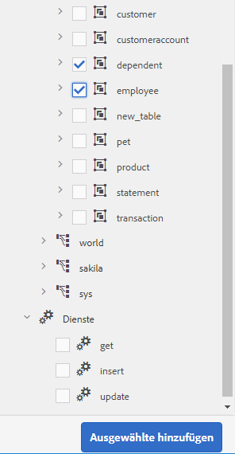

   Ausgewählte Datenmodellobjekte und Dienste

   Auf der Registerkarte „Modell“ wird eine grafische Darstellung aller Datenmodellobjekte und ihrer Eigenschaften angezeigt, die dem Formulardatenmodell hinzugefügt wurden. Jedes Datenmodellobjekt wird durch eine Box im Formulardatenmodell dargestellt.

   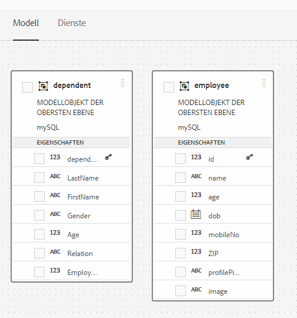

   Registerkarte „Modell“ mit hinzugefügten Datenmodellobjekten

   >[!NOTE]
   >
   >Sie können die Datenmodellobjekt-Boxen durch Ziehen im Inhaltsbereich anordnen. Alle im Formulardatenmodell hinzugefügten Datenmodellobjekte werden im Bereich „Datenquellen“ ausgegraut.

   Auf der Registerkarte „Dienste“ wird eine Liste der hinzugefügten Dienste angezeigt.

   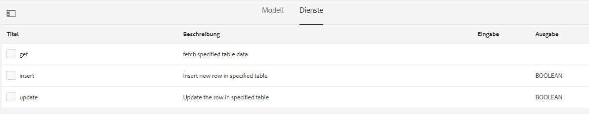

   Registerkarte „Dienste“ mit Datenmodelldiensten

   >[!NOTE]
   >
   >Das OData-Dienst-Metadatendokument enthält außer den Datenmodellobjekten und Diensten Navigationseigenschaften, die die Verknüpfung zwischen zwei Datenmodellobjekten definieren. Weitere Informationen finden Sie unter [Arbeiten mit Navigationseigenschaften von OData-Diensten](#work-with-navigation-properties-of-odata-services).

1. Tippen Sie auf **[!UICONTROL Speichern]**, um das Formularmodellobjekt zu speichern.

   >[!NOTE]
   >
   >Sie können die auf der Registerkarte „Dienste“ eines Formulardatenmodells konfigurierten Dienste mithilfe von Regeln für adaptive Formulare aufrufen. Die konfigurierten Dienste sind in der Aktion zum Aufrufen von Diensten im Regeleditor verfügbar. Weitere Informationen zum Verwenden dieser Dienste in Regeln für adaptive Formulare finden Sie unter „Aufrufen von Diensten und Festlegen von Werten für Regeln“ unter [Regeleditor](/help/forms/using/rule-editor.md).

## Erstellen von Datenmodellobjekten und untergeordneten Eigenschaften  {#create-data-model-objects-and-child-properties}

### Erstellen von Datenmodellobjekten {#create-data-model-objects}

Während Sie Datenmodellobjekte aus konfigurierten Datenquellen hinzufügen können, können Sie auch Datenmodellobjekte oder -entitäten ohne Datenquellen erstellen. Dies ist besonders hilfreich, wenn Sie keine Datenquellen im Formulardatenmodell konfiguriert haben.

Erstellen eines Datenmodellobjekts ohne Datenquellen:

1. Melden Sie sich bei der AEM-Autorinstanz an, navigieren Sie zu **[!UICONTROL Formulare > Datenintegrationen]** und öffnen Sie das Formulardatenmodell, in dem Sie ein Datenmodellobjekt oder eine Entität hinzufügen möchten.
1. Tippen Sie auf **[!UICONTROL Entität erstellen]**.
1. Geben Sie im Dialogfeld „Datenmodell erstellen“ einen Namen für das Datenmodell ein und tippen Sie auf **[!UICONTROL Hinzufügen]**. Ein Datenmodellobjekt wird dem Formulardatenmodell hinzugefügt. Beachten Sie, dass das neu hinzugefügte Datenmodellobjekt nicht an eine Datenquelle gebunden ist und keine Eigenschaften aufweist, wie in der folgenden Abbildung dargestellt.

   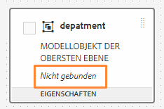

Als Nächstes können Sie untergeordnete Objekte in nicht gebundenen Datenmodellobjekten hinzufügen.

### Hinzufügen von untergeordneten Eigenschaften  {#child-properties}

Mit dem Formulardatenmodell-Editor können Sie untergeordnete Eigenschaften in einem Datenmodellobjekt erstellen. Die Eigenschaft ist beim Erstellen nicht an eine Eigenschaft in einer Datenquelle gebunden. Sie können die untergeordnete Eigenschaft später mit einer anderen Eigenschaft im enthaltenden Datenmodellobjekt verknüpfen.

Erstellen einer untergeordneten Eigenschaft:

1. Wählen Sie in einem Formulardatenmodell ein Datenmodellobjekt aus, und tippen Sie auf **[!UICONTROL Untergeordnete Eigenschaft erstellen]**.
1. Geben Sie im Dialogfeld **[!UICONTROL Untergeordnete Eigenschaft erstellen]** einen Namen und einen Datentyp für die Eigenschaft in den Feldern **[!UICONTROL Name]** und **[!UICONTROL Typ]** ein. Sie können optional einen Titel und eine Beschreibung für die Eigenschaft angeben.
1. Aktivieren Sie „Berechnet“, wenn die Eigenschaft eine berechnete Eigenschaft ist. Der Wert einer berechneten Eigenschaft wird basierend auf einer Regel oder einem Ausdruck ausgewertet. Weitere Informationen finden Sie unter [Eigenschaften bearbeiten](#edit-properties).
1. Wenn das Datenmodellobjekt an eine Datenquelle gebunden ist, wird die hinzugefügte untergeordnete Eigenschaft automatisch an die Eigenschaft des übergeordneten Datenmodellobjekts mit demselben Namen und Datentyp gebunden.

   Um eine untergeordnete Eigenschaft manuell mit einer Datenmodellobjekteigenschaft zu verknüpfen, tippen Sie auf das Symbol zum Durchsuchen neben dem Feld **[!UICONTROL Bindungsverweis]**. Im Dialogfeld **[!UICONTROL Objekt auswählen]** werden alle Eigenschaften des übergeordneten Datenmodellobjekts aufgelistet. Wählen Sie eine Eigenschaft zum Binden aus und tippen Sie auf das Häkchensymbol. Beachten Sie, dass Sie nur eine Eigenschaft des gleichen Datentyps wie die untergeordnete Eigenschaft auswählen können.

1. Tippen Sie auf **[!UICONTROL Fertig]**, um die Verknüpfung zu speichern, und dann auf **[!UICONTROL Speichern]**, um das Formulardatenmodell zu speichern. Die untergeordnete Eigenschaft wird jetzt zum Datenmodellobjekt hinzugefügt.

Nachdem Sie Datenmodellobjekte und -eigenschaften erstellt haben, können Sie weiterhin basierend auf dem Formulardatenmodell adaptive Formulare und interaktive Kommunikationen erstellen. Später, wenn Datenquellen verfügbar und konfiguriert sind, können Sie das Formulardatenmodell mit Datenquellen verknüpfen. Die Bindung wird automatisch in zugeordneten adaptiven Formularen und interaktiver Kommunikation aktualisiert. Weitere Informationen zum Erstellen adaptiver Formulare und interaktiver Kommunikation mit dem Formulardatenmodell finden Sie unter [Formulardatenmodell verwenden](/help/forms/using/using-form-data-model.md).

### Datenmodellobjekte und -eigenschaften binden {#bind-data-model-objects-and-properties}

Wenn die Datenquellen, die Sie in das Formulardatenmodell integrieren möchten, verfügbar sind, können Sie sie dem Formulardatenmodell hinzufügen, wie unter [Datenquellen aktualisieren](/help/forms/using/create-form-data-models.md#update) beschrieben. Führen Sie anschließend folgende Schritte durch, um die ungebundenen Datenmodellobjekte und -eigenschaften zu binden:

1. Wählen Sie im Formulardatenmodell die ungebundene Datenquelle aus, die Sie mit einer Datenquelle binden möchten.
1. Tippen Sie auf **[!UICONTROL Eigenschaften bearbeiten]**.
1. Tippen Sie im Bereich **[!UICONTROL Eigenschaften bearbeiten]** auf das Suchsymbol neben dem Feld **[!UICONTROL Bindung]**. Es öffnet sich das Dialogfeld **[!UICONTROL Objekt auswählen]**, in dem Datenquellen aufgelistet sind, die im Formulardatenmodell hinzugefügt wurden.

   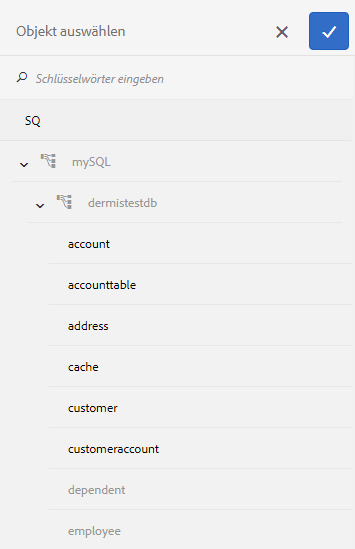

1. Erweitern Sie den Datenquellenbaum, und wählen Sie ein Datenmodellobjekt aus, mit dem eine Bindung hergestellt werden soll, und tippen Sie auf das Häkchensymbol.
1. Tippen Sie auf **[!UICONTROL Fertig]**, um die Eigenschaften zu speichern, und dann auf **[!UICONTROL Speichern]**, um das Formulardatenmodell zu speichern. Das Datenmodellobjekt ist jetzt an eine Datenquelle gebunden. Beachten Sie, dass das Datenmodellobjekt nicht mehr als ungebunden markiert ist.

   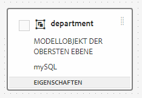

## Dienste konfigurieren {#configure-services}

Um Daten für ein Datenmodellobjekt zu lesen und zu schreiben, gehen Sie folgendermaßen vor, um Lese- und Schreibdienste zu konfigurieren:

1. Aktivieren Sie das Kontrollkästchen am oberen Rand eines Datenmodellobjekts, um es auszuwählen, und tippen Sie auf **[!UICONTROL Eigenschaften bearbeiten]**.

   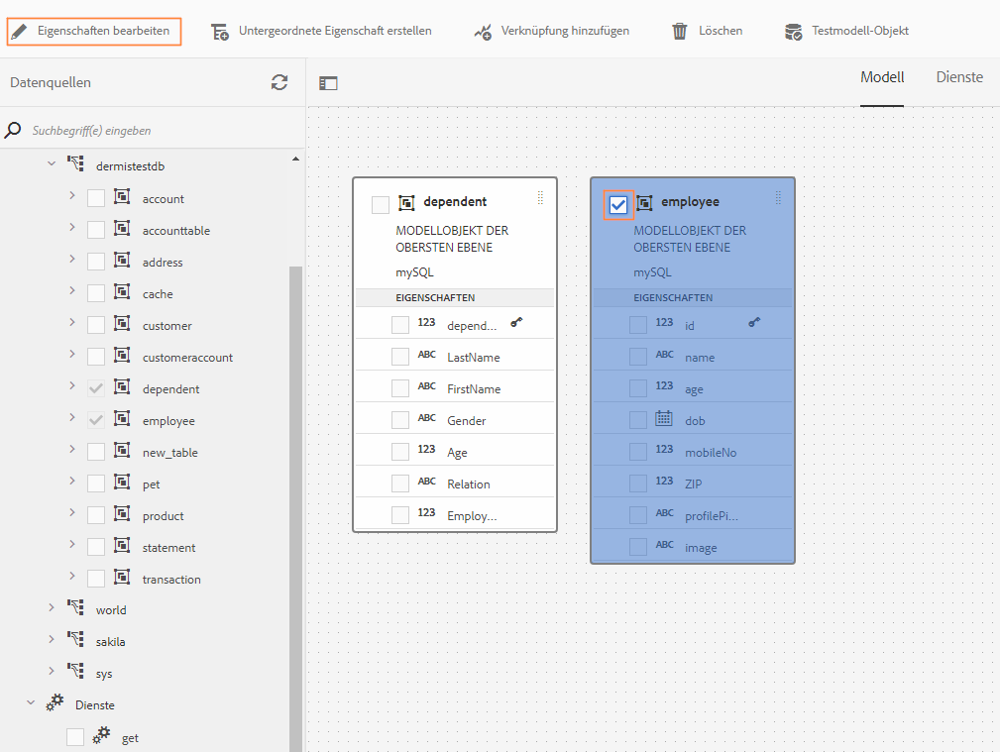

   Eigenschaften bearbeiten, um Lese- und Schreibdienste für Datenmodellobjekte zu konfigurieren

   Das Dialogfeld „Eigenschaften bearbeiten“ wird geöffnet.

   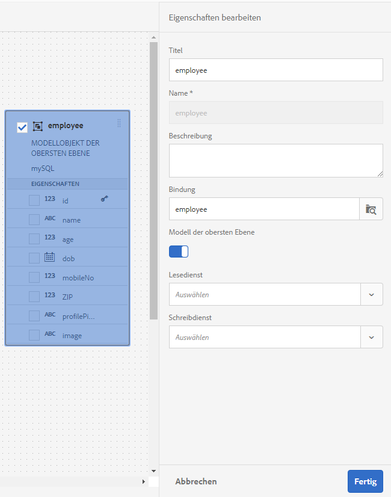

   Dialogfeld „Eigenschaften bearbeiten“

   >[!NOTE]
   >
   >Das OData-Dienst-Metadatendokument enthält außer den Datenmodellobjekten und Diensten Navigationseigenschaften, die die Verknüpfung zwischen zwei Datenmodellobjekten definieren. Wenn Sie eine OData-Dienst-Datenquelle zu einem Formulardatenmodell hinzufügen, steht im Formulardatenmodell ein Dienst für alle Navigationseigenschaften in einem Datenmodellobjekt zur Verfügung. Mithilfe dieses Dienstes können Sie die Navigationseigenschaften des entsprechenden Datenmodellobjekts lesen.
   >
   >
   >Weitere Informationen zur Verwendung des Dienstes finden Sie unter [Arbeiten mit Navigationseigenschaften von OData-Diensten.](#work-with-navigation-properties-of-odata-services)

1. Durch Aktivieren oder Deaktivieren von **[!UICONTROL Top Level Object]** legen Sie fest, ob das Datenmodellobjekt ein Modellobjekt der obersten Ebene ist.

   Datenmodellobjekte, die in einem Formulardatenmodell konfiguriert sind, stehen auf der Registerkarte „Datenmodellobjekte“ im Inhaltsbrowser adaptiver Formulare zur Verfügung, die auf dem Formulardatenmodell basieren. Wenn Sie eine Verknüpfung zwischen zwei Datenmodellobjekten hinzufügen, wird das Ziel-Datenmodellobjekt auf der Registerkarte Datenmodellobjekte unter dem Ausgangs-Datenmodellobjekt geschachtelt. Wenn das verschachtelte Datenmodell ein Objekt der obersten Ebene ist, wird es auch separat auf der Registerkarte „Datenmodellobjekte“ angezeigt. Daher werden zwei Einträge angezeigt, einer innerhalb und einer außerhalb der geschachtelten Hierarchie, was die Formularautoren verwirren könnte. Damit das zugeordnete Datenmodellobjekt nur in der verschachtelten Hierarchie angezeigt wird, deaktivieren Sie die Eigenschaft „Top Level Object“. 

1. Wählen Sie Lese- und Schreibdienste für die ausgewählten Datenmodellobjekte aus. Die Argumente für die Dienste werden angezeigt.

   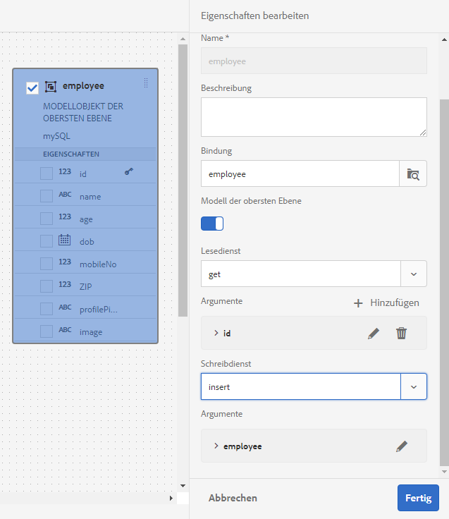

   Für die Mitarbeiterdatenquelle konfigurierte Lese- und Schreibdienste

1. Tippen Sie auf , um das read-Dienst-Argument an [an ein User Profil-Attribut, ein Anforderungsattribut oder einen Literalwert](#bindargument) zu binden, und geben Sie den Bindungswert an.
1. Tippen Sie auf **[!UICONTROL Fertig]**, um das Argument zu speichern, dann auf **[!UICONTROL Fertig]**, um die Eigenschaften zu speichern, und schließlich auf **[!UICONTROL Speichern]**, um das Formulardatenmodell zu speichern.

### Argumente für den Bind Read-Dienst {#bindargument}

Bind Read-Dienstargument an ein User Profil-Attribut, ein Request-Attribut oder einen Literalwert basierend auf einem Bindungswert. Der Wert wird als Argument an den Dienst übergeben, um Details abzurufen, die mit dem angegebenen Wert aus der Datenquelle verknüpft sind.

#### Literalwert {#literal-value}

Wählen Sie **[!UICONTROL Literal]** aus dem Dropdownmenü **[!UICONTROL Bindung an]** und geben Sie einen Wert in das Feld **[!UICONTROL Bindungswert]** ein. Die mit dem Wert verknüpften Details werden aus der Datenquelle abgerufen. Verwenden Sie diese Option, um Details abzurufen, die mit einem statischen Wert verknüpft sind.

In diesem Beispiel werden die mit **4367655678** als Wert für das `mobilenum`-Argument verknüpften Details aus der Datenquelle abgerufen. Die zugehörigen Details, wenn Sie den Wert für ein Mobiltelefonargument übergeben, können Eigenschaften wie Kundenname, Kundenadresse und Ort enthalten.

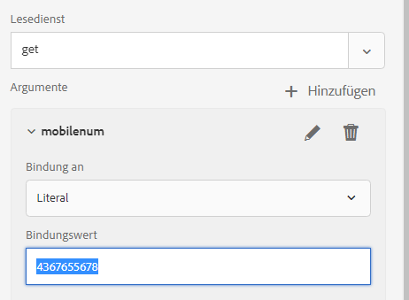

#### Benutzerprofilattribut {#user-profile-attribute}

Wählen Sie **[!UICONTROL Benutzerattribut]** aus dem Dropdown-Menü **[!UICONTROL Bindung an]** und geben Sie den Attributnamen in das Feld **[!UICONTROL Bindungswert]** ein. Die Details des Benutzers, der bei der AEM Instanz angemeldet ist, werden aus der Datenquelle anhand des Attributnamens abgerufen.

Der im Feld **[!UICONTROL Bindungswert]** angegebene Attributname muss den vollständigen Bindungspfad bis zum Attributnamen des Benutzers enthalten. Öffnen Sie die folgende URL, um auf die Benutzerdetails in CRXDE zuzugreifen:

`https://[server-name]:[port]/crx/de/index.jsp#/home/users/`

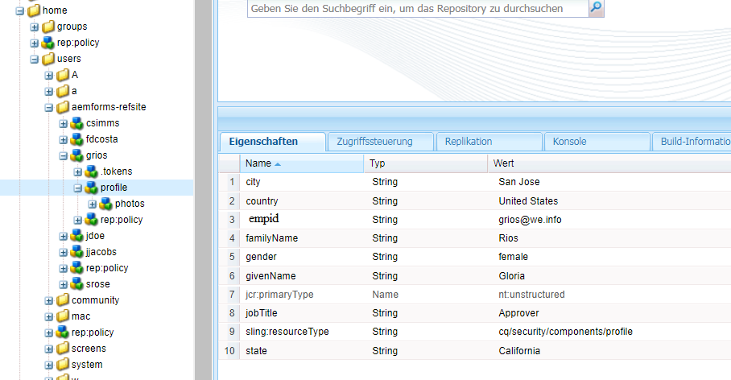

Geben Sie in diesem Beispiel `profile.empid` im Feld **[!UICONTROL Bindungswert]** für den `grios`-Benutzer an.

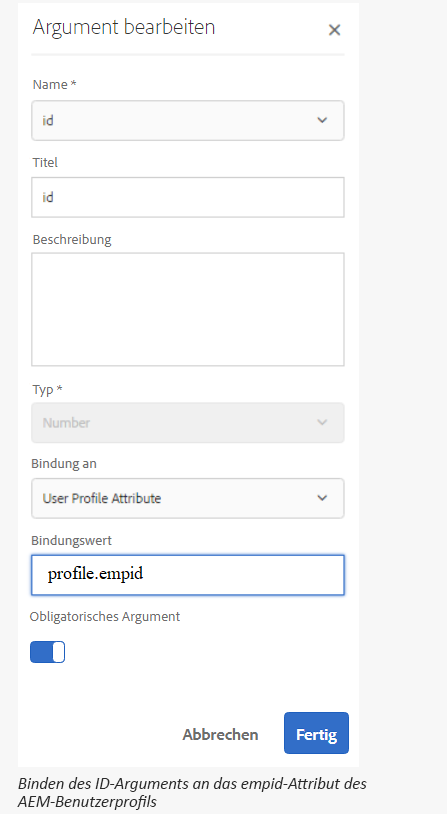

Das `id`-Argument nimmt den Wert des `empid`-Attributs des user-Profils und übergibt ihn als Argument an den Read-Dienst. Es liest und gibt Werte der zugehörigen Eigenschaften aus dem employee-Datenmodellobjekt für das `empid` zurück, das dem angemeldeten Benutzer zugeordnet ist.

#### Anfrage-Attribut {#request-attribute}

Verwenden Sie das Anforderungsattribut, um die zugehörigen Eigenschaften aus der Datenquelle abzurufen.

1. Wählen Sie **[!UICONTROL Attribut anfordern]** aus dem Dropdownmenü **[!UICONTROL Bindung an]** und geben Sie den Attributnamen in das Feld **[!UICONTROL Bindungswert]** ein.

1. Erstellen Sie eine [Überlagerung](../../../help/sites-developing/overlays.md) für head.jsp. Um die Überlagerung zu erstellen, öffnen Sie CRX DE und kopieren Sie die Datei `https://<server-name>:<port number>/crx/de/index.jsp#/libs/fd/af/components/page2/afStaticTemplatePage/head.jsp` in `https://<server-name>:<port number>/crx/de/index.jsp#/apps/fd/af/components/page2/afStaticTemplatePage/head.jsp`

   >[!NOTE]
   >
   > * Wenn Sie eine statische Vorlage verwenden, überlagern Sie head.jsp unter:
      >   `/libs/fd/af/components/page2/afStaticTemplatePage/head.jsp`
   > * Wenn Sie eine bearbeitbare Vorlage verwenden, überlagern Sie die Datei aftemplatedpage.jsp unter:
      >   `/libs/fd/af/components/page2/aftemplatedpage/aftemplatedpage.jsp`


1. Legen Sie [!DNL paramMap] für das Anforderungsattribut fest. Fügen Sie beispielsweise den folgenden Code in die JSP-Datei im Apps-Ordner ein:

   ```javascript
   <%Map paraMap = new HashMap();
    paraMap.put("<request_attribute>",request.getParameter("<request_attribute>"));
    request.setAttribute("paramMap",paraMap);
   ```

   Verwenden Sie zum Beispiel den folgenden Code, um den Wert der Petid aus der Datenquelle abzurufen:


   ```javascript
   <%Map paraMap = new HashMap();
   paraMap.put("petId",request.getParameter("petId"));
   request.setAttribute("paramMap",paraMap);%>
   ```

Die Details werden basierend auf dem in der Anforderung angegebenen Attributnamen aus der Datenquelle abgerufen.

Wenn Sie beispielsweise das Attribut `petid=100` in der Anforderung angeben, werden Eigenschaften abgerufen, die mit dem Attributwert aus der Datenquelle verknüpft sind.

## Verknüpfungen hinzufügen {#add-associations}

In der Regel werden Verknüpfungen zwischen Datenmodellobjekten in einer Datenquelle erstellt. Dies können Eins-zu-Eins- oder Eins-zu-Viele-Verknüpfungen sein. So könnten mehrere Angehörige mit einem Mitarbeiter verknüpft sein. Dies wird als Eins-zu-Viele-Verknüpfung bezeichnet und in der Form `1:n` auf der Linie dargestellt, die die zugeordneten Datenmodellobjekte verbindet. Wenn jedoch eine Verknüpfung einen eindeutigen Mitarbeiternamen für eine gegebene Mitarbeiter-ID zurückgibt, wird dies als Eins-zu-Eins-Verknüpfung bezeichnet.

Wenn Sie verknüpfte Datenmodellobjekte in einer Datenquelle zu einem Formulardatenmodell hinzufügen, werden deren Verknüpfungen beibehalten und als durch Pfeilzeilen verbundene Elemente angezeigt. Sie können in einem Formulardatenmodell Verknüpfungen zwischen Datenmodellobjekten über unterschiedliche Datenquellen hinweg hinzufügen.

>[!NOTE]
>
>Vordefinierte Verknüpfungen in einer JDBC-Datenquelle werden nicht im Formulardatenmodell beibehalten. Sie müssen sie manuell erstellen.

So fügen Sie eine Verknüpfung hinzu:

1. Aktivieren Sie das Kontrollkästchen oben in einem Datenmodellobjekt, um dieses auszuwählen, und tippen Sie auf **[!UICONTROL Verknüpfung hinzufügen]**. Das Dialogfeld „Verknüpfung hinzufügen“ wird geöffnet.

   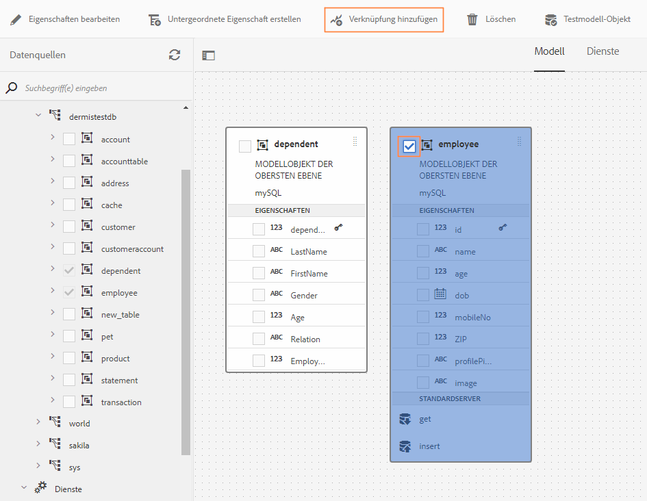

   >[!NOTE]
   >
   >Das OData-Dienst-Metadatendokument enthält außer den Datenmodellobjekten und Diensten Navigationseigenschaften, die die Verknüpfung zwischen zwei Datenmodellobjekten definieren. Sie können diese Navigationsfunktionen verwenden, wenn Sie Verknüpfungen im Formulardatenmodell hinzufügen. Weitere Informationen finden Sie unter [Arbeiten mit Navigationseigenschaften von OData-Diensten](#work-with-navigation-properties-of-odata-services).

   Das Dialogfeld „Verknüpfung hinzufügen“ wird geöffnet.

   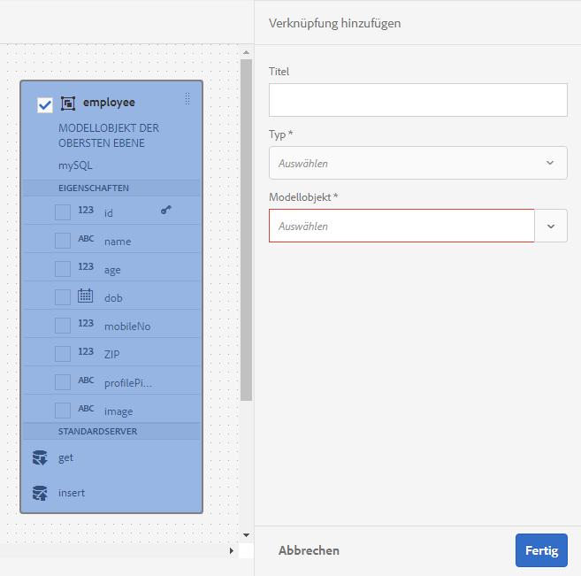

   Dialogfeld „Verknüpfung hinzufügen“

1. Im Bereich „Verknüpfung hinzufügen“:

   * Geben Sie einen Titel für die Verknüpfung an.
   * Wählen Sie den Assoziierungstyp aus — Ein zu eins oder eins zu viele.
   * Wählen Sie das Datenmodellobjekt aus, zu dem Sie die Verknüpfung erstellen möchten.
   * Wählen Sie den Lesedienst, der die Daten aus dem ausgewählten Modellobjekt lesen soll. Das Argument für den Lesedienst wird angezeigt. Bearbeiten Sie das Argument gegebenenfalls mit den nötigen Änderungen, und binden Sie es an die Eigenschaft des zu verknüpfenden Datenmodellobjekts.

   Im folgenden Beispiel ist `dependentid`das Standardargument für den Lesedienst des Datenmodellobjekts „Angehörige“.

   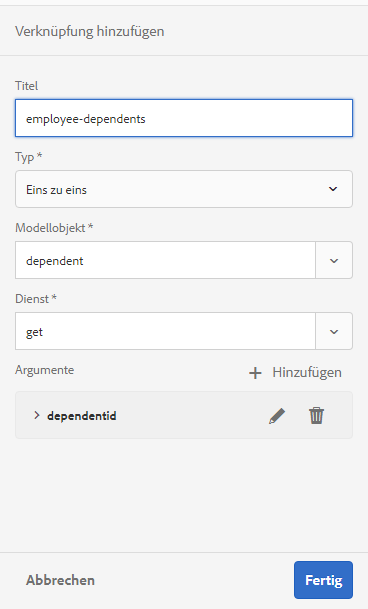

   Standardargument für den Lesedienst für „Angehörige“ ist „dependentid“

   Das Argument muss allerdings eine mit dem verknüpfenden Datenmodellobjekt gemeinsame Eigenschaft sein, in diesem Beispiel `Employeeid`. Daher muss das `Employeeid`-Argument an die `id`-Eigenschaft des Employee-Datenmodellobjekts gebunden sein, um die zugehörigen Abhängigkeitsdetails vom Datenmodellobjekt &quot;Abhängige&quot;abzurufen.

   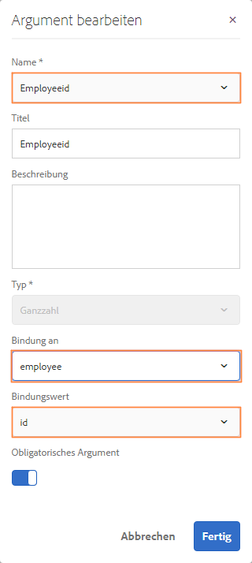

   Aktualisiertes Argument und Bindung

   Tippen Sie auf **[!UICONTROL Fertig]**, um das Argument zu speichern.

1. Tippen Sie auf **[!UICONTROL Fertig]**, um die Verknüpfung zu speichern, und dann auf **[!UICONTROL Speichern]**, um das Formulardatenmodell zu speichern.
1. Wiederholen Sie diese Schritte, um nach Bedarf weitere Verknüpfungen zu erstellen.

>[!NOTE]
>
>Die hinzugefügte Verknüpfung wird der Box für das Datenmodellobjekt mit dem angegebenen Titel und einer Linie angezeigt, die die verknüpften Datenmodellobjekte verbindet.
>
>Sie können eine Zuordnung bearbeiten, indem Sie das Kontrollkästchen dazugehörige Verbindung markieren und auf **[!UICONTROL Zuordnung bearbeiten]** tippen.

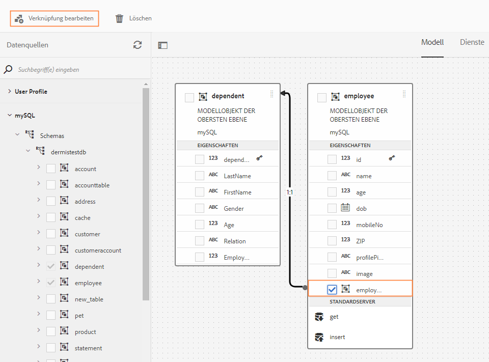

## Eigenschaften bearbeiten {#properties}

Sie können Eigenschaften von Datenmodellobjekten, Eigenschaften sowie m Formulardatenmodell hinzugefügte Dienste bearbeiten.

Eigenschaften bearbeiten

1. Aktivieren Sie im Formulardatenmodell das Kontrollkästchen neben einem Datenmodellobjekt, einer Eigenschaft oder einem Dienst.
1. Tippen Sie auf **[!UICONTROL Eigenschaften bearbeiten]**. Der Bereich **[!UICONTROL Eigenschaften bearbeiten]** für das ausgewählte Modellobjekt, die Eigenschaft oder den Dienst wird geöffnet.

   * **Datenmodellobjekt**: Geben Sie die Lese- und Schreibdienste an und bearbeiten Sie Argumente.
   * **Eigenschaft**: Geben Sie den Typ, den Untertyp und das Format für die Eigenschaft an. Sie können außerdem angeben, ob die ausgewählte Eigenschaft der Primärschlüssel für das Datenmodellobjekt ist.
   * **Dienst**: Geben Sie das Eingabemodellobjekt, den Ausgabetyp und Argumente für den Dienst an. Bei einem Get-Dienst können Sie angeben, ob ein Array als Rückgabe erwartet wird.

   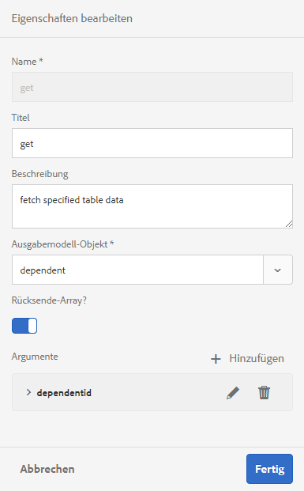

   Dialogfeld „Eigenschaften bearbeiten“ für einen Get-Dienst

1. Tippen Sie auf **[!UICONTROL Fertig]**, um die Eigenschaften zu speichern, und dann auf **[!UICONTROL Speichern]**, um das Formulardatenmodell zu speichern.

### Berechnete Eigenschaften erstellen  {#computed}

Eine berechnete Eigenschaft ist diejenige, deren Wert basierend auf einer Regel oder einem Ausdruck berechnet wird. Mithilfe einer Regel können Sie den Wert einer berechneten Eigenschaft auf eine Literalzeichenfolge, eine Zahl, das Ergebnis eines mathematischen Ausdrucks oder den Wert einer anderen Eigenschaft im Formulardatenmodell festlegen.

Beispielsweise können Sie eine berechnete Eigenschaft **FullName** erstellen, deren Wert ein Ergebnis der Verkettung der vorhandenen Eigenschaften **FirstName** und **LastName** ist. Gehen Sie dazu wie folgt vor:

1. Erstellen Sie eine neue Eigenschaft mit dem Namen `FullName`, dessen Datentyp String ist.
1. Aktivieren Sie **[!UICONTROL Berechnet]** und tippen Sie auf **[!UICONTROL Fertig]**, um die Eigenschaft zu erstellen.

   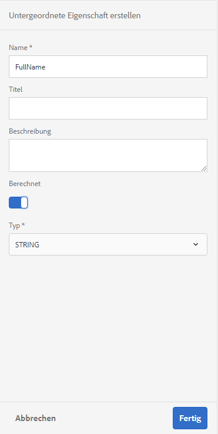

   Die berechnete FullName-Eigenschaft wird erstellt. Beachten Sie das Symbol neben der Eigenschaft, um eine berechnete Eigenschaft darzustellen.

   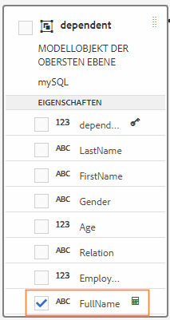

1. Wählen Sie die FullName-Eigenschaft und tippen Sie auf **[!UICONTROL Regel bearbeiten]**. Das Fenster „Regeleditor“ wird geöffnet.
1. Im Fenster des Regeleditors tippen Sie auf **[!UICONTROL Erstellen]**. Ein Regelfenster **[!UICONTROL Wert festlegen]** wird geöffnet.

   Wählen Sie in der Dropdown-Liste die **[!UICONTROL Mathematischer Ausdruck]**. Weitere verfügbare Optionen sind **[!UICONTROL Formulardatenmodellobjekt]** und **[!UICONTROL Zeichenfolge]**.

1. Wählen Sie im mathematischen Ausdruck **[!UICONTROL FirstName]** und **[!UICONTROL LastName]** im ersten bzw. zweiten Objekt aus. Wählen Sie **[!UICONTROL plus]** als Bediener.

   Tippen Sie auf **[!UICONTROL Fertig]** und dann auf **[!UICONTROL Schließen]**, um das Fenster des Regeleditors zu schließen. Die Regel sieht ähnlich der Folgenden aus:

   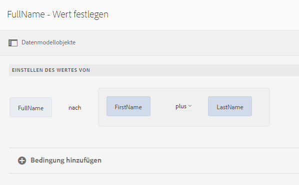

1. Tippen Sie im Formulardatenmodell auf **[!UICONTROL Speichern]**. Die berechnete Eigenschaft ist konfiguriert.

## Arbeiten mit Navigationseigenschaften von OData-Diensten  {#work-with-navigation-properties-of-odata-services}

In OData-Diensten werden Navigationseigenschaften verwendet, um Zuordnungen zwischen zwei Datenmodellobjekten zu definieren. Diese Eigenschaften werden für einen Entitätstyp oder einen komplexen Typ definiert. Beispiel: In der folgenden Extraktion aus der Metadatendatei der Musterdienste [TripPin](https://www.odata.org/blog/trippin-new-odata-v4-sample-service/) OData enthält die Entität der Person drei Navigationseigenschaften: Friends, BestFriend und Trips.

Weitere Informationen finden Sie in der [OData-Dokumentation](https://docs.oasis-open.org/odata/odata/v4.0/errata03/os/complete/part3-csdl/odata-v4.0-errata03-os-part3-csdl-complete.html#_Toc453752536).

```xml
<edmx:Edmx xmlns:edmx="https://docs.oasis-open.org/odata/ns/edmx" Version="4.0">
<script/>
<edmx:DataServices>
<Schema xmlns="https://docs.oasis-open.org/odata/ns/edm" Namespace="Microsoft.OData.Service.Sample.TrippinInMemory.Models">
<EntityType Name="Person">
<Key>
<PropertyRef Name="UserName"/>
</Key>
<Property Name="UserName" Type="Edm.String" Nullable="false"/>
<Property Name="FirstName" Type="Edm.String" Nullable="false"/>
<Property Name="LastName" Type="Edm.String"/>
<Property Name="MiddleName" Type="Edm.String"/>
<Property Name="Gender" Type="Microsoft.OData.Service.Sample.TrippinInMemory.Models.PersonGender" Nullable="false"/>
<Property Name="Age" Type="Edm.Int64"/>
<Property Name="Emails" Type="Collection(Edm.String)"/>
<Property Name="AddressInfo" Type="Collection(Microsoft.OData.Service.Sample.TrippinInMemory.Models.Location)"/>
<Property Name="HomeAddress" Type="Microsoft.OData.Service.Sample.TrippinInMemory.Models.Location"/>
<Property Name="FavoriteFeature" Type="Microsoft.OData.Service.Sample.TrippinInMemory.Models.Feature" Nullable="false"/>
<Property Name="Features" Type="Collection(Microsoft.OData.Service.Sample.TrippinInMemory.Models.Feature)" Nullable="false"/>
<NavigationProperty Name="Friends" Type="Collection(Microsoft.OData.Service.Sample.TrippinInMemory.Models.Person)"/>
<NavigationProperty Name="BestFriend" Type="Microsoft.OData.Service.Sample.TrippinInMemory.Models.Person"/>
<NavigationProperty Name="Trips" Type="Collection(Microsoft.OData.Service.Sample.TrippinInMemory.Models.Trip)"/>
</EntityType>
```

Wenn Sie einen OData-Dienst in einem Formulardatenmodell konfigurieren, werden alle Navigationseigenschaften in einem Entitätencontainer über einen Dienst im Formulardatenmodell bereitgestellt. In diesem Beispiel des TripPin OData-Dienstes können die drei Navigationseigenschaften im `Person`-Entitäts-Container mit einem `GET LINK`-Dienst im Formulardatenmodell gelesen werden.

Im Folgenden wird der Dienst `GET LINK of Person /People` im Formulardatenmodell hervorgehoben, bei dem es sich um einen kombinierten Dienst für die drei Navigationseigenschaften im `Person`-Element des TripPin OData-Dienstes handelt.

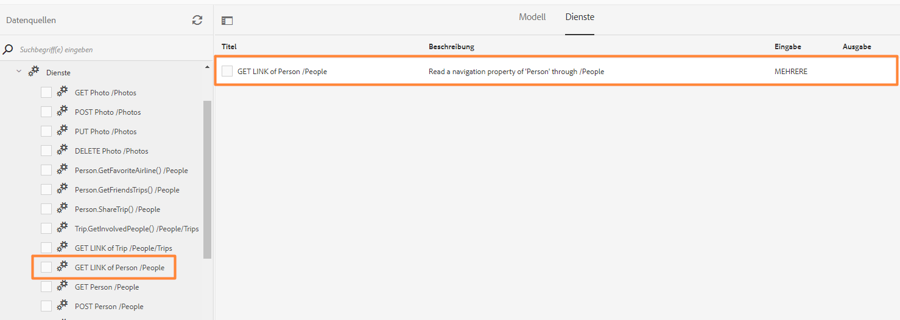

Sobald Sie den `GET LINK`-Dienst auf der Registerkarte „Dienste“ im Formulardatenmodell hinzufügen, können Sie die Eigenschaften bearbeiten, um das Modellobjekt für die Ausgabe und die im Dienst zu verwendende Navigationseigenschaft zu wählen. Beispielsweise verwendet der folgende `GET LINK of Person /People`-Dienst im folgenden Beispiel &quot;Trip&quot;als Ausgabemodellobjekt und die Navigationseigenschaft als &quot;Trips&quot;.


>[!NOTE]
>
>Die im Feld **Standardwert** des Arguments **NavigationPropertyName** verfügbaren Werte hängen vom Status des **Rückkehrarray ab?** ab. Wenn diese Funktion aktiviert ist, zeigt sie Navigationsfunktionen des Typs Sammlung an.

In diesem Beispiel können Sie auch das Ausgabemodellobjekt als &quot;Person&quot;und das Argument der Navigationseigenschaft als &quot;Freunde&quot;oder &quot;BestFriend&quot;auswählen (je nachdem, ob **Rückgaberarray?** aktiviert oder deaktiviert ist).

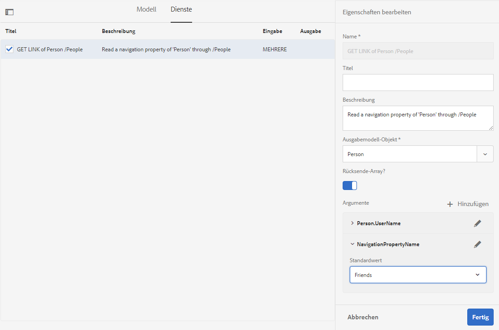

Darüber hinaus können Sie beim Hinzufügen von Verknüpfungen im Formulardatenmodell einen `GET LINK`-Dienst wählen und seine Navigationseigenschaften konfigurieren. Damit eine Navigationseigenschaft gewählt werden kann, müssen Sie jedoch darauf achten, dass im Feld **** Bindung an der Wert **Literal** eingestellt ist.

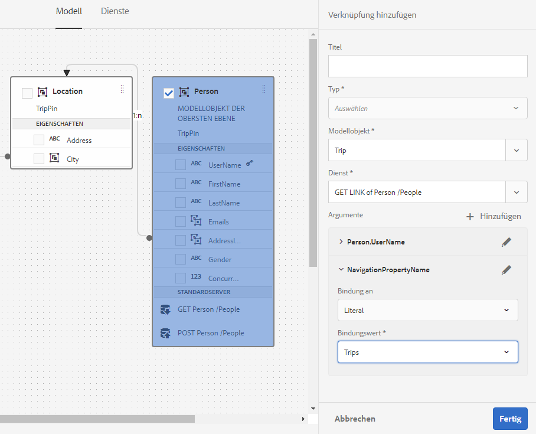

## Generieren und Bearbeiten von Beispieldaten {#sample}

Mit dem Formulardatenmodell-Editor können Sie Beispieldaten für alle Datenmodellobjekteigenschaften, einschließlich berechneter Eigenschaften, in einem Formulardatenmodell generieren. Es ist eine Gruppe von zufälligen Werten, die dem für jede Eigenschaft konfigurierten Datentyp entsprechen. Sie können auch Daten bearbeiten und speichern, die auch dann beibehalten werden, wenn Sie die Beispieldaten neu generieren.

Gehen Sie folgendermaßen vor, um Beispieldaten zu generieren und zu bearbeiten:

1. Öffnen Sie ein Formulardatenmodell und tippen Sie auf **[!UICONTROL Beispieldaten bearbeiten]**. Es werden Beispieldaten im Fenster „Beispieldaten bearbeiten“ generiert und angezeigt.

   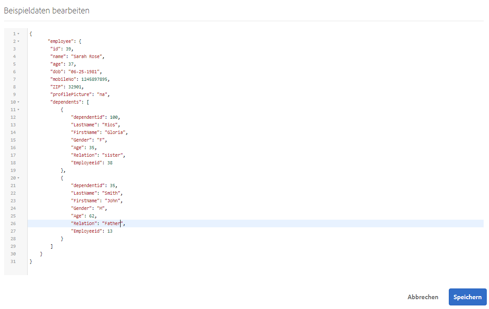

1. Bearbeiten Sie im Fenster **[!UICONTROL Beispieldaten bearbeiten]** Daten je nach Bedarf und tippen Sie auf **[!UICONTROL Speichern]**.

Als Nächstes können Sie die Beispieldaten verwenden, um interaktive Kommunikation basierend auf dem Formulardatenmodell vorabzufüllen und zu testen. Weitere Informationen finden Sie unter [Verwenden eines Formulardatenmodells](/help/forms/using/using-form-data-model.md).

## Datenmodellobjekte und Dienste testen {#test-data-model-objects-and-services}

Ihr Formulardatenmodell ist konfiguriert. Bevor Sie es verwenden, sollten Sie jedoch testen, ob die konfigurierten Datenmodellobjekte und Dienste erwartungsgemäß funktionieren. Datenmodellobjekte und Dienste testen

1. Wählen Sie ein Datenmodellobjekt oder einen Dienst im Formulardatenmodell aus und tippen Sie auf **[!UICONTROL Testmodell-Objekt]** bzw. **[!UICONTROL Test-Dienst]**.

   Das Fenster „Formulardatenmodell testen“ wird geöffnet.

   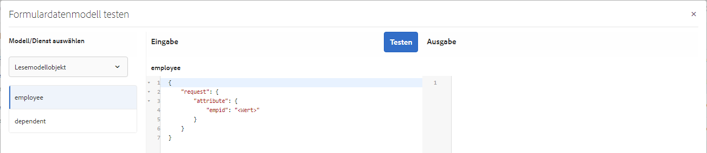

1. Wählen Sie im Fenster „Formulardatenmodell testen“ unter „Eingabe“ das zu testende Datenmodellobjekt bzw. den Dienst.

1. Geben Sie den Wert des Arguments in den Testcode ein und tippen Sie auf **[!UICONTROL Testen]**. Ist der Test erfolgreich, wird die Ausgabe im Bereich „Ausgabe“ angezeigt.

   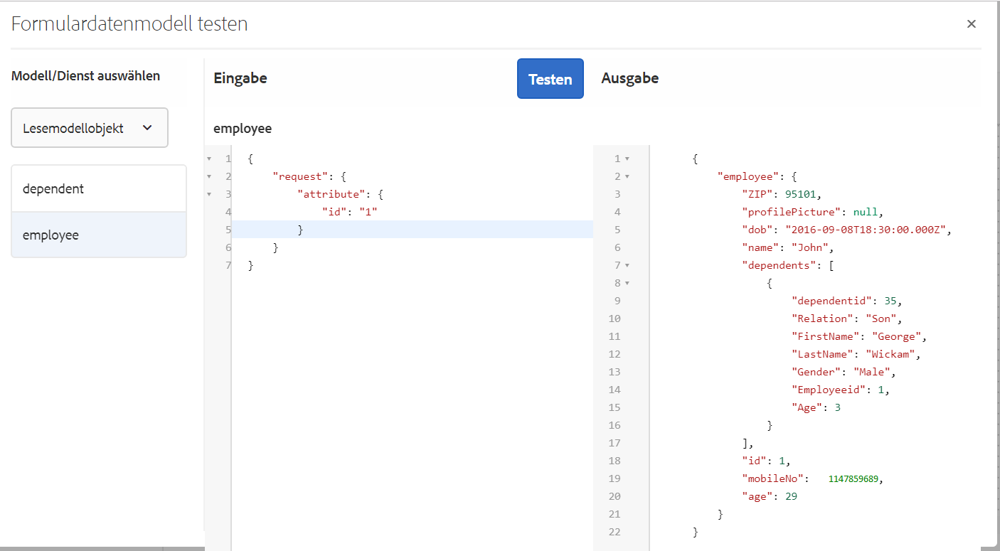

Auf ähnliche Weise können Sie andere Datenmodellobjekte und Dienste im Formulardatenmodell testen.

## Automatisierte Validierung von Eingabedaten {#automated-validation-of-input-data}

Das Formulardatenmodell validiert Daten, die beim Aufrufen der DermisBridge-API als Eingabe empfangen wurden (basierend auf den im Formulardatenmodell verfügbaren Validierungskriterien). Die Überprüfung basiert auf dem `ValidationOptions`-Flag im Abfrage-Objekt, das zum Aufrufen der API verwendet wird.

Das Flag kann auf einen der folgenden Werte eingestellt werden:

* **VOLLSTÄNDIG**: FDM führt die Überprüfung anhand aller Einschränkungen durch
* **AUS**: Keine Überprüfung
* **GRUNDLAGE**: FDM führt die Validierung anhand der Beschränkungen &quot;Erforderlich&quot;und &quot;Nullbar&quot;durch

Wenn für das `ValidationOptions`Flag kein Wert festgelegt ist, wird für die Eingabedaten eine **BASIC**-Überprüfung durchgeführt.

Das folgende Beispiel zeigt, wie Sie das ÜberprüfungsFlag auf **FULL** setzen:

```java
operationOptions.setValidationOptions(ValidationOptions.FULL);
```

>[!NOTE]
>
>Der Wert, den Sie für ein Attribut in den Eingabedaten angeben, muss mit dem Datentyp übereinstimmen, der für das Attribut im Metadaten-Dokument definiert wurde.\
>Wenn der Wert nicht mit dem für das Attribut definierten Datentyp übereinstimmt, zeigt die DermisBridge-API unabhängig vom Wert des Flags `ValidationOptions` eine Ausnahme an. Wenn die Protokollebene auf &quot;Debuggen&quot;festgelegt ist, wird ein Fehler bei der Datei **error.log** protokolliert.

Das Formulardatenmodell validiert Eingabedaten auf der Grundlage einer Liste von Datentypbeschränkungen. Die Liste von Einschränkungen für Eingabedaten kann je nach Datenquelle variieren.

In der folgenden Tabelle werden die Einschränkungen für Eingabedaten basierend auf der Datenquelle Liste:

<table>
 <tbody> 
  <tr> 
   <td>Einschränkungen</td> 
   <td>Beschreibung</td> 
   <td>Eingabedatenquelle</td> 
  </tr> 
  <tr> 
   <td>erforderlich</td> 
   <td>Wenn "true", muss der Parameter in die Eingabedaten aufgenommen werden.</td> 
   <td>Swagger, WSDL und Datenbank</td> 
  </tr> 
  <tr> 
   <td>nullable</td> 
   <td>Wenn "true", kann der Wert für den Parameter in den Eingabedaten auf Null gesetzt werden.</td> 
   <td>WSDL, Odata und Datenbank</td> 
  </tr> 
  <tr> 
   <td>maximum</td> 
   <td>Gibt die Obergrenze für numerische Werte an. Der als Obergrenze angegebene Wert kann auch dem Parameter in den Eingabedaten zugewiesen werden.</td> 
   <td>Swagger und WSDL</td> 
  </tr> 
  <tr> 
   <td>minimum</td> 
   <td>Gibt die untere Grenze für numerische Werte an. Der als Untergrenze angegebene Mindestwert kann auch dem Parameter in den Eingabedaten zugewiesen werden.</td> 
   <td>Swagger und WSDL</td> 
  </tr> 
  <tr> 
   <td>exclusiveMaximum </td> 
   <td>Gibt die Obergrenze für numerische Werte an. Der als Obergrenze angegebene Wert darf nicht dem Parameter in den Eingabedaten zugewiesen werden.</td> 
   <td>Swagger und WSDL</td> 
  </tr> 
  <tr> 
   <td>exclusiveMinimum </td> 
   <td>Gibt die untere Grenze für numerische Werte an. Der als Untergrenze angegebene Mindestwert darf dem Parameter in den Eingabedaten nicht zugewiesen werden.</td> 
   <td>Swagger und WSDL</td> 
  </tr> 
  <tr> 
   <td>minLength</td> 
   <td>Gibt die untere Grenze für die Anzahl der Zeichen in einer Zeichenfolge an. Der als Untergrenze angegebene Mindestwert kann auch dem Parameter in den Eingabedaten zugewiesen werden.</td> 
   <td>Swagger und WSDL</td> 
  </tr> 
  <tr> 
   <td>maxLength</td> 
   <td>Gibt die Obergrenze für die Anzahl der Zeichen an, die in einer Zeichenfolge enthalten sind. Der als Obergrenze angegebene Wert kann auch dem Parameter in den Eingabedaten zugewiesen werden.</td> 
   <td>Swagger, WSDL, Odata und Datenbank</td> 
  </tr> 
  <tr> 
   <td>pattern</td> 
   <td>Gibt eine feste Zeichenfolge an. Die Eingabezeichenfolge wird nur dann erfolgreich validiert, wenn die Zeichen dem angegebenen Muster entsprechen.</td> 
   <td>Swagger</td> 
  </tr> 
  <tr> 
   <td>minItems</td> 
   <td>Gibt die Mindestanzahl von Elementen in einem Array an. Der als Untergrenze angegebene Mindestwert kann auch dem Parameter in den Eingabedaten zugewiesen werden.</td> 
   <td>Swagger und WSDL</td> 
  </tr> 
  <tr> 
   <td>maxItems</td> 
   <td>Gibt die maximale Anzahl von Elementen in einem Array an. Der als Obergrenze angegebene Wert kann auch dem Parameter in den Eingabedaten zugewiesen werden.</td> 
   <td>Swagger und WSDL</td> 
  </tr> 
  <tr> 
   <td>uniqueItems</td> 
   <td>Wenn "true", müssen alle Elemente des Arrays in den Eingabedaten eindeutig sein.</td> 
   <td>Swagger</td> 
  </tr> 
  <tr> 
   <td>enum (string)<br /> <br /> </td> 
   <td>Beschränkt den Wert eines Parameters in den Eingabedaten auf einen festen Satz von Zeichenfolgenwerten. Es muss sich um ein Array mit mindestens einem Element handeln, wobei jedes Element eindeutig ist.</td> 
   <td>Swagger, WSDL und Odata</td> 
  </tr> 
  <tr> 
   <td>enum (number)<br /> <br /> </td> 
   <td>Beschränkt den Wert eines Parameters in den Eingabedaten auf einen festen Satz numerischer Werte. Es muss sich um ein Array mit mindestens einem Element handeln, wobei jedes Element eindeutig ist.</td> 
   <td>WSDL</td> 
  </tr> 
 </tbody> 
</table>

In diesem Beispiel werden die Eingabedaten anhand der in der Swagger-Datei definierten Beschränkungen &quot;maximum&quot;, &quot;minimum&quot;und &quot;required&quot;validiert. Die Eingabedaten erfüllen die Validierungskriterien nur, wenn die Bestell-ID vorhanden ist und ihr Wert zwischen 1 und 10 liegt.

```json
   parameters: [
   {
   name: "orderId",
   in: "path",
   description: "ID of pet that needs to be fetched",
   required: true,
   type: "integer",
   maximum: 10,
   minimum: 1,
   format: "int64"
   }
   ]
```

Eine Ausnahme wird angezeigt, wenn die Eingabedaten die Überprüfungskriterien nicht erfüllen. Wenn die Protokollebene auf **Debuggen** eingestellt ist, wird ein Fehler in der Datei **error.log** protokolliert. Beispiel:

```verilog
21.01.2019 17:26:37.411 *ERROR* com.adobe.aem.dermis.core.validation.JsonSchemaValidator {"errorCode":"AEM-FDM-001-044","errorMessage":"Input validations failed during operation execution.","violations":{"/orderId":["numeric instance is greater than the required maximum (maximum: 10, found: 16)"]}}
```

## Nächste Schritte {#next-steps}

Sie haben ein funktionierendes Formulardatenmodell, das jetzt für die Verwendung in adaptiven Formularen und interaktiven Kommunikationsworkflows bereit ist. Weitere Informationen finden Sie unter [Verwenden eines Formulardatenmodells](/help/forms/using/using-form-data-model.md).
