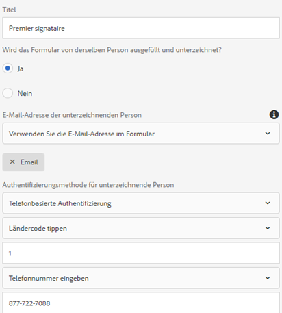
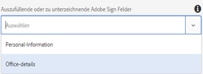

# Verwenden von [!DNL Adobe Sign] in einem adaptiven Formular{#using-adobe-sign-in-an-adaptive-form}

[!DNL Adobe Sign] aktiviert Workflows für adaptive Formulare. E-Signaturen verbessern die Workflows bei der Verarbeitung von Dokumenten in den Bereichen Recht, Vertrieb, Gehaltsabrechnung, Personalverwaltung u. a.

In einem typischen Szenario mit [!DNL Adobe Sign] und adaptiven Formularen füllt ein Benutzer ein adaptives Formular aus, um einen Dienst zu beantragen. Beispielsweise sind für einen Hypotheken- und oder Kreditkartenantrag rechtskräftige Signaturen von allen Kreditnehmern und Mitantragstellern erforderlich. Um elektronische Workflows für ähnliche Szenarien zu aktivieren, können Sie [!DNL Adobe Sign] mit AEM [!DNL Forms] integrieren. Ein paar weitere Beispiele sind die folgenden:[!DNL Adobe Sign]

* Geschäftsabschlüsse von jedem Gerät aus mit vollautomatischen Prozessen für Vorschlag, Angebot und Vertrag.
* Schnelleres Abschließen von Prozessen im Personalwesen und Zugang zu digitalen Abläufen für Ihre Mitarbeiter.
* Kürzere Vertragszyklen und schnelleres Onboarding Ihrer Lieferanten.
* Erstellen digitaler Workflows zur Automatisierung häufig verwendeter Prozesse.

[!DNL Adobe Sign] Integration mit AEM  [!DNL Forms] unterstützt:

* Workflows für Signaturen eines einzelnen oder mehrerer Benutzer
* Workflows mit sequenzieller und simultaner Signatur
* Abläufe für Signaturen innerhalb und außerhalb des Formulars
* Signieren von Formularen als anonymer oder angemeldeter Benutzer
* Dynamische Signaturprozesse (Integration mit AEM [!DNL Forms]-Workflow)
* Authentifizierung über eine Wissensdatenbank, ein Telefon und soziale Profile

Erfahren Sie mehr über die bewährten Vorgehensweisen bei der Verwendung von Adobe Sign mit adaptiven Formularen](https://medium.com/adobetech/using-adobe-sign-to-e-sign-an-adaptive-form-heres-the-best-way-to-do-it-dc3e15f9b684), um bessere Unterschriftserfahrungen zu erstellen.[

## Voraussetzungen {#prerequisites}

Bevor Sie [!DNL Adobe Sign] in einem adaptiven Formular verwenden:

* Stellen Sie sicher, dass AEM [!DNL Forms] Cloud-Dienst für die Verwendung von [!DNL Adobe Sign] konfiguriert ist. Weitere Informationen finden Sie unter [Integrieren von Adobe Sign mit AEM Forms](../../forms/using/adobe-sign-integration-adaptive-forms.md).
* Halten Sie die Liste der Unterzeichner bereit. Sie benötigen mindestens eine E-Mail-Adresse für jeden Unterzeichner.

## [!DNL Adobe Sign] für ein adaptives Formular {#configure-adobe-sign-for-an-adaptive-form} konfigurieren

Führen Sie die folgenden Schritte aus, um [!DNL Adobe Sign] für ein adaptives Formular zu konfigurieren:

1. [Eigenschaften von adaptiven Formularen für Adoben bearbeiten](../../forms/using/working-with-adobe-sign.md#enableadobesign)
1. [Adobe Sign-Felder zu adaptivem Formular hinzufügen](../../forms/using/working-with-adobe-sign.md#addadobesignfieldstoanadaptiveform)
1. [Adobe Sign für adaptives Formular aktivieren](../../forms/using/working-with-adobe-sign.md#enableadobsignforanadaptiveform)
1. [Cloud-Service von Adobe Sign für adaptives Formular wählen](../../forms/using/working-with-adobe-sign.md#selectadobesigncloudserviceforanadaptiveform)

1. [Adobe Sign-Unterzeichner zu adaptivem Formular hinzufügen](../../forms/using/working-with-adobe-sign.md#addsignerstoanadaptiveform)
1. [Senden-Aktion für adaptives Formular wählen](../../forms/using/working-with-adobe-sign.md#selectsubmitactionforanadaptiveform)

### Bearbeiten Sie die Eigenschaften adaptiver Formulare für [!DNL Adobe Sign] {#enableadobesign}

Konfigurieren Sie die Eigenschaften adaptiver Formulare für [!DNL Adobe Sign] für ein vorhandenes oder ein neues adaptives Formular.

[Erstellen eines adaptiven Formulars für Adobe ](../../forms/using/working-with-adobe-sign.md#create-an-adaptive-form-for-adobe-sign) Signature beschreibt die Schritte zum Erstellen eines grundlegenden adaptiven Formulars. Weitere Optionen, die beim Erstellen eines adaptiven Formulars verfügbar sind, finden Sie unter [Erstellen eines adaptiven Formulars](../../forms/using/creating-adaptive-form.md).

#### Erstellen eines adaptiven Formulars für [!DNL Adobe Sign] {#create-an-adaptive-form-for-adobe-sign}

Führen Sie die folgenden Schritte aus, um ein signaturfähiges adaptives Formular zu erstellen:

1. Navigieren Sie zu **[!UICONTROL Adobe Experience Manager]** > **[!UICONTROL Forms]** > **[!UICONTROL Forms und Dokumente]**.
1. Tippen Sie auf **[!UICONTROL Erstellen]** und wählen Sie **[!UICONTROL Adaptives Formular]**. Eine Liste von Vorlagen wird angezeigt. Wählen Sie die Vorlage aus und tippen Sie auf **[!UICONTROL Weiter]**.
1. Auf der Registerkarte **[!UICONTROL Basic]**:

   1. Geben Sie für das adaptive Formular **[!UICONTROL Name]** und **[!UICONTROL Titel]** an.

   1. Wählen Sie den [Configuration Container](../../forms/using/adobe-sign-integration-adaptive-forms.md#configure-adobe-sign-with-aem-forms) aus, der beim Konfigurieren von [!DNL Adobe Sign] mit AEM [!DNL Forms] erstellt wurde.

      >[!NOTE]
      >
      >Die Dropdown-Liste **[!UICONTROL Adobe Sign Cloud Service]** zeigt die Cloud-Services an, die im Container Konfiguration konfiguriert sind, den Sie in diesem Feld auswählen. Die Dropdown-Liste **[!UICONTROL Adobe Sign Cloud Service]** steht im Abschnitt **[!UICONTROL Elektronische Signatur]** der Eigenschaften des adaptiven Formulars zur Verfügung, wenn Sie die Option **[!UICONTROL Adobe Sign aktivieren]** auswählen.

1. Wählen Sie auf der Registerkarte **[!UICONTROL Formularmodell]** eine der folgenden Optionen:

   * Wählen Sie die Option **[!UICONTROL Formularvorlage als Dokument der Datensatzvorlage]** zuordnen und wählen Sie ein Dokument der Datensatzvorlage aus. Wenn Sie ein auf einer Formularvorlage basierendes adaptives Formular verwenden, werden nur die Dokumente, die zum Unterschreiben gesendet werden, angezeigt, die auf der zugehörigen Formularvorlage basieren. Es werden nicht alle Felder des adaptiven Formulars angezeigt.

   * Wählen Sie die Option **[!UICONTROL Dokument aus Datensatz erzeugen]**. Wenn Sie ein adaptives Formular mit aktivierter Option &quot;Dokument aus Datensatz&quot;verwenden, zeigt das zum Unterschreiben gesendete Dokument alle Felder des adaptiven Formulars an.

1. Tippen Sie auf **[!UICONTROL Erstellen.]** Es wird ein adaptives Formular mit aktiviertem Zeichen erstellt, das zum Hinzufügen von  [!DNL Adobe Sign] Feldern verwendet werden kann.

#### Bearbeiten eines adaptiven Formulars für [!DNL Adobe Sign] {#editafsign}

Führen Sie die folgenden Schritte aus, um [!DNL Adobe Sign] in einem vorhandenen adaptiven Formular zu verwenden:

1. Navigieren Sie zu **[!UICONTROL Adobe Experience Manager]** > **[!UICONTROL Forms]** > **[!UICONTROL Forms und Dokumente]**.
1. Wählen Sie das adaptive Formular aus und tippen Sie auf **[!UICONTROL Eigenschaften]**.
1. Wählen Sie auf der Registerkarte **[!UICONTROL Basic]** den [Configuration Container](../../forms/using/adobe-sign-integration-adaptive-forms.md#configure-adobe-sign-with-aem-forms) aus, der beim Konfigurieren von [!DNL Adobe Sign] mit AEM [!DNL Forms] erstellt wurde.
1. Wählen Sie auf der Registerkarte **[!UICONTROL Formularmodell]** eine der folgenden Optionen:

   * Wählen Sie die Option **[!UICONTROL Formularvorlage als Dokument der Datensatzvorlage]** zuordnen und wählen Sie ein Dokument der Datensatzvorlage aus. Wenn Sie ein auf einer Formularvorlage basierendes adaptives Formular verwenden, werden nur die Dokumente, die zum Unterschreiben gesendet werden, angezeigt, die auf der zugehörigen Formularvorlage basieren. Es werden nicht alle Felder des adaptiven Formulars angezeigt.

   * Wählen Sie die Option **[!UICONTROL Dokument aus Datensatz erzeugen]**. Wenn Sie ein adaptives Formular mit aktivierter Option &quot;Dokument aus Datensatz&quot;verwenden, zeigt das zum Unterschreiben gesendete Dokument alle Felder des adaptiven Formulars an.

1. Tippen Sie auf **[!UICONTROL Speichern und Schließen]**. Das adaptive Formular ist für [!DNL Adobe Sign] aktiviert.

### Adobe Sign-Felder zu adaptivem Formular hinzufügen {#addadobesignfieldstoanadaptiveform}

[!DNL Adobe Sign] verfügt über verschiedene Felder, die in einem adaptiven Formular platziert werden können. In diese Felder können verschiedene Datentypen wie Signaturen, Initialen, Firma oder Titel eingegeben. Sie helfen dabei, beim Unterschreiben zusätzliche Informationen zusammen mit den Signaturen zu erfassen. Mit der Komponente [!DNL Adobe Sign] Block können Sie Felder an verschiedenen Stellen in einem adaptiven Formular platzieren.[!DNL Adobe Sign]

Gehen Sie wie folgt vor, um einem adaptiven Formular Felder hinzuzufügen und eine Reihe von Optionen für diese Felder anzupassen:

1. Ziehen Sie die Komponente **[!UICONTROL Adobe Sign Block]** aus dem Komponentenbrowser in das adaptive Formular. Die Komponente [!DNL Adobe Sign] Block verfügt über alle unterstützten Felder [!DNL Adobe Sign]. Standardmäßig wird dem adaptiven Formular ein Feld **Unterschrift** hinzugefügt.

   

   Standardmäßig ist der Block [!DNL Adobe Sign] im veröffentlichten adaptiven Formular nicht sichtbar. Er wird nur in den Signaturdokumenten angezeigt. Sie können die Sichtbarkeit von [!DNL Adobe Sign] Block von den Eigenschaften der Komponente [!DNL Adobe Sign] Block ändern.

   >[!NOTE]
   >
   >    * Die Verwendung des Blocks [!DNL Adobe Sign] ist nicht zwingend erforderlich, um [!DNL Adobe Sign] in einem adaptiven Formular zu verwenden. Wenn Sie den Unterzeichner nicht mit [!DNL Adobe Sign] blockieren und Felder hinzufügen, wird das Standardunterschriftsfeld unten in den unterschreibenden Dokumenten angezeigt.
   >    * Verwenden Sie den Block [!DNL Adobe Sign] nur für die adaptiven Formulare, die automatisch Dokument aus Datensatz generieren. Wenn Sie eine benutzerdefinierte XDP zum Generieren eines Dokuments aus Datensatz oder eines adaptiven Formulars verwenden, wird der Block [!DNL Adobe Sign] nicht unterstützt.

1. Wählen Sie die Komponente **[!UICONTROL Adobe Sign Block]** und tippen Sie auf das Symbol **Bearbeiten** . Es werden Optionen zum Hinzufügen von Feldern und zum Formatieren der Darstellung von Feldern angezeigt.

   

   **A.** Wählen Sie  [!DNL Adobe Sign] Felder aus und fügen Sie sie hinzu. **B.** Erweitern des  [!DNL Adobe Sign] Blocks auf die Ansicht im Vollbildmodus

1. Tippen Sie auf das Symbol **[!UICONTROL Adobe Sign] Feld** . Es werden Optionen zum Auswählen und Hinzufügen von [!DNL Adobe Sign]-Feldern angezeigt.

   Erweitern Sie das Dropdown-Feld **[!UICONTROL Typ]**, um ein [!DNL Adobe Sign]-Feld auszuwählen, und tippen Sie auf das Symbol Fertig , um das ausgewählte Feld dem Block [!DNL Adobe Sign] hinzuzufügen. Die Dropdown-Liste **[!UICONTROL Typ]** enthält die Feldtypen Signatur, Signiererinformationen und Daten. [!DNL Adobe Sign] Integration mit AEM  [!DNL Forms] Unterstützungsfeldern, die nur im Feld   Typedrop-down aufgeführt sind. Detaillierte Informationen zu den Feldern finden Sie unter [Adobe Sign-Dokumentation](https://helpx.adobe.com/sign/help/field-types.html).[!DNL Adobe Sign]

   

   Es ist obligatorisch, einen eindeutigen Namen für ein Feld anzugeben. Sie können auch die Option „Erforderlich“ aktivieren, um ein Feld als Pflichtfeld zu markieren. Zusätzlich zu den Optionen **[!UICONTROL Name]** und **[!UICONTROL Erforderlich]** verfügen einige [!DNL Adobe Sign]-Felder über weitere Optionen. Dies kann z. B. Maske oder mehrzeilig sein. Geben Sie außerdem für jedes [!DNL Adobe Sign]-Feld einen eindeutigen Namen ein, unabhängig davon, ob sich die Felder in denselben oder unterschiedlichen [!DNL Adobe Sign]-Blöcken befinden.

   Wenn Sie in der Dropdown-Liste **[!UICONTROL Digitale Signatur]** auswählen, können Sie digitale Signaturen auf das adaptive Formular anwenden:

   * Online mit Cloud-Signaturen, um sich mit einer [digitalen ID](https://helpx.adobe.com/sign/kb/digital-certificate-providers.html) zu signieren, die von einem Trust-Dienstleister gehostet wird.
   * Lokal durch Herunterladen des Dokuments mit Adobe Acrobat oder Reader mit einer Chipkarte, einem USB-Token oder einer dateibasierten digitalen ID.

### [!DNL Adobe Sign] für ein adaptives Formular {#enableadobsignforanadaptiveform} aktivieren

Standardmäßig ist [!DNL Adobe Sign] für ein adaptives Formular nicht aktiviert. Gehen Sie wie folgt vor, um es zu aktivieren:

1. Tippen Sie im Inhaltsbrowser auf **[!UICONTROL Form Container]** und dann auf das Symbol **[!UICONTROL Konfigurieren]** . Dadurch wird der Eigenschaftenbrowser geöffnet und zeigt Eigenschaften des Containers für adaptive Formulare an.
1. Erweitern Sie im Eigenschaftenbrowser das Akkordeon **[!UICONTROL Elektronische Signatur]** und wählen Sie die Option **[!UICONTROL Adobe Sign aktivieren]**. Es aktiviert [!DNL Adobe Sign] für ein adaptives Formular.

### Wählen Sie [!DNL Adobe Sign] Cloud Service und Unterschriftsreihenfolge {#selectadobesigncloudserviceforanadaptiveform}

Sie können mehrere [!DNL Adobe Sign]-Dienste für eine Instanz von AEM [!DNL Forms] konfigurieren. Es wird empfohlen, für jede Funktion (Human Resource, Finance, etc.) einen eigenen Satz von Diensten bereitzustellen. Dadurch wird die Verfolgung und der Berichte von signierten Dokumenten erleichtert. Eine Bank hat beispielsweise mehrere Abteilungen. In diesem Fall können Sie für jede Abteilung eine eigene Konfiguration einrichten, damit die Dokumente leichter zu verfolgen sind.

Ein Dokument kann auch mehrere Unterzeichner haben. Beispielsweise kann ein Kreditkartenantrag mehrere Antragsteller haben. Die Bank benötigt die Unterschriften aller Antragsteller, bevor sie mit der Bearbeitung beginnt. Bei Szenarien mit mehreren Unterzeichnern können Sie wählen, ob diese das Dokument nacheinander oder simultan unterschreiben sollen.

Führen Sie die folgenden Schritte aus, um einen Cloud-Service und die Reihenfolge für die Unterzeichnung zu wählen:

1. Tippen Sie im Inhaltsbrowser auf **[!UICONTROL Form Container]** und dann auf das Symbol **[!UICONTROL Konfigurieren]** . Dadurch wird der Eigenschaftenbrowser geöffnet und zeigt Eigenschaften des Containers für adaptive Formulare an.
1. Erweitern Sie im Eigenschaftenbrowser das Akkordeon **[!UICONTROL Elektronische Signatur]** und wählen Sie die Option **[!UICONTROL Adobe Sign aktivieren]**. Es aktiviert [!DNL Adobe Sign] für ein adaptives Formular.
1. Wählen Sie einen Cloud-Dienst aus der bereits konfigurierten Liste von [!DNL Adobe Sign]-Cloud Services.

   Wenn die Liste **[!UICONTROL Adobe Sign Cloud Service]** leer ist, befolgen Sie den Artikel [Adobe Sign mit AEM Forms konfigurieren](../../forms/using/adobe-sign-integration-adaptive-forms.md), um den Dienst zu konfigurieren.

   Die Dropdown-Liste Liste die Cloud-Dienste, die im Ordner `global` unter Tools > **[!UICONTROL Cloud Services]** > **[!UICONTROL Adobe Sign]** vorhanden sind. Darüber hinaus werden in der Dropdown-Liste auch die Cloud-Dienste Liste, die in dem Ordner vorhanden sind, den Sie beim Erstellen eines adaptiven Formulars im Feld **[!UICONTROL Configuration Container]** auswählen.

1. Wählen Sie die Signaturreihenfolge im Dialogfeld **[!UICONTROL Benutzer können signieren]**. [!DNL Adobe Sign] Sänger können ein adaptives Formular  **[!UICONTROL nacheinander]**  oder  **[!UICONTROL gleichzeitig]**  in beliebiger Reihenfolge signieren.

   Bei sequenzieller Reihenfolge erhält jeder Unterzeichner das Formular einzeln. Nachdem ein Unterzeichner das Dokument signiert hat, wird das Formular an den nächsten Unterzeichner gesendet und so weiter.

   Bei simultaner Reihenfolge können mehrere Unterzeichner ein Formular gleichzeitig signieren.

1. [hinzufügen Sie Unterzeichner zu einem adaptiven ](../../forms/using/working-with-adobe-sign.md#addsignerstoanadaptiveform) Formular und tippen Sie auf Fertig   saveicon, um die Änderungen zu speichern.

### Unterzeichner zu adaptivem Formular hinzufügen {#addsignerstoanadaptiveform}

Sie können für ein adaptives Formular nur einen oder mehrere Unterzeichner festlegen. Wenn Sie einen Unterzeichner hinzufügen, können Sie außerdem Authentifizierungsdetails für den Unterzeichner konfigurieren. Sie können auch wählen, ob die Person, die das Formular ausfüllt, zugleich der Unterzeichner sein muss. Führen Sie die folgenden Schritte durch, um einen Unterzeichner hinzuzufügen und seine Details anzugeben:

1. Tippen Sie im Inhaltsbrowser auf **[!UICONTROL Form Container]** und dann auf das Symbol **[!UICONTROL Konfigurieren]** . Dadurch wird der Eigenschaftenbrowser geöffnet und zeigt Eigenschaften des Containers für adaptive Formulare an.
1. Erweitern Sie im Eigenschaftenbrowser das Akkordeon **[!UICONTROL Elektronische Signatur]** und wählen Sie die Option **[!UICONTROL Adobe Sign aktivieren]**. Es aktiviert [!DNL Adobe Sign] für ein adaptives Formular.
1. Tippen Sie auf **[!UICONTROL Unterscheibende Person hinzufügen]** unter **[!UICONTROL Signiererkonfiguration]**. Es wird ein Unterzeichner zum adaptiven Formular hinzugefügt. Sie können mehrere [!DNL Adobe Sign]-Unterzeichner zu einem adaptiven Formular hinzufügen.
   

1. Klicken Sie auf das Symbol **Bearbeiten** , um die folgenden Informationen zum Unterzeichner anzugeben:

   * **[!UICONTROL Titel]:** Geben Sie einen Titel ein, um einen Unterzeichner eindeutig zu identifizieren.

   * **[!UICONTROL Sind der Unterzeichner und die Person, die das Formular ausfüllt, identisch?]:** Wählen Sie  **Ja**, wenn Formularbenutzer und erster Unterzeichner dieselbe Person sind. Wenn für die Option **Nein** eingestellt ist, können Sie die Komponente für den Signaturschritt nicht im adaptiven Formular verwenden. Wenn das Formular eine Unterschriftsschritt-Komponente enthält, wird das Feld automatisch auf Ja eingestellt.

   * **[!UICONTROL E-Mail-Adresse] des Unterzeichners:** Geben Sie die E-Mail-Adresse des Unterzeichners an. Der Unterzeichner erhält die zu unterschreibenden Dokumente/das Formular unter der angegebenen E-Mail-Adresse. Sie können eine E-Mail-Adresse verwenden, die in einem Formularfeld im AEM-Benutzerprofil des angemeldeten Benutzers angegeben ist, oder manuell eine E-Mail-Adresse eingeben. Dieser Schritt ist obligatorisch. Vergewissern Sie sich, dass die E-Mail-Adresse des ersten Unterzeichners oder des einzigen Unterzeichners (im Falle eines einzelnen Unterzeichners) nicht mit dem [!DNL Adobe Sign]-Konto identisch ist, das zum Konfigurieren von AEM Cloud-Diensten verwendet wird.

   * **[!UICONTROL Signiererauthentifizierungsmethode]:** Geben Sie die Methode zum Authentifizieren eines Benutzers an, bevor Sie ein Formular zum Signieren öffnen. Sie können die Authentifizierung per Telefon, Wissensdatenbank und Profil in sozialem Netzwerk wählen.
   >[!NOTE]
   >
   >    * Bei der Authentifizierung über soziale Netzwerke steht standardmäßig eine Option zum Authentifizieren über Facebook, Google und LinkedIn zur Verfügung. Sie können den [!DNL Adobe Sign]-Support kontaktieren, um andere Anbieter sozialer Authentifizierung zu aktivieren.

   * **[!DNL Adobe Sign]Felder, die ausgefüllt oder signiert werden sollen:** Wählen Sie  [!DNL Adobe Sign] Felder für den Unterzeichner aus. Ein adaptives Formular kann mehrere [!DNL Adobe Sign]-Felder haben. Sie können bestimmte Felder für einen bestimmten Unterzeichner aktivieren. Im Feld werden alle verfügbaren [!DNL Adobe Sign]-Blöcke angezeigt. Wenn Sie einen Block auswählen, werden alle Felder des Blocks ausgewählt. Über das X-Symbol können Sie die Auswahl eines Feldes aufheben.

   

   Das obige Bild enthält zwei Beispiele [!DNL Adobe Sign] Blöcke: Persönliche Informationen und Bürodetails

   Tippen Sie auf das Symbol Fertig . Der Unterzeichner wird hinzugefügt und konfiguriert.

### Senden-Aktion für adaptives Formular wählen {#selectsubmitactionforanadaptiveform}

Nachdem Sie die Felder &quot;[!DNL Adobe Sign]&quot;zu einem adaptiven Formular hinzugefügt haben, aktivieren Sie &quot;[!DNL Adobe Sign]&quot;aus dem Formular-Container, wählen Sie &quot;[!DNL Adobe Sign]&quot;Cloud Service aus und fügen Sie &quot;[!DNL Adobe Sign]&quot;Unterzeichner hinzu, wählen Sie eine entsprechende Übermittlungsaktion für das adaptive Formular aus. Ausführliche Informationen zu Übermittlungsaktionen für adaptive Formulare finden Sie unter [Konfigurieren der Übermittlungsaktion](../../forms/using/configuring-submit-actions.md).

Außerdem wird ein adaptives [!DNL Adobe Sign]-aktiviertes Formular erst gesendet, nachdem alle Unterzeichner das Formular signiert haben. Teilweise signierte Formulare finden Sie im Abschnitt „Ausstehende Signatur“ im Forms-Portal. [!DNL Adobe Sign] Configuration Service führt den Abruferserver  [!DNL Adobe Sign] an  [regelmäßigen ](../../forms/using/adobe-sign-integration-adaptive-forms.md) Zwischenwerten, um den Status der Signaturen zu überprüfen. Wenn alle Unterzeichner das Formular signiert haben, wird der Dienst für die Übermittlungsaktion gestartet und das Formular übermittelt. Wenn Sie eine benutzerdefinierte Übermittlungsaktion verwenden und das Formular [!DNL Adobe Sign] verwendet, aktualisieren Sie Ihre benutzerdefinierte Übermittlungsaktion, um den Übermittlungsaktion-Dienst zu verwenden.

<!-- Remove when forms portal goes live
>[!NOTE]
>
>Data of the adaptive form is stored temporarily on Forms Portal. It is recommended to use [custom storage for Forms Portal](/help/forms/using/configuring-draft-submission-storage.md). It ensures that the PII (personally identifiable information) data is not stored on AEM servers. 
-->

Damit ist der Ablauf zur Formularunterzeichnung vollständig. Sie können das Formular in der Vorschau anzeigen, um die Signaturerfahrung zu überprüfen. Im veröffentlichten Formular werden die Felder [!DNL Adobe Sign] Blockfelder angezeigt, wenn ein Unterzeichner das Formular zum Unterschreiben per E-Mail erhält. Diese Erfahrung wird auch als Signieren außerhalb des Formulars bezeichnet. Sie können auch einen Ablauf zum Signieren innerhalb des Formulars für den ersten Unterzeichner konfigurieren. Eine detaillierte Anleitung finden Sie unter [Formularinternen Signaturvorgang erstellen](../../forms/using/working-with-adobe-sign.md#create-in-form-signing-experience).

## Konfigurieren von Cloud-Signaturen für ein adaptives Formular {#configure-cloud-signatures-for-an-adaptive-form}

Cloud-basierte digitale Signaturen oder Remote-Signaturen sind eine neue Generation digitaler Signaturen, die über Desktop, Mobilgeräte und das Web funktioniert — und die höchste Kompatibilitätsstufe und die höchste Sicherheit für die Signiererauthentifizierung erfüllen. Sie können ein adaptives Formular mit Cloud-basierten digitalen Signaturen signieren.

Nachdem Sie die Eigenschaften des adaptiven Formulars für das Zeichen der Adobe [ bearbeitet haben, führen Sie die folgenden Schritte aus, um einem adaptiven Formular ein Cloud-Signaturfeld hinzuzufügen:](../../forms/using/working-with-adobe-sign.md#enableadobesign)

1. Ziehen Sie die Komponente **[!UICONTROL Adobe Sign Block]** aus dem Komponentenbrowser in das adaptive Formular. Die Komponente [!UICONTROL Adobe Sign Block] enthält alle unterstützten Felder [!DNL Adobe Sign]. Standardmäßig wird dem adaptiven Formular ein Feld **[!UICONTROL Unterschrift]** hinzugefügt.

   

1. Wählen Sie die Komponente **[!UICONTROL Adobe Sign Block]** und tippen Sie auf das Symbol **Bearbeiten** . Es werden Optionen zum Hinzufügen von Feldern und zum Formatieren der Darstellung von Feldern angezeigt.

   

   **A.** Wählen Sie  [!DNL Adobe Sign] Felder aus und fügen Sie sie hinzu. **B.** Erweitern des  [!DNL Adobe Sign] Blocks auf die Ansicht im Vollbildmodus

1. Tippen Sie auf das Symbol **[!UICONTROL Adobe Sign Field]** . Es werden Optionen zum Auswählen und Hinzufügen von [!DNL Adobe Sign]-Feldern angezeigt.

   Erweitern Sie das Dropdown-Feld **[!UICONTROL Typ]**, um **[!UICONTROL Digitale Signatur]** auszuwählen, und tippen Sie auf das Symbol **Fertig**, um das ausgewählte Feld dem Block [!DNL Adobe Sign] hinzuzufügen.

   

   Es ist obligatorisch, einen eindeutigen Namen für ein Feld anzugeben.

   Anwenden digitaler Signaturen auf das adaptive Formular mit:

   * Cloud-Signaturen: Signieren Sie mit einer [digitalen ID](https://helpx.adobe.com/sign/kb/digital-certificate-providers.html), die von einem Trust-Dienstleister gehostet wird.
   * Adobe Acrobat oder Reader: Laden Sie das Dokument mit Adobe Acrobat oder Reader herunter und öffnen Sie es, um sich mit einer Chipkarte, einem USB-Token oder einer dateibasierten digitalen ID zu signieren.

   Nachdem Sie das Cloud-Signaturfeld zum adaptiven Formular hinzugefügt haben, führen Sie die folgenden Schritte aus, um den Konfigurationsprozess abzuschließen:

   * [Adobe Sign für adaptives Formular aktivieren](../../forms/using/working-with-adobe-sign.md#enableadobsignforanadaptiveform)
   * [Cloud-Service von Adobe Sign für adaptives Formular wählen](../../forms/using/working-with-adobe-sign.md#selectadobesigncloudserviceforanadaptiveform)
   * [Adobe Sign-Unterzeichner zu adaptivem Formular hinzufügen](../../forms/using/working-with-adobe-sign.md#addsignerstoanadaptiveform)
   * [Senden-Aktion für adaptives Formular wählen](../../forms/using/working-with-adobe-sign.md#selectsubmitactionforanadaptiveform)

## Formularinternen Signaturvorgang erstellen {#create-in-form-signing-experience}

Ein Benutzer kann ein adaptives Formular beim Ausfüllen auch signieren. Diese Erfahrung wird auch formularinternes Signieren bezeichnet. Dieser Ablauf steht nur für den ersten Unterzeichner in einer Umgebung mit mehreren Unterzeichnern zur Verfügung. Gehen Sie Führen Sie die folgenden Schritte aus, um einen Ablauf für formularinternes Signieren für ein adaptives Formular zu erstellen:

1. [Fügen Sie die Komponente für Signaturschritt hinzu und konfigurieren Sie sie](../../forms/using/working-with-adobe-sign.md#add-and-configure-the-signature-step-component).
1. [Fügen Sie die Komponente für Übersichtsschritt hinzu](../../forms/using/working-with-adobe-sign.md#configure-the-thank-you-page-or-summary-step-component).

### Komponente für Signaturschritt hinzufügen und konfigurieren {#add-and-configure-the-signature-step-component}

Mit der Komponente für Signaturschritt können Sie einen Bereich für die elektronische Unterschrift unter dem ausgefüllten Formular bereitstellen. Bei der Ausgabe des Abschnitts mit der Komponente für Signaturschritt wird eine signierbare PDF-Version des ausgefüllten Formulars angezeigt. Die Signaturschritt-Komponente nimmt die volle für das Formular verfügbare Breite ein. Wir empfehlen, keine anderen Komponenten in dem Abschnitt zu platzieren, der die Signaturschritt-Komponente enthält.

Führen Sie die folgenden Schritte aus, um die Signaturschritt-Komponente zu konfigurieren:

1. Ziehen Sie die Komponente **[!UICONTROL Unterschriftsschritt]** aus dem Komponentenbrowser in das Formular.
1. Wählen Sie die neu hinzugefügte Unterschriftsschritt-Komponente aus und tippen Sie auf das Symbol **Konfigurieren** . Dadurch wird der Eigenschaftenbrowser geöffnet und zeigt Eigenschaften des Signaturschritts an. Konfigurieren Sie die folgenden Eigenschaften:

   * **[!UICONTROL Name]**: Geben Sie den Namen der Komponente an.

   * **[!UICONTROL Titel]:** Geben Sie den eindeutigen Titel der Komponente an.
   * **[!UICONTROL Vorlagenmeldung]:** Geben Sie die Meldung an, die beim Laden der Signatur-PDF angezeigt werden soll. [!DNL Adobe Sign] Dienste benötigen etwas Zeit, um die Signatur-PDF vorzubereiten und zu laden.
   * **[!UICONTROL Signaturdienst]:** Wählen Sie die  **[!DNL Adobe Sign]** Option aus.

   * **[!UICONTROL Frühere E-Sign-Komponente verwenden:]** Wenn Sie das entsprechende adaptive Formular in [AEM Workspace](../../forms/using/introduction-html-workspace.md)[!DNL Forms] oder die AEM Forms-App verwenden oder das zugrunde liegende adaptive Formular eine ältere E-Sign-Komponente enthält, wählen Sie die Option **Legacy-E-Sign-Komponente verwenden**.

   * **[!UICONTROL Konfiguration]**: Wählen Sie eine Konfiguration ([!DNL Adobe Sign] Cloud Service) aus. Diese Dropdown-Liste ist nur verfügbar, wenn die Option **Frühere E-Sign Komponente verwenden** aktiviert ist.

   * **[!UICONTROL CSS-Klasse]**: Geben Sie die CSS-Klasse für die Komponente an.

   Tippen Sie auf das Symbol Fertig , um die Änderungen zu speichern.

   

   >[!NOTE]
   >
   > * Wenn Sie die Komponente **[!UICONTROL Unterschriftsschritt]** in das Formular ziehen und dort ablegen, wird für die Option **[!UICONTROL Wird das Formular von derselben Person ausgefüllt und unterzeichnet?]** automatisch **Ja** festgelegt. Dies ist für die Funktionsfähigkeit des Formulars erforderlich.
      >
      > 
   * Verwenden Sie die Komponente Zusammenfassungsschritt nach der Komponente Unterschriftsschritt, um ein optimales Erlebnis zu erhalten. Der Schritt &quot;Zusammenfassung&quot;sendet das Formular automatisch und sofort, nachdem Sie die Unterzeichnung eines Formulars in der Komponente &quot;Unterschriftsschritt&quot;abgeschlossen haben. Wenn Sie den Übersichtsschritt nicht verwenden, wird eine automatische Übermittlung erst nach dem Intervall ausgelöst, das mit dem [Adobe Sign Configuration Service](../../forms/using/adobe-sign-integration-adaptive-forms.md#configure-adobe-sign-scheduler-to-sync-the-signing-status) festgelegt wurde.
      > Einige bewährte Verfahren sind:
   > * Das Bedienfeld für adaptive Formulare, das den Unterschriftsschritt enthält, befindet sich immer im letzten oder zweiten Bereich eines adaptiven Formulars. Es kann nur dann der zweite letzte Bereich sein, wenn das letzte Bedienfeld den Übersichtsschritt enthält.
   > * Das Bedienfeld, das die Komponente &quot;Signature&quot;oder &quot;Summary&quot;enthält, kann keine andere Komponente enthalten.
   > * Bei adaptiven Formularen mit Unterschriftsschritt kann keine Senden-Schaltfläche verwendet werden.
   > * Die Übermittlung der adaptiven Formulare mit dem Unterschriftsschritt erfolgt über einen Hintergrunddienst oder den Übersichtsschritt. Wenn es einen konfigurierten Unterzeichner gibt, der auch das Formular ausfüllt, besteht der Vorteil bei der Verarbeitung der Übermittlung des adaptiven Formulars mit dem Übersichtsschritt darin, dass sofort ausgewertet wird, dass der Unterzeichner das Formular unterzeichnet hat und die Übermittlungsaktion aufgerufen wird. Ein Hintergrunddienst benötigt mehr Zeit, um zu prüfen, ob alle konfigurierten Unterzeichner das Formular unterzeichnet haben und die Übermittlung des adaptiven Formulars verzögert wird.
   > * Entwerfen Sie das Formular, damit Benutzer nicht von einem Bereich mit dem Schritt &quot;Unterschrift&quot;oder &quot;Zusammenfassung&quot;zurück navigieren können.

### Komponente für Danksagungsseite oder Zusammenfassungsschritt konfigurieren {#configure-the-thank-you-page-or-summary-step-component}

Die Komponente **Zusammenfassungsschritt** übermittelt automatisch das Formular, füllt die Informationen auf der angepassten Zusammenfassungsseite aus und zeigt die Zusammenfassung des übermittelten Formulars an. Sie ruft darüber hinaus die erforderlichen Informationen in der Rückgabezuordnung ab. Die Komponente Zusammenfassungsschritt nimmt die volle Breite des Formulars ein. Es wird empfohlen, keine andere Komponente im Abschnitt mit der Komponente Zusammenfassungsschritt zu verwenden.

Damit ist der Ablauf zur formularinternen Unterzeichnung vollständig. Sie können das Formular in der Vorschau anzeigen, um die Signaturerfahrung zu überprüfen.

## Häufig gestellte Fragen {#frequently-asked-questions}

**F:** Sie können ein adaptives Formular in ein anderes adaptives Formular einbetten. Kann das eingebettete adaptive Formular [!DNL Adobe Sign] aktiviert sein?
**A:**[!DNL Forms] Nein. Die Verwendung von adaptiven Formularen, in die für die Unterzeichnung ein für aktiviertes adaptives Formular eingebettet ist, wird in AEM nicht unterstützt.[!DNL Adobe Sign]

**F:** Wenn ich ein adaptives Formular mit der erweiterten Vorlage erstellen und es zur Bearbeitung öffnen möchte, wird die Fehlermeldung &quot;Elektronische Signatur oder Signaturen sind nicht korrekt konfiguriert&quot;angezeigt. angezeigt. Wie behebe ich den Fehler?
**Ans:** Adaptives Formular, das mit der erweiterten Vorlage erstellt wurde, ist für die Verwendung konfiguriert  [!DNL Adobe Sign]. Um den Fehler zu beheben, erstellen und wählen Sie eine [!DNL Adobe Sign]-Cloud-Konfiguration und konfigurieren Sie einen [!DNL Adobe Sign]-Unterzeichner für das adaptive Formular.

**F:** Kann ich  [!DNL Adobe Sign] Text-Tags in einer statischen Textkomponente eines adaptiven Formulars verwenden?
**Ans:** Ja, Sie können Text-Tags in einer Textkomponente verwenden, um einem  [!DNL Adobe Sign] Dokument aus Datensatz [(nur automatisch generiertes Dokument aus Datensatz) aktiviertes adaptives Formular ](../../forms/using/generate-document-of-record-for-non-xfa-based-adaptive-forms.md) Felder hinzuzufügen. Informationen zu den Verfahren und Regeln zum Erstellen eines Text-Tags finden Sie in der [Adobe Sign-Dokumentation](https://helpx.adobe.com/sign/using/text-tag.html_de). Beachten Sie außerdem, dass adaptive Formulare Text-Tags nur begrenzt unterstützen. Sie können die Text-Tags verwenden, um nur die von [Adobe Sign Block](../../forms/using/working-with-adobe-sign.md#configure-cloud-signatures-for-an-adaptive-form) unterstützten Felder zu erstellen.

**F:** AEM  [!DNL Forms] stellt  [!UICONTROL die Komponenten ] Adobe Sign-Blockier- und Signaturschritt bereit. Können beide zusammen in einem adaptiven Formular verwendet werden?
**Antwort:** Sie können beide Komponenten gleichzeitig in einem Formular verwenden. Beachten Sie die folgenden Empfehlungen für die Verwendung dieser Komponenten:

**Adobe Sign-Block:** Sie können die  [!UICONTROL Adobe Sign-] Blockierung verwenden, um  [!UICONTROL Adobe-] Signaturfelder an einer beliebigen Stelle im adaptiven Formular hinzuzufügen. Dies ermöglicht es auch, den Unterzeichnern bestimmte Felder zuzuweisen. Wenn ein adaptives Formular in der Vorschau angezeigt oder veröffentlicht wird, ist [!UICONTROL Adobe Sign] Block standardmäßig nicht sichtbar. Diese Blöcke werden nur in den Signaturdokumenten angezeigt. Im Signaturdokument sind nur die einem Unterzeichner zugewiesenen Felder aktiviert. [!UICONTROL Der Adobe Sign-Block für den ersten und die folgenden Unterzeichner verwendet werden.]

**Signaturschrittkomponente:** Sie können die Signaturschrittkomponente verwenden, um eine formularinterne Signaturfunktion zu erstellen. Damit kann nur der erste Unterzeichner unterschreiben, während das Formular ausgefüllt wird. Bei der Ausgabe des Abschnitts mit der Signaturschritt-Komponente wird eine signierbare PDF-Version des Formulars angezeigt. In der Regel ist dies der letzte oder der vorletzte Abschnitt, auf den die Übersichtskomponente eines Formulars folgt.

## Fehlerbehebung {#troubleshoot}

### [!DNL Adobe Sign] Vertragsfehler  {#adobe-sign-agreement-failures}

**Problem**
Wenn der  [!DNL Adobe Sign] Dienst für ein adaptives Formular konfiguriert ist, kann vom Dienst keine  [!DNL Adobe Sign] Vereinbarung für das zugrunde liegende adaptive Formular erstellt werden.

**Auflösung**

* Überprüfen Sie die Konfiguration des Adobe Sign Cloud-Dienstes](../../forms/using/adobe-sign-integration-adaptive-forms.md), der im adaptiven Formular verwendet wird.[
* Stellen Sie sicher, dass die API-Anwendung auf dem [!DNL Adobe Sign]-Server, der zum Konfigurieren des [!DNL Adobe Sign] Cloud-Dienstes verwendet wird, über die erforderlichen Berechtigungen verfügt.
* Wenn Sie mehrere [!DNL Adobe Sign] Cloud-Dienste verwenden, weisen Sie die **[!UICONTROL oAuth-URL]** aller Dienste auf denselben **[!UICONTROL Adobe Sign-Shard]**.

* Verwenden Sie separate E-Mail-Adressen, um das [!DNL Adobe Sign]-Konto und das Konto für den ersten Unterzeichner und den einzelnen Unterzeichner zu konfigurieren. Die E-Mail-Adresse des ersten Unterzeichners oder des einzigen Unterzeichners (im Fall des einzelnen Unterzeichners) kann nicht mit dem [!DNL Adobe Sign]-Konto identisch sein, das zum Konfigurieren von AEM Cloud-Diensten verwendet wird.

### AEM [!DNL Forms]-Arbeitsablauf, der für ein [!DNL Adobe Sign]-aktiviertes adaptives Formular konfiguriert wurde, Beginn nicht {#adobe-sign-aem-form-workflow-failures}

**Problem**
Wenn  [!DNL Adobe Sign] der Workflow für ein adaptives Formular konfiguriert ist, wird der mit der Option  [!DNL Forms] Workflow aufrufen konfigurierte Workflow nicht Beginn.

**Auflösung**

* Wenn Sie [!DNL Adobe Sign] ohne Unterschriftsschritt verwenden oder das Formular Unterschriften mehrerer Personen erfordert, wartet AEM [!DNL Forms]-Server auf die Planung, um zu bestätigen, dass alle Personen das Formular unterzeichnet haben. Die Planung sendet das adaptive Formular erst, nachdem der gesamte Beginn die Unterzeichnung abgeschlossen hat, und erst nach erfolgreicher Übermittlung des adaptiven Formulars. Sie können das Intervall der [Planung](adobe-sign-integration-adaptive-forms.md) verkürzen, um den Status der Formularsignierung in kurzen Zeitabständen zu überprüfen und die Formularübermittlung zu beschleunigen.

## Verwandte Artikel {#related-articles}

* [Integrieren von Adobe Sign mit AEM Forms](../../forms/using/adobe-sign-integration-adaptive-forms.md)
* [Bewährte Verfahren für die Verwendung von Adobe Sign mit adaptiven Formularen](https://medium.com/adobetech/using-adobe-sign-to-e-sign-an-adaptive-form-heres-the-best-way-to-do-it-dc3e15f9b684)
* [Verwenden von Adobe Sign mit AEM Forms (Video)](https://helpx.adobe.com/experience-manager/kt/forms/using/adobe-sign-integration-feature-video.html)
