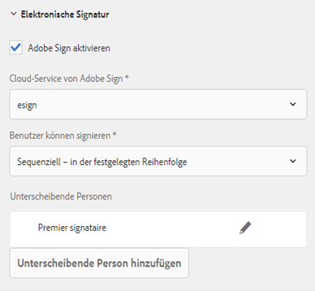

# Verwenden von [!DNL Adobe Sign] in einem adaptiven Formular{#using-adobe-sign-in-an-adaptive-form}

 Adobe empfiehlt, die modernen und erweiterbaren [Kernkomponenten](https://experienceleague.adobe.com/docs/experience-manager-core-components/using/adaptive-forms/introduction.html?lang=de) zur Datenerfassung zu verwenden, um [neue adaptive Formulare zu erstellen](/help/forms/using/create-an-adaptive-form-core-components.md) oder [adaptive Formulare zu AEM Sites-Seiten hinzuzufügen](/help/forms/using/create-or-add-an-adaptive-form-to-aem-sites-page.md). Diese Komponenten stellen einen bedeutenden Fortschritt bei der Erstellung adaptiver Formulare dar und sorgen für beeindruckende Anwendererlebnisse. In diesem Artikel wird der ältere Ansatz zum Erstellen adaptiver Formulare mithilfe von Foundation-Komponenten beschrieben. 

| Version | Artikel-Link |
| -------- | ---------------------------- |
| AEM as a Cloud Service | [Hier klicken](https://experienceleague.adobe.com/docs/experience-manager-cloud-service/content/forms/adaptive-forms-authoring/authoring-adaptive-forms-foundation-components/use-adobe-sign/working-with-adobe-sign.html?lang=de) |
| AEM 6.5 | Dieser Artikel |

[!DNL Adobe Sign] aktiviert Workflows für E-Signaturen für adaptive Formulare. E-Signaturen verbessern die Workflows bei der Verarbeitung von Dokumenten in den Bereichen Recht, Vertrieb, Gehaltsabrechnung, Personalverwaltung u. a.

In einem typischen Szenario mit [!DNL Adobe Sign] und adaptiven Formularen füllt der Benutzer ein adaptives Formular aus, um eine Dienstleistung zu beantragen. Beispielsweise sind für einen Hypotheken- und Kreditkartenantrag rechtskräftige Signaturen von allen Kreditnehmern und Mitantragstellern erforderlich. Um Workflows für elektronische Signaturen in ähnlichen Szenarien zu aktivieren, können Sie [!DNL Adobe Sign] mit AEM [!DNL Forms] integrieren. Einige weitere Anwendungsbeispiele für [!DNL Adobe Sign] sind:

* Geschäftsabschlüsse von jedem Gerät aus mit vollautomatischen Prozessen für Vorschlag, Angebot und Vertrag.
* Schnelleres Abschließen von Prozessen im Personalwesen und Zugang zu digitalen Abläufen für Ihre Mitarbeitenden.
* Kürzere Vertragszyklen und schnelleres Onboarding Ihrer Lieferanten.
* Erstellen digitaler Workflows zur Automatisierung häufig verwendeter Prozesse.

Die Integration von [!DNL Adobe Sign] in AEM [!DNL Forms] unterstützt folgende Funktionen:

* Workflows für Signaturen eines einzelnen oder mehrerer Benutzer
* Workflows mit sequenzieller und simultaner Signatur
* Formularinterne und -externe Signiererlebnisse
* Signieren von Formularen als anonymer oder angemeldeter Benutzer
* Dynamische Signaturvorgänge (Integration mit AEM [!DNL Forms]-Workflow)
* Authentifizierung über Wissensdatenbank, Telefon und Social Media-Profile

Lernen Sie die [Best Practices für die Verwendung von Adobe Sign mit adaptiven Formularen](https://medium.com/adobetech/using-adobe-sign-to-e-sign-an-adaptive-form-heres-the-best-way-to-do-it-dc3e15f9b684), um bessere Signiererlebnisse zu schaffen.

## Voraussetzungen {#prerequisites}

Stellen Sie sicher, dass folgende Voraussetzungen erfüllt sind, bevor Sie [!DNL Adobe Sign] in einem adaptiven Formular verwenden:

* Vergewissern Sie sich, dass der AEM [!DNL Forms]-Cloud-Service für die Verwendung von [!DNL Adobe Sign] konfiguriert ist. Weitere Informationen finden Sie unter [Integrieren von Adobe Sign mit AEM Forms](../../forms/using/adobe-sign-integration-adaptive-forms.md).
* Halten Sie die Liste der Unterzeichnenden bereit. Sie benötigen mindestens eine E-Mail-Adresse für jede unterzeichnende Person.

## Konfigurieren von [!DNL Adobe Sign] für adaptive Formulare {#configure-adobe-sign-for-an-adaptive-form}

Führen Sie die folgenden Schritte aus, um [!DNL Adobe Sign] für adaptive Formulare zu konfigurieren:

1. [Bearbeiten der Eigenschaften eines adaptiven Formulars für Adobe Sign](../../forms/using/working-with-adobe-sign.md#enableadobesign)
1. [Adobe Sign-Felder zu adaptivem Formular hinzufügen](../../forms/using/working-with-adobe-sign.md#addadobesignfieldstoanadaptiveform)
1. [Adobe Sign für adaptives Formular aktivieren](../../forms/using/working-with-adobe-sign.md#enableadobsignforanadaptiveform)
1. [Cloud-Service von Adobe Sign für adaptives Formular wählen](../../forms/using/working-with-adobe-sign.md#selectadobesigncloudserviceforanadaptiveform)

1. [Adobe Sign-Unterzeichner zu adaptivem Formular hinzufügen](../../forms/using/working-with-adobe-sign.md#addsignerstoanadaptiveform)
1. [Senden-Aktion für adaptives Formular wählen](../../forms/using/working-with-adobe-sign.md#selectsubmitactionforanadaptiveform)

### Bearbeiten der Eigenschaften eines adaptiven Formulars für [!DNL Adobe Sign] {#enableadobesign}

Sie können die Eigenschaften von adaptiven Formularen für [!DNL Adobe Sign] ein vorhandenes oder neues adaptives Formular konfigurieren.

[Erstellen eines adaptiven Formulars für Adobe Sign](../../forms/using/working-with-adobe-sign.md#create-an-adaptive-form-for-adobe-sign) beschreibt die Schritte zum Erstellen eines einfachen adaptiven Formulars. Siehe [Erstellen eines adaptiven Formulars](../../forms/using/creating-adaptive-form.md) für andere Optionen, die beim Erstellen eines adaptiven Formulars verfügbar sind.

#### Erstellen eines adaptiven Formulars für [!DNL Adobe Sign] {#create-an-adaptive-form-for-adobe-sign}

Führen Sie die folgenden Schritte aus, um ein signierfähiges adaptives Formular zu erstellen:

1. Gehen Sie zu **[!UICONTROL Adobe Experience Manager]** > **[!UICONTROL Formulare]** > **[!UICONTROL Formulare und Dokumente]**.
1. Wählen Sie **[!UICONTROL Erstellen]** und dann **[!UICONTROL Adaptives Formular]** aus. Eine Liste von Vorlagen wird angezeigt. Wählen Sie die Vorlage und dann **[!UICONTROL Weiter]** aus.
1. Auf der Registerkarte **[!UICONTROL Standard]**:

   1. Geben Sie den **[!UICONTROL Namen]** und **[!UICONTROL Titel]** für das adaptive Formular an.

   1. Wählen Sie den [Konfigurations-Container](../../forms/using/adobe-sign-integration-adaptive-forms.md#configure-adobe-sign-with-aem-forms) aus, der beim Konfigurieren von [!DNL Adobe Sign] mit AEM [!DNL Forms] erstellt wurde.

      >[!NOTE]
      >
      >Die Dropdown-Liste **[!UICONTROL Adobe Sign Cloud Service]** zeigt die Cloud-Services an, die in dem Konfigurations-Container konfiguriert sind, den Sie in diesem Feld auswählen. Die Dropdown-Liste **[!UICONTROL Adobe Sign Cloud Service]** ist im Abschnitt **[!UICONTROL Elektronische Signatur]** der Eigenschaften des adaptiven Formulars verfügbar, wenn Sie die Option **[!UICONTROL Adobe Sign aktivieren]** auswählen.

1. Wählen Sie auf der Registerkarte **[!UICONTROL Formularmodell]** eine der folgenden Optionen:

   * Wählen Sie die Option **[!UICONTROL Formularvorlage als Dokument aus Datensatzvorlage zuordnen]** und wählen Sie ein Dokument aus Datensatzvorlage aus. Wenn Sie ein auf einer Formularvorlage basierendes adaptives Formular verwenden, werden in den zum Signieren gesendeten Dokumenten nur die Felder aus der dazugehörigen Formularvorlage angezeigt. Es werden nicht alle Felder des adaptiven Formulars angezeigt.

   * Wählen Sie die Option **[!UICONTROL Dokument aus Datensatz generieren]**. Wenn Sie ein adaptives Formular verwenden, für das die Option „Datensatzdokument“ aktiviert ist, zeigt das zum Signieren gesendete Dokument alle Felder des adaptiven Formulars an.

1. Wählen Sie **[!UICONTROL Erstellen.]** Es wird ein signierfähiges adaptives Formular erstellt, das zum Hinzufügen von [!DNL Adobe Sign]-Feldern verwendet werden kann.

#### Bearbeiten eines adaptiven Formulars für [!DNL Adobe Sign] {#editafsign}

Führen Sie die folgenden Schritte aus, um [!DNL Adobe Sign] in einem bestehenden adaptiven Formular zu verwenden:

1. Gehen Sie zu **[!UICONTROL Adobe Experience Manager]** > **[!UICONTROL Forms]** > **[!UICONTROL Formulare und Dokumente]**.
1. Wählen Sie das adaptive Formular und **[!UICONTROL Eigenschaften]** aus.
1. Wählen Sie auf der Registerkarte **[!UICONTROL Standard]** den [Konfigurations-Container](../../forms/using/adobe-sign-integration-adaptive-forms.md#configure-adobe-sign-with-aem-forms) aus, der beim Konfigurieren von [!DNL Adobe Sign] mit AEM [!DNL Forms] erstellt wurde.
1. Wählen Sie auf der Registerkarte **[!UICONTROL Formularmodell]** eine der folgenden Optionen:

   * Wählen Sie die Option **[!UICONTROL Formularvorlage als Dokument aus Datensatzvorlage zuordnen]** und wählen Sie ein Dokument aus Datensatzvorlage aus. Wenn Sie ein auf einer Formularvorlage basierendes adaptives Formular verwenden, werden in den zum Signieren gesendeten Dokumenten nur die Felder aus der dazugehörigen Formularvorlage angezeigt. Es werden nicht alle Felder des adaptiven Formulars angezeigt.

   * Wählen Sie die Option **[!UICONTROL Dokument aus Datensatz generieren]**. Wenn Sie ein adaptives Formular verwenden, für das die Option „Datensatzdokument“ aktiviert ist, zeigt das zum Signieren gesendete Dokument alle Felder des adaptiven Formulars an.

1. Wählen Sie **[!UICONTROL Speichern und schließen]**. Das adaptive Formular ist für [!DNL Adobe Sign] aktiviert.

### Adobe Sign-Felder zu adaptivem Formular hinzufügen {#addadobesignfieldstoanadaptiveform}

[!DNL Adobe Sign] verfügt über verschiedene Felder, die in einem adaptiven Formular platziert werden können. In diese Felder können verschiedene Datentypen wie Signaturen, Initialen, Firma oder Titel eingegeben werden. Sie helfen dabei, beim Signieren zusätzliche Informationen zusammen mit den Signaturen zu erfassen. Sie können die [!DNL Adobe Sign]-Blockkomponente verwenden, um [!DNL Adobe Sign]-Felder an verschiedenen Stellen in einem adaptiven Formular zu platzieren.

Gehen Sie wie folgt vor, um einem adaptiven Formular Felder hinzuzufügen und verschiedene Optionen für diese Felder anzupassen:

1. Ziehen Sie die Komponente **[!UICONTROL Adobe Sign Block]** per Drag-and-Drop aus dem Komponenten-Browser in das adaptive Formular. Die Komponente [!DNL Adobe Sign]-Block verfügt über alle unterstützten [!DNL Adobe Sign]-Felder. Standardmäßig fügt sie dem adaptiven Formular ein **Signatur**-Feld hinzu.

   

   Standardmäßig ist der [!DNL Adobe Sign]-Block im veröffentlichten adaptiven Formular nicht sichtbar. Er wird nur in den Signaturdokumenten angezeigt. Sie können die Sichtbarkeit des [!DNL Adobe Sign]-Blocks in den Eigenschaften der [!DNL Adobe Sign]-Blockkomponente ändern.

   >[!NOTE]
   >
   >    * Die Verwendung des [!DNL Adobe Sign]-Blocks ist nicht zwingend erforderlich, um [!DNL Adobe Sign] in einem adaptiven Formular zu verwenden. Wenn Sie den [!DNL Adobe Sign]-Block nicht verwenden und Felder für die Unterzeichner hinzufügen, wird das Standardsignaturfeld unten in den Signaturdokumenten angezeigt.
   >    * Verwenden Sie den [!DNL Adobe Sign]-Block nur für adaptive Formulare, die automatisch ein Datensatzdokument generieren. Wenn Sie das Datensatzdokument mithilfe einer benutzerdefinierten XDP-Datei generieren oder ein formularvorlagenbasiertes adaptives Formular verwenden, wird der [!DNL Adobe Sign]-Block nicht unterstützt.
   >
   >

1. Wählen Sie die Komponente **[!UICONTROL Adobe Sign Block]** und das Symbol **Bearbeiten**  aus. Es werden Optionen zum Hinzufügen von Feldern und zum Formatieren der Darstellung von Feldern angezeigt.

   

   **A.** Wählen Sie [!DNL Adobe Sign]-Felder aus und fügen Sie sie hinzu. **B.** Erweitern Sie den [!DNL Adobe Sign]-Block zur Vollbildansicht.

1. Wählen Sie das Symbol für das **[!UICONTROL Adobe Sign]-Feld**  aus. Es zeigt Optionen zum Auswählen und Hinzufügen von [!DNL Adobe Sign]-Feldern an.

   Erweitern Sie das Dropdown-Feld **[!UICONTROL Typ]**, um ein [!DNL Adobe Sign]-Feld auszuwählen, und wählen Sie das Symbol „Fertig“  aus, um das ausgewählte Feld zum [!DNL Adobe Sign]-Block hinzuzufügen. Die Dropdown-Liste **[!UICONTROL Typ]** enthält die Feldtypen „Signatur“, „Unterzeichnerinformationen“ und „Daten“. Die Integration von [!DNL Adobe Sign] in AEM [!DNL Forms] unterstützt nur die in der Dropdown-Liste [!UICONTROL Typ] angegebenen Felder. Ausführliche Informationen zu [!DNL Adobe Sign]-Feldern finden Sie in der [Adobe Sign-Dokumentation](https://helpx.adobe.com/de/sign/help/field-types.html).

   

   Es ist zwingend erforderlich, einen eindeutigen Namen für ein Feld anzugeben. Sie können auch die Option „Erforderlich“ aktivieren, um ein Feld als Pflichtfeld zu markieren. Zusätzlich zu den Optionen **[!UICONTROL Name]** und **[!UICONTROL Erforderlich]** verfügen einige [!DNL Adobe Sign]-Felder über weitere Optionen. Dies kann z. B. „Maske“ oder „mit mehreren Zeilen“ sein. Geben Sie außerdem eindeutige Namen für die einzelnen [!DNL Adobe Sign]-Felder an, unabhängig davon, ob diese Felder sich im selben oder in verschiedenen [!DNL Adobe Sign]-Blöcken befinden.

   Wenn Sie in der Dropdown-Liste **[!UICONTROL Digitale Signatur]** auswählen, können Sie digitale Signaturen auf das adaptive Formular anwenden:

   * Online mit Cloud-Signaturen, um mit einer [digitalen ID](https://helpx.adobe.com/de/sign/kb/digital-certificate-providers.html) zu signieren, die von einem Trust-Dienstleister gehostet wird.
   * Lokal durch Herunterladen des Dokuments mit Adobe Acrobat oder Reader mit einer Smart Card, einem USB-Token oder einer dateibasierten digitalen ID.

### Aktivieren von [!DNL Adobe Sign] für ein adaptives Formular {#enableadobsignforanadaptiveform}

[!DNL Adobe Sign] ist standardmäßig nicht für adaptive Formulare aktiviert. Gehen Sie wie folgt vor, um es zu aktivieren:

1. Wählen Sie im Inhalts-Browser **[!UICONTROL Formular-Container]** und das Symbol **[!UICONTROL Konfigurieren]**  aus. Dadurch wird der Eigenschaftenbrowser geöffnet, der die Eigenschaften des Containers für adaptive Formulare anzeigt.
1. Erweitern Sie im Eigenschaftenbrowser das Akkordeon **[!UICONTROL Elektronische Signatur]** und wählen Sie die Option **[!UICONTROL Adobe Sign aktivieren]**. Dadurch wird [!DNL Adobe Sign] für ein adaptives Formular aktiviert.

### Auswählen von [!DNL Adobe Sign] as a Cloud Service und der Signaturreihenfolge {#selectadobesigncloudserviceforanadaptiveform}

Sie können mehrere [!DNL Adobe Sign]-Services für eine Instanz von AEM [!DNL Forms] konfigurieren. Es empfiehlt sich, für jede Funktion (Personalwesen, Finanzen usw.) eine eigene Gruppe von Services zu verwenden. Dies erleichtert das Tracking und die Berichterstellung für signierte Dokumente. So könnte beispielsweise eine Bank mehrere Abteilungen umfassen. In diesem Fall können Sie für jede Abteilung eine eigene Konfiguration einrichten, damit die Dokumente leichter zu verfolgen sind.

Ein Dokument kann auch mehrere Unterzeichnende haben. Beispielsweise können bei einem Kreditkartenantrag mehrere Antragsteller vorhanden sein. Die Bank benötigt die Unterschriften aller Antragsteller, bevor sie mit der Bearbeitung beginnt. Bei Szenarien mit mehreren Unterzeichnenden können Sie wählen, ob diese das Dokument nacheinander oder simultan unterschreiben sollen.

Führen Sie die folgenden Schritte aus, um einen Cloud-Service und die Reihenfolge für die Unterzeichnung zu wählen:

1. Wählen Sie im Inhalts-Browser **[!UICONTROL Formular-Container]** und das Symbol **[!UICONTROL Konfigurieren]**  aus. Dadurch wird der Eigenschaftenbrowser geöffnet, der die Eigenschaften des Containers für adaptive Formulare anzeigt.
1. Erweitern Sie im Eigenschaftenbrowser das Akkordeon **[!UICONTROL Elektronische Signatur]** und wählen Sie die Option **[!UICONTROL Adobe Sign aktivieren]**. Dadurch wird [!DNL Adobe Sign] für ein adaptives Formular aktiviert.
1. Wählen Sie einen Cloud-Service aus der bereits konfigurierten Liste der [!DNL Adobe Sign]-Cloud-Services aus.

   Wenn die Liste der **[!UICONTROL Adobe Sign Cloud Services]** leer ist, befolgen Sie den Artikel zum [Konfigurieren von Adobe Sign mit AEM Forms](../../forms/using/adobe-sign-integration-adaptive-forms.md), um den Dienst zu konfigurieren.

   Das Dropdown-Menü listet die Cloud-Services auf, die im Ordner `global` in Tools > **[!UICONTROL Cloud-Services]** > **[!UICONTROL Adobe Sign]** vorhanden sind. Außerdem werden in der Dropdown-Liste die Cloud-Services aufgeführt, die in dem Ordner vorhanden sind, den Sie beim Erstellen eines adaptiven Formulars im Feld **[!UICONTROL Konfigurations-Container]** auswählen.

1. Wählen Sie die Signaturreihenfolge im Dialogfeld **[!UICONTROL Unterzeichner können signieren]**. Die [!DNL Adobe Sign]-Signierer können ein adaptives Formular entweder **[!UICONTROL sequentiell]**, d. h. ein Signierer nach dem anderen, oder **[!UICONTROL gleichzeitig]** in beliebiger Reihenfolge signieren.

   In sequentieller Reihenfolge erhält jeweils nur ein Unterzeichner das Formular zum Signieren. Nachdem die erste Unterzeichnungsperson das Signieren des Dokuments abgeschlossen hat, wird das Dokument an die zweite gesendet usw.

   Bei simultaner Reihenfolge können mehrere Unterzeichnende ein Formular gleichzeitig signieren.

1. [Fügen Sie Unterzeichnende zu einem adaptiven Formular hinzu](../../forms/using/working-with-adobe-sign.md#addsignerstoanadaptiveform) und wählen Sie das Symbol „Fertig“  aus, um die Änderungen zu speichern.

### Hinzufügen von Unterzeichnenden zu einem adaptiven Formular {#addsignerstoanadaptiveform}

Sie können für ein adaptives Formular eine einzelne oder mehrere Unterzeichnungspersonen festlegen. Wenn Sie eine Unterzeichnungsperson hinzufügen, können Sie auch Authentifizierungsdetails für sie konfigurieren. Sie können weiterhin wählen, ob die Person, die das Formular ausfüllt, zugleich die Unterzeichnungsperson ist. Führen Sie die folgenden Schritte durch, um Unterzeichnende hinzuzufügen und ihre Details anzugeben:

1. Wählen Sie im Inhalts-Browser **[!UICONTROL Formular-Container]** und das Symbol **[!UICONTROL Konfigurieren]**  aus. Dadurch wird der Eigenschaftenbrowser geöffnet, der Eigenschaften des Containers für adaptive Formulare anzeigt.
1. Erweitern Sie im Eigenschaftenbrowser das Akkordeon **[!UICONTROL Elektronische Signatur]** und wählen Sie die Option **[!UICONTROL Adobe Sign aktivieren]**. Dadurch wird [!DNL Adobe Sign] für ein adaptives Formular aktiviert.
1. Wählen Sie **[!UICONTROL Unterzeichner hinzufügen]** unter **[!UICONTROL Unterzeichnerkonfiguration]** aus. Damit wird ein Signierer zu dem adaptiven Formular hinzugefügt. Sie können mehrere [!DNL Adobe Sign]-Signierer zu einem adaptiven Formular hinzufügen.
   

1. Klicken Sie auf das Symbol **Bearbeiten**  und geben Sie folgende Informationen zum Signierer ein:

   * **[!UICONTROL Titel]:** Geben Sie einen Titel an, um einen Unterzeichner eindeutig zu identifizieren.

   * **[!UICONTROL Wird das Formular von ein und derselben Person ausgefüllt und unterzeichnet?]:** Wählen Sie **Ja**, wenn die Person, die das Formular ausfüllt, mit der Person identisch ist, die es als erste unterzeichnet. Wenn für die Option **Nein** eingestellt ist, können Sie die Komponente für den Signaturschritt nicht im adaptiven Formular verwenden. Wenn im Formular eine Komponente „Unterschriftsschritt“ enthalten ist, wird automatisch „Ja“ für das Feld festgelegt.

   * **[!UICONTROL E-Mail-Adresse des Unterzeichners]:** Geben Sie die E-Mail-Adresse des Unterzeichners an. Der Unterzeichner erhält die zu unterschreibenden Dokumente/das Formular unter der angegebenen E-Mail-Adresse. Sie können eine E-Mail-Adresse verwenden, die in einem Formularfeld im AEM-Benutzerprofil der angemeldeten Person angegeben ist, oder manuell eine E-Mail-Adresse eingeben. Dieser Schritt ist obligatorisch. Vergewissern Sie sich, dass die E-Mail-Adresse der ersten bzw. einzigen unterzeichnenden Person (sofern es eine einzige gibt) nicht mit dem [!DNL Adobe Sign]-Konto identisch ist, das zum Konfigurieren von AEM-Cloud-Diensten verwendet wird.

   * **[!UICONTROL Authentifizierungsmethode für Unterzeichner]:** Geben Sie die Methode zum Authentifizieren einer Person vor dem Öffnen eines Formulars zum Signieren an. Sie können zwischen Authentifizierung per Telefon, Wissensdatenbank und Social Media-Profil wählen. Für Adobe Acrobat Sign Solutions für Behörden stehen nur Telefon- und wissensbasierte Authentifizierungsoptionen zur Verfügung.

   >[!NOTE]
   >
   >    * Bei der Authentifizierung über Social Media steht standardmäßig eine Option zum Authentifizieren über Facebook, Google und LinkedIn zur Verfügung. Wenden Sie sich an den [!DNL Adobe Sign]-Support, wenn Sie weitere Anbieter von Authentifizierung über Social Media aktivieren möchten.
   >
   >

   * **[!DNL Adobe Sign]-Felder zum Ausfüllen oder Signieren**: Wählen Sie die [!DNL Adobe Sign]-Felder für den Unterzeichner. Ein adaptives Formular kann mehrere [!DNL Adobe Sign]-Felder enthalten. Sie können bestimmte Felder für einen bestimmten Unterzeichner aktivieren. Das Feld zeigt alle verfügbaren [!DNL Adobe Sign]-Blöcke an. Wenn Sie einen Block auswählen, werden alle Felder des Blocks ausgewählt. Über das X-Symbol können Sie die Auswahl eines Feldes aufheben.

   

   Die Abbildung oben zeigt zwei [!DNL Adobe Sign]-Blöcke als Beispiel: „Personal-Information“ und „Office-details“

   Wählen Sie das Symbol „Fertig“  aus. Der Unterzeichner wird hinzugefügt und konfiguriert.

### Senden-Aktion für adaptives Formular wählen {#selectsubmitactionforanadaptiveform}

Nachdem Sie [!DNL Adobe Sign]-Felder zu einem adaptiven Formular hinzugefügt, [!DNL Adobe Sign] aus dem Formular-Container aktiviert, den [!DNL Adobe Sign]-Cloud-Service ausgewählt und [!DNL Adobe Sign]-Signierer hinzugefügt haben, wählen Sie eine geeignete Aktion zum Übermitteln für das adaptive Formular aus. Ausführliche Informationen zu Übermittlungsaktionen für adaptive Formulare finden Sie unter [Konfigurieren der Übermittlungsaktion](../../forms/using/configuring-submit-actions.md).

Ein für [!DNL Adobe Sign] aktiviertes adaptives Formular wird darüber hinaus erst übermittelt, nachdem alle Signierer es signiert haben. Teilweise signierte Formulare finden Sie im Abschnitt „Ausstehende Signatur“ im Forms-Portal. Der [!DNL Adobe Sign]-Konfigurations-Service fragt den [!DNL Adobe Sign]-Server in [regelmäßigen Abständen](../../forms/using/adobe-sign-integration-adaptive-forms.md) ab, um den Status der Signaturen zu überprüfen. Wenn alle Unterzeichner das Formular signiert haben, wird der Dienst für die Übermittlungsaktion gestartet und das Formular übermittelt. Wenn Sie eine benutzerdefinierte Übermittlungsaktion verwenden und im Formular [!DNL Adobe Sign] verwendet wird, sollten Sie Ihre benutzerdefinierte Übermittlungsaktion aktualisieren, sodass der Service für die Übermittlungsaktion verwendet wird.

<!-- Remove when forms portal goes live
>[!NOTE]
>
>Data of the adaptive form is stored temporarily on Forms Portal. Use [custom storage for Forms Portal](/help/forms/using/configuring-draft-submission-storage.md). It ensures that the PII (personally identifiable information) data is not stored on AEM servers. 
-->

Damit ist der Ablauf zur Formularunterzeichnung vollständig. Sie können das Formular in der Vorschau anzeigen, um das Signiererlebnis zu überprüfen. Im veröffentlichten Formular werden [!DNL Adobe Sign]-Blockfelder angezeigt, wenn ein Unterzeichner das Formular per E-Mail zum Signieren erhält. Dieses Erlebnis wird auch als formularexternes Signiererlebnis bezeichnet. Sie können für die erste Unterzeichnungsperson auch ein formularinternes Signiererlebnis konfigurieren. Ausführliche Anweisungen dazu finden Sie unter [Erstellen eines formularinternen Signaturvorgangs](../../forms/using/working-with-adobe-sign.md#create-in-form-signing-experience).

## Konfigurieren von Cloud-Signaturen für ein adaptives Formular {#configure-cloud-signatures-for-an-adaptive-form}

Cloud-basierte digitale Signaturen oder Remote-Signaturen sind eine neue Generation digitaler Signaturen, die über Desktop, Mobilgeräte und das Web funktionieren – sowie höchste Compliance und Sicherheit für die Authentifizierung der Unterzeichner erfüllen. Sie können ein adaptives Formular mit Cloud-basierten digitalen Signaturen signieren.

Nachdem Sie die [Eigenschaften des adaptiven Formulars für Adobe Sign bearbeitet haben](../../forms/using/working-with-adobe-sign.md#enableadobesign), führen Sie folgende Schritte aus, um dem adaptiven Formular ein Cloud-Signaturfeld hinzuzufügen:

1. Ziehen Sie die Komponente **[!UICONTROL Adobe Sign Block]** aus dem Komponentenbrowser in das adaptive Formular. Die Komponente [!UICONTROL Adobe Sign-Block] enthält alle unterstützten [!DNL Adobe Sign]-Felder. Standardmäßig fügt sie dem adaptiven Formular ein **[!UICONTROL Signatur]**-Feld hinzu.

   

1. Wählen Sie die Komponente **[!UICONTROL Adobe Sign Block]** und dann das Symbol **Bearbeiten**  aus. Es werden Optionen zum Hinzufügen von Feldern und zum Formatieren der Darstellung von Feldern angezeigt.

   

   **A.** Wählen Sie [!DNL Adobe Sign]-Felder aus und fügen Sie sie hinzu. **B.** Erweitern Sie den [!DNL Adobe Sign]-Block zur Vollbildansicht.

1. Wählen Sie das Symbol für das **[!UICONTROL Adobe Sign-Field]**  aus. Es zeigt Optionen zum Auswählen und Hinzufügen von [!DNL Adobe Sign]-Feldern an.

   Erweitern Sie das Dropdown-Feld **[!UICONTROL Typ]**, wählen Sie **[!UICONTROL Digitale Signatur]** und dann das Symbol **Fertig** aus, um das ausgewählte Feld zum [!DNL Adobe Sign]-Block hinzuzufügen.

   

   Es ist zwingend erforderlich, einen eindeutigen Namen für ein Feld anzugeben.

   Anwenden digitaler Signaturen auf das adaptive Formular mithilfe von:

   * Cloud-Signaturen: Signieren Sie mit einer [digitalen ID](https://helpx.adobe.com/de/sign/kb/digital-certificate-providers.html), die von einem Vertrauens-Dienstleister gehostet wird. Die Option der Cloud-Signatur steht bei Adobe Acrobat Sign Solutions für Behörden nicht zur Verfügung.

   * Adobe Acrobat oder Reader: Laden Sie das Dokument herunter und öffnen Sie es mit Adobe Acrobat oder Reader, um es mit einer Smart Card, einem USB-Token oder einer dateibasierten digitalen ID zu signieren.

   Nachdem Sie das Feld „Cloud-Signatur“ zum adaptiven Formular hinzugefügt haben, führen Sie folgende Schritte aus, um den Konfigurationsprozess abzuschließen:

   * [Adobe Sign für adaptives Formular aktivieren](../../forms/using/working-with-adobe-sign.md#enableadobsignforanadaptiveform)
   * [Cloud-Service von Adobe Sign für adaptives Formular wählen](../../forms/using/working-with-adobe-sign.md#selectadobesigncloudserviceforanadaptiveform)
   * [Adobe Sign-Unterzeichner zu adaptivem Formular hinzufügen](../../forms/using/working-with-adobe-sign.md#addsignerstoanadaptiveform)
   * [Senden-Aktion für adaptives Formular wählen](../../forms/using/working-with-adobe-sign.md#selectsubmitactionforanadaptiveform)

## Erstellen eines formularinternen Signaturvorgangs {#create-in-form-signing-experience}

Benutzende können auch ein adaptives Formular direkt signieren, während sie das Formular ausfüllen. Dieses Erlebnis wird auch als formularinternes Signieren bezeichnet. Das formularinterne Signieren ist in einer Umgebung mit mehreren Unterzeichnungspersonen nur für die erste von ihnen verfügbar. Führen Sie die folgenden Schritte aus, um ein formularinternes Signiererlebnis für ein adaptives Formular zu erstellen:

1. [Fügen Sie die Signaturschritt-Komponente hinzu und konfigurieren Sie sie](../../forms/using/working-with-adobe-sign.md#add-and-configure-the-signature-step-component).
1. [Fügen Sie die Zusammenfassungsschritt-Komponente hinzu](../../forms/using/working-with-adobe-sign.md#configure-the-thank-you-page-or-summary-step-component).

### Hinzufügen und Konfigurieren der Signaturschritt-Komponente {#add-and-configure-the-signature-step-component}

Mit der Signaturschritt-Komponente können Sie einen Bereich für die elektronische Unterschrift unter dem ausgefüllten Formular bereitstellen. Wenn der Abschnitt mit der Signaturschritt-Komponente gerendert wird, wird eine signierbare PDF-Version des ausgefüllten Formulars angezeigt. Die Komponente „Signaturschritt“ nimmt die gesamte für das Formular verfügbare Breite ein. Wir empfehlen, keine anderen Komponenten in dem Abschnitt zu platzieren, der die Komponente „Signaturschritt“ enthält.

Führen Sie die folgenden Schritte aus, um die Signaturschritt-Komponente zu konfigurieren:

1. Ziehen Sie die **[!UICONTROL Signaturschritt]**-Komponente per Drag-and-Drop aus dem Komponenten-Browser in das Formular.
1. Wählen Sie die neu hinzugefügte Komponente „Signaturschritt“ und das Symbol **Konfigurieren**  aus. Dadurch wird der Eigenschaftenbrowser geöffnet, der die Eigenschaften des Signaturschritts anzeigt. Konfigurieren Sie die folgenden Eigenschaften:

   * **[!UICONTROL Name]**: Geben Sie den Namen der Komponente an.

   * **[!UICONTROL Titel]:** Geben Sie den eindeutigen Titel der Komponente an.
   * **[!UICONTROL Vorlagennachricht]:** Geben Sie die Nachricht an, die angezeigt werden soll, während die Signatur-PDF geladen wird. Die [!DNL Adobe Sign]-Services benötigen einige Zeit, um die Signatur-PDF vorzubereiten und zu laden.
   * **[!UICONTROL Signatur-Service]:** Wählen Sie die Option **[!DNL Adobe Sign]**.

   * **[!UICONTROL Frühere E-Sign-Komponente verwenden:]** Wenn Sie das entsprechende adaptive Formular in [AEM Forms Workspace](../../forms/using/introduction-html-workspace.md) oder das AEM[!DNL Forms]-Programm verwenden oder das zugrunde liegende adaptive Formular eine ältere E-Sign-Komponente enthält, wählen Sie die Option **Frühere E-Sign-Komponente verwenden**.

   * **[!UICONTROL Konfiguration]**: Wählen Sie eine Konfiguration aus ([!DNL Adobe Sign]-Cloud-Service). Diese Dropdown-Liste ist nur verfügbar, wenn die Option **Frühere E-Sign Komponente verwenden** aktiviert ist.

   * **[!UICONTROL CSS-Klasse]**: Geben Sie die CSS-Klasse für die Komponente an.

   Wählen Sie das Symbol „Fertig“  aus, um die Änderungen zu speichern.

   

   >[!NOTE]
   >
   >* Wenn Sie die Komponente **[!UICONTROL Unterschriftsschritt]** in das Formular ziehen und dort ablegen, wird für die Option **[!UICONTROL Wird das Formular von derselben Person ausgefüllt und unterzeichnet?]** automatisch **Ja** festgelegt. Dies ist für die Funktionsfähigkeit des Formulars erforderlich.
   >* Um ein optimales Erlebnis zu erzielen, verwenden Sie nach der Signaturschrittkomponente die Komponente „Zusammenfassungsschritt“. Der „Zusammenfassungsschritt“ übermittelt das Formular automatisch und sofort, nachdem Sie das Unterzeichnen eines Formulars in der Signaturschrittkomponente abgeschlossen haben. Wenn Sie den „Zusammenfassungsschritt“ nicht verwenden, wird eine automatische Übermittlung erst nach dem Zeitintervall ausgelöst, das Sie unter Verwendung des [Adobe Sign-Konfigurationsservice](../../forms/using/adobe-sign-integration-adaptive-forms.md#configure-adobe-sign-scheduler-to-sync-the-signing-status) festgelegt haben.
   >
   >Einige Best Practices sind:
   >
   >* Das Bedienfeld des adaptiven Formulars, das den Signaturschritt enthält, ist immer das letzte oder vorletzte Bedienfeld eines adaptiven Formulars. Es kann sich dabei nur dann um das vorletzte Bedienfeld handeln, wenn das letzte Bedienfeld den „Zusammenfassungsschritt“ enthält.
   >* Das Bedienfeld, das die Komponente „Signaturschritt“ oder die Komponente „Zusammenfassungsschritt“ enthält, darf keine andere Komponente enthalten.
   >* Adaptive Formulare, die den Signaturschritt enthalten, können nicht über die Schaltfläche „Senden“ verfügen.
   >* Die Übermittlung adaptiver Formulare, die den Signaturschritt enthalten, wird über einen Service im Hintergrund oder den Zusammenfassungsschritt gesteuert. Wenn es einen konfigurierten Unterzeichner gibt, der auch das Formular ausfüllt, besteht der Vorteil der Steuerung der Übermittlung des adaptiven Formulars mittels des Zusammenfassungsschritts darin, dass sofort ausgewertet wird, ob der Unterzeichner das Formular signiert hat, und die Übermittlungsaktion aufgerufen wird. Ein Service im Hintergrund benötigt mehr Zeit, um zu überprüfen, ob alle konfigurierten Unterzeichner das Formular signiert haben, und verzögert die Übermittlung des adaptiven Formulars.
   >* Entwerfen Sie das Formular so, dass ein Benutzer von einem Bedienfeld, das den Signatur- oder Zusammenfassungsschritt enthält, nicht zurück navigieren kann.

### Konfigurieren der Komponente für Danksagungsseite oder Zusammenfassungsschritt {#configure-the-thank-you-page-or-summary-step-component}

Die Komponente **Zusammenfassungsschritt** übermittelt automatisch das Formular, befüllt die Informationen auf der angepassten Zusammenfassungsseite und zeigt die Zusammenfassung des übermittelten Formulars an. Sie ruft darüber hinaus die erforderlichen Informationen in der Rückgabezuordnung ab. Die Komponente „Zusammenfassungsschritt“ nimmt die vollständige für das Formular verfügbare Breite ein. Wir empfehlen, keine anderen Komponenten in dem Abschnitt zu platzieren, der die Komponente „Zusammenfassungsschritt“ enthält.

Damit ist der Ablauf zur formularinternen Unterzeichnung vollständig. Sie können das Formular in der Vorschau anzeigen, um das Signiererlebnis zu überprüfen.

## Häufig gestellte Fragen  {#frequently-asked-questions}

**F:** Es ist möglich, ein adaptives Formular in ein anderes adaptives Formular einzubetten. Kann das eingebettete adaptive Formular für [!DNL Adobe Sign] aktiviert werden?
**A:** Nein. Die Verwendung von adaptiven Formularen, in die [!DNL Adobe Sign] für die Unterzeichnung ein für aktiviertes adaptives Formular eingebettet ist, wird in AEM [!DNL Forms] nicht unterstützt.

**F:** Wenn ich ein adaptives Formular unter Verwendung der erweiterten Vorlage erstelle und es zur Bearbeitung öffne, wird die Fehlermeldung „Elektronische Signatur oder Unterzeichner sind nicht korrekt konfiguriert“ angezeigt. Wie behebe ich den Fehler?
**A:** Adaptive Formulare, die die erweiterte Vorlage nutzen, sind für die Verwendung von [!DNL Adobe Sign] konfiguriert. Um den Fehler zu beheben, erstellen Sie eine [!DNL Adobe Sign]-Cloud-Konfiguration, wählen Sie sie aus und konfigurieren Sie einen [!DNL Adobe Sign]-Unterzeichner für das adaptive Formular.

**F:** Kann ich [!DNL Adobe Sign]-Text-Tags in einer statischen Textkomponente eines adaptiven Formulars verwenden?
**A:** Ja, Sie können Text-Tags in einer Textkomponente verwenden, um [!DNL Adobe Sign]-Felder einem adaptiven Formular mit [Datensatzdokument](../../forms/using/generate-document-of-record-for-non-xfa-based-adaptive-forms.md) hinzuzufügen (nur Option für automatisch generiertes Datensatzdokument). Informationen zu den Verfahren und Regeln zum Erstellen eines Text-Tags finden Sie in der [Adobe Sign-Dokumentation](https://helpx.adobe.com/de/sign/using/text-tag.html). Beachten Sie außerdem, dass adaptive Formulare Text-Tags nur begrenzt unterstützen. Sie können die Text-Tags verwenden, um nur die von [Adobe Sign-Block](../../forms/using/working-with-adobe-sign.md#configure-cloud-signatures-for-an-adaptive-form) unterstützten Felder zu erstellen.

**F:** AEM [!DNL Forms] stellt sowohl den [!UICONTROL Adobe Sign Block] als auch die Signaturschritt-Komponenten zur Verfügung. Können beide zusammen in einem adaptiven Formular verwendet werden?
**Antwort:** Sie können beide Komponenten gleichzeitig in einem Formular verwenden. Beachten Sie die folgenden Empfehlungen für die Verwendung dieser Komponenten:

**Adobe Sign Block:** Sie können den [!UICONTROL Adobe Sign-Block] verwenden, um [!UICONTROL Adobe Sign]-Felder an beliebigen Stellen im adaptiven Formular zu platzieren. Dies ermöglicht es auch, den Unterzeichnern bestimmte Felder zuzuweisen. Bei der Vorschau oder Veröffentlichung eines adaptiven Formulars ist [!UICONTROL Adobe Sign Block] standardmäßig nicht sichtbar. Diese Bausteine sind nur im Signaturdokument aktiviert. Im Signaturdokument werden nur die einer Unterzeichnungsperson zugewiesenen Felder aktiviert. [!UICONTROL Der Adobe Sign-Block für den ersten und die folgenden Unterzeichner verwendet werden.]

**Signaturschritt-Komponente:** Sie können die Signaturschritt-Komponente verwenden, um eine formularinterne Signaturfunktion zu erstellen. In dem Fall kann nur die erste Unterzeichnungsperson unterschreiben, während das Formular ausgefüllt wird. Wenn der Abschnitt mit der Signaturschritt-Komponente gerendert wird, wird eine signierbare PDF-Version des Formulars angezeigt. In der Regel ist dies der letzte oder der vorletzte Abschnitt, auf den die Übersichtskomponente eines Formulars folgt.

## Fehlerbehebung {#troubleshoot}

### Fehler bei der [!DNL Adobe Sign]-Vereinbarung {#adobe-sign-agreement-failures}

**Problem**
Wenn der [!DNL Adobe Sign]-Service für ein adaptives Formular konfiguriert ist, kann vom Service keine [!DNL Adobe Sign]-Vereinbarung für das zugrunde liegende adaptive Formular erstellt werden.

**Auflösung**

* Überprüfen Sie die im adaptiven Formular verwendete [Konfiguration von Adobe Sign Cloud-Service](../../forms/using/adobe-sign-integration-adaptive-forms.md).
* Stellen Sie sicher, dass das API-Programm auf dem [!DNL Adobe Sign]-Server, der zum Konfigurieren des [!DNL Adobe Sign] Cloud-Service verwendet wird, über die erforderlichen Berechtigungen verfügt.
* Wenn Sie mehrere [!DNL Adobe Sign]-Cloud-Services verwenden, lassen Sie die **[!UICONTROL oAuth-URL]** aller Services auf denselben **[!UICONTROL Adobe Sign-Shard]** verweisen.

* Verwenden Sie separate E-Mail-Adressen, um das [!DNL Adobe Sign]-Konto und das Konto für den ersten und einen einzelnen Unterzeichner zu konfigurieren. Die E-Mail-Adresse der ersten bzw. einzigen unterzeichnenden Person (sofern es nur eine einzige gibt) darf nicht mit dem [!DNL Adobe Sign]-Konto identisch sein, das zum Konfigurieren von AEM Cloud-Diensten verwendet wird.

### AEM [!DNL Forms]-Workflow, der für ein [!DNL Adobe Sign]-aktiviertes adaptives Formular konfiguriert wurde, wird nicht gestartet {#adobe-sign-aem-form-workflow-failures}

**Problem**
Wenn [!DNL Adobe Sign] für ein adaptives Formular konfiguriert ist, wird der mithilfe des Workflows „[!DNL Forms] aufrufen“ konfigurierte Workflow nicht gestartet.

**Auflösung**

* Wenn Sie [!DNL Adobe Sign] ohne den Schritt „Unterschrift“ verwenden oder wenn für das Formular die Unterschriften mehrerer Personen erforderlich sind, wartet AEM [!DNL Forms]-Server, bis die Planung bestätigt, dass alle Personen das Formular unterzeichnet haben. Die Planung sendet das adaptive Formular erst, nachdem alle Personen die Unterzeichnung abgeschlossen haben, und der Workflow beginnt erst nach der erfolgreichen Übermittlung des adaptiven Formulars. Sie können das Intervall für die [Planung](adobe-sign-integration-adaptive-forms.md) verkürzen, um den Status der Formularunterzeichnung in kurzen Abständen zu überprüfen und die Formularübermittlung zu beschleunigen.

## Ähnliche Artikel {#related-articles}

* [Integrieren von Adobe Sign mit AEM Forms](../../forms/using/adobe-sign-integration-adaptive-forms.md)
* [Best Practices für die Verwendung von Adobe Sign mit adaptiven Formularen](https://medium.com/adobetech/using-adobe-sign-to-e-sign-an-adaptive-form-heres-the-best-way-to-do-it-dc3e15f9b684)
* [Verwenden von Adobe Sign mit AEM Forms (Video)](https://experienceleague.adobe.com/docs/experience-manager-learn/forms/forms-and-sign/introduction.html?lang=de)
