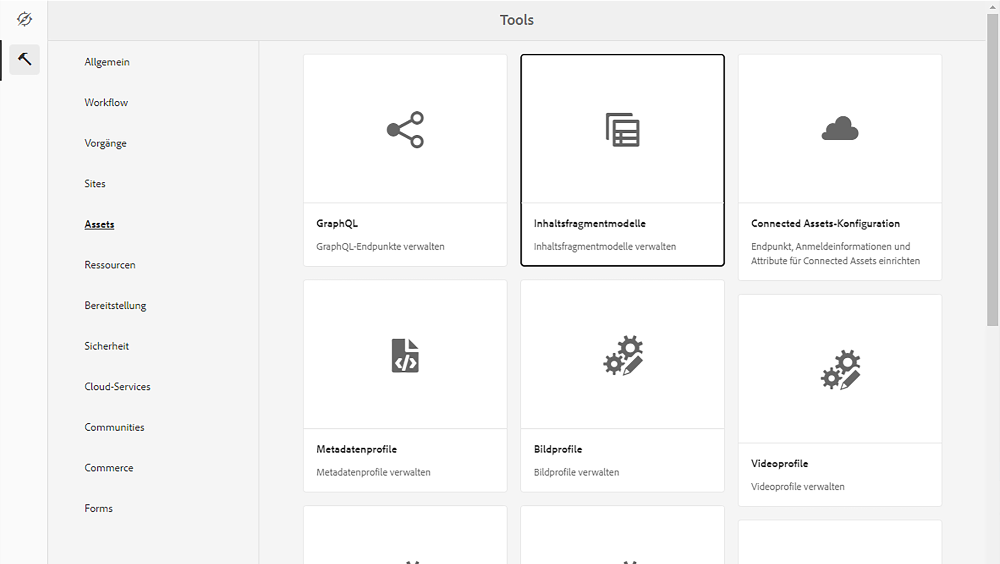

# Erfahren Sie mehr über das Erstellen von Inhaltsfragmentmodellen in AEM {#architect-headless-content-fragment-models}

## Die Geschichte so weit {#story-so-far}

At the beginning of the [AEM Headless Content Author Journey](overview.md) the [Content Modeling Basics for Headless with AEM](basics.md) covered the basic concepts and terminology relevant to authoring for headless.

Dieser Artikel baut auf diesen auf, damit Sie verstehen, wie Sie Ihre eigenen Inhaltsfragmentmodelle für Ihr AEM Headless-Projekt erstellen.

## Ziel {#objective}

* **Zielgruppe**: Anfänger
* **Ziel**: Konzepte und Methoden zur Modellierung von Inhalten für Ihr Headless-CMS mithilfe von Inhaltsfragmentmodellen.

<!-- which persona does this? -->
<!-- and who allows the configuration on the folders? -->

<!--
## Enabling Content Fragment Models {#enabling-content-fragment-models}

At the very start you need to enable Content Fragment Models for your site, this is done in the Configuration Browser; under Tools -> General -> Configuration Browser. You can either select to configure the global entry, or create a new configuration. For example:

>[!NOTE]
>
>See Additional Resources - Content Fragments in the Configuration Browser
-->

## Erstellen von Inhaltsfragmentmodellen {#creating-content-fragment-models}

Anschließend können die Inhaltsfragmentmodelle erstellt und die Struktur definiert werden. Dies kann unter „Tools“ > „Assets“ > „Inhaltsfragmentmodelle“ erfolgen.

Nachdem Sie diese Option ausgewählt haben, navigieren Sie zum Speicherort für Ihr Modell und wählen Sie **Erstellen**. Here you can enter various key details.

Die Option **Modell aktivieren** ist standardmäßig aktiviert. This means that your model will be available for use (in creating Content Fragments) as soon as you have saved it. Sie können dies bei Bedarf deaktivieren - es gibt später Möglichkeiten, ein vorhandenes Modell zu aktivieren (oder zu deaktivieren).

Bestätigen mit **Erstellen** und Sie können **Öffnen** Ihr Modell verwenden, um die Struktur zu definieren.

## Definieren von Inhaltsfragmentmodellen {#defining-content-fragment-models}

Wenn Sie ein neues Modell zum ersten Mal öffnen, sehen Sie einen großen leeren Bereich links und eine lange Liste von **Datentypen** rechts:

Was ist also zu tun?

Sie können Instanzen der **Datentypen** auf den linken Bereich - Sie definieren bereits Ihr Modell!

Once you add a data type you&#39;ll be required to define the **Properties** for that field. Diese hängen vom verwendeten Typ ab. Beispiel:

Sie können beliebig viele Felder hinzufügen. Beispiel:

### Ihre Inhaltsautoren {#your-content-authors}

Ihre Inhaltsautoren sehen nicht die tatsächlichen Datentypen und -eigenschaften, die Sie zum Erstellen Ihrer Modelle verwendet haben. This means that you might have to provide help and information on how they complete specific fields. Für grundlegende Informationen können Sie die Feldbeschriftung und den Standardwert verwenden. Komplexere Fälle können jedoch bedacht werden, um eine projektspezifische Dokumentation zu erhalten.

>[!NOTE]
>
>Siehe „Zusätzliche Ressourcen – Inhaltsfragmentmodelle“.

## Verwalten von Inhaltsfragmentmodellen {#managing-content-fragment-models}

<!-- needs more details -->

Managing your Content Fragment Models involves:

* Aktivieren (oder Deaktivieren) dieser Funktionen - Dadurch werden sie für Autoren beim Erstellen von Inhaltsfragmenten verfügbar.
* Löschen - Das Löschen ist immer erforderlich, Sie müssen jedoch wissen, dass Sie ein Modell löschen, das bereits für Inhaltsfragmente verwendet wird, insbesondere für bereits veröffentlichte Fragmente.

## Veröffentlichung {#publishing}

<!-- needs more details -->

Inhaltsfragmentmodelle müssen zeitgleich mit oder im Vorfeld der Veröffentlichung abhängiger Inhaltsfragmente veröffentlicht werden.

>[!NOTE]
>
>Wenn ein Autor versucht, ein Inhaltsfragment zu veröffentlichen, für das das Modell noch nicht veröffentlicht wurde, wird dies in einer Auswahlliste angezeigt und das Modell wird mit dem Fragment veröffentlicht.

As soon as a model is published it is *locked* into a READ-ONLY mode on author. Dadurch soll verhindert werden, dass Änderungen zu Fehlern an vorhandenen GraphQL-Schemas und -Abfragen führen, insbesondere in der Veröffentlichungsumgebung. Sie wird in der Konsole durch **Gesperrt**.

Wenn das Modell **Gesperrt** (im schreibgeschützten Modus) Sie können den Inhalt und die Struktur der Modelle anzeigen, sie jedoch nicht direkt bearbeiten. Sie können **Gesperrt** Modelle aus der Konsole oder dem Modell-Editor.

## Wie geht es weiter {#whats-next}

Nachdem Sie die Grundlagen gelernt haben, besteht der nächste Schritt darin, Ihre eigenen Inhaltsfragmentmodelle zu erstellen.

## Zusätzliche Ressourcen {#additional-resources}

* [Authoring – Konzepte](/help/sites-authoring/author.md)

* [Basic Handling](/help/sites-authoring/basic-handling.md) - this page is primarily based on the **Sites** console, but many/most features are also relevant for navigating to, and taking action on, **Content Fragment Models** under the **Assets** console.

* [Arbeiten mit Inhaltsfragmenten](/help/assets/content-fragments/content-fragments.md)

   * [Inhaltsfragmentmodelle](/help/assets/content-fragments/content-fragments-models.md)

      * [Definieren des Inhaltsfragmentmodells](/help/assets/content-fragments/content-fragments-models.md#defining-your-content-fragment-model)

      * [Aktivieren oder Deaktivieren von Inhaltsfragmentmodellen](/help/assets/content-fragments/content-fragments-models.md#enabling-disabling-a-content-fragment-model)

      * [Zulassen von Inhaltsfragmentmodellen im Asset-Ordner](/help/assets/content-fragments/content-fragments-models.md#allowing-content-fragment-models-assets-folder)

      * [Löschen eines Inhaltsfragmentmodells](/help/assets/content-fragments/content-fragments-models.md#deleting-a-content-fragment-model)

      * [Veröffentlichen eines Inhaltsfragmentmodells](/help/assets/content-fragments/content-fragments-models.md#publishing-a-content-fragment-model)

      * [Rückgängigmachen der Veröffentlichung eines Inhaltsfragmentmodells](/help/assets/content-fragments/content-fragments-models.md#unpublishing-a-content-fragment-model)

      * [Gesperrte (veröffentlichte) Inhaltsfragmentmodelle](/help/assets/content-fragments/content-fragments-models.md#locked-published-content-fragment-models)

* Anleitungen für den Einstieg

   * [Schnellstartanleitung zum Erstellen von Inhaltsfragmentmodellen per Headless-Implementierung](/help/sites-developing/headless/getting-started/create-content-model.md)
