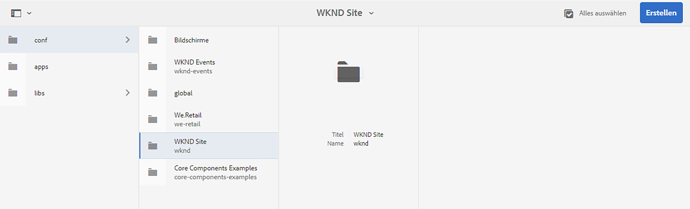
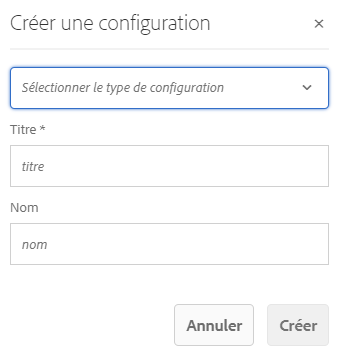
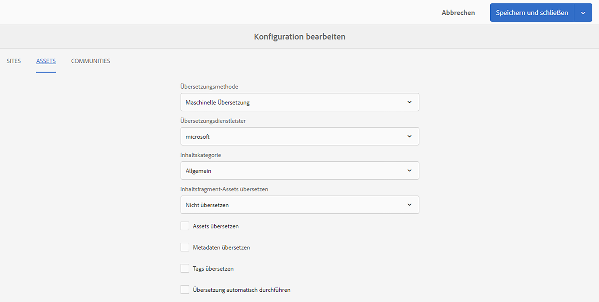
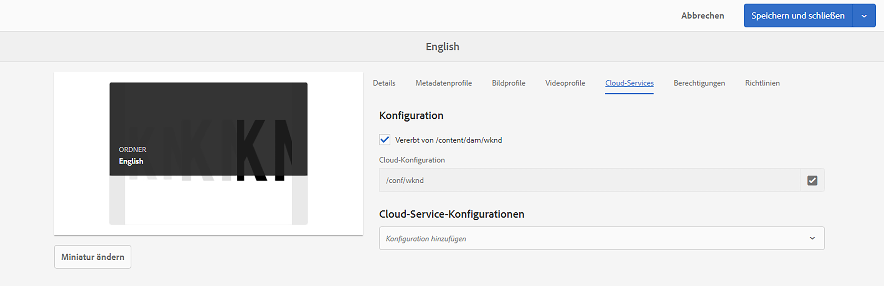

# Konfigurieren des Übersetzungs-Connectors {#configure-connector}

Erfahren Sie, wie Sie AEM mit einem Übersetzungsdienst verbinden.

## Die bisherige Entwicklung {#story-so-far}

Im vorherigen Dokument der Journey für die AEM Headless-Übersetzung [Erste Schritte mit AEM Headless-Übersetzung](learn-about.md) Sie haben gelernt, wie Sie Ihren Headless Content organisieren und wie AEM Übersetzungs-Tools funktionieren. Sie sollten jetzt:

* Machen Sie sich mit der Bedeutung der Inhaltsstruktur für die Übersetzung vertraut.
* Erfahren Sie, wie AEM Headless-Inhalte speichert.
* Machen Sie sich mit AEM Übersetzungstools vertraut.

Dieser Artikel baut auf diesen Grundlagen auf, damit Sie den ersten Konfigurationsschritt durchführen und einen Übersetzungsdienst einrichten können, den Sie später im Journey verwenden werden, um Ihre Inhalte zu übersetzen.

## Ziel {#objective}

In diesem Dokument erfahren Sie, wie Sie einen AEM Connector für Ihren ausgewählten Übersetzungsdienst einrichten. Nach dem Lesen sollten Sie:

* Machen Sie sich mit den wichtigen Parametern des Translation Integration Framework in AEM vertraut.
* Sie können Ihre eigene Verbindung zu Ihrem Übersetzungsdienst einrichten.

## Das Framework für die Übersetzungsintegration {#tif}

AEM Translation Integration Framework (TIF) ist mit Übersetzungsdiensten von Drittanbietern integriert, um die Übersetzung AEM Inhalts zu koordinieren. Dies umfasst drei grundlegende Schritte.

1. Verbinden Sie sich mit Ihrem Übersetzungsdienstleister.
1. Erstellen Sie eine Framework-Konfiguration für die Übersetzungsintegration.
1. Verknüpfen Sie die Konfiguration mit Ihrem Inhalt.

Die folgenden Abschnitte beschreiben diese Schritte detaillierter.

## Herstellen einer Verbindung zu einem Übersetzungsdienstleister {#connect-translation-provider}

Der erste Schritt besteht darin, den gewünschten Übersetzungsdienst auszuwählen. Es gibt viele Möglichkeiten für menschliche und maschinelle Übersetzungen, die AEM zur Verfügung stehen. Die meisten Anbieter bieten ein Übersetzungspaket zur Installation an. Siehe [Zusätzliche Ressourcen](#additional-resources) für eine Auswahl der verfügbaren Optionen.

>[!NOTE]
>
>Der Übersetzungsspezialist ist in der Regel für die Auswahl des zu verwendenden Übersetzungsdienstes verantwortlich, der Administrator ist jedoch in der Regel für die Installation des erforderlichen Übersetzungs-Connector-Pakets zuständig.

Für diese Journey verwenden wir den Microsoft Translator, der AEM eine Testlizenz vorkonfiguriert bietet. Siehe [Zusätzliche Ressourcen](#additional-resources) für weitere Informationen zu diesem Anbieter.

Wenn Sie einen anderen Anbieter auswählen, muss Ihr Administrator das Connector-Paket gemäß den Anweisungen des Übersetzungsdienstes installieren.

>[!NOTE]
>
>Die Verwendung des vordefinierten Microsoft Translator in AEM erfordert keine zusätzliche Einrichtung und funktioniert wie gewohnt ohne zusätzliche Connector-Konfiguration.
>
>Wenn Sie den Microsoft Translator-Connector zu Testzwecken verwenden, müssen Sie die Schritte in den folgenden beiden Abschnitten nicht ausführen: [Erstellen einer Konfiguration für die Übersetzungsintegration](#create-config) und [Verknüpfen Sie die Konfiguration mit Ihrem Inhalt.](#associate) Es wird jedoch empfohlen, sie zu lesen, damit Sie mit den Schritten vertraut sind, mit denen Sie Ihren bevorzugten Connector konfigurieren müssen.
>
>Die Testlizenz des Microsoft Translator-Connectors ist nicht für Produktionszwecke bestimmt. Wenn Sie sich für eine Lizenzierung entscheiden, muss der Systemadministrator die im Abschnitt [Zusätzliche Ressourcen](#additional-resources) am Ende dieses Dokuments, um diese Lizenz zu konfigurieren.

## Erstellen einer Konfiguration für die Übersetzungsintegration {#create-config}

Nachdem das Connector-Paket für Ihren bevorzugten Übersetzungsdienst installiert wurde, müssen Sie eine Konfiguration für das Framework für die Übersetzungsintegration für diesen Dienst erstellen. Die Konfiguration enthält die folgenden Informationen:

* welcher Übersetzungsanbieter eingesetzt werden soll
* ob eine menschliche oder maschinelle Übersetzung erfolgen soll
* Ob andere Inhalte, die mit dem Inhaltsfragment verknüpft sind, übersetzt werden sollen, z. B. Tags

So erstellen Sie eine neue Übersetzungskonfiguration:

1. Klicken oder tippen Sie im globalen Navigationsmenü auf **Instrumente** -> **Cloud Services** -> **Übersetzungs-Cloud Services**.
1. Navigieren Sie zu der Stelle in Ihrer Inhaltsstruktur, an der Sie die Konfiguration erstellen möchten. Dies basiert häufig auf einem bestimmten Projekt oder kann global sein.
   * In diesem Fall kann beispielsweise eine Konfiguration global vorgenommen werden, um sie auf alle Inhalte oder nur auf das WKND-Projekt anzuwenden.

   

1. Provide the following information in the fields and then click or tap **Create**.
   1. Wählen Sie **Konfigurationstyp** in der Dropdown-Liste aus. Auswählen **Übersetzungsintegration** aus der Liste.
   1. Geben Sie einen **Titel** für Ihre Konfiguration ein. Mit dem **Titel** wird die Konfiguration auf der **Cloud Services**-Konsole und in Dropdown-Listen mit den Seiteneigenschaften identifiziert.
   1. Geben Sie optional einen **Namen** für den Repository-Knoten ein, auf dem die Konfiguration gespeichert wird.

   

1. Tippen oder klicken Sie auf **Erstellen** und **Konfiguration bearbeiten** -Fenster angezeigt, in dem Sie die Konfigurationseigenschaften konfigurieren können.

1. Denken Sie daran, dass Inhaltsfragmente in AEM als Assets gespeichert werden. Tippen oder klicken Sie auf **Assets** Registerkarte.



1. Geben Sie die folgenden Informationen ein.

   1. **Übersetzungsmethode** - Auswählen **Maschinelle Übersetzung** oder **Menschliche Übersetzung** abhängig von Ihrem Übersetzungsanbieter. Für diese Journey übernehmen wir die maschinelle Übersetzung.
   1. **Übersetzungsanbieter** - Wählen Sie in der Liste den Connector aus, den Sie für Ihren Übersetzungsdienst installiert haben.
   1. **Inhaltskategorie** - Wählen Sie die am besten geeignete Kategorie aus, um die Übersetzung gezielter durchzuführen (nur für maschinelle Übersetzung).
   1. **Übersetzen von Inhaltsfragment-Assets** - Aktivieren Sie diese Option, um Assets zu übersetzen, die mit Inhaltsfragmenten verknüpft sind.
   1. **Übersetzen von Assets** - Aktivieren Sie diese Option, um die Assets zu übersetzen.
   1. **Metadaten übersetzen** - Aktivieren Sie diese Option, um Asset-Metadaten zu übersetzen.
   1. **Tags übersetzen** - Aktivieren Sie diese Option, um Tags zu übersetzen, die mit dem Asset verknüpft sind.
   1. **Übersetzung automatisch ausführen** - Aktivieren Sie diese Eigenschaft, wenn Übersetzungen automatisch an Ihren Übersetzungsdienst gesendet werden sollen.

1. Tippen oder klicken Sie auf **Speichern und schließen**.

Sie haben jetzt den Connector für Ihren Übersetzungsdienst konfiguriert.

## Verknüpfen der Konfiguration mit Ihrem Inhalt {#associate}

AEM ist ein flexibles und leistungsstarkes Tool und unterstützt mehrere, gleichzeitige Übersetzungsdienste über mehrere Connectoren und mehrere Konfigurationen. Die Einrichtung einer solchen Konfiguration geht über den Rahmen dieser Journey hinaus. Diese Flexibilität bedeutet jedoch, dass Sie angeben müssen, welche Connectoren und Konfigurationen für die Übersetzung Ihrer Inhalte verwendet werden sollen, indem Sie diese Konfiguration mit Ihren Inhalten verknüpfen.

Navigieren Sie dazu zum Sprachstamm Ihres Inhalts. Für unsere Beispielzwecke ist dies

```text
/content/dam/<your-project>/en
```

1. Navigieren Sie zur globalen Navigation und navigieren Sie zu **Navigation** -> **Assets** -> **Dateien**.
1. Wählen Sie in der Assets-Konsole den zu konfigurierenden Sprachstamm aus und klicken oder tippen Sie auf **Eigenschaften**.
1. Tippen oder klicken Sie auf **Cloud Services** Registerkarte.
1. under **Cloud Service-Konfigurationen** im **Konfiguration hinzufügen** wählen Sie den Connector aus. Sie sollte in der Dropdown-Liste angezeigt werden, wenn Sie das Paket als [weiter oben beschrieben.](#connect-translation-provider)
1. under **Cloud Service-Konfigurationen** im **Konfiguration hinzufügen** und wählen Sie auch Ihre Konfiguration aus.
1. Tippen oder klicken Sie auf **Speichern und schließen**.



## Wie geht es weiter {#what-is-next}

Nachdem Sie nun diesen Teil der Headless-Übersetzungs-Journey abgeschlossen haben, sollten Sie:

* Machen Sie sich mit den wichtigen Parametern des Translation Integration Framework in AEM vertraut.
* Sie können Ihre eigene Verbindung zu Ihrem Übersetzungsdienst einrichten.

Build on this knowledge and continue your AEM headless translation journey by next reviewing the document [Configure translation rules,](translation-rules.md) where you will learn how to define which content to translate.

## Zusätzliche Ressourcen {#additional-resources}

Es wird empfohlen, zum nächsten Teil der Headless-Übersetzungs-Journey zu wechseln, indem Sie das Dokument lesen [Übersetzungsregeln konfigurieren](translation-rules.md) Im Folgenden finden Sie einige zusätzliche optionale Ressourcen, die einen tieferen Einblick in einige der in diesem Dokument erwähnten Konzepte ermöglichen, aber nicht auf der Headless-Journey weiterarbeiten müssen.

* [Konfigurieren des Framework für die Übersetzungsintegration](/help/sites-administering/tc-tic.md) - Überprüfen Sie eine Liste ausgewählter Übersetzungs-Connectoren und erfahren Sie, wie Sie das Framework für die Übersetzungsintegration konfigurieren, um mit Übersetzungsdiensten von Drittanbietern zu integrieren.
* [Verbindung zum Microsoft Translator herstellen](/help/sites-administering/tc-msconf.md) - AEM bietet ein Microsoft Translation-Testkonto für Testzwecke.
