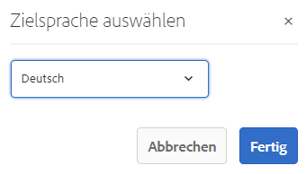

# Übersetzten Inhalt veröffentlichen {#publish-content}

Erfahren Sie, wie Sie Ihre übersetzten Inhalte veröffentlichen und die Übersetzungen bei der Inhaltsaktualisierung aktualisieren können.

## Die bisherige Entwicklung {#story-so-far}

Im vorherigen Dokument der Journey für die AEM Headless-Übersetzung [Übersetzen von Inhalten,](configure-connector.md) Sie haben gelernt, wie Sie mit AEM Übersetzungsprojekten Headless Content übersetzen können. Sie sollten jetzt:

* Verstehen Sie, was ein Übersetzungsprojekt ist.
* Sie können neue Übersetzungsprojekte erstellen.
* Verwenden Sie Übersetzungsprojekte, um Ihre Headless Content zu übersetzen.

Nachdem Ihre erste Übersetzung abgeschlossen ist, führt Sie dieser Artikel durch den nächsten Schritt zur Veröffentlichung dieses Inhalts und dazu, wie Sie Ihre Übersetzungen aktualisieren können, da sich der zugrunde liegende Inhalt im Sprachstamm ändert.

## Ziel {#objective}

In diesem Dokument erfahren Sie, wie Sie Headless Content in AEM veröffentlichen und einen kontinuierlichen Workflow erstellen, um Ihre Übersetzungen auf dem neuesten Stand zu halten. Nach Lesen dieses Dokuments sollten Sie Folgendes können:

* Machen Sie sich mit dem Author-Publish-Modell von AEM vertraut.
* Erfahren Sie, wie Sie Ihre übersetzten Inhalte veröffentlichen.
* Sie können ein kontinuierliches Aktualisierungsmodell für Ihre übersetzten Inhalte implementieren.

## AEM Author-Publish-Modell {#author-publish}

Bevor Sie Ihren Inhalt veröffentlichen, sollten Sie AEM Authoring-Publishing-Modell verstehen. Vereinfacht ausgedrückt: AEM unterteilt Benutzer des Systems in zwei Gruppen.

1. Diejenigen, die Inhalte und System erstellen und verwalten
1. Diejenigen, die die Inhalte aus dem System konsumieren

AEM ist daher physisch in zwei Instanzen unterteilt.

1. Die **author** -Instanz ist das System, in dem Autoren und Administratoren von Inhalten Inhalte erstellen und verwalten.
1. Die **publish** instance ist das System, das den Inhalt für die Verbraucher bereitstellt.

Sobald Inhalte in der Autoreninstanz erstellt wurden, müssen sie in die Veröffentlichungsinstanz übertragen werden, damit sie zur Verwendung verfügbar sind. Der Prozess der Übertragung von der Autoren- zur Veröffentlichungsinstanz wird als **Veröffentlichung**.

## Veröffentlichen der übersetzten Inhalte {#publishing}

Sobald Sie mit dem Status Ihrer übersetzten Inhalte zufrieden sind, müssen diese veröffentlicht werden, damit Headless Services sie nutzen können. Diese Aufgabe fällt normalerweise nicht in die Zuständigkeit des Übersetzungsanbieters, sondern wird hier dokumentiert, um den gesamten Workflow zu veranschaulichen.

>[!NOTE]
>
>Nach Abschluss der Übersetzung informiert der Übersetzungs-Spezialist den Inhaltsverantwortlichen im Allgemeinen, dass die Übersetzungen veröffentlicht werden können. Die Inhaltsverantwortlichen veröffentlichen sie dann.
>
>Die folgenden Schritte werden zur Vollständigkeit bereitgestellt.

Die einfachste Möglichkeit, die Übersetzungen zu veröffentlichen, besteht darin, zum Ordner mit den Projekt-Assets zu navigieren.

```text
/content/dam/<your-project>/
```

Unter diesem Pfad befinden sich Unterordner für jede Übersetzungssprache und können auswählen, welche veröffentlicht werden soll.

1. Navigieren Sie zu **Navigation** -> **Assets** -> **Dateien** und öffnen Sie den Projektordner.
1. Hier sehen Sie den Ordner für den Sprachstamm und alle anderen Sprachordner. Wählen Sie die zu veröffentlichenden lokalisierten Sprachen aus.
   
1. Tippen oder klicken Sie auf **Veröffentlichung verwalten**.
1. Im **Veröffentlichung verwalten** -Fenster, stellen Sie sicher, dass **Veröffentlichen** automatisch unter **Aktion** und **Jetzt** ausgewählt unter **Planung**. Tippen oder klicken Sie auf **Weiter**.
   
1. Im nächsten **Veröffentlichung verwalten** überprüfen Sie, ob der/die richtige(n) Pfad(e) ausgewählt ist/sind. Tippen oder klicken Sie auf **Veröffentlichen**.
   
1. AEM bestätigt die Veröffentlichungsaktion mit einer Popup-Meldung am oberen Bildschirmrand.
   

Ihr übersetzter Headless-Inhalt ist jetzt veröffentlicht! Sie können jetzt von Ihren Headless-Services darauf zugreifen und sie nutzen.

>[!TIP]
>
>Sie können bei der Veröffentlichung mehrere Elemente (d. h. mehrere Sprachordner) auswählen, um mehrere Übersetzungen gleichzeitig zu veröffentlichen.

Es gibt zusätzliche Optionen bei der Veröffentlichung Ihres Inhalts, z. B. die Planung einer Veröffentlichungszeit, die über den Rahmen dieser Journey hinausgehen. Siehe [Zusätzliche Ressourcen](#additional-resources) am Ende des Dokuments für weitere Informationen.

## Aktualisieren Ihrer übersetzten Inhalte {#updating-translations}

Übersetzen ist selten eine einmalige Übung. In der Regel fügen Ihre Inhaltsautoren Ihren Inhalt im Sprachstamm weiter hinzu und ändern ihn, nachdem die Erstübersetzung abgeschlossen ist. Dies bedeutet, dass Sie auch Ihre übersetzten Inhalte aktualisieren müssen.

Spezifische Projektanforderungen definieren, wie oft Sie Ihre Übersetzungen aktualisieren müssen und welcher Entscheidungsprozess befolgt wird, bevor Sie eine Aktualisierung durchführen. Sobald Sie sich entschieden haben, Ihre Übersetzungen zu aktualisieren, ist der Prozess in AEM sehr einfach. Da die ursprüngliche Übersetzung auf einem Übersetzungsprojekt basierte, so auch alle Aktualisierungen.

Allerdings unterscheidet sich der Prozess geringfügig, wenn Sie Ihr Übersetzungsprojekt automatisch erstellen oder Ihr Übersetzungsprojekt manuell erstellen.

### Aktualisieren eines automatisch erstellten Übersetzungsprojekts {#updating-automatic-project}

1. Navigieren Sie zu **Navigation** -> **Assets** -> **Dateien**. Beachten Sie, dass Headless-Inhalte in AEM als Assets gespeichert werden, die als Inhaltsfragmente bezeichnet werden.
1. Wählen Sie den Sprachstamm Ihres Projekts aus. In diesem Fall haben wir `/content/dam/wknd/en`.
1. Tippen oder klicken Sie auf die Schienenauswahl und zeigen Sie die **Verweise** Bereich.
1. Tippen oder klicken Sie auf **Sprachkopien**.
1. Überprüfen Sie die **Sprachkopien** aktivieren.
1. Abschnitt erweitern **Sprachkopien aktualisieren** unten im Bereich &quot;Verweise&quot;.
1. Im **Projekt** Dropdown-Liste auswählen **Hinzufügen zu einem vorhandenen Übersetzungsprojekt**.
1. Im **Vorhandenes Übersetzungsprojekt** Dropdown-Liste das Projekt auswählen, das für die Erstübersetzung erstellt wurde.
1. Tippen oder klicken Sie auf **Starten**.


Der Inhalt wird zum vorhandenen Übersetzungsprojekt hinzugefügt. So zeigen Sie das Übersetzungsprojekt an:

1. Navigieren Sie zu **Navigation** -> **Projekte**.
1. Tippen oder klicken Sie auf das soeben aktualisierte Projekt.
1. Tippen oder klicken Sie auf die Sprache oder eine der Sprachen, die Sie aktualisiert haben.

Sie sehen, dass dem Projekt entsprechend neue Auftragskarten hinzugefügt werden.

<!--
You see that a new job card was added to the project. In this example, another Spanish translation was added.


-->

Sie werden feststellen, dass die auf der neuen Karte aufgelisteten Statistiken (Anzahl der Assets und Inhaltsfragmente) unterschiedlich sind. Dies liegt daran, dass AEM erkennt, was sich seit der letzten Übersetzung geändert hat, und nur den Inhalt enthält, der übersetzt werden muss. Dazu gehören die Neuübersetzung aktualisierter Inhalte sowie die Erstübersetzung neuer Inhalte.

An dieser Stelle [Starten und verwalten Sie Ihren Übersetzungsauftrag genauso wie das Original.](translate-content.md#using-translation-project)

### Aktualisieren eines manuell erstellten Übersetzungsprojekts {#updating-manual-project}

Um eine Übersetzung zu aktualisieren, können Sie Ihrem vorhandenen Projekt einen neuen Auftrag hinzufügen, der für die Übersetzung der aktualisierten Inhalte verantwortlich ist.

1. Navigieren Sie zu **Navigation** -> **Projekte**.
1. Tippen oder klicken Sie auf das Projekt, das Sie aktualisieren müssen.
1. Tippen oder klicken Sie auf **Hinzufügen** -Schaltfläche am oberen Rand des Fensters.
1. Im **Kachel hinzufügen** Fenster, tippen oder klicken **Übersetzungsauftrag** und dann **Einsenden**.

   

1. Tippen oder klicken Sie auf der Karte des neuen Übersetzungsauftrags auf die Pfeilschaltfläche oben auf der Karte und wählen Sie **Target aktualisieren** , um die Zielsprache des neuen Auftrags zu definieren.

   

1. Im **Zielsprache auswählen** verwenden, wählen Sie in der Dropdown-Liste die Sprache aus und tippen oder klicken Sie auf **Fertig**.

   

1. Sobald die Zielsprache Ihres neuen Übersetzungsauftrags festgelegt ist, tippen oder klicken Sie unten auf der Auftragskarte auf die Suchschaltfläche , um die Details des Auftrags anzuzeigen.
1. Der Auftrag ist beim ersten Erstellen leer. Fügen Sie Inhalt zum Auftrag hinzu, indem Sie auf die **Hinzufügen** und unter Verwendung des Pfad-Browsers [wie Sie es bei der ursprünglichen Erstellung des Übersetzungsprojekts getan haben.](translate-content.md##manually-creating)

>[!TIP]
>
>Die leistungsstarken Filter des Pfad-Browsers können wieder nützlich sein, um nur den aktualisierten Inhalt zu finden.
>
>Weitere Informationen zum Pfad-Browser finden Sie im [Abschnitt mit zusätzlichen Ressourcen.](#additional-resources)

An dieser Stelle [Starten und verwalten Sie Ihren Übersetzungsauftrag genauso wie das Original.](translate-content.md#using-translation-project)

## Ende der Journey? {#end-of-journey}

Herzlichen Glückwunsch! Sie haben die Headless-Übersetzungs-Journey abgeschlossen! Sie sollten jetzt:

* Verschaffen Sie sich einen Überblick darüber, was die Headless Content-Bereitstellung ist.
* Verstehen Sie AEM Headless-Funktionen.
* Verstehen Sie AEM Übersetzungsfunktionen und deren Zusammenhang mit Headless Content.
* Sie haben die Möglichkeit, Ihre eigenen Headless Content zu übersetzen.

Jetzt können Sie Ihre eigenen Headless Content in AEM übersetzen. AEM ist jedoch ein leistungsstarkes Tool und es gibt viele zusätzliche Optionen. Sehen Sie sich einige der zusätzlichen Ressourcen an, die im Abschnitt [Abschnitt &quot;Zusätzliche Ressourcen&quot;](#additional-resources) um mehr über die Funktionen zu erfahren, die Sie auf dieser Journey gesehen haben.

## Zusätzliche Ressourcen {#additional-resources}

* [Verwalten von Übersetzungsprojekten](/help/sites-administering/tc-manage.md) - Erfahren Sie mehr über die Einzelheiten von Übersetzungsprojekten und zusätzliche Funktionen wie Workflows für menschliche Übersetzung und mehrsprachige Projekte.
* [Authoring - Konzepte](/help/sites-authoring/author.md) - Weitere Informationen zum Autoren- und Veröffentlichungsmodell von AEM. Dieses Dokument konzentriert sich nicht auf Inhaltsfragmente, sondern auf das Erstellen von Seiten, aber die Theorie gilt weiterhin.
* [Veröffentlichen von Seiten](/help/sites-authoring/publishing-pages.md) - Erfahren Sie mehr über die zusätzlichen Funktionen, die beim Veröffentlichen von Inhalten verfügbar sind. Dieses Dokument konzentriert sich nicht auf Inhaltsfragmente, sondern auf das Erstellen von Seiten, aber die Theorie gilt weiterhin.
* [Autorenumgebung und Tools](/help/sites-authoring/author-environment-tools.md##path-selection) - AEM bietet verschiedene Mechanismen für die Organisation und Bearbeitung von Inhalten, einschließlich eines robusten Pfadbrowsers.
