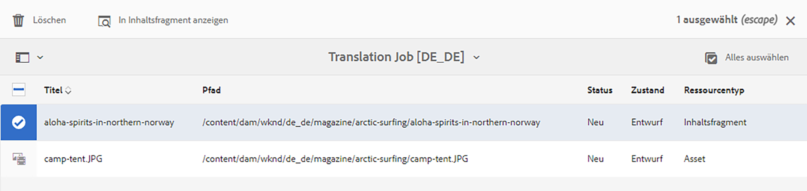

# Inhalt übersetzen {#translate-content}

Verwenden Sie den Übersetzungs-Connector und die Regeln, um Ihre Headless-Inhalte zu übersetzen.

## Die bisherige Entwicklung {#story-so-far}

Im vorherigen Dokument der Journey für die AEM Headless-Übersetzung [Übersetzungsregeln konfigurieren](translation-rules.md) Sie haben gelernt, wie Sie AEM Übersetzungsregeln verwenden, um Ihre Übersetzungsinhalte zu identifizieren. Sie sollten jetzt:

* Machen Sie sich mit den Übersetzungsregeln vertraut.
* Sie können Ihre eigenen Übersetzungsregeln definieren.

Nachdem Sie Ihre Regeln für Connector und Übersetzungen eingerichtet haben, führt Sie dieser Artikel durch den nächsten Schritt zur Übersetzung Ihrer Headless Content.

## Ziel {#objective}

In diesem Dokument erfahren Sie, wie Sie AEM Übersetzungsprojekte zusammen mit dem Connector und Ihren Übersetzungsregeln verwenden können, um Inhalte zu übersetzen. Nach Lesen dieses Dokuments sollten Sie über Folgendes verfügen:

* Verstehen Sie, was ein Übersetzungsprojekt ist.
* Sie können neue Übersetzungsprojekte erstellen.
* Verwenden Sie Übersetzungsprojekte, um Ihre Headless Content zu übersetzen.

## Erstellen eines Übersetzungsprojekts {#creating-translation-project}

Mithilfe von Übersetzungsprojekten können Sie die Übersetzung von Headless-AEM-Inhalten verwalten. Ein Übersetzungsprojekt sammelt die Inhalte, die in andere Sprachen übersetzt werden sollen, an einem Ort, um einen zentralen Überblick über den Übersetzungsaufwand zu erhalten.

Wenn einem Übersetzungsprojekt Inhalte hinzugefügt werden, wird dafür ein Übersetzungsauftrag erstellt. Aufträge beinhalten Befehle und Statusinformationen, mit denen Sie die Workflows für menschliche und maschinelle Übersetzungen, die für die Ressourcen ausgeführt werden, verwalten.

Übersetzungsprojekte können auf zwei Arten erstellt werden:

1. Wählen Sie den Sprachstamm des Inhalts aus und lassen Sie AEM das Übersetzungsprojekt automatisch basierend auf dem Inhaltspfad erstellen.
1. Erstellen Sie ein leeres Projekt und wählen Sie manuell den Inhalt aus, der zum Übersetzungsprojekt hinzugefügt werden soll

Beide Ansätze unterscheiden sich in der Regel nur je nach der Person, die die Übersetzung durchführt:

* Der Übersetzungsprojektmanager (TPM) benötigt häufig die Flexibilität, den Inhalt manuell für das Übersetzungsprojekt auszuwählen.
* Wenn der Eigentümer des Inhalts auch für die Übersetzung verantwortlich ist, ist es oft einfacher, das Projekt anhand des ausgewählten Inhaltspfads automatisch AEM erstellen zu lassen.

Beide Ansätze werden in den folgenden Abschnitten untersucht.

### Automatisches Erstellen eines Übersetzungsprojekts basierend auf dem Inhaltspfad {#automatically-creating}

Für Inhaltsverantwortliche, die auch für die Übersetzung verantwortlich sind, ist es oft einfacher, das Übersetzungsprojekt automatisch AEM erstellen zu lassen. So erstellen AEM automatisch ein Übersetzungsprojekt basierend auf Ihrem Inhaltspfad:

1. Navigieren Sie zu **Navigation** -> **Assets** -> **Dateien**. Beachten Sie, dass Headless-Inhalte in AEM als Assets gespeichert werden, die als Inhaltsfragmente bezeichnet werden.
1. Wählen Sie den Sprachstamm Ihres Projekts aus. In diesem Fall haben wir `/content/dam/wknd/en`.
1. Tippen oder klicken Sie auf die Schienenauswahl und zeigen Sie die **Verweise** Bereich.
1. Tippen oder klicken Sie auf **Sprachkopien**.
1. Überprüfen Sie die **Sprachkopien** aktivieren.
1. Abschnitt erweitern **Sprachkopien aktualisieren** unten im Bereich &quot;Verweise&quot;.
1. Im **Projekt** Dropdown-Liste auswählen **Übersetzungsprojekt(e) erstellen**.
1. Geben Sie einen geeigneten Titel für Ihr Übersetzungsprojekt an.
1. Tippen oder klicken Sie auf **Starten**.


Sie erhalten eine Nachricht, dass das Projekt erstellt wurde.

>[!NOTE]
>
>Es wird davon ausgegangen, dass die für die Übersetzungen erforderliche Sprachstruktur bereits im Rahmen der [Definition der Inhaltsstruktur.](getting-started.md#content-structure) Dies sollte in Zusammenarbeit mit dem Inhaltsarchitekten erfolgen.
>
>Wenn die Sprachordner nicht vorzeitig erstellt werden, können Sie keine Sprachkopien wie in den vorherigen Schritten beschrieben erstellen.

### Manuelles Erstellen eines Übersetzungsprojekts durch Auswahl des Inhalts {#manually-creating}

Für Übersetzungsprojektmanager ist es oft erforderlich, bestimmte Inhalte manuell auszuwählen, die in ein Übersetzungsprojekt aufgenommen werden sollen. Um ein solches manuelles Übersetzungsprojekt zu erstellen, müssen Sie zunächst ein leeres Projekt erstellen und dann den hinzuzufügenden Inhalt auswählen.

1. Navigieren Sie zu **Navigation** -> **Projekte**.
1. Tippen oder klicken Sie auf **Erstellen** -> **Ordner** , um einen Ordner für Ihre Projekte zu erstellen.
   * Dies ist optional, aber hilfreich, um Ihre Übersetzungsbemühungen zu organisieren.
1. Im **Ordner erstellen** ein Fenster, fügen Sie eine **Titel** für den Ordner und tippen oder klicken Sie dann auf **Erstellen**.

   

1. Tippen oder klicken Sie auf den Ordner , um den Ordner zu öffnen.
1. Tippen oder klicken Sie in Ihrem neuen Projektordner auf **Erstellen** -> **Projekt**.
1. Projekte basieren auf Vorlagen. Tippen oder klicken Sie auf **Übersetzungsprojekt** Vorlage zum Auswählen und Tippen oder Klicken **Nächste**.

   

1. Im **Allgemein** Registerkarte einen Namen für Ihr neues Projekt eingeben.

   

1. Im **Erweitert** Registerkarte, verwenden Sie die **Zielsprache** die Sprache(n) auswählen, in die der Inhalt übersetzt werden soll. Tippen oder klicken Sie auf **Erstellen**.

   

1. Tippen oder klicken Sie auf **Öffnen** im Bestätigungsdialogfeld.

   

Das Projekt wurde erstellt, enthält jedoch keine zu übersetzenden Inhalte. Im nächsten Abschnitt wird beschrieben, wie das Projekt strukturiert ist und Inhalte hinzugefügt werden.

## Verwenden eines Übersetzungsprojekts {#using-translation-project}

Übersetzungsprojekte dienen dazu, alle Inhalte und Aufgaben im Zusammenhang mit einem Übersetzungsangebot an einem Ort zu erfassen, um Ihre Übersetzung einfach und einfach zu verwalten.

So zeigen Sie das Übersetzungsprojekt an:

1. Navigieren Sie zu **Navigation** -> **Projekte**.
1. Tippen oder klicken Sie auf das Projekt, das im vorherigen Abschnitt erstellt wurde.


Das Projekt ist in mehrere Karten unterteilt.

* **Zusammenfassung** - Diese Karte zeigt die grundlegenden Kopfzeileninformationen des Projekts, einschließlich des Eigentümers, der Sprache und des Übersetzungsanbieters.
* **Übersetzungsauftrag** - Diese Karte bzw. diese Karten bieten einen Überblick über den tatsächlichen Übersetzungsauftrag, einschließlich Status, Anzahl der Assets usw. Im Allgemeinen gibt es pro Sprache einen Auftrag, wobei der ISO-2-Sprachcode an den Auftragsnamen angehängt wird.
* **Team** - Auf dieser Karte werden die Benutzer angezeigt, die an diesem Übersetzungsprojekt mitarbeiten. Diese Journey behandelt dieses Thema nicht.
* **Aufgaben** - Zusätzliche Aufgaben im Zusammenhang mit der Übersetzung des Inhalts, z. B. zum Ausführen von Elementen oder Workflow-Elementen. Diese Journey behandelt dieses Thema nicht.

Wie Sie ein Übersetzungsprojekt verwenden, hängt davon ab, wie es erstellt wurde: entweder automatisch durch AEM oder manuell.

### Verwenden eines automatisch erstellten Übersetzungsprojekts {#using-automatic-project}

Beim automatischen Erstellen des Übersetzungsprojekts bewertet AEM den Headless-Inhalt unter dem von Ihnen ausgewählten Pfad anhand der zuvor definierten Übersetzungsregeln. Basierend auf dieser Auswertung extrahiert es den Inhalt, der übersetzt werden muss, in ein neues Übersetzungsprojekt.

So sehen Sie die Details des Headless-Inhalts in diesem Projekt:

1. Tippen oder klicken Sie unten auf der Schaltfläche mit den Auslassungspunkten **Übersetzungsauftrag** Karte.
1. Die **Übersetzungsauftrag** im Fenster werden alle Elemente des Auftrags aufgelistet.
   
1. Tippen oder klicken Sie auf eine Zeile, um die Details dieser Zeile anzuzeigen. Dabei ist zu beachten, dass eine Zeile mehrere zu übersetzende Inhaltselemente darstellen kann.
1. Tippen oder klicken Sie auf das Auswahlkästchen für ein Zeilenelement, um weitere Optionen anzuzeigen, z. B. die Option, es aus dem Auftrag zu löschen oder in den Konsolen &quot;Inhaltsfragmente&quot;oder &quot;Assets&quot;anzuzeigen.
   

Normalerweise beginnt der Inhalt für den Übersetzungsauftrag im **Entwurf** entsprechend den Angaben in **state** in der Spalte **Übersetzungsauftrag** Fenster.

Um den Übersetzungsauftrag zu starten, kehren Sie zur Übersichtsübersicht des Übersetzungsprojekts zurück und tippen oder klicken Sie auf die Schaltfläche &quot;Chevron&quot;oben im **Übersetzungsauftrag** Karte und wählen Sie **Starten**.


AEM kommuniziert nun mit Ihrer Übersetzungskonfiguration und Ihrem Connector, um den Inhalt an den Übersetzungsdienst zu senden. Sie können den Fortschritt der Übersetzung anzeigen, indem Sie zum **Übersetzungsauftrag** Fenster und Anzeigen der **state** -Spalte der Einträge.


Maschinelle Übersetzungen werden automatisch mit dem Status **Genehmigt**. Menschliche Übersetzung ermöglicht mehr Interaktion, ist aber über den Rahmen dieser Journey hinaus.

### Verwenden eines manuell erstellten Übersetzungsprojekts {#using-manual-project}

Beim manuellen Erstellen eines Übersetzungsprojekts erstellt AEM die erforderlichen Aufträge, wählt jedoch nicht automatisch die einzuschließenden Inhalte aus. Dadurch kann der Übersetzungsprojektmanager flexibel entscheiden, welche Inhalte übersetzt werden sollen.

So fügen Sie einem Übersetzungsauftrag Inhalte hinzu:

1. Tippen oder klicken Sie unten in einem der **Übersetzungsauftrag** Karten.
1. Stellen Sie sicher, dass der Auftrag keinen Inhalt enthält. Tippen oder klicken Sie auf **Hinzufügen** Schaltfläche oben im Fenster und **Assets/Seiten** aus der Dropdown-Liste aus.

   

1. Ein Pfad-Browser wird geöffnet, in dem Sie auswählen können, welche Inhalte hinzugefügt werden sollen. Suchen Sie den Inhalt und tippen oder klicken Sie zur Auswahl auf .

   

1. Tippen oder klicken Sie auf **Auswählen** , um den ausgewählten Inhalt zum Auftrag hinzuzufügen.
1. Im **Übersetzen** Dialogfeld, geben Sie an, dass Sie **Sprachkopie erstellen**.

   

1. Der Inhalt ist jetzt im Auftrag enthalten.

   

1. Tippen oder klicken Sie auf das Auswahlkästchen für ein Zeilenelement, um weitere Optionen anzuzeigen, z. B. die Option, es aus dem Auftrag zu löschen oder in den Konsolen &quot;Inhaltsfragmente&quot;oder &quot;Assets&quot;anzuzeigen.
   

1. Wiederholen Sie diese Schritte, um alle erforderlichen Inhalte in den Auftrag einzuschließen.

>[!TIP]
>
>Der Pfad-Browser ist ein leistungsstarkes Tool, mit dem Sie Inhalte suchen, filtern und navigieren können. Tippen oder klicken Sie auf **Nur Inhalt/Filter** Schaltfläche zum Umschalten des Seitenbereichs und Einblenden erweiterter Filter wie **Änderungsdatum** oder **Übersetzungsstatus**.
>
>Weitere Informationen zum Pfad-Browser finden Sie im [Abschnitt mit zusätzlichen Ressourcen.](#additional-resources)

Sie können die vorherigen Schritte verwenden, um den erforderlichen Inhalt zu allen Sprachen (Aufträgen) für das Projekt hinzuzufügen. Nachdem Sie den gesamten Inhalt ausgewählt haben, können Sie mit der Übersetzung beginnen.

Normalerweise beginnt der Inhalt für den Übersetzungsauftrag im **Entwurf** entsprechend den Angaben in **state** in der Spalte **Übersetzungsauftrag** Fenster.

Um den Übersetzungsauftrag zu starten, kehren Sie zur Übersichtsübersicht des Übersetzungsprojekts zurück und tippen oder klicken Sie auf die Schaltfläche &quot;Chevron&quot;oben im **Übersetzungsauftrag** Karte und wählen Sie **Starten**.


AEM kommuniziert nun mit Ihrer Übersetzungskonfiguration und Ihrem Connector, um den Inhalt an den Übersetzungsdienst zu senden. Sie können den Fortschritt der Übersetzung anzeigen, indem Sie zum **Übersetzungsauftrag** Fenster und Anzeigen der **state** -Spalte der Einträge.


Maschinelle Übersetzungen werden automatisch mit dem Status **Genehmigt**. Menschliche Übersetzung ermöglicht mehr Interaktion, ist aber über den Rahmen dieser Journey hinaus.

## Überprüfen übersetzter Inhalte {#reviewing}

[Wie bereits erwähnt,](#using-translation-project) Der maschinell übersetzte Inhalt fließt zurück in AEM mit dem Status **Genehmigt** Da die Annahme ist, dass aufgrund der Verwendung von maschineller Übersetzung kein menschliches Eingreifen erforderlich ist. Natürlich ist es noch möglich, die übersetzten Inhalte zu überprüfen.

Wechseln Sie einfach zum abgeschlossenen Übersetzungsauftrag und wählen Sie ein Zeilenelement aus, indem Sie auf das Kontrollkästchen tippen oder klicken. Das Symbol **Anzeigen in Inhaltsfragment** wird in der Symbolleiste angezeigt.


Tippen oder klicken Sie auf dieses Symbol, um das übersetzte Inhaltsfragment in der Editor-Konsole zu öffnen, um die Details des übersetzten Inhalts anzuzeigen.


Sie können das Inhaltsfragment nach Bedarf weiter ändern, vorausgesetzt Sie verfügen über die entsprechenden Berechtigungen, aber die Bearbeitung von Inhaltsfragmenten fällt nicht in den Geltungsbereich dieser Journey. Siehe [Zusätzliche Ressourcen](#additional-resources) am Ende dieses Dokuments weitere Informationen zu diesem Thema.

Ziel des Projekts ist es, alle Ressourcen, die mit einer Übersetzung verbunden sind, an einem Ort zu sammeln, um einen einfachen Zugriff und einen klaren Überblick zu erhalten. Wie Sie jedoch sehen können, indem Sie die Details eines übersetzten Elements anzeigen, fließen die Übersetzungen selbst in den Asset-Ordner der Übersetzungssprache zurück. In diesem Beispiel lautet der Ordner

```text
/content/dam/wknd/es
```

Wenn Sie über zu diesem Ordner navigieren **Navigation** -> **Assets** -> **Dateien**, sehen Sie den übersetzten Inhalt.


AEM Übersetzungs-Framework erhält die Übersetzungen vom Übersetzungs-Connector und erstellt dann automatisch die Inhaltsstruktur basierend auf dem Sprachstamm und unter Verwendung der vom Connector bereitgestellten Übersetzungen.

Es ist wichtig zu verstehen, dass dieser Inhalt nicht veröffentlicht wird und daher nicht für Ihre Headless Services verfügbar ist. Im nächsten Schritt des Übersetzungs-Journey werden wir über diese Autoren- und Veröffentlichungsstruktur erfahren und erfahren, wie wir unsere übersetzten Inhalte veröffentlichen.

## Menschliche Übersetzung {#human-translation}

Wenn Ihr Übersetzungsdienst menschliche Übersetzung bereitstellt, bietet der Überprüfungsprozess mehr Optionen. Übersetzungen gelangen beispielsweise mit dem Status zurück in das Projekt **Entwurf** und müssen überprüft und genehmigt oder manuell abgelehnt werden.

Die menschliche Übersetzung geht über den Rahmen dieser Journey zur Lokalisierung hinaus. Siehe [Zusätzliche Ressourcen](#additional-resources) am Ende dieses Dokuments weitere Informationen zu diesem Thema. Abgesehen von den zusätzlichen Validierungsoptionen ist der Workflow für menschliche Übersetzungen mit den maschinellen Übersetzungen identisch, wie in dieser Journey beschrieben.

## Wie geht es weiter {#what-is-next}

Nachdem Sie nun diesen Teil der Headless-Übersetzungs-Journey abgeschlossen haben, sollten Sie:

* Verstehen Sie, was ein Übersetzungsprojekt ist.
* Sie können neue Übersetzungsprojekte erstellen.
* Verwenden Sie Übersetzungsprojekte, um Ihre Headless Content zu übersetzen.

Auf diesen Erkenntnissen aufbauen und Ihre Journey-zur Headless-AEM-Übersetzung fortsetzen, indem Sie das Dokument erneut überprüfen. [Übersetzten Inhalt veröffentlichen](publish-content.md) Hier erfahren Sie, wie Sie Ihre übersetzten Inhalte veröffentlichen und diese Übersetzungen aktualisieren können, wenn sich Ihr Sprachstamm ändert.

## Zusätzliche Ressourcen {#additional-resources}

Es wird empfohlen, zum nächsten Teil der Headless-Übersetzungs-Journey zu wechseln, indem Sie das Dokument lesen [Veröffentlichen von übersetzten Inhalten,](publish-content.md) Im Folgenden finden Sie einige zusätzliche optionale Ressourcen, die einen tieferen Einblick in einige der in diesem Dokument erwähnten Konzepte ermöglichen, aber nicht auf der Headless-Journey weiterarbeiten müssen.

* [Verwalten von Übersetzungsprojekten](/help/sites-administering/tc-manage.md) - Erfahren Sie mehr über die Einzelheiten von Übersetzungsprojekten und zusätzliche Funktionen wie Workflows für menschliche Übersetzung und mehrsprachige Projekte.
* [Autorenumgebung und Tools](/help/sites-authoring/author-environment-tools.md##path-selection) - AEM bietet verschiedene Mechanismen für die Organisation und Bearbeitung von Inhalten, einschließlich eines robusten Pfadbrowsers.
