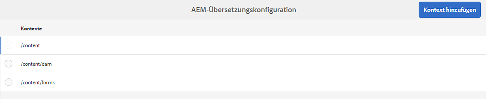
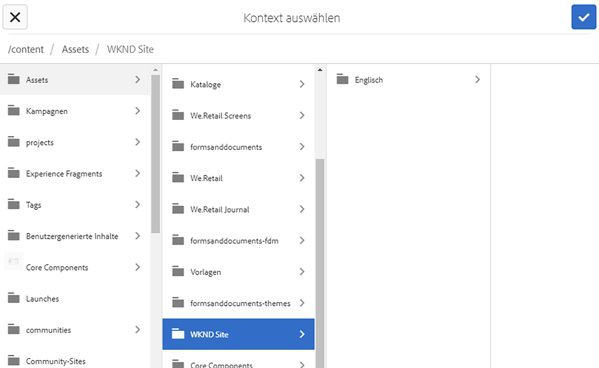
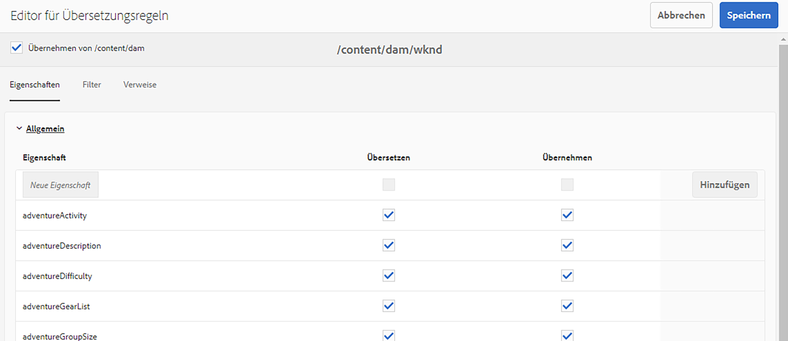
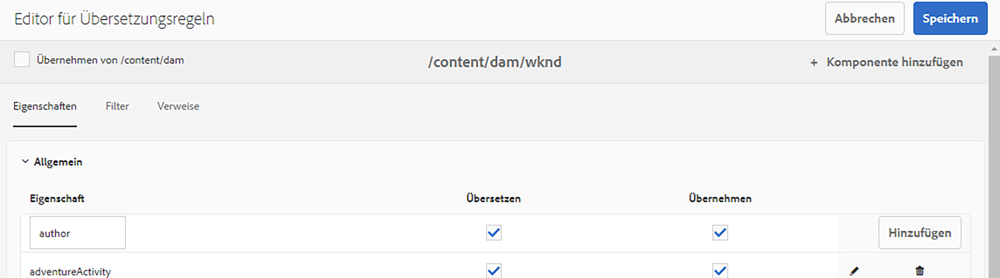

# Übersetzungsregeln konfigurieren {#configure-translation-rules}

Erfahren Sie, wie Sie Übersetzungsregeln definieren, um zu übersetzende Inhalte zu identifizieren.

## Die bisherige Entwicklung {#story-so-far}

Im vorherigen Dokument der Journey für die AEM Headless-Übersetzung [Konfigurieren des Übersetzungs-Connectors](configure-connector.md) Sie haben gelernt, wie Sie Ihren Übersetzungs-Connector installieren und konfigurieren, und sollten jetzt:

* Machen Sie sich mit den wichtigen Parametern des Translation Integration Framework in AEM vertraut.
* Sie können Ihre eigene Verbindung zu Ihrem Übersetzungsdienst einrichten.

Nachdem Sie Ihren Connector eingerichtet haben, führt Sie dieser Artikel durch den nächsten Schritt, um herauszufinden, welche Inhalte übersetzt werden müssen.

## Ziel {#objective}

In diesem Dokument erfahren Sie, wie Sie AEM Übersetzungsregeln zur Identifizierung Ihres Übersetzungsinhalts verwenden. Nach Lesen dieses Dokuments sollten Sie über Folgendes verfügen:

* Machen Sie sich mit den Übersetzungsregeln vertraut.
* Sie können Ihre eigenen Übersetzungsregeln definieren.

## Übersetzungsregeln {#translation-rules}

Inhaltsfragmente, die Ihren Headless-Inhalt darstellen, können viele Informationen enthalten, die nach strukturierten Feldern organisiert sind. Je nach Ihren Projektanforderungen müssen wahrscheinlich nicht alle Felder in einem Inhaltsfragment übersetzt werden.

Übersetzungsregeln identifizieren den Inhalt, der in Übersetzungsprojekten enthalten oder von diesen ausgeschlossen ist. Wenn Inhalte übersetzt werden, extrahiert AEM den Inhalt oder sammelt ihn anhand dieser Regeln. Auf diese Weise werden nur Inhalte an den Übersetzungsdienst gesendet, die übersetzt werden müssen.

Zu den Übersetzungsregeln gehören die folgenden Informationen:

* Der Pfad des Inhalts, für den die Regel gilt
   * Die Regel gilt auch für die untergeordneten Elemente des Inhalts
* Die Namen der Eigenschaften, die den zu übersetzenden Inhalt enthalten
   * Die Eigenschaft kann sich speziell auf einen bestimmten Ressourcentyp oder auf alle Ressourcentypen beziehen

Da Inhaltsfragmentmodelle, die die Struktur Ihrer Inhaltsfragmente definieren, für Ihr eigenes Projekt eindeutig sind, ist es wichtig, Übersetzungsregeln einzurichten, damit AEM weiß, welche Elemente Ihrer Inhaltsmodelle übersetzt werden sollen.

>[!TIP]
>
>Im Allgemeinen stellt der Inhaltsarchitekte dem Übersetzungsanbieter die **Eigenschaftsname** ist eines der Felder, die für die Übersetzung benötigt werden. Diese Namen sind erforderlich, um Übersetzungsregeln zu konfigurieren. Als Übersetzungsspezialist [diese **Eigenschaftsname** Selbst](getting-started.md#content-models) wie zuvor in dieser Journey beschrieben.

## Erstellen von Übersetzungsregeln {#creating-rules}

Es können mehrere Regeln erstellt werden, um komplexe Übersetzungsanforderungen zu unterstützen. Beispielsweise müssen für ein Projekt, an dem Sie arbeiten, alle Felder des Modells übersetzt werden, für ein anderes nur Beschreibungsfelder übersetzt werden, während Titel nicht übersetzt bleiben.

Übersetzungsregeln sind für solche Szenarien konzipiert. In diesem Beispiel veranschaulichen wir jedoch, wie Regeln erstellt werden, indem wir uns auf eine einfache, einzelne Konfiguration konzentrieren.

Es gibt eine **Übersetzungskonfiguration** -Konsole, die zum Konfigurieren von Übersetzungsregeln verfügbar ist. So können Sie darauf zugreifen:

1. Navigieren Sie zu **Instrumente** -> **Allgemein**.
1. Tippen oder klicken Sie auf **Übersetzungskonfiguration**.

Im **Übersetzungskonfiguration** -Benutzeroberfläche gibt es eine Reihe von Optionen für Ihre Übersetzungsregeln. Hier werden die wichtigsten und typischsten Schritte hervorgehoben, die für eine einfache, Headless-Lokalisierungskonfiguration erforderlich sind.

1. Tippen oder klicken Sie auf **Kontext hinzufügen**, mit dem Sie einen Pfad hinzufügen können. Dies ist der Pfad des Inhalts, der von der Regel betroffen ist.
   
1. Verwenden Sie den Pfad-Browser, um den erforderlichen Pfad auszuwählen, und tippen oder klicken Sie auf die **Bestätigen** zum Speichern. Denken Sie daran, dass Inhaltsfragmente, die Headless-Inhalte enthalten, sich im Allgemeinen unter `/content/dam/<your-project>`.
   
1. AEM speichert die Konfiguration.
1. Sie müssen den soeben erstellten Kontext auswählen und dann auf **Bearbeiten**. Dadurch wird die **Editor für Übersetzungsregeln** um die Eigenschaften zu konfigurieren.
   
1. Standardmäßig werden alle Konfigurationen vom übergeordneten Pfad übernommen, in diesem Fall `/content/dam`. Deaktivieren Sie die Option . **Vererben von`/content/dam`** um der Konfiguration zusätzliche Felder hinzuzufügen.
1. Ist diese Option deaktiviert, finden Sie unter der **Allgemein** Fügen Sie die Eigenschaftsnamen der von Ihnen erstellten Inhaltsfragmentmodelle hinzu. [zuvor als zu übersetzende Felder identifiziert.](getting-started.md#content-models)
   1. Geben Sie den Eigenschaftsnamen im **Neue Eigenschaft** -Feld.
   1. Die Optionen **Übersetzen** und **Vererben** automatisch aktiviert werden.
   1. Tippen oder klicken Sie auf **Hinzufügen**.
   1. Wiederholen Sie diese Schritte für alle Felder, die Sie übersetzen müssen.
   1. Tippen oder klicken Sie auf **Speichern**.
      

Sie haben jetzt Ihre Übersetzungsregeln konfiguriert.

## Erweiterte Verwendung {#advanced-usage}

Es gibt eine Reihe weiterer Eigenschaften, die als Teil Ihrer Übersetzungsregeln konfiguriert werden können. Darüber hinaus können Sie Ihre Regeln manuell als XML spezifizieren, was mehr Spezifität und Flexibilität ermöglicht.

Diese Funktionen sind im Allgemeinen nicht erforderlich, um mit der Lokalisierung Ihres Headless Content zu beginnen. Sie können jedoch weitere Informationen dazu im Abschnitt [Zusätzliche Ressourcen](#additional-resources) wenn Sie Interesse haben.

## Wie geht es weiter {#what-is-next}

Nachdem Sie nun diesen Teil der Headless-Übersetzungs-Journey abgeschlossen haben, sollten Sie:

* Machen Sie sich mit den Übersetzungsregeln vertraut.
* Sie können Ihre eigenen Übersetzungsregeln definieren.

Auf diesen Erkenntnissen aufbauen und Ihre Journey-zur Headless-AEM-Übersetzung fortsetzen, indem Sie das Dokument erneut überprüfen. [Inhalt übersetzen](translate-content.md) Hier erfahren Sie, wie Ihr Connector und Ihre Regeln zusammenarbeiten, um Headless-Inhalte zu übersetzen.

## Zusätzliche Ressourcen {#additional-resources}

Es wird empfohlen, zum nächsten Teil der Headless-Übersetzungs-Journey zu wechseln, indem Sie das Dokument lesen [Inhalt übersetzen](translate-content.md)Im Folgenden finden Sie einige zusätzliche optionale Ressourcen, die einen tieferen Einblick in einige der in diesem Dokument erwähnten Konzepte bieten, aber nicht auf dem Headless-Journey weiterarbeiten müssen.

* [Identifizieren von zu übersetzenden Inhalten](/help/sites-administering/tc-rules.md) - Erfahren Sie, wie Übersetzungsregeln Inhalte identifizieren, die übersetzt werden müssen.
