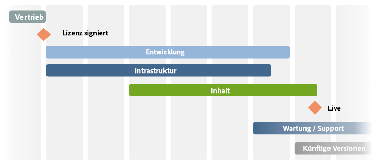
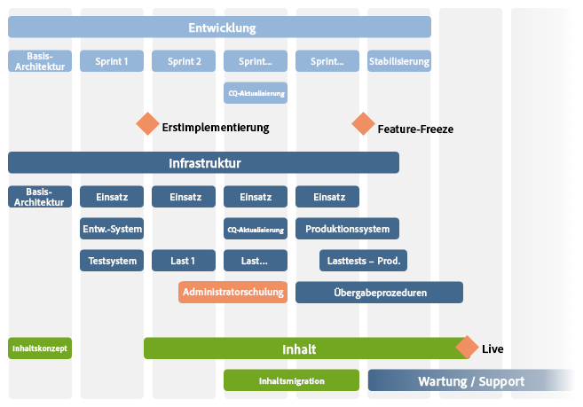

# Die Checkliste - Weitere Referenzen{#the-checklist-further-reference}

Auf dieser Seite finden Sie weitere Details, um die Dokumente und Prinzipien von [Verwalten von Projekten - Checkliste mit Best Practices](/help/managing/best-practices.md) auszuarbeiten bzw. zu ergänzen.

## AEM - Überblick über die Komponenten {#aem-what-will-you-be-using}

>[!CAUTION]
>
>Die Listen in diesem Unterabschnitt sind nicht erschöpfend, sondern als Einführung gedacht.

### Funktionen innerhalb von AEM  {#features-within-aem}

Bei der Implementierung von AEM (insbesondere zum ersten Mal) müssen Sie die [Funktionen und Workflows von AEM](https://www.adobe.com/de/marketing/experience-manager.html) überprüfen, um sicherzustellen, welche Bereiche Sie benötigen.

Beachten Sie die Funktionen von AEM, die Sie verwenden werden, und die Auswirkungen auf Ihr Design, zum Beispiel:

* [Commerce](/help/commerce/cif-classic/administering/ecommerce.md)
* [Screens](https://docs.adobe.com/content/help/de-DE/experience-manager-screens/user-guide/aem-screens-introduction.html)
* [Assets](/help/assets/assets.md)
* [Tags](/help/sites-administering/tags.md)
* [Multi-Site-Management und Übersetzung](/help/sites-administering/msm-and-translation.md)
* [Formulare](/help/forms/home.md)
* [Communities](/help/communities/deploy-communities.md)
* [Livefyre](https://answers.livefyre.com/product/livefyre-for-adobe-experience-manager-aem/livefyre-for-adobe-experience-manager/)

Überprüfen Sie außerdem die [Versionshinweise](/help/release-notes/release-notes.md) für die verschiedenen Versionen von AEM, um zu sehen, wann neue Funktionen hinzugefügt wurden.

### Integrationen {#integrations}

AEM kann mit anderen Adobe-Produkten und/oder Dienstleistungen von Drittanbietern integriert werden. Diese können die Ihnen zur Verfügung stehende Leistung und Funktionalität steigern.

Siehe [Lösungsintegration](/help/sites-administering/integration.md) für ausführliche Informationen.

## Migration oder Upgrade?  {#migrate-or-upgrade}

Es ist wichtig, dass Sie sich klar machen welche der beiden Alternativen Sie nutzen möchten:

* Upgrade der bestehenden Installation.
* Migration der Inhalte vom aktuellen System auf eine frische, neue Installation.

Beim Wechsel von einer Vorgängerversion zur aktuellen Version gibt es zwei Möglichkeiten

* Verwenden Sie den [Package Manager](/help/sites-administering/package-manager.md), um alle Inhalte und Anwendungscodes aus dem alten System in das neue System zu exportieren.
* [Upgrade](/help/sites-deploying/upgrade.md) des aktuellen Systems. Dies ist in den meisten Fällen die empfohlene Wahl.

## Grundregeln  {#basic-ground-rules}

Wie bei jedem Projekt ist es wichtig, so schnell wie möglich Grundregeln festzulegen. Dazu gehören:

>[!NOTE]
>
>Diese Punkte sind allgemein gehalten, die [Checkliste mit Best Practices](/help/managing/best-practices.md) behandelt Details zu AEM.

* **Rollen**

   Diese sollten klar definiert und allen Projektbeteiligten bekannt gemacht werden. Darüber hinaus ist es ratsam, Folgendes hervorzuheben:

   * Entscheidungsträger
   * Ansprechpartner

* **Verantwortlichkeiten**

   * Für jede Rolle hilft eine klare Definition der Verantwortlichkeiten im Zusammenhang mit Ihrem Projekt, Verwirrung zu vermeiden.

* **Mitwirkung**

   Indem Sie Interessenten so schnell wie möglich einbinden, können Sie sie ermutigen, *Projektbeteiligte* zu werden und so ihr Engagement für dessen Erfolg erhöhen.

   * Auf der Kundenseite sind dies die Autoren, die täglich mit dem System arbeiten müssen.
   * In Ihrem eigenen Projektteam sind dies auch die Verantwortlichen für die Qualitätssicherung. Je besser sie die Anforderungen des Kunden verstehen, desto besser können sie die Tests planen.

* **Kommunikationwege**

   * Obwohl diese nicht übermäßig formalisiert werden sollten, sollten spezifische Definitionen sicherstellen, dass die Schlüsselpersonen stets informiert und somit auf dem Laufenden gehalten werden. Besonderes Augenmerk sollte auf die Kommunikation mit externen Parteien gelegt werden.

* **Prozesse**

   Die zu definierenden Prozesse hängen von Ihrem individuellen Projekt ab. Versuchen Sie auch hier, die Umstände einfach zu halten hinsichtlich:

   * Definition von Prozessen (und Kommunikationswegen) für die Interaktion mit Dritten, z. B. Designagenturen und Softwarelieferanten.
   * Häufig verfügt der Kunde über eigene Projektmanagement- und Reporting-Verfahren und -Werkzeuge.

* **Tracking-Werkzeuge**

   Es gibt viele Tools, um Informationen über Fehler, Aufgaben und andere Aspekte Ihres Projekts zu verfolgen - siehe [Übersicht der möglichen Tools](#overview-of-potential-tools) für weitere Details.

   * Dabei ist es wichtig, nur eine Kopie der Informationen aufzubewahren und die Informationen (und damit den Zugriff auf das verwendete Tool) zu teilen. Dies erleichtert die Wartung und hilft, Unstimmigkeiten zu vermeiden.

* **Umfang**

   Definieren Sie klar, was das Projekt auf verschiedenen Ebenen abdecken soll:

   * die einzelnen Versionen (wenn ein periodischer Freigabeprozess verwendet wird und unabhängig davon, ob sie an Kunden oder Ihr internes Testteam ausgeliefert werden).
   * das AEM-Projekt.
   * das gesamte Projekt, einschließlich der Software von Drittanbietern, deren Auswirkungen auf Tests, organisatorische Fragen und viele andere.
   * Für bestimmte Aspekte kann es auch sinnvoll sein anzugeben, was *nicht* im Umfang des Projekts liegt. Dies kann dazu beitragen, Verwirrung und falsche Annahmen zu vermeiden, sollte sich aber auf das Wesentliche beschränken.

* **Berichterstellung**

   Definieren Sie klar, welche Informationen Sie in welcher Form, wie oft und an wen melden werden.

* **Terminologie**

   * Definieren Sie eventuell zu verwendende Abkürzungen und/oder kundenspezifische Terminologie.

* **Annahmen**

   * Definieren Sie die getroffenen Annahmen.

Diese Informationen können in einem Projekthandbuch definiert werden; die Verwendung eines Wikis kann auch dazu beitragen, dass laufende Änderungen effizient behandelt werden. Wo immer diese definiert sind, sind die Schlüsselfaktoren:

* Informationen werden definiert und gepflegt
* Die Informationen werden klar und deutlich an alle Beteiligten kommuniziert. Obwohl Standard-Projektmanagement-Praxis, kann es nicht oft genug wiederholt werden, dass eine klare Rollendefinition und gute Kommunikation entscheidend für den Erfolg eines Projekts sind.
* Von allen Informationen, die verfolgt werden, wird nur eine Version gespeichert, z. B. Bug-Verfolgung, Problem-Tracking usw.

## Leistungsindikatoren und Zielmetriken  {#key-performance-indicators-and-target-metrics}

Unternehmen verwenden Key Performance Indicators (KPIs), um ihren Erfolg bei der Erreichung von Zielen zu bewerten. Diese Indikatoren sind messbare Werte, die zeigen, wie effektiv bestimmte Ziele erreicht werden.

Diese Indikatoren können sein:

* Business:

   * Zur Messung der wichtigsten Unternehmensziele.
   * Es ist wichtig, KPIs zu wählen, die zu Ihrem Unternehmen/Szenario passen, mit klaren Definitionen dessen, was sie sind, wie sie gemessen werden, wie sie verwendet werden und von wem.

* Leistung:

   * Legen Sie fest, wie die Performance des Systems gemessen werden soll.
   * Einige Beispiele sind die Seitenladezeit, die Antwortzeit des Servers und die Leistung der Datenbankabfrage.

Einige, aber nicht alle Indikatoren können auf den Zielmetriken basieren, die Sie identifizieren und definieren.

### Ziel-Metriken {#target-metrics}

Metriken werden verwendet, um quantitative Messungen für die Qualität Ihrer Website zu definieren - sie sind im Wesentlichen eine Definition der Leistungsziele, die Sie erreichen wollen, und können zur Definition der [Key Performance Indicators (KPIs)](#key-performance-indicators-and-target-metrics) verwendet werden.

Sie können eine Vielzahl von Metriken definieren, die meisten decken jedoch die Ziele für Leistung und Gleichzeitigkeit ab. Insbesondere Faktoren, die schwer zu quantifizieren sind und *gefühlte* Wahrnehmung beinhalten:

* „Unsere Website ist heute *viel zu langsam*“ - wie qualifiziert sich *langsam*?

* „Alles *kommt zum Stillstand*, wenn sich mein Kollege einloggt“ - wie viele gleichzeitige Benutzer unterstützt das System?
* „Wenn ich eine Suchanfrage starte, kommt das *System zum Stillstand*“ - welche Art von Suchanfragen wirken sich auf das System aus?
* „Es *dauert ewig*, die Datei herunterzuladen“ - was sind akzeptable Downloadzeiten (unter normalen Netzwerkbedingungen)?

Zielmetriken werden zu Beginn eines Projektes definiert:

* Um die gewünschten Dimensionen der Website anzugeben, die Sie anbieten möchten.
* Um die Mindestqualität anzugeben, die erreicht werden soll.
* Um zu definieren, wie diese Faktoren gemessen werden.
* Als Basis für die [Key Performance Indicators](#key-performance-indicators-and-target-metrics).

Wie immer ist bei der Definition der Zielmetriken Vorsicht geboten:

* Wenn sie zu hoch eingestellt sind, können sie völlig unerreichbar sein.
* Wenn sie zu gering eingestellt sind, werden Schwankungen möglicherweise nicht hervorgehoben.
* Sie müssen sicherstellen, dass sie wiederholt und konsistent gemessen werden können.
* Sie müssen einen Ausgleich zwischen den verschiedenen zu messenden Faktoren zu schaffen.
* Bestimmte Metriken beziehen sich auf eine Testumgebung, aber einige sollten reale Szenarien widerspiegeln, da sie auf Ihrer Produktionswebsite messbar und reproduzierbar sein müssen.
* Priorisieren Sie die Metriken entsprechend ihrer Bedeutung für die Website.
* Beschränken Sie die Metriken auf eine Menge, die realistisch überwacht werden kann

Während der Entwicklung des Projekts können sie aktualisiert und entsprechend angepasst werden. Nachdem das Projekt erfolgreich umgesetzt wurde, können sie Ihnen helfen, Ihre Installation zu steuern und die erforderlichen Servicelevel für den laufenden Betrieb zu überwachen und aufrechtzuerhalten.

Bei richtiger Anwendung können diese Metriken ein nützliches Werkzeug sein; bei unverantwortlicher Anwendung können sie eine zeitraubende Ablenkung darstellen. Wie immer müssen Sie verstehen, was Sie messen, wie Sie es messen und warum.

>[!NOTE]
>
>In diesem Abschnitt werden die Grundprinzipien und Fragen behandelt, die zu berücksichtigen sind. Jede Installation ist anders beschaffen, sodass sich die tatsächlich zu messenden Werte unterscheiden

### Alles dies beruht auf Ihrem Projektdesign  {#everything-rests-on-your-project-design}

Alle zu messenden Metriken werden auf irgendeine Weise durch den Entwurf des Projekts beeinflusst. Umgekehrt lassen sich viele Probleme am besten durch Entwurfsänderungen lösen.

Deshalb sollten Sie Ihre Zielmetriken definieren, *bevor*Sie sich für Ihr Design entscheiden. 
So können Sie Ihr Design auf Basis dieser Faktoren optimieren. So können Sie Ihr Design auf Basis dieser Faktoren optimieren. Sobald Ihr Projekt entwickelt ist, wird es schwierig, Änderungen an den grundlegenden Entwurfsprinzipien vorzunehmen.

Wenn Sie die Struktur für die Website erstellen, folgen Sie der empfohlenen Struktur für AEM Sites. Stellen Sie sicher, dass Sie die folgenden Punkte und/oder Prinzipien verstehen:

* Wie der Inhalt der Website strukturiert ist.
* Wie Vorlagen und Komponenten funktionieren.
* Wie Zwischenspeicherung funktioniert.
* Die Auswirkungen personalisierter Inhalte.
* Wie die Suchfunktion funktioniert.
* Wie Sie CSS und verwandte Technologien nutzen können, um kompakten, nicht redundanten HTML-Code zu erstellen.

Wenn Sie der Meinung sind, dass Ihr Design nicht den Richtlinien entspricht, oder wenn Sie sich über einige der Auswirkungen unsicher sind, klären Sie diese Fragen, bevor Sie entweder mit der Programmierphase beginnen oder den Inhalt ausfüllen.

### Infrastruktur {#infrastructure}

Um die Infrastruktur zu definieren oder zu bewerten, hilft es, Zielwerte zu definieren, wie z. B.:

* Besucher/Tag; sowohl Durchschnitt als auch Spitze
* Aufrufe/Tag; sowohl Durchschnitt als auch Spitze
* Anzahl der zur Verfügung gestellten Webseiten
* Volumen des Webinhalts

Abhängig von Ihrer Situation und der strategischen Bedeutung der Website hilft Ihnen dies bei der Bewertung und Auswahl Ihrer Infrastruktur:

* Anzahl der Server
* Anzahl der AEM-Instanzen (Autor und Veröffentlichung)

### Leistung {#performance}

Es gibt mehrere Leistungsfaktoren, die ausgewertet werden können:

* Antwortzeiten für einzelne Seiten unter Berücksichtigung von:

   * Antwortzeiten in einer Autorenumgebung
   * Antwortzeiten in der Veröffentlichungsumgebung

* Antwortzeiten für Suchanfragen

Dieser Abschnitt kann in Verbindung mit [Leistungsoptimierung](/help/sites-deploying/configuring-performance.md) gelesen werden, die die technischen Details zur tatsächlichen Leistungsmessung erweitert.

#### Antwortzeiten für einzelne Seiten {#response-times-for-individual-pages}

Ein wichtiger Faktor ist die Zeit, die Ihre Website benötigt, um auf Anforderungen durch Besucher zu reagieren.

Obwohl dieser Wert für jede Anforderung anders ist, kann ein durchschnittlicher Zielwert definiert werden. Sobald sich gezeigt hat, dass dieser Wert längerfristig erreichbar ist, kann er verwendet werden, um die Leistung der Website zu überwachen und auf potenzielle Probleme hinzuweisen

Unterschiedliche Ziele für Autoren- und Veröffentlichungsumgebung

Die Antwortzeiten, die Sie anstreben, sind je nach Autoren- und Veröffentlichungsumgebung unterschiedlich und spiegeln die Zielgruppe wider:

* **Autorenumgebung**

   Diese Umgebung wird von Autoren benutzt, die Inhalte eingeben und aktualisieren, also muss sie:

   * einer kleinen Anzahl von Nutzern gerecht werden, die bei der Aktualisierung von Inhaltsseiten und den einzelnen Elementen auf diesen Seiten eine hohe Anzahl von Aufrufen erzeugen
   * so schnell wie möglich sein, um ihre Produktivität zu maximieren und die Inhalte auf die Website bringen.

* **Veröffentlichungsumgebung**

   Diese Umgebung enthält Inhalte, die Sie Ihren Benutzern zugänglich machen:

   * Geschwindigkeit ist auch hier wichtig, darf aber gewöhnlich langsamer sein als in der Autorenumgebung.
   * häufig werden zusätzliche leistungssteigernde Mechanismen eingesetzt:

      * Der Inhalt wird zwischengespeichert
      * Lastausgleich wird angewendet

#### Zielvorgabe für Antwortzeiten festlegen  {#setting-target-response-times}

Wie können Sie die erreichbaren (durchschnittlichen) Antwortzeiten bestimmen? Dies ist häufig eine Frage der Erfahrung:

* bisherige Erfahrungen auf Ihrer Website
* Erfahrung mit AEM
* Erkennen von komplexen Seiten mit überdurchschnittlichen Antwortzeiten (diese sollten möglichst individuell optimiert werden)

Allerdings können (unter kontrollierten Umständen) die folgenden Richtlinien angewendet werden:

* 70 % der Seitenanfragen sollten in weniger als 100 ms beantwortet werden.
* 25 % der Seitenanfragen sollten in weniger als 100 ms–300 ms beantwortet werden.
* 4 % der Seitenanfragen sollten in weniger als 300 ms–500 ms beantwortet werden.
* 1 % der Seitenanfragen sollten in weniger als 500 ms–1000 ms beantwortet werden.
* Keine Seite sollte langsamer als 1 Sekunde reagieren.

Bei den obigen Zahlen gelten die folgenden Bedingungen:

* gemessen in der Veröffentlichungsumgebung (nicht Autorenumgebung und/oder CFC-Overhead)
* gemessen auf dem Server (kein Netzwerk-Overhead)
* nicht zwischengespeichert (kein AEM-Ausgabe-Cache, kein Dispatcher-Cache)
* nur für komplexe Objekte mit vielen Abhängigkeiten (HTML, JS, PDF usw.)
* keine andere Last auf dem System

Es gibt verschiedene Möglichkeiten, die Sie verwenden können, um die Antwortzeiten zu überwachen:

* **Überwachung der Antwortzeiten mit dem AEM request.log**

   Ein guter Ausgangspunkt für Leistungsanalysen ist das Anforderungsprotokoll. Hier können Sie u.a. die Antwortzeiten einzelner Anfragen einsehen. Siehe [Leistungsoptimierung](/help/sites-deploying/configuring-performance.md) für weitere Informationen.

* **Überwachen von Antwortzeiten mit HTML-Kommentaren**

   HTML-Kommentare können verwendet werden, um Informationen zur Antwortzeit in die Quelle jeder Seite einzufügen:

   `</body> </html>v <-- Page took 58 milliseconds to be rendered by the server --> Response times for search requests`

#### Suchanfragen {#search-requests}

Suchanfragen können im Hinblick auf folgende Bereiche einen erheblichen Einfluss auf Ihre Website haben:

* Antwortzeit der eigentlichen Suche

   * Eine schnelle Suchfunktion ist ein Qualitätsziel für Ihre Website.

* Auswirkungen auf die allgemeine Leistung

   * Da eine Suchfunktion (möglicherweise große) Teile des Inhalts oder einen speziell extrahierten Index scannen muss, kann dies die Performance des gesamten Systems beeinträchtigen, wenn sie nicht optimiert wird.

Das Setzen von Zielen für Suchanfragen ist wiederum eine Frage der Erfahrung:

* Erfahrung mit AEM
* Einschätzung, wie oft die Suche im Vergleich zu anderen Zielen genutzt wird
* Persistenzmanager
* Suchindex
* Komplexität der Suchfunktion; eine einfache Suchfunktion, bei der nur 1 Suchbegriff eingegeben werden kann, ist schneller als eine erweiterte Suche, bei der der Benutzer komplexe Suchanweisungen mit UND/ODER/NICHT erstellen kann.

Diese sollten von Anfang des Projekts an geplant und integriert werden. Für die Überwachung stehen u.a. folgende Mechanismen zur Verfügung:

* **Überwachung der Suchantwortzeiten mit request.log von AEM**

   Auch hier kann request.log verwendet werden, um die Antwortzeiten für Suchanfragen zu überwachen; siehe [Leistungsoptimierung](/help/sites-deploying/configuring-performance.md) für weitere Details.

* **Programmierte Mechanismen zur Messung der Suchantwortzeiten**

   Um die von Ihnen gesammelten Informationen über Suchanfragen und deren Leistung anzupassen, wird empfohlen, die Informationssammlung in Ihren Projekt-Quellcode aufzunehmen; siehe [Performanceoptimierung](/help/sites-deploying/configuring-performance.md) für weitere Details.

### Gleichzeitigkeit {#concurrency}

Ihre Website wird einer Reihe von Benutzern/Besuchern zur Verfügung gestellt, sowohl in der Autoren- als auch in der Veröffentlichungsumgebung. Die Zahlen sind oft höher als beim Testen, aber auch schwankend und schwer vorhersehbar. Die Website muss für eine durchschnittliche Anzahl von gleichzeitigen Benutzern/Besuchern konzipiert sein, ohne dass dabei eine negative Auswirkung auf die Performance auftritt. Auch hier kann `request.log` verwendet werden, um Parallelitätstests durchzuführen; siehe [Performanceoptimierung](/help/sites-deploying/configuring-performance.md) für weitere Details.

Ziele für die Anzahl der gleichzeitigen Benutzer sind abhängig von der Art der Umgebung:

* **Autorenumgebung**

   * In der Regel kann die Anzahl der gleichzeitigen Benutzer genau geschätzt werden. Sie wissen, wie viele Autoren Sie insgesamt haben, obwohl (wahrscheinlich) nicht alle gleichzeitig aktiv sind.

* **Veröffentlichungsumgebung**

   * Dies ist schwieriger vorherzusagen, es sollte daher ein Zielwert ausgewählt werden. Auch dies sollte auf der Erfahrung Ihrer aktuellen Website zusammen mit realistischen Erwartungen an Ihre neue Website basieren.
   * Spezielle Veranstaltungen (z. B. wenn Sie neue, sehr beliebte Inhalte veröffentlichen) können die Erwartungen übertreffen - oder sogar die Möglichkeiten (wie manchmal in der Presse berichtet wird, wenn Tickets für bestimmte Veranstaltungen zum Verkauf angeboten werden).

### Kapazität und Volumen  {#capacity-and-volume}

Bevor wir die entsprechenden Metriken besprechen, eine schnelle Definition der Begriffe:

* **Volumen**

   * Die Menge an Ausgabedaten, die vom System verarbeitet und geliefert wird.

* **Kapazität**

   * Die Fähigkeit des Systems, das Volumen zu liefern.
   * Bei jedem Schritt werden Kapazität und Volumen unterschiedlich gemessen, wie in der folgenden Tabelle dargestellt. Um eine optimale Leistung zu erzielen, stellen Sie sicher, dass die Kapazität bei jedem Schritt dem Volumen entspricht und dass sowohl die Kapazität als auch das Volumen über alle Schritte verteilt sind. Beispielsweise können Sie die Navigation auf dem Client-Computer berechnen oder in den Cache legen, anstatt sie für jede Anfrage auf dem Server zu berechnen.

* **Kapazität und Volumen**

   | Was/Wo | Kapazität | Volumen |
   |---|---|---|
   | Client | Rechenleistung des Computers des Benutzers. | Komplexität des Seitenlayouts. |
   | Netzwerk | Netzwerkbandbreite. | Größe der Seite (Code, Bilder usw.). |
   | Dispatcher-Cache | Serverspeicher des Webservers (Hauptspeicher und Festplatte). | Webserver (Hauptspeicher und Festplatte). Anzahl und Größe der zwischengespeicherten Seiten. |
   | Output Cache | Serverspeicher des AEM-Servers (Hauptspeicher und Festplatte). | Anzahl und Größe der Seiten im Ausgabe-Zwischenspeicher, die Anzahl der Abhängigkeiten pro Seite. Der Dispatcher-Zwischenspeicher senkt dieses Volumen. |
   | Webserver | Rechenleistung des Webservers. | Anzahl der Anfragen. Der Zwischenspeicher senkt dieses Volumen. |
   | Vorlage | Rechenleistung des Webservers. | Komplexität der Vorlagen. |
   | Repository | Leistung des Repositorys. | Anzahl der aus dem Repository geladenen Seiten. |

### Andere Metriken {#other-metrics}

In den vorhergehenden Abschnitten werden die wichtigsten zu definierenden Metriken beschrieben.

Je nach Ihren spezifischen Anforderungen kann es sinnvoll sein, zusätzliche Metriken zu definieren, entweder isoliert oder unter Berücksichtigung der oben genannten Klassifizierungen.

Es ist jedoch besser, einen kleinen Satz von genauen, zentralen Metriken zu haben, die einfach und zuverlässig funktionieren, als zu versuchen, jeden Aspekt Ihrer Website zu messen und zu definieren. Durch ihre schiere Natur beginnt sich Ihre Website zu verändern und zu entwickeln, sobald sie Ihren Benutzern übergeben wird.

## Sicherheit {#security}

Sicherheit ist entscheidend und eine immer größere Herausforderung. Sie ***muss*** von Anfang an berücksichtigt und geplant werden.

Die [Sicherheits-Checkliste](/help/sites-administering/security-checklist.md) beschreibt die Schritte, die Sie unternehmen sollten, um sicherzustellen, dass Ihre AEM-Installation bei der Bereitstellung sicher ist. Weitere Sicherheitsaspekte werden unter [Sicherheit (bei der Entwicklung)](/help/sites-developing/security.md) und [Benutzerverwaltung und Sicherheit](/help/sites-administering/security.md) behandelt.

## Parallele und iterative Aufgaben {#parallel-and-iterative-tasks}

>[!NOTE]
>
>Das Folgende:
>
>* Bietet einen Überblick über die *first*-Implementierung eines AEM Projekts.
>* Ist als abstrakte Übersicht gedacht; siehe [Projekt-Checkliste](/help/managing/best-practices.md) für bestimmte Phasen/Milestones/Aufgaben.
>* Jede Zeitskala ist theoretisch.

>

Für eine Neuimplementierung eines Standard-AEM-Projekts müssen Sie u.a. folgende Aufgaben berücksichtigen:

* Übergabe aus dem Verkaufsprozess.
* Implementierung der Kundenanwendung (**Entwicklung**).
* Installation und Konfiguration der Infrastruktur (und der zugehörigen Prozesse) auf der Site des Kunden (**Infrastruktur**).
* Erstellung (oder Migration) des Inhalts (**Inhalt**).
* Übergabe an den Betrieb (**Wartung/Support**).
* Folgefreigaben.

Für alle Aspekte wird ein periodischer Ansatz empfohlen:

>[!NOTE]
>
>Teilen Sie den Projektstart in **Soft Launch** (reduzierte Verfügbarkeit, mehrere Iterationen) und **Hard Launch** (volle Verfügbarkeit - Live) auf, um eine Abstimmung, Optimierung und Anwenderschulung unter realistischen Bedingungen in der Produktionsumgebung zu ermöglichen.

>[!NOTE]
>
>In der [Projekt-Checkliste](/help/managing/best-practices.md) finden Sie Beispiele für Aufgaben, die Sie während des Lebenszyklus Ihres Projekts durchführen (oder bewerten) sollten.

Einige Punkte, die für jede Kategorie zu beachten sind:

* **Entwicklung**

   * Definieren Sie zunächst die Basisarchitektur.
   * Verwenden Sie mehrere Durchgänge (Sprints) für die Entwicklung:

      * Der erste Sprint entspricht dem ersten vollen Entwicklungszyklus.
      * Der erste Sprint führt zum ersten Einsatz in Ihrer Testumgebung.
      * Jeder Sprint hat ein lauffähiges Ergebnis.
      * Jeder Sprint erhält eine Kundenabnahme (Minimum an strukturiertem Test mit Feedback).
   * Planen Sie den Fall eines Updates der verfügbaren AEM-Version während des Projekts mit ein.
   * Planen Sie Tests und Optimierungen während des Sprints mit ein.
   * Planen Sie Stabilisierungs- und Optimierungsphasen.
   * Erstellen Sie ein Protokoll der zu planenden Positionen für weitere Releases
   * Planung der Partnerbeteiligung und -übergabe.

* **Infrastruktur**

   * Definieren Sie zunächst die Basisarchitektur:

      * Definieren Sie Leistungsanforderungen.
      * Definieren Sie Leistungsziele (d. h. Erwartungen klar definieren).
      * Definieren Sie Hardware- und Infrastrukturarchitektur; einschließlich der Größenbestimmung.
      * Definieren Sie die Bereitstellung
   * Verwenden Sie mehrere Durchgänge; bereiten Sie für den ersten Sprint und die erste Konfiguration Folgendes vor:

      * Bereitstellungsumgebung.
      * Entwicklungsprozess.
      * Testumgebung.
      * Bereitstellungsprozess (einschließlich Konfigurationsmanagement).
   * Planen Sie mehrere Belastungstests.
   * Planen Sie Tests und Optimierungen während des Sprints mit ein.
   * Planen Sie eine Stabilisierungs- und Optimierungsphase.
   * Stellen Sie das System so früh wie möglich in der Produktionsumgebung bereit (lassen Sie das Betriebsteam das System einrichten, um Erfahrungen zu sammeln).
   * Verwenden Sie benannte Benutzer und definierte Rollen so früh wie möglich.
   * Planen Sie das Training (z. B. Administrator-Training).
   * Planen Sie die Übergabe an den Betrieb.

* **Inhalt**

   * Die Grundarchitektur:
      * Steuert die Inhaltshierarchie.
      * Hilft bei der Definition des Inhaltskonzepts.
      * Definiert die Verwendung und das Layout von MSM.
      * Definiert Rollen, Gruppen, Workflows und Berechtigungen.
   * Überlegen Sie, ob die Offline-Seitenerstellung sinnvoll ist.
   * Planen Sie die frühzeitige Erstellung von ersten Seiten und Inhalten (für Tests und Feedback).
   * Planen Sie die Migration bestehender Inhalte.
   * Planen Sie „In-Sprint-Migration“ nach der Überarbeitung.
   * Planen Sie „Inhalts-Burndown“ (Sitemap für Go-Live-Inhalte).

## Schätzung von Zeit und Aufwand  {#estimating-time-and-effort}

Abhängig von Ihrer resultierenden Aufgabenliste können Sie dann erste Schätzungen des Aufwands für (hochrangige) Aufgabendefinitionen vornehmen. Diese sollten einen Hinweis enthalten, wer (Kunde oder Partner) was und wann tun wird.

Die folgende Liste zeigt Standardannäherungen und Zusammenhänge des Aufwands und damit der Kosten:

>[!CAUTION]
>
>Diese Zahlen können nur für erste Schätzungen verwendet werden. Ein erfahrener AEM-Entwickler muss die detaillierte Analyse durchführen.

| Schritt | Aufwand |
|---|---|
| Entwicklung | Eine grobe Schätzung von 2-4 Stunden für jeden Komponentenknoten deckt alle Entwicklungsanforderungen ab. |
| Entwicklertests | 15 % der Entwicklung |
| Folgemaßnahmen | 10 % der Entwicklung |
| Dokumentation | 15 % der Entwicklung |
| JavaDoc-Dokumentation | 10 % der Entwicklung |
| Fehlerbehebung | 15 % der Entwicklung |
| Projektmanagement | 20% der Projektkosten für laufende Projektverwaltung und Governance |

Die Detailplanung kann dann verfügbare oder benötigte Ressourcen mit Terminen und Kosten verknüpfen.

## Referenzarchitektur {#reference-architecture}

Die Referenzarchitektur dient als Vorlage für die AEM-Architektur. Die Referenzarchitektur adressiert Probleme, die bei Unternehmenssystemen häufig auftreten, einschließlich Skalierung, Zuverlässigkeit und Sicherheit.

Die folgenden Site-Metriken sollten definiert werden:

| Klassifizierung | Definition |
|---|---|
| Anzahl der Websites |  |
| Anzahl der Intranet-Sites |  |
| Anzahl der Codegrundlagen (z. B. wenn Internet und Intranet unterschiedlich sind) |  |
| Anzahl einzelner Seiten |  |
| Anzahl der Site-Besuche/-Tage |  |
| Anzahl der Seitenansichten/Tag |  |
| Datenübertragung (in GB)/Tag |  |
| Anzahl gleichzeitiger Benutzer (geschlossene Benutzergruppe) |  |
| Anzahl der gleichzeitigen Besucher (Veröffentlichung) |  |
| Anzahl der gleichzeitigen Autoren |  |
| Anzahl der registrierten Autoren |  |
| Anzahl der Seitenaktivierungen / Arbeitstag |  |
| Anzahl der Seitenaktivierungen während der Bereitstellung |  |

## Übersicht der möglichen Werkzeuge {#overview-of-potential-tools}

Die folgende Liste informiert Sie über die verwendbaren Werkzeuge. Sie ist als Einführung gedacht, nicht als umfangreiche Empfehlungsliste, und sollte Sie sicherlich nicht davon abhalten, andere Tools zu verwenden, die Sie bevorzugen.

<table>
 <tbody>
  <tr>
   <td><strong>Produkt</strong></td>
   <td><strong>Beschreibung</strong></td>
  </tr>
  <tr>
   <td>AEM</td>
   <td>
AEM bietet eine Reihe von Mechanismen, mit denen Sie Ihre Anwendung überwachen, testen, untersuchen und debuggen können. einschließlich:

    <ul>
     <li><a href="/help/sites-developing/developer-mode.md">Entwicklermodus</a></li>
     <li>Die <a href="/help/sites-developing/hobbes.md">Testkonsole</a></li>
     <li><a href="/help/sites-administering/operations-dashboard.md">Vorgangs-Dashboard</a></li>
     <li><a href="/help/sites-authoring/content-insights.md">Inhaltseinblick </a></li>
     <li>Die <a href="/help/sites-authoring/author-environment-tools.md#content-tree">Inhaltsstruktur</a></li>
    </ul> </td>
  </tr>
  <tr>
   <td> </td>
   <td> </td>
  </tr>
  <tr>
   <td>Selenium</td>
   <td> Selenium ist ein Open-Source-Test-Tool. Die Tests laufen direkt im Browser ab und emulieren, wie Ihre Benutzer arbeiten.</td>
  </tr>
  <tr>
   <td>Microsoft Project</td>
   <td>Ein häufig verwendetes Projektmanagement-Tool.</td>
  </tr>
  <tr>
   <td>Jira</td>
   <td> Jirais ist ein Open Source-Tool zum Verfolgen und Verwalten von Details Ihrer Softwarefehler. Arbeitsabläufe können bei Bedarf auf die Fehlerdetails angewendet werden.</td>
  </tr>
  <tr>
   <td>Git</td>
   <td> Gibt eine Revisionskontrollsoftware an.</td>
  </tr>
  <tr>
   <td>Eclipse</td>
   <td>
Eclipse ist eine Open Source IDE, die aus verschiedenen Projekten besteht. Diese konzentrieren sich auf den Aufbau einer offenen Entwicklungsplattform, die aus erweiterbaren Frameworks, Tools und Laufzeiten für die Erstellung, Bereitstellung und Verwaltung von Software über den gesamten Lebenszyklus besteht.
 
Weitere Informationen finden Sie unter <a href="/help/sites-developing/howto-projects-eclipse.md">AEM mit Eclipse entwickeln</a> .
 </td>
  </tr>
  <tr>
   <td>IntelliJ</td>
   <td>
Eine professionelle (und damit lizenzkostenpflichtige) IDE mit einer umfassenden Palette von Funktionen. 
 
Weitere Informationen finden Sie unter <a href="/help/sites-developing/ht-intellij.md">AEM mit IntelliJ IDEA</a> entwickeln .
 </td>
  </tr>
  <tr>
   <td>Maven</td>
   <td> Mavenis ist ein Software-Projekt-Management- und Verständniswerkzeug, das den Build-Prozess eines Projekts (Software und Dokumentation) verwalten kann.</td>
  </tr>
 </tbody>
</table>

## Weiterführende Literatur {#further-reading}

Darüber hinaus sind die folgenden Abschnitte von besonderem Interesse:

* [Erste Schritte](/help/sites-deploying/deploy.md#getting-started)
* [Technische Anforderungen](/help/sites-deploying/technical-requirements.md)
* [Überwachung und Pflege Ihrer Instanz](/help/sites-deploying/monitoring-and-maintaining.md)

### Best Practices {#best-practices}

Adobe bietet weitere Best Practices für alle Phasen und Zielgruppen:

* [Bereitstellen](/help/sites-deploying/best-practices.md)
* [Authoring – ](/help/sites-authoring/best-practices.md)
* [Verwalten](/help/sites-administering/administer-best-practices.md)
* [Entwickeln](/help/sites-developing/best-practices.md)
* [Projektmanagement](/help/managing/best-practices.md)
