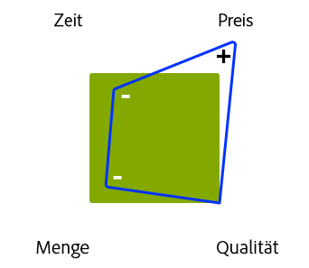

# Verwalten von Projekten - Checkliste mit Best Practices{#managing-projects-best-practices-checklist}

Die Verwaltung eines Projekts zur Implementierung von Adobe Experience Manager (AEM) erfordert Planung und Know-how, um sicherzustellen, dass Sie sich der Probleme und Entscheidungen bewusst sind, die Sie sowohl vor als auch während der Implementierung des Projekts treffen müssen.

Als Hilfestellung für Sie umfassen die Best Practices Folgendes:

* [interaktive Checkliste](/help/managing/best-practices-checklist.md), die es ermöglicht den Fortschritt mit diesen Best Practices nachzuverfolgen und zu überwachen;

   * definiert Input und Ergebnisse nach Phase, Milestone und Rolle
   * bietet automatische Übersichten (Qualität, Konsistenz und Vollständigkeit), um den Fortschritt und die Konsistenz des Projekts anzuzeigen

* Dokumentation, die direkt auf der [Checkliste](/help/managing/best-practices-checklist.md) basiert, mit folgenden Details:

   * [Projekt-](#projectheartbeat) Heartbeat-Analyse.
   * [Status nach ](#status-by-role) Roleoverview.
   * [Phasen und Milestones](#phases-and-milestones)
   * [Schlüsselrolle](#persona) und deren Beteiligung in jeder (relevanten) Phase
   * Ein [Glossar](/help/managing/best-practices-glossary.md) von [Erforderliche Dokumente und Lieferziele](#required-documents-and-deliverables).

* [Weiterführendes Referenzmaterial](/help/managing/best-practices-further-reference.md) für zusätzliche Informationen zu bestimmten Bereichen.

## Dashboard für den Projekt-Heartbeat {#project-heartbeat-dashboard}

Das Arbeitsblatt zum **Projekt-Heartbeat** gibt eine graphische Übersicht über die wichtigsten Parameter des Projekts:

* **Phasenqualität**

   * Zeigt die Qualität der [notwendigen Dokumente und Ergebnisse](#required-documents-and-deliverables) für das gesamte Projekt an.

* **Phasenkonsistenz**

   * Eine detaillierte Statusanzeige für das Projekt; nützlich, um Bereiche herauszustellen, die gefährdet sein könnten.

* **Phasenvollständigkeit**

   * Zeigt zu jedem Zeitpunkt des Projekts an, wie viel bereits in den jeweiligen Phasen des Projekts abgeschlossen wurde.

## Status nach Rolle  {#status-by-role}

Das Arbeitsblatt **Status nach Rolle** zeigt eine detaillierte Aufstellung der [**Konsistenz**, **Qualität** und **Vollständigkeit**](#projectheartbeat), sortiert nach **[Phase](#phases-and-milestones)** und **[Rolle](#persona)**.

## Phasen und Milestones {#phases-and-milestones}

Der Projektplan wird in einzelne (grobe) Phasen unterteilt.

Jede Phase enthält ihre eigenen Milestones. Für jede [persona](#persona) (oder Rolle) werden die relevanten Meilensteine aufgelistet, zusammen mit den Dokumenten, die zur Erstellung der definierten Lieferziele erforderlich sind.

>[!NOTE]
>
>Es gibt keine direkte 1:1-Beziehung zwischen den einzelnen erforderlichen Dokumenten und Ergebnissen.

### Vorbereitung {#preparation}

Die Vorbereitung des Projekts bildet die Grundlage für das gesamte Projekt. Sie müssen Schlüsselanforderungen gemeinsam mit klaren Zielen und Erwartungen für die folgenden Bereiche definieren:

* **Geschäftsgrundsatz**

   * Die grundlegenden Gründe und Rechtfertigung für die Umsetzung des Projekts.

* **Umfang und Zeitplan**

   * Ein grundlegender Umfang und grober Zeitplan sollten zur Verfügung gestellt werden, um zu definieren, was notwendig ist und in welchem Zeitrahmen. Dieser Umfang hilft dabei, Klarheit über die Situation zu schaffen, und kann außerdem festlegen, was außerhalb dieses Umfangs liegt.

Wie Sie Ihr Projekt planen, ausführen und Ihre Lösung implementieren, ist abhängig von den Einschränkungen, denen Sie unterliegen, z. B. festes Budget, fester Zeitplan, Menge des Inhalts, erforderliche Qualität.

Wie immer hat die Anpassung eines dieser Faktoren Auswirkungen auf die anderen. Eine Verkürzung der Zeit bei gleichbleibender Qualität beispielsweise führt wahrscheinlich zu einem Preisanstieg bei gleichzeitiger Reduktion der Menge an Inhalten, die bearbeitet werden können. Das Budget ist häufig ein Schlüsselfaktor und ein solcher Aspekt darf nicht vergessen werden.

Die vier Faktoren:

#### Milestones {#milestones}

* **Validierung**

   In dieser Phase müssen Sie die Ziele des Projekts bestätigen und validieren, z. B.:

   * Was möchten Sie erreichen/anbieten?
   * Wer profitiert davon?
   * Was ist der Umfang?

      * Wenn es zur Klärung der Situation beiträgt, können Sie auch definieren, was außerhalb des Umfangs liegt.
   * Wie definieren Sie Erfolg?
   * Wie messen Sie Erfolg?
   * Welche technischen und geschäftlichen Anforderungen gibt es?
   * Gibt es bestehende alte Systeme, die ersetzt werden müssen, und wenn ja, müssen Daten verschoben werden?
   * Wer ist beteiligt?
   * Wie messen Sie den Fortschritt?
   * Wie oft überprüfen Sie den Fortschritt während der Dauer des Projekts?

* **Budget**

   Bevor Sie ein Projekt beginnen, benötigen Sie eine zuverlässige, realistische Schätzung der Kosten für dessen Implementierung:

   * Verwenden Sie die Informationen aus den Validierungs-Milestones als Grundlage für die Berechnung.
   * Seien Sie bei den Schätzungen realistisch.
   * Berücksichtigen Sie Richtlinien, Verfahren oder Einschränkungen, denen der Kunde möglicherweise unterliegt.
   * Berücksichtigen Sie Notfallpläne und Überprüfungsverfahren für den Fall, dass eine Überprüfung oder Verfeinerung des Budgets zu einem späteren Zeitpunkt notwendig sein sollte.
   * Bedenken Sie, dass Kosten auf viele Arten entstehen, unter anderem durch Einkäufe, Verwendung von Ressourcen und Gebühren.

### Planung {#planning}

Die Planung des Projekts vertieft die Vorbereitung. Beginnen Sie damit, Ihre Ziele und Erwartungen in eine sorgfältig formulierte Roadmap umzuwandeln, die aus konkreten Aufgaben besteht, an eine klare Kommunikation gebunden ist und strenge Überprüfungen zur Messung des Fortschritts enthält.

#### Milestones  {#milestones-1}

* **Übergabe**

   Eine saubere Übergabe gewährleistet, dass die entsprechende Rolle/Gruppe sich ihrer Verantwortlichkeiten innerhalb des Projekts bewusst ist.

   Vollständige Details sollten zur Verfügung gestellt bzw. erstellt werden, um zu gewährleisten, dass alle relevanten Aspekte vollständig klar sind, einschließlich Roadmap, Umfang, Anforderungen und KPIs.

* **Risikobewertung**

   Nutzen Sie die Risikobewertung, um unangenehme Überraschungen zu vermeiden und potenzielle Risiken gemeinsam mit deren Auswirkungen und Wahrscheinlichkeit zu erkennen und zu quantifizieren.

   Dies sollte früh im Projektlebenszyklus erfolgen, um sicherzustellen, dass jegliche Schwächen identifiziert und bewertet werden. Basierend auf den Ergebnissen können Sie die Projektbeteiligten darüber informieren, ob die Anforderungen vollständig umgesetzt werden können und, falls notwendig, ob es möglich ist, die Umsetzung und Nachverfolgung entsprechender Maßnahmen zu planen.

* **Kommunikation**

   Kommunikation ist immer der Schlüssel zum Erfolg eines jeden Projekts. Sie müssen eindeutig und effizient kommunizieren, um sicherzustellen, dass alle Beteiligten:

   * an denselben grundlegenden Zielen arbeiten;
   * dieselbe Informationsgrundlage nutzen;
   * dieselben Kanäle verwenden.

* **Projektstart**

   Das Meeting zum Projektstart dient dazu, auf den Start des Projekts hinzuweisen. Es bietet eine gute Gelegenheit für Folgendes:

   * Einladung aller interessierten Parteien (oder zumindest der Gruppenvertreter);
   * Präsentation von wichtigen Fakten zum Projekt;
   * Beantwortung von Fragen.
   * Stellen Sie sicher, dass alle Beteiligten über die gleiche Wissensgrundlage verfügen.
   * Sichern Sie sich das Engagement aller Beteiligten - dieses muss verdient werden.

      * Durch Einbeziehung der Hauptakteure (einschließlich voraussichtlicher Autoren) zu Beginn des Projekts erhöhen Sie Ihre Chancen deren Engagement für das Projekt zu sichern.

### Entwicklungsvorbereitung {#development-preparation}

Die Entwicklungsplanung ist der Schlüssel, um zu gewährleisten, dass das Projekt auf einer soliden Grundlage und einem Team, das über die notwendigen Kenntnisse verfügt, aufbaut.

#### Milestones  {#milestones-2}

* **Entwickeln und besetzen eines ausgebildeten Teams**

   Bevor Sie ein neues Projekt beginnen, sollten Sie sicherstellen, dass das Entwicklungsteam angemessen besetzt ist und sämtliche Teammitglieder für die vorliegende Aufgabe ausgebildet sind.

* **Inhaltsarchitektur**

   Die Architektur definiert und beschreibt die zukünftige Architektur des Inhalts, einschließlich:

   * Inhaltsbaum, inklusive Assets;
   * grundlegender Strukturen, inklusive Kampagnen usw.;
   * Multi-Site- und mehrsprachiger Strukturen (MSM, Übersetzung usw.);
   * unterstützender Inhalte (einschließlich Tags und Tagging-Konzepten);
   * Zwischenspeicherung und Strategien zur Wiederverwendung von Inhalten.

* **Systemarchitektur**

   Die Systemarchitektur definiert die konzeptionelle Sicht auf das System, einschließlich Informationen zu Folgendem:

   * [Systemstruktur](/help/sites-deploying/recommended-deploys.md#deployment-scenarios) für alle notwendigen Umgebungen;
   * Untersysteme;
   * Systeme von Dritten;
   * Schnittstellen, Hardware-, Software- und menschliche Interaktion;
   * Server für jede Umgebung; Weitere Informationen finden Sie unter [Technische Anforderungen](/help/sites-deploying/technical-requirements.md) und [Hardware-Skalierungsrichtlinien](/help/managing/hardware-sizing-guidelines.md) .

   * Prozesse für die jeweilige Umgebung, z. B. Bereitstellungs- und Wartungsanforderungen;
   * Wartungstätigkeiten (Datastore GC, TarPM-Optimierung usw.);
   * Dispatcher-Caching
   *  ClusteringPublish/AuthorShare
   * Leistungen für die Kundenseite (Java Script Minifier, Concat, CSS-Sprites, Gesamtzahl aller http-Anfragen und andere Leistungen).

* **Anwendungsarchitektur**

   Die Anwendungsarchitektur definiert und beschreibt das Verhalten der vorgeschlagenen Anwendungen.

   Ihr Fokus liegt dabei auf Folgendem:

   * Interaktion der Anwendungen miteinander und mit Anwendern
   * Daten, die von den Anwendungen genutzt und produziert werden sollen, nicht ihre interne Struktur

   Die Definitionen sollten Folgendes umfassen:

   * grundlegende Code-Struktur für das Projekt;
   * Code-Artefakte (Bündel, Pakete usw.);
   * Aufschlüsselungen der Vorlagen/Komponenten und deren Beziehungen;
   * Ausführliche Details für die erforderlichen Anpassungen (konkrete Überlagerungen folgen später);
   * Entwürfe der für die Lösung erforderlichen Arbeitsabläufe (beispielsweise Erstellung von Inhalten, Genehmigung, Veröffentlichung, Umwandlung, Importe, Exporte usw.);
   * besondere Beachtung komplexer Module, wie etwa MSM, Handel, Drittanbieter-Integration.

* **Systemintegration**

   Die Systemintegration erfordert Planung (Implementierung erfolgt danach):

   * Zusammenführen sämtlicher Subsysteme und [Lösungsintegration](/help/sites-administering/integration.md) zu einem schlüssig operierenden System;
   * Wie werden Drittanbietersysteme integriert? zusammen mit etwaigen besonderen Überlegungen, z. B. Offline-/Online-, Client-/Browser-seitig oder Fallover-Handhabung bei Ausfall eines Drittanbietersystems

* **Testkonzept**

   Bevor Sie mit der Entwicklung beginnen, sollten Sie ein tiefgehendes und umfassendes Konzept für alle [Testanforderungen](/help/sites-developing/planning.md) des Projekts erstellen.

   Dies umfasst (unter anderem):

   * Details zu allen auszuführenden Tests;
   * Vorbereitung jeglicher für diese Tests benötigten Inhalte;
   * Informationen über die Testwerkzeuge, die verwendet werden sollen;
   * Ausführungen darüber, wer in die Tests involviert ist, besonders Gruppen, die nicht Teil des Qualitätssicherungsteams sind;
   * Details zur Testautomatisierung, beispielsweise mit Selenium oder AEM-Entwicklermodus.

* **Erlebnisdesign**

   Erlebnisdesign (XD) umfasst den Entwurf des Benutzererlebnisses für die Lösung.

   Das Benutzererlebnis sollte sowohl für die Autoren, als auch die Endnutzer der Website analysiert und entwickelt werden.

* **Support-Setup**

   Vor der Entwicklung sollten alle Unterstützungsprozesse, die zur Bereitstellung, zur Veröffentlichung, zum Test und zur Meldung von Problemen notwendig sind, erstellt werden.

   Informationen finden Sie auch im [Adobe Support-Portal](https://helpx.adobe.com/de/marketing-cloud/contact-support.html).

### Ablaufplanung und Abläufe  {#operations-planning-and-operations}

Auf ähnlicher Grundlage müssen auch die Abläufe angemessen geplant werden, um zu gewährleisten, dass Sie über die notwendigen Umgebungen verfügen - in sämtlichen Phasen des Projektzyklus. Darüber hinaus brauchen Sie ebenfalls angemessene Prozesse, um diese zu erhalten.

#### Milestones  {#milestones-3}

* **Berechtigungen**

   Sie müssen ein Rollen- und Rechtekonzept für sämtliche Benutzer/Gruppen, welche die Lösung verwenden, planen und anschließend umsetzen.

   Beispiel:

   * Eine Liste von Rollen (d. h. Gruppen) mit `read`/ `write` Zugriffsdefinitionen für jede

   * Definition der Nutzung von Berechtigungen, die sich auf die Veröffentlichungsumgebung auswirken; Beispiel: `replicate`
   * Für Benutzer mit minimalen Privilegien sollten Workflows definiert werden
   * Benutzer der Gruppe `editor` sollten weder über `admin`-Berechtigungen noch Teil der Gruppe `administrators` sein.

   Weitere Informationen finden Sie unter [Benutzerverwaltung und Sicherheit](/help/sites-administering/security.md).

* **Überwachung und Wartung**

   Überwachung und Wartung sind Schlüsselaspekte, um den reibungslosen Ablauf der Lösung nach der Einführung zu gewährleisten. Hierzu müssen Sie definieren:

   * was überwacht werden muss;
   * Wartungsaufgaben, sowohl für die regelmäßige Wartung als auch besondere Fälle.

   Weitere Informationen finden Sie unter [Überwachung und Wartung](/help/sites-deploying/monitoring-and-maintaining.md).

* **Migration**

   Jegliche Inhalte älterer Systeme sollten überprüft und für die Migration validiert werden.

* **Wiederherstellungsplan**

   Stellen Sie sicher, dass Sie einen Wiederherstellungsplan haben. Dieser muss in Notfällen verfügbar sein, um die Verwendung von AEM sicherzustellen. Dieser sollte Situationen wie Sicherung, Wiederherstellung, Ausfallsicherung und andere Situationen abdecken.

### Entwicklung {#development}

Die Entwicklung ist eine entscheidende Phase, die mehr als nur die Programmierung benötigt.

#### Milestones  {#milestones-4}

* **Entwicklungsumgebung**

   Planen und dokumentieren Sie Ihre Entwicklungsumgebung, einschließlich:

   * Architektur
   * [Entwicklungswerkzeugen](/help/sites-developing/dev-tools.md)

      * Eine typische Umgebung besteht aus:

         * einem Nachverfolgungssystem für Probleme, wie Jira;
         * einer IDE, wie Eclipse;
         * einem Build-Verwaltungswerkzeug, wie etwa Maven;
         * ein Instrument zur kontinuierlichen Integration; wie Jenkins
         * einem Werkzeug für die Versionsüberprüfung, wie etwa GIT/SVN;
         * einem Repository-Manager für Build-Artefakte, wie etwa Archiva/Nexus
   * Integration/Abhängigkeiten von Drittsoftware;
   * [Integration/Abhängigkeiten von der Lösung;](/help/sites-administering/integration.md)
   * Bereitstellungsrhythmus;

* **Testsystem**

   Planen und dokumentieren Sie Ihre Testumgebung, einschließlich:

   * Architektur
   * Abhängigkeiten von Entwicklungs-Builds, einschließlich nächtlicher Erstellungsprozesse;
   * Möglichkeiten oder Grenzen beim Test der Integration/Abhängigkeiten von Drittsoftware;
   * Testwerkzeuge;
   * Automatisierte Teststrategie.

* **Produktionssystem**

   Planen und dokumentieren Sie Ihre Produktionsumgebung, einschließlich:

   * Architektur
   * Bereitstellungsrhythmus;
   * Integration/Abhängigkeiten von Drittsoftware;
   * Sicherheitskonfiguration;
   * Grundlegende Leistung, die durch Ausführen der [Tough Day-Tests](/help/sites-developing/tough-day.md) bei der Produktionseinrichtung überprüft wird
   * Anforderungen für Leistungstests, siehe [Best Practices für die Qualitätssicherung](/help/sites-deploying/configuring-performance.md#best-practices-for-quality-assurance).

* **Integration**

   Planen, dokumentieren und testen Sie sämtliche Aspekte des Systems und der [Lösungsintegration](/help/sites-administering/integration.md), einschließlich:

   * einer automatisierten Teststrategie;
   * automatisierter Prozess zum [Verschieben von Anwendungen von der Entwicklung zum Test, anschließend in die Produktion](/help/managing/enterprise-devops.md#code-movement);
   * automatisierter Prozesse zum [Verschieben von Inhalten von der Produktion zu Test und Entwicklung](/help/managing/enterprise-devops.md#content-movement).

* **Migration**

   Planen, dokumentieren und testen Sie sämtliche Aspekte der Inhaltsmigration, einschließlich:

   * Inhaltsarchitektur;
   * Migrationsstrategie.

* **Kommunikation**

   Stellen Sie sicher, dass alle Teammitglieder und Projektmitglieder bei Bedarf auf dem neuesten Stand gehalten werden.

* **Dokumentation**

   Dokumentieren Sie die Lösung vollständig; einschließlich:

   * Benutzerhandbuch;
   * aller Anpassungen, die einen Einfluss auf Upgrades haben könnten;
   * Versionshinweise;

### Leistung und Tests.  {#performance-and-testing}

Sobald die neue Anwendung verfügbar ist, muss sie in Bezug auf Funktionalität und [Leistung](/help/sites-deploying/configuring-performance.md) strengen Tests unterzogen werden.

>[!NOTE]
>
>Jedes Testteam sollte die Möglichkeit haben, beim Liefern der Testergebnisse neutral zu bleiben.
>
>Es obliegt dem Projektleiter, die Auswirkungen der Ergebnisse zu bewerten und über geeignete Maßnahmen zu entscheiden.

#### Milestones {#milestones-5}

* **Test zur Benutzerakzeptanz**

   [Tests zur Benutzerakzeptanz](/help/sites-developing/acceptance-signoff.md) sind essenziell, um zu gewährleisten, dass...

   * die Lösung die Anforderungen des Benutzers/Kunden erfüllt;
   * der Kunde/Benutzer die Lösung akzeptiert (Funktion, Design und Leistung);

   eine formelle Checkliste sollte für die Kundenübergabe erstellt werden, die idealerweise automatisiert ist und nächtlich gegenüber einer Momentaufnahme durchgeführt wird. Die Ergebnisse sollten an den Projektmanager oder das Entwicklerteam weitergeleitet werden.

* **Testen der Leistung und Belastbarkeit**

   Leistungs- und Belastungstests werden verwendet, um zu gewährleisten, dass die Lösung die erforderlichen Leistungsniveaus bei durchschnittlicher und Höchstbelastung erfüllt.

   Weitere Informationen über Leistungstests finden Sie unter

   * [Leistungstests](/help/sites-deploying/configuring-performance.md)
   * [Planen und Ausführen von Tests](/help/sites-developing/planning.md)

   * [Allgemeine Leistungsrichtlinien](/help/sites-deploying/configuring-performance.md#basic-performance-guidelines)
   >[!NOTE]
   >
   >Dieser Prozess muss auch während der normalen Verwendung von AEM fortgeführt werden, diese frühen Phasen sind jedoch am wichtigsten.

### Rollout {#rollout}

Der Rollout einer neuen Anwendung bedarf sorgfältiger Planung, um einen reibungslosen Ablauf der Live-Schaltung zu gewährleisten. Die umfasst die Sicherstellung eines hohen Maßes an Sicherheit, die Schulung zukünftiger Benutzer und die Durchführung mehrerer Trockendurchläufe, um zu bestätigen, dass alle Probleme behoben wurden.

#### Milestones  {#milestones-6}

* **Vorbereitung**

   Die Vorbereitung und Planung helfen dabei, einen reibungslosen Rollout sicherzustellen.

* **Schulung**

   Stellen Sie sicher, dass alle betreffenden Mitarbeiter geschult wurden.

   Siehe [Adobe Experience Manager](https://training.adobe.com/training/courses.html#solution=adobeExperienceManager) im Kurskatalog.

* **Administratorenschulung**

   Stellen Sie sicher, dass die Administratoren:

   * geschult wurden;
   * das entsprechende Schulungsmaterial erhalten haben;
   * die entsprechende Dokumentation erhalten haben.

* **Benutzerschulung**

   Stellen Sie sicher, dass die Autoren:

   * geschult wurden;
   * das entsprechende Schulungsmaterial erhalten haben;
   * die entsprechende Dokumentation, beispielsweise das Benutzerhandbuch, erhalten haben.

* **Penetrationstests**

   Penetrationstests simulieren einen Angriff auf ein Computersystem, um potentielle Sicherheitslücken aufzudecken.

* **Penetrations-/Sicherheitstests**

   Führen Sie bestimmte Penetrationstests gemeinsam mit einem breiten Spektrum an Sicherheitstests durch, um die Sicherheit der Lösung zu gewährleisten.

   Weitere Informationen finden Sie unter [Sicherheitscheckliste](/help/sites-administering/security-checklist.md).

### Live-Schaltung  {#go-live}

Die Live-Schaltung sollte so reibungslos wie möglich verlaufen. Abermals sei daran erinnert, dass die letzten Schritte der Planung bedürfen, um eine saubere Ausführung zu erreichen.

#### Milestones  {#milestones-7}

* **Vorbereitung**

   Die Vorbereitung und Planung helfen dabei, eine reibungslose Live-Schaltung sicherzustellen.

* **Sicherheit**

   Bestätigen Sie die Sicherheit der Lösung sowohl für interne, als auch externe Benutzer und deren Inhalte.

* **Notfallversorgung**

   Stellen Sie sicher, dass alle Systeme, Verfahren und Mechanismen, die für die Notfallversorgung notwendig sind, vor Einführung der Lösung vorhanden sind.

* **Support**

   Stellen Sie sicher, dass Support-Dienste vorhanden sind und bereitstehen.

* **Übergang**

   Planen und führen Sie den Übergang in die Produktionsumgebung und zu den Benutzern aus.

* **Rollout**

   Bereiten Sie einen Smoke-Test vor und führen Sie diesen durch.

## Rolle {#persona}

Die Checklisten werden rollenabhängig entworfen. Diese Rollen sind wesentlich in den Projektzyklus involviert.

Es gibt auch [andere Rollen](#other-persona), die in bestimmte Aufgaben involviert sind.

### Kostenträger des Projekts  {#project-sponsor}

Der Kostenträger des Projekts ist:

* zuständig für die Bereitstellung/Präsentation des Geschäftsszenarios für das Projekt;
* die Schlüsselfigur bei der Definition und Erstellung des Projektumfangs, einschließlich:

   * der Definition von Erfolg und den Kriterien hierfür;
   * der grundlegenden KPIs;

* und erstellt Milestones basierend auf der Roadmap des Kunden.

### Projektmanager  {#project-manager}

Der Projektmanager ist:

* zuständig für die Lieferung des Projekts, basierend auf den Vorgaben (z. B. Umfang, KPIs, Erfolgskriterien und Definition), die vom Kostenträger aufgestellt werden;
* zuständig für die Festlegung des Budgets und, basierend auf diesem Budget, der für das Projekt zur Verfügung stehenden Ressourcen;
* der Hauptansprechpartner für sämtliche in das Projekt involvierte Rollen.

### Architekt {#architect}

Der Lösungsarchitekt:

* ist für den allgemeinen Entwurf der Lösung und des Systems verantwortlich;
* hilft dabei, die Implementierungsstrategie für AEM festzulegen; beispielsweise bei der Frage, ob eine Cluster-Installation implementiert werden soll oder ein Cold-Standby oder wann ein Content Delivery Network (CDN) notwendig ist;
* definiert außerdem die Architektur der AEM-Lösung basierend auf den Anforderungen des Kunden, dies kann das Konzept für Benutzerrollen (mit den damit in Verbindung stehenden Rechten), das Verhältnis zwischen Vorlagen und Komponenten oder Informationen dazu einschließen, wann Multi-Site-Management verwendet werden sollte.

### Geschäftsanalyst  {#business-analyst}

Der Geschäftsanalyst:

* ist hauptsächlich dafür verantwortlich, die Anforderungen zu sammeln und zu analysieren und diese dann in Spezifikationen umzuwandeln:

   * zur Verwendung durch den Projektmanager bei der Projektplanung;
   * als Vorlage für das Entwicklungsteam während der Design- und Entwicklungsphasen;

* arbeitet eng mit dem Kunden zusammen, um diese Anforderungen zu analysieren. Er vergleicht diese mit:

   * der Erfolgsdefinition;
   * den Erfolgskriterien;
   * den KPIs (für Geschäft und Leistung).

### Entwicklungsleitung {#development-lead}

Die Entwicklungsleitung:

* ist für die technische Auslieferung des Projekts verantwortlich;
* ist verantwortlich für die Auswahl einer Entwicklungsmethode, die im Einklang mit den Kundenvorgaben steht;
* erstellt die Entwicklungsstrategie:

   * stellt sicher, dass diese im Einklang mit den Geschäfts- und Leistungs-KPIs steht;
   * berücksichtigt die Erfolgskriterien und -definition;

* arbeitet eng mit dem Architekten zusammen (besonders bei der Erstellung der Entwicklungsstrategie für AEM), um Aspekte, wie etwa die Beziehung zwischen Vorlage und Komponenten, eine Strategie zur Integration von Drittanwendungen und spezielle Funktionen zu definieren.

### Leitung der Qualitätssicherung  {#quality-lead}

Die Leitung der Qualitätssicherung:

* ist für die Qualität der Lieferung verantwortlich und stellt sicher, dass diese die Erfolgskriterien und sämtliche vom Kunden vorgegebenen KPIs einhält;
* definiert die Qualitätsparameter, richtet diese an allen Projektbeteiligten aus, erstellt Testpläne und stellt sicher, dass diese ausgeführt werden;
* erstellt und liefert Berichte über das Projekt an die Projektbeteiligten.

### Systemtechniker {#system-engineer}

Der Systemtechniker:

* ist für die Beaufsichtigung der Projektinfrastruktur verantwortlich.
* ist für verantwortlich für:

   * die Anordnung der internen Entwicklungs- und Testumgebungen
   * die Anpassung dieser Systeme an die Kundensysteme;

* gibt Hardware-Empfehlungen, überprüft die diversen Implementierungen und bietet Hilfe beim Betrieb, sowohl vor als auch nach der Live-Schaltung.

### Sicherheitsverantwortlicher {#security-lead}

Der Sicherheitsverantwortliche:

* ist verantwortlich für das gesamte Sicherheitskonzept der Lösung und stellt sicher, dass dieses im Einklang mit sämtlichen Vorgaben und Richtlinien des Kunden steht;
* liefert ein Sicherheitskonzept, Sicherheitsprozesse und Empfehlungen für hardwarebasierte Sicherheitskonzepte, wie Zonen und Firewalls.

### Andere Rolle  {#other-persona}

* Projektbeteiligte

   * Personen (oftmals aus dem Unternehmen), die ein Interesse am Erfolg des Projekts haben. Sie tragen oft zum Budget bei.

* Rechtsabteilung

   * Die Beteiligung der Rechtsabteilung ist bei der Aushandlung von Verträgen vorgeschrieben.

* Ausbilder

   * Je nach Größe und der Typ des Projekts können spezielle Ausbilder verwendet werden, um Schulungen für die betreffenden Gruppen zu entwickeln und zu diese präsentieren.

* Technische Redakteure

   * Je nach Größe und der Typ des Projekts können spezielle technische Redakteure verwendet werden, um die Richtlinien und Handbücher für bestimmte Gruppen zu schreiben, z. B. Wartungshandbücher für Systemadministratoren oder ein Benutzerhandbuch für die Autoren.

* Systemadministratoren

   * sind zuständig für den laufenden Betrieb des Systems.

* Autoren und Endbenutzer

   * Die Personen, die das System verwenden, um Website-Inhalte zu erstellen und zu verwalten.

## Erforderliche Dokumente und Ergebnisse  {#required-documents-and-deliverables}

Die Checklisten decken die **Erforderlichen Dokumente** und **Lieferziele** für jeden Meilenstein ab.

* Es besteht keine 1:1-Beziehung zwischen diesen beiden Aspekten, so kann beispielsweise eine Gruppe erforderlicher Dokumente in nur eine Lieferung münden.
* Das Ergebnis einer Rolle kann ein erforderliches Dokument für eine andere Rolle für denselben Milestone sein.

### Erforderliche Dokumente {#required-documents}

Die **erforderlichen Dokumente** werden von der entsprechenden Rolle für die Produktion ihrer Ergebnisse benötigt.

Für jedes **Erforderliche Dokument** sollte die Persona Folgendes angeben:

* **J/N**: ob es empfangen wurde.
* **1–3**: ein Hinweis auf die Qualität des empfangenen Dokuments.

### Ergebnisse {#deliverables}

Die entsprechende Rolle ist für die Lieferung bestimmter Dokumente für den jeweiligen Milestone verantwortlich und erfüllt damit ihre Pflicht in Bezug auf diesen bestimmten Milestone.

Für jeden **Lieferbar** muss die Persona Folgendes angeben:

* **J/N:** ob es abgeschlossen wurde.

Lieferziele werden oft als **Erforderliche Dokumente** für den aktuellen oder einen späteren Meilenstein verwendet.

## Verwandte Best Practices {#related-best-practices}

Weitere Informationen zu Best Practices für die Bereitstellung, Verwaltung, Entwicklung oder Erstellung finden Sie unter

* Andere Best Practices und Richtlinien in Bezug auf die Verwaltung eines AEM-Projektes:
   * [Hardware-Skalierungsrichtlinien](/help/managing/hardware-sizing-guidelines.md)
   * [DevOp-Strategien für Unternehmen](/help/managing/enterprise-devops.md)
   * [Best Practices für SEO und URL-Verwaltung](/help/managing/seo-and-url-management.md)
   * [AEM und Richtlinien für barrierefreien Webzugang](/help/managing/web-accessibility.md)
   * [Datenschutz-Grundverordnung](/help/managing/data-protection-and-privacy.md)*  [Bereitstellung und Pflege von Best Practices](/help/sites-deploying/best-practices.md)
* [Best Practices für die Verwaltung ](/help/sites-administering/administer-best-practices.md)
* [Best Practices für die Entwicklung](/help/sites-developing/best-practices.md)
* [Best Practices für die Inhaltserstellung](/help/sites-authoring/best-practices.md)

## Schlüsselbereiche der Dokumentation {#key-documentation-areas}

* AEM-Dokumentation Zusätzlich sind die folgenden Abschnitte der AEM-Dokumentation von besonderem Interesse (allerdings ist diese Liste nicht vollständig):

   * [Sicherheit](/help/sites-developing/security.md)
   * [Empfohlene Bereitstellungen](/help/sites-deploying/recommended-deploys.md)
   * [DevOp-Strategien für Unternehmen](/help/managing/enterprise-devops.md)
   * [Hardware-Skalierungsrichtlinien](/help/managing/hardware-sizing-guidelines.md)
   * AEM-Konzepte:

      * [Entwickeln der Grundlagen](/help/sites-developing/the-basics.md)
      * [MSM-Konzepte](/help/sites-administering/msm.md)
      * [HTML-Vorlagensprache (HTL)](https://docs.adobe.com/content/help/de-DE/experience-manager-htl/using/overview.html)

* Verwandte Dokumentation

   * Adobe Experience Cloud - [Planung für Adobe Experience Cloud](https://helpx.adobe.com/de/marketing-cloud/how-to/planning.html)
