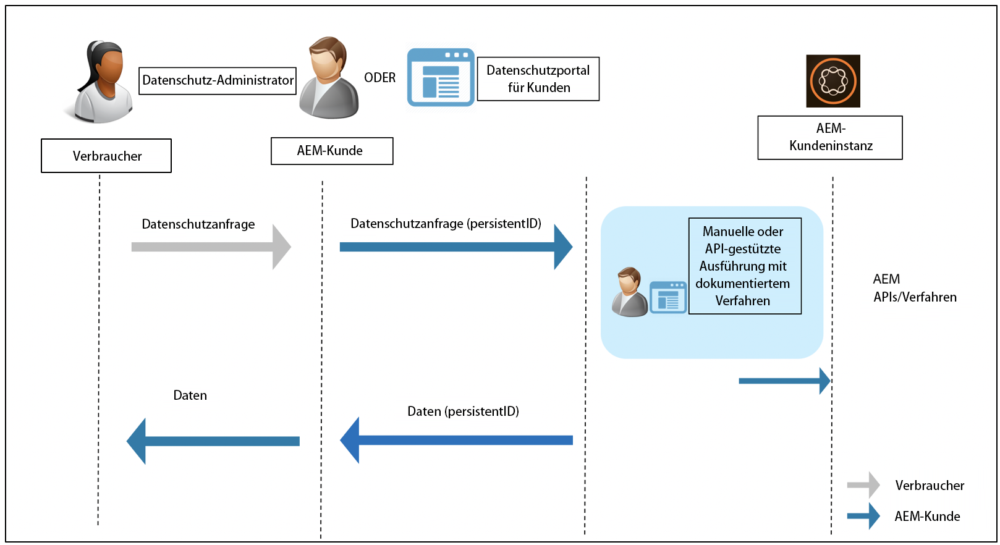

# Adobe Experience Manager - Einhaltung von Datenschutzbestimmungen {#aem-readiness-for-data-protection-and-data-privacy-regulations}

>[!WARNING]
>
>Der Inhalt dieses Dokuments stellt keine Rechtsberatung dar und ist nicht als Ersatz für Rechtsberatung gedacht.
>
>Wenden Sie sich an die Rechtsabteilung Ihres Unternehmens, um Ratschläge zu Datenschutzbestimmungen zu erhalten.

>[!NOTE]
>
>Weitere Informationen über die Reaktion der Adobe auf Datenschutzprobleme und was dies für Sie als Adobe bedeutet, finden Sie im [Datenschutzzentrum der Adobe](https://www.adobe.com/privacy.html).

Adobe stellt Dokumentationen und Vorgehensweisen bereit (mit APIs, sofern verfügbar), damit der Datenschutzadministrator oder AEM Administrator Datenschutzanfragen bearbeiten und unsere Kunden bei der Einhaltung dieser Vorschriften unterstützen kann. Die dokumentierten Verfahren ermöglichen es den Kunden, die regulatorischen Anfragen manuell oder durch Aufruf von APIs, sofern verfügbar, über ein externes Portal oder einen externen Dienst auszuführen.

>[!CAUTION]
>
>Die hier dokumentierten Details sind auf Adobe Experience Manager beschränkt.
>
>Daten aus einem anderen Adobe-On-Demand-Dienst erfordern zusammen mit allen damit verbundenen Datenschutzanfragen, dass für diesen Dienst Maßnahmen ergriffen werden.
>
>Weitere Informationen finden Sie unter [Datenschutzzentrum der Adobe](https://www.adobe.com/privacy.html).

## Einführung {#introduction}

Die Instanzen von Adobe Experience Manager und die darauf ausgeführten Anwendungen sind Eigentum unserer Kunden und werden von ihnen betrieben.

Daher sind Datenschutzbestimmungen wie die DSGVO, der CCPA und andere größtenteils Sache der Kunden.

In einer kurzen Einführung enthalten die Vorschriften für Datenschutz und Datenschutz neue Regeln, denen die Rollen folgender Personen folgen müssen:

* Unternehmen (CCPA) und/oder Datenverantwortliche (DSGVO)

* Dienstleister (CCPA) und/oder Datenverarbeiter (DSGVO)

Die wichtigsten Bestimmungen dieser Verordnungen sind:

1. Erweiterte Definition personenbezogener Daten, um alle eindeutigen Kennungen einzuschließen; wie in direkt und indirekt identifizierbaren Daten.

2. Verbesserte Genehmigungsanforderungen.

3. Der Fokus wurde verstärkt auf Löschrechte (Datenlöschung) gelegt.

4. Opt-out vom Verkauf von Daten.

Für Adobe Experience Manager:

* Die Instanzen und Anwendungen, die auf ihnen ausgeführt werden, gehören dem Kunden und werden von ihm betrieben.

   * Dies bedeutet effektiv, dass der Kunde die regulatorischen Rollen verwaltet, darunter Geschäftseinheiten und Dienstleister, Datenverantwortlicher und Datenverarbeiter.

   * Die Adobe Experience Platform Privacy Service ist nicht Teil des Workflows für AEM, wie in der folgenden Abbildung dargestellt.

* AEM umfasst Dokumentationen und Verfahren für den Datenschutzadministrator und/oder AEM Administrator des Kunden, die Datenschutzanfragen auszuführen. entweder manuell oder über APIs, sofern verfügbar.

* Es wurde kein neuer Dienst oder keine neue Benutzeroberfläche hinzugefügt.

   * Stattdessen werden Verfahren und APIs für die Verwendung durch die Benutzeroberflächen/Portale von Kunden dokumentiert, die Datenschutzanfragen verarbeiten.

* AEM enthält keine nativen Tools zur Unterstützung des Workflows für Datenschutzanfragen.

   * Adobe stellt dem Datenschutzadministrator und/oder AEM Administrator des Kunden Dokumentationen und Verfahren zur Verfügung, mit denen er Anfragen im Zusammenhang mit den Datenschutzbestimmungen manuell ausführen kann.

Adobe bietet Verfahren für die Bearbeitung von Datenschutzanfragen im Zusammenhang mit Zugriff, Löschen und Opt-out für Adobe Experience Manager. In einigen Fällen sind APIs verfügbar, die von einem kundenentwickelten Portal oder von Skripten aufgerufen werden können, um die Automatisierung zu unterstützen.

Das folgende Diagramm zeigt, wie ein Workflow für Datenschutzanfragen aussehen könnte (in der Abbildung von Adobe Experience Manager 6.5):

## Adobe Experience Manager- und Regelungsbereitschaft {#aem-and-regulatory-readiness}

In den folgenden Abschnitten finden Sie eine Dokumentation zu AEM Produktbereichen.

## AEM Foundation {#aem-foundation}

Siehe [Umgang mit Datenschutz- und Datenschutzanfragen für die AEM Foundation](/help/sites-administering/handling-gdpr-requests-for-aem-platform.md).

## AEM-Aktivierung zur aggregierten Sammlung von Nutzungsstatistiken {#aem-opting-into-aggregate-usage-statistics-collection}

Siehe [Aggregierte Sammlung von Nutzungsstatistiken](/help/sites-deploying/opt-in-aggregated-usage-statistics.md).

## AEM Sites {#aem-sites}

Siehe [AEM Sites - Datenschutzbereitschaft und Datenschutzbereitschaft.](/help/sites-administering/gdpr-compliance-sites.md)

## AEM Commerce {#aem-commerce}

Siehe [AEM Commerce - Data Protection and Privacy Readiness](/help/sites-administering/gdpr-compliance-commerce.md).

## AEM  Mobile {#aem-mobile}

Siehe [AEM Mobile - Datenschutz und Datenschutzbereitschaft](/help/mobile/aem-mobile-gdpr-compliance.md).

## AEM-Integration mit Adobe Target und Adobe Analytics {#aem-integration-with-adobe-target-adobe-analytics}

Diese Adobe Experience Manager-Integrationen verfügen über datenschutzfreundliche und datenschutzfreundliche Dienste (z. B. DSGVO oder CCPA). In AEM werden keine personenbezogenen Daten von Adobe Target oder Adobe Analytics in Bezug auf die Integrationen gespeichert.
Weitere Informationen finden Sie unter:

* [Adobe Target - Datenschutzübersicht](https://docs.adobe.com/content/help/en/target/using/implement-target/before-implement/privacy/privacy.html)

* [Adobe Analytics-Datenschutz-Workflow](https://docs.adobe.com/content/help/en/analytics/admin/data-governance/an-gdpr-workflow.html)

## AEM Communities {#aem-communities}

AEM Communities bietet [gebrauchsfertige APIs](/help/communities/user-ugc-management-service.md), mit deren Hilfe Einzelpersonen (sogenannte „Datensubjekte“) gemäß DSGVO das Recht auf Übertragbarkeit ihrer Daten, auf Zugriff auf ihre Daten und auf Löschung ihrer Daten („Recht auf Vergessenwerden“) vollumfänglich eingeräumt werden kann. Diese APIs ermöglichen die Massenlöschung sowie den Massenexport von benutzergenerierten Inhalten und das Deaktivieren von Benutzerkonten über deren autorisierbare ID. Das dauerhafte Löschen eines Benutzerkontos erfolgt dagegen durch Löschen des entsprechenden Benutzerknotens in CRXDE Lite, wodurch die DSGVO-Anforderung zur Bereitstellung einer einfachen Möglichkeit für die Abmeldung beim System erfüllt wird.

Darüber hinaus gewährleistet AEM Communities mit der Konsole für die Massenmoderation den im Rahmen der DSGVO geforderten Datenschutz durch Technik („Privacy by Design“), mit deren Hilfe privilegierte Mitglieder die Beiträge und Daten der Benutzer suchen und löschen können. Die Konsole für die Mitgliederverwaltung ermöglicht es zudem, den Zugriff insoweit einzuschränken, dass Mitwirkende ausgeschlossen werden können. Darüber hinaus ermöglicht sie es Datensubjekten, von ihnen erstellte Beiträge zu löschen.

## AEM Forms {#aem-forms}

AEM Forms beinhaltet Komponenten und Workflows, die zur Orchestrierung von Geschäftsprozessen und zum Abschließen von digitalen Transaktionen Daten erfassen, verarbeiten und speichern. Die einzelnen Komponenten verwenden unterschiedliche Datenspeicher und ermöglichen darüber hinaus die Integration mit benutzerdefinierten Datenspeichern. In der folgenden Dokumentation werden Verfahren und Richtlinien für den Zugriff auf und die Verarbeitung von Benutzerdaten erläutert, um Datenschutz- und Datenschutzarbeitsabläufe (z. B. DSGVO oder CCPA) für eine Komponente zu unterstützen.

* [Formularportal](/help/forms/using/forms-portal-handling-user-data.md)
* [Korrespondenzverwaltung](/help/forms/using/correspondence-management-handling-user-data.md)
* [Integration mit Adobe Sign](/help/forms/using/integration-adobe-sign-handling-user-data.md)
* [Forms-zentrierte Workflows auf OSGi](/help/forms/using/forms-workflow-osgi-handling-user-data.md)
* [Forms JEE-Workflows](/help/forms/using/forms-workflow-jee-handling-user-data.md) (nur AEM Forms JEE)
* [Document Security](/help/forms/using/document-security-handling-user-data.md) (nur AEM Forms JEE)
* [Benutzerverwaltung](/help/forms/using/user-management-handling-user-data.md) (nur AEM Forms JEE)
