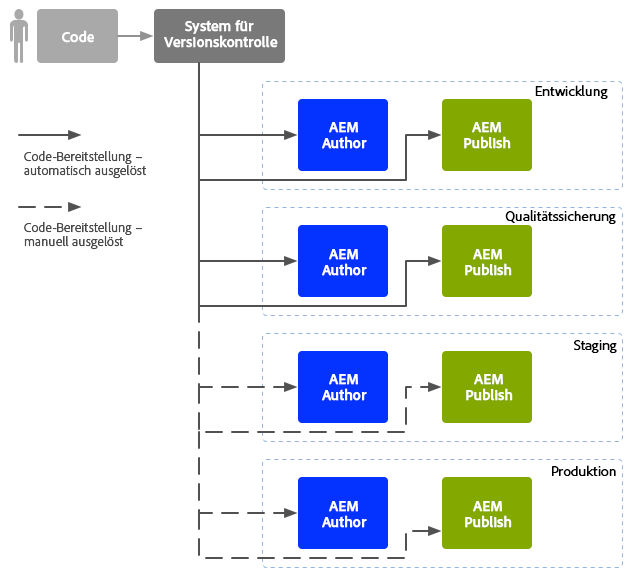
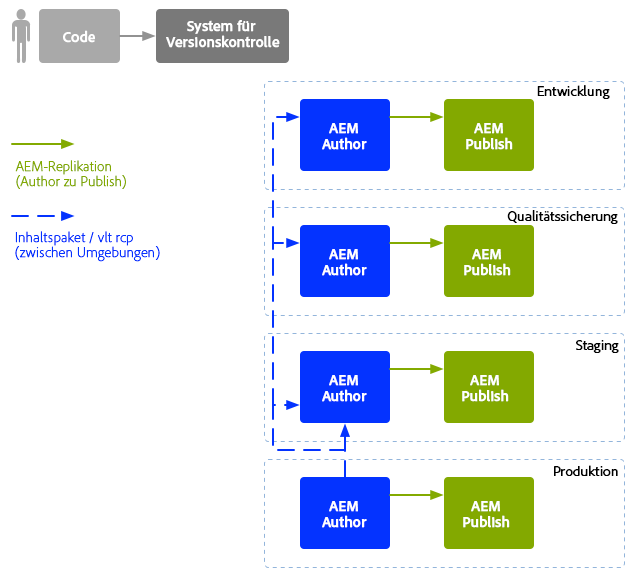

# DevOp-Strategien für Unternehmen{#enterprise-devops}

DevOps umfasst die Prozesse, Methoden und Kommunikation, die erforderlich sind, um:

* Erleichterung der Bereitstellung der Software über die verschiedenen Umgebungen hinweg;
* Vereinfachen Sie die Zusammenarbeit zwischen den Entwicklungs-, Test- und Bereitstellungsteams.

DevOp-Strategien sollen unter anderem zur Vermeidung folgender Probleme beitragen:

* Manuelle Fehler;
* Vergessene Elemente, beispielsweise Dateien, Konfigurationsdetails.
* Diskrepanzen, beispielsweise zwischen der lokalen Umgebung des Entwicklers und anderen Umgebungen.

## Umgebungen {#environments}

Eine Adobe Experience Manager-Bereitstellung (AEM) besteht in der Regel aus mehreren Umgebungen, die für unterschiedliche Zwecke auf unterschiedlichen Ebenen verwendet werden:

* [Entwicklung](#development)
* [Qualitätssicherung](#quality-assurance)
* [Staging  ](#staging)
* [Produktion](#production-author-and-publish)

>[!NOTE]
>
>Die Produktionsumgebung muss mindestens eine Autoren- und eine Veröffentlichungsumgebung umfassen.
>
>Es wird empfohlen, alle anderen Umgebungen ebenfalls mit einer Autoren- und einer Veröffentlichungsumgebung zu gestalten, um die Produktionsumgebung widerzuspiegeln und frühe Test zu ermöglichen.

### Entwicklung {#development}

Die Entwickler sind für die Entwicklung und Anpassung des vorgeschlagenen Projekts (Website, Mobile Apps, DAM-Implementierung usw.) mit allen erforderlichen Funktionen verantwortlich. Sie:

* entwickeln und passen die notwendigen Elemente an, beispielsweise Vorlagen, Komponenten, Arbeitsabläufe, Anwendungen;
* setzen das Design um;
* entwickeln die notwendigen Dienste und Skripte, um die geforderten Funktionalitäten umzusetzen.

Die Konfiguration der [development](/help/sites-developing/best-practices.md) -Umgebung kann von verschiedenen Faktoren abhängen, allerdings umfasst sie:

* einem integrierten Entwicklungssystem mit Versionssteuerung, um eine integrierte Codebasis zur Verfügung zu stellen. Dies wird dazu verwendet, die von den jeweiligen Entwicklern in der jeweiligen Entwicklungsumgebung verwendete Programmierung zusammenzuführen und zu konsolidieren;
* eine persönliche Umgebung für jeden Entwickler, für gewöhnlich auf einem lokalen Rechner. In angemessenen Abständen wird der Code mit dem Versionskontrollsystem synchronisiert

Je nach Größe Ihres Systems kann die Entwicklungsumgebung sowohl über Autoren- als auch Veröffentlichungsinstanzen verfügen.

### Qualitätssicherung {#quality-assurance}

Diese Umgebung wird vom Qualitätssicherungs-Team zu umfassenden [Tests](/help/sites-developing/test-plan.md) des neuen Systems, sowohl in Bezug auf Design als auch Funktion, verwendet. Sie sollte über eine Autoren- und eine Veröffentlichungsumgebung mit geeignetem Inhalt verfügen und sämtliche notwendigen Dienste zur Durchführung einer Reihe von Tests bereitstellen.

### Staging   {#staging}

Die Staging-Umgebung sollte ein Spiegel der Produktionsumgebung sein - Konfiguration, Code und Inhalt:

* Sie wird zum Testen von Skripten verwendet, die zur Umsetzung der eigentlichen Bereitstellung genutzt werden.
* Sie kann für endgültige Tests (Design, Funktionalität und Schnittstellen) vor der Bereitstellung in den Produktionsumgebungen verwendet werden.
* Obwohl es nicht immer möglich ist, die Staging-Umgebung völlig identisch mit der Produktionsumgebung zu gestalten, sollten die beiden so ähnlich wie möglich sein, um Leistungs- und Belastungstests zu ermöglichen.

### Produktion - Autoren- und Veröffentlichungsumgebung   {#production-author-and-publish}

Die Produktionsumgebung besteht aus den für das tatsächliche [Verfassen und Veröffentlichen](/help/sites-authoring/author.md#concept-of-authoring-and-publishing) der Implementierung notwendigen Umgebungen.

Eine Produktionsumgebung besteht aus mindestens einer Autoreninstanz und einer Veröffentlichungsinstanz:

* [Autoreninstanz](#author) für die Eingabe von Inhalt;
* [Veröffentlichungsinstanz](#publish) für Inhalte, die den Besuchern/Benutzern zugänglich gemacht werden.

Je nach Größe des Projekts besteht es oft aus mehreren Autoreninstanzen, mehreren Veröffentlichungsinstanzen oder beidem. Auf niedrigerer Ebene kann das Repository in mehrere Instanzen gebündelt werden.

#### Autor {#author}

Autoreninstanzen befinden sich meist hinter der internen Firewall. Das ist die Umgebung, in der Sie und Ihre Kollegen Autorenaufgaben erledigen, wie etwa:

* Verwalten des gesamten Systems;
* Eingeben von Inhalten;
* Konfigurieren des Layouts und Designs des Inhalts;
* Aktivieren der Inhalte in der Veröffentlichungsumgebung.

Aktivierte Inhalte werden gebündelt und in der Replikationswarteschlange der Autorenumgebung abgelegt. Der Replikationsprozess überträgt den Inhalt dann in die Veröffentlichungsumgebung.

Um in einer Veröffentlichungsumgebung generierte Daten rückgängig zu machen, fragt ein Replikations-Listener in der Autorenumgebung die Veröffentlichungsumgebung ab und ruft diese Inhalte aus dem Postausgang für die Rückwärtsreplikation der Veröffentlichungsumgebung ab.

#### Veröffentlichen  {#publish}

Eine Veröffentlichungsumgebung befindet sich in der demilitarisierten Zone (DMZ). Dies ist die Umgebung, in der Besucher auf Ihren Inhalt zugreifen (z. B. über eine Website oder eine Mobile App) und mit ihm interagieren; entweder öffentlich oder in Ihrem Intranet sein. Die Veröffentlichungsumgebung:

* enthält alle aus der Autorenumgebung replizierten Inhalte;
* macht Inhalte für Besucher zugänglich;
* speichert Benutzerdaten, die von den Besuchern erstellt werden, wie Kommentare oder andere Formen von Beiträgen;
* kann so konfiguriert werden, dass solche Benutzerdaten einem Postausgang für die umgekehrte Replikation in die Autorenumgebung hinzugefügt werden.

Die Veröffentlichungsumgebung erzeugt Ihren Inhalt dynamisch in Echtzeit und ermöglicht die Personalisierung des Inhalts für jeden einzelnen Benutzer.

## Code-Verschiebung   {#code-movement}

Codeverteilung von unten nach oben:

* Der Code wird zunächst in der lokalen Umgebung entwickelt und dann in die Entwicklungsumgebungen integriert,
* gefolgt von gründlichen Tests in den QS-Umgebungen
* und wird dann abermals in den Staging-Umgebungen getestet.
* Der Code sollte erst danach in den Produktionsumgebungen bereitgestellt werden.

Der Code (z. B. benutzerdefinierte Webanwendungsfunktionen und Designvorlagen) wird durch den Export und Import von Paketen zwischen den verschiedenen Inhalts-Repositorys übertragen. Wo angemessen, kann die Replikation als automatischer Prozess konfiguriert werden.

AEM Projekte stellen häufig Trigger-Code bereit:

* Automatisch: zur Übertragung an die Entwicklungs- und QS-Umgebungen.
* Manuell: Bereitstellungen in den Staging- und Produktionsumgebungen erfolgen kontrollierter, häufig manuell. bei Bedarf jedoch auch Automatisierung möglich ist.

## Inhaltsverschiebung {#content-movement}

Inhalte, die für die Produktion erstellt werden, sollten **immer** in der Autoreninstanz der Produktion verfasst werden.

Die Inhaltsverschiebung sollte nicht der Code-Verschiebung von niedrigeren zu höheren Umgebungen folgen, da die Erstellung von Inhalten durch Autoren auf lokalen Rechnern oder in niedrigeren Umgebungen und die darauffolgende Verschiebung in die Produktionsumgebung kein optimales Verfahren darstellt und wahrscheinlich zu Fehlern und Unstimmigkeiten führt.

Die Produktionsinhalte sollten von der Produktionsumgebung in die Staging-Umgebung verschoben werden, um zu gewährleisten, dass die Staging-Umgebung eine effiziente und genaue Testumgebung bietet.

>[!NOTE]
>
>Dies bedeutet nicht, dass Staging-Inhalte kontinuierlich mit der Produktion synchronisiert werden müssen. Regelmäßige Aktualisierungen sind ausreichend, aber vor allem vor dem Testen einer neuen Iteration von Code. Die Inhalte in den QS- und Entwicklungsumgebungen müssen nicht so häufig aktualisiert werden. Sie sollten eine gute Darstellung des Produktionsinhalts sein.

Inhalte können übertragen werden:

* zwischen verschiedenen Umgebungen - durch den Export und Import von Paketen;
* Zwischen verschiedenen Instanzen - durch direkte Replikation ([AEM](/help/sites-deploying/replication.md)), den Inhalt (über eine HTTP- oder HTTPS-Verbindung).

