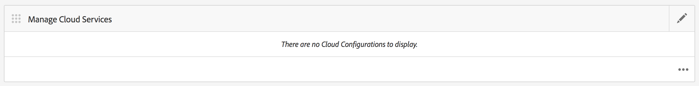

# Konfigurieren des Adobe Mobile Services Cloud-Dienstes {#configure-your-adobe-mobile-services-cloud-service}

>[!NOTE]
>
>Adobe empfiehlt die Verwendung des SPA-Editors für Projekte, für die ein frameworkbasiertes clientseitiges Rendering für einzelne Seiten (z. B. React) erforderlich ist. [Weitere Informationen](/help/sites-developing/spa-overview.md)

Die Kachel **Mobile Metriken** im Befehlszentrum bietet Echtzeitanalysen für Ihre Mobile App.

Das [Adobe Mobile Analytics](https://www.adobe.com/ca/solutions/digital-analytics/mobile-web-apps-analytics.html)-SDK wird als PhoneGap-Plug-in zur Verfügung gestellt. Metriken werden erfasst und auf dem Gerät zwischengespeichert, bis das Gerät verbunden ist. Zu diesem Zeitpunkt werden die Daten zur Berichterstellung und Analyse an die Adobe Mobile Services Cloud gesendet.

Das Adobe Mobile Analytics-SDK bietet Folgendes:

1. **Datenerfassung für mobile Kanäle** - Erfassen Sie umfassende Daten zu Ihren mobilen Websites und Apps auf allen wichtigen Betriebssystemen.
1. **Analyse mobiler Interaktionen**  - Verstehen Sie die Benutzerinteraktion innerhalb Ihrer mobilen App, Website oder Videos, einschließlich der Häufigkeit, mit der Verbraucher den Kanal starten, ob sie Käufe darüber tätigen und mehr.
1. **Mobile App-Dashboards und -Berichte**  - Rufen Sie Nutzungsberichte ab, die Lebenszyklusmetriken für Ihre Apps und App Store-Metriken enthalten - siehe Trends für Benutzer, Starts, durchschnittliche Sitzungslänge, Aufbewahrungsdauer und Abstürze.
1. **Analyse mobiler Kampagnen**  - Quantifizieren Sie die Effektivität mobiler Kampagnen wie SMS, mobiler Suchanzeigen, mobiler Display-Anzeigen und QR-Codes.
1. **Geolocation-Analyse** : Ermitteln Sie, wo Ihre App-Benutzer Ihre mobilen Erlebnisse starten und damit interagieren, nach GPS-Position oder Zielpunkten.
1. **Pfadanalyse**  - Erfahren Sie, wie Benutzer durch Ihre App navigieren, um zu bestimmen, welche Bildschirme und Benutzeroberflächenelemente Benutzer anregen und welche dazu führen, dass Benutzer abbrechen.

>[!CAUTION]
>
>Die Kachel **Metriken analysieren** wird im Dashboard nur angezeigt, wenn Sie Cloud-Services konfiguriert haben.

Kachel „AEM-Befehlszeilenmetriken“

## Konfigurieren des Cloud-Dienstes {#configuring-the-cloud-service}

Um Adobe Mobile Services Analytics nutzen zu können, müssen Sie den AEM Mobile Analytics Cloud-Dienst mit Ihren Adobe Analytics-Kontoinformationen konfigurieren.

1. Klicken Sie auf das Symbol oben rechts, um die Cloud Services aus der Kachel **Cloud Services verwalten** im App-Dashboard hinzuzufügen oder zu bearbeiten.

   

1. Der Bildschirm **Cloud Services hinzufügen oder bearbeiten** wird angezeigt. Wählen Sie **Adobe Mobile Services** und klicken Sie auf **Weiter**.

   

1. Wählen Sie unter **Mobile Services** eine vorhandene Konfiguration aus oder wählen Sie **Konfiguration erstellen**, um eine neue zu erstellen.

   Geben Sie für eine neue Konfiguration **Mobile Services-Eigenschaften** ein und klicken Sie auf **Überprüfen.**

   

   Wenn die Anmeldeinformationen geprüft werden, ändert sich die Schaltfläche **Verify** in **Verified**. Sie können eine Mobile-Service-App unter **Wählen Sie einen Mobile-App-Dienst** aus.

   Klicken Sie zum Einrichten Ihrer Konfiguration auf **Submit** .

   

1. Nachdem Sie eine Cloud-Konfiguration eingerichtet haben, können Sie dieselbe Ansicht in Ihrem Dashboard anzeigen.

   

   >[!NOTE]
   >
   >Nachdem Sie Ihre Cloud-Konfiguration eingerichtet haben, können Sie die Kachel **Metriken analysieren** in Ihrem App-Dashboard anzeigen.

   
