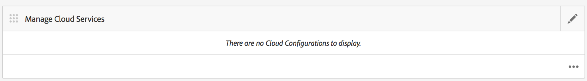

# Konfigurieren des Adobe PhoneGap Build-Cloud Service {#configure-your-adobe-phonegap-build-cloud-service}

>[!NOTE]
>
>Adobe empfiehlt die Verwendung des SPA-Editors für Projekte, für die ein Framework-basiertes Client-seitiges Rendering für einzelne Seiten (z. B. React) erforderlich ist. [Weitere Informationen](/help/sites-developing/spa-overview.md)

Die **PhoneGap Build-Kachel** im Anwendungs-Dashboard können Sie Ihre PhoneGap-Mobile App über den Adobe PhoneGap Build-Dienst erstellen und verteilen.

Alle unterstützten Plattformen, die innerhalb der **App verwalten** -Kachel wird mit PhoneGap Build erstellt, wenn ein Remote-Build mit der **PhoneGap Build** Kachel.

Sie können einen Remote-Build an `https://build.phonegap.com` oder laden Sie die Quelle herunter, um sie mit PhoneGap CLI lokal zu erstellen unter `https://docs.phonegap.com/references/phonegap-cli/`.


## Konfigurieren des Cloud Service {#configuring-the-cloud-service}

Um die Vorteile von PhoneGap Build nutzen zu können, müssen Sie den AEM-PhoneGap Build mit Ihren PhoneGap Build-Kontoinformationen konfigurieren.

Wenn Sie noch kein Konto haben, navigieren Sie zu `https://build.phonegap.com` und melden Sie sich an! Wenn Sie über eine Adobe Creative Cloud-Mitgliedschaft verfügen, können Sie bis zu 25 private Apps (Nicht-Open-Source-Apps) unterstützen.

Nachdem Sie überprüft haben, ob Ihr PhoneGap Build-Konto aktiv ist, navigieren Sie zu Ihrer AEM Cloud Management Console, insbesondere zum [PhoneGap Build Cloud Service](http://localhost:4502/etc/cloudservices/phonegap-build.html) (http://localhost:4502/etc/cloudservices/phonegap-build.html).

Verwenden Sie die **Cloud Service verwalten** -Kachel zum Konfigurieren einer neuen Cloud Service-Konfiguration.

### Verwenden der Kachel Cloud Service verwalten {#using-manage-cloud-services-tile}

Bevor Sie mit der Erstellung Ihrer App beginnen, verwenden Sie **PhoneGap Build** -Kachel müssen Sie Ihre Cloud-Services mithilfe der **Cloud Service verwalten** -Kachel im AEM Mobile-Dashboard.

Gehen Sie wie folgt vor, um Cloud-Services für Ihre App zu konfigurieren:

1. Klicken Sie oben rechts im **Cloud Service verwalten** Kachel.

   

1. Auswählen **PhoneGap Build** Option aus der **Cloud Service hinzufügen oder bearbeiten** angezeigt.

   Klicken Sie auf **Weiter**.

   

1. Geben Sie Ihre Anmeldedaten ein, damit Sie eine Cloud-Konfiguration erstellen können.

   Klicken Sie nach der Überprüfung auf **Einsenden**. Diese konfigurierte Cloud-Konfiguration wird jetzt im **Cloud Service verwalten** Kachel.

   

### Erstellen einer Anwendung mit PhoneGap Build {#building-your-application-with-phonegap-build}

Nachdem Sie die Cloud-Services konfiguriert haben, können Sie Ihre Anwendung mit **PhoneGap Build** Kachel. Klicken Sie oben rechts auf , damit Sie aus dem **Remote-Build** oder **Quelle herunterladen** Optionen.


Um einen Remote-Build mit Adobe PhoneGap Build aufzurufen, klicken Sie auf **Remote-Build**.

>[!NOTE]
>
>Wenn der Build aus irgendeinem Grund fehlschlägt (das rote iOS-Symbol unten zeigt an, dass die Plattform fehlgeschlagen ist), können Sie den Mauszeiger über das Symbol bewegen, um die Fehlermeldung zu erhalten. Alternativ können Sie auf den dreifachen Punkt (&quot;...&quot;) am unteren Rand der Kachel klicken, um direkt zu navigieren. `https://build.phonegap.com` (Sie müssen sich authentifizieren) und beobachten und verwalten Sie Ihren Build direkt.

### Erstellen Ihrer Anwendung mit PhoneGap CLI {#building-your-application-with-phonegap-cli}

PhoneGap bietet eine Befehlszeilenschnittstelle zum lokalen Erstellen Ihrer Anwendung.

Kompilieren Sie die PhoneGap-Anwendung mithilfe der PhoneGap-Befehlszeilenschnittstelle (CLI) auf Ihrem Computer. Um den AEM Inhalt in Ihre Anwendung aufzunehmen, erstellt AEM eine ZIP-Datei, die den Inhalt Ihrer Mobile App, Konfigurationen zur Inhaltssynchronisierung und andere erforderliche Assets enthält. Laden Sie die ZIP-Datei herunter und fügen Sie sie in Ihren Build ein.

Um die CLI von PhoneGap nutzen zu können, müssen Sie Ihre lokale Umgebung so einrichten, dass Folgendes enthalten ist:

1. Platform SDK (iOS, Android™, Windows Phone, ...) und
1. PhoneGap-CLI

Weitere Informationen finden Sie hier: `https://docs.phonegap.com/references/phonegap-cli/`.

Nachdem Sie die Voraussetzungen installiert haben, testen Sie sie anhand eines einfachen Tests, indem Sie eine einfache App erstellen und sie entweder in Ihrem Simulator oder besser auf Ihrem Gerät ausführen lassen, und zwar von einem Terminal aus:

```xml
phonegap create myApp
cd myApp
phonegap run ios (or android, ...)
```

>[!NOTE]
>
>Fügen Sie —emulate am Ende dieser Zeile hinzu, wenn Sie sie nicht auf Ihrem verbundenen Gerät ausführen möchten.

Nachdem Sie überprüft haben, ob die oben genannten Funktionen funktionieren, verwenden Sie die **PhoneGap Build** Kachel zu **Quelle herunterladen**. Speichern und entpacken Sie die Datei auf Ihrem lokalen System. Danach:

* Navigieren zu dieser gespeicherten Datei (Ordner)
* Führen Sie &quot;phonegap run ios&quot;aus (oder android usw.)

### Zusätzliche Ressourcen {#additional-resources}

Informationen zu den Rollen und Zuständigkeiten von Autoren und Entwicklern finden Sie in den folgenden Ressourcen:

* [Entwickeln für Adobe PhoneGap Enterprise mit AEM](/help/mobile/developing-in-phonegap.md)
* [Authoring für Adobe PhoneGap Enterprise in AEM](/help/mobile/phonegap.md)
