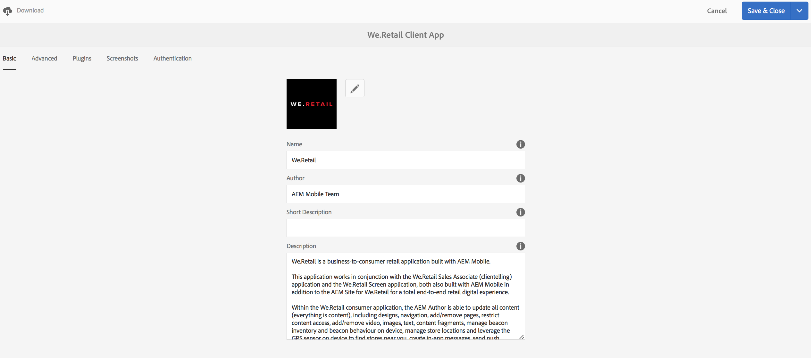

# Konfigurieren von Benutzern und Benutzergruppen {#configure-your-users-and-user-groups}

>[!NOTE]
>
>Adobe empfiehlt die Verwendung des SPA-Editors für Projekte, für die ein frameworkbasiertes clientseitiges Rendering für einzelne Seiten (z. B. React) erforderlich ist. [Weitere Informationen](/help/sites-developing/spa-overview.md)

In diesem Kapitel werden die Benutzerrollen und die Konfiguration Ihrer Benutzer und Gruppen zur Unterstützung des Authoring und Managements Ihrer mobilen Apps beschrieben.

## AEM Mobile Application Users and Group Administration {#aem-mobile-application-users-and-group-administration}

Um das Berechtigungsmodell für AEM Apps zu organisieren und zu verwalten, sind die folgenden beiden Gruppen verfügbar:

* App-Administratoren für App-Administratoren
* app-authors für App-Autoren

### AEM Mobile Application Content Authors (app-author group) {#aem-mobile-application-content-authors-app-author-group}

Mitglieder der Gruppe &quot;App-Autor&quot;sind für die Bearbeitung AEM Inhalte mobiler Anwendungen verantwortlich, einschließlich Seiten, Text, Bildern und Videos.

#### Gruppenkonfiguration: app-authors {#group-configuration-app-authors}

1. Erstellen Sie eine neue Benutzergruppe mit dem Namen „app-authors“:

   Navigieren Sie zur Admin Console Benutzer : [http://localhost:4502/libs/granite/security/content/groupadmin.html](http://localhost:4502/libs/granite/security/content/groupadmin.html)

   Wählen Sie in der Benutzergruppenkonsole das Plussymbol, um die Gruppe zu erstellen.

   Legen Sie die ID dieser Gruppe auf „app-authors“ fest, um anzugeben, dass diese Autorenbenutzergruppe spezifisch für mobile Anwendungen in AEM ist.

1. Hinzufügen von Mitgliedern zur Gruppe: Autoren

   

   App-Autoren zur Gruppe Autoren hinzufügen

1. Nachdem Sie die Benutzergruppe „app-authors“ erstellt haben, können Sie ihr über die [Benutzer-Admin](http://localhost:4502/libs/granite/security/content/useradmin.md)-Konsole Teammitglieder hinzufügen.

   

   Bearbeiten von Benutzergruppen

1. Navigieren Sie zur [Berechtigungskonsole](http://localhost:4502/useradmin) und fügen Sie Berechtigungen zum Verwalten von Cloud Services hinzu.

   * (Lesen) unter /etc/cloudservices
   >[!NOTE]
   >
   >App-Autoren erweitern die standardmäßige Gruppe &quot;content-authors&quot;(Autoren) von AEM und erben dadurch die Möglichkeit, Inhalte unter /content/phonegap zu erstellen.

### AEM Mobile Application Administrators Group (Gruppe &quot;app-admins&quot;) {#aem-mobile-application-administrators-group-app-admins-group}

Mitglieder der Gruppe &quot;app-admins&quot;können Anwendungsinhalte mit den gleichen Berechtigungen erstellen, die auch für die App-Autoren **UND** vorhanden sind. Außerdem sind sie für Folgendes verantwortlich:

* Konfigurieren von PhoneGap Build- und Adobe Mobile Services-Cloud-Services in AEM
* Staging, Veröffentlichen und Löschen von OTA-Aktualisierungen für die Inhaltssynchronisierung

>[!NOTE]
>
>Welche Benutzeraktionen in der AEM Apps-Befehlszentrale verfügbar sind, hängt von den jeweiligen Berechtigungen an.
>
>Sie werden feststellen, dass einige Optionen nicht für „app-authors“, jedoch für „app-admins“ zur Verfügung stehen.

#### Gruppenkonfiguration: app-admins {#group-configuration-app-admins}

1. Erstellen Sie eine neue Gruppe mit dem Namen „app-admins“:
1. Fügen Sie die folgenden Gruppen Ihrer neuen Gruppe „app-admins“ hinzu:

   * content-authors
   * workflow-users

   

1. Navigieren Sie zur [Berechtigungskonsole](http://localhost:4502/useradmin) und fügen Sie Berechtigungen zum Verwalten von Cloud Services hinzu.

   * (Lesen, Verändern, Erstellen, Löschen, Replizieren) für „/etc/cloudservices/mobileservices“
   * (Lesen, Verändern, Erstellen, Löschen, Replizieren) für „/etc/cloudservices/phonegap-build“

1. Fügen Sie in derselben Berechtigungskonsole Berechtigungen zum Staging, Veröffentlichen und Löschen von Aktualisierungen des App-Inhalts hinzu

   * (Lesen, Verändern, Erstellen, Löschen, Replizieren) für „/etc/packages/mobileapp“
   * (Lesen) für „/var/contentsync“

   >[!NOTE]
   >
   >Die Paketreplikation wird verwendet, um Anwendungsaktualisierungen aus der Erstellungsinstanz in der Veröffentlichungsinstanz zu veröffentlichen.

   >[!CAUTION]
   >
   >Der Zugriff auf „/var/contentsync“ ist standardmäßig nicht möglich.
   >
   >Das Übergehen der Leseberechtigung, kann dazu führen, dass leere Aktualisierungspakete erstellt und repliziert werden.

1. Fügen Sie dieser Gruppe je nach Bedarf Mitglieder hinzu.

## Berechtigungen für die Dashboard-Kacheln  {#dashboard-tile-permissions}

Die Dashboard-Kacheln können je nach Berechtigungen des Benutzers verschiedene Aktionen enthalten. Im Folgenden wird beschrieben, welche Aktionen für die einzelnen Kacheln verfügbar sind.

Die Verfügbarkeit von Aktionen ist außerdem abhängig von der Konfiguration der aktuellen App. Beispielsweise ergibt die Aktion „Remote-Build“ keinen Sinn, wenn der App keine PhoneGap-Cloud-Konfiguration zugewiesen wurde. Diese werden im Folgenden unter &quot;**Konfigurationsbedingung**&quot;aufgeführt.

### Kachel „App verwalten“{#manage-app-tile}

Die Kachel enthält zurzeit keine Aktionen, für die Berechtigungen erforderlich sind, die Detailseite der Anwendung weist jedoch folgende Aktionen auf:

* ** Bearbeiten für app-author und app-admin (UI-Trigger - jcr:write - für /content/phonegap/{suffix})
* ** Herunterladen für app-author und app-admin (UI-Trigger - unter /content/phonegap/{suffix})

Die folgende Abbildung zeigt die Download- und Bearbeitungsoptionen für eine App:

