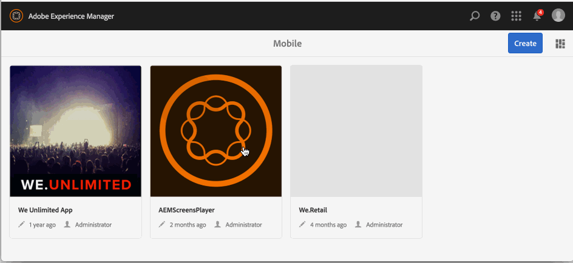

# Anwendungserstellungs- und Konfigurationsaktionen{#application-create-and-configuration-actions}

>[!NOTE]
>
>Adobe empfiehlt die Verwendung des SPA-Editors für Projekte, für die ein Framework-basiertes Client-seitiges Rendering für einzelne Seiten (z. B. React) erforderlich ist. [Weitere Informationen](/help/sites-developing/spa-overview.md)

## Erstellen einer On-Demand-Anwendung {#creating-an-on-demand-application}

Die Erstellung einer App ist oft der erste Schritt zur Erstellung und Verwaltung von AEM Mobile On-Demand-Inhalten und wird oft auf AEM-Administratorebene durchgeführt. Es stellt eine Inhalts-Shell dar, die auf Mobilgeräten angezeigt werden kann und bereit ist, von Autoren erstellte Inhalte wie Artikel, Bilder und Sammlungen anzuzeigen.

Die Details Ihrer App können im Dashboard oder AEM Mobile Control Center angezeigt werden.

>[!NOTE]
>
>AEM Mobile Das Dashboard besteht aus einer Reihe nützlicher Kacheln, die einen Überblick über den Inhalt, die Metadaten und den Verbindungsstatus der Mobile App bei Bedarf bieten.
>
>Detaillierte Informationen finden Sie unter {0](/help/mobile/mobile-apps-ondemand-application-dashboard.md) Dashboard der AEM Mobile-Anwendung.[

**So erstellen Sie eine On-Demand-App:**

1. Wählen **in** Seitenleiste „Mobil“ aus.
1. Wählen Sie **Apps** in der Navigation aus.
1. Klicken Sie **Erstellen** und wählen Sie **App** aus der Dropdown-Liste aus.
1. Wählen Sie die Mobile-App-Vorlage aus und klicken Sie auf **Weiter**.
1. Geben Sie App-Eigenschaften wie **Titel**, **Name**, **Beschreibung** ein.
1. Klicken Sie auf **Weiter**.
1. Falls bekannt, geben Sie Details zur Cloud-Konfiguration ein, klicken Sie andernfalls auf **Erstellen**.
1. Klicken Sie **Fertig**, um Ihre neue AEM Mobile-App im Katalog anzuzeigen.

>[!NOTE]
>
>Auf diese Weise können Sie eine App-Instanz in AEM erstellen.

## Verwenden von App-Vorlagen {#using-app-templates}

App-Vorlagen bieten eine einfache Möglichkeit, vorhandene Designs zu verwenden, die von Entwicklerinnen und Entwicklern erstellt wurden und für die Erstellung neuer Apps in AEM verwendet werden.

Was ist eine App-Vorlage? Stellen Sie sich dies als eine Sammlung von Seitenvorlagen und Komponenten vor, die eine Grundlinie oder die Grundlage einer App darstellen.
Wenn Sie eine App basierend auf der Vorlage einer anderen App erstellen, erhalten Sie eine App, deren Startpunkt repräsentativ für die App ist, aus der sie erstellt wurde.

Sie müssen über eine vorhandene Mobile-App-Vorlage (oder eine installierte App mit einer App-Vorlage) verfügen, um diese Funktion verwenden zu können.

### Der nächste Schritt {#the-next-step}

Nachdem Sie eine On-Demand-App über das Anwendungs-Dashboard erstellt haben, besteht der nächste Schritt darin, Ihre App mit der Cloud-Konfiguration zu verknüpfen.

Weitere [ finden Sie unter „Verknüpfen Ihrer App mit ](/help/mobile/mobile-on-demand-associating-an-on-demand-app-to-cloud-configuration.md) Cloud-Konfiguration“.

### Vorwärtskommen {#getting-ahead}

Wenn Sie mit dem Erstellen eines On-Demand-Programms und dem Verknüpfen dieses Programms mit einer Cloud-Konfiguration vertraut sind, finden Sie weitere Informationen [Content-Management-Aktionen](/help/mobile/mobile-apps-ondemand-manage-content-ondemand.md).

**Content-Management-Aktionen** umfasst die Erstellung und Verwaltung der folgenden Inhalte:

* [Artikel verwalten](/help/mobile/mobile-on-demand-managing-articles.md)
* [Verwalten von Bannern](/help/mobile/mobile-on-demand-managing-banners.md)
* [Verwalten von Sammlungen](/help/mobile/mobile-on-demand-managing-collections.md)
* [Hochladen freigegebener Ressourcen](/help/mobile/mobile-on-demand-shared-resources.md)
* [Publish - Veröffentlichung von Inhalten aufheben](/help/mobile/mobile-on-demand-publishing-unpublishing.md)

Informationen zu den Rollen und Zuständigkeiten eines Administrators bzw. einer Administratorin und eines Entwicklers finden Sie in den folgenden Ressourcen:

* [Entwickeln von AEM-Inhalten für AEM Mobile On-demand Services](/help/mobile/aem-mobile-on-demand.md)
* [Verwalten von Inhalten zur Verwendung von AEM Mobile On-demand Services](/help/mobile/aem-mobile.md)
