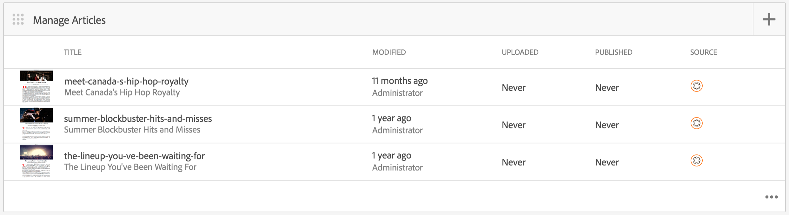

# AEM Mobile Application Dashboard {#aem-mobile-application-dashboard}

>[!NOTE]
>
>Adobe empfiehlt die Verwendung des SPA-Editors für Projekte, für die ein Framework-basiertes Client-seitiges Rendering für einzelne Seiten (z. B. React) erforderlich ist. [Weitere Informationen](/help/sites-developing/spa-overview.md)

Sie können Ihre App- und App-Inhalte über das AEM Mobile Application Dashboard oder das Control Center verwalten.

Sie können die einzelnen Kacheln im Control Center im Drilldown-Verfahren betrachten, um Details anzuzeigen oder zu bearbeiten, indem Sie auf &quot;..&quot;in der rechten unteren Ecke klicken.

>[!NOTE]
>
>Sie können die Reihenfolge der Kacheln neu anordnen, indem Sie auf das Grabsymbol der Kachel klicken (9 Punkte links oben). Die Bestelländerung ist benutzerspezifisch und für einzelne Benutzer unterschiedlich.

Die Verwaltung von App-Inhalten erfordert kollektive Anstrengungen von Entwicklern, Inhaltsautoren und Administratoren. Autoren bearbeiten Seiten, die wiederum auf Vorlagen und Komponenten basieren, die von App-Entwicklern generiert wurden.

Schließlich veröffentlichen Administratoren strategisch den aktualisierten App-Inhalt.

## Die Kachel App verwalten {#the-manage-app-tile}

Im Bereich **App verwalten** werden verfügbare Anwendungsinformationen angezeigt:

* Titel
* Beschreibung
* Symbol
* Zuletzt geändert
* Zuletzt geändert von

## Kachel &quot;Verbindung verwalten&quot; {#the-manage-connection-tile}

Auf der Kachel **Verbindung verwalten** werden die AEM Mobile On-demand Services-Verbindungsinformationen angezeigt:

* Name der Cloud-Konfiguration
* Projektname und ID
* Verbindungsstatus

>[!NOTE]
>
>Klicken Sie oben rechts auf das Zahnrad, um eine Mobile On-Demand Cloud-Konfiguration einzurichten.
>
>Weitere Informationen finden Sie unter [Konfigurieren mobiler On-Demand-Dienste](/help/mobile/mobile-on-demand-associating-an-on-demand-app-to-cloud-configuration.md) .

## Verwalten von Entitäten {#managing-entities}

Diese drei Kacheln bieten einen Überblick über den Status des Inhalts einer App:

* **Banner**
* **article**
* **Sammlungen**

Jede Kachel kann erweitert werden, um eine detailliertere Listenansicht bereitzustellen, indem Sie auf die Auslassungspunkte (...) in der rechten unteren Ecke klicken. Diese Listenansichten bieten eine alternative Möglichkeit zum Zugriff auf allgemeine Mobile On Demand-Aktionen wie das Löschen, Hochladen und Bearbeiten von Eigenschaften.

### Die Kachel Banner verwalten {#the-manage-banners-tile}

Über die Kachel **Banner verwalten** können Sie den Inhalt eines Banners verwalten. Die folgenden Informationen werden für ein Banner angezeigt:

* image
* **TITLE**: Name des Banners
* **MODIFIED**: Zuletzt geändert in AEM
* **HOCHGELADEN**: Zuletzt von AEM hochgeladen
* **VERÖFFENTLICHT**: AEM zuletzt veröffentlichtes Anforderungsformular
* **SOURCE**: Quelle (AEM lokal oder remote von Mobile On Demand)

Die folgende Abbildung zeigt die Kachel **Banner verwalten** im AEM Mobile Application Dashboard:

>[!NOTE]
>
>Informationen zum Erstellen, Löschen oder Aktualisieren von Bannern finden Sie unter **[Verwalten von Bannern](/help/mobile/mobile-on-demand-managing-banners.md)** .

### Die Kachel Artikel verwalten {#the-manage-articles-tile}

Mit der Kachel **Artikel verwalten** können Sie den Inhalt eines Artikels verwalten. Die folgenden Informationen werden für einen Artikel angezeigt:

* image
* **TITLE**: Name des Artikels
* **MODIFIED**: Zuletzt geändert in AEM
* **HOCHGELADEN**: Zuletzt von AEM hochgeladen
* **VERÖFFENTLICHT**: AEM zuletzt veröffentlichtes Anforderungsformular
* **SOURCE**: Quelle (AEM lokal oder remote von Mobile On-Demand)

Die folgende Abbildung zeigt die Kachel **Artikel verwalten** im AEM Mobile Application Dashboard:

>[!NOTE]
>
>Informationen zum Erstellen, Löschen oder Aktualisieren der Artikel finden Sie unter [**Verwalten von Artikeln**](/help/mobile/mobile-on-demand-managing-articles.md) .

### Die Kachel Sammlungen verwalten {#the-manage-collections-tile}

Mit der Kachel **Sammlungen verwalten** können Sie den Inhalt einer Sammlung verwalten. Die folgenden Informationen werden für eine Sammlung angezeigt:

* image
* **TITLE**: Name der Sammlung
* **MODIFIED**: Zuletzt geändert in AEM
* **HOCHGELADEN**: Zuletzt von AEM hochgeladen
* **VERÖFFENTLICHT**: AEM zuletzt veröffentlichtes Anforderungsformular
* **SOURCE**: Quelle (AEM lokal oder remote von Mobile On-Demand)

Die folgende Abbildung zeigt die Kachel **Sammlungen verwalten** im AEM Mobile Application Dashboard:

>[!NOTE]
>
>Informationen zum Erstellen, Löschen oder Aktualisieren von Sammlungen finden Sie unter **[Verwalten von Sammlungen](/help/mobile/mobile-on-demand-managing-collections.md)** .

### Die nächsten Schritte {#the-next-steps}

Sobald Sie sich mit dem Anwendungs-Dashboard vertraut gemacht haben, sehen Sie sich die folgenden Ressourcen an, um eine Mobile App zu erstellen:

* [Erstellen und Konfigurieren von Anwendungen](/help/mobile/mobile-apps-ondemand-application-create-configure-action.md)
* [Verknüpfen einer On-Demand-App mit einer Cloud-Konfiguration](/help/mobile/mobile-on-demand-associating-an-on-demand-app-to-cloud-configuration.md)
* [Content Management-Aktionen](/help/mobile/mobile-apps-ondemand-manage-content-ondemand.md)

### Zusätzliche Ressourcen {#additional-resources}

Informationen zu den Rollen und Zuständigkeiten von Administratoren und Entwicklern finden Sie in den folgenden Ressourcen:

* [Entwickeln von AEM für AEM Mobile On-demand Services](/help/mobile/aem-mobile-on-demand.md)
* [Verwalten von Inhalten zur Verwendung von AEM Mobile On-demand Services](/help/mobile/aem-mobile.md)
