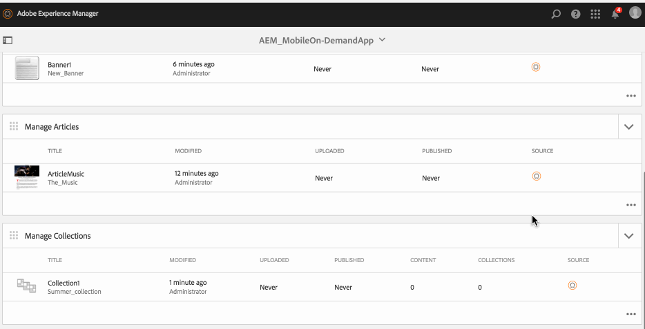

# Verwalten von Sammlungen{#managing-collections}

>[!NOTE]
>
>Adobe empfiehlt die Verwendung des SPA-Editors für Projekte, die ein Framework-basiertes clientseitiges Rendering von Einzelseiten-Apps erfordern (z. B. React). [Weitere Informationen](/help/sites-developing/spa-overview.md)

Inhaltsverwaltungsaktionen sind die Bausteine, mit denen Inhalte in einer Anwendung erstellt und verwaltet werden können. Die folgenden Aktionen werden für Inhalte in der Anwendung ausgeführt.

## Sammlungen - Überblick {#collections-overview}

Sammlungen stellen eine genau definierte *Behälter* mit Inhalten wie Artikeln oder Bannern gefüllt, die dem Titelthema entsprechen.

>[!NOTE]
>
>Weitere Informationen zu den folgenden Themen in AEM Mobile-Apps finden Sie in den folgenden Ressourcen der Online-Hilfe:
>
>* [Designüberlegungen](https://helpx.adobe.com/digital-publishing-solution/help/design-app.html)
>
>* [Verwalten von Sammlungen](https://helpx.adobe.com/digital-publishing-solution/help/creating-collections.html)
>

## Erstellen einer Sammlung {#creating-a-collection}

Der allgemeine Workflow zum Erstellen einer Kollektion lautet wie folgt:

1. Auswählen **Mobile** über die Seitenleiste aus.
1. Wählen Sie in Mobile Ihre Mobile On-Demand-App aus dem Katalog aus.
1. Klicken Sie oben rechts im **Verwalten von Sammlungen** Kachel.
1. Führen Sie jeden Schritt des Assistenten durch, um mit der Erstellung des neuen Artikels fortzufahren.
1. Wenn Sie bereit sind, klicken Sie auf **Erstellen**.
1. Ihr neuer Artikel wird im **Verwalten von Sammlungen** Kachel.

## Importieren einer neuen Sammlung {#importing-a-new-collection}

Vorhandene On-Demand-Inhalte für Mobilgeräte können von Mobile On-Demand heruntergeladen (importiert) werden, um sie zu AEM. Dies ermöglicht die Bearbeitung und Anzeige lokaler Inhalte.

>[!NOTE]
>
>Beim Import sind keine Bilder enthalten.

Der Workflow zum Importieren einer neuen Sammlung

1. Wählen Sie in Mobile Ihre Mobile On-Demand-App aus dem Katalog aus.
1. Klicken Sie oben rechts im **Verwalten von Sammlungen** und wählen Sie Sammlungen importieren aus.
1. Klicken **Sammlungen importieren** im Dialogfeld und dann Schließen.
1. Ihre On-Demand-Sammlungen für Mobilgeräte werden jetzt im **Verwalten von Sammlungen** Kachel.

>[!CAUTION]
>
>Sie müssen zuerst eine Mobile On-Demand-Verbindung verknüpfen.

## Bearbeiten einer Sammlung {#editing-a-collection}

Verwenden Sie den integrierten AEM Drag &amp; Drop-Editor, um einen Artikel hinzuzufügen oder zu ändern. Komponenten wie Text und Bilder können hinzugefügt/entfernt werden. Bilder aus DAM-Assets können eingefügt werden.

Der Workflow zum Bearbeiten einer Sammlung:

1. Wählen Sie in Mobile Ihre Mobile On-Demand-App aus dem Katalog aus.
1. Wählen Sie einen AEM Artikel aus dem **Verwalten von Sammlungen** Kachel.
1. Klicken Sie in der Listenansicht auf die markierte Sammlung, um sie im Inhaltseditor zu öffnen.
1. Verwenden Sie den Inhaltseditor, um Sammlungsinhalte (Manuskripte, Bilder, Text usw.) zu ziehen.

### Anzeigen und Bearbeiten von Metadaten in einer Sammlung {#viewing-and-editing-the-metadata-within-a-collection}

Sammlungen verfügen über zahlreiche Eigenschaften wie Titel, Beschreibungen und Bilder. Diese Aktion wird verwendet, um solche Eigenschaften anzuzeigen und zu ändern. Optional können diese Änderungen beim Speichern in Mobile On-Demand hochgeladen werden.

Allgemeiner Workflow zum Anzeigen/Bearbeiten einer Sammlung:

1. Wählen Sie in Mobile Ihre Mobile On-Demand-App aus dem Katalog aus.
1. Wählen Sie eine Sammlung aus der **Verwalten von Sammlungen** Kachel.

1. Wählen Sie in der Aktionsleiste **Eigenschaften** aus.
1. Zeigen Sie alle verfügbaren Metadaten für diesen Artikel an.
1. Bearbeiten Sie die Metadaten nach Bedarf und klicken Sie auf **Speichern** wann geschehen.
1. Optional können Sie die Änderungen sofort in Mobile On-Demand hochladen.

## Hochladen einer Sammlung {#uploading-a-collection}

Mit der Aktion &quot;Hochladen&quot;wird der ausgewählte Inhalt kopiert und zu einem Mobile On-Demand-Projekt hinzugefügt. Bereits vorhandene mobile On-Demand-Inhalte werden durch die neue Version ersetzt.

Allgemeiner Workflow zum Hochladen einer Sammlung:

1. Von **Mobile** wählen Sie Ihre Mobile On-Demand-App aus dem Katalog aus.
1. Im **Verwalten von Sammlungen** -Kachel einen Artikel zum Hochladen auf Mobile On-Demand auswählen.
1. Fügen Sie bei Bedarf in der Listenansicht weitere Sammlungen hinzu.
1. Auswählen **Hochladen** Klicken Sie in der Aktionsleiste auf Hochladen im Dialogfeld.
1. Ihre Sammlung(en) wurde(n) jetzt in Mobile On-Demand hochgeladen.

## Löschen einer Sammlung {#deleting-a-collection}

Durch diesen Vorgang wird die ausgewählte Sammlung aus Mobile On-Demand und optional aus der lokalen AEM gelöscht.

Der allgemeine Workflow zum Löschen einer Sammlung:

1. Wählen Sie in Mobile Ihre Mobile On-Demand-App aus dem Katalog aus.
1. Wählen Sie den zu löschenden Artikel im **Verwalten von Sammlungen** Kachel.
1. Stellen Sie sicher, dass es in der Liste ausgewählt ist (wählen Sie nach Bedarf andere aus, die gelöscht werden sollen).
1. Klicken **Löschen** in der Aktionsleiste aus.
1. Überprüfen Sie, ob Sie sowohl AEM als auch Mobile On-Demand löschen möchten.
1. Klicken Sie auf **Löschen**.
1. Ihre Sammlung wird jetzt aus der Liste entfernt.

## Hinzufügen von Inhalten zu Sammlungen {#adding-content-to-collections}

Sammlungen sind im Wesentlichen eine Kategorie verwandter Inhalte. Sie sammeln Inhalte wie Artikel und Banner in Paketen, die die Navigationsstruktur Ihrer Anwendung definieren. Sammlungen können verschachtelt werden.

>[!NOTE]
>
>Inhalte müssen in Mobile On-Demand hochgeladen werden, bevor sie zu einer Sammlung hinzugefügt werden können.

Sammlungen sind im Wesentlichen eine Kategorie verwandter Inhalte: Sie sammeln Inhalte wie Artikel und Banner in Paketen, die die Navigationsstruktur Ihrer Anwendung definieren. Sammlungen können verschachtelt werden.

1. Wählen Sie in Mobile Ihre Mobile On-Demand-App aus dem Katalog aus.
1. Wählen Sie einen zuvor hochgeladenen Artikel (oder Banner/Sammlung) aus.
1. Wählen Sie in der Aktionsleiste Hinzufügen zu aus.
1. Wählen Sie im Dialogfeld eine zuvor hochgeladene Sammlung aus.
1. Klicken **Aktualisieren** , um Inhalte zur Sammlung hinzuzufügen.

### Die nächsten Schritte {#the-next-steps}

Informationen zum Verwalten von Sammlungen finden Sie unter

* [Verwalten von Bannern](/help/mobile/mobile-on-demand-managing-banners.md)
* [Verwalten von Artikeln](/help/mobile/mobile-on-demand-managing-articles.md)
* [Hochladen freigegebener Ressourcen](/help/mobile/mobile-on-demand-shared-resources.md)
* [Veröffentlichen/Veröffentlichung des Inhalts rückgängig machen](/help/mobile/mobile-on-demand-publishing-unpublishing.md)
* [Vorschau mit Preflight](/help/mobile/aem-mobile-manage-ondemand-services.md)
