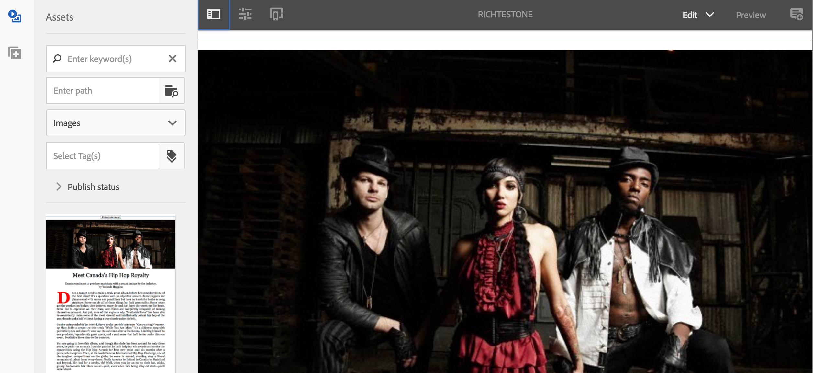

# Erstellen und Hinzufügen von Vorlagen und Komponenten {#creating-and-adding-templates-and-components}

>[!NOTE]
>
>Adobe empfiehlt die Verwendung des SPA-Editors für Projekte, die ein Framework-basiertes clientseitiges Rendering von Einzelseiten-Apps erfordern (z. B. React). [Weitere Informationen](/help/sites-developing/spa-overview.md)

AEM Mobile On-Demand bietet eine vollständig konfigurierte App-Vorlage, eine Artikelvorlage und Artikelkomponenten.

Die We.Unlimited App ist eine Beispielvorlage, die die Shell einer vollständig konfigurierbaren und verwaltbaren AEM Mobile On-Demand-Anwendung darstellt.

Wenn Sie diese Beispielvorlage beim Erstellen einer neuen App auswählen, wird ein Rich-Dashboard für AEM Mobile-Funktionen bereitgestellt.

>[!NOTE]
>
>Informationen zum Verwalten von Anwendungs- und App-Inhalten über das AEM Mobile Apps Control Center finden Sie im Abschnitt [AEM Mobile Application Dashboard](/help/mobile/mobile-apps-ondemand-application-dashboard.md).

## Erstellen von App-Vorlagen {#creating-app-templates}

Eine App-Vorlage wird zum Erstellen einer neuen App verwendet und dient als Sammlung von Seitenvorlagen und Komponenten, die eine Grundlinie oder Grundlage einer App darstellen. Die Vorlage stempelt einige grundlegende Eigenschaften heraus, um die App auf die richtige Weise zu führen. Im Allgemeinen würde ein Kunde nicht zu viele Apps insgesamt erstellen.

App-Vorlagen bieten eine einfache Möglichkeit, vorhandene, von Entwicklern erstellte Designs zu nutzen, die für die Erstellung neuer Apps in AEM verwendet werden.

Wenn Sie eine neue App basierend auf der Vorlage einer anderen App erstellen, erhalten Sie eine App mit einem Startpunkt, der für die App steht, aus der sie erstellt wurde.

Schritte zum Erstellen einer neuen App basierend auf einer App-Vorlage:

1. Navigieren Sie zum AEM Mobile-App-Katalog: *&lt;server-url>/aem/apps.html/content/mobileapps*
1. Auswählen **Erstellen** —> **App** wie unten gezeigt

Nachdem Sie eine App mit dieser Vorlage erstellt haben, können Sie Ihrer App Artikel, Banner und Sammlungen hinzufügen. Informationen zum erneuten Besuch der Erstellung von Artikeln, Bannern und Sammlungen finden Sie unter [Content Management-Aktionen](/help/mobile/mobile-apps-ondemand-manage-content-ondemand.md).

>[!NOTE]
>
>Alternativ können Sie auch eine Beispiel-App-Vorlage auswählen, z. B. **We.Unlimited** App, die Ihnen von einem AEM-Entwickler zur Verfügung gestellt wird. Wenn Sie diese Beispielvorlage für Ihre App verwenden, erhalten Sie einige Beispielartikel und Sammlungen, an denen Sie arbeiten können. Sie können die Beispielvorlagen und -komponenten verwenden, die vorhandenen anpassen oder neue für Ihre App erstellen.

>[!CAUTION]
>
>Einstellung ***redirectTarget*** property
>
>Bei Verwendung einer der App-Vorlagen definiert der Entwickler den Inhalt der Anwendung. Der Entwickler muss jedoch wissen, wo die Anwendung in der jcr erstellt wird, und den Wert von ***redirectTarget*** -Eigenschaft.
>
>Die ***redirectTarget*** wird als Teil des Vorgangs &quot;create app&quot;berechnet und versucht, einen Pfad aufzulösen, wenn eine redirectTarget -Eigenschaft als Teil der App-Vorlage verfügbar ist und der Wert von &quot;redirectTarget&quot;als relativ definiert ist. Wenn der Prozess zum Erstellen einer App einen relativen Wert für redirectTarget in der App-Vorlage findet, wird der Wert an den aufgelösten Speicherort angehängt, an dem die App erstellt wurde.
>
>Wenn beispielsweise eine App-Vorlage eine ***redirectTarget*** mit dem Wert &quot;*language-masters/en* und die App in erstellt wurde.*/content/mobileapps/fooApp*&quot;, lautet der Endwert für redirectTarget nach der Erstellung der App &quot;*/content/mobileapps/fooApp/language-masters/en*&quot;.
>

## Erstellen von Inhaltsvorlagen {#creating-content-templates}

Jeder Entitätstyp verfügt über zwei vordefinierte Vorlagen. Diese sind:

* **Standardvorlagen:** für die Inhaltserstellung mit entsprechenden Standardeigenschaften/-struktur verwendet
* **Importierte Vorlagen:** zum Importieren von Inhalten aus AEM Mobile mit entsprechenden Standardeigenschaften/-strukturen verwendet werden

### Artikelvorlagen {#article-templates}

Der Artikel &quot;Unlimited&quot;ist eine Beispielvorlage, die ein typisches AEM Mobile On-Demand-Artikellayout darstellt.

1. Klicken Sie auf **+** in **Artikel verwalten** , um einen neuen Artikel zu erstellen. Sie können entweder eine **Unbegrenzter Artikel** oder **Rich-Text-Artikel**. Die folgende Abbildung zeigt die Option, aus der Sie eine dieser beiden Artikelvorlagen auswählen können.

1. Klicken **Nächste** um Artikelmeta-Daten wie Artikelname/Titel, Beschreibung, Autor, Abstract, Abteilung, Miniaturbild, Artikelzugriff usw. zu definieren.
1. Klicken **Nächste** , um die Eigenschaften der Werbung auszufüllen.
1. Klicken **Nächste** um Artikelbild oder Social Media-Bild einzugeben
1. Klicken **Nächste** , um einen Kollektionslink zu diesem neuen Artikel auszuwählen.
1. Klicken **Nächste** , um Details für Social Sharing einzugeben.
1. Klicken **Erstellen** , um den Prozess zum Erstellen eines Artikels mithilfe des Beispiels abzuschließen. Klicken Sie entweder auf **Fertig** oder **Artikel bearbeiten** um die Eigenschaften dieses Artikels zu bearbeiten.

### Hinzufügen von Komponenten zum Artikel {#adding-components-to-article}

Nach der Erstellung kann ein Autor den Inhalt eines Artikels bearbeiten, indem er Komponenten wie Text und Bilder hinzufügt. Artikel sind eine Erweiterung AEM Seitenvorlagen.

Wählen Sie einen Artikel aus, den Sie bearbeiten möchten, und klicken Sie auf **Bearbeiten** , um dem Artikel Komponenten hinzuzufügen.

 

Wählen Sie &quot;**+**&#39; im linken Bereich, um Komponenten zu Ihrem Artikel hinzuzufügen.

### Erstellen von nativen Vorlagen {#creating-out-of-the-box-templates}

Es gibt keine nativen Artikelvorlagen. Es gibt jedoch eine Standardvorlage, die von benutzerdefinierten Vorlagen erweitert werden sollte. Weitere Informationen finden Sie unter Geometrixx Unlimited App [Beispiel für eine Artikelvorlage](http://localhost:4502/crx/de/index.jsp#/apps/geometrixx-unlimited-app/templates/article).

Zu den wichtigsten Eigenschaften, die über die normalen erforderlichen Eigenschaften AEM Vorlage hinausgehen, gehören:

***dps-resourceType=&quot;dps:Article&quot;***

Mit dieser Eigenschaft wird sichergestellt, dass die AEM-Seite als AEM Mobile-Targeting-Artikelseite erkannt wird.

Gemäß AEM Vorlagen können Sie der Vorlage alle Standardeigenschaften oder untergeordneten Knoten hinzufügen ***jcr:content***.

### Banner- und Sammlungsvorlagen {#banner-and-collection-templates}

>[!CAUTION]
>
>Banner und Sammlungen verfügen nicht über Inhalte, sodass ihre Erstellung benutzerdefinierte Vorlagen nicht unterstützt.

## Erstellen und Hinzufügen von Komponenten {#creating-and-adding-components}

Komponenten verwenden Widgets und ermöglichen den Zugriff auf Widgets, die zum Rendern des Inhalts verwendet werden.

Eine einfache Komponente ist im Code-Repository enthalten, dessen Quelle in AEM zu finden ist. Anschließend kann es auch lokal in der CRXDE Lite geöffnet werden.

>[!NOTE]
>
>Für AEM Mobile stehen derzeit keine nativen Komponenten zur Verfügung.
>

Sie können Komponenten zu Ihrer Seite hinzufügen. Jede Komponente kann in einer AEM Mobile-App verwendet werden, wird jedoch bei Anwendung möglicherweise nicht ordnungsgemäß gerendert.

Benutzerdefinierte Komponenten können jedoch nicht ordnungsgemäß exportieren und in AEM Mobile On-demand Services hochladen, wenn kein benutzerdefinierter Export-Content-Synchronisierungs-Handler vorhanden ist, der in AEM gerendert wird.

Nachdem die Komponente bereits in eine AEM Seite eingefügt wurde, können Sie der Seite eine weitere Komponente hinzufügen oder eine vorhandene bearbeiten.

**So fügen Sie der Seite eine weitere Komponente hinzu:**

1. Wählen Sie diese Seite aus und stellen Sie sicher, dass Sie sich im Bearbeitungsmodus befinden. Verwenden Sie dazu das Dropdown-Menü oben rechts in der Kopfzeile des Editors.
1. Schalten Sie das seitliche Bedienfeld mit dem Symbol ganz links in der Kopfzeile des Editors um.
1. Wählen Sie die **Komponenten** tab
1. Ziehen Sie eine der verfügbaren Komponenten auf die Seite

**So bearbeiten Sie eine vorhandene Komponente:**

1. Wählen Sie diese Seite aus und stellen Sie sicher, dass Sie **Bearbeiten** -Modus und wählen Sie die Komponente aus
1. Tippen Sie auf das Schraubenschlüsselsymbol, um die Komponente zu konfigurieren.

>[!NOTE]
>
>Sie können eine Komponente in AEM erstellen und diese anpassen, indem Sie [Entwickeln mit CRXDE Lite](/help/sites-developing/developing-with-crxde-lite.md). Nachdem Sie die vorhandene Komponente Ihren Anforderungen entsprechend angepasst haben, können Sie sie zu Ihrer Seite hinzufügen, indem Sie die **Bearbeiten** Option unter **Artikel verwalten** wie in der obigen Abbildung dargestellt.

>[!NOTE]
>
>Siehe [Best Practices für die Entwicklung von Vorlagen und Komponenten](/help/mobile/best-practices-aem-mobile.md) in AEM Mobile.

### Die nächsten Schritte {#the-next-steps}

* [Verwenden von Inhaltseigenschaften zum Exportieren von Inhalten](/help/mobile/on-demand-content-properties-exporting.md)
* [Mobil mit Inhaltssynchronisierung](/help/mobile/mobile-ondemand-contentsync.md)
