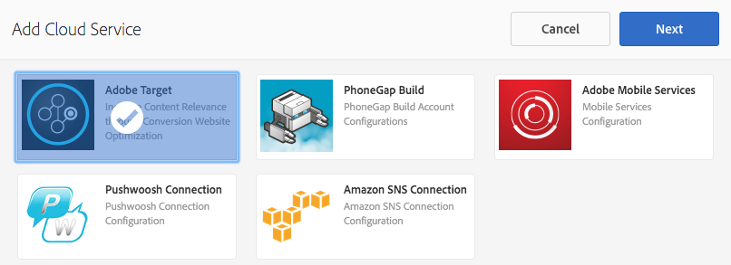

# Personalisierung von AEM Mobile-Inhalten{#aem-mobile-content-personalization}

>[!NOTE]
>
>Adobe empfiehlt die Verwendung des SPA-Editors für Projekte, für die ein frameworkbasiertes clientseitiges Rendering für einzelne Seiten (z. B. React) erforderlich ist. [Weitere Informationen](/help/sites-developing/spa-overview.md)

>[!NOTE]
>
>Dieses Dokument ist Teil des Leitfadens [Erste Schritte mit AEM Mobile](/help/mobile/getting-started-aem-mobile.md), eines empfohlenen Ausgangspunkts für die AEM Mobile-Referenz.

Mit der AEM Mobile-Personalisierungsfunktion für Inhalte können [AEM-Autoren](#author) Mobile-App-Inhalte mithilfe von [Adobe Target](https://www.adobe.com/ca/marketing-cloud/testing-targeting.html) personalisieren. Dies ermöglicht die Bereitstellung gezielter Angebote an Benutzer mobiler Apps. Adobe Experience Manager Mobile bietet die Möglichkeit, Inhalte zu erstellen, als Zielgruppe zu verwenden und bereitzustellen, die den Anwendern Inhalte bereitstellen, die für ihren jeweiligen Bedarf spezifisch sind.

Wie es in AEM oft der Fall ist, müssen Administratoren und Entwickler die Umgebung zuerst vorbereiten, damit Autoren diese Inhalte erstellen können.

[AEM ](#administrator) Administratoren müssen eine Verbindung zwischen AEM Mobile und dem Adobe Target-Cloud Service herstellen.

In der Zwischenzeit müssen AEM Mobile [Entwickler](#developer) ihre vorhandenen Skripte ändern, um die gezielte Inhaltserstellung zu erleichtern.

## Für Administratoren {#for-administrators}

Es gibt eine Reihe von Schritten, die durchgeführt werden müssen, bevor Inhaltsautoren mit der Generierung zielgerichteter Inhalte für mobile Apps beginnen können: Es gibt die richtigen Berechtigungen für Benutzer und Gruppen, das Erstellen von Cloud-Services, das Konfigurieren der Anwendung für die Aktivität und schließlich das Generieren des Inhalts.

Dieser Artikel führt Sie durch den Prozess, der zum Konfigurieren der [AEM Mobile Hybrid-Referenzanwendung](https://github.com/Adobe-Marketing-Cloud-Apps/aem-mobile-hybrid-reference) für das Targeting verwendet wird.

Es wird davon ausgegangen, dass die AEM Mobile Hybrid-Referenzanwendung erfolgreich bereitgestellt wurde und über das AEM Mobile-Dashboard darauf zugegriffen werden kann.

Bevor Autoren zielgerichtete Inhalte in einer Anwendung generieren können, muss Ihre AEM-Instanz [mit dem Adobe Target-Cloud Service konfiguriert werden.](/help/mobile/aem-mobile-configuring-cloud-service.md)

### Berechtigungen {#permissions}

Benutzer, die Zugriff auf die Personalisierungskonsole benötigen, müssen der Gruppe `target-activity-authors` angehören.

Es wird empfohlen, dass die target-activity-group im Rahmen der Benutzer- und Gruppeneinrichtung zur Gruppe apps-admins hinzugefügt wird. Durch Hinzufügen der Gruppe target-activity-authors können Benutzer den Menüeintrag Personalisierung-Navigation sehen.

>[!NOTE]
>
>Wenn Sie vergessen, der Gruppe target-activity-authors Benutzer oder Gruppen hinzuzufügen, die Zugriff auf die Personalisierungs-Admin Console haben möchten, wird Benutzern die Personalisierungskonsole nicht angezeigt.

### Cloud Services {#cloud-services}

Damit zielgerichtete Inhalte für mobile Anwendungen funktionieren, müssen zwei Dienste konfiguriert werden: Der Adobe Target-Dienst und der Adobe Mobile Services-Dienst. Der Adobe Target-Dienst stellt die Engine für die Verarbeitung von Client-Anforderungen und die Rückgabe personalisierter Inhalte bereit. Der Adobe Mobile Services-Dienst stellt die Verbindung zwischen den Adobe Services und der Mobile App über die Datei ADBMobileConfig.json her, die vom AMS Cordova-Plug-in genutzt wird. Im AEM Mobile Dashboard können Sie Ihre Anwendung konfigurieren, indem Sie die beiden Dienste hinzufügen.

Suchen Sie im AEM Mobile Dashboard die Schaltfläche Cloud Services verwalten und klicken Sie auf die Schaltfläche + .


Wählen Sie im Assistenten Cloud Service hinzufügen die Cloud Service-Karte &quot;Adobe Target&quot;aus und klicken Sie auf Weiter.



Im Dropdown-Menü Konfiguration auswählen können Sie entweder eine neue Konfiguration erstellen oder eine vorhandene auswählen. Um eine neue Konfiguration zu erstellen, wählen Sie &quot;Konfiguration erstellen&quot;aus dem Dropdown-Menü aus. Geben Sie einen Titel für die Target-Konfiguration ein. Geben Sie Ihren Clientcode, Ihre E-Mail-Adresse und Ihr Kennwort ein, die mit Ihrem Target-Konto verknüpft sind. Wenn Sie die Werte für diese Felder nicht kennen, wenden Sie sich an den Adobe Target-Support. Klicken Sie auf die Schaltfläche &quot;Überprüfen&quot;, um die Anmeldeinformationen zu überprüfen. Klicken Sie nach der Überprüfung auf die Schaltfläche Senden , um den Cloud-Dienst zu erstellen.

>[!NOTE]
>
>Der erstellte Cloud-Dienst wird über den Assistenten automatisch mit der Mobile App verknüpft. Der Eigenschaftswert cq:cloudserviceconfigs wird im Knoten jcr:content des Anwendungsgruppenknotens festgelegt. Für das Hybrid-App-Beispiel wird es unter /content/mobileapps/hybrid-reference-app/jcr:content festgelegt, wobei der Wert auf den automatisch generierten Framework-Knoten unter /etc/cloudservices/testandtarget/adobe-target—aem-apps/framework verweist. Der Framework-Knoten verfügt über zwei standardmäßig festgelegte Eigenschaften: Geschlecht und Alter. Das Framework wird nur von AEM Vorschau verwendet und hat keine Auswirkungen auf das Gerät.

Nach Abschluss des Assistenten enthält die Kachel Cloud Service verwalten den Target-Cloud-Service, enthält jedoch eine Warnung zu einem fehlenden Adobe Mobile Service-Konto.


### Adobe Mobile Services {#adobe-mobile-services}

Es ist erforderlich, auch ein Adobe Mobile Services (AMS)-Konto mit der Anwendung zu verknüpfen. Der AMS-Dienst stellt die erforderliche Datei ADBMobileConfig.json bereit, die die Target-Clientcode-Informationen enthält. Bevor Sie eine Verknüpfung mit dem AMS-Konto erstellen, muss das AMS-Konto von einem Benutzer geändert werden, der über Berechtigungen für AMS verfügt.

### Clientcode {#client-code}

Um sich bei den AMS-Diensten anzumelden, besuchen Sie [https://mobilemarketing.adobe.com](https://mobilemarketing.adobe.com/), wählen Sie die Mobile App aus und klicken Sie auf die Einstellungen. Suchen Sie das Feld SDK-Target-Optionen , platzieren Sie den Client-Code in das Feld und klicken Sie auf Speichern .


Nachdem der Clientcode mit der Mobile App verknüpft wurde, werden die Diensteinstellungen über die Datei ADBMobileConfig.json bereitgestellt, wenn der AMS-Cloud-Service über das Adobe Mobile Dashboard konfiguriert wird.

### Adobe Mobile Service Cloud Service {#adobe-mobile-service-cloud-service}

Nachdem AMS konfiguriert wurde, ist es an der Zeit, die Mobile App im Adobe Mobile Dashboard zu verknüpfen. Suchen Sie im AEM Mobile Dashboard die Schaltfläche Cloud Services verwalten und klicken Sie auf die Schaltfläche + .


Wählen Sie die Adobe Mobile Services -Karte aus und klicken Sie auf Weiter.


Wählen Sie im Schritt Erstellen oder Auswählen des Assistenten die Dropdown-Liste Mobile Service und danach den Eintrag Konfiguration erstellen aus. Geben Sie einen Titel, ein Unternehmen, einen Benutzernamen und ein Kennwort ein und wählen Sie das entsprechende Rechenzentrum aus. Wenn Sie diese Werte nicht kennen, wenden Sie sich an Ihren Adobe Mobile Service-Administrator, um sie zu erhalten. Nachdem alle Felder ausgefüllt wurden, klicken Sie auf die Schaltfläche Überprüfen . Der Überprüfungsprozess wird an AMS gesendet und überprüft die Anmeldeinformationen für das Konto. Nach erfolgreicher Überprüfung wird eine Liste mit Mobile Apps gefüllt, in der Sie die zugehörige Mobile App aus der Dropdown-Liste auswählen. Klicken Sie auf die Schaltfläche Senden , um den Assistenten abzuschließen. Der Prozess kann ein wenig Zeit in Anspruch nehmen, um die Konfigurationsdaten und alle damit verbundenen Analysen mit der Anwendung abzurufen. Klicken Sie nach Abschluss des Vorgangs im Modal auf die Schaltfläche Fertig , um zum Adobe Mobile Dashboard zurückzukehren.

Kehren Sie zum Mobile Dashboard zurück und die Kachel Cloud Services verwalten enthält den AMS-Cloud-Service. Sie werden auch feststellen, dass die Kachel Metriken analysieren mit Lebenszyklusberichten gefüllt wird.


## Für Autoren {#for-authors}

**Voraussetzung:** Wie oben erwähnt, müssen Administratoren die Verbindung zum Adobe Target-Dienst konfigurieren, bevor Autoren neue zielgerichtete Inhalte erstellen können.

Nachdem der Administrator die beiden Cloud-Services konfiguriert und der Entwickler den Handler für mobile Apps konfiguriert hat, können Inhaltsautoren nun mit der Generierung zielgerichteter Erlebnisse beginnen.

Die Erstellung von zielgerichteten Inhalten in einer AEM Mobile-App erfolgt ähnlich wie die Bearbeitung von AEM Sites:

Hier finden Sie eine vollständige Übersicht über [Verfassen zielgerichteter Inhalte in AEM](/help/sites-authoring/personalization.md)

## Für Entwickler {#for-developers}

AEM Entwickler, die mobile Apps erstellen, sollten weiterhin den Mustern folgen, die in AEM bei der Entwicklung von Komponenten häufig verwendet werden. Hier führen wir Sie durch die erforderlichen Schritte, damit Autoren zielgerichteter Inhalte erstellen können:

### Adobe Target ContentSync Handlers {#adobe-target-contentsync-handlers}

Um Inhalte für den Geräteinhalt des Benutzers bereitzustellen, werden durch Rendern der Angebote generiert, die von AEM Inhaltsautoren erstellt werden. Um das Rendering von Target-Angeboten zu verarbeiten, gibt es einen neuen Content Sync Handler, der die Angebote verarbeitet. Unter Verwendung der Hybrid-Referenzanwendung als Beispiel enthält das Inhaltspaket en (Englisch) die ContentSyncConfig mit einem [mobileappoffers](https://github.com/Adobe-Marketing-Cloud-Apps/aem-mobile-hybrid-reference/blob/master/aem-package/content-author/src/main/content/jcr_root/content/mobileapps/hybrid-reference-app/en/_jcr_content/pge-app/app-config-dev/targetOffers/.content.xml) -Handler. Der nächste Schritt ist entscheidend für das Rendern von Angeboten an das Gerät. Der Handler mobileappoffers verfügt über eine Pfadeigenschaft, die den Pfad zur Personalisierungsaktivität angibt, die für die Anwendung verwendet werden soll.

Wenn sich beispielsweise eine Aktivität unter */content/campaigns/hybridref* befindet, kopieren Sie diesen Pfad und fügen Sie ihn als Wert in die Eigenschaft *path* des Handlers mobileappoffers ein.

>[!NOTE]
>
>Für die Hybrid-Referenzanwendung gibt es zwei Handler für Mobile Apps, einen für die Entwicklung und einen für Produktionen.

Nachdem der Aktivitätspfad in der Pfadeigenschaft des Handlers mobileappoffers festgelegt wurde, speichern Sie den Handler. Der Handler ist nun bereit, Angebote für unsere Mobilgeräte zu rendern.

### Render Mode {#render-mode}

Der Handler für mobileappoffers ist für Veröffentlichungs- und Entwicklungskonfigurationen anders konfiguriert. Für Veröffentlichungskonfigurationen gibt es eine Eigenschaft mit dem Namen *renderMode* mit dem Wert *publish*, die auf dem Knoten cq:ContentSyncConfig festgelegt ist. Der Handler mobileappoffer verweist auf den renderMode und ändert, falls auf &quot;publish&quot;festgelegt, die zu erstellende Mbox-ID. Standardmäßig werden bei Mboxes, die von AEM erstellt werden, an die Mbox-ID der Wert —author angehängt. Dadurch wird festgestellt, dass die Aktivität noch nicht veröffentlicht wurde, und die nicht veröffentlichte Kampagne sollte für Angebotsauflösungen verwendet werden.

Wenn Inhalte über das Adobe Mobile Dashboard gestaffelt werden, werden Staging-Inhalte als produktionsbereite Inhalte betrachtet und über die Konfiguration der Inhaltssynchronisierung ohne Entwicklungsumgebung gerendert. Auf diese Weise wird der —author aus allen Mbox-IDs entfernt und es wird erwartet, dass eine veröffentlichte Aktivität auf dem Target-Server verfügbar ist. Bevor Sie gestaffelte Inhalte testen, stellen Sie sicher, dass die Aktivität veröffentlicht wurde.

### Entwicklung der Personalization App {#personalization-app-development}

#### Komponenten  {#components}

Die Grundlage für jeden Inhalt ist normalerweise eine Seitenkomponente, die entweder eine der AEM Seitenkomponenten wcm/foundation/components/page oder foundation/components/page erweitert, je nachdem, ob Sie HTL oder JSPs verwenden. Die Dauer dieser Schritte konzentriert sich auf die Verwendung der Komponente wcm/foundation/components/page . Die grundlegende Struktur der Seitenkomponente ist in mehrere Skripte unterteilt, wobei jedes Skript den speziellen Zweck bietet, es dem Entwickler zu ermöglichen, seinen Code bei Bedarf zu organisieren und zu überschreiben. Die beiden Skripte, die für die Personalisierung von Interesse sind, sind head.html und body.html. Diese beiden Skripte bieten einen Bereich, in den Code eingefügt werden kann, um das Authoring mit ContextHub, Cloud Services und Mobilgeräten zu unterstützen.

Im Folgenden finden Sie eine Übersicht über die beiden primären Skripte, die zur Aktivierung des Inhalts-Targetings verwendet werden.

#### head.html {#head-html}

Um dem Autor die Möglichkeit zu geben, seinen Inhalt gezielt anzusprechen, muss das Zielmenü der Seite hinzugefügt werden, damit der Autor den Kontext vom Bearbeitungsmodus zum Targeting-Modus ändern kann. Um diese Funktion zu aktivieren, sollte der Entwickler das Skript head.html so ändern, dass es das folgende Codefragment oben in head.html oder so nah wie möglich am Element &lt;title>&lt;/title> einbezieht.

```xml
<meta data-sly-test="${!wcmmode.disabled}">
    <div data-sly-call="${clientLib.all @ categories='personalization.kernel'}" data-sly-unwrap></div>
    <div data-sly-resource="${'config' @ resourceType='cq/personalization/components/clientcontext_optimized/config'}" data-sly-unwrap></div>
    <div data-sly-resource="${'contexthub' @ resourceType='granite/contexthub/components/contexthub'}" data-sly-unwrap></div>
</meta>
```

>[!NOTE]
>
>Beachten Sie, dass das Skript nur eingeschlossen werden sollte, wenn der WCM-Modus nicht deaktiviert wurde. Wenn der WCM-Modus deaktiviert ist (weitere Informationen finden Sie im Abschnitt des ContentSync-Handlers ), wird das Skript nicht in den endgültigen Anwendungs-Code aufgenommen.

Um Autoren die Möglichkeit zu geben, die zielgerichteten Inhalte in der Vorschau anzuzeigen, muss der Editor die Konfiguration des Adobe Target-Cloud-Service lokalisieren können. Der folgende Codeblock fügt zwei wichtige Skripte hinzu. Das erste, das der Seite die Möglichkeit gibt, den zugehörigen Target-Cloud-Service zu finden und die Aufrufe an Adobe Target durchzuführen. Das zweite ist das Hinzufügen der Kategorie cq.apps.targeting .

Die Kategorie **cq.apps.targeting** überschreibt die Standardkomponente cq/personalization/component/target und verwendet die Komponente mobileapps/components/target , die Angebote speziell für die Verwendung in mobilen Anwendungen rendert. Weitere Informationen hierzu finden Sie im Abschnitt Target-Komponente .

Der Code sollte in head.html hinzugefügt und direkt vor dem Ende des Elements &lt;/head> platziert werden.

```xml
<div data-sly-test="${!wcmmode.disabled}">
    <div data-sly-include="/libs/cq/cloudserviceconfigs/components/servicelibs/servicelibs.jsp" data-sly-unwrap></div>
    <meta data-sly-call="${clientLib.all @ categories='cq.apps.targeting'}" data-sly-unwrap></meta>
</div>
```

>[!NOTE]
>
>Beachten Sie, dass der Codeblock in einen WCM-Modus eingeschlossen ist, der nicht deaktiviert ist. Daher kommt er nur ins Spiel, wenn der Inhaltsautor an der Erstellung von Inhalten arbeitet. Die Cloud-Service-Skripte werden nicht zum generierten mobilen Laufzeitcode hinzugefügt.

#### body.html {#body-html}

Um dem Inhaltsautor die Möglichkeit zu geben, verschiedene Personas zu testen, muss das Skript body.html den folgenden Codeblock als erstes untergeordnetes Element des Body-Elements enthalten.

```xml
<div data-sly-test="${!wcmmode.disabled}">
    <div data-sly-resource="${'clientcontext' @ resourceType='cq/personalization/components/clientcontext_optimized'}" data-sly-unwrap></div>
</div>
```

Der letzte erforderliche Code befindet sich ganz unten auf der Datei body.html. Dieser Code sucht nach dem zugehörigen Cloud-Service und fügt den entsprechenden Targeting-Engine-Code ein.

```xml
<div data-sly-test="${!wcmmode.disabled}">
    <div data-sly-resource="${'cloudservices' @ resourceType='cq/cloudserviceconfigs/components/servicecomponents'}" data-sly-unwrap></div>
</div>
```

### Referenz-Anwendung {#reference-application}

Beispiele für head.html und body.html finden Sie in der [AEM Mobile Hybrid-Referenzanwendung](https://github.com/Adobe-Marketing-Cloud-Apps/aem-mobile-hybrid-reference), die dem Entwickler zeigt, wo die Skriptblöcke in den beiden Skripten platziert werden sollen.

### Content Sync Handler {#content-sync-handlers}

Wenn der Inhaltsautor die Erstellung von Inhalten für die Mobile App abgeschlossen hat, besteht der nächste Schritt darin, die Quelle herunterzuladen und die Anwendung zu erstellen oder den Inhalt zu veröffentlichen. Es gibt eine Reihe von Schritten, mit denen der Entwickler involviert ist, um dies zu erreichen. Um das Rendering des Inhalts zu unterstützen, verwendet AEM Mobile Inhaltssynchronisierungs-Handler, um den Inhalt zu rendern und zu verpacken. Für das Anwendungsbeispiel Personalisierung wurde ein neuer Content-Synchronisierungs-Handler eingeführt, um zielgerichtete Inhalte wiederzugeben. Der Handler &quot;mobileappoffers&quot;weiß, wie die zugehörigen Zielangebote gerendert werden, die vom Inhaltsautor erstellt wurden. Der Handler mobileappoffers erweitert den Aktualisierungs-Handler für abstrakte Seiten. Daher sind viele Eigenschaften ähnlich. Die Details des Handlers mobileappoffers haben die folgenden Eigenschaften.

<table>
 <tbody>
  <tr>
   <td><strong>Eigenschaft</strong></td>
   <td><strong>Wert</strong></td>
   <td><strong>Beschreibung</strong></td>
  </tr>
  <tr>
   <td>rewrite</td>
   <td>+ relativeParentPath<p> - "/"</p> </td>
   <td>Die rewrite-Eigenschaft gibt an, wie Pfade im Inhalt umgeschrieben werden sollen.</td>
  </tr>
  <tr>
   <td>includedPageTypes</td>
   <td><p>"cq/personalization/components/teaserpage",</p> <p>"cq/personalization/components/offerProxy"</p> </td>
   <td>Die Eigenschaft includePageTypes ist optional und standardmäßig auf Seiten mit Ressourcentypen cq/personalization/components/teaserpage und cq/personalization/components/offerProxy festgelegt. Diese beiden Ressourcentypen sind die Standard-Ressourcentypen, die bei der Zielgruppenbestimmung von Inhalten verwendet werden. Wenn zusätzliche Ressourcentypen unterstützt werden müssen, sollten sie zur Liste der includePageTypes hinzugefügt werden.</td>
  </tr>
  <tr>
   <td>locationRoot</td>
   <td>/content/mobileapps/&lt;app&gt;</td>
   <td>Der Speicherort der App.</td>
  </tr>
  <tr>
   <td>type</td>
   <td>mobileappoffers</td>
   <td>Der Name des Handlers, der mobileappoffers ist.</td>
  </tr>
  <tr>
   <td>selector</td>
   <td>tandt</td>
   <td>Der Tandt-Selektor wird zum Rendern der zielgerichteten Inhalte verwendet. </td>
  </tr>
  <tr>
   <td>targetRootDirectory</td>
   <td>www</td>
   <td>Der Stammordner, in dem der gerenderte Inhalt beibehalten werden soll.</td>
  </tr>
  <tr>
   <td>includeImages</td>
   <td>true | false</td>
   <td>Wenn "true", werden alle im Angebot enthaltenen Bilder gerendert. Wenn falsche Bilder übersprungen werden.</td>
  </tr>
  <tr>
   <td>includeVideos</td>
   <td>true | false</td>
   <td>Wenn "true", werden alle im Angebot enthaltenen Videos gerendert. Wenn falsche Videos übersprungen werden.</td>
  </tr>
  <tr>
   <td>path</td>
   <td>/content/campaigns/&lt;Marke&gt;</td>
   <td>verweist auf die Marke der Kampagne, an der die Angebote teilnehmen. Derzeit müssen alle Angebote aus derselben Kampagne stammen.</td>
  </tr>
  <tr>
   <td>tief</td>
   <td>true | false</td>
   <td>Wenn "true"rekursiv alle untergeordneten Seiten rendert, werden bei "false"keine Wiederholungen ausgegeben. </td>
  </tr>
  <tr>
   <td>extension</td>
   <td>html</td>
   <td>Legt die Erweiterung für die gerenderte Ressource fest. Auf HTML gesetzt, sodass die Seiten die Erweiterung .html aufweisen.</td>
  </tr>
 </tbody>
</table>

>[!NOTE]
>
>Die [AEM Mobile Hybrid Reference App](https://github.com/Adobe-Marketing-Cloud-Apps/aem-mobile-hybrid-reference) verfügt über die Standardkonfiguration des MobileAppoffer-Handlers. Die Pfadeigenschaft im Beispiel ist leer, da sie vom Kampagnenspeicherort abhängt. Nachdem ein Kampagnenautor eine Kampagne erstellt hat, muss der App-Administrator die Kampagne mit dem Handler verknüpfen, indem er die Pfadeigenschaft angibt, die auf die Kampagne verweist.

### Target-Komponente {#target-component}

Um Inhalte speziell für mobile Anwendungen zu rendern, verwendet AEM Mobile die Komponente mobileapps/components/target . Die mobile Zielkomponente erweitert die Komponente cq/personalization/components/target und überschreibt das Skript engine_tnt.jsp. Durch Überschreiben der Datei engine_tnt.jsp kann AEM Mobile den generierten HTML-Code für die Anwendungsfälle mobiler Apps steuern. Für jede Komponente, die von einem Inhaltsautor als Ziel ausgewählt wird, wird eine zugehörige mbox von der engine_tnt.jsp erstellt.

Für jede Mbox wird ein Attribut **cq-targeting** hinzugefügt, das es Anwendungsentwicklern ermöglicht, benutzerdefinierten Code zu schreiben, um ihn zu nutzen und ihn beliebig zu verwenden. Die [AEM Mobile Hybrid Reference App](https://github.com/Adobe-Marketing-Cloud-Apps/aem-mobile-hybrid-reference) enthält ein Beispiel für eine Angular-Direktive, die das cq-targeting -Attribut verwendet. Das Konzept des Inhaltsaustauschs, wann und wie er durchgeführt wird, liegt sehr am Entwickler der Mobile App. Es gibt ein Mobile SDK, das über AEM /etc/clientlibs/mobileapps/js/mobileapps.js bereitgestellt wird, das eine API zum Aufrufen des Adobe Targeting-Dienstes bereitstellt. Es ist Sache des Anwendungsentwicklers, anzugeben, wann dieser Aufruf gemäß dem Design seiner Anwendung erfolgen soll.

## Wie geht es weiter? {#what-s-next}

1. [Mein AEM Mobile App-Erlebnis ](/help/mobile/starting-aem-phonegap-app.md)
1. [Verwalten des App-Inhalts ](/help/mobile/phonegap-manage-app-content.md)
1. [Erstellen meiner Anwendung ](/help/mobile/building-app-mobile-phonegap.md)
1. [Messen der Leistung meiner App mit Adobe Mobile Analytics ](/help/mobile/phonegap-intro-to-app-analytics.md)
1. [Ein personalisiertes App-Erlebnis mit Adobe Target ](/help/mobile/phonegap-aem-mobile-content-personalization.md)
1. [Senden wichtiger Nachrichten an meine Benutzer ](/help/mobile/phonegap-push-notifications.md)
