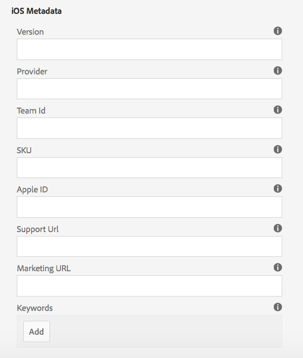
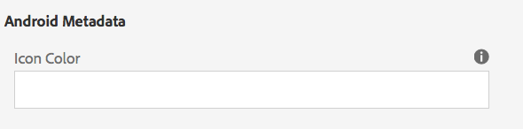

# App-Kachel verwalten{#manage-app-tile}

>[!NOTE]
>
>Adobe empfiehlt die Verwendung des SPA-Editors für Projekte, die ein Framework-basiertes clientseitiges Rendering von Einzelseiten-Apps erfordern (z. B. React). [Weitere Informationen](/help/sites-developing/spa-overview.md)

Die **App verwalten** Die Kachel im App-Dashboard bietet die Möglichkeit, Details zur Anwendung zu ändern. Um die Detailseite zu öffnen, klicken Sie auf den Link Details der Kachel App verwalten . Auf der Seite &quot;App verwalten&quot;können Sie die Einstellungen der PhoneGap-Anwendungskonfiguration (config.xml) bearbeiten und Ihre Anwendung für die Übermittlung an die verschiedenen Anwendungsspeicher vorbereiten.


## Grundlegendes zur Kachel &quot;App verwalten&quot; {#understanding-the-manage-app-tile}

Sie können einen Drilldown für jede Kachel im **App verwalten** Kachel zum Anzeigen oder Bearbeiten von Details durch Klicken auf das Symbol &quot;...&quot; unten rechts.

### Registerkarte &quot;Standard&quot; {#the-basic-tab}

Sie können die **Name**, **Autor**, **Kurzbeschreibung** und die **Beschreibung** für Ihre App von dieser Registerkarte aus.


### Der Tab Erweitert {#the-advanced-tab}

Jede Mobile App-Plattform beschreibt, welche Daten erfasst werden, wobei jeder App Store speziell ausgewählt wird.

Die angezeigten Plattformen werden durch den Inhalt der Datei &quot;PhoneGap config.xml&quot;gesteuert:

```xml
<widget>
<gap:platform name="ios"/>
<gap:platform name="android"/>
</widget>
```

Jeder Appstore von Anbietern - z. B. Apple App Store oder Google Play Store - benötigt mindestens einen Screenshot Ihrer Mobile App, um Ihre Anwendungsdetails für Kunden anzuzeigen. Diese Screenshots können strenge Anforderungen an Dimensionen und Inhalte haben (sie müssen im Grunde die Anwendung wirklich repräsentieren). AEM Apps bietet Unterstützung für die Auswahl und Verwaltung dieser Screenshots für die unterstützten Plattformen und das Anzeigen von Port-Dimensionen, wie es für den Anwendungsspeicher jedes Anbieters erforderlich ist.

>[!NOTE]
>
>Die AEM Verify-App bietet die Möglichkeit, Screenshots in AEM direkt an Ihre App-Details zu senden.
>
>Siehe [Mobil-Schnellstart für AEM Verifizierung](/help/mobile/phonegap-mobile-quickstart.md) für weitere Details.


### Metadaten {#metadata}

>[!NOTE]
>
>Sobald Sie mit dem **App verwalten** Kachel, siehe [Bearbeiten von App-Metadaten](/help/mobile/phonegap-editmetadata.md) um die Metadaten anzuzeigen und zu bearbeiten.

#### Allgemeine Metadaten {#common-metadata}

Jede Anwendung sollte über zugeordnete Metadaten verfügen, die bei der Konfiguration verschiedener Aspekte der Anwendung helfen. Die Seite &quot;App verwalten&quot;ist in zwei verschiedene Bereiche unterteilt, die mit der Metadatenerfassung zusammenhängen. Plattformspezifische Metadaten und allgemeine Metadaten.

Es gibt eine allgemeine Konfiguration und Metadaten für alle Plattformen.

In diesem Abschnitt definieren Sie die URL des Inhaltsaktualisierungs-Servers, die Landingpage für Ihre Mobile App, die PhoneGap-Version für die Kompilierung, Ihre Anwendungsversion, Ihren Namen, Ihre Beschreibung und mehr.

**App-Version** ist die funktionierende Version Ihrer Anwendung. Übliche Best Practice ist die Verwendung einer 3-Dezimalnotation-Notation und der Beginn unter 1.0.0 vor Ihrer ersten Version.

**PhoneGap-Version** ist die Version, in der Sie Ihre Anwendung mit PhoneGap kompilieren möchten. Es empfiehlt sich, mit der aktuellen Version Schritt zu halten, um sicherzustellen, dass Sie die neuesten und besten Funktionen und Fehlerbehebungen erhalten.

**URL des Inhaltsaktualisierungs-Servers** ist die URL, die Ihre Anwendung zum Aufrufen von ContentSync-Updates verwendet. Sie muss auf Ihre Dispatcher-URL oder, falls Sie keinen Dispatcher verwenden, auf eine Ihrer Veröffentlichungsinstanzen festgelegt sein, die zur Bereitstellung von ContentSync-Aktualisierungen für Ihre Anwendung verwendet wird.


>[!NOTE]
>
>Dieser Abschnitt kann leer erscheinen, es sei denn, es liegen Daten zum Ausfüllen der Felder vor.
>
>Oben in der Detailansicht werden die Anwendungsversion, die PhoneGap-Version und die Update-URL angezeigt. Jeder dieser Werte kann im Abschnitt &quot;Allgemeine Metadaten&quot;festgelegt werden. Die Anwendungs-ID kann jedoch nicht bearbeitet werden.

#### Plattformmetadaten {#platform-metadata}

Jede Plattform, die in der Datei &quot;PhoneGap config.xml&quot;definiert ist, kann benutzerdefinierte Plattformeigenschaften enthalten. Ein AEM Entwickler muss die Inhaltsstruktur zur Erfassung dieser Eigenschaften beitragen. Ein Beispiel für plattformspezifische Eigenschaften finden Sie für iOS.

Metadaten für alle konfigurierten Plattformen werden jetzt auf der Registerkarte Erweitert der Kachel App verwalten gleichzeitig angezeigt.

>[!NOTE]
>
>Die Abschnitte für Plattformmetadaten werden von PhoneGap nicht während eines CLI- oder Remote PhoneGap-Builds verwendet, sondern AEM versucht, Metadaten für Plattformen zu erfassen, damit sie später beim Senden an den Anwendungsspeicher des jeweiligen Anbieters verwendet werden können.

Bei Plattformen, die von AEM nicht verstanden werden, ist es für einen AEM-Entwickler weiterhin möglich, die Benutzeroberfläche zu erweitern, um diese Metadaten zu erfassen, die später exportiert und während des Antragsübermittlungsprozesses verwendet werden können.

#### iOS-Metadaten {#ios-metadata}

Für den Apple AppStore sind zusätzliche Metadaten erforderlich, um Ihre App zur Verteilung übermitteln zu können. Der Abschnitt &quot;iOS-Metadaten&quot;versucht, die erforderlichen Informationen zu erfassen, die vom iTMSTransporter-Tool von Apple zum Veröffentlichen der Metadaten in dem zugehörigen Apple-Entwicklerkonto verwendet werden können.

Um die Apple-spezifischen Metadaten abzurufen, müssen Sie zunächst Ihre Anwendung in [https://itunesconnect.apple.com](https://itunesconnect.apple.com/). Beim Erstellen Ihrer Anwendung generiert Apple Metadaten, die für den iOS-Metadatenabschnitt erforderlich sind, wenn Sie das Apple iTMSTransporter-Tool zum Überprüfen und Hochladen der Metadaten auf itunesconnect.apple.com verwenden möchten. Wenn Sie nur die zu erfassenden Metadaten abrufen möchten, müssen Sie nicht unbedingt die iOS-spezifischen Metadaten ausfüllen. Sie können weiterhin die Metadaten exportieren, die die iOS und die gängigen Metadaten zusammenführen, und alle Screenshots in eine ZIP-Datei erfassen, die jederzeit heruntergeladen werden kann.

Die heruntergeladene ZIP-Datei enthält eine itmsp-Datei, die auf die Datei &quot;metadata.xml&quot;überprüft werden kann. Die itmsp-Datei enthält die exportierten Metadaten (innerhalb der Datei &quot;metadata.xml&quot;) sowie alle zugehörigen Screenshots.

Die Exportfunktion bietet eine praktische Möglichkeit, die Screenshots und Metadaten zu erfassen, die zur Eingabe in den herstellerspezifischen App Store an den Anwendungs-Publisher übergeben werden können.



#### Android™-Metadaten {#android-metadata}

Bei der Auswahl der Android™-Plattform können derzeit keine benutzerdefinierten Metadaten festgelegt werden. Beim Klicken auf die Download-Schaltfläche wird eine ZIP-Datei mit einer Eigenschaftendatei generiert, die alle Metadaten und zugehörigen Screenshots enthält.

Die Exportfunktion bietet eine praktische Möglichkeit, die Screenshots und Metadaten zu erfassen, die zur Eingabe in den herstellerspezifischen App Store an den Anwendungs-Publisher übergeben werden können.



### Server-URL für Inhaltsaktualisierung {#content-update-server-url}

Eine der wichtigsten Funktionen von AEM Apps ist die Möglichkeit, mit ContentSync neue Inhalte von einer Mobile App anzufordern, bei denen es sich bei Inhalten um HTML-Ressourcen, Seiten, Video, Bilder, Text usw. handeln kann. Sobald ein Inhaltsautor Inhalte aktualisiert und dann veröffentlicht hat, stellt der Server die Inhaltsaktualisierung für die Mobile App zum Herunterladen bereit.

Die Eigenschaft &quot;Content Update Server URL&quot;ist die URL, die auf eine Veröffentlichungsinstanz verweisen muss. entweder direkt oder über den Dispatcher oder das CDN. Das Format der URL lautet einfach:

`https://[hostname]:[port]`

>[!NOTE]
>
>Wenn Ihre Autorenserverinstanz auf mehrere Veröffentlichungs-Server-Instanzen repliziert wird (gängige Architektur für AEM), hat jeder Veröffentlichungsserver denselben Aktualisierungsinhalt, da die Aktualisierung auf der Autoreninstanz basiert und auf allen Veröffentlichungsinstanzen repliziert wird. Grundsätzlich werden Lastenausgleich und Failover vollständig unterstützt.

### Registerkarte &quot;Plug-ins&quot; {#the-plugins-tab}

Die **Plugins** -Tab beschreibt die mit Ihrer App verknüpften Plug-ins. Diese Informationen werden verwendet, um das entsprechende Plug-in während eines Builds abzurufen.


### Registerkarte &quot;Screenshots&quot; {#the-screenshots-tab}

Die **Screenshots** -Tab zeigt die unterstützten Screenshot-Auflösungen auf verschiedenen Plattformen an.


>[!NOTE]
>
>Informationen zum Hinzufügen und Entfernen von Screenshots finden Sie unter [Bearbeiten von App-Metadaten](/help/mobile/phonegap-editmetadata.md).

### Registerkarte &quot;Authentifizierung&quot; {#the-authentication-tab}

Die **Authentifizierung** -Registerkarte können Sie einen OAuth-Client auswählen, der mit Ihrer Anwendung verknüpft werden soll, und einem Entwickler die Verwendung der OAuth-Authentifizierung von Adobe Experience Manager ermöglichen.


### Die nächsten Schritte {#the-next-steps}

Nachdem Sie sich mit der Verwaltung der App-Kachel im Anwendungs-Dashboard vertraut gemacht haben, lesen Sie die folgenden Ressourcen für andere Authoring-Rollen:

* [Bearbeiten von App-Metadaten](/help/mobile/phonegap-editmetadata.md)
* [App-Definitionen](/help/mobile/phonegap-app-definitions.md)
* [Erstellen einer neuen App mit dem Assistenten zum Erstellen einer App](/help/mobile/phonegap-create-new-app.md)
* [Vorhandene Hybrid-App importieren](/help/mobile/phonegap-adding-content-to-imported-app.md)
* [Content Services](/help/mobile/develop-content-as-a-service.md)

### Zusätzliche Ressourcen {#additional-resources}

Informationen zu den Rollen und Zuständigkeiten von Administratoren und Entwicklern finden Sie in den folgenden Ressourcen:

* [Entwickeln für Adobe PhoneGap Enterprise mit AEM](/help/mobile/developing-in-phonegap.md)
* [Verwalten von Inhalten für Adobe PhoneGap Enterprise mit AEM](/help/mobile/administer-phonegap.md)
