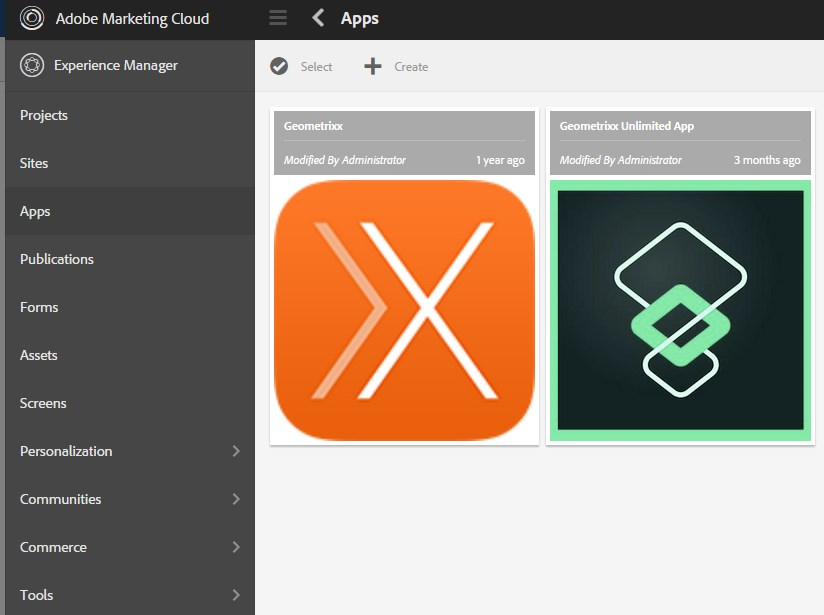
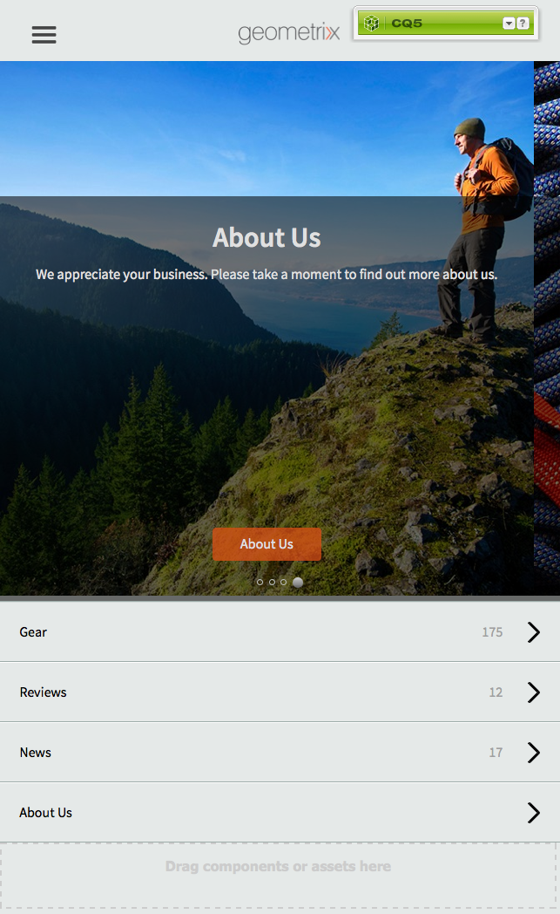
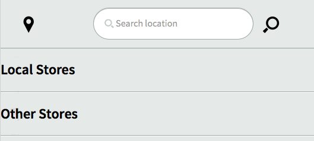

# Erstellen und Bearbeiten von Apps mithilfe der Apps-Konsole{#creating-and-editing-apps-using-the-apps-console}

>[!NOTE]
>
>Adobe empfiehlt die Verwendung des SPA-Editors für Projekte, für die ein frameworkbasiertes clientseitiges Rendering für einzelne Seiten (z. B. React) erforderlich ist. [Weitere Informationen](/help/sites-developing/spa-overview.md)

Der Entwicklungsprozess AEM Mobile Apps erkennt, dass Benutzer mit unterschiedlichem Know-how zur Entwicklung von Mobile Apps beitragen. Die folgende Prozesszuordnung zeigt die allgemeine Reihenfolge, in der Inhaltsautoren und Anwendungsentwickler Aufgaben ausführen.

Informationen zur Durchführung der Marketingspezialaufgaben werden auf dieser Seite angezeigt. Weitere Informationen zu den Aufgaben für Entwickler finden Sie unter Erstellen von PhoneGap-Anwendungen.

## Die Struktur von mobilen Anwendungen {#the-structure-of-mobile-applications}

AEM Mobile bietet den Phonegap App-Blueprint zum Erstellen von Apps. Der Blueprint definiert die Struktur der von Ihnen erstellten Anwendungen. Anwendungen bestehen aus den folgenden Elementen:

* Die Stammseite.
* Die Sprachvarianten der Anwendung.
* Die Startseite der Sprachvariante.

### Der Stamm einer Phonegap-App {#the-root-of-a-phonegap-app}

Die Stammseite der Mobile Apps, die Sie in AEM erstellen, wird in der Apps-Konsole angezeigt.

Die Stammseite wird unter der Eigenschaft &quot;Destination Path&quot;der Anwendung gespeichert, die beim Erstellen der Anwendung angegeben wurde (der Standardpfad lautet /content/phonegap/apps). Der Seitenname ist die Eigenschaft &quot;Name&quot;der Anwendung. Beispielsweise lautet die Standard-URL der Stammseite der Site `myphonegapapp` `http://localhost:4502/content/phonegap/apps/myphonegapapp.html`.

### Die Sprachvariante einer PhoneGap-App {#the-language-variation-of-a-phonegap-app}

Die ersten untergeordneten Seiten der Stammseite sind die Sprachvarianten der Anwendung. Der Name jeder Seite ist die Sprache, für die die Anwendung erstellt wird. Beispielsweise ist Englisch der Name der englischen Variante der Anwendung.

**Hinweis:** Der standardmäßige PhoneGap-Blueprint erstellt nur eine englische Anwendung. Ihr Entwickler kann den Blueprint so ändern, dass er weitere Sprachvarianten erstellen kann.

Die Sprachseite dient zwei Zwecken:

* Der Seiteninhalt ist die Spash-Seite für die Sprachvariante der Anwendung.
* Die Seiteneigenschaften steuern verschiedene Design-Aspekte der Anwendung, z. B. die URL, die zum Anfordern von Inhaltsaktualisierungen verwendet werden soll, und Informationen zum Herstellen einer Verbindung zum Cloud-Build und zur Adobe Analytics Services-Integration.

### Die Homepage {#the-home-page}

Die Startseite oder index.html-Seite einer Sprachvariante einer Anwendung wird angezeigt, wenn die Anwendung geöffnet wird. Die Startseite bietet Benutzern ein Menü mit Links zu verschiedenen Seiten in der Anwendung. Mit dem Absatzsystem können Sie Komponenten zur Seite hinzufügen, um Inhalte zu erstellen.

## Erstellen einer Mobile App {#creating-a-mobile-application}

Mobile Apps basieren auf einem Blueprint, der eine Seitenstruktur und Eigenschaften definiert. Sie können die folgenden Anwendungseigenschaften konfigurieren:

* **Titel:** Der Titel der Anwendung.
* **Zielpfad:** Der Speicherort im Repository, in dem die Anwendung gespeichert ist. Behalten Sie die Standardeinstellung bei, um einen Pfad basierend auf dem App-Namen zu erstellen.

* **Name:** Der Standardwert ist der Wert der Eigenschaft &quot;Title&quot;, wobei Leerzeichen entfernt werden. Der Name wird in CQ verwendet, um auf die Anwendung zu verweisen, z. B. für den Repository-Knoten, der die Anwendung darstellt.
* **Beschreibung:** Eine Beschreibung der Anwendung.
* **Server-URL:** Die URL, die Over-the-Air (OTA)-Inhaltsaktualisierungen für die Anwendung bereitstellt. Der Standardwert ist die Veröffentlichungs-Server-URL der Instanz, die zum Erstellen einer Anwendung verwendet wird (vom Externalizer-Dienst abgerufen). Beachten Sie, dass es sich hierbei nicht um einen Autor, sondern um eine Veröffentlichungs-Server-Instanz handeln muss, für die eine Authentifizierung erforderlich ist.

Sie können auch eine Bilddatei bereitstellen, die als Anwendungsminiaturansicht verwendet werden soll, die zu verwendende PhoneGap Build auswählen und die zu verwendende Mobile App-Analysekonfiguration auswählen. Dieses Bild wird nur als Miniaturansicht für Ihre Mobile App in der Mobile Apps-Konsole in Experience Manager verwendet.

Es gibt zusätzliche (und optionale) Registerkarten für den Build-Cloud-Service und die Integration des Adobe Mobile Services SDK-Plug-ins in Ihre App.

* Build: Klicken Sie hier auf Konfigurationen verwalten und richten Sie Ihren Build-Dienst build.phonegap.com ein. Wählen Sie dann aus der Dropdown-Liste den neu erstellten PhoneGap Build-Cloud-Service aus.
* Analytics: Klicken Sie auf Konfigurationen verwalten und richten Sie den Cloud-Dienst [Adobe Mobile Services SDK](https://docs.adobe.com/content/help/en/mobile-services/using/home.html) ein. Wählen Sie dann aus der Dropdown-Liste den neu erstellten Mobile Service aus, der in Ihre Mobile App integriert werden soll.

>[!NOTE]
>
>Entwickler können das AEM PhoneGap Starter Kit verwenden, um Apps zu erstellen und sie der Konsole hinzuzufügen.

Im folgenden Verfahren wird die Touch-Benutzeroberfläche zum Erstellen einer Mobile App verwendet.

1. Klicken Sie in der Leiste auf Apps .
1. Klicken oder tippen Sie auf das Symbol Erstellen .

   

1. (Optional) Geben Sie auf der Registerkarte Erweitert eine Beschreibung für die Anwendung ein und ändern Sie bei Bedarf die Server-URL.
1. (Optional) Wenn Sie PhoneGap Build zum Kompilieren der Anwendung verwenden, wählen Sie auf der Registerkarte &quot;Build&quot;die zu verwendende Konfiguration aus.

   Um eine PhoneGap-Build-Konfiguration zu erstellen, klicken Sie auf &quot;Konfigurationen verwalten&quot;.

1. (Optional) Wenn Sie SiteCatalyst zur Verfolgung der Anwendungsaktivität verwenden, wählen Sie auf der Registerkarte Analytics die zu verwendende Konfiguration aus.

   Klicken Sie zum Erstellen einer Mobile App-Konfiguration auf Konfigurationen verwalten .

1. (Optional) Um ein Anwendungssymbol bereitzustellen, klicken Sie auf die Schaltfläche &quot;Durchsuchen&quot;, wählen Sie die Bilddatei aus Ihrem Dateisystem aus und klicken Sie auf &quot;Öffnen&quot;.
1. Klicken Sie auf Erstellen.

### Ändern der Eigenschaften einer Mobile App {#changing-the-properties-of-a-mobile-application}

Nachdem Sie eine Mobile App erstellt haben, können Sie die Eigenschaften ändern.

#### Ändern Sie den Titel, die Beschreibung und das Symbol {#change-the-title-description-and-icon}

1. Klicken oder tippen Sie in der Leiste auf Apps .
1. Wählen Sie die zu konfigurierende Anwendung aus und klicken Sie auf das Symbol Seiteneigenschaften anzeigen .

   

1. Um Eigenschaftswerte zu ändern, klicken oder tippen Sie auf das Symbol Bearbeiten .

   

1. Konfigurieren Sie die Eigenschaften Allgemein und Erweitert und klicken oder tippen Sie auf das Symbol Fertig .

   

#### Konfigurieren einer Sprachvariante der Anwendung {#configure-a-language-variation-of-the-application}

1. Klicken oder tippen Sie in der Leiste auf Apps .
1. Klicken Sie auf diese Schaltfläche, um einen Drilldown in die Mobile App durchzuführen, die Sie in der Admin Console von Apps bearbeiten möchten. Wählen Sie die Sprachversion der zu konfigurierenden Anwendung aus und klicken Sie auf das Symbol Anwendungseigenschaften anzeigen .

   

1. Um Eigenschaftswerte zu ändern, klicken oder tippen Sie auf das Symbol Bearbeiten .

   

1. Konfigurieren Sie die Eigenschaften auf den Registerkarten Allgemein, Erweitert, Erstellen und Analytics und klicken oder tippen Sie dann auf das Symbol Fertig .

   

### Verfassen des Inhalts einer Mobile App {#authoring-the-content-of-a-mobile-application}

Nachdem Sie die Mobile App erstellt haben, fügen Sie Inhalte hinzu, die als Benutzeroberfläche der Anwendung verwendet werden.

1. Klicken oder tippen Sie in der Leiste auf Apps .
1. Klicken oder tippen Sie auf die Anwendung und dann auf Englisch.
1. Bearbeiten Sie die Startseite oder fügen Sie ggf. untergeordnete Seiten hinzu.

### Verschieben von Inhalten in mobile Anwendungen {#moving-content-to-mobile-applications}

Der Cache für die Inhaltssynchronisierung auf der AEM Veröffentlichungsinstanz wird als Repository für Inhalte für mobile Anwendungen verwendet:

* Inhalte im Cache für die Inhaltssynchronisierung sind in der Anwendung enthalten, wenn Entwickler die Anwendung kompilieren.
* Inhalte im Cache sind für installierte mobile Anwendungen verfügbar, um den Anwendungsinhalt zu aktualisieren.

Mobile Apps enthalten einen Aktualisierungsbefehl, mit dem aktualisierte Anwendungsinhalte heruntergeladen und installiert werden. Wenn eine Anwendungsinstanz eine Aktualisierungsanforderung sendet, bestimmt die Inhaltssynchronisierung, welcher Inhalt seit der letzten Aktualisierung oder Installation der Anwendung geändert wurde, und stellt den neuen Inhalt bereit.

Um aktualisierte Inhalte für Anwendungen verfügbar zu machen, aktualisieren Sie den Cache für die Inhaltssynchronisierung. Wenn Sie den Cache zum ersten Mal aktualisieren, werden alle veröffentlichten Inhalte hinzugefügt. Nachfolgende Aktualisierungen fügen nur die veröffentlichten Inhalte hinzu, die sich seit der vorherigen Aktualisierung geändert haben.

Die Inhaltssynchronisierung verfolgt auch, wann die Aktualisierungen stattfinden. Anhand dieser Informationen kann die Inhaltssynchronisierung bestimmen, welches Cache-Update an eine Mobile App gesendet werden soll.

Führen Sie das folgende Verfahren für die Instanz durch, in der Sie den Cache aktualisieren möchten. Wenn Ihre Anwendung beispielsweise Aktualisierungen von der Veröffentlichungsinstanz anfordert, führen Sie das Verfahren auf der Veröffentlichungsinstanz durch.

1. Klicken oder tippen Sie in der Leiste auf Apps und dann auf Ihre Anwendung.
1. Wählen Sie die Begrüßungsseite aus und klicken oder tippen Sie auf das Symbol Cache aktualisieren .

   

### Verwenden von App-Vorlagen {#using-app-templates}

Diese Funktion ist in Apps 6.1 Feature Pack 2 verfügbar und bietet eine einfache Möglichkeit, vorhandene App-Vorlagen für die Erstellung neuer Apps in AEM zu nutzen.

Was ist eine App-Vorlage? Stellen Sie sich dies als Sammlung von Seitenvorlagen und Komponenten vor, die eine Grundlinie oder Grundlage einer App darstellen.
Wenn Sie eine neue App basierend auf der Vorlage einer anderen App erstellen, erhalten Sie eine App mit einem Startpunkt, der für die App steht, aus der sie erstellt wurde.

Sie müssen über eine vorhandene Vorlage für mobile Apps (oder eine installierte App, die über eine App-Vorlage verfügt) verfügen, um diese Funktion nutzen zu können.

Das neueste Beispielpaket für AEM Apps 6.1 enthält eine aktualisierte Version der Geometrixx App mit einer App-Vorlage. Alternativ können Sie das StarterKit installieren, das auch eine Vorlage bereitstellt.

Schritte zum Erstellen einer neuen App basierend auf einer App-Vorlage:

1. Vergewissern Sie sich, dass das neueste Feature Pack für AEM Apps 6.1 und Referenzbeispiele installiert sind.
1. Klicken Sie in der linken Leiste auf Apps .

1. Klicken Sie oben auf die Schaltfläche + Erstellen und wählen Sie App erstellen aus.
1. Nachdem Sie die Liste der App-Vorlagen erhalten haben, wählen Sie eine aus:

1. Klicken Sie auf Weiter.
1. Geben Sie eine App-ID und einen Titel an. Sie können jedoch auch einen Namen und eine Beschreibung einfügen.

   1. Darüber hinaus können Sie ein PNG-Symbol (unterstütztes PhoneGap-Symbolformat) als Symbol bereitstellen, indem Sie AEM Assets durchsuchen.
   1. Denken Sie daran, dass Sie alle diese Felder bearbeiten können, nachdem die App in der Kachel App verwalten erstellt wurde. Mit Ausnahme der App-ID können Sie nach dem Festlegen der App-ID diese nicht mehr ändern.

1. Klicken Sie auf die Schaltfläche &quot;Erstellen&quot;. Ihnen werden zwei Optionen angezeigt: &quot;Fertig&quot;(kehren Sie zur Apps-Katalogansicht zurück) oder &quot;App verwalten&quot;(öffnet das App-Dashboard).
1. Nach der Erstellung sollte die neue App im App-Katalog aufgeführt sein:

1. Klicken Sie auf die App, um sie zu öffnen. Sie haben erfolgreich eine neue App basierend auf der Vorlage einer vorhandenen App erstellt.

>[!NOTE]
>
>Wenn Sie das Geometrixx Outdoors-Referenz-App-Paket aus AEM deinstallieren und eine App basierend auf ihrer Vorlage erstellt haben, ist diese App nicht mehr funktionsfähig. Die Geometrixx Outdoors App kann entfernt werden. Die App-Vorlage muss jedoch erhalten bleiben, wenn sie von anderen Mobile Apps verwendet wird.

## Kennenlernen der Geometrixx Outdoors-Beispielanwendung {#exploring-the-sample-geometrixx-outdoors-app}

Geometrixx Outdoors App ist eine Beispielanwendung für PhoneGap, die die Funktionen des standardmäßigen PhoneGap-Anwendungsblueprints und der Beispielkomponenten für Mobilgeräte demonstriert.

Um die Anwendung zu öffnen, klicken Sie in der Leiste auf Mobile Apps und wählen Sie dann Geometrixx Outdoors App aus.

### Allgemeine Seitenfunktionen - Geometrixx Mobile App {#common-page-features-geometrixx-mobile-app}

Jede Seite der mobilen App enthält die folgenden Funktionen:

* Eine Zurück-Schaltfläche zum Zurückkehren zur übergeordneten Seite. Beachten Sie, dass die Schaltfläche &quot;Zurück&quot;nicht auf der Startseite angezeigt wird.
* Eine erweiterte Leiste mit einer Liste von Befehlen und Links:

   * Öffnen Sie die Seite Standorte .
   * Öffnen Sie den Warenkorb.
   * Melden Sie sich an.
   * Aktualisieren Sie die Anwendung.

* Das Absatzsystem zum Hinzufügen von Komponenten und Erstellen von Inhalten.

### Startseite - Geometrixx Mobile App {#the-home-page-geometrixx-mobile-app}

Der Inhalt der Startseite besteht aus den folgenden Navigationstools:

* Eine Menülisten-Komponente, die Links zu den untergeordneten Seiten &quot;Gear&quot;, &quot;Reviews&quot;, &quot;News&quot;und &quot;Über uns&quot;bereitstellt.
* Eine Swipe Carousel-Komponente, die die untergeordneten Seiten präsentiert.

### Zahnradseite - Geometrixx Mobile App {#the-gear-page-geometrixx-mobile-app}

Die Zahnradseite bietet Benutzern Zugriff auf Produktseiten. Eine Menülisten-Komponente bietet Zugriff auf die untergeordneten Seiten der Zahnradseite. Die untergeordneten Seiten sind Produktkategorien, die die Website enthält.

* Staffel
* Bekleidung
* Geschlecht
* Aktivität

Jede Kategorieseite verwendet dieselbe Inhaltsstruktur wie die Zahnradseite. Das Karussell bietet Zugriff auf untergeordnete Seiten, die Unterkategorien von Produkten sind. Die Unterkategorieseiten enthalten Produktlisten, die Links zu Produktseiten enthalten.

### Produktseite - Geometrixx Mobile App {#the-products-page-geometrixx-mobile-app}

Die Produktseite und ihre Hierarchie untergeordneter Seiten implementieren ein Classification-System für Produktseiten. Die niedrigsten Seiten in jedem Zweig der Hierarchie sind Produktseiten, die eine ng-Produktkomponente enthalten.

Die Seite Produkte steht Anwendungsbenutzern nicht zur Verfügung. Die Zahnradseite bietet Zugriff auf die einzelnen Produktseiten.

### Seite &quot;Bewertungen&quot;- Geometrixx Mobile App {#the-reviews-page-geometrixx-mobile-app}

Enthält eine Schaltfläche &quot;Zurück&quot;. Mit dem Absatzsystem können Sie Komponenten hinzufügen.

Bei Verwendung der Anwendung ist die Seite &quot;Bewertungen&quot;im Karussell auf der englischen Seite verfügbar.

### News-Seite - Geometrixx Mobile App {#the-news-page-geometrixx-mobile-app}

Enthält eine Schaltfläche &quot;Zurück&quot;. Mit dem Absatzsystem können Sie Komponenten hinzufügen.

Bei Verwendung der Anwendung ist die Seite Nachrichten im Karussell auf der englischen Seite verfügbar.

### Die Seite &quot;Über uns&quot;- Geometrixx Mobile App {#the-about-us-page-geometrixx-mobile-app}

Die Seite Über uns enthält mehrere Komponenten für zwei Spaltenzeilen. Jede Spalte enthält entweder eine Bild- oder eine Text-Komponente. Die Komponenten sind bearbeitbar und das Absatzsystem ermöglicht das Hinzufügen von Komponenten.

Bei Verwendung der Anwendung ist die Seite Über uns im Karussell auf der englischen Seite verfügbar.

### Die Standortseite - Geometrixx Mobile App {#the-locations-page-geometrixx-mobile-app}

Die Seite Standorte enthält eine Komponente Standorte .

Bei Verwendung der Anwendung ist die Seite Standorte in der Menüliste auf der englischen Seite verfügbar.

## Beispiel für mobile Komponenten {#sample-mobile-components}

Beim Verfassen der Seiten einer Mobile App sind im Sidekick sofort mehrere Komponenten verfügbar. Die Komponenten gehören zur PhoneGap-Komponentengruppe.

### Swipe-Karussell {#swipe-carousel}

Die Komponente Karussell löschen ist ein Tool zum Anzeigen und Navigieren von Seiten der Site. Die Komponente enthält ein Karussell, bei dem die Bilder für die Seiten über einer Liste von Seitenlinks durchlaufen werden. Bearbeiten Sie die Komponente, um die anzuzeigenden Seiten und das Verhalten des Karussells anzugeben.

Beachten Sie, dass Bilder im Karussell für Seiten angezeigt werden, die mit einem Bild auf bestimmte Weise verknüpft sind. Wenn Seiten nicht mit Bildern verknüpft sind, wird nur die Liste der Links angezeigt.

**Registerkarte &quot;Karusselleigenschaften&quot;**

Verhalten des Karussells konfigurieren:

* Abspielgeschwindigkeit: Die Zeit in Millisekunden, zu der jedes Bild angezeigt wird, bevor das nächste Bild angezeigt wird.
* Übergangszeit: Die Dauer der Animation für Bildübergänge in Millisekunden.
* Steuerelementstil: Die Art der Steuerelemente, die für das Verschieben zwischen Bildern bereitgestellt werden.

**Registerkarte &quot;Listeneigenschaften&quot;**

Geben Sie an, wie die Seitenliste generiert wird:

* Erstellen einer Liste mithilfe von: Die Methode zum Angeben der Seiten, die in das Karussell aufgenommen werden sollen. Siehe Erstellen der Seitenliste .
* Sortieren nach: Wählen Sie eine Seiteneigenschaft aus, die zum Sortieren der Seitenliste verwendet werden soll. Wählen Sie beispielsweise jcr:title aus, um Seiten alphabetisch nach Titel zu sortieren.
* Limit: Die maximale Anzahl der einzuschließenden Seiten. Diese Eigenschaft eignet sich für suchbasierte Methoden zum Erstellen der Seitenliste.

#### Erstellen der Seitenliste {#building-the-page-list}

Die Komponente &quot;Karussell löschen&quot;stellt die folgenden Werte für die Eigenschaft &quot;Build List Using&quot;bereit. Das Dialogfeld &quot;Bearbeiten&quot;ändert sich entsprechend dem ausgewählten Wert:

**Untergeordnete Seiten**

Die Komponente listet alle untergeordneten Seiten einer bestimmten Seite auf. Nachdem Sie diesen Wert ausgewählt haben, wählen Sie die Seite auf der Registerkarte Untergeordnete Seiten aus oder geben Sie keinen Wert an, um die untergeordneten Elemente der aktuellen Seite aufzulisten.

**Liste fester Werte**

Geben Sie eine Liste der Seiten an, die einbezogen werden sollen. Nachdem Sie diesen Wert ausgewählt haben, konfigurieren Sie die Liste auf der Registerkarte &quot;Liste fester Werte&quot;, die angezeigt wird, wenn Sie &quot;Liste fester Werte&quot;auswählen:

* Um eine Seite hinzuzufügen, klicken Sie auf Element hinzufügen und suchen Sie dann nach der Seite.
* Verwenden Sie die Nach-oben- und Nach-unten-Pfeilsymbole, um die Seite in die Liste zu verschieben.
* Klicken Sie auf die Schaltfläche &quot;Entfernen&quot;, um eine Seite aus der Liste zu entfernen.

Die Eigenschaft &quot;Order By&quot;hat keine Auswirkungen auf die Reihenfolge der festen Listen.

**Suchen**

Füllen Sie die Liste mithilfe der Suchergebnisse aus. Die Suche wird in den untergeordneten Elementen einer Seite durchgeführt, die Sie angeben:

1. Um die Stammseite der Suche anzugeben, verwenden Sie die Eigenschaft Start in , um den Seitenpfad auszuwählen. Geben Sie keinen Pfad für die Suche unterhalb der aktuellen Seite an.
1. Geben Sie in der Eigenschaft &quot;Search Query&quot;die Suchbegriffe ein.

**Erweiterte Suche**

Füllen Sie die Liste mit einer [QueryBuilder](/help/sites-developing/querybuilder-api.md)-Abfrage.

### Bild {#image}

Fügen Sie Ihrem Anwendungsinhalt ein Bild hinzu.

### Text {#text}

Fügen Sie Rich-Text zu Ihrem Anwendungsinhalt hinzu.

### Filialen {#store-locations}

Die Komponente &quot;Speicherorte&quot;bietet Benutzern Tools zum Suchen von Geschäftspartnern:

* Suchen
* Listen von Standorten, die in der Nähe oder in Entfernung zu den GPS-Koordinaten des Geräts liegen.

Die Komponente erfordert, dass das Repository Standortinformationen für jeden Store enthält. Beispielspeicherorte werden im Knoten /etc/commerce/locations/adobe installiert. 

### Zeile mit zwei Spalten {#two-column-row}

Ermöglicht das Hinzufügen von nebeneinander liegenden Komponenten zu einer Seite.

