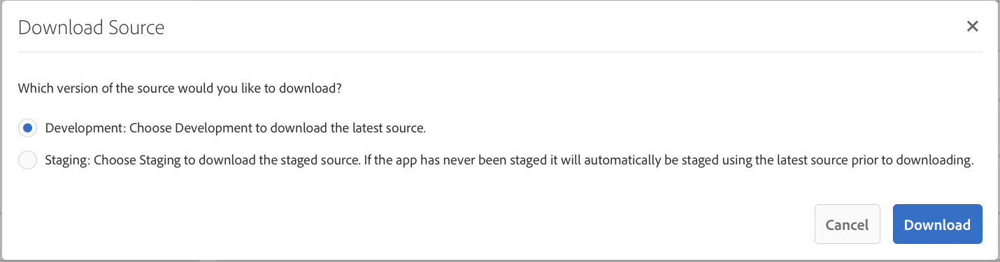

# Entwickeln von Apps mit PhoneGap CLI{#developing-apps-with-phonegap-cli}

{{ue-over-mobile}}

Als Entwickler können Sie Ihre App jederzeit auf einem Gerät oder in einem Emulator ausführen, vorausgesetzt, Sie haben Ihre Entwicklungsumgebung konfiguriert.

Zum Ausführen der folgenden Beispiele benötigen Sie ein System, auf dem macOS X mit Xcode ausgeführt wird, oder ein Mac/Win/Linux-System mit installiertem Android™ SDK.

## Bootstrap der Entwicklungsumgebung {#bootstrap-your-development-environment}

PhoneGap CLI einrichten (`https://docs.phonegap.com/en/4.0.0/guide_cli_index.md.html#The%20Command-Line%20Interface`)

Für iOS: Für die Entwicklung für iPhones und iPads benötigen Sie die Xcode-IDE von Apple.

* Laden Sie es kostenlos herunter [hier](https://idmsa.apple.com/IDMSWebAuth/signin?appIdKey=891bd3417a7776362562d2197f89480a8547b108fd934911bcbea0110d07f757&path=%2Fdownload%2F&rv=1).
* PhoneGap iOS-Plattformhandbuch (`https://docs.phonegap.com/en/4.0.0/guide_platforms_ios_index.md.html#iOS%20Platform%20Guide`)

Für Android™: Um für iPhones und iPads zu entwickeln, benötigen Sie die Android™ Studio-IDE von Google.

* Laden Sie es kostenlos herunter [hier](https://developer.android.com/studio).
* PhoneGap Android™-Plattformhandbuch (`https://docs.phonegap.com/en/4.0.0/guide_platforms_android_index.md.html#Android%20Platform%20Guide`)

## Source herunterladen {#download-the-source}

Wenn Sie das Bootstrapping für Ihre Entwicklungsumgebung erfolgreich durchgeführt haben, laden Sie die -Quelle aus der AEM-App-Build-Kachel herunter:

* Klicken Sie auf den Dropdown-Pfeil der PhoneGap Build-Kachel.


* Klicken Sie auf Source herunterladen.
* Wählen Sie die gewünschte Quelle aus dem Modal Source herunterladen aus.



>[!NOTE]
>
>Die Entwicklungsquelle enthält den neuesten Status Ihrer App sowie nicht bereitgestellte Änderungen. Verwenden Sie die Staging-Quelle, um Veröffentlichungskandidaten für die Übermittlung an App Store-Anbieter zu erstellen.
>
>Wenn Sie Ihre App nie bereitstellen, wählen Sie Staging-Trigger im Staging-Workflow aus (Hinweis: wird als bereitgestellte App in der PhoneGap Enterprise Viewer-App angezeigt, die im AppStore und Google PlayStore verfügbar ist).

* Klicken Sie auf Herunterladen und speichern Sie die ZIP-Datei auf Ihrem Computer.
* Extrahieren Sie die heruntergeladene ZIP-Datei in Ihren Arbeitsbereich.

## Erstellen und Laden der App (aus der Quelle) {#build-and-load-the-app-from-source}

Die PhoneGap-CLI kann ein Platform-Projekt erstellen, die Quelle kompilieren und die App in einem einzigen Befehl bereitstellen.

>[!NOTE]
>
>Sie können alle diese Schritte separat ausführen. Siehe PhoneGap-CLI-Dokumente (`https://phonegap.com/blog/2014/11/13/phonegap-cli-3-6-3/`).

1. Stellen Sie sicher, dass Sie PhoneGap CLI installiert haben, siehe oben.
1. Navigieren Sie in einem Konsolen- (oder Terminal-) Fenster zum Stammverzeichnis der extrahierten Quelle.
1. Geben Sie den folgenden Befehl ein:

```xml
phonegap run android

// -- or -- //

phonegap run ios
```

>[!NOTE]
>
>Wenn Sie zu diesem Zeitpunkt Probleme haben, gehen Sie zurück zu Grundlagen zur Fehlerbehebung -
>
>1. Erstellen eines Ordners (mkdir-Test)
>1. Navigieren Sie zu diesem neuen Ordner (CD-Test)
>1. Führen Sie `phonegap create helloWorld` aus.
>1. Navigieren Sie zur helloWorld (cd helloWorld)
>1. Führen Sie `phonegap run android` aus (oder ersetzen Sie Android™ wie oben beschrieben durch iOS).
>1. Der Emulator öffnet, indem die neu erstellte PhoneGap-App ausgeführt wird, und sagt „Gerätebereit“, wenn der native JavaScript Bridge zu funktioniert.
>
>Diese Fehlerbehebung überprüft, ob Ihre PhoneGap-CLI-Entwicklungsumgebung ordnungsgemäß ausgeführt wird.

## Debugging von JavaScript mit Safari und IOS Debug {#debug-javascripts-with-safari-and-ios-debug}

Sie können JavaScript Ihrer App mit den Entwickler-Tools von Safari wie mit einer Web-Anwendung debuggen.

## Aktivieren der Safari-Entwickler-Tools {#enable-safari-developer-tools}

So aktivieren Sie die Entwickler-Tools:

* Safari-Voreinstellungen öffnen

   * Klicken Sie in der Menüleiste auf Safari .
   * Klicken Sie auf Voreinstellungen

* Klicken Sie im Fenster der Voreinstellungen auf Erweitert .


* Aktivieren Sie „Entwicklungsmenü in Menüleiste anzeigen“.
* Schließen des Voreinstellungsfensters

## Verbinden von Safari mit iOS {#connect-safari-to-ios}

Sie können Safari entweder mit einem iOS-Gerät oder Emulator verbinden.

* Navigieren Sie in einem Konsolenfenster zum Stammverzeichnis der extrahierten Quelle.
* Geben Sie den folgenden Befehl ein, um die App auf Ihrem Gerät oder Emulator zu starten.

```xml
phonegap run <platform> --device

// -- or -- //

phonegap run <platform> --emulator
```

* Safari öffnen
* Klicken Sie in der Menüleiste auf Entwickeln .
* Untermenü &quot;iOS-Simulator“ auswählen
* Click home.html


## Debuggen von JavaScript mit dem Web-Inspektor von Safari {#debug-javascript-with-safari-s-web-inspector}

Sie können Haltepunkte an einer beliebigen Stelle in Ihrer Quelle festlegen. Wenn Sie mit Ihrem Emulator oder Gerät interagieren, stoppt die Ausführung Ihrer App an diesen Haltepunkten. Sie können durch die laufenden Schritte gehen und die Werte in Variablen überprüfen.

* Klicken Sie im Fenster Web-Inspektor auf Ressourcen .
* Navigieren Sie zum Quellbaum und klicken Sie auf die gewünschte Quelldatei
* Klicken Sie auf die Zeilennummer neben Breakpoint hinzufügen
* Interagieren mit einem Gerät oder Emulator


* Verwenden Sie die Schaltflächen, um die Ausführung fortzusetzen, mit den Methoden umzugehen, einen Schritt zurückzugehen, einen Schritt hinein zu gehen und einen Schritt heraus zu gehen:


>[!NOTE]
>
>Um die Werte von Variablen in der aktuellen Methode anzuzeigen, bewegen Sie den Mauszeiger über die Variable.

## Die nächsten Schritte {#the-next-steps}

Nachdem Sie sich mit der Entwicklung von Apps mit PhoneGap CLI vertraut gemacht haben, lesen Sie [Zugriff auf Gerätefunktionen](/help/mobile/phonegap-access-device-features.md).
