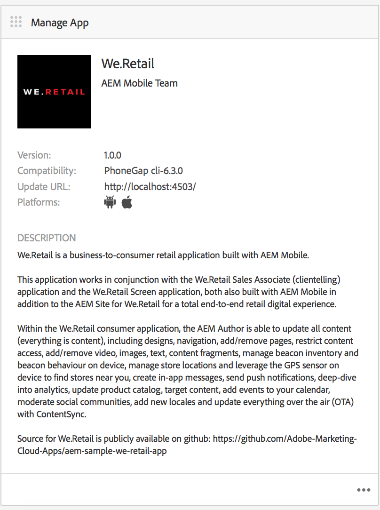

# Bearbeiten von App-Metadaten {#editing-app-metadata}

>[!NOTE]
>
>Adobe empfiehlt die Verwendung des SPA-Editors für Projekte, für die ein frameworkbasiertes clientseitiges Rendering für einzelne Seiten (z. B. React) erforderlich ist. [Weitere Informationen](/help/sites-developing/spa-overview.md)

The **Manage App** tile and &quot;Manage App&quot; page provides a means to view and edit application metadata. App-Metadaten sind erforderliche Details, um eine Anwendung in einem Store eines Anbieters freizugeben. Dazu können allgemeine Metadaten, iOS-Metadaten und Screenshots gehören. See the [Manage App Tile](/help/mobile/phonegap-app-details-tile.md) for further details on common and iOS metadata.

## Bearbeiten der App-Daten {#editing-the-app-data}

So bearbeiten Sie die Metadaten der App:

1. Gehen Sie zur Dashboard-Seite für die App.

   

1. Um Details anzuzeigen oder zu bearbeiten, klicken Sie auf &quot;...&quot; in der unteren rechten Ecke der Kachel App **verwalten** .

1. Geben Sie die Details in die fünf verfügbaren Registerkarten ein oder zeigen Sie sie an (siehe Abbildung unten).

   

## Bearbeiten allgemeiner und iOS-Metadaten {#editing-common-and-ios-metadata}

Sie können die allgemeinen und IOS-Metadaten bearbeiten:

* Wählen Sie auf der Seite &quot;App-Beschreibung&quot;die Registerkarte &quot; **Erweitert** &quot;aus.
* Bearbeiten oder Anzeigen der allgemeinen und IOS-Metadaten. Nähere Informationen finden Sie in den nachstehenden Zahlen.

 

## Screenshots hinzufügen und entfernen {#add-and-remove-screenshots}

Sie können App-Screenshots in das Metadaten-Rollup einbeziehen. Einige Anbieter benötigen präzise Screenshots, wenn Sie eine App an den App Store senden. Diese Bilder müssen bereits in Assets vorhanden sein. Informationen zum Hochladen Ihrer Screenshots finden Sie unter [Asset-Auswahl](../assets/search-assets.md#assetselector).

### Hinzufügen von Screenshots {#add-screenshots}

So fügen Sie ein Asset als Screenshot hinzu:

1. While in edit mode of the **Manage App** page, click add (plus icon).
1. Wählen Sie das Asset aus und klicken Sie auf **Auswählen** , um das Asset hinzuzufügen.

   

1. Wählen Sie das Asset aus und klicken Sie auf **Auswählen** , um das Asset hinzuzufügen.

>[!NOTE]
>
>Der Screenshot muss mit der Bildschirmauflösung des Zielgeräts übereinstimmen.

### Löschen von Screenshots {#delete-screenshots}

So entfernen Sie einen Screenshot:

Klicken Sie auf den Löschvorgang für das Asset.

## Die nächsten Schritte {#the-next-steps}

Weitere Informationen zu anderen Autorenrollen finden Sie in den folgenden Ressourcen:

* [Bereich „App verwalten“](/help/mobile/phonegap-app-details-tile.md)
* [App-Definitionen](/help/mobile/phonegap-app-definitions.md)
* [Erstellen einer neuen App mit dem Assistenten zum Erstellen einer App](/help/mobile/phonegap-create-new-app.md)
* [Vorhandene Hybrid-App importieren](/help/mobile/phonegap-adding-content-to-imported-app.md)
* [Content Services](/help/mobile/develop-content-as-a-service.md)

### Zusätzliche Ressourcen {#additional-resources}

Informationen zu den Rollen und Verantwortlichkeiten von Administratoren und Entwicklern finden Sie in den nachfolgend aufgeführten Ressourcen:

* [Entwickeln für Adobe PhoneGap Enterprise mit AEM](/help/mobile/developing-in-phonegap.md)
* [Verwalten von Inhalten für Adobe PhoneGap Enterprise mit AEM](/help/mobile/administer-phonegap.md)
