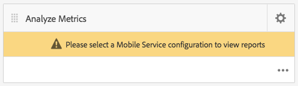

# App-Leistung mit Adobe Mobile Analytics verfolgen{#track-app-performance-with-adobe-mobile-analytics}

>[!NOTE]
>
>Adobe empfiehlt die Verwendung des SPA-Editors für Projekte, für die ein frameworkbasiertes clientseitiges Rendering für einzelne Seiten (z. B. React) erforderlich ist. [Weitere Informationen](/help/sites-developing/spa-overview.md)

Sie möchten höhere Kundenkonversionen und -loyalität fördern.

Sie möchten Ihren Kunden relevante und ansprechende Erlebnisse bereitstellen.

Was macht Ihre AEM Mobile-App für Ihre Marketingkampagnen?

Wie können Sie Ihre Mobile Apps anpassen, um den Benutzern das beste Erlebnis zu bieten?

Mit Adobe Mobile Services können Sie durch Nachverfolgung der Nutzung, App-Abstürze, Gerätedetails und so vieler anderer wichtiger Metriken für Ihre mobilen Apps Einblicke in die Verwendung Ihrer mobilen Apps erhalten.

Adobe Experience Manager Mobile bietet einen Einblick in die Details Ihrer mobilen Analyse direkt über das AEM Mobile Application Dashboard. Die Kachel **Mobile Metriken** im Dashboard bietet Echtzeitanalysen für Ihre Mobile App, sodass Entwickler, Autoren und Administratoren einen schnellen Überblick über den Zustand Ihrer Mobile App erhalten. Unter den Überschriften wird die Analyse mit dem SDK [Adobe Mobile Analytics](https://www.adobe.com/ca/solutions/digital-analytics/mobile-web-apps-analytics.html) unterstützt. Das Adobe Mobile Analytics-SDK kann nativ oder über ein PhoneGap-Bridge-Plug-in für Webansichten an Ihre Anwendungen angeschlossen werden. Metriken werden erfasst und auf dem Gerät zwischengespeichert, bis das Gerät verbunden ist und an dem die Daten zur Berichterstellung und Analyse an die Adobe Mobile Services Cloud gesendet werden.

Das Adobe Mobile Analytics-SDK bietet Folgendes:

1. **Datenerfassung für mobile Kanäle** - Erfassen Sie umfassende Daten zu Ihren mobilen Websites und Apps auf allen wichtigen Betriebssystemen.
1. **Analyse mobiler Interaktionen**  - Verstehen Sie die Benutzerinteraktion innerhalb Ihrer mobilen App, Website oder Videos, einschließlich der Häufigkeit, mit der Verbraucher den Kanal starten, ob sie Käufe darüber tätigen und mehr.
1. **Mobile App-Dashboards und -Berichte**  - Rufen Sie Nutzungsberichte ab, die Lebenszyklusmetriken für Ihre Apps und App Store-Metriken enthalten - siehe Trends für Benutzer, Starts, durchschnittliche Sitzungslänge, Aufbewahrungsdauer und Abstürze.
1. **Analyse mobiler Kampagnen**  - Quantifizieren Sie die Effektivität mobiler Kampagnen wie SMS, mobiler Suchanzeigen, mobiler Display-Anzeigen und QR-Codes.
1. **Geolocation-Analyse** : Ermitteln Sie, wo Ihre App-Benutzer Ihre mobilen Erlebnisse starten und damit interagieren, nach GPS-Position oder Zielpunkten.
1. **Pfadanalyse**  - Erfahren Sie, wie Benutzer durch Ihre App navigieren, um zu bestimmen, welche Bildschirme und Benutzeroberflächenelemente Benutzer anregen und welche dazu führen, dass Benutzer abbrechen.

In diesem Abschnitt wird beschrieben, wie [AEM-Entwickler](#developers) dann lernen können, wie AEM Mobile-Apps mit Analytics-Tracking instrumentiert werden.

Schließlich lernen [AEM Administratoren](#administrators) Folgendes:

* Erstellen eines Cloud-Service für Adobe Mobile Services
* Erstellen einer Mobile Service-Konfiguration und Verknüpfen einer Report Suite
* Mobile Service-Konfiguration mit einer Mobile App verknüpfen
* Metriken über das AEM Apps Command Center anzeigen
* Weisen Sie Ihrer Mobile App die AMS-SDK-Konfiguration zu.

## Für Entwickler - Integration von Analytics in Ihre App {#for-developers-integrate-analytics-into-your-app}

**Voraussetzung:** AEM Administratoren müssen die Adobe Mobile Services-Cloud-Konfiguration konfigurieren,  [wie nachfolgend](#amscloudserviceconfig) beschrieben.

Entwickler sind für [das Hinzufügen von Analysen zu einer AEM Mobile-App](/help/mobile/phonegap-add-analytics-to-apps.md) verantwortlich, um zu verfolgen, Berichte zu erstellen und zu verstehen, wie Benutzer mit Ihren mobilen App-Inhalten interagieren, und wichtige Lebenszyklusmetriken wie Starts, App-Zeit und Absturzhäufigkeit zu messen.

## Für Administratoren - Adobe Mobile Services Cloud Service {#for-administrators-configure-the-adobe-mobile-services-cloud-service} konfigurieren

Um Adobe Mobile Services nutzen zu können, müssen Sie den Cloud Service für AEM Adobe Mobile Services mit Ihren Adobe Analytics-Kontoinformationen konfigurieren. Das Apps Command Center bietet die Kachel **Metriken analysieren** , in der Sie den Cloud-Service erstellen und mit Ihrer mobilen App verknüpfen können.

Konfigurieren Sie den Cloud-Service für Ihre mobile App, indem Sie auf das Zahnradsymbol in der Kachel Metriken analysieren klicken.

Wenn Sie auf das Zahnradsymbol in der Kachel Metriken analysieren klicken, wird das modale Dialogfeld &quot;Mobile Services Analytics konfigurieren&quot;geöffnet. Wählen Sie Ihre Konfiguration aus der Dropdown-Liste &quot;Mobile Service-Konfiguration auswählen&quot;aus. Wenn Sie eine neue Konfiguration erstellen müssen, klicken Sie auf die Schraubenschlüssel-Schaltfläche.

Um einen Adobe Mobile Service-Cloud-Service zu erstellen, sind zwei Schritte erforderlich: die Verbindung zum Dienst und die Auswahl der Report Suite, die der Konfiguration zugewiesen werden soll.

Klicken Sie zunächst auf die Schaltfläche &quot;+&quot;auf der Kachel Cloud Services verwalten im Dashboard.

Wenn Sie auf die Schaltfläche &quot;**+**&quot;klicken, wird der Assistent **Cloud Service hinzufügen** angezeigt.

Wählen Sie eine neue Mobile Service-Konfiguration aus oder erstellen Sie sie, indem Sie die erforderlichen Felder wie unten dargestellt ausfüllen. Ihr AEM-Administrator benötigt diese Informationen, um die Verbindung zu Adobe Mobile Services erfolgreich herstellen zu können.

Nachdem Sie die Mobile Services-Kontoeinstellungen abgeschlossen haben, werden Sie aufgefordert, eine App auszuwählen. Dadurch wird die Analytics-Berichterstellung von Adobe Mobile Service mit dieser Anwendung verbunden.

Wählen Sie den gewünschten Mobile Service aus und klicken Sie auf &quot;Aktualisieren&quot;, um die Konfiguration des Mobile-Service zuzuweisen und das Dialogfeld zu schließen.

Nachdem Sie die Konfiguration des mobilen Dienstes mit der AEM Mobile-App verknüpft haben, beginnt die Kachel, die Metrikdaten abzurufen und mit der Berichterstellung zu beginnen.

### Adobe Mobile Services SDK-Konfigurationsdatei {#adobe-mobile-services-sdk-config-file}

Zu diesem Zeitpunkt ist Ihre Mobile App mit einem Cloud-Service verknüpft. Die Mobile App weiß jedoch noch nicht, wie die erfassten Mobile-Metriken an Adobe Analytics zurückgegeben werden können. Um die App mit Adobe Analytics zu verknüpfen, muss die Adobe Mobile Services SDK-Konfigurationsdatei zu Adobe Experience Manager hinzugefügt werden.

Klicken Sie in der Kachel Metriken analysieren auf das Pfeilsymbol, um die Menüeinträge AMS SDK-Konfiguration herunterladen/hochladen anzuzeigen.

Der erste Schritt besteht darin, die SDK-Konfiguration von Adobe Mobile Services abzurufen. Wenn Sie auf &quot;AMS SDK-Konfiguration herunterladen&quot;klicken, werden Sie zur Adobe Mobile Services-Website weitergeleitet, von der Sie die Konfigurationsdatei herunterladen können. Nachdem Sie die Datei ADBMobileConfig.json erhalten haben, klicken Sie auf &quot;AMS-SDK-Konfiguration hochladen&quot;, um die Konfigurationsdatei in AEM hochzuladen.

Klicken Sie auf die Schaltfläche &quot;Adobe Mobile Services Application Config hochladen&quot;, suchen Sie die Datei &quot;ADBMobileConfig.json&quot;und klicken Sie auf &quot;Hochladen&quot;.

Jetzt, da die mobile App Zugriff auf die Datei ADBMobileConfig.json hat, verfügt sie über die nötigen Kenntnisse, um mit Adobe Analytics zu kommunizieren und Berichte zu diesen wichtigen Metrikwerten zu erstellen, die Ihnen helfen, Ihren App-Erfolg zu fördern.

## Wie geht es weiter? {#what-s-next}

1. [Mein AEM Mobile App-Erlebnis ](/help/mobile/starting-aem-phonegap-app.md)
1. [Verwalten des App-Inhalts ](/help/mobile/phonegap-manage-app-content.md)
1. [Erstellen meiner Anwendung ](/help/mobile/building-app-mobile-phonegap.md)
1. [Messen der Leistung meiner App mit Adobe Mobile Analytics ](/help/mobile/phonegap-intro-to-app-analytics.md)
1. [Ein personalisiertes App-Erlebnis mit Adobe Target ](/help/mobile/phonegap-aem-mobile-content-personalization.md)
1. [Senden wichtiger Nachrichten an meine Benutzer ](/help/mobile/phonegap-push-notifications.md)