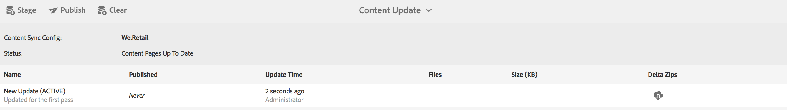

# Erstellen und Verwalten von App-Inhalten{#creating-and-managing-app-content}

>[!NOTE]
>
>Adobe empfiehlt die Verwendung des SPA-Editors für Projekte, für die ein frameworkbasiertes clientseitiges Rendering für einzelne Seiten (z. B. React) erforderlich ist. [Weitere Informationen](/help/sites-developing/spa-overview.md)

Die Verwaltung von App-Inhalten erfordert gemeinsame Anstrengungen von [Entwicklern](#developer), [Autoren](#author) und [Administratoren](#administrator). Autoren bearbeiten Seiten, die wiederum auf Vorlagen und Komponenten basieren, die von App-Entwicklern generiert wurden.

Schließlich veröffentlichen Administratoren den aktualisierten App-Inhalt strategisch.

>[!NOTE]
>
>**Voraussetzung**:
>
>Beim [Bereitstellen und Warten](/help/sites-deploying/deploy.md)wurden Entwickler mit dem AEM-System von Komponenten und Vorlagen vertraut.

## The Manage Page Content Tile {#the-manage-page-content-tile}

>[!CAUTION]
>
>Wenn Sie keine vordefinierte App-Vorlage verwenden, müssen Sie einen Content Sync-Handler konfigurieren, um die Veröffentlichung neuer App-Inhalte für OTA zu aktivieren.
>
>Weitere Informationen finden Sie unter [Mobile mit Inhaltssynchronisierung](/help/mobile/phonegap-contentsync.md) im Developer&#39;s-Abschnitt.

Hier können Inhalte in AEM Mobile genauso wie in AEM Sites erstellt, bearbeitet und gelöscht werden.

The **Manage Page Content tile** displays the number of pages of managed content and last modified for a particular payload. Durch Klicken auf die einzelnen Datensätze in diesem Bereich können Sie Details für den Inhalt anzeigen, um Seiten zu erstellen, zu kopieren, zu verschieben, zu löschen und zu aktualisieren.

Nachdem der Inhalt aktualisiert wurde, können Administratoren über die Kachel &quot;Inhaltspakete **verwalten&quot;eine Inhaltsaktualisierungsnutzlast OTA (Over-the-Air) für Kunden veröffentlichen.**

Wählen Sie eines der aufgelisteten Inhaltspakete aus, um Inhalte wie das Erstellen, Bearbeiten oder Entfernen von Seiten, das Ändern der Navigation und Seitenreihenfolge, das Erstellen oder Aktualisieren von Inhalten wie Kopieren (Text) und Medien zu erstellen oder zu bearbeiten.

Beachten Sie, dass *alles Inhalt* ist, d. h. Anwendungsstile, Kopie (Text), Medien, Seiten, Navigation und Targeting von Inhalten können alle bearbeitet und aktualisiert OTA, ohne einen Besuch in einem App Store.

Um AEM Mobile-Inhalte bearbeiten zu können, *AEM-Autoren *benötigen ein fundiertes Verständnis der Benutzeroberfläche für die Bearbeitung von AEM-Inhalten: Seiten [erstellen in AEM.](/help/sites-authoring/qg-page-authoring.md)

## The Manage Content Packages Tile {#the-manage-content-packages-tile}

Hier können *AEM-Administratoren* ihre Apps schnell und einfach aktualisieren, um ansprechende Erlebnisse und aktuelle Inhalte bereitzustellen, um die Interaktion mit der Marke zu fördern und Geschäftsziele zu erreichen, ohne dass eine erneute Übermittlung durch Entwickler oder App Store erforderlich ist.

Once *AEM Authors* have added or modified content through the Manage Content Tile, *AEM Administrators* are able to push those changes out to customers with a Content Packages update.

Die Aktion &quot;Inhaltspaket&quot;ermöglicht es dem *AEM-Autor* , Seiteninhalte zu erstellen und zu bearbeiten, während das Entwicklungsteam Änderungen an einem Host-Anwendungsdesign und -implementierung vornimmt, einschließlich Navigation, Stil, serverseitige Logik, Vorlagen und Komponenten, und diese Änderungen dann an Kunden weiterzuleiten, ohne dass die Änderungen erneut an die verschiedenen Stores zur Verteilung gesendet werden müssen.

**So veröffentlichen Sie neue oder aktualisierte Inhalte**

Wählen Sie ein Inhaltspaket aus der Kachel, in diesem Beispiel das englische Paket. Beachten Sie, dass ein Dialogfeld zur Inhaltsaktualisierung die entsprechende Konfiguration für die *Inhaltssynchronisierung* auflistet. Wenn App-Inhalte seit einer vorherigen Aktualisierung geändert wurden, wird der Status *Ausstehend* angezeigt, wie unten dargestellt.

Wählen Sie dann oben rechts die **Aktion &quot;Bühne** &quot;aus, um die neue Inhaltsaktualisierung zu erstellen. Fügen Sie die entsprechenden Aktualisierungsinformationen hinzu und drücken Sie die Taste Fertig.

Der *Content Sync* -Handler erstellt dann die erforderlichen Pakete, indem er ein Delta bildet (ein Paket, das *nur* die Änderungen enthält). Nach Abschluss des Vorgangs wurde dieses Updateinhaltspaket wie unten dargestellt gestaffelt.

Durch die Staging einer Aktualisierung von Inhalten können mehrere Aktualisierungen vorgenommen werden, bevor sie auf OTA für Mobilgeräte veröffentlicht werden.

>[!NOTE]
>
>Der gestaffelte Inhalt kann vor der Veröffentlichung mit der AEM Verify-App überprüft werden.
>
>Weitere Informationen zur AEM Verify-App finden Sie unter [Mobile QuickStart für AEM Verify](/help/mobile/phonegap-mobile-quickstart.md) .

Wenn Sie bereit sind, Ihren App-Benutzern mit Content Sync OTA neue Inhalte bereitzustellen, wählen Sie &quot; **Veröffentlichen** &quot;, wie unten dargestellt.

### Die nächsten Schritte {#the-next-steps}

Nachdem Sie im Anwendungs-Dashboard Informationen zum Erstellen und Verwalten von App-Inhalten erhalten haben, finden Sie weitere Informationen zu den folgenden Ressourcen für Authoring-Rollen:

* [Bereich „App verwalten“](/help/mobile/phonegap-app-details-tile.md)
* [Bearbeiten von App-Metadaten](/help/mobile/phonegap-editmetadata.md)
* [App-Definitionen](/help/mobile/phonegap-app-definitions.md)
* [Erstellen einer neuen App mit dem Assistenten zum Erstellen einer App](/help/mobile/phonegap-create-new-app.md)
* [Vorhandene Hybrid-App importieren](/help/mobile/phonegap-adding-content-to-imported-app.md)

### Zusätzliche Ressourcen {#additional-resources}

Informationen zu den Rollen und Verantwortlichkeiten von Administratoren und Entwicklern finden Sie in den nachfolgend aufgeführten Ressourcen:

* [Entwickeln für Adobe PhoneGap Enterprise mit AEM](/help/mobile/developing-in-phonegap.md)
* [Verwalten von Inhalten für Adobe PhoneGap Enterprise mit AEM](/help/mobile/administer-phonegap.md)
