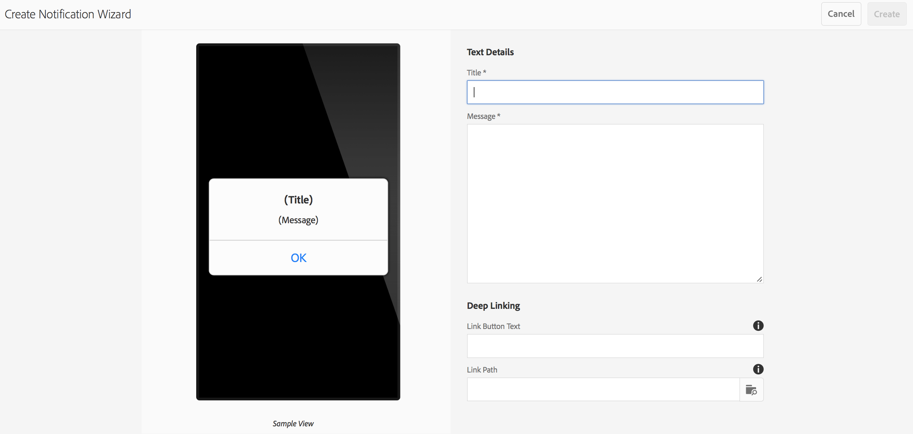

# Push-Benachrichtigungen{#push-notifications}

>[!NOTE]
>
>Adobe empfiehlt die Verwendung des SPA-Editors für Projekte, für die ein frameworkbasiertes clientseitiges Rendering für einzelne Seiten (z. B. React) erforderlich ist. [Weitere Informationen](/help/sites-developing/spa-overview.md)

Die Möglichkeit, Ihre AEM Mobile-App-Benutzer sofort mit wichtigen Benachrichtigungen zu benachrichtigen, ist für den Wert einer App und ihrer Marketingkampagnen von entscheidender Bedeutung. In unserem Beispiel werden die Schritte beschrieben, die unternommen werden müssen, damit Ihre App Push-Benachrichtigungen empfangen kann, sowie die Konfiguration und der Versand von Push-Benachrichtigungen von AEM Mobile an die am Telefon installierte App. Darüber hinaus wird in diesem Abschnitt beschrieben, wie Sie die Funktion [Deep-Linking](#deeplinking) für Push-Benachrichtigungen konfigurieren.

>[!NOTE]
>
>*Push-Benachrichtigungen werden nicht garantiert. sie sind eher wie Ankündigungen. Es wird alles daran gesetzt, sicherzustellen, dass jeder sie erhält, aber sie kein garantierter Bereitstellungsmechanismus sind. Außerdem kann die Bereitstellungszeit für einen Push-Vorgang von weniger als einer Sekunde bis zu einer halben Stunde variieren.*

Die Verwendung von Push-Benachrichtigungen mit AEM erfordert einige verschiedene Technologien. Zunächst muss ein Push-Benachrichtigungs-Dienstleister zur Verwaltung von Benachrichtigungen und Geräten verwendet werden (AEM tut dies noch nicht). Zwei Anbieter sind standardmäßig mit AEM konfiguriert: [Amazon Simple Notification Service](https://aws.amazon.com/sns/) (oder SNS) und [Pushwoosh](https://www.pushwoosh.com/). Zweitens muss die Push-Technologie für das jeweilige mobile Betriebssystem den entsprechenden Dienst (den Push Notification Service (APNS) von Apple für iOS-Geräte) durchlaufen. und Google Cloud Messaging (oder GCM) für Android-Geräte. Obwohl AEM nicht direkt mit diesen plattformspezifischen Diensten kommuniziert, müssen einige zugehörige Konfigurationsinformationen von AEM zusammen mit den Benachrichtigungen bereitgestellt werden, damit diese Dienste den Push-Vorgang ausführen können.

Nach der Installation und Konfiguration (wie unten beschrieben) funktioniert dies wie folgt:

1. In AEM wird eine Push-Benachrichtigung erstellt und an den Dienstleister (Amazon SNS oder Pushwoosh) gesendet.
1. Der Dienstleister erhält sie und sendet sie an den Hauptanbieter (APNS oder GCM).
1. Der Hauptanbieter sendet die Benachrichtigung an alle Geräte, die für diese Push-Benachrichtigung registriert sind. Für jedes Gerät wird das Mobilfunknetz für Daten oder WiFi verwendet, je nachdem, was derzeit auf dem Gerät verfügbar ist.
1. Die Benachrichtigung wird auf dem Gerät angezeigt, wenn die App, für die sie registriert ist, nicht ausgeführt wird. Ein Benutzer, der auf die Benachrichtigung tippt, startet die App und zeigt die Benachrichtigung in der App an. Wenn die Anwendung bereits ausgeführt wird, wird nur die In-App-Benachrichtigung angezeigt.

Diese Version von AEM unterstützt iOS- und Android-Mobilgeräte.

## Übersicht und Verfahren {#overview-and-procedure}

Um Push-Benachrichtigungen in einer AEM Mobile-App zu verwenden, müssen die folgenden allgemeinen Schritte ausgeführt werden.

Normalerweise führt ein AEM-Entwickler Folgendes durch:

1. Bei Apple- und Google-Messaging-Diensten registrieren
1. Registrieren Sie sich bei einem Push-Messaging-Dienst und konfigurieren Sie ihn.
1. Push-Unterstützung zur App hinzufügen
1. Vorbereiten eines Telefons auf Tests

Ein AEM Administrator wird Folgendes tun:

1. Push-Benachrichtigungen für AEM Apps konfigurieren
1. Erstellen und Bereitstellen der App
1. Push-Benachrichtigung senden
1. Deep-Linking konfigurieren *(optional)*

### Schritt 1: Registrieren Sie sich bei Apple und Google Messaging Services {#step-register-with-apple-and-google-messaging-services}

#### Verwenden des Apple Push Notification Service (APNS) {#using-the-apple-push-notification-service-apns}

Gehen Sie zur Apple-Seite [hier](https://developer.apple.com/library/ios/documentation/NetworkingInternet/Conceptual/RemoteNotificationsPG/Chapters/ApplePushService.html) , um sich mit dem Apple Push Notification Service vertraut zu machen.

Um APNS zu verwenden, benötigen Sie eine **Certificate**-Datei (eine .cer-Datei), einen Push-Schlüssel **Private Key** (eine .p12-Datei) und ein **Private Key Password** von Apple. Anweisungen dazu finden Sie [hier](https://developer.apple.com/library/ios/documentation/NetworkingInternet/Conceptual/RemoteNotificationsPG/Chapters/ProvisioningDevelopment.html).

#### Verwenden des Google Cloud Messaging (GCM)-Dienstes {#using-the-google-cloud-messaging-gcm-service}

>[!NOTE]
>
>Google ersetzt GCM durch einen ähnlichen Dienst namens Firebase Cloud Messaging (FCM). Klicken Sie für weitere Informationen zu FCM [hier](https://developers.google.com/cloud-messaging/faq).

Gehen Sie zur Google-Seite [hier](https://developer.android.com/google/gcm/index.html) , um sich mit Google Cloud Messaging für Android vertraut zu machen.

Führen Sie die Schritte [hier](https://developer.android.com/google/gcm/gs.html) zu **Erstellen Sie ein Google API-Projekt**, **Aktivieren Sie den GCM-Dienst** und **Erhalten Sie einen API-Schlüssel**. Sie benötigen den **API-Schlüssel**, um Push-Benachrichtigungen an Android-Geräte zu senden. Zeichnen Sie auch Ihre **Projektnummer** auf, die manchmal auch als **GCM Sender Id** bezeichnet wird.

Die folgenden Schritte zeigen eine andere Methode zum Erstellen von GCM-API-Schlüsseln:

1. Melden Sie sich bei Google an und wechseln Sie zur Entwicklerseite von [Google](https://developers.google.com/mobile/add?platform=android&amp;cntapi=gcm).
1. Wählen Sie Ihre App aus der Liste aus (oder erstellen Sie eine neue).
1. Geben Sie unter Android Package Name Ihre App-ID ein, d. h. `com.adobe.cq.mobile.weretail.outdoorsapp`. (Wenn dies nicht funktioniert, versuchen Sie es erneut mit &quot;test.test&quot;.)
1. Klicken Sie auf **Weiter zur Auswahl und Konfiguration von Diensten**
1. Wählen Sie Cloud Messaging und klicken Sie dann auf **Google Cloud Messaging aktivieren**.
1. Daraufhin werden der neue Server-API-Schlüssel und die (neue oder vorhandene) Sender-ID angezeigt.

>[!NOTE]
>
>Notieren Sie sich den Server-API-Schlüssel. Dieser Wert wird auf der Site Ihres Push-Providers eingegeben.

### Schritt 2: Registrieren und Konfigurieren eines Push-Messaging-Dienstes {#step-register-and-configure-a-push-messaging-service}

AEM ist für die Verwendung eines der drei Dienste für Push-Benachrichtigungen konfiguriert:

* Amazon SNS
* Pushwoosh
* Adobe Mobile Services

*Amazon* SNS- und  ** Pushwooshs-Konfigurationen ermöglichen den Versand von Push-Benachrichtigungen von AEM Bildschirmen aus.

*Mit der Konfiguration von Adobe Mobile* Services können Sie Push-Benachrichtigungen in Adobe Mobile Services mithilfe eines Adobe Analytics-Kontos konfigurieren und senden (die App muss jedoch mit dieser Konfiguration erstellt werden, um AMS-Push-Benachrichtigungen zu aktivieren).

#### Verwenden des Amazon SNS-Messaging-Diensts {#using-the-amazon-sns-messaging-service}

>[!NOTE]
>
>*Informationen zu Amazon SNS und einen Link zur Erstellung eines neuen AWS-Kontos finden Sie  [hier](https://aws.amazon.com/sns/). Sie erhalten ein kostenloses Konto für ein Jahr.*

Wenn Sie Amazon SNS nicht verwenden möchten, können Sie diese Schritte überspringen.

Führen Sie die folgenden Schritte aus, um Amazon SNS für Push-Benachrichtigungen einzurichten:

1. **Bei Amazon SNS registrieren**

   1. Notieren Sie Ihre Konto-ID. Das Format sollte zwölf Ziffern ohne Leerzeichen oder Gedankenstriche aufweisen, d. h. &quot;123456789012&quot;.
   1. Stellen Sie sicher, dass Sie sich in der Region &quot;us-east&quot;oder &quot;eu&quot;befinden, da für einen späteren Schritt (Erstellung eines Identitäts-Pools) eine dieser Voraussetzungen erforderlich ist.
   1. Melden Sie sich nach der Registrierung bei der Verwaltungskonsole an und wählen Sie [SNS](https://console.aws.amazon.com/sns/) (Push Notification Service). Klicken Sie auf &quot;Erste Schritte&quot;, wenn es angezeigt wird.

1. **Zugriffsschlüssel und -kennung erstellen**

   1. Klicken Sie oben rechts im Bildschirm auf Ihren Anmeldenamen und wählen Sie im Menü Sicherheitsberechtigungen aus.
   1. Klicken Sie auf Zugriffsschlüssel und klicken Sie im unten stehenden Bereich auf **Neuen Zugriffsschlüssel erstellen**.
   1. Klicken Sie auf **Zugriffsschlüssel anzeigen** und kopieren Sie die angezeigte Zugriffsschlüssel-ID und den geheimen Zugriffsschlüssel und speichern Sie sie. Wenn Sie die Option zum Herunterladen der Schlüssel auswählen, erhalten Sie eine CSV-Datei, die dieselben Werte enthält.
   1. Andere sicherheitsbezogene Zertifikate und andere können auf dieser Seite verwaltet werden.

   >[!NOTE]
   >
   >Ein Zugriffsschlüssel kann für mehrere Apps verwendet werden.

   Für Organisationen, die ein &quot;AWS-Sandbox&quot;-Konto verwenden, sind die Schritte sehr ähnlich und werden hier beschrieben:

   1. Klicken Sie oben rechts im Bildschirm auf Ihren Anmeldenamen und wählen Sie im Menü Meine Sicherheitsanmeldeinformationen aus.
   1. Klicken Sie in der linken Aktionsliste auf Benutzer und wählen Sie Ihren Benutzernamen aus.
   1. Klicken Sie auf die Registerkarte Sicherheitsberechtigungen .
   1. Hier sehen Sie Ihre Schlüssel und erstellen neue Schlüssel. Speichern Sie die Schlüssel zur späteren Verwendung.

1. **Thema erstellen**

   1. Klicken Sie auf **Thema erstellen** und wählen Sie einen Themennamen aus. Notieren Sie alle Felder wie Themenbereich-ARN, Themeneigentümer, Region, Anzeigename.
   1. Klicken Sie auf **Andere Themenaktionen** > **Themenrichtlinie bearbeiten**. Wählen Sie unter **Diese Benutzer können dieses Thema abonnieren** die Option **Alle.**
   1. Klicken Sie auf **Richtlinie aktualisieren**.

   >[!NOTE]
   >
   >Sie können mehrere Themen für verschiedene Szenarien wie Entwicklung, Test, Demo usw. erstellen. Der Rest der SNS-Konfiguration kann unverändert bleiben. Erstellen Sie die App mit dem anderen Thema. Push-Benachrichtigungen, die an dieses Thema gesendet werden, werden nur von der mit diesem Thema erstellten App empfangen.

1. **Erstellen von Platform-Anwendungen**

   1. Klicken Sie auf Anwendungen und dann auf Platform Application erstellen. Wählen Sie einen Namen und eine Plattform aus (APNS für iOS, GCM für Android). Je nach Plattform müssen andere Felder ausgefüllt werden:

      1. Bei APNS müssen eine P12-Datei, ein Kennwort, ein Zertifikat und ein privater Schlüssel eingegeben werden. Diese sollten im obigen Schritt *Verwenden des Apple Push Notification Service (APNS)* abgerufen worden sein.
      1. Für GCM muss ein API-Schlüssel eingegeben werden. Dies sollte im Schritt *Verwenden des Google Cloud Messaging (GCM)-Diensts* oben erhalten worden sein.
   1. Wiederholen Sie den obigen Schritt einmal für jede Plattform, die Sie unterstützen. Um sowohl an iOS als auch an Android pushen zu können, müssen zwei Platform-Anwendungen erstellt werden.

1. **Erstellen eines Identitäts-Pools**

   1. Verwenden Sie [Cognito](https://console.aws.amazon.com/cognito), um einen Identitäts-Pool zu erstellen, in dem grundlegende Daten nicht authentifizierter Benutzer gespeichert werden. Amazon Cognito unterstützt derzeit nur die Regionen &quot;us-east&quot;und &quot;eu&quot;.
   1. Geben Sie ihm einen Namen und aktivieren Sie das Kontrollkästchen &quot;Zugriff auf nicht authentifizierte Identitäten aktivieren&quot;.
   1. Klicken Sie auf der nächsten Seite (&quot;*Ihre Kognito-Identitäten erfordern Zugriff auf Ihre Ressourcen*&quot;) auf Zulassen.
   1. Klicken Sie oben rechts auf der Seite auf den Link &quot;*Identitäts-Pool bearbeiten&quot;*. Die Identitäts-Pool-ID wird angezeigt. Speichern Sie diesen Text für später.
   1. Wählen Sie auf derselben Seite das Dropdown-Menü neben &quot;Nicht authentifizierte Rolle&quot;aus und stellen Sie sicher, dass die Rolle Cognito_&lt;Poolname>UnauthRole ausgewählt ist. Speichern Sie Ihre Änderungen.

1. **Zugriff konfigurieren**

   1. Melden Sie sich bei [Identitäts- und Zugriffsverwaltung](https://console.aws.amazon.com/iam/home) (IAM) an.
   1. Rollen auswählen
   1. Klicken Sie auf die Rolle, die im vorherigen Schritt erstellt wurde, mit dem Namen Cognito_&lt;yourIdentityPoolName>Unauth_Role. Notieren Sie sich die angezeigte Rolle ARN.
   1. Öffnen Sie &quot;Inline-Richtlinien&quot;, falls sie noch nicht geöffnet sind. Dort sollte eine Richtlinie mit einem Namen wie oneClick_Cognito_&lt;yourIdentityPoolName>Unauth_Role_1234567890123 angezeigt werden.
   1. Klicken Sie auf &quot;Richtlinie bearbeiten&quot;. Ersetzen Sie den Inhalt des Richtliniendokuments durch dieses JSON-Snippet:

   <table>
    <tbody>
     <tr>
     <td>
 
 
{
 
 "Version": "10.10.2012",
 
 "Aussage": [
 
 {
 
 "Aktion": [
 
 "mobileanalytics:PutEvents",
 
 "cognito-sync:*",
 
 "SNS:CreatePlatformEndpoint",
 
 "SNS:Subscribe"
 
 ],
 
 "Effekt": "Allow",
 
 "Ressource": [
 
 "*"
 
 _
 
 }
 
 _
 
}
 
 
 </td>
     </tr>
    </tbody>
    </table>

   1. Klicken Sie auf **Richtlinie anwenden**

#### Verwenden des Pushwoosh-Messaging-Dienstes {#using-the-pushwoosh-messaging-service}

Wenn Sie Pushwoosh nicht verwenden möchten, können Sie diesen Schritt überspringen.

So verwenden Sie Pushwoosh:

1. **Registrieren bei Pushwoosh**

   1. Gehen Sie zu pushwoosh.com und erstellen Sie ein neues Konto.

1. **API-Zugriffstoken erstellen**

   1. Rufen Sie auf der Pushwoosh-Site das Menüelement API-Zugriff auf auf auf, um ein API-Zugriffstoken zu generieren. Sie müssen dies sicher aufzeichnen.

1. **Neue App erstellen**

   1. Zur Unterstützung von Android müssen Sie Ihren GCM-API-Schlüssel angeben.
   1. Wählen Sie beim Konfigurieren der App Cordova als Framework.
   1. Für iOS-Unterstützung müssen Sie die Zertifikatdatei (.cer), das Push-Zertifikat (.p12) und das Kennwort für den privaten Schlüssel angeben. Diese sollten von der APNS-Site von Apple abgerufen worden sein. Wählen Sie für Framework Cordova aus.
   1. Pushwoosh generiert eine App-ID für diese App im Format &quot;XXXXX-XXXXX&quot;, wobei jedes X ein hexadezimaler Wert (0 bis F) ist.

>[!NOTE]
>
>*Wenn eine zweite App in AEM mit derselben App-ID (und anderen zugehörigen Werten) konfiguriert ist: API-Zugriffstoken und GCM-ID) werden alle Push-Benachrichtigungen, die über die zweite App am AEM gesendet werden, an jede andere App mit dieser App-ID gesendet.*

### Schritt 3: Push-Unterstützung zur App hinzufügen {#step-add-push-support-to-the-app}

#### ContentSync-Konfiguration hinzufügen {#add-contentsync-configuration}

Erstellen Sie zwei Inhaltsknoten (einen in app-config und einen in app-config-dev) namens notificationsConfig:

* /content/`<your app>`/shell/jcr:content/page-app/app-config-dev/notificationsConfig
* /content/`<your app>`/shell/jcr:content/page-app/app-config/notificationsConfig

Mit diesen Eigenschaften (.content.xml files) :
&lt;jcr:root xmlns:jcr=&quot; [https://www.jcp.org/jcr/1.0](https://www.jcp.org/jcr/1.0)&quot; xmlns:nt=&quot; [https://www.jcp.org/jcr/nt/1.0](https://www.jcp.org/jcr/nt/1.0)&quot;
jcr:primaryType=&quot;nt:unstructured&quot;
excludeProperties=&quot;[appAPIAccessToken]&quot;
path=&quot;../../../..&quot;
targetRootDirectory=&quot;www&quot;
type=&quot;notificationsconfig&quot;/>

>[!NOTE]
>
>Der Content Sync-Handler sucht nach diesen Knoten, und wenn sie nicht vorhanden sind, schreibt er nicht die Datei &quot;page-notifications-config.json&quot;.

#### Client-Bibliotheken hinzufügen {#add-client-libraries}

Die Client-Bibliotheken der Push-Benachrichtigung müssen der App hinzugefügt werden, indem Sie die folgenden Schritte ausführen:

In CRXDE Lite:

1. Navigieren Sie zu */etc/designs/phonegap/&lt;App-Name>/clientlibsall.*
1. Doppelklicken Sie im Eigenschaftenbereich auf den Einbettungsabschnitt.
1. Fügen Sie im angezeigten Dialogfeld eine neue Client-Bibliothek hinzu, indem Sie auf die Schaltfläche + klicken.
1. Fügen Sie im neuen Textfeld &quot;cq.mobile.push&quot;hinzu und klicken Sie auf &quot;OK&quot;.
1. Fügen Sie eine weitere mit dem Namen cq.mobile.push.amazon hinzu und klicken Sie auf &quot;OK&quot;.
1. Speichern Sie die Änderungen.

>[!NOTE]
>
>Wenn Push-Benachrichtigungen aus Platzgründen in der App entfernt oder nicht verwendet werden und um Konsolenfehlermeldungen zu vermeiden, entfernen Sie diese Clientlibs aus Ihrer App.

### Schritt 4: Vorbereiten eines Telefons für Tests {#step-prepare-a-phone-for-testing}

>[!NOTE]
>
>*Für Push-Benachrichtigungen müssen Sie auf einem eigentlichen Gerät testen, da Emulatoren keine Push-Benachrichtigungen empfangen können.*

#### iOS {#ios}

Für iOS müssen Sie einen Mac OS-Computer verwenden und dem [iOS Developer Program](https://developer.apple.com/programs/ios/) beitreten. Einige Unternehmen verfügen über Unternehmenslizenzen, die für alle Entwickler verfügbar sein können.

In XCode 8.1 müssen Sie vor der Verwendung von Push-Benachrichtigungen in Ihrem Projekt zur Registerkarte Funktionen wechseln und den Umschalter Push-Benachrichtigungen aktivieren aktivieren.

#### Android {#android}

So installieren Sie die App über CLI auf einem Android-Telefon (siehe unten): **Schritt 6: Erstellen und Bereitstellen der App**), müssen Sie zunächst das Telefon in den &quot;Entwicklermodus&quot;stellen. Weitere Informationen dazu finden Sie unter [Aktivieren der Entwickleroptionen auf dem Gerät](https://developer.android.com/tools/device.html#developer-device-options) .

### Schritt 5: Push-Benachrichtigungen für AEM Apps konfigurieren {#step-configure-push-on-aem-apps}

Vor der Erstellung und Bereitstellung auf Ihrem konfigurierten Mobilgerät müssen Sie die Benachrichtigungseinstellungen für den gewünschten Messaging-Dienst konfigurieren.

1. Erstellen Sie die entsprechenden Berechtigungsgruppen für Push-Benachrichtigungen.
1. Melden Sie sich bei AEM als passender Benutzer an und klicken Sie auf die Registerkarte Apps .
1. Klicken Sie auf die App.
1. Suchen Sie die Kachel Cloud Services verwalten und klicken Sie auf das Stiftsymbol, um Ihre Cloud-Konfigurationen zu ändern.
1. Wählen Sie als Benachrichtigungskonfiguration Amazon SNS Connection, Pushwoosh Connection oder Adobe Mobile Services aus.
1. Geben Sie die Eigenschaften des Providers ein und klicken Sie auf Senden , um sie zu speichern, und auf Fertig . Sie werden derzeit nicht remote überprüft, außer im Falle von AMS.
1. Jetzt sollte die Konfiguration angezeigt werden, die Sie gerade in der Kachel Cloud Services verwalten eingegeben haben.

### Schritt 6: Erstellen und Bereitstellen der App {#step-build-and-deploy-the-app}

**Hinweis:** Siehe auch unsere Anweisungen   hier zum Erstellen von PhoneGap-Anwendungen.

Es gibt zwei Möglichkeiten, Ihre App mit PhoneGap zu erstellen und bereitzustellen.

**Hinweis:** Für Push-Benachrichtigungstests reichen Emulatoren nicht aus, da Push-Benachrichtigungen ein bestimmtes Protokoll zwischen dem Push-Provider (Apple oder Google) und dem Gerät verwenden. Aktuelle Mac-/PC-Hardware und Emulatoren unterstützen dies nicht.

1. *PhoneGap* Builder ist ein von PhoneGap angebotener Dienst, mit dem Ihre App auf ihren Servern erstellt und direkt auf Ihr Gerät heruntergeladen werden kann. Weitere Informationen zum Einrichten und Verwenden von PhoneGap Build finden Sie in der [PhoneGap Build-Dokumentation](https://build.phonegap.com/) .

1. *Mit der PhoneGap-Befehlszeilenschnittstelle*  (CLI) können Sie eine umfangreiche Reihe von PhoneGap-Befehlen in Ihrer Befehlszeile verwenden, um Ihre App zu erstellen, zu debuggen und bereitzustellen. Informationen zum Einrichten und Verwenden der PhoneGap-CLI finden Sie in der [PhoneGap-Entwicklerdokumentation](https://docs.phonegap.com/en/edge/guide_cli_index.md.html#The%20Command-Line%20Interface) .

### Schritt 7: Push-Benachrichtigung senden {#step-send-a-push-notification}

Gehen Sie wie folgt vor, um eine neue Benachrichtigung zu erstellen und zu senden.

1. Neue Benachrichtigung erstellen

   * Suchen Sie im Dashboard Ihrer AEM Mobile-App die Kachel Push-Benachrichtigungen .
   * Wählen Sie im Menü rechts oben &quot;Erstellen&quot;. Beachten Sie, dass diese Schaltfläche erst verfügbar ist, wenn die Cloud-Konfiguration zum ersten Mal festgelegt wurde.
   * Geben Sie im Assistenten zum Erstellen von Benachrichtigungen einen Titel und eine Nachricht ein und klicken Sie dann auf die Schaltfläche &quot;Erstellen&quot;. Ihre Benachrichtigung kann jetzt sofort oder später gesendet werden. Es kann bearbeitet und die Nachricht und/oder der Titel geändert und gespeichert werden.

1. Benachrichtigung senden

   * Suchen Sie im Apps-Dashboard die Kachel Push-Benachrichtigungen .
   * Wählen Sie die Benachrichtigung aus oder klicken Sie auf die Detailschaltfläche unten rechts (). . .), um die Liste der Benachrichtigungen anzuzeigen. Diese Liste gibt auch an, ob eine Benachrichtigung versandbereit oder bereits gesendet werden kann oder ob beim Versand ein Fehler aufgetreten ist.
   * Aktivieren Sie das Kontrollkästchen für eine Benachrichtigung (nur) und klicken Sie auf die Schaltfläche &quot;Benachrichtigung senden&quot; oberhalb der Liste. Sie haben die Möglichkeit, die Benachrichtigung im angezeigten Dialogfeld &quot;Abbrechen&quot;oder &quot;Senden&quot;zu senden.

1. Umgang mit den Ergebnissen

   * Wenn der Push-Benachrichtigungsdienst (Amazon SNS oder Pushwoosh) die Sendeanforderung erhält, sie als gültig bestätigt und erfolgreich an die nativen Provider (APNS und GCM) sendet, wird das Dialogfeld &quot;Senden&quot;ohne Nachricht geschlossen. In der Benachrichtigungsliste wird der Status dieser Benachrichtigung als Gesendet angezeigt.
   * Wenn der Push-Versand fehlschlägt, wird im Dialogfeld eine Meldung angezeigt, die das Problem angibt. In der Benachrichtigungsliste wird der Status dieser Benachrichtigung als Fehler aufgeführt. Wenn das Problem behoben wurde, kann die Benachrichtigung erneut gesendet werden. Im Falle eines Fehlers sollten zusätzliche Fehlerinformationen im Serverfehlerprotokoll angezeigt werden.
   * Beachten Sie, dass es einige Plattformunterschiede zwischen iOS- und Android-Push-Benachrichtigungen gibt. Dazu gehören:

      * Die Erstellung mit CLI startet die App, nachdem sie auf Android bereitgestellt wurde. Unter iOS müssen Sie es manuell starten. Da der Schritt zur Push-Registrierung beim Start erfolgt, können Android-Apps Push-Benachrichtigungen sofort empfangen (da er gestartet und registriert sein wird), iOS-Apps jedoch nicht.
      * Unter Android befindet sich der Text der Schaltfläche OK in Großbuchstaben (und in allen anderen Schaltflächen, die in der In-App-Benachrichtigung hinzugefügt werden), während er in iOS nicht vorhanden ist.

Bei AMS-Push-Benachrichtigungen müssen Benachrichtigungen erstellt und vom AMS-Server gesendet werden. AMS bietet zusätzliche Push-Benachrichtigungsfunktionen, die über die von AWS- und Pushwoosh-AEM-Benachrichtigungen bereitgestellten hinausgehen.

>[!NOTE]
>
>*Push-Benachrichtigungen werden nicht garantiert. sie sind eher wie Ankündigungen. Es wird versucht sicherzustellen, dass jeder es hört, aber es sich nicht um einen garantierten Bereitstellungsmechanismus handelt. Außerdem kann die Bereitstellungszeit für einen Push-Vorgang von weniger als einer Sekunde bis zu einer halben Stunde variieren.*

### Konfigurieren von Deep Linking mit Push-Benachrichtigungen {#configuring-deep-linking-with-push-notifications}

Was ist Deep Linking? Im Kontext einer Push-Benachrichtigung ist dies eine Möglichkeit, das Öffnen oder Weiterleiten einer App an eine angegebene Position innerhalb der App zu ermöglichen (sofern diese geöffnet ist).

Wie funktioniert es? Der Autor einer Push-Benachrichtigung fügt optional eine Schaltflächenbeschriftung hinzu (d. h. &quot;Zeig mir!&quot;) in die Benachrichtigung ein und wählt über einen visuellen Pfad-Browser die Seite aus, die in der Benachrichtigung verknüpft werden soll. Beim Senden erfolgt der Push-Vorgang wie gewohnt. In der In-App-Nachricht wird die Schaltfläche OK durch die Schaltfläche &quot;Beenden&quot;ersetzt und die neue Schaltfläche angegeben (&quot;Anzeigen!&quot;) angezeigt. Wenn Sie auf die neue Schaltfläche klicken, wird die App zur angegebenen Seite innerhalb der App weitergeleitet. Wenn Sie auf Beenden klicken, wird die Nachricht einfach verworfen.

Wenn die App nicht geöffnet ist, wird die Schattierung normal angezeigt. Wenn Sie die Benachrichtigung im Schatten bearbeiten, wird die App geöffnet und dem Benutzer dann die Deep-Link-Schaltflächen entsprechend der Konfiguration in der Push-Benachrichtigung angezeigt.

Erstellen Sie die Benachrichtigung, fügen Sie einen Schaltflächentext und einen Link-Pfad für den optionalen Deep-Link hinzu:

>[!CAUTION]
>
>.Gehen Sie wie folgt vor, um auf die Kachel Push-Benachrichtigung in Ihrem Dashboard zuzugreifen.

1. Klicken Sie auf die Bearbeitung oben rechts in der Kachel **Cloud Services verwalten** .

   

1. Wählen Sie die **Pushwoosh-Verbindung** aus. Klicken Sie auf **Weiter**.

   

1. Geben Sie die Details der Eigenschaften ein und klicken Sie auf **Submit**.

   

   Wenn Sie Ihre Konfiguration übermitteln, wird im Dashboard die Kachel **Push-Benachrichtigungen** angezeigt.

   

### Assistent zum Erstellen von Benachrichtigungen {#create-notification-wizard}

Sobald die Kachel **Push-Benachrichtigungen** in Ihrem Dashboard angezeigt wird, verwenden Sie den Assistenten &quot;Benachrichtigung erstellen&quot;, um den Inhalt hinzuzufügen:

1. Klicken Sie auf das Symbol zum Hinzufügen oben rechts in der Kachel **Push-Benachrichtigungen** , um den **Assistenten für Benachrichtigungserstellung erstellen** zu öffnen.

   

1. Durch Klicken auf das Symbol &quot;Durchsuchen&quot;im Link-Pfad wird dem Benutzer die Inhaltsstruktur der App angezeigt.

   Nachdem Sie den Pfad ausgewählt haben, klicken Sie auf das Häkchensymbol.

   

   >[!NOTE]
   >
   >Der Text der Link-Schaltfläche ist auf 20 Zeichen begrenzt.
   >
   >Wenn der Endbenutzer nicht über die neueste Version der Anwendung verfügt und der verknüpfte Pfad nicht verfügbar ist, führt die Bestätigung der Deep-Link-Aktion dazu, dass der Benutzer zur Hauptseite der App gelangt.

1. Geben Sie die **Textdetails** in den **Benachrichtigungsassistenten erstellen** ein und klicken Sie auf **Erstellen**.

   

   Öffnen Sie die Details, indem Sie auf die von Ihnen erstellte Push-Benachrichtigung in der Kachel **Push-Benachrichtigungen** klicken.

   Sie können Eigenschaften bearbeiten, Benachrichtigungen senden oder die Benachrichtigung löschen.

   

>[!NOTE]
>
>**Zusätzliche Informationen**:
>
>Pushwoosh und Amazon SNS werden nach Version 6.4 nicht mehr unterstützt und sind als Add-On über Package Share verfügbar.

### Die nächsten Schritte {#the-next-steps}

Sobald Sie die Details zu Push-Benachrichtigungen für Ihre App kennen, finden Sie weitere Informationen unter [AEM Mobile Content Personalization](/help/mobile/phonegap-aem-mobile-content-personalization.md).
