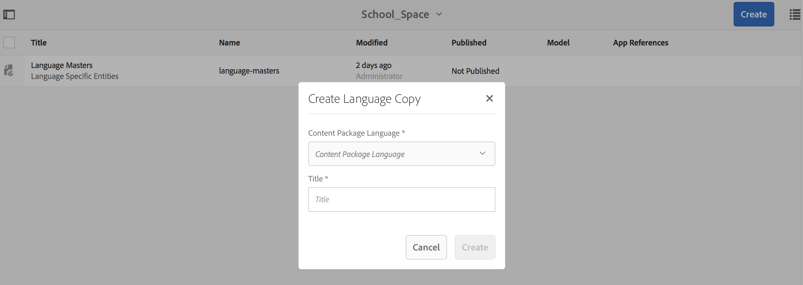

# Platzierungen und Entitäten{#spaces-and-entities}

>[!NOTE]
>
>Adobe empfiehlt die Verwendung des SPA-Editors für Projekte, für die ein Framework-basiertes Client-seitiges Rendering für einzelne Seiten (z. B. React) erforderlich ist. [Weitere Informationen](/help/sites-developing/spa-overview.md)

Ein Leerzeichen ist ein bequemer Speicherort für Entitäten, die über die Content Services REST-API verfügbar gemacht werden. Dies ist besonders nützlich, da eine App (oder ein beliebiger Kanal) vielen Entitäten zugeordnet werden kann. Wenn Entitäten gezwungen werden, sich in einem Leerzeichen zu befinden, wird die Best Practice zur Gruppierung der Anforderungen einer App erzwungen. Optional können Sie eine App in AEM mit einer kleinen Anzahl von Platzierungen verknüpfen.

>[!NOTE]
>
>Um einem Kanal über Content Services etwas zur Verfügung zu stellen, muss er sich in einem Bereich befinden.

## Erstellen eines Leerzeichens {#creating-a-space}

Wenn der Benutzer eine Reihe von Inhalten und Assets für eine mobile App verfügbar machen möchte, erstellt der Benutzer die Platzierung über das AEM Mobile-Dashboard.

Erstmaliger Benutzer, der keine Inhaltsdienste für die Verwendung mit Leerzeichen konfiguriert hat, zeigt das AEM Mobile-Dashboard nach Auswahl von **Content Services**.

>[!CAUTION]
>
>**Voraussetzungen für das Hinzufügen eines Leerzeichens**
>
>Überprüfen Sie die **Aktivieren AEM Content Services** , um mit Spaces zu arbeiten und sie im Dashboard Ihrer AEM Mobile-Anwendung zu aktivieren.
>
>Siehe [Verwalten von Content Services](/help/mobile/developing-content-services.md) für weitere Details.

Nachdem Sie die Leerzeichen im Dashboard konfiguriert haben, führen Sie die folgenden Schritte aus, um Leerzeichen zu erstellen:

1. Auswählen **Leerzeichen** von Content Services aus.

   

1. Auswählen **Erstellen** , um ein Leerzeichen zu erstellen. Eingabe **Titel**, **Name**, und **Beschreibung** für den Bereich.

   Klicken Sie auf **Erstellen**.

   

## Verwalten eines Speicherplatzes {#managing-a-space}

Nachdem Sie ein Leerzeichen erstellt haben, klicken Sie auf die linke Seite, um den Bereich in der Liste zu verwalten.

Sie können die Eigenschaften des Bereichs anzeigen, das Leerzeichen löschen oder den Bereich und dessen Inhalt in einer AEM Veröffentlichungsinstanz veröffentlichen.

**Anzeigen und Bearbeiten von Eigenschaften eines Bereichs**

1. Wählen Sie den Abstand aus der Liste aus
1. Auswählen **Eigenschaften** über die Symbolleiste
1. Klicks **Schließen** wann geschehen

**Veröffentlichen eines Platzes** Wenn ein Leerzeichen veröffentlicht wird, werden auch alle Ordner und Entitäten in diesem Bereich veröffentlicht.

1. Wählen Sie die Platzierung aus, indem Sie in der Liste &quot;Space Console&quot;auf das entsprechende Symbol klicken
1. Auswählen **Veröffentlichungsstruktur**

>[!NOTE]
>
>Sie können **Veröffentlichung rückgängig machen** ein Leerzeichen, das den Speicherplatz aus der Veröffentlichungsinstanz entfernt.
>
>Die folgende Abbildung zeigt die Aktionen, die nach der Veröffentlichung des Platzes ausgeführt werden können.

## Arbeiten mit Ordnern in einem Bereich {#working-with-folders-in-a-space}

Leerzeichen können Ordner enthalten, die die weitere Organisation des Inhalts und der Assets des Raums erleichtern. Benutzer können eine eigene Hierarchie unter einem Bereich erstellen.

### Erstellen eines Ordners {#creating-a-folder}

1. Klicken Sie in der Platzierung in der Platzierungskonsole auf die Platzierung und klicken Sie auf **Ordner erstellen**

   

1. Geben Sie die **Titel**, **Name,** und **Beschreibung** für den Ordner

   

1. Klicks **Erstellen** , um den Ordner in einem Bereich zu erstellen

## Sprachkopie {#language-copy}

>[!CAUTION]
>
>Die Sprachkopie ist für diese Version nicht vollständig funktionsfähig. Es wird nur die Struktur eingerichtet.

Die **Sprachkopie** können Autoren ihre Master-Sprachkopie kopieren und dann ein Projekt und einen Workflow erstellen, um den Inhalt automatisch zu übersetzen. Sprachkopie erstellt die korrekte Struktur. Nachdem Sie einen Ordner in einem Bereich hinzugefügt haben, können Sie dem Bereich Sprachkopie hinzufügen.

>[!NOTE]
>
>Es wird empfohlen, alle Inhalte, die übersetzt werden können, unter dem Knoten Sprachkopie zu platzieren.

### Hinzufügen von Sprachkopien {#adding-language-copy}

1. Nachdem Sie einen Bereich erstellt haben, klicken Sie auf diesen Bereich, um eine Sprachkopie zu erstellen.

   Klicks **Erstellen** und wählen **Sprachkopie**.

   

   >[!NOTE]
   >
   >Sprachkopie-Knoten können nur als direktes untergeordnetes Element des Space vorhanden sein.

1. Auswählen **Content Package Language&amp;ast;** und geben Sie die **Title&amp;ast;** in **Sprachkopie erstellen** angezeigt.

   Klicken Sie auf **Erstellen**.

   

1. Nachdem Sie eine Sprachkopie erstellt haben, wird sie in Ihrem Bereich in **Sprach-Master**.

   

   >[!NOTE]
   >
   >Auswählen **Sprach-Master** , um die Ordner für Sprachkopien anzuzeigen.

### Entfernen eines Ordners aus dem Leerzeichen {#removing-a-folder-from-the-space}

1. Wählen Sie den Ordner aus der Liste der Platzierungsinhalte aus
1. Klicks **Löschen** über die Symbolleiste

   >[!NOTE]
   >
   >Um in einen Ordner zu navigieren und dessen Inhalt anzuzeigen oder einen Unterordner oder eine Entität hinzuzufügen, klicken Sie in der Inhaltsliste der Platzierung auf den Titel des Ordners.

## Arbeiten mit Entitäten in einem Raum {#working-with-entities-in-a-space}

Entitäten stellen Inhalte dar, die über den Webdienst-Endpunkt verfügbar gemacht werden. Entitäten werden in Platzierungen gespeichert, sodass sie leicht zu finden sind und unabhängig von der AEM Repository-Struktur aufbewahrt werden, die ihren zugehörigen Inhalt enthält.

Möglicherweise möchten Sie Entitäten bei einer logischen Zusammenstellung gruppieren. Dazu können Sie eine beliebige Anzahl von Ordnern erstellen.

Wenn Entitätsuntergeordnete Elemente, die andere Entitäten sind, für die Datenmodellierung erfasst werden, kann der Entwickler-Benutzer spezifische &quot;Gruppenmodelle&quot;aus dem Modelltyp &quot;Entitätsgruppe&quot;erstellen, der standardmäßig bereitgestellt wird.

>[!NOTE]
>
>Entitäten sind immer mit einem Leerzeichen verknüpft, sodass der Zugriff auf den Großteil der Entitäts-Benutzeroberfläche über die Leerzeichen-Konsole erfolgt.

### Erstellen einer Entität {#creating-an-entity}

1. Öffnen Sie die Space-Konsole und klicken Sie auf den Titel des Bereichs.

   Optional können Sie zum Ordner navigieren, indem Sie auf den Titel des Ordners in der Liste klicken.

   

1. Wählen Sie das Modell für die Entität aus. Dies ist der Typ der Entität, die Sie erstellen möchten. Klicken Sie auf Weiter.

   

   >[!NOTE]
   >
   >Sie haben die Möglichkeit, die **Asset-Modell**, **Seitenmodell** oder ein Modell des zuvor erstellten Entitätstyps.
   >
   >Siehe [Erstellen eines Modells](/help/mobile/administer-mobile-apps.md), um Ihre benutzerdefinierte Entität zu erstellen.

1. Geben Sie einen **Titel**, **Name**, **Beschreibung**, und **Tags** für die Entität. Klicken Sie auf **Erstellen**.

   

   Sobald Sie fertig sind, wird die Entität in den untergeordneten Elementen Ihres Platzes angezeigt.

### Bearbeiten einer Entität {#editing-an-entity}

1. Nachdem Sie eine Entität erstellt haben, wechseln Sie zu Ihrem Ordner oder Ihrer Platzierung und wählen Sie Ihre Entität in der Space Console aus, um sie zu bearbeiten.

   

1. Wählen Sie eine Entität zur Bearbeitung aus und klicken Sie auf **Bearbeiten**.

   

   >[!CAUTION]
   >
   >Abhängig von der Vorlage, die Sie für die Erstellung Ihrer Entität auswählen, ist die Benutzeroberfläche für die Bearbeitung und Anzeige der Eigenschaften Ihrer Entität unterschiedlich. Weitere Informationen finden Sie in den folgenden Schritten.

   ***Wenn Sie die Vorlage zum Erstellen der Entität als Asset-Modelle auswählen***, indem Sie auf **Bearbeiten** können Sie Assets hinzufügen, wie in der folgenden Abbildung dargestellt:

   

   Alternativ können Sie auf **Vorschau** um den JSON-Link anzuzeigen.

   

   ***Wenn Sie die Vorlage zum Erstellen der Entität als Seitenmodelle auswählen***, indem Sie auf **Bearbeiten** können Sie Assets hinzufügen, wie in der folgenden Abbildung dargestellt:

   

   Klicken Sie auf das Symbol im **Pfad** Hinzufügen eines Assets

   

   >[!NOTE]
   >
   >Nachdem Sie eine Entität hinzugefügt haben, muss sie gespeichert werden, damit der Vorschau-Link funktioniert. Um die Vorschau anzuzeigen, klicken Sie **Speichern**. Klicken Sie auf die **Vorschau** zeigt die JSON-Datei des hinzugefügten Assets, wie in der folgenden Abbildung dargestellt:

   

   >[!NOTE]
   >
   >Wenn Sie der Entität Assets hinzugefügt haben, können Sie entweder **Speichern** speichern oder wählen Sie **Speichern und schließen** , um die Liste der Space Console zu speichern und zur Liste der Entitäten umzuleiten.

   Wählen Sie außerdem eine Entität aus der Liste der Leerzeichen-Konsole aus und klicken Sie auf **Eigenschaften** um die Eigenschaften für eine definierte Entität anzuzeigen und zu bearbeiten.

   

   Sie können den Titel, die Beschreibung und die Tags bearbeiten und die Assets zu Ihrer Entität hinzufügen.

   

### Entfernen einer Entität {#removing-an-entity}

1. Wählen Sie die Entität aus der Liste der Platzierungsinhalte aus

   

1. Klicks **Löschen** aus der Symbolleiste, um die spezifische Entität aus dem Bereich zu entfernen

### Veröffentlichen einer Entität {#publishing-an-entity}

Sie haben die Möglichkeit, **Veröffentlichungsstruktur** oder **Quick Publish** , um Ihre Entität zu veröffentlichen.

1. Wählen Sie eine Entität aus der Liste der Leerzeichen-Konsolen aus und klicken Sie auf &quot;Struktur veröffentlichen&quot;, um diese Entität und ihre untergeordneten Elemente zu veröffentlichen.

   

   **Oder**

   Klicks **Quick Publish** , um diese spezifische Entität zu veröffentlichen.
