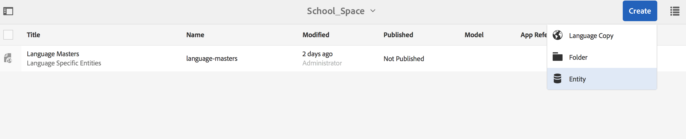

# Platzierungen und Entitäten{#spaces-and-entities}

>[!NOTE]
>
>Adobe empfiehlt die Verwendung des SPA-Editors für Projekte, für die ein frameworkbasiertes clientseitiges Rendering für einzelne Seiten (z. B. React) erforderlich ist. [Weitere Informationen](/help/sites-developing/spa-overview.md)

Ein Leerzeichen ist ein bequemer Speicherort für Entitäten, die über die Content Services REST-API verfügbar gemacht werden. Dies ist besonders nützlich, da eine App (oder ein beliebiger Kanal) vielen Entitäten zugeordnet werden kann. Wenn Entitäten gezwungen werden, sich in einem Leerzeichen zu befinden, wird die Best Practice zur Gruppierung der Anforderungen einer App erzwungen. Optional können Sie eine App in AEM mit einer kleinen Anzahl von Platzierungen verknüpfen.

>[!NOTE]
>
>Um einem Kanal über Content Services etwas zur Verfügung zu stellen, muss er sich in einem Bereich befinden.

## Erstellen eines Leerzeichens {#creating-a-space}

Wenn der Benutzer eine Reihe von Inhalten und Assets für eine mobile App verfügbar machen möchte, erstellt der Benutzer die Platzierung über das AEM Mobile-Dashboard.

Erstmalige Benutzer, die keine Inhaltsdienste für die Verwendung mit Leerzeichen konfiguriert haben, werden im AEM Mobile-Dashboard nur Apps angezeigt, nachdem sie **Content Services** ausgewählt haben.

>[!CAUTION]
>
>**Voraussetzungen für das Hinzufügen eines Leerzeichens**
>
>Markieren Sie **Aktivieren Sie AEM Content Services**, um mit Spaces zu arbeiten und diese im Dashboard Ihrer AEM Mobile-Anwendung zu aktivieren.
>
>Weitere Informationen finden Sie unter [Verwalten von Content Services](/help/mobile/developing-content-services.md) .

Nachdem Sie die Leerzeichen im Dashboard konfiguriert haben, führen Sie die folgenden Schritte aus, um Leerzeichen zu erstellen:

1. Wählen Sie **Leerzeichen** aus Content Services.

   

1. Wählen Sie **Erstellen** aus, um ein Leerzeichen zu erstellen. Geben Sie **Titel**, **Name** und **Beschreibung** für den Bereich ein.

   Klicken Sie auf **Erstellen**.

   

## Verwalten eines Leerzeichens {#managing-a-space}

Klicken Sie nach der Erstellung eines Platzes auf die linke Seite, um den Bereich in der Liste zu verwalten.

Sie können die Eigenschaften des Bereichs anzeigen, das Leerzeichen löschen oder den Bereich und dessen Inhalt in einer AEM Veröffentlichungsinstanz veröffentlichen.

**Anzeigen und Bearbeiten von Eigenschaften eines Bereichs**

1. Wählen Sie die Platzierung aus der Liste aus
1. Wählen Sie **Eigenschaften** aus der Symbolleiste aus.
1. Klicken Sie nach Abschluss auf **Close**

**Veröffentlichen eines** PlatzesWenn ein Leerzeichen veröffentlicht wird, werden auch alle Ordner und Entitäten in diesem Bereich veröffentlicht.

1. Wählen Sie die Platzierung aus, indem Sie in der Liste &quot;Space Console&quot;auf das entsprechende Symbol klicken
1. Wählen Sie **Veröffentlichungsstruktur**

>[!NOTE]
>
>Sie können **Veröffentlichung rückgängig machen** ein Leerzeichen einfügen, wodurch der Speicherplatz aus der Veröffentlichungsinstanz entfernt wird.
>
>Die folgende Abbildung zeigt die Aktionen, die nach der Veröffentlichung des Platzes ausgeführt werden können.

## Arbeiten mit Ordnern in einem Leerzeichen {#working-with-folders-in-a-space}

Leerzeichen können Ordner enthalten, die die weitere Organisation des Inhalts und der Assets des Raums erleichtern. Benutzer können eine eigene Hierarchie unter einem Bereich erstellen.

### Erstellen eines Ordners {#creating-a-folder}

1. Klicken Sie in der Platzierung in der Platzierungskonsole auf das Leerzeichen und klicken Sie auf **Ordner erstellen**.

   

1. Geben Sie den **Titel**, **Name,** und **Beschreibung** für den Ordner ein.

   

1. Klicken Sie auf **Erstellen** , um den Ordner in einem Bereich zu erstellen.

## Sprachkopie {#language-copy}

>[!CAUTION]
>
>Die Sprachkopie ist für diese Version nicht vollständig funktionsfähig. Es wird nur die Struktur eingerichtet.

Mit der Funktion **Sprachkopie** können Autoren ihre Übergeordnete Sprachkopie kopieren und dann ein Projekt und einen Workflow erstellen, um den Inhalt automatisch zu übersetzen. Sprachkopie erstellt die korrekte Struktur. Nachdem Sie einen Ordner in einem Bereich hinzugefügt haben, können Sie dem Bereich Sprachkopie hinzufügen.

>[!NOTE]
>
>Es wird empfohlen, alle Inhalte, die übersetzt werden können, unter dem Knoten Sprachkopie zu platzieren.

### Hinzufügen der Sprachkopie {#adding-language-copy}

1. Nachdem Sie einen Raum erstellt haben, klicken Sie auf diesen Bereich, um eine Sprachkopie zu erstellen.

   Klicken Sie auf **Erstellen** und wählen Sie **Sprachkopie**.

   

   >[!NOTE]
   >
   >Sprachkopie-Knoten können nur als direktes untergeordnetes Element des Space vorhanden sein.

1. Wählen Sie **Content Package Language&amp;ast;** und geben Sie **Title&amp;ast;** im Dialogfeld **Sprachkopie erstellen** ein.

   Klicken Sie auf **Erstellen**.

   

1. Nachdem Sie eine Sprachkopie erstellt haben, wird sie in Ihrem Bereich unter **Sprachmaster** angezeigt.

   

   >[!NOTE]
   >
   >Wählen Sie **Sprach-Master** aus, um die Ordner für die Sprachkopie anzuzeigen.

### Entfernen eines Ordners aus dem Leerzeichen {#removing-a-folder-from-the-space}

1. Wählen Sie den Ordner aus der Liste der Platzierungsinhalte aus
1. Klicken Sie in der Symbolleiste auf **Löschen** .

   >[!NOTE]
   >
   >Um in einen Ordner zu navigieren und dessen Inhalt anzuzeigen oder einen Unterordner oder eine Entität hinzuzufügen, klicken Sie auf den Titel des Ordners in der Inhaltsliste der Platzierung.

## Arbeiten mit Entitäten in einem Leerzeichen {#working-with-entities-in-a-space}

Entitäten stellen Inhalte dar, die über den Webdienst-Endpunkt verfügbar gemacht werden. Entitäten werden in Platzierungen gespeichert, sodass sie leicht zu finden sind und unabhängig von der AEM Repository-Struktur aufbewahrt werden, die ihren zugehörigen Inhalt enthält.

Möglicherweise möchten Sie Entitäten bei einer logischen Zusammenstellung gruppieren. Dazu können Sie eine beliebige Anzahl von Ordnern erstellen.

Wenn Entitätsuntergeordnete Elemente, die andere Entitäten sind, für die Datenmodellierung erfasst werden, kann der Entwickler-Benutzer spezifische &quot;Gruppenmodelle&quot;aus dem Modelltyp &quot;Entitätsgruppe&quot;erstellen, der standardmäßig bereitgestellt wird.

>[!NOTE]
>
>Entitäten sind immer mit einem Leerzeichen verknüpft, sodass der Zugriff auf den Großteil der Entitäts-Benutzeroberfläche über die Raumkonsole erfolgt.

### Erstellen einer Entität {#creating-an-entity}

1. Öffnen Sie die Space-Konsole und klicken Sie auf den Titel des Platzes.

   Optional können Sie zum Ordner navigieren, indem Sie auf den Titel des Ordners in der Liste klicken.

   

1. Wählen Sie das Modell für die Entität aus. Dies ist der Typ der Entität, die Sie erstellen möchten. Klicken Sie auf Weiter.

   

   >[!NOTE]
   >
   >Sie können das **Asset-Modell**, **Seitenmodell** oder ein Modell des zuvor erstellten Entitätstyps auswählen.
   >
   >Informationen zum Erstellen Ihrer benutzerdefinierten Entität finden Sie unter [Erstellen eines Modells](/help/mobile/administer-mobile-apps.md).

1. Geben Sie einen **Titel**, **Name**, **Beschreibung** und **Tags** für die Entität ein. Klicken Sie auf **Erstellen**.

   

   Sobald Sie fertig sind, wird die Entität in den untergeordneten Elementen Ihres Platzes angezeigt.

### Bearbeiten einer Entität {#editing-an-entity}

1. Nachdem Sie eine Entität erstellt haben, wechseln Sie zu Ihrem Ordner oder Ihrer Platzierung und wählen Sie Ihre Entität in der Space Console aus, um sie zu bearbeiten.

   

1. Wählen Sie eine Entität zur Bearbeitung aus und klicken Sie auf **Bearbeiten**.

   

   >[!CAUTION]
   >
   >Abhängig von der Vorlage, die Sie für die Erstellung Ihrer Entität auswählen, ist die Benutzeroberfläche für die Bearbeitung und Anzeige der Eigenschaften Ihrer Entität unterschiedlich. Weitere Informationen finden Sie in den folgenden Schritten.

   ***Wenn Sie die Vorlage zum Erstellen der Entität als Assets-Modelle*** auswählen, können Sie durch Klicken auf  **** Bearbeiten Assets hinzufügen, wie in der folgenden Abbildung dargestellt:

   

   Alternativ können Sie auf **Vorschau** klicken, um den JSON-Link anzuzeigen.

   

   ***Wenn Sie die Vorlage zum Erstellen der Entität als Seitenmodelle*** auswählen, können Sie durch Klicken auf  **** Bearbeiten Assets hinzufügen, wie in der folgenden Abbildung dargestellt:

   

   Klicken Sie auf das Symbol im **Pfad**, um ein Asset hinzuzufügen.

   

   >[!NOTE]
   >
   >Nachdem Sie eine Entität hinzugefügt haben, muss sie gespeichert werden, damit der Vorschau-Link funktioniert. Um die Vorschau anzuzeigen, klicken Sie auf **Speichern**. Wenn Sie auf **Vorschau** klicken, wird der JSON des hinzugefügten Assets angezeigt, wie in der folgenden Abbildung dargestellt:

   

   >[!NOTE]
   >
   >Wenn Sie die Assets zu Ihrer Entität hinzugefügt haben, können Sie entweder **Speichern** auswählen, um die Änderungen zu speichern, oder **Speichern und schließen** auswählen, um zu speichern und zur Liste der Space Console weiterzuleiten, in der die Entitäten definiert sind.

   Wählen Sie außerdem eine Entität aus der Liste der Leerzeichen-Konsolen aus und klicken Sie auf **Eigenschaften** , um die Eigenschaften für eine definierte Entität anzuzeigen und zu bearbeiten.

   

   Sie können den Titel, die Beschreibung und die Tags bearbeiten und die Assets zu Ihrer Entität hinzufügen.

   

### Entfernen einer Entität {#removing-an-entity}

1. Wählen Sie die Entität aus der Liste der Platzierungsinhalte aus

   

1. Klicken Sie in der Symbolleiste auf **Löschen** , um die spezifische Entität aus dem Bereich zu entfernen.

### Veröffentlichen einer Entität {#publishing-an-entity}

Sie können **Veröffentlichungsstruktur** oder **Quick Publish** auswählen, um Ihre Entität zu veröffentlichen.

1. Wählen Sie eine Entität aus der Liste der Leerzeichen-Konsole aus und klicken Sie auf &quot;Struktur veröffentlichen&quot;, um diese Entität und ihre untergeordneten Elemente zu veröffentlichen.

   

   **Oder**

   Klicken Sie auf **Quick Publish** , um die jeweilige Entität zu veröffentlichen.
