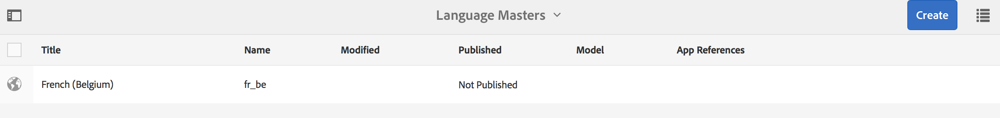

# Leerzeichen und Entitäten{#spaces-and-entities}

{{ue-over-mobile}}

Ein Space ist ein praktischer Speicherort, um Entitäten zu speichern, die über die Content Services-REST-API verfügbar gemacht werden. Dies ist besonders nützlich, da eine App (oder ein beliebiger Kanal) mit vielen Entitäten verknüpft werden kann. Das Erzwingen von Entitäten innerhalb eines Bereichs erzwingt die Best Practice zum Gruppieren der Anforderungen einer App. Optional können Sie eine App in AEM mit einer geringen Anzahl von Leerzeichen verknüpfen.

>[!NOTE]
>
>Um etwas für jeden Kanal von Content Services verfügbar zu machen, muss es sich unter einem Bereich befinden.

## Platzierung erstellen {#creating-a-space}

Wenn der Benutzer einer Mobile App eine Reihe von Inhalten und Assets bereitstellen möchte, erstellt er den Speicherplatz mithilfe des AEM Mobile-Dashboards.

Der Benutzer, der Content Services nicht für die Verwendung mit Platzierungen konfiguriert hat, zeigt im AEM Mobile-Dashboard nach der Auswahl von **Content Services** nur Apps an.

>[!CAUTION]
>
>**Voraussetzungen für das Hinzufügen eines Leerzeichens**
>
>Aktivieren Sie das Kontrollkästchen **AEM Content Services aktivieren**, um mit Leerzeichen zu arbeiten und sie in Ihrem AEM Mobile-Anwendungs-Dashboard zu aktivieren.
>
>Weitere [ finden Sie unter Verwalten ](/help/mobile/developing-content-services.md) Content Services .

Nachdem Sie Leerzeichen im Dashboard konfiguriert haben, führen Sie die folgenden Schritte aus, um Leerzeichen zu erstellen:

1. Wählen Sie **Leerzeichen** aus Content Services aus.

   

1. Wählen Sie **Erstellen**, um einen Raum zu erstellen. Geben Sie **Titel**, **Name** und **Beschreibung** für das Feld ein.

   Klicken Sie auf **Erstellen**.

   

## Platzierung verwalten {#managing-a-space}

Nachdem Sie eine Platzierung erstellt haben, klicken Sie auf die linke Seite, um die Platzierung in der Liste zu verwalten.

Sie können Eigenschaften des Bereichs anzeigen, den Bereich löschen oder den Bereich und seine Inhalte in einer AEM-Veröffentlichungsinstanz veröffentlichen.

**Anzeigen und Bearbeiten der Eigenschaften einer Platzierung**

1. Wählen Sie die Platzierung aus der Liste aus
1. Wählen Sie **Eigenschaften** in der Symbolleiste aus.
1. Klicken Sie abschließend **Schließen**

**Platzierung veröffentlichen** Wenn eine Platzierung veröffentlicht wird, werden alle Ordner und Entitäten in dieser Platzierung ebenfalls veröffentlicht.

1. Wählen Sie eine Platzierung aus, indem Sie in der Liste „Space Console“ auf das entsprechende Symbol klicken
1. **Publish-Baumstruktur auswählen**

>[!NOTE]
>
>Sie können **Veröffentlichung** Space aufheben, wodurch der Space aus der Veröffentlichungsinstanz entfernt wird.
>
>Die folgende Abbildung zeigt die Aktionen, die nach der Veröffentlichung des Bereichs ausgeführt werden können.

## Arbeiten mit Ordnern in einem Space {#working-with-folders-in-a-space}

Räume können Ordner enthalten, um die Inhalte und Assets des Raums weiter zu organisieren. Benutzer können unter einem Bereich ihre eigene Hierarchie erstellen.

### Erstellen eines Ordners {#creating-a-folder}

1. Klicken Sie in der Space-Konsole auf den Bereich in der Liste und dann auf **Ordner erstellen**

   

1. Geben Sie **Titel**, **Name,** und **Beschreibung** für den Ordner ein

   

1. Klicken Sie **Erstellen**, um den Ordner in einem Bereich zu erstellen

## Sprachkopie {#language-copy}

>[!CAUTION]
>
>Die Sprachkopie ist für diese Version nicht voll funktionsfähig. Es wird nur die Struktur eingerichtet.

Mit **Funktion „Sprachkopie** können Autoren ihre primäre Sprachkopie kopieren und dann ein Projekt und einen Workflow erstellen, um den Inhalt automatisch zu übersetzen. Sprachkopie erstellt die richtige Struktur. Nachdem Sie einen Ordner in einem Bereich hinzugefügt haben, können Sie eine Sprachkopie zu Ihrem Bereich hinzufügen.

>[!NOTE]
>
>Es wird empfohlen, alle Inhalte, die übersetzt werden könnten, unter dem Knoten Sprachkopie abzulegen.

### Sprachkopie hinzufügen {#adding-language-copy}

1. Klicken Sie nach der Erstellung eines Bereichs auf diesen Bereich, um eine Sprachkopie zu erstellen.

   Klicken Sie **Erstellen** und wählen Sie **Sprachkopie**.

   

   >[!NOTE]
   >
   >Sprachkopie-Knoten können nur als direkt untergeordnetes Element des Bereichs vorhanden sein.

1. Wählen Sie **Inhaltspaket-Sprache&amp;ast;** aus und geben Sie den **Titel&amp;ast;** im Dialogfeld **Sprachkopie erstellen** ein.

   Klicken Sie auf **Erstellen**.

   

1. Nachdem Sie eine Sprachkopie erstellt haben, wird sie in Ihrem Bereich in &quot;**&quot;**.

   

   >[!NOTE]
   >
   >Wählen Sie **Sprachstämme**, um die Sprachkopieordner anzuzeigen.

### Entfernen eines Ordners aus der Platzierung {#removing-a-folder-from-the-space}

1. Wählen Sie den Ordner aus der Liste der Platzierungsinhalte aus
1. Klicken Sie **der** auf „Löschen“

   >[!NOTE]
   >
   >Um in einen Ordner zu navigieren und dessen Inhalt anzuzeigen oder einen Unterordner oder eine Entität hinzuzufügen, klicken Sie auf den Titel des Ordners in der Inhaltsliste des Bereichs.

## Arbeiten mit Entitäten in einem Raum {#working-with-entities-in-a-space}

Entitäten stellen Inhalte dar, die über den Webservice-Endpunkt verfügbar gemacht werden. Entitäten werden in Platzierungen gespeichert, sodass die einfach zu finden sind und unabhängig von der AEM-Repository-Struktur mit den zugehörigen Inhalten aufbewahrt werden.

Sie können Entitäten in einer logischen Zusammenkunft gruppieren. Dazu können Sie eine beliebige Anzahl von Ordnern erstellen.

Wenn untergeordnete Entitätselemente, d. h. andere Entitäten, für die Datenmodellierung erfasst werden, kann der Entwicklerbenutzer aus dem vorkonfigurierten Modelltyp „Entitätsgruppe“ spezifische „Gruppenmodelle“ erstellen.

>[!NOTE]
>
>Entitäten sind immer mit einer Platzierung verknüpft, sodass der Zugriff auf den Großteil der Entitätenbenutzeroberfläche über die Platzierungskonsole erfolgt.

### Entität erstellen {#creating-an-entity}

1. Öffnen Sie die Space -Konsole und klicken Sie auf den Titel des Bereichs.

   Optional können Sie zum Ordner navigieren, indem Sie auf den Titel des Ordners in der Liste klicken.

   

1. Wählen Sie das Modell für die Entität aus. Dies ist der Typ der Entität, die Sie erstellen möchten. Klicken Sie auf Weiter.

   

   >[!NOTE]
   >
   >Sie haben die Möglichkeit, das **Assets-Modell**, **Seitenmodell** oder ein Modell des zuvor erstellten Entitätstyps auszuwählen.
   >
   >Siehe [Erstellen eines Modells](/help/mobile/administer-mobile-apps.md), um Ihre benutzerdefinierte Entität zu erstellen.

1. Geben Sie **Entität** Titel, **Name**, **Beschreibung** und **Tags** ein. Klicken Sie auf **Erstellen**.

   

   Sobald Sie fertig sind, wird die Entität in den untergeordneten Elementen Ihres Bereichs angezeigt.

### Entität bearbeiten {#editing-an-entity}

1. Nachdem Sie eine Entität erstellt haben, wechseln Sie zu Ihrem Ordner oder Speicherplatz und wählen Sie Ihre Entität in der Space-Konsole aus, um sie zu bearbeiten.

   

1. Wählen Sie eine Entität zur Bearbeitung aus und klicken Sie auf **Bearbeiten**.

   

   >[!CAUTION]
   >
   >Je nach der Vorlage, die Sie zum Erstellen Ihrer Entität ausgewählt haben, unterscheidet sich die Benutzeroberfläche sowohl für die Bearbeitung als auch für die Anzeige der Eigenschaften Ihrer Entität. Führen Sie die folgenden Schritte aus, um mehr zu erfahren.

   ***Wenn Sie die Vorlage zum Erstellen der Entität als Assets-Modelle auswählen*** können Sie durch Klicken auf **Bearbeiten** Assets hinzufügen, wie in der folgenden Abbildung dargestellt:

   

   Alternativ können Sie auf **Vorschau** klicken, um den JSON-Link anzuzeigen.

   

   ***Wenn Sie die Vorlage zum Erstellen der Entität als Seitenmodelle auswählen*** können Sie durch Klicken auf **Bearbeiten** Assets hinzufügen, wie in der folgenden Abbildung dargestellt:

   

   Klicken Sie auf das Symbol im **Pfad**, um ein Asset hinzuzufügen

   

   >[!NOTE]
   >
   >Nachdem Sie eine Entität hinzugefügt haben, muss sie gespeichert werden, damit der Vorschau-Link funktioniert. Um die Vorschau anzuzeigen, klicken Sie auf **Speichern**. Wenn Sie auf **Vorschau** klicken, wird die JSON des hinzugefügten Assets angezeigt, wie in der folgenden Abbildung dargestellt:

   

   >[!NOTE]
   >
   >Wenn Sie alle Assets zu Ihrer Entität hinzugefügt haben, können Sie entweder **Speichern** wählen, um die Änderungen zu speichern, oder **Speichern und schließen** wählen, um zu speichern und zur Liste „Space-Konsole“ umzuleiten, in der die Entitäten definiert sind.

   Wählen Sie außerdem eine Entität in der Liste „Space Console“ aus und klicken Sie auf **Eigenschaften**, um die Eigenschaften für eine definierte Entität anzuzeigen und zu bearbeiten.

   

   Sie können den Titel, die Beschreibung und Tags bearbeiten und die Assets zu Ihrer Entität hinzufügen.

   

### Entfernen einer Entität {#removing-an-entity}

1. Wählen Sie die Entität in der Liste des Platzierungsinhalts aus

   

1. Klicken Sie **der** auf „Löschen“, um die spezifische Entität aus dem Bereich zu entfernen

### Entität veröffentlichen {#publishing-an-entity}

Sie haben die Möglichkeit, **Publish Tree** oder **Quick Publish** auszuwählen, um Ihre Entität zu veröffentlichen.

1. Wählen Sie eine Entität in der Liste „Space Console“ aus und klicken Sie auf **Publish Tree**, um diese Entität und ihre untergeordneten Elemente zu veröffentlichen.

   

   **Oder**

   Klicken Sie **Quick Publish**, um diese spezifische Entität zu veröffentlichen.
