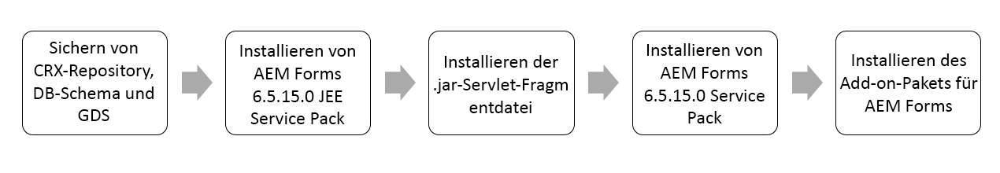
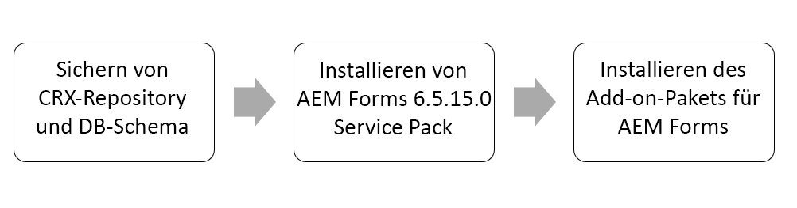

# Installationsanweisungen für das Forms Service Pack AEM 6.5 {#aem-form-patch-installation-instructions}

## Versionsinformationen

| Produkt | Adobe Experience Manager 6.5 Forms |
|---|---|
| Version | 6.5.15.0 |
| Typ | Service Pack-Version |
| Datum | 01. Dezember 2022 |

## Was ist in Experience Manager Forms 6.5.15.0 enthalten?

Das Adobe Experience Manager (AEM) Forms Service Pack enthält neue und aktualisierte Funktionen, wie wichtige von Kunden angeforderte Verbesserungen, Leistungs-, Stabilitäts- und Sicherheitsverbesserungen. AEM Forms veröffentlicht regelmäßig Service Packs, um die neuesten Funktionen und Verbesserungen bereitzustellen. Wählen Sie je nach Stapel einen der folgenden Pfade zum Herunterladen und Installieren des Service Packs in Ihrer Umgebung aus:

* [Herunterladen und Installieren des Service Packs in einer AEM Forms on JEE-Umgebung](#download-and-install-for-jee-service-pack)
* [Herunterladen und Installieren des Service Packs auf einer AEM Forms-OSGi-Umgebung](#download-and-install-for-osgi-service-pack)

>[!NOTE]
>
> Adobe gibt nach jedem 6. Service Pack ein vollständiges Installationsprogramm heraus. AEM 6.5 Forms Service Pack 12 (6.5.12.0) auf JEE ist das letzte vollständige Installationsprogramm. Das vollständige Installationsprogramm unterstützt neue Plattformen, während das Installationsprogramm für reguläre Service-Pakete nur Fehlerbehebungen und allgemeine Verbesserungen enthält. Wenn Sie eine Neuinstallation durchführen oder planen, die neueste Software für Ihre AEM 6.5 Forms on JEE-Umgebung zu verwenden, empfiehlt Adobe die Verwendung des am 3. März 2022 veröffentlichten Forms on JEEfull-Installationsprogramms für AEM 6.5.12.0 anstelle des am 08. April 2019 veröffentlichten 6.5 Forms-Installationsprogramms. Nachdem Sie das vollständige Installationsprogramm verwendet haben, installieren Sie das neueste Service Pack.

## Herunterladen und Installieren des Service Packs in einer AEM Forms on JEE-Umgebung {#download-and-install-for-jee-service-pack}

+++1. Erstellen Sie eine Sicherungskopie Ihrer bestehenden Umgebung:

1. Sichern Sie Ihre [CRX-Repository, Datenbankschema und GDS (Globaler Dokumentenspeicher)](https://experienceleague.adobe.com/docs/experience-manager-65/forms/administrator-help/aem-forms-backup-recovery/backing-aem-forms-data.html).
1. Sichern Sie das &lt;*AEM_forms_root* Ordner >/deploy . Dies ist erforderlich, wenn Sie das Service Pack deinstallieren.

+++

+++2.Laden Sie die erforderliche Software herunter:

* AEM Forms on JEE 6.5.15.0 Service Pack
* AEM 6.5.15.0 Service Pack 
* Forms-Add-on-Paket
* Bundle
* Fragmente

+++

+++3. Installieren Sie das AEM Forms on JEE Service Pack:

1. Stoppen Sie den Programm-Server.
1. Extrahieren Sie die **AEM Forms on JEE 6.5.15.0 Service Pack-Installationsprogramm** auf Ihrer Festplatte:

   * **Windows**
Navigieren Sie zum entsprechenden Ordner auf dem Installationsdatenträger oder dem Ordner auf der Festplatte, in den Sie das Installationsprogramm kopiert haben, und doppelklicken Sie auf die 
`aemforms65_cfp_install.exe` file.

      * (Windows 32-Bit) `Windows\Disk1\InstData\VM`
      * (Windows 64-Bit) `Windows_64Bit`\ `Disk1\InstData\VM`
   * **Linux**
Navigieren Sie zum entsprechenden Verzeichnis, von einer Shell aus und geben Sie 
`./aem65_cfp_install.bin`.

      * (Linux) `Linux/Disk1/InstData/NoVM`

   Hierdurch wird das Installieren des Assistenten gestartet, der Sie durch die Installation führt.

1. Klicken Sie im Begrüßungsbildschirm auf **[!UICONTROL Weiter]**.
1. Im **Installationsordner auswählen** überprüfen Sie, ob der angezeigte Standardspeicherort für Ihre bestehende Installation richtig ist, oder klicken Sie auf **[!UICONTROL Durchsuchen]** zum Auswählen des alternativen Ordners, in dem AEM Formulare installiert sind, und klicken Sie auf **[!UICONTROL Nächste]**.
1. Lesen Sie die Service Pack-Zusammenfassungsinformationen und klicken Sie auf **[!UICONTROL Nächste]**.
1. Lesen Sie die Informationen zur „Zusammenfassung vor der Installation“ und klicken Sie auf **[!UICONTROL Installieren]**.
1. Wenn die Installation abgeschlossen ist, klicken Sie auf **[!UICONTROL Weiter]**, um die Schnellkorrektur-Updates auf Ihre installierten Dateien anzuwenden.
1. **[Nur für Windows]:** Führen Sie einen der folgenden Schritte aus:

   * Deaktivieren Sie entweder die **Configuration Manager starten** Option vor dem Klicken **[!UICONTROL Fertig]**. Ausführen **Configuration Manager** durch Verwendung von **ConfigurationManager.bat** Datei in `[aem-forms root]\configurationManager\bin`.

   * Oder deaktivieren Sie die **Configuration Manager starten** Option vor dem Klicken **[!UICONTROL Fertig]**. Vor der Ausführung **Configuration Manager** using **ConfigurationManager.exe** oder **ConfigurationManager_IPv6.exe**, navigieren Sie zu *`<AEMForms_Install_Dir>\configurationManager\bin`* Verzeichnis und ersetzen [ConfigurationManager.lax](/help/assets/ConfigurationManager.lax) und [ConfigurationManager_IPV6.lax](/help/assets/ConfigurationManager_IPv6.lax) Dateien.

      >[!NOTE]
      >
      > Verwenden der **ConfigurationManager.bat** hilft Ihnen dabei, die Namensänderung von .lax-Dateien manuell zu vermeiden.

1. **[Nur für Unix-basierte]:** Die **Configuration Manager starten** ist standardmäßig aktiviert. Klicken **[!UICONTROL Fertig]** , um Configuration Manager sofort auszuführen oder **Configuration Manager** Heben Sie später die Auswahl der **Configuration Manager starten** Option vor dem Klicken **[!UICONTROL Fertig]**. Sie können **Configuration Manager** später mithilfe des entsprechenden Skripts in der `[AEM_forms_root]/configurationManager/bin` Verzeichnis.

1. Wählen Sie je nach Anwendungsserver eines der folgenden Dokumente aus und befolgen Sie die Anweisungen im Bereich *Konfigurieren und Bereitstellen von AEM Forms*.

   * [Installieren und Bereitstellen von AEM Forms für JBoss](https://www.adobe.com/go/learn_aemforms_installJBoss_65_de) 
   * [Installieren und Bereitstellen von AEM Forms für WebSphere](https://www.adobe.com/go/learn_aemforms_installWebSphere_65_de)
   * [Installieren und Bereitstellen von AEM Forms für WebLogic](https://www.adobe.com/go/learn_aemforms_installWebLogic_65_de)

+++

+++4. Servlet-Fragment installieren

Die Installation ist obligatorisch. **Servlet-Fragment** für alle Anwendungsserver außer den Servern, die mit JBoss EAP 7.4.0 ausgeführt werden. So laden Sie das Servlet-Fragment herunter und installieren es:

1. Wenn Sie das Fragment nicht heruntergeladen haben, laden Sie es von herunter [Softwareverteilung](https://experience.adobe.com/#/downloads/content/software-distribution/en/aem.html?package=/content/software-distribution/en/details.html/content/dam/aem/public/adobe/packages/cq650/featurepack/org.apache.felix.http.servlet-api-1.2.0_fragment_full.jar)

1. Starten Sie den Anwendungsserver, warten Sie, bis sich die Protokolle stabilisieren, und überprüfen Sie den Bundle-Status.

1. Öffnen Sie Webkonsole-Bundles. Die Standardeinstellung ist `http://[Server]:[Port]/system/console/bundles`.

1. Klicken Sie auf Installieren/Aktualisieren. Wählen Sie das heruntergeladene Fragment org.apache.felix.http.servlet-api-1.2.0_fragment_full.jar aus. Klicken Sie auf Installieren oder Aktualisieren. Warten Sie, bis sich der Anwendungsserver stabilisiert hat

1. Beenden Sie den Anwendungsserver.

+++

+++5. Installieren Sie AEM Service Pack

1. Starten Sie die Instanz vor der Installation neu, wenn sich die Instanz im Update-Modus befindet (wenn die Instanz von einer früheren Version aktualisiert wurde). Adobe empfiehlt einen Neustart, wenn die aktuelle Betriebszeit für eine Instanz hoch ist.
1. Erstellen Sie vor der Installation eine Momentaufnahme oder ein neues Backup Ihrer [!DNL Experience Manager]-Instanz.
1. Laden Sie das Service Pack von [Software Distribution](https://experience.adobe.com/#/downloads/content/software-distribution/en/aem.html?package=/content/software-distribution/en/details.html/content/dam/aem/public/adobe/packages/cq650/servicepack/aem-service-pkg-6.5.15.0.zip) herunter. <!-- UPDATE FOR EACH NEW RELEASE -->
1. Öffnen Sie Package Manager und wählen Sie **[!UICONTROL Paket hochladen]** , um das Paket hochzuladen. Weitere Informationen finden Sie unter [Package Manager](/help/sites-administering/package-manager.md).
1. Wählen Sie das Paket aus und klicken Sie auf **[!UICONTROL Installieren]**.
1. Um den S3-Connector zu aktualisieren, stoppen Sie die Instanz nach der Installation des Service Packs, ersetzen Sie den vorhandenen Connector durch eine neue Binärdatei, die im Installationsordner bereitgestellt wird, und starten Sie die Instanz neu. Weitere Informationen finden Sie unter [Amazon S3-Datenspeicher](/help/sites-deploying/data-store-config.md#upgrading-to-a-new-version-of-the-s-connector).

**Automatische Installation**

Es gibt zwei verschiedene Methoden, mit denen Sie [!DNL ExperienceManager] 6.5.15.0 automatisch installieren können.<!--       UPDATE FOR EACH NEW RELEASE -->

* Platzieren Sie das Paket in `../crx-quickstart/install` Ordner, wenn der Server online verfügbar ist.
Das Paket wird automatisch installiert.

* Verwenden Sie die [HTTP-API von Package Manager](/help/sites-administering/package-manager.md#package-share). Verwendung     `cmd=install&recursive=true` damit die verschachtelten Pakete installiert werden.

   >[!NOTE]
   >
   >Experience Manager 6.5.15.0 unterstützt keine Bootstrap-Installation. <!-- UPDATE FOR EACHNEW RELEASE -->

**Validierung der Installation**

Informationen zu den Plattformen, die für diese Version zertifiziert sind, finden Sie in der [technische Anforderungen](/help/sites-deploying/technical-requirements.md).

1. Die Seite mit den Produktinformationen (`/system/console/productinfo`) zeigt die aktualisierte Versionszeichenfolge an. `Adobe Experience      Manager (6.5.15.0)` under [!UICONTROL Installierte Produkte].<!-- UPDATE FOR EACH NEW RELEASE -->
1. Alle OSGi-Bundles sind entweder **[!UICONTROL AKTIV]** oder **[!UICONTROL FRAGMENT]** in der OSGi-Konsole (Webkonsole verwenden: `/system/console/bundles`).
1. Das OSGi-Bundle `org.apache.jackrabbit.oak-core` ist Version 1.22.13 oder höher (WebConsole verwenden: `/system/console/     bundles`).

+++

+++6. Installieren AEM Experience Manager Forms-Add-On-Paket

1. Stellen Sie sicher, dass Sie die [!DNL Experience Manager] Service Pack.
1. Wählen Sie unter den aufgeführten [AEM Forms-Versionen](https://experienceleague.adobe.com/docs/experience-manager-release-information/aem-release-updates/forms-updates/aem-forms-releases.html?lang=de) das für Ihr Betriebssystem passende Forms-Add-on-Paket aus und laden Sie es herunter.
1. Installieren Sie das Forms-Add-on-Paket wie unter [Installieren des AEM Forms-Add-on-Pakets](/help/forms/using/installing-configuring-aem-forms-osgi.md#install-aem-forms-add-on-package) beschrieben.
1. Wenn Sie Briefe in Experience Manager 6.5 Forms verwenden, installieren Sie die [neuestes AEMFDC-Kompatibilitätspaket](https://experienceleague.adobe.com/docs/experience-manager-release-information/aem-release-updates/forms-updates/aem-forms-releases.html?lang=de).

+++

<!-- 1. (JBoss only) After installing the patch and configuring the server, delete  tmp  and work directories of JBoss application server.

>[!IMPORTANT]
>
>Before installing [AEM 6.5.15.0 service pack](#install-the-aem-service-pack-install-aem-service-pack), for all the AEM Forms on JEE environments using any application servers other than JBoss EAP 7.4.0: 
> * Install  the [org.apache.felix.http.servlet-api-1.2.0_fragment-full.jar](https://experience.adobe.com/#/downloads/content/software-distribution/en/aem.html?package=/content/software-distribution/en/details.html/content/dam/aem/public/adobe/packages/cq650/featurepack/org.apache.felix.http.servlet-api-1.2.0_fragment_full.jar) servlet fragment and wait for the application server to stabilize.
>* If you install the latest [AEM service pack (6.5.15.0)](#install-the-aem-service-pack-install-aem-service-pack), prior to the fragment servlet `org.apache.felix.http.servlet-api-1.2.0_fragment-full.jar` on JEE environment, the CRX/bundle and the start page show service unavailable errors, [click here](/help/forms/using/aem-service-pack-installation-solution.md) to know the troubleshooting steps. 

### !-->

## Herunterladen und Installieren des Service Packs auf einer AEM Forms-OSGi-Umgebung {#download-and-install-for-osgi-service-pack}

+++1. Erstellen Sie eine Sicherungskopie Ihrer bestehenden Umgebung:

1. Sichern Sie Ihre [CRX-Repository und Datenbankschema](https://experienceleague.adobe.com/docs/experience-manager-65/forms/administrator-help/aem-forms-backup-recovery/backing-aem-forms-data.html).

>[!NOTE]
>
> Wenn Sie das AEM Forms Service Pack für eine relationale Datenbank installieren, ist es erforderlich, eine Sicherung des DB_schema durchzuführen.

+++

+++2.Laden Sie die erforderliche Software herunter:

* [AEM 6.5.15.0 Service Pack ](https://experience.adobe.com/#/downloads/content/software-distribution/en/aem.html?package=/content/software-distribution/en/details.html/content/dam/aem/public/adobe/packages/cq650/servicepack/aem-service-pkg-6.5.15.0.zip)
* [Forms-Add-on-Paket](/help/forms/using/installing-configuring-aem-forms-osgi.md#install-aem-forms-add-on-package)

+++

+++3. Installieren Sie AEM Service Pack

1. Starten Sie die Instanz vor der Installation neu, wenn sich die Instanz im Update-Modus befindet (wenn die Instanz von einer früheren Version aktualisiert wurde). Adobe empfiehlt einen Neustart, wenn die aktuelle Betriebszeit für eine Instanz hoch ist.
1. Erstellen Sie vor der Installation eine Momentaufnahme oder ein neues Backup Ihrer [!DNL Experience Manager]-Instanz.
1. Laden Sie das Service Pack von [Software Distribution](https://experience.adobe.com/#/downloads/content/software-distribution/en/aem.html?package=/content/software-distribution/en/details.html/content/dam/aem/public/adobe/packages/cq650/servicepack/aem-service-pkg-6.5.15.0.zip) herunter. <!-- UPDATE FOR EACH NEW RELEASE -->
1. Öffnen Sie Package Manager und wählen Sie **[!UICONTROL Paket hochladen]** , um das Paket hochzuladen. Weitere Informationen finden Sie unter [Package Manager](/help/sites-administering/package-manager.md).
1. Wählen Sie das Paket aus und klicken Sie auf **[!UICONTROL Installieren]**.
1. Um den S3-Connector zu aktualisieren, stoppen Sie die Instanz nach der Installation des Service Packs, ersetzen Sie den vorhandenen Connector durch eine neue Binärdatei, die im Installationsordner bereitgestellt wird, und starten Sie die Instanz neu. Weitere Informationen finden Sie unter [Amazon S3-Datenspeicher](/help/sites-deploying/data-store-config.md#upgrading-to-a-new-version-of-the-s-connector).

**Automatische Installation**

Es gibt zwei verschiedene Methoden, mit denen Sie [!DNL Experience Manager] 6.5.15.0 automatisch installieren können.<!--       UPDATE FOR EACH NEW RELEASE -->

* Platzieren Sie das Paket in den Ordner `../crx-quickstart/install`, wenn der Server online verfügbar ist. Das Paket wird automatisch installiert.
* Verwenden Sie die [HTTP-API von Package Manager](/help/sites-administering/package-manager.md#package-share). Verwenden Sie `cmd=install&recursive=true`, damit die verschachtelten Pakete installiert werden.

   >[!NOTE]
   >
   >Experience Manager 6.5.15.0 unterstützt keine Bootstrap-Installation. <!-- UPDATE FOR EACH NEW RELEASE -->

**Validierung der Installation**

Informationen zu den Plattformen, die für diese Version zertifiziert sind, finden Sie in den [technischen Anforderungen](/help/sites-deploying/technical-requirements.md).

1. Die Seite mit den Produktinformationen (`/system/console/productinfo`) zeigt die aktualisierte Versionszeichenfolge `Adobe Experience      Manager (6.5.15.0)` unter [!UICONTROL Installierte Produkte] an. <!-- UPDATE FOR EACH NEW RELEASE -->

1. Alle OSGi-Bundles sind in der OSGi-Konsole entweder **[!UICONTROL AKTIV]** oder **[!UICONTROL FRAGMENT]** (Zu verwendende Web-Konsole: `/system/console/bundles`).

   1. Das OSGi-Paket `org.apache.jackrabbit.oak-core` ist Version 1.22.13 oder höher (Zu verwendende Webkonsole: `/system/console/bundles`).

+++

+++4. Installieren AEM Experience Manager Forms-Add-On-Paket

1. Stellen Sie sicher, dass Sie die [!DNL Experience Manager] Service Pack.
1. Wählen Sie unter den aufgeführten [AEM Forms-Versionen](https://experienceleague.adobe.com/docs/experience-manager-release-information/aem-release-updates/forms-updates/aem-forms-releases.html?lang=de) das für Ihr Betriebssystem passende Forms-Add-on-Paket aus und laden Sie es herunter.
1. Installieren Sie das Forms-Add-on-Paket wie unter [Installieren des AEM Forms-Add-on-Pakets](/help/forms/using/installing-configuring-aem-forms-osgi.md#install-aem-forms-add-on-package-install-aem-forms-add-on-package) beschrieben.
1. Wenn Sie in Experience Manager 6.5 Forms Briefe verwenden, installieren Sie das [neueste AEMFD-Kompatibilitätspaket](https://experienceleague.adobe.com/docs/experience-manager-release-information/aem-release-updates/forms-updates/aem-forms-releases.html?lang=de).

+++

## Fehlerbehebung

* Wenn **Dialogfeld &quot;Package Manager UI&quot;** während der Installation des Service Packs beendet wird, warten Sie, bis sich die Fehlerprotokolle stabilisieren, bevor Sie auf die Bereitstellung zugreifen. Warten Sie auf die spezifischen Protokolle im Zusammenhang mit der Deinstallation des Aktualisierungs-Bundles, bevor Sie sicherstellen, dass die Installationen erfolgreich sind. In der Regel tritt dieses Problem im Safari-Browser auf, kann aber gelegentlich auch in jedem Browser auftreten.

* Überprüfen Sie die Überwachungsprotokolle (error.log), sobald die Installation für eine Aktivität abgeschlossen ist. Warten Sie einige Minuten, bis keine Aktivität in den Protokollen vorhanden ist. Starten Sie die AEM-Instanz neu.

* Bei Auftreten von **Dienst nicht verfügbar** nach der Installation des neuesten AEM Forms 6.5.15.0 Service Packs, [Hier klicken](/help/forms/using/aem-service-pack-installation-solution.md) um die Schritte zur Fehlerbehebung anzuzeigen.
