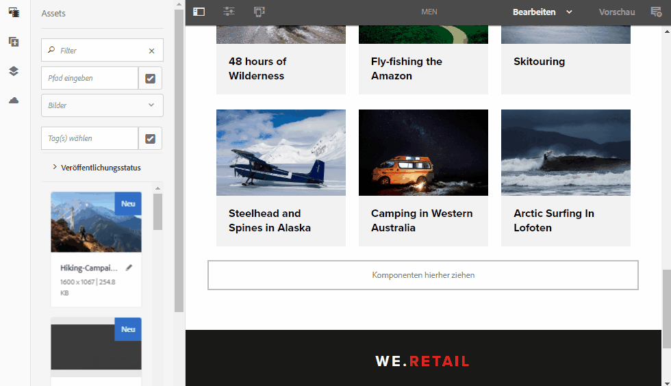

# AEM Assets Versionshinweise{#aem-assets-release-notes}

Im Folgenden werden die wichtigsten Funktionen und Highlights von AEM 6.5 Assets aufgeführt.

## Integration in Adobe Creative Cloud und kreative Workflows {#integration-with-adobe-creative-cloud-and-creative-workflows}

AEM bietet verschiedene Möglichkeiten, um Adobe Creative Cloud zu integrieren und Assets für die Verwendung in Workflows freizugeben, in denen Kreativ-, Marketing- oder Businessteams eng zusammenarbeiten. AEM 6.5 ermöglicht eine noch bessere Integration und stärkere Optimierung. Das Ergebnis: mehr Chancen und die Verbesserung vorhandener Methoden.

Im Folgenden werden die spezifischen Funktionen und Integrationsmöglichkeiten von AEM 6.5 beschrieben, mit denen Sie Ihre Content-Velocity-Nutzungsszenarien optimal unterstützen können.

### Adobe Asset Link {#aal}

Adobe Asset Link stärkt die Zusammenarbeit zwischen Kreativen und Marketern bei der Inhaltserstellung. Kreative können auf Inhalte zugreifen, die in Adobe Experience Manager Assets (AEM Assets) gespeichert sind, ohne die ihnen besonders vertrauten Apps verlassen zu müssen. Kreative können mit dem In-App-Bedienfeld in Photoshop, Illustrator und InDesign Assets nahtlos (durch) suchen sowie ein- und auschecken.

Adobe Asset Link ist Teil des [Creative Cloud-Angebots für Unternehmen](https://www.adobe.com/creativecloud/business/enterprise.html). Weitere Informationen, einschließlich der erforderlichen Konfiguration für Ihre AEM-Bereitstellung, finden Sie unter [Adobe Asset Link](https://helpx.adobe.com/enterprise/using/adobe-asset-link.html). 

### Adobe Stock-Integration {#stock}

Ihr Unternehmen kann seinen Adobe Stock-Unternehmensplan in AEM Assets verwenden, um sicherzustellen, dass lizenzierte Assets für Ihre Kreativ- und Marketingprojekte allgemein verfügbar sind. Mit den leistungsstarken DAM-Funktionen von AEM können Sie schnell nach Adobe Stock-Assets suchen und diese im Nu in einer Vorschau anzeigen sowie lizenzieren.

Der Adobe Stock-Service bietet Designern und Unternehmen Zugang zu Millionen von hochwertigen, kuratierten und gebührenfreien Fotos, Vektorgrafiken, Illustrationen, Videos, Vorlagen und 3D-Assets für sämtliche Kreativprojekte.

Weitere Informationen finden Sie unter [Adobe Stock-Assets in AEM Assets verwenden](/help/assets/aem-assets-adobe-stock.md).

Vorschau von Adobe Stock-Bildern und Lizenzierung in AEM Assets

Durchsuchen und Filtern der lizenzierten Adobe Stock-Bilder in AEM

### Dynamic references in Adobe InDesign {#dynamic-references-in-indesign}

Die in Adobe InDesign verwendeten AEM-Assets sind dynamisch. Die Verweise werden automatisch aktualisiert, wenn die referenzierten Assets in die JCR-Hierarchie verschoben werden. Weitere Informationen finden Sie unter [Verwalten von ebenenübergreifenden Assets](/help/assets/managing-linked-subassets.md).

## Brand Portal-Funktionen {#brand-portal-capabilities}

Mit AEM Assets Brand Portal können Sie problemlos genehmigte Assets abrufen, diese wirksam kontrollieren und sicher und geräteübergreifend an externe Anbieter/Agenturen und interne Geschäftsanwender verteilen. Brand Portal ermöglicht eine effizientere Asset-Freigabe sowie schnellere Time-to-Market für Assets und verringert das Risiko von Nicht-Compliance und unbefugtem Zugriff.

Weitere Informationen finden Sie unter [Neue Funktionen in AEM Assets Brand Portal](https://helpx.adobe.com/experience-manager/brand-portal/using/whats-new.html).

## Connected Assets {#connectedassets}

In großen Unternehmen kann die zur Erstellung von Websites erforderliche Infrastruktur verteilt werden. Manchmal befinden sich die Funktionen zur Website-Erstellung und die hierfür benötigten digitalen Assets in unterschiedlichen Silos.

AEM Sites bietet Funktionen zum Erstellen von Webseiten, während AEM Assets das Digital Asset Management (DAM)-System ist, das die für Websites erforderlichen Assets bereitstellt. AEM unterstützt nun dank Integration von AEM Sites und AEM Assets das obige Nutzungsszenario.

Weitere Informationen finden Sie unter [Verwenden von Assets aus Connected Assets](/help/assets/use-assets-across-connected-assets-instances.md).

Verschieben von DAM-Assets per Drag-and-Drop aus einer AEM-Instanz auf einer Sites-Seite in eine andere AEM-Instanz

## Dynamic Media {#dynamic-media}

Dynamic Media bietet eine erweiterte Rich-Media-Erstellung und -Bereitstellung in AEM Assets für beeindruckend intensive, personalisierte Erlebnisse. Durch Hochladen eines einzigen hochwertigen Master-Assets und Verwenden unserer erweiterten Cloudrendering-Funktion und Viewer können Sie eine beliebige Kombination von Ausgabeformaten direkt bereitstellen und so die Medienstrategie Ihres Unternehmens unterstützen.

Weitere Informationen zu neuen Dynamic Media-Funktionen finden Sie in den [Versionshinweisen zu Dynamic Media](https://marketing.adobe.com/resources/help/en_US/s7/release_notes/).

### Unterstützung für 360°-Videos {#video-support}

Mit den hochmodernen Viewern von Dynamic Media können Sie 360°-Videodateien direkt in AEM verwalten, um VR-Erlebnisse auf Desktops, Mobilgeräten und VR-Headsets bereitzustellen. Weitere Informationen finden Sie unter [Verwenden von 360°-Videos](/help/assets/360-video.md).

### Benutzerdefinierte Videominiaturen {#custom-video-thumbnails}

Sie können nun die Miniaturen für Ihre Video-Assets mithilfe von Frames aus dem Video selbst oder aus anderen im DAM gespeicherten Inhalten anpassen. Weitere Anweisungen finden Sie unter [Informationen zu Videominiaturen](/help/assets/video.md#about-video-thumbnails-in-dynamic-media-scene-mode).

### Verbesserte Barrierefreiheit {#accessibility-enhancements}

Dynamic Media-Viewer unterstützen nun erweiterte Funktionen zur Barrierefreiheit wie ARIA-Unterstützung, Sprachausgabe und alternativen Text. Weitere Informationen finden Sie in den [Versionshinweisen zu Dynamic Media-Viewern](https://marketing.adobe.com/resources/help/en_US/s7/viewers_ref/index.html).

## Verbessertes Sucherlebnis {#search-experience-enhancement}

Ab AEM 6.5 können Marketingexperten die gewünschten Assets schneller von der Suchergebnisseite aus entdecken. Die Suchfacetten werden mit der Anzahl der Assets aktualisiert, noch bevor der Suchfilter angewendet wird. Durch Anzeige der erwarteten Anzahl im Filter können Benutzer effizient durch Suchergebnisse navigieren. Weitere Informationen finden Sie unter [Suche nach Assets in AEM](../assets/search-assets.md).

Anzeigen der Asset-Anzahl ohne Filterung der Suchergebnisse in Suchfacetten

## Größere Anwenderfreundlichkeit {#usability-enhancement}

Sie können nun alle Assets in einem Ordner oder aus einem Suchergebnis in einem Schritt auswählen. Dies ermöglicht eine schnelle Verwaltung aller Assets. Mit dem Kontrollkästchen werden alle zum Szenario passenden Assets ausgewählt, beispielsweise ein Suchergebnis, und nicht nur die in der AEM-Oberfläche angezeigten Assets.

Auswahl aller Assets mit einem Klick über die Option „Alle auswählen“

## Verbesserte Metadaten {#metadata-enhancements}

Mit Assets können Sie Metadatenschemata für Asset-Ordner erstellen, die die auf Ordnereigenschaften-Seiten angezeigten Layouts und Metadaten definieren. Sie können einem vorhandenen Ordner ein Ordner-Metadatenschema zu diesem Zeitpunkt oder beim Erstellen eines neuen Ordners zuweisen. Weitere Informationen finden Sie unter [Ordner-Metadatenschema](/help/assets/folder-metadata-schema.md).

Beim Festlegen kaskadierender Metadaten können die Optionen zur Laufzeit aus einer JSON-Datei geladen werden, anstatt sie manuell in das Formular einzugeben. Weitere Informationen finden Sie unter [Kaskadierende Metadaten](/help/assets/cascading-metadata.md).

## Verbessertes Reporting {#reporting-enhancements}

Standardmäßig sind die Inhaltsfragmente und Linkfreigaben nun im Bericht „Asset heruntergeladen“ enthalten. Weitere Informationen finden Sie unter [Asset-Berichte](/help/assets/asset-reports.md).
