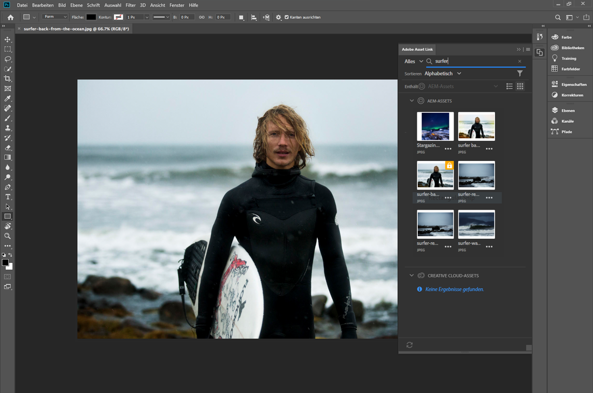
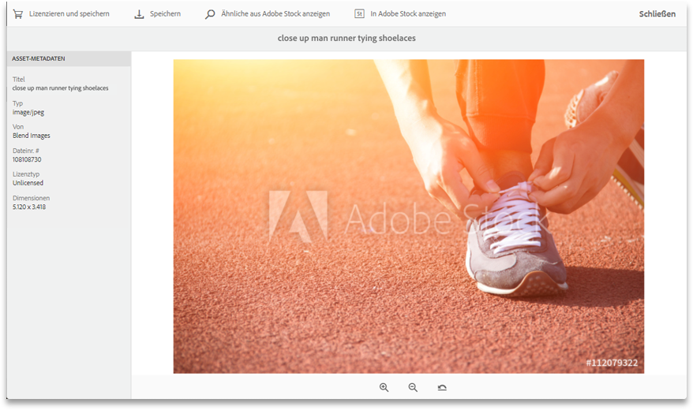
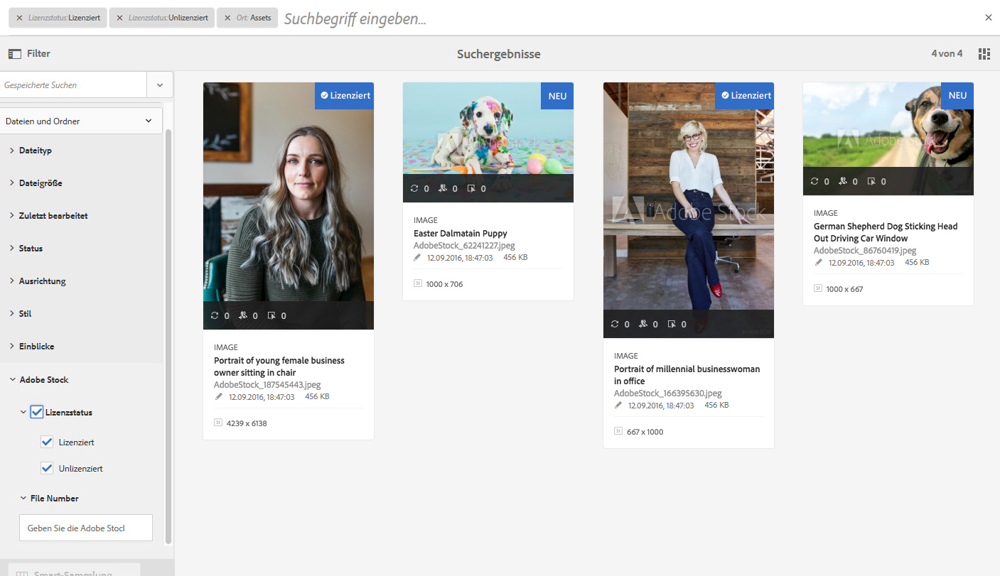
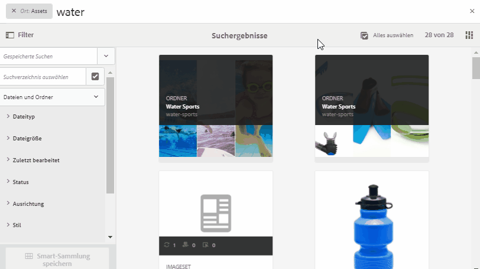

# [!DNL Adobe Experience Manager Assets] Versionshinweise  {#aem-assets-release-notes}

Hier finden Sie die wichtigsten Funktionen und Highlights der [!DNL Adobe Experience Manager] 6.5 [!DNL Assets]-Version.

## Integration mit [!DNL Adobe Creative Cloud] und kreativen Workflows {#integration-with-adobe-creative-cloud-and-creative-workflows}

[!DNL Adobe Experience Manager] bietet verschiedene Möglichkeiten, um zu integrieren und Assets für die Verwendung in Workflows freizugeben, in denen Kreativ-, Marketing- oder Businessteams eng zusammenarbeiten. [!DNL Adobe Creative Cloud] [!DNL Experience Manager] 6.5 ermöglicht eine noch bessere Integration und stärkere Optimierung. Das Ergebnis: mehr Chancen und die Verbesserung vorhandener Methoden.

Lesen Sie weiter, um die spezifischen Funktionen und Integrationen von [!DNL Experience Manager] 6.5 zu erfahren, die Sie nutzen können, um Ihre Anwendungsfälle mit hoher Inhaltsgeschwindigkeit optimal zu unterstützen.

### Adobe Asset Link {#aal}

[!DNL Adobe Asset Link] stärkt die Zusammenarbeit zwischen Kreativen und Marketingexperten bei der Inhaltserstellung. Kreative können auf Inhalte zugreifen, die in [!DNL Experience Manager Assets] gespeichert sind, ohne die Apps zu verlassen, mit denen sie am besten vertraut sind. Kreative können Assets nahtlos durchsuchen, suchen, auschecken und einchecken, indem sie das In-App-Bedienfeld in den Anwendungen [!DNL Adobe Photoshop], [!DNL Adobe Illustrator] und [!DNL Adobe InDesign] verwenden.

[!DNL Adobe Asset Link] ist Teil des  [Creative Cloud für ](https://www.adobe.com/creativecloud/business/enterprise.html) Unternehmensangebote. Weitere Informationen dazu, einschließlich der erforderlichen Konfiguration Ihrer [!DNL Experience Manager]-Implementierung, finden Sie unter [Adobe Asset Link](https://helpx.adobe.com/de/enterprise/using/adobe-asset-link.html).

### [!DNL Adobe Stock] Integration {#stock}

Ihr Unternehmen kann seinen [!DNL Adobe Stock]-Unternehmensplan innerhalb von [!DNL Experience Manager Assets] verwenden, um sicherzustellen, dass lizenzierte Assets für kreative und Marketing-Projekte allgemein verfügbar sind. Sie können mithilfe der leistungsstarken DAM-Funktionen von [!DNL Experience Manager] schnell [!DNL Adobe Stock] in Experience Manager gespeicherte  Assets suchen, in einer Vorschau anzeigen und lizenzieren.

Der [!DNL Adobe Stock]-Service bietet Designern und Unternehmen Zugang zu Millionen von hochwertigen, kuratierten und gebührenfreien Fotos, Vektorgrafiken, Illustrationen, Videos, Vorlagen und 3D-Assets für sämtliche Kreativprojekte. 

Weitere Informationen finden Sie unter [Verwenden von Adobe Stock-Assets in Experience Manager Assets](/help/assets/aem-assets-adobe-stock.md).

*Abbildung: Vorschau  [!DNL Adobe Stock] von Bild und Lizenz von  [!DNL Experience Manager Assets]innen anzeigen.*

*Abbildung: Suchen und filtern Sie die lizenzierten  [!DNL Adobe Stock] Bilder in  [!DNL Experience Manager].*

### Dynamische Referenzen in [!DNL Adobe InDesign] {#dynamic-references-in-indesign}

[!DNL Experience Manager Assets] in  [!DNL Adobe InDesign] Dateien verwendet werden, sind dynamisch. Die Verweise werden automatisch aktualisiert, wenn die referenzierten Assets im Repository verschoben werden. Weitere Informationen finden Sie unter [Verwalten von ebenenübergreifenden Assets](/help/assets/managing-linked-subassets.md).

## Brand Portal-Funktionen {#brand-portal-capabilities}

[!DNL Experience Manager Assets Brand Portal]Mit können Sie problemlos genehmigte Assets abrufen, diese wirksam kontrollieren und sicher und geräteübergreifend an externe Anbieter/Agenturen und interne Geschäftsanwender verteilen. Brand Portal ermöglicht eine effizientere Asset-Freigabe sowie schnellere Time-to-Market für Assets und verringert das Risiko von Nicht-Compliance und unbefugtem Zugriff.

Weitere Informationen finden Sie unter [Neue Funktionen in AEM Assets Brand Portal](https://experienceleague.adobe.com/docs/experience-manager-brand-portal/using/introduction/whats-new.html?lang=de#introduction).

## Connected Assets {#connectedassets}

In großen Unternehmen kann die zur Erstellung von Websites erforderliche Infrastruktur verteilt werden. Manchmal befinden sich die Funktionen zur Website-Erstellung und die hierfür benötigten digitalen Assets in unterschiedlichen Silos.

[!DNL Experience Manager Sites] bietet Funktionen zum Erstellen von Webseiten, während das Digital Asset Management (DAM)-System ist, das die für Websites erforderlichen Assets bereitstellt. [!DNL Experience Manager Assets] [!DNL Experience Manager] unterstützt nun dank Integration von [!DNL Sites] und [!DNL Assets] das obige Nutzungsszenario. Siehe [Konfigurieren und Verwenden der Funktion &quot;Connected Assets&quot;](/help/assets/use-assets-across-connected-assets-instances.md).

![Ziehen eines Assets aus einer  [!DNL Experience Manager] Bereitstellung auf eine  [!DNL Sites] Seite einer anderen  [!DNL Experience Manager] Bereitstellung](assets/connected-assets-drag-and-drop-only.gif)

*Abbildung: Ziehen Sie ein Asset aus einer  [!DNL Experience Manager] Bereitstellung auf einer  [!DNL Sites] Seite auf eine andere  [!DNL Experience Manager] Bereitstellung.*

## Dynamic Media {#dynamic-media}

[!DNL Dynamic Media] bietet ein verbessertes Rich-Media-Authoring und -Versand in ,  [!DNL Experience Manager Assets] um innovative und personalisierte Erlebnisse zu fördern. Durch das Hochladen eines einzelnen Übergeordneten Assets hoher Qualität und die Verwendung unseres erweiterten Cloud-Renderings und der Viewer können Sie jede Kombination von Ausgabeformaten sofort bereitstellen, um die Medienstrategie Ihres Unternehmens zu unterstützen.

Weitere Informationen zu neuen [!DNL Dynamic Media]-Funktionen finden Sie unter [Dynamic Media-Versionshinweise](https://experienceleague.adobe.com/docs/dynamic-media-developer-resources/release-notes/s7rn2017.html).

### 360-Grad-Videounterstützung {#video-support}

Verwalten Sie Ihre 360-Grad-Videodateien direkt in [!DNL Experience Manager], indem Sie die neuesten Viewer verwenden, um VR-Erlebnisse für Desktops, Mobilgeräte und VR-Headsets bereitzustellen. Weitere Informationen finden Sie unter [Verwenden von 360°-Videos](/help/assets/360-video.md).

### Benutzerdefinierte Videominiaturen {#custom-video-thumbnails}

Sie können nun die Miniaturen für Ihre Video-Assets mithilfe von Frames aus dem Video selbst oder aus anderen im DAM gespeicherten Inhalten anpassen. Weitere Anweisungen finden Sie unter [Informationen zu Videominiaturen](/help/assets/video.md#about-video-thumbnails-in-dynamic-media-scene-mode).

### Verbesserte Barrierefreiheit {#accessibility-enhancements}

[!DNL Dynamic Media] Viewer unterstützen jetzt erweiterte Barrierefreiheitsfunktionen wie Aria-Unterstützung, Bildschirmlesehilfen und Alternativtext. Weitere Informationen finden Sie in den [Versionshinweisen zu Dynamic Media-Viewern](https://experienceleague.adobe.com/docs/dynamic-media-developer-resources/library/home.html?lang=de).

## Verbessertes Sucherlebnis {#experience-enhancement-for-searching}

[!DNL Experience Manager] Ab 6.5 können Marketer die gewünschten Assets schneller von der Suchergebnisseite aus finden. Die Suchfacetten werden mit der Anzahl der Assets aktualisiert, noch bevor der Suchfilter angewendet wird. Durch Anzeige der erwarteten Anzahl im Filter können Benutzer effizient durch Suchergebnisse navigieren. Weitere Informationen finden Sie unter [Suchen von Assets in Experience Manager](../assets/search-assets.md).

*Abbildung: Anzeigen der Anzahl der Assets ohne Filterung der Suchergebnisse in Suchfacetten.*

## Größere Anwenderfreundlichkeit {#usability-enhancement}

Sie können jetzt alle geladenen Assets in einem Ordner oder aus einem Suchergebnis in einem Schritt auswählen. Dies ermöglicht eine schnelle Verwaltung aller Assets. Mit dem Kontrollkästchen werden alle Assets ausgewählt, die dem Szenario entsprechen, z. B. ein Suchergebnis und nicht nur die Assets, die in der [!DNL Experience Manager]-Benutzeroberfläche sichtbar sind.

*Abbildung: Verwenden Sie die Option Alle auswählen , um alle geladenen Assets mit einem Klick auszuwählen.*

## Verbesserte Metadaten {#metadata-enhancements}

Mit [!DNL Assets] können Sie Metadatenschemata für Asset-Ordner erstellen, die die auf Seiten mit Ordnereigenschaften angezeigten Layouts und Metadaten definieren. Sie können einem vorhandenen Ordner ein Ordner-Metadatenschema zu diesem Zeitpunkt oder beim Erstellen eines neuen Ordners zuweisen. Weitere Informationen finden Sie unter [Ordner-Metadatenschema](/help/assets/metadata-config.md#folder-metadata-schema).

Beim Festlegen kaskadierender Metadaten können die Optionen zur Laufzeit aus einer JSON-Datei geladen werden, anstatt sie manuell in das Formular einzugeben. Weitere Informationen finden Sie unter [Kaskadierende Metadaten](/help/assets/metadata-schemas.md#cascading-metadata).

## Verbessertes Reporting {#reporting-enhancements}

Die Inhaltsfragmente und Linkfreigaben sind jetzt im heruntergeladenen Bericht enthalten. Weitere Informationen finden Sie unter [Asset-Berichte](/help/assets/asset-reports.md).
