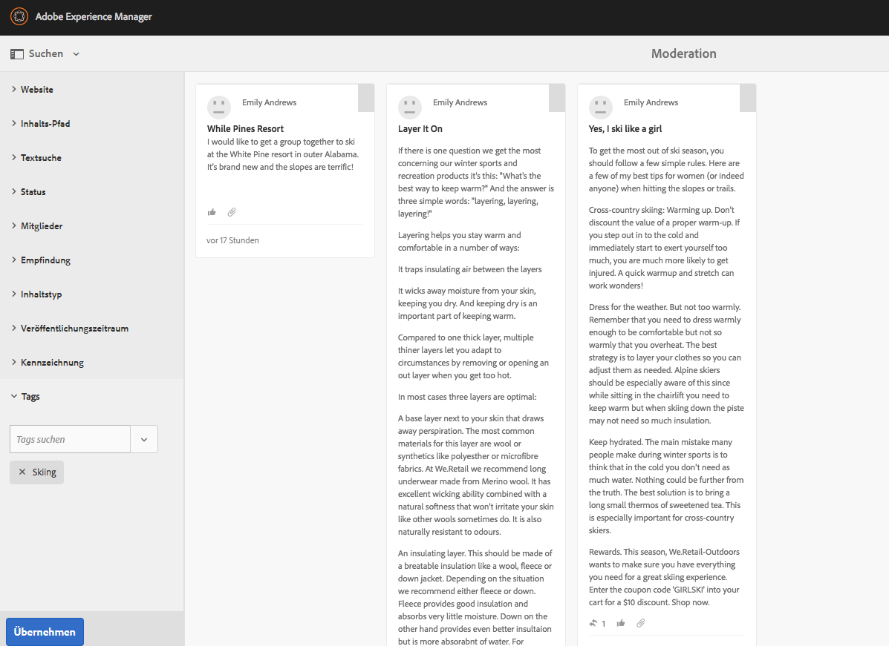
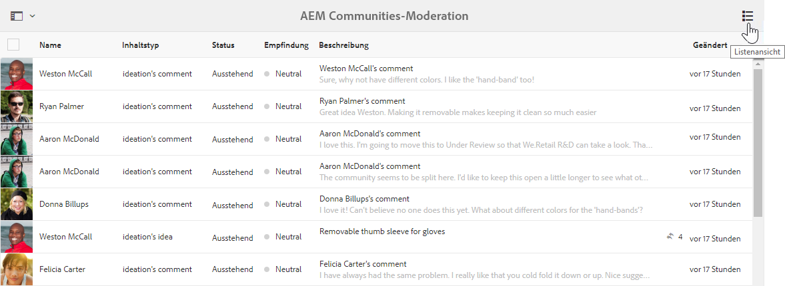
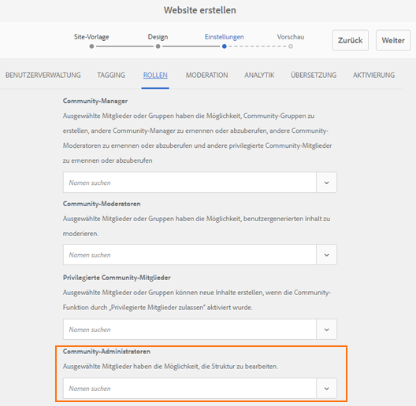

# AEM Communities Versionshinweise {#aem-communities-release-notes}

Im Folgenden werden die an AEM Communities seit Version 6.4 durchgeführten Verbesserungen beschrieben. Ausführlichere Informationen zu den neuen Funktionen finden Sie im [AEM 6.5 Communities-Benutzerhandbuch](https://helpx.adobe.com/de/experience-manager/6-4/communities/user-guide.html).

Informationen dazu, wie Sie die neueste Version erhalten, finden Sie in der Dokumentation unter dem Abschnitt zur [Bereitstellung von Communities](https://helpx.adobe.com/in/experience-manager/6-4/help/communities/deploy-communities.html#LatestReleases).

## Wichtige Verbesserungen {#major-enhancements}

### Verbesserte Community-Aktivierung {#enhancements-to-community-engagement}

**@Mentions**
supportAEM Communities ermöglicht es registrierten Benutzern, andere registrierte Mitglieder in benutzergenerierten Inhalten mit Tags zu versehen (Erwähnung), um sie zu informieren. Die getaggten (erwähnten) Mitglieder werden dann benachrichtigt, und zwar mit einem Deep-Link zu den entsprechenden anwendergenerierten Inhalten. Die Anwender können allerdings Web- und E-Mail-Benachrichtigungen deaktivieren/aktivieren.

Community-Anwender müssen nicht nach ihrem Vornamen, Nachnamen oder Anwendernamen suchen, um festzustellen, ob sich jemand an sie gewendet hat oder ein anderer ihre Hilfe braucht. Außerdem können UGC-Autoren Antwort von bestimmten registrierten Anwendern anfordern, die am besten dazu geeignet sind, ein Problem zu lösen und Feedback zu geben.

Die Community-Administratoren müssen **Erwähnung aktivieren** in Community-Komponenten aktivieren, damit registrierte Benutzer die Funktion für diese Komponenten verwenden können.

**Gruppennachrichten**

Registrierte Community-Mitglieder können nun eine einzige E-Mail verfassen und diese direkt per Massenversand an Gruppen senden, anstatt dieselbe Nachricht einzeln an die jeweiligen Gruppenmitglieder verschicken zu müssen. Um [Gruppennachrichten](/help/communities/configure-messaging.md) zuzulassen, aktivieren Sie beide Instanzen von [Messaging Operations Service](/help/communities/messaging.md#group-messaging).

### Verbesserte Massenmoderation {#enhancements-to-bulk-moderation}

Benutzerdefinierte Filter bei der Massenmoderation

[Benutzerdefinierte ](/help/communities/moderation.md#custom-filters) Filter können jetzt entwickelt und der Benutzeroberfläche für die Massenmoderation hinzugefügt werden.

Ein in [Github](https://github.com/Adobe-Marketing-Cloud/aem-communities-extensions/tree/master/aem-communities-moderation-filter) vorhandenes [Beispielprojekt](https://github.com/Adobe-Marketing-Cloud/aem-communities-extensions/tree/master/aem-communities-moderation-filter) zeigt das Filtern nach Tags. Dieses Projekt kann als Grundlage zum Entwickeln analoger benutzerdefinierter Filter verwendet werden.

**Listenansicht bei Massenmoderation**

Eine neue Listenansicht mit verbesserter UI wurde im Bereich für Massenmoderation bereitgestellt, um Einträge zu anwendergenerierten Inhalten anzuzeigen.

### Verbesserte Site- und Gruppenverwaltung {#enhancements-to-site-and-group-management}

**Autorseitige Site- und Gruppenadministratoren**

Communities ermöglicht ab AEM 6.5 das dezentrale Verwalten (und Managen) verschiedener Community-Sites und Gruppen/verschachtelter Gruppen. Organisationen, die mehrere Community-Sites und verschachtelte Gruppen hosten, können nun beim Erstellen der Site (Gruppe) autorseitig Mitglieder für Administratorrollen auswählen.

Site-Administratoren können eine Gruppe auf jeder Hierarchieebene erstellen und zu Standardadministratoren werden. Diese Administratoren können später von anderen Gruppenadministratoren entfernt werden. Gruppenadministratoren können ihre Gruppe G1 verwalten und eine unter G1 verschachtelte Untergruppe erstellen.

### Verbesserte Aktivierung {#enhancements-to-enablement}

**SCORM 2017.1-Unterstützung**

Die Aktivierungsfunktion von AEM 6.5 Communities unterstützt die Engine Shareable Content Object Reference Model [(SCORM) 2017.1](https://rusticisoftware.com/blog/scorm-engine-2017-released/).

* Unterstützung der Tastaturnavigation bei Aktivierungskomponenten
* Aktivierungskomponenten (z. B. Katalog- und Kurswiedergabe, Zuweisungen, Dateibibliothek) in AEM Communities unterstützen die Tastaturnavigation für eine verbesserte Barrierefreiheit.

### Weitere Verbesserungen {#other-enhancements}

* Unterstützung für Solr 7
* AEM 6.5 Communities unterstützt die Apache Solr 7.0-Version der Suchplattform bei der Einrichtung von MSRP und DSRP.
